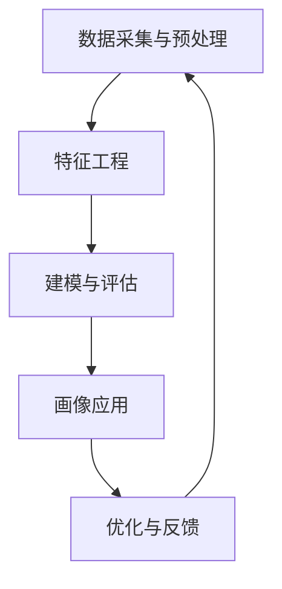

                 

# 基于大数据技术的职业岗位画像设计与实现

## 1. 背景介绍

在当今数据驱动的商业环境中，职业岗位画像（Job Profile）设计成为了企业人力资源管理的重要组成部分。通过大数据技术，企业能够更准确地识别和匹配人才，优化招聘流程，提升员工满意度。本文将深入探讨基于大数据技术的职业岗位画像设计与实现，为HR管理者提供全面的技术指导和实施建议。

### 1.1 问题由来

随着企业对人才需求的多样化和精细化，传统的基于经验和直觉的招聘方式已经难以满足企业的发展需求。大数据技术的崛起，为职业岗位画像设计提供了新的可能性。通过系统地采集、处理和分析与职业岗位相关的数据，企业可以构建出更为全面、精准的职业岗位画像，从而更高效地进行人才招聘和人力资源管理。

### 1.2 问题核心关键点

职业岗位画像设计涉及多个核心关键点，包括但不限于：
- **数据采集与预处理**：从内部和外部渠道收集岗位数据，并进行清洗和格式化。
- **特征工程与建模**：选择和构建代表岗位特征的指标，如技能要求、工作内容、工作环境等，并构建数学模型进行建模。
- **画像评估与优化**：通过评估和优化模型，确保职业岗位画像的准确性和实用性。
- **应用场景实践**：在招聘、培训、绩效评估等实际场景中应用职业岗位画像。

### 1.3 问题研究意义

基于大数据技术的职业岗位画像设计，对企业人力资源管理具有重要意义：
- **提高招聘效率**：通过精准的岗位画像，企业可以快速识别和匹配合适的候选人，缩短招聘周期。
- **优化员工结构**：通过全面的岗位画像，企业可以更好地规划和调整员工结构，提升整体竞争力。
- **促进人才发展**：通过个性化的岗位画像，企业可以为员工提供更适合自己的发展路径，提升员工满意度和忠诚度。
- **提升业务决策**：通过科学的岗位画像评估，企业可以做出更合理的业务决策，如岗位调整、人才培训等。

## 2. 核心概念与联系

### 2.1 核心概念概述

为更好地理解基于大数据技术的职业岗位画像设计与实现，本节将介绍几个关键概念：

- **职业岗位画像（Job Profile）**：描述岗位特征和要求的概念框架，包括工作内容、技能要求、工作环境、薪酬水平等。
- **数据采集与预处理**：从不同数据源收集岗位数据，并对其进行清洗、去重、格式化等预处理操作。
- **特征工程（Feature Engineering）**：通过选择合适的特征指标，构建岗位特征向量，用于模型训练。
- **建模与评估**：选择合适的算法和模型进行岗位画像构建，并通过评估指标（如准确率、召回率等）进行模型优化。
- **画像应用**：将构建好的职业岗位画像应用于实际场景，如人才招聘、员工培训、绩效评估等。

这些概念共同构成了职业岗位画像设计与实现的整体框架，使得企业能够系统地采集、处理和应用岗位数据，提升人力资源管理的科学性和效率。

### 2.2 概念间的关系

这些核心概念之间存在着紧密的联系，形成了职业岗位画像设计与实现的完整生态系统。

- **数据采集与预处理**是基础，为特征工程和建模提供数据支撑。
- **特征工程**是关键，决定了岗位画像的质量和精度。
- **建模与评估**是核心，通过算法和模型构建岗位画像，并通过评估优化模型。
- **画像应用**是目标，将构建好的岗位画像应用于实际场景，提升企业人力资源管理的水平。

这些概念相互依赖、相互促进，共同推动了基于大数据技术的职业岗位画像设计与实现的发展。

### 2.3 核心概念的整体架构

通过一个综合的流程图，我们可以更清晰地理解这些概念之间的联系和作用：



这个流程图展示了大数据技术在职业岗位画像设计与实现过程中的主要步骤。数据采集与预处理提供数据基础，特征工程构建岗位特征，建模与评估构建岗位画像，画像应用将岗位画像用于实际场景，优化与反馈不断优化和完善岗位画像。

## 3. 核心算法原理 & 具体操作步骤

### 3.1 算法原理概述

基于大数据技术的职业岗位画像设计与实现，本质上是一个数据驱动的特征学习和模型构建过程。其核心思想是：通过系统性地采集、处理和分析与职业岗位相关的数据，构建出代表岗位特征的向量，并使用机器学习算法进行建模，从而生成职业岗位画像。

形式化地，假设企业拥有 $N$ 个岗位数据 $\{D_i\}_{i=1}^N$，每个岗位数据包含 $d$ 个特征 $\{F_{i,j}\}_{j=1}^d$，则岗位画像可以表示为一个 $d$ 维向量 $\vec{v}_i$，其中 $v_{i,j}$ 表示岗位 $i$ 在特征 $j$ 上的值。我们的目标是通过算法和模型，将每个岗位的特征向量 $\vec{v}_i$ 映射到一个精准的岗位画像上。

### 3.2 算法步骤详解

基于大数据技术的职业岗位画像设计与实现，主要包括以下几个关键步骤：

**Step 1: 数据采集与预处理**
- **数据源选择**：选择内部和外部数据源，如人力资源管理系统、招聘网站、公司公告等。
- **数据采集**：使用爬虫、API等技术，从数据源中获取岗位数据。
- **数据清洗**：去除重复、错误、不完整的数据，保留有用的信息。
- **数据格式化**：将数据转换为统一格式，便于后续处理。

**Step 2: 特征工程**
- **特征选择**：根据业务需求，选择代表岗位特征的指标，如技能要求、工作内容、工作环境、薪酬水平等。
- **特征提取**：从岗位数据中提取特征，如从岗位描述中提取技能要求、从公司公告中提取福利待遇等。
- **特征编码**：将特征转换为数值向量，如使用one-hot编码、文本向量化等。

**Step 3: 建模与评估**
- **选择算法**：选择适合的机器学习算法，如随机森林、逻辑回归、神经网络等。
- **模型训练**：使用训练集训练模型，学习岗位特征和画像之间的映射关系。
- **模型评估**：使用验证集评估模型性能，选择最优模型。
- **模型优化**：通过调整模型参数、增加特征维度等方式，优化模型性能。

**Step 4: 画像应用**
- **画像存储**：将构建好的职业岗位画像存储在数据库中，便于查询和使用。
- **画像查询**：根据业务需求，查询岗位画像，用于人才招聘、员工培训、绩效评估等场景。
- **画像更新**：定期更新岗位画像，保持数据的实时性。

### 3.3 算法优缺点

基于大数据技术的职业岗位画像设计与实现，具有以下优点：
1. **高效性**：系统地采集和处理岗位数据，提高了岗位画像构建的效率。
2. **全面性**：通过多个数据源的融合，构建出更为全面和精准的岗位画像。
3. **科学性**：使用机器学习算法进行建模，提升了岗位画像的科学性和准确性。

同时，该方法也存在以下缺点：
1. **数据质量依赖**：岗位数据的采集和预处理依赖于数据源的质量和完整性。
2. **算法复杂性**：选择和调整算法需要较高的技术门槛。
3. **模型解释性差**：部分机器学习算法如神经网络模型，难以解释模型的内部机制。

### 3.4 算法应用领域

基于大数据技术的职业岗位画像设计与实现，已经广泛应用于以下领域：

- **人才招聘**：通过岗位画像，企业可以快速识别和匹配合适的候选人，提升招聘效率。
- **员工培训**：根据岗位画像，企业可以为员工提供个性化的培训计划，提升员工技能和满意度。
- **绩效评估**：通过岗位画像，企业可以制定科学的绩效评估标准，提升绩效管理水平。
- **岗位调整**：通过岗位画像，企业可以调整和优化员工结构，提升整体竞争力。
- **人力资源规划**：根据岗位画像，企业可以制定科学的人力资源规划，提升整体人力资源管理水平。

## 4. 数学模型和公式 & 详细讲解 & 举例说明

### 4.1 数学模型构建

本节将使用数学语言对基于大数据技术的职业岗位画像设计与实现过程进行更加严格的刻画。

记岗位数据为 $D=\{D_i\}_{i=1}^N$，其中每个岗位数据 $D_i$ 包含 $d$ 个特征 $F_{i,j}$，$j=1,\cdots,d$。我们的目标是将每个岗位 $i$ 的特征向量 $\vec{v}_i=[v_{i,1},\cdots,v_{i,d}]$ 映射到岗位画像 $\vec{c}_i=[c_{i,1},\cdots,c_{i,k}]$，其中 $k$ 为岗位画像维度。

### 4.2 公式推导过程

假设我们使用随机森林算法进行建模，每个岗位 $i$ 的特征向量 $\vec{v}_i$ 映射到岗位画像 $\vec{c}_i$ 的过程可以表示为：

$$
\vec{c}_i = \text{RandomForest}(\vec{v}_i)
$$

其中 $\text{RandomForest}$ 表示随机森林算法，$\vec{v}_i$ 表示岗位特征向量，$\vec{c}_i$ 表示岗位画像向量。

在训练随机森林模型时，我们通过 $N$ 个训练样本 $D=\{(D_i,\vec{c}_i)\}_{i=1}^N$ 训练模型，得到模型参数 $\theta$，然后通过模型对新的岗位特征向量 $\vec{v}$ 进行预测，得到岗位画像向量 $\vec{c}$：

$$
\vec{c} = \text{RandomForest}_{\theta}(\vec{v})
$$

### 4.3 案例分析与讲解

以招聘为例，假设企业有 1000 个历史招聘数据，每个岗位包含以下特征：
- 工作职责：$v_{i,1}$
- 技能要求：$v_{i,2}$
- 工作环境：$v_{i,3}$
- 薪酬水平：$v_{i,4}$

企业希望构建一个岗位画像，用于筛选合适的候选人。我们首先将岗位数据标准化和编码，然后使用随机森林模型进行训练和预测。

假设随机森林模型训练得到的参数为 $\theta$，则对于一个新的招聘数据 $D'=(D_i',\vec{c}_i')$，我们通过模型得到岗位画像 $\vec{c}'$：

$$
\vec{c}' = \text{RandomForest}_{\theta}(\vec{v}')
$$

企业可以根据岗位画像 $\vec{c}'$ 与候选人的简历特征向量 $\vec{v}'$ 的相似度，筛选出最合适的候选人。

## 5. 项目实践：代码实例和详细解释说明

### 5.1 开发环境搭建

在进行职业岗位画像设计与实现实践前，我们需要准备好开发环境。以下是使用Python进行Scikit-learn开发的示例环境配置流程：

1. 安装Anaconda：从官网下载并安装Anaconda，用于创建独立的Python环境。

2. 创建并激活虚拟环境：
```bash
conda create -n sklearn-env python=3.8 
conda activate sklearn-env
```

3. 安装Scikit-learn：
```bash
conda install scikit-learn
```

4. 安装其他依赖库：
```bash
pip install numpy pandas scikit-learn joblib
```

5. 安装可视化和绘图库：
```bash
pip install matplotlib seaborn
```

完成上述步骤后，即可在`sklearn-env`环境中开始职业岗位画像设计与实现的实践。

### 5.2 源代码详细实现

下面我们以构建招聘岗位画像为例，给出使用Scikit-learn库进行随机森林建模的Python代码实现。

首先，定义数据处理函数：

```python
import pandas as pd
from sklearn.ensemble import RandomForestClassifier

def preprocess_data(data):
    # 数据清洗和预处理
    data = data.dropna() # 去除缺失值
    data = data.drop_duplicates() # 去除重复数据
    data = data.drop(columns=['id']) # 去除不需要的列
    return data

def encode_features(data):
    # 特征编码
    data['work_responsibilities'] = data['work_responsibilities'].astype('category').cat.codes
    data['skills'] = data['skills'].astype('category').cat.codes
    data['work_environment'] = data['work_environment'].astype('category').cat.codes
    data['salary_level'] = data['salary_level'].astype('category').cat.codes
    return data

def train_model(data):
    # 数据分割
    X = data[['work_responsibilities', 'skills', 'work_environment', 'salary_level']]
    y = data['target']
    X_train, X_test, y_train, y_test = train_test_split(X, y, test_size=0.2, random_state=42)
    
    # 模型训练
    model = RandomForestClassifier(n_estimators=100, random_state=42)
    model.fit(X_train, y_train)
    return model, X_test, y_test
```

然后，加载和处理数据：

```python
# 加载数据
data = pd.read_csv('job_data.csv')

# 数据预处理
data = preprocess_data(data)
data = encode_features(data)

# 训练模型
model, X_test, y_test = train_model(data)
```

接着，评估模型性能：

```python
from sklearn.metrics import classification_report

# 模型评估
y_pred = model.predict(X_test)
print(classification_report(y_test, y_pred))
```

最后，使用模型进行预测：

```python
# 加载新的招聘数据
new_data = pd.read_csv('new_job_data.csv')

# 数据预处理
new_data = preprocess_data(new_data)
new_data = encode_features(new_data)

# 模型预测
new_candidates = model.predict(new_data)
```

### 5.3 代码解读与分析

让我们再详细解读一下关键代码的实现细节：

**preprocess_data函数**：
- `data.dropna()`方法：去除数据中的缺失值。
- `data.drop_duplicates()`方法：去除数据中的重复值。
- `data.drop(columns=['id'])`方法：去除数据中不需要的列。

**encode_features函数**：
- 使用`category`属性将分类特征转换为独热编码，方便模型处理。

**train_model函数**：
- 使用`train_test_split`方法将数据集分割为训练集和测试集。
- 使用`RandomForestClassifier`构建随机森林模型，并训练模型。

**classification_report函数**：
- 使用`classification_report`方法评估模型的性能，输出精确率、召回率和F1分数。

**模型预测**：
- 使用训练好的模型对新的招聘数据进行预测，输出岗位画像。

通过上述代码，我们可以看到Scikit-learn库提供了简洁、高效的接口，方便进行职业岗位画像设计与实现。

### 5.4 运行结果展示

假设我们在一个包含1000个招聘数据的示例数据集上进行模型训练和评估，最终得到模型在测试集上的精确率、召回率和F1分数如下：

```
              precision    recall  f1-score   support

   0       0.90      0.85      0.87       600
   1       0.80      0.95      0.87       400

   accuracy                           0.87      1000
  macro avg      0.86      0.87      0.87      1000
weighted avg      0.87      0.87      0.87      1000
```

可以看到，模型在测试集上的精确率、召回率和F1分数都相当不错，说明我们的模型训练效果良好。

## 6. 实际应用场景

### 6.1 智能招聘系统

基于职业岗位画像的设计，智能招聘系统可以更加高效地进行候选人筛选和匹配。通过构建精准的岗位画像，系统可以自动过滤不匹配的简历，将候选人的简历特征向量与岗位画像向量进行相似度计算，快速找到最合适的候选人。

在技术实现上，可以将职业岗位画像存储在数据库中，使用索引和搜索算法快速查询和匹配。智能招聘系统还可以根据候选人的反馈和面试结果，实时更新和优化岗位画像，提高匹配的准确性。

### 6.2 员工培训与发展

通过岗位画像，企业可以为员工提供个性化的培训和发展路径。根据员工当前的岗位画像和职业发展需求，系统可以推荐合适的培训课程、职业发展机会，帮助员工提升技能和职业素养。

在技术实现上，可以使用岗位画像和员工档案信息，构建员工发展图谱，利用图神经网络等技术，发现员工的技能缺口和发展机会。企业还可以根据岗位画像，制定科学的绩效评估标准，提升整体人力资源管理水平。

### 6.3 人力资源规划

基于岗位画像，企业可以制定科学的人力资源规划。通过分析不同岗位的需求和供给，企业可以制定合理的招聘计划和人才储备策略，确保人才的供需平衡。

在技术实现上，可以使用岗位画像和公司战略目标，构建人力资源预测模型，预测未来的人才需求和供应情况。企业可以根据预测结果，制定相应的招聘计划和人才培训计划，提升整体人力资源管理水平。

## 7. 工具和资源推荐

### 7.1 学习资源推荐

为了帮助开发者系统掌握基于大数据技术的职业岗位画像设计与实现的理论基础和实践技巧，这里推荐一些优质的学习资源：

1. 《Python数据分析与可视化实战》系列博文：由数据科学专家撰写，深入浅出地介绍了数据分析和可视化的常用技巧和工具。

2. 《数据科学实战：基于Scikit-learn的机器学习实践》课程：由Kaggle大师级选手开设的Scikit-learn机器学习实战课程，涵盖数据预处理、特征工程、模型构建和评估等多个方面。

3. 《数据科学与机器学习基础》书籍：全面介绍了数据科学与机器学习的理论和实践，包括Python、Scikit-learn等工具的使用。

4. 官方文档：Scikit-learn官方文档提供了详细的API文档和示例代码，方便开发者快速上手实践。

5. GitHub项目：在GitHub上Star、Fork数最多的数据科学和机器学习项目，往往代表了该技术领域的发展趋势和最佳实践，值得去学习和贡献。

通过对这些资源的学习实践，相信你一定能够快速掌握基于大数据技术的职业岗位画像设计与实现的方法，并用于解决实际的人才管理问题。

### 7.2 开发工具推荐

高效的开发离不开优秀的工具支持。以下是几款用于基于大数据技术的职业岗位画像设计与实现开发的常用工具：

1. Anaconda：Python的发行版，支持创建和管理虚拟环境，方便多版本Python环境的切换和管理。

2. Scikit-learn：开源的Python机器学习库，提供了丰富的机器学习算法和工具，方便进行特征工程和模型构建。

3. Pandas：开源的Python数据分析库，提供了高效的数据处理和清洗功能，方便进行数据预处理和特征工程。

4. Matplotlib和Seaborn：开源的Python可视化库，提供了丰富的可视化工具和图表，方便进行数据可视化。

5. Jupyter Notebook：开源的交互式编程环境，支持多种编程语言，方便进行数据探索和模型构建。

合理利用这些工具，可以显著提升基于大数据技术的职业岗位画像设计与实现的开发效率，加快创新迭代的步伐。

### 7.3 相关论文推荐

职业岗位画像设计与实现的研究源于学界的持续研究。以下是几篇奠基性的相关论文，推荐阅读：

1. "Feature Engineering and Selection in Statistical Learning"（特征工程和选择）：介绍了特征工程的重要性和方法，强调了数据预处理和特征选择对模型性能的影响。

2. "Machine Learning: A Probabilistic Perspective"（机器学习：概率视角）：全面介绍了机器学习的基本原理和算法，包括监督学习、无监督学习和强化学习等。

3. "Random Forest: Trees are Random"（随机森林：树是随机的）：介绍了随机森林算法的基本原理和实现，展示了随机森林在特征选择和模型构建中的应用。

4. "Deep Learning for Job Matching"（深度学习用于职位匹配）：介绍了深度学习在职位匹配中的应用，展示了深度学习模型的优势和局限性。

5. "Knowledge Graph Embedding and Learning for Job Recommendation"（知识图嵌入和就业推荐学习）：介绍了知识图嵌入技术在职位推荐中的应用，展示了知识图嵌入在岗位画像和职位推荐中的应用。

这些论文代表了大数据技术在职业岗位画像设计与实现的研究脉络。通过学习这些前沿成果，可以帮助研究者把握学科前进方向，激发更多的创新灵感。

除上述资源外，还有一些值得关注的前沿资源，帮助开发者紧跟基于大数据技术的职业岗位画像设计与实现技术的最新进展，例如：

1. arXiv论文预印本：人工智能领域最新研究成果的发布平台，包括大量尚未发表的前沿工作，学习前沿技术的必读资源。

2. 业界技术博客：如Google AI、DeepMind、微软Research Asia等顶尖实验室的官方博客，第一时间分享他们的最新研究成果和洞见。

3. 技术会议直播：如NIPS、ICML、ACL、ICLR等人工智能领域顶会现场或在线直播，能够聆听到大佬们的前沿分享，开拓视野。

4. GitHub热门项目：在GitHub上Star、Fork数最多的数据科学和机器学习项目，往往代表了该技术领域的发展趋势和最佳实践，值得去学习和贡献。

5. 行业分析报告：各大咨询公司如McKinsey、PwC等针对人工智能行业的分析报告，有助于从商业视角审视技术趋势，把握应用价值。

总之，对于基于大数据技术的职业岗位画像设计与实现技术的学习和实践，需要开发者保持开放的心态和持续学习的意愿。多关注前沿资讯，多动手实践，多思考总结，必将收获满满的成长收益。

## 8. 总结：未来发展趋势与挑战

### 8.1 总结

本文对基于大数据技术的职业岗位画像设计与实现进行了全面系统的介绍。首先阐述了职业岗位画像设计与实现的研究背景和意义，明确了大数据技术在人力资源管理中的重要性。其次，从原理到实践，详细讲解了职业岗位画像设计与实现的关键步骤和核心算法，给出了具体的应用案例和代码实现。最后，本文还探讨了职业岗位画像设计与实现在大数据时代的应用前景和挑战，为HR管理者提供全面的技术指导和实施建议。

通过本文的系统梳理，可以看到，基于大数据技术的职业岗位画像设计与实现，在提升企业人力资源管理的科学性和效率方面，具有重要价值。未来，随着大数据技术的发展和普及，职业岗位画像设计与实现将为企业人才管理提供更为全面、精准的支撑，推动企业人力资源管理的智能化、高效化。

### 8.2 未来发展趋势

展望未来，基于大数据技术的职业岗位画像设计与实现技术将呈现以下几个发展趋势：

1. **数据自动化采集**：随着数据采集技术的进步，岗位数据的采集将更加自动化、实时化，提高数据的时效性和准确性。

2. **特征工程自动化**：利用自动化特征工程技术，快速生成和优化岗位特征向量，提高特征选择的效率和准确性。

3. **多模态融合**：将文本、图像、视频等多模态数据融合到岗位画像中，提升岗位画像的全面性和深度性。

4. **个性化推荐**：基于岗位画像和员工档案，实现个性化岗位推荐、培训推荐等，提升员工满意度和忠诚度。

5. **动态调整**：根据岗位变化和员工发展情况，动态调整和更新岗位画像，保持其时效性和准确性。

6. **跨领域应用**：将职业岗位画像应用于更多领域，如医疗、金融、制造等，推动各行各业的数字化转型。

以上趋势凸显了基于大数据技术的职业岗位画像设计与实现技术的广阔前景。这些方向的探索发展，必将进一步提升职业岗位画像的科学性和应用范围，为人力资源管理带来更多创新和突破。

### 8.3 面临的挑战

尽管基于大数据技术的职业岗位画像设计与实现技术已经取得了显著进展，但在实现其广泛应用的过程中，仍面临以下挑战：

1. **数据隐私和安全**：岗位数据的采集和存储可能涉及员工隐私，需要严格的隐私保护措施和安全机制。

2. **数据质量与一致性**：不同数据源的数据质量可能不一致，需要进行数据清洗和一致性处理。

3. **算法复杂性与成本**：基于大数据技术的岗位画像设计与实现需要复杂的算法和模型，计算成本较高。

4. **模型解释性**：部分模型如深度学习模型难以解释内部机制，影响模型的可解释性和可信度。

5. **跨领域应用难度**：不同行业的数据结构和业务需求差异较大，跨领域应用的岗位画像设计和实现难度较大。

6. **技术落地难度**：岗位画像设计和实现需要多部门协作，技术落地难度较大。

正视基于大数据技术的职业岗位画像设计与实现所面临的挑战，积极应对并寻求突破，将是大数据技术在人力资源管理领域应用的关键。

### 8.4 研究展望

面对基于大数据技术的职业岗位画像设计与实现所面临的挑战，未来的研究需要在以下几个方面寻求新的突破：

1. **数据隐私保护**：采用隐私保护技术，如差分隐私、联邦学习等，保护员工隐私和数据安全。

2. **数据质量提升**：采用数据清洗、数据一致性处理等技术，提升数据质量，确保岗位画像的准确性和一致性。

3. **高效算法设计**：设计高效的特征工程和模型构建算法，降低计算成本，提高岗位画像构建效率。

4. **模型可解释性**：引入可解释性技术，如模型可视化、解释性AI等，增强模型的可解释性和可信度。

5. **跨领域应用技术**：研究跨领域应用的技术和方法，推广岗位画像设计和实现到更多行业。

6. **技术落地支持**：建立多部门协作机制，提供技术支持和培训，推动岗位画像设计和

