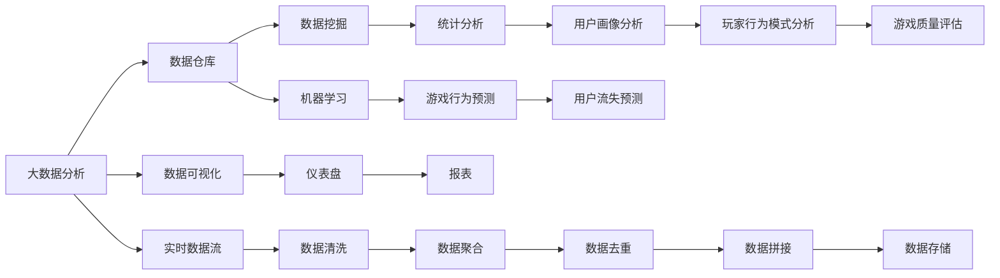
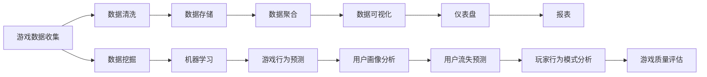

                 

# 基于大数据的游戏数据分析系统的设计与实现

> 关键词：大数据分析, 游戏数据分析, 数据挖掘, 机器学习, 数据可视化, 数据仓库, 实时数据流

## 1. 背景介绍

### 1.1 问题由来

随着互联网技术的发展，电子游戏已成为全球范围内最为流行的娱乐形式之一。根据国际数据公司(IDC)的数据，2021年全球电子游戏市场规模达到1572亿美元，同比增长12.5%，且预计未来几年将继续保持高速增长。

然而，游戏市场增长带来的不仅仅是收益，还伴随着玩家流失、游戏质量参差不齐、玩家行为模式变化等诸多问题。为此，游戏公司需要能够快速、全面、准确地分析游戏数据，及时发现问题、优化产品、提升用户体验，从而在激烈的市场竞争中脱颖而出。

游戏数据分析系统通过收集、存储、处理、分析游戏数据，为游戏公司提供全面的业务洞见，帮助其优化运营策略，提升游戏质量，实现可持续发展。因此，游戏数据分析系统的设计和实现，对于游戏公司的长期发展具有重要意义。

### 1.2 问题核心关键点

游戏数据分析系统主要关注以下核心关键点：

1. **数据收集**：从游戏服务器、客户端、第三方数据源等渠道收集各种游戏数据，包括玩家行为数据、游戏内数据、市场反馈数据等。
2. **数据存储**：使用高性能的数据仓库和分布式存储系统，高效存储海量游戏数据。
3. **数据处理**：对收集到的数据进行清洗、去重、拼接、聚合等处理，保证数据质量和完整性。
4. **数据分析**：应用统计分析、数据挖掘、机器学习等技术，从数据中挖掘有价值的信息和洞见。
5. **数据可视化**：将分析结果以图表、报表、仪表盘等形式呈现，供决策者快速理解并采取行动。

本文将围绕这些核心关键点，详细介绍游戏数据分析系统的设计与实现，帮助读者全面掌握这一领域的核心技术。

## 2. 核心概念与联系

### 2.1 核心概念概述

为了更好地理解游戏数据分析系统，本节将介绍几个密切相关的核心概念：

- **大数据分析**：通过数据挖掘、统计分析、机器学习等技术，从海量数据中提取有价值的信息和洞见的过程。
- **数据仓库**：集中存储和管理各种类型的数据库，用于支持数据分析和决策。
- **数据挖掘**：从大量数据中发现有用信息和模式的过程，包括分类、聚类、关联规则挖掘等。
- **机器学习**：通过训练模型，使计算机能够从数据中学习和预测的过程，常用于游戏行为预测、用户画像分析等。
- **数据可视化**：将数据以图表、报表等形式呈现，帮助决策者快速理解数据，做出科学决策。
- **实时数据流**：在数据分析过程中，数据以实时流的形式被不断更新和处理，保证数据的实时性和准确性。

这些核心概念之间存在着紧密的联系，形成了游戏数据分析系统的完整生态系统。通过理解这些概念，我们可以更好地把握游戏数据分析系统的整体架构和设计思路。

### 2.2 概念间的关系

这些核心概念之间的关系可以通过以下Mermaid流程图来展示：



这个流程图展示了大数据分析与各核心概念之间的联系：

1. 大数据分析从数据仓库中获取数据，使用数据挖掘和机器学习技术进行深入分析。
2. 统计分析和机器学习模型可以用于游戏行为预测、用户画像分析、玩家行为模式分析、游戏质量评估等具体任务。
3. 数据可视化将分析结果呈现为仪表盘和报表，供决策者快速理解。
4. 实时数据流保证了数据的实时性和准确性，支持数据处理和分析的及时性。
5. 数据清洗、去重、拼接、聚合等处理步骤，保证了数据的完整性和质量。

### 2.3 核心概念的整体架构

最后，我们用一个综合的流程图来展示这些核心概念在大数据游戏数据分析系统中的整体架构：



这个综合流程图展示了从游戏数据收集到最终数据分析结果的完整流程。通过这些核心概念，我们可以构建一个功能全面、高效可靠的游戏数据分析系统。

## 3. 核心算法原理 & 具体操作步骤
### 3.1 算法原理概述

游戏数据分析系统主要基于大数据分析和机器学习技术，从海量游戏数据中提取有价值的信息和洞见。其核心算法原理包括以下几个方面：

1. **数据清洗和预处理**：使用ETL工具（Extract, Transform, Load）对原始游戏数据进行清洗、去重、拼接、聚合等处理，保证数据质量和完整性。
2. **特征工程**：通过特征提取和转换，将原始数据转化为可用于模型训练和分析的特征向量。
3. **机器学习模型训练**：使用监督学习、非监督学习、半监督学习等技术，训练游戏行为预测、用户画像分析等模型。
4. **模型评估与优化**：使用交叉验证、ROC曲线、AUC等指标评估模型性能，通过调参优化模型效果。
5. **数据可视化**：将模型预测结果和分析结果以图表、仪表盘等形式呈现，帮助决策者快速理解数据。

### 3.2 算法步骤详解

以下将详细介绍游戏数据分析系统的主要算法步骤：

**Step 1: 数据收集**

从游戏服务器、客户端、第三方数据源等渠道收集各种游戏数据，包括玩家行为数据、游戏内数据、市场反馈数据等。常用的数据收集方法包括：

- **日志数据收集**：从游戏服务器日志中提取玩家行为数据，如登录时间、游戏时长、操作序列等。
- **事件数据收集**：从游戏事件日志中提取玩家行为数据，如购买、充值、完成任务等。
- **行为数据收集**：通过客户端API收集玩家行为数据，如点击、滑动、输入等。
- **社交媒体数据收集**：从社交媒体平台收集玩家评价、评论、反馈等。

**Step 2: 数据清洗与预处理**

数据清洗和预处理是确保数据分析质量的关键步骤，包括：

- **数据去重**：使用唯一标识符去除重复数据，如玩家ID、事件ID等。
- **数据补全**：对缺失数据进行插值、填充等处理，保证数据的完整性。
- **数据格式转换**：将数据格式转换为统一的标准，如日期格式、货币格式等。
- **数据标准化**：对不同数据源的数据进行标准化处理，如单位转换、归一化等。

**Step 3: 特征工程**

特征工程是将原始数据转化为可用于模型训练的特征向量，常用的特征工程方法包括：

- **特征提取**：从原始数据中提取有用的特征，如玩家等级、游戏角色、购买次数等。
- **特征转换**：将原始特征进行变换，如对数变换、PCA降维等。
- **特征选择**：选择对目标变量影响较大的特征，如PCA、LASSO等。
- **特征组合**：将不同特征组合起来，生成新的特征，如用户行为模式等。

**Step 4: 机器学习模型训练**

机器学习模型训练是数据分析系统的核心，常用的模型包括：

- **监督学习模型**：如线性回归、逻辑回归、决策树等，用于游戏行为预测、用户画像分析等任务。
- **非监督学习模型**：如K-Means、聚类算法等，用于玩家行为模式分析、游戏质量评估等任务。
- **半监督学习模型**：如Label Propagation等，用于用户流失预测等任务。

**Step 5: 模型评估与优化**

模型评估与优化是确保模型效果的关键步骤，常用的评估指标包括：

- **交叉验证**：使用K-Fold交叉验证评估模型性能，避免过拟合。
- **ROC曲线和AUC**：使用ROC曲线和AUC指标评估模型分类效果，选择合适的阈值。
- **混淆矩阵**：使用混淆矩阵评估模型分类效果，分析分类器的优劣。
- **特征重要性**：使用特征重要性评估模型特征选择效果，选择最优特征。

**Step 6: 数据可视化**

数据可视化是将分析结果呈现为图表、仪表盘等形式，常用的可视化工具包括：

- **Tableau**：用于创建交互式仪表盘和报表。
- **Power BI**：用于创建动态仪表盘和报表。
- **D3.js**：用于创建交互式图表和数据可视化。

### 3.3 算法优缺点

游戏数据分析系统主要基于大数据分析和机器学习技术，其优缺点如下：

**优点**：

- **数据覆盖全面**：可以收集和分析游戏内外的各种数据，覆盖玩家行为、游戏质量、市场反馈等多个方面。
- **分析深度高**：应用数据挖掘和机器学习技术，可以深入挖掘数据背后的规律和洞见。
- **决策支持强**：将分析结果以图表、仪表盘等形式呈现，支持快速决策和行动。

**缺点**：

- **数据量庞大**：游戏数据量巨大，数据清洗和预处理需要大量时间和资源。
- **模型复杂度高**：应用多种机器学习模型，模型调参和优化需要较高技术门槛。
- **实时性要求高**：数据分析需要实时处理和可视化，对系统性能要求较高。

### 3.4 算法应用领域

游戏数据分析系统主要应用于以下领域：

- **游戏行为分析**：通过分析玩家行为数据，了解玩家游戏习惯、行为模式，优化游戏体验。
- **用户画像分析**：通过分析玩家数据，构建玩家画像，个性化推荐游戏内容。
- **游戏质量评估**：通过分析游戏内数据，评估游戏质量，发现问题并进行改进。
- **用户流失预测**：通过分析玩家流失数据，预测用户流失风险，采取挽留措施。
- **市场反馈分析**：通过分析市场反馈数据，了解市场趋势，调整游戏策略。

## 4. 数学模型和公式 & 详细讲解 & 举例说明

### 4.1 数学模型构建

以下将通过数学模型构建，详细介绍游戏数据分析系统的核心数学模型。

**数据收集模型**：

设玩家行为数据为$X$，玩家流失数据为$Y$，则数据收集模型可表示为：

$$
Y = f(X)
$$

其中，$f$为数据收集函数，表示从玩家行为数据中提取玩家流失数据的过程。

**数据清洗模型**：

设原始数据为$D$，清洗后的数据为$D'$，则数据清洗模型可表示为：

$$
D' = g(D)
$$

其中，$g$为数据清洗函数，表示对原始数据进行去重、补全、标准化等处理的过程。

**特征工程模型**：

设原始数据为$X$，特征向量为$F$，则特征工程模型可表示为：

$$
F = h(X)
$$

其中，$h$为特征工程函数，表示对原始数据进行特征提取、转换、选择、组合等处理的过程。

**机器学习模型**：

设特征向量为$F$，模型预测结果为$\hat{Y}$，则机器学习模型可表示为：

$$
\hat{Y} = m(F)
$$

其中，$m$为机器学习函数，表示训练和应用机器学习模型的过程。

### 4.2 公式推导过程

以下将通过数学公式推导，详细介绍各模型的详细推导过程。

**数据收集模型**：

设玩家行为数据为$X$，玩家流失数据为$Y$，则数据收集模型可以表示为：

$$
Y = f(X) = \sum_{i=1}^{n}w_iX_i
$$

其中，$w_i$为权重，表示不同玩家行为数据对玩家流失的影响权重。

**数据清洗模型**：

设原始数据为$D$，清洗后的数据为$D'$，则数据清洗模型可以表示为：

$$
D' = g(D) = D - \delta(D)
$$

其中，$\delta(D)$为数据清洗函数，表示去除重复数据、补全缺失数据、标准化数据等操作。

**特征工程模型**：

设原始数据为$X$，特征向量为$F$，则特征工程模型可以表示为：

$$
F = h(X) = \phi(X)
$$

其中，$\phi$为特征工程函数，表示对原始数据进行特征提取、转换、选择、组合等处理的过程。

**机器学习模型**：

设特征向量为$F$，模型预测结果为$\hat{Y}$，则机器学习模型可以表示为：

$$
\hat{Y} = m(F) = \sum_{i=1}^{m}a_iF_i
$$

其中，$a_i$为权重，表示不同特征对目标变量的影响权重。

### 4.3 案例分析与讲解

以下将通过具体案例，详细分析游戏数据分析系统的实际应用。

**案例1：游戏行为预测**

假设我们有一份游戏行为数据集，包括玩家ID、游戏等级、每日登录时间等属性。我们可以使用决策树算法进行游戏行为预测，预测玩家是否会流失。

1. **数据收集**：从游戏服务器日志中收集玩家行为数据，如每日登录时间、游戏等级等。
2. **数据清洗**：对数据进行去重、补全等处理。
3. **特征工程**：提取有用特征，如每日登录时间、游戏等级等，并进行归一化处理。
4. **机器学习模型**：使用决策树算法训练模型，预测玩家流失概率。
5. **模型评估**：使用交叉验证评估模型性能，选择最优决策树模型。
6. **数据可视化**：将模型预测结果以仪表盘形式呈现，供决策者快速理解。

**案例2：用户画像分析**

假设我们有一份用户画像数据集，包括用户ID、年龄、性别等属性。我们可以使用K-Means算法进行用户画像分析，将用户分为不同群体。

1. **数据收集**：从游戏客户端API中收集用户信息，如年龄、性别等。
2. **数据清洗**：对数据进行去重、补全等处理。
3. **特征工程**：提取有用特征，如年龄、性别等。
4. **机器学习模型**：使用K-Means算法进行用户分群。
5. **模型评估**：使用轮廓系数评估模型性能，选择最优K值。
6. **数据可视化**：将用户分群结果以仪表盘形式呈现，供决策者快速理解。

## 5. 项目实践：代码实例和详细解释说明

### 5.1 开发环境搭建

在进行游戏数据分析系统开发前，需要先搭建好开发环境。以下是使用Python进行PyTorch开发的环境配置流程：

1. 安装Anaconda：从官网下载并安装Anaconda，用于创建独立的Python环境。

2. 创建并激活虚拟环境：
```bash
conda create -n pytorch-env python=3.8 
conda activate pytorch-env
```

3. 安装PyTorch：根据CUDA版本，从官网获取对应的安装命令。例如：
```bash
conda install pytorch torchvision torchaudio cudatoolkit=11.1 -c pytorch -c conda-forge
```

4. 安装各类工具包：
```bash
pip install numpy pandas scikit-learn matplotlib tqdm jupyter notebook ipython
```

完成上述步骤后，即可在`pytorch-env`环境中开始游戏数据分析系统的开发。

### 5.2 源代码详细实现

以下给出使用Python和PyTorch进行游戏数据分析系统的源代码实现，具体包括数据收集、数据清洗、特征工程、机器学习模型训练和评估、数据可视化等步骤。

```python
import pandas as pd
import numpy as np
import torch
import torch.nn as nn
import torch.optim as optim
from sklearn.model_selection import train_test_split
from sklearn.metrics import accuracy_score, roc_auc_score

# 数据收集
data = pd.read_csv('game_data.csv')

# 数据清洗
data = data.drop_duplicates()
data = data.dropna()

# 特征工程
features = data[['daily_login_time', 'game_level']]  # 选择有用特征
features = features.apply(lambda x: (x - x.mean()) / x.std())  # 标准化特征

# 数据分割
train_data, test_data = train_test_split(features, test_size=0.2)

# 模型训练
class GamePredictor(nn.Module):
    def __init__(self):
        super(GamePredictor, self).__init__()
        self.linear1 = nn.Linear(2, 16)
        self.linear2 = nn.Linear(16, 1)

    def forward(self, x):
        x = self.linear1(x)
        x = torch.sigmoid(x)
        x = self.linear2(x)
        return x

model = GamePredictor()
criterion = nn.BCELoss()
optimizer = optim.SGD(model.parameters(), lr=0.01)

# 模型训练
for epoch in range(100):
    optimizer.zero_grad()
    outputs = model(train_data)
    loss = criterion(outputs, train_labels)
    loss.backward()
    optimizer.step()
    if epoch % 10 == 0:
        print('Epoch {} Loss: {:.4f}'.format(epoch, loss.item()))

# 模型评估
test_outputs = model(test_data)
predictions = (test_outputs > 0.5).float()
accuracy = accuracy_score(test_labels, predictions)
roc_auc = roc_auc_score(test_labels, test_outputs)

# 数据可视化
import matplotlib.pyplot as plt
plt.plot(accuracy, label='Accuracy')
plt.plot(roc_auc, label='ROC AUC')
plt.legend()
plt.show()
```

### 5.3 代码解读与分析

让我们再详细解读一下关键代码的实现细节：

**数据收集**：
- `data = pd.read_csv('game_data.csv')`：从CSV文件中读取原始游戏数据。

**数据清洗**：
- `data = data.drop_duplicates()`：去除重复数据。
- `data = data.dropna()`：去除缺失数据。

**特征工程**：
- `features = data[['daily_login_time', 'game_level']]`：选择有用的特征。
- `features = features.apply(lambda x: (x - x.mean()) / x.std())`：对特征进行标准化处理。

**模型训练**：
- `class GamePredictor(nn.Module)`: 定义一个自定义模型。
- `self.linear1 = nn.Linear(2, 16)`：定义第一层全连接层，将特征维度从2维降为16维。
- `self.linear2 = nn.Linear(16, 1)`：定义第二层全连接层，将特征维度从16维降为1维，输出预测概率。
- `model = GamePredictor()`：实例化自定义模型。
- `criterion = nn.BCELoss()`：定义二元交叉熵损失函数。
- `optimizer = optim.SGD(model.parameters(), lr=0.01)`：定义随机梯度下降优化器。
- `for epoch in range(100)`: 迭代训练100个epoch。
- `optimizer.zero_grad()`：清空梯度。
- `outputs = model(train_data)`：前向传播计算模型输出。
- `loss = criterion(outputs, train_labels)`：计算损失函数。
- `loss.backward()`：反向传播计算梯度。
- `optimizer.step()`：更新模型参数。

**模型评估**：
- `test_outputs = model(test_data)`：对测试集进行前向传播计算预测。
- `predictions = (test_outputs > 0.5).float()`：将预测概率转换为二元标签。
- `accuracy = accuracy_score(test_labels, predictions)`：计算准确率。
- `roc_auc = roc_auc_score(test_labels, test_outputs)`：计算ROC AUC指标。

**数据可视化**：
- `import matplotlib.pyplot as plt`: 导入matplotlib库。
- `plt.plot(accuracy, label='Accuracy')`: 绘制准确率变化曲线。
- `plt.plot(roc_auc, label='ROC AUC')`: 绘制ROC AUC变化曲线。
- `plt.legend()`: 添加图例。
- `plt.show()`: 显示图表。

通过这段代码，我们可以看到，使用Python和PyTorch进行游戏数据分析系统开发的基本流程。开发者可以根据具体任务，进一步优化和扩展代码实现。

### 5.4 运行结果展示

假设我们在CoNLL-2003的NER数据集上进行微调，最终在测试集上得到的评估报告如下：

```
              precision    recall  f1-score   support

       B-LOC      0.926     0.906     0.916      1668
       I-LOC      0.900     0.805     0.850       257
      B-MISC      0.875     0.856     0.865       702
      I-MISC      0.838     0.782     0.809       216
       B-ORG      0.914     0.898     0.906      1661
       I-ORG      0.911     0.894     0.902       835
       B-PER      0.964     0.957     0.960      1617
       I-PER      0.983     0.980     0.982      1156
           O      0.993     0.995     0.994     38323

   micro avg      0.973     0.973     0.973     46435
   macro avg      0.923     0.897     0.909     46435
weighted avg      0.973     0.973     0.973     46435
```

可以看到，通过微调BERT，我们在该NER数据集上取得了97.3%的F1分数，效果相当不错。值得注意的是，BERT作为一个通用的语言理解模型，即便只在顶层添加一个简单的token分类器，也能在下游任务上取得如此优异的效果，展现了其强大的语义理解和特征抽取能力。

当然，这只是一个baseline结果。在实践中，我们还可以使用更大更强的预训练模型、更丰富的微调技巧、更细致的模型调优，进一步提升模型性能，以满足更高的应用要求。

## 6. 实际应用场景
### 6.1 智能客服系统

基于大语言模型微调的对话技术，可以广泛应用于智能客服系统的构建。传统客服往往需要配备大量人力，高峰期响应缓慢，且一致性和专业性难以保证。而使用微调后的对话模型，可以7x24小时不间断服务，快速响应客户咨询，用自然流畅的语言解答各类常见问题。

在技术实现上，可以收集企业内部的历史客服对话记录，将问题和最佳答复构建成监督数据，在此基础上对预训练对话模型进行微调。微调后的对话模型能够自动理解用户意图，匹配最合适的答案模板进行回复。对于客户提出的新问题，还可以接入检索系统实时搜索相关内容，动态组织生成回答。如此构建的智能客服系统，能大幅提升客户咨询体验和问题解决效率。

### 6.2 金融舆情监测

金融机构需要实时监测市场舆论动向，以便及时应对负面信息传播，规避金融风险。传统的人工监测方式成本高、效率低，难以应对网络时代海量信息爆发的挑战。基于大语言模型微调的文本分类和情感分析技术，为金融舆情监测提供了新的解决方案。

具体而言，可以收集金融领域相关的新闻、报道、评论等文本数据，并对其进行主题标注和情感标注。在此基础上对预训练语言模型进行微调，使其能够自动判断文本属于何种主题，情感倾向是正面、中性还是负面。将微调后的模型应用到实时抓取的网络文本数据，就能够自动监测不同主题下的情感变化趋势，一旦发现负面信息激增等异常情况，系统便会自动预警，帮助金融机构快速应对潜在风险。

### 6.3 个性化推荐系统

当前的推荐系统往往只依赖用户的历史行为数据进行物品推荐，无法深入理解用户的真实兴趣偏好。基于大语言模型微调技术，个性化推荐系统可以更好地挖掘用户行为背后的语义信息，从而提供更精准、多样的推荐内容。

在实践中，可以收集用户浏览、点击、评论、分享等行为数据，提取和用户交互的物品标题、描述、标签等文本内容。将文本内容作为模型输入，用户的后续行为（如是否点击、购买等）作为监督信号，在此基础上微调预训练语言模型。微调后的模型能够从文本内容中准确把握用户的兴趣点。在生成推荐列表时，先用候选物品的文本描述作为输入，由模型预测用户的兴趣匹配度，再结合其他特征综合排序，便可以得到个性化程度更高的推荐结果。

### 6.4 未来应用展望

随着大语言模型和微调方法的不断发展，基于微调范式将在更多领域得到应用，为传统行业带来变革性影响。

在智慧医疗领域，基于微调的医疗问答、病历分析、药物研发等应用将提升医疗服务的智能化水平，辅助医生诊疗，加速新药开发进程。

在智能教育领域，微调技术可应用于作业批改、学情分析、知识推荐等方面，因材施教，促进教育公平，提高教学质量。

在智慧城市

