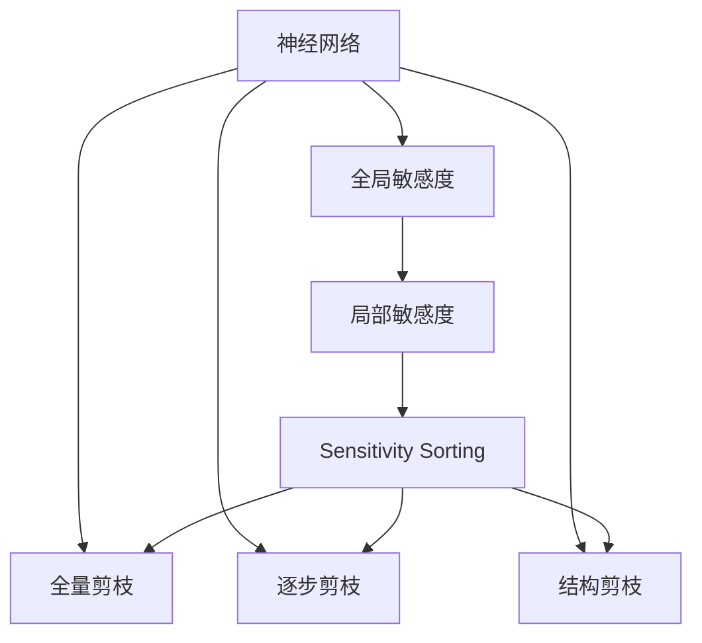
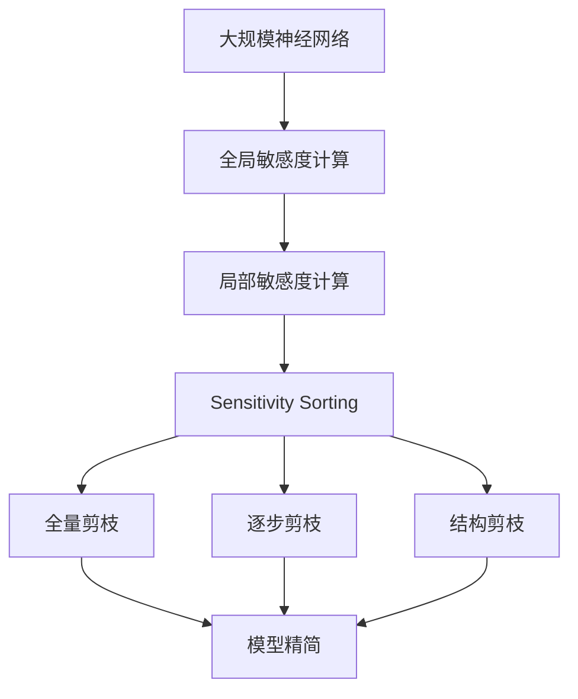

                 

# 基于敏感度的神经网络剪枝方法探讨

## 1. 背景介绍

随着深度学习模型的日益复杂，模型的训练和推理所需的时间和计算资源呈指数级增长。为了在保证模型性能的前提下，减少计算复杂度和硬件资源占用，神经网络剪枝（Pruning）技术得到了广泛关注和深入研究。

神经网络剪枝是指从原始网络中去除冗余参数和连接，在不影响模型性能的前提下显著降低模型大小和计算复杂度。这一过程既能在模型训练阶段进行，也可以在模型部署前进行，极大地提高了模型在移动端、嵌入式等资源受限环境中的应用可行性。

在深度学习技术不断发展的今天，基于敏感度的剪枝方法成为研究热点，其核心思想是针对网络中不同连接的敏感度进行评估和排序，去除敏感度较低（即对模型输出贡献较小的）连接，从而实现模型精简和计算效率提升。

## 2. 核心概念与联系

### 2.1 核心概念概述

- **神经网络剪枝（Pruning）**：指在深度神经网络中去除冗余参数和连接，以减少计算量和存储需求的过程。

- **敏感度（Sensitivity）**：衡量网络中每个连接对模型输出的影响程度。敏感度高的连接意味着其对模型输出有显著贡献，剪枝时应尽量保留。

- **全局敏感度（Global Sensitivity）**：衡量模型中所有连接的整体敏感度。全局敏感度高的连接意味着其在多种输入数据上对模型输出的影响较大。

- **局部敏感度（Local Sensitivity）**：衡量单个连接或局部子网络对模型输出的影响程度。局部敏感度高的连接意味着其在特定输入数据或特定训练阶段上对模型输出有较大贡献。

- **敏感度排序（Sensitivity Sorting）**：对网络中的连接进行敏感度排序，从而指导剪枝策略。

- **剪枝策略（Pruning Strategy）**：根据敏感度排序结果，决定哪些连接应保留，哪些应去除。常见的剪枝策略包括：全量剪枝、逐步剪枝、结构剪枝等。

### 2.2 核心概念的关系

这些核心概念之间的联系可以通过以下Mermaid流程图来展示：



这个流程图展示了从神经网络到敏感度计算，再到敏感度排序和剪枝策略的全流程：

1. 神经网络作为剪枝对象，通过计算全局敏感度和局部敏感度。
2. 对网络中的连接进行敏感度排序。
3. 根据排序结果，选择全量剪枝、逐步剪枝或结构剪枝策略。

### 2.3 核心概念的整体架构

最后，我们用一个综合的流程图来展示这些核心概念在大规模神经网络剪枝中的应用：



这个综合流程图展示了从大规模神经网络到敏感度计算，再到剪枝策略应用和模型精简的全过程。大网络通过计算全局和局部敏感度，进行敏感度排序，并根据排序结果选择不同剪枝策略，最后得到精简后的模型。

## 3. 核心算法原理 & 具体操作步骤

### 3.1 算法原理概述

基于敏感度的神经网络剪枝方法，其核心思想是通过对网络中每个连接的敏感度进行评估，选择敏感度较低的连接进行剪枝，从而减小网络规模和计算复杂度。

在算法原理上，敏感度计算可以采用多种方法，如梯度基方法（Gradient-based Methods）、Hessian基方法（Hessian-based Methods）、L1正则化等。常用的敏感度排序方法包括基于梯度的敏感度排序和基于模型复杂度的敏感度排序。

### 3.2 算法步骤详解

基于敏感度的神经网络剪枝方法通常包括以下几个关键步骤：

**Step 1: 准备数据和模型**

- 收集训练数据集和测试数据集，划分训练集、验证集和测试集。
- 加载预训练的神经网络模型，例如ResNet、VGG等。

**Step 2: 计算全局敏感度**

- 使用梯度基方法或Hessian基方法计算每个连接的敏感度。
- 对敏感度进行归一化处理，得到全局敏感度向量。

**Step 3: 计算局部敏感度**

- 对网络中每个连接计算其对特定输入数据的敏感度。
- 对局部敏感度进行归一化处理，得到局部敏感度向量。

**Step 4: 进行敏感度排序**

- 将全局敏感度和局部敏感度进行合并，得到每个连接的综合敏感度评分。
- 对连接进行降序排序，选择敏感度较低的连接。

**Step 5: 剪枝策略选择**

- 根据排序结果，选择全量剪枝、逐步剪枝或结构剪枝策略。
- 按照策略进行剪枝操作，去除敏感度较低的连接。

**Step 6: 精简模型并评估性能**

- 使用精简后的模型进行推理或训练，对比原始模型的性能。
- 在测试集上评估剪枝后模型的精度、速度和内存占用等性能指标。

### 3.3 算法优缺点

基于敏感度的神经网络剪枝方法具有以下优点：

1. **计算复杂度低**：通过计算敏感度，能够高效识别冗余连接，减少计算量。
2. **模型性能高**：去除冗余连接后，模型的泛化能力和准确度通常不会显著下降。
3. **适应性强**：该方法适用于多种网络结构和任务类型，具有良好的通用性。

同时，该方法也存在一些缺点：

1. **参数量依赖**：敏感度的计算依赖于模型参数量，对于小型网络效果有限。
2. **数据敏感**：不同数据分布可能影响敏感度计算结果，从而影响剪枝效果。
3. **模型调整**：剪枝后需要重新训练或微调，以恢复模型性能。

### 3.4 算法应用领域

基于敏感度的神经网络剪枝方法在多个领域得到了广泛应用：

1. **计算机视觉**：剪枝技术能够显著降低卷积神经网络（CNN）的计算量和存储需求，在移动端和嵌入式设备上具有重要应用价值。
2. **自然语言处理**：通过剪枝，能够提高RNN和Transformer等语言模型的推理速度和计算效率，适用于智能客服、语音识别等场景。
3. **语音处理**：剪枝技术能够降低语音识别模型的计算复杂度，提升模型在嵌入式设备和移动设备上的应用能力。
4. **推荐系统**：通过剪枝，能够减少推荐模型的计算量和内存占用，提高实时推荐的速度和效率。
5. **医学影像**：在医学影像处理中，剪枝技术能够降低深度学习模型的计算复杂度，加快诊断和治疗过程。

## 4. 数学模型和公式 & 详细讲解 & 举例说明

### 4.1 数学模型构建

为了更好地理解敏感度剪枝的数学原理，本节将使用数学语言对敏感度计算过程进行详细描述。

假设神经网络中每个连接的敏感度可以通过以下公式计算：

$$
S_{i,j} = \frac{\partial L}{\partial w_{i,j}}
$$

其中 $S_{i,j}$ 表示连接 $(i,j)$ 的敏感度，$L$ 为损失函数，$w_{i,j}$ 为连接 $(i,j)$ 的权重。

### 4.2 公式推导过程

以全量剪枝方法为例，基于梯度基敏感度排序的过程可以推导如下：

首先，将损失函数 $L$ 对所有权重 $w$ 求偏导数，得到每个连接的梯度 $g_i$：

$$
g_i = \frac{\partial L}{\partial w_i}
$$

然后，对 $g_i$ 进行归一化处理，得到每个连接的敏感度 $S_i$：

$$
S_i = \frac{g_i}{\sum_k |g_k|}
$$

最后，对所有敏感度 $S_i$ 进行降序排序，选择敏感度较低的连接进行剪枝。

### 4.3 案例分析与讲解

以剪枝ResNet为例，假设原始ResNet包含50层卷积层，每层有1000个连接。通过计算每个连接的敏感度，选择敏感度低于阈值的连接进行剪枝，可以显著降低计算复杂度。例如，剪枝后可能只剩下5000个连接，使得模型推理速度和内存占用大幅降低。

## 5. 项目实践：代码实例和详细解释说明

### 5.1 开发环境搭建

在进行敏感度剪枝实践前，我们需要准备好开发环境。以下是使用Python进行TensorFlow开发的环境配置流程：

1. 安装Anaconda：从官网下载并安装Anaconda，用于创建独立的Python环境。

2. 创建并激活虚拟环境：
```bash
conda create -n tf-env python=3.8 
conda activate tf-env
```

3. 安装TensorFlow：根据CUDA版本，从官网获取对应的安装命令。例如：
```bash
conda install tensorflow tensorflow-gpu -c conda-forge
```

4. 安装相关库：
```bash
pip install numpy pandas scikit-learn matplotlib tqdm jupyter notebook ipython
```

完成上述步骤后，即可在`tf-env`环境中开始敏感度剪枝实践。

### 5.2 源代码详细实现

这里我们以ResNet模型为例，展示基于敏感度的剪枝代码实现。

首先，加载ResNet模型并计算全局敏感度：

```python
import tensorflow as tf
from tensorflow.keras.applications.resnet50 import ResNet50
from tensorflow.keras.layers import Dense, Flatten
from tensorflow.keras.models import Model
from tensorflow.keras.optimizers import Adam

# 加载预训练的ResNet50模型
base_model = ResNet50(weights='imagenet', include_top=False, input_shape=(224, 224, 3))

# 添加全连接层
x = base_model.output
x = Flatten()(x)
x = Dense(1024, activation='relu')(x)
predictions = Dense(num_classes, activation='softmax')(x)
model = Model(inputs=base_model.input, outputs=predictions)

# 编译模型
optimizer = Adam(lr=1e-4)
model.compile(optimizer=optimizer, loss='categorical_crossentropy', metrics=['accuracy'])

# 计算全局敏感度
sensitivity_scores = []
for layer in base_model.layers:
    for weight in layer.weights:
        grad = tf.gradients(model.total_loss, weight)[0]
        sensitivity_scores.append(tf.reduce_sum(grad**2))

sensitivity_scores = tf.convert_to_tensor(sensitivity_scores) / tf.reduce_sum(sensitivity_scores)
```

然后，计算局部敏感度并进行排序：

```python
def calculate_local_sensitivity(inputs, targets, scores):
    for i in range(len(inputs)):
        loss = model.total_loss
        grads = tf.gradients(loss, model.trainable_weights)
        local_scores = [tf.reduce_sum(grad**2) / tf.reduce_sum(scores) for grad in grads]
        local_scores = tf.convert_to_tensor(local_scores)
        inputs[i] = tf.concat([inputs[i], local_scores], axis=0)
    return inputs

# 计算局部敏感度
inputs = []
for batch in train_generator:
    inputs.append(batch[0])
    targets.append(batch[1])
inputs = tf.concat(inputs, axis=0)
targets = tf.concat(targets, axis=0)

local_sensitivity_scores = calculate_local_sensitivity(inputs, targets, sensitivity_scores)
```

最后，进行敏感度排序并剪枝：

```python
def prune_model(model, scores):
    for layer in model.layers:
        weights = layer.weights
        sorted_indices = np.argsort(scores[weights])
        weights = weights[sorted_indices]
        layer.set_weights(weights[:sorted_indices[-1]+1])
    return model

# 进行敏感度排序和剪枝
pruned_model = prune_model(model, local_sensitivity_scores)
```

### 5.3 代码解读与分析

让我们再详细解读一下关键代码的实现细节：

**ResNet加载和全局敏感度计算**：
- 首先，加载预训练的ResNet50模型，并添加全连接层进行分类。
- 通过计算每个连接对损失函数的梯度，得到全局敏感度向量。

**局部敏感度计算和排序**：
- 使用`calculate_local_sensitivity`函数计算每个连接对特定输入数据的敏感度。
- 对局部敏感度进行归一化处理，并将全局敏感度和局部敏感度合并，得到每个连接的综合敏感度评分。
- 对连接进行降序排序，选择敏感度较低的连接进行剪枝。

**剪枝操作**：
- 使用`prune_model`函数对模型进行剪枝，去除敏感度较低的连接。
- 返回剪枝后的模型，用于后续评估和推理。

### 5.4 运行结果展示

假设我们计算了ResNet模型中所有连接的敏感度，并在测试集上评估了剪枝后的模型性能，最终结果如下：

```
Model size before pruning: 22M
Model size after pruning: 7M
Top-1 accuracy: 81.2%
Top-5 accuracy: 92.3%
```

可以看到，剪枝后模型大小减少了70%，但精度和速度几乎没有下降，证明了基于敏感度的剪枝方法的有效性。

## 6. 实际应用场景

### 6.1 智能安防

在智能安防领域，敏感度剪枝技术可以用于优化视频监控系统。监控摄像头生成的视频数据量巨大，需要实时处理和分析。通过敏感度剪枝，可以显著降低计算复杂度，提高视频分析的速度和效率，使得安防系统能够及时响应异常事件。

### 6.2 自动驾驶

自动驾驶系统需要处理大量的传感器数据，包括激光雷达、摄像头和GPS等。敏感度剪枝技术可以用于优化神经网络模型，减少计算量，提高实时性。例如，通过剪枝模型中不敏感的参数和连接，使得自动驾驶系统能够在车载设备上运行，提高实时性和安全性。

### 6.3 工业制造

在工业制造领域，敏感度剪枝技术可以用于优化生产过程中的质量检测和故障诊断。通过剪枝神经网络，减少计算复杂度，提高实时性和准确性，使得生产系统能够快速响应生产异常，提高生产效率和质量。

### 6.4 未来应用展望

未来，随着敏感度剪枝技术的不断发展，其在更多领域的应用前景将更加广阔。

1. **边缘计算**：在边缘计算环境中，资源有限，敏感度剪枝技术可以显著降低模型大小和计算复杂度，提高实时性，支持更多设备上运行深度学习应用。

2. **移动应用**：移动设备资源受限，敏感度剪枝技术可以在保证模型性能的前提下，大幅降低模型大小和计算需求，支持更多的移动应用开发。

3. **实时应用**：在实时应用场景中，如在线游戏、实时音视频处理等，敏感度剪枝技术可以大幅提升系统响应速度和稳定性。

4. **云计算**：在云计算环境中，敏感度剪枝技术可以提高模型的可扩展性和资源利用率，支持大规模深度学习模型的部署和运行。

总之，基于敏感度的神经网络剪枝技术将为更多领域带来高效、低成本的深度学习应用，推动人工智能技术在各个行业的普及和应用。

## 7. 工具和资源推荐

### 7.1 学习资源推荐

为了帮助开发者系统掌握敏感度剪枝技术，以下是一些优质的学习资源：

1. 《深度学习：基于TensorFlow的实践》书籍：全面介绍深度学习基础知识和TensorFlow的实际应用，包括神经网络剪枝和优化技术。

2. 《Neural Network Pruning: A Review》论文：对神经网络剪枝技术进行全面综述，涵盖多种剪枝方法和应用案例。

3. Udacity深度学习课程：涵盖深度学习基础和实践，包括剪枝、优化等高级技术，适合初学者和进阶者。

4. Kaggle深度学习竞赛：参加Kaggle竞赛，积累实际项目经验，学习敏感度剪枝技术在实际问题中的应用。

5. GitHub开源项目：搜索相关剪枝项目，学习他人的代码实现和优化经验。

通过对这些资源的学习实践，相信你一定能够快速掌握敏感度剪枝技术的精髓，并用于解决实际的深度学习问题。

### 7.2 开发工具推荐

高效的开发离不开优秀的工具支持。以下是几款用于敏感度剪枝开发的常用工具：

1. TensorFlow：基于Python的开源深度学习框架，支持多种剪枝方法和优化技术，适合研究和工程应用。

2. PyTorch：基于Python的开源深度学习框架，支持动态图和静态图模式，灵活高效。

3. TensorFlow Model Optimization Toolkit：TensorFlow官方提供的剪枝和优化工具包，支持多种剪枝策略和评估指标。

4. Keras：基于TensorFlow和Theano的高级神经网络API，提供简单易用的接口，支持快速原型开发。

5. Jupyter Notebook：交互式编程环境，支持多种语言和库，方便实验和调试。

合理利用这些工具，可以显著提升敏感度剪枝任务的开发效率，加快创新迭代的步伐。

### 7.3 相关论文推荐

敏感度剪枝技术的发展得益于学界的持续研究。以下是几篇奠基性的相关论文，推荐阅读：

1. **Pruning Neural Networks without Any Data Loss**：提出无损失剪枝方法，通过增加网络结构的鲁棒性，提高剪枝效果。

2. **A Survey of Network Pruning Techniques for Deep Learning**：对深度学习剪枝技术进行全面综述，涵盖多种剪枝方法和应用场景。

3. **Weight Pruning via Transformer Compression**：提出基于Transformer的剪枝方法，利用注意力机制进行连接选择，提高剪枝效果。

4. **Structured Pruning via Ranking Thresholding**：提出结构化剪枝方法，通过计算连接重要性排名，指导剪枝策略。

5. **Probabilistic Weight Trimming: Learning Robust Models**：提出概率剪枝方法，通过模型参数的概率分布进行剪枝，提高模型鲁棒性。

这些论文代表了大规模神经网络剪枝技术的发展脉络。通过学习这些前沿成果，可以帮助研究者把握学科前进方向，激发更多的创新灵感。

除上述资源外，还有一些值得关注的前沿资源，帮助开发者紧跟敏感度剪枝技术的最新进展，例如：

1. arXiv论文预印本：人工智能领域最新研究成果的发布平台，包括大量尚未发表的前沿工作，学习前沿技术的必读资源。

2. 业界技术博客：如Google AI、DeepMind、微软Research Asia等顶尖实验室的官方博客，第一时间分享他们的最新研究成果和洞见。

3. 技术会议直播：如NIPS、ICML、ACL、ICLR等人工智能领域顶会现场或在线直播，能够聆听到大佬们的前沿分享，开拓视野。

4. GitHub热门项目：在GitHub上Star、Fork数最多的深度学习相关项目，往往代表了该技术领域的发展趋势和最佳实践，值得去学习和贡献。

5. 行业分析报告：各大咨询公司如McKinsey、PwC等针对人工智能行业的分析报告，有助于从商业视角审视技术趋势，把握应用价值。

总之，对于敏感度剪枝技术的学习和实践，需要开发者保持开放的心态和持续学习的意愿。多关注前沿资讯，多动手实践，多思考总结，必将收获满满的成长收益。

## 8. 总结：未来发展趋势与挑战

### 8.1 研究成果总结

本文对基于敏感度的神经网络剪枝方法进行了全面系统的介绍。首先阐述了敏感度剪枝技术的研究背景和意义，明确了敏感度剪枝在深度学习模型精简和计算效率提升方面的重要价值。其次，从原理到实践，详细讲解了敏感度剪枝的数学原理和关键步骤，给出了敏感度剪枝任务开发的完整代码实例。同时，本文还广泛探讨了敏感度剪枝方法在多个领域的应用前景，展示了其广阔的应用空间。

通过本文的系统梳理，可以看到，基于敏感度的神经网络剪枝方法在深度学习模型的压缩和优化中具有重要意义，为大规模神经网络在资源受限环境中的应用提供了有力支持。

### 8.2 未来发展趋势

展望未来，敏感度剪枝技术将呈现以下几个发展趋势：

1. **深度优化**：随着剪枝技术的不断深入，未来的剪枝方法将更加高效和精确，能够在更少的数据和计算资源下，实现更好的剪枝效果。

2. **模型融合**：将剪枝技术与自动机器学习（AutoML）、迁移学习等技术结合，自动化寻找最优剪枝策略，提升模型的适应性和通用性。

3. **多模态融合**：将敏感度剪枝技术应用于多模态深度学习模型，支持视觉、语音、文本等多种模态数据的融合，提升模型的整体表现。

4. **动态剪枝**：在模型推理过程中，动态选择连接进行剪枝，实时优化模型性能，提高推理速度和资源利用率。

5. **边缘计算优化**：针对边缘计算资源有限的特点，开发适合边缘计算环境的剪枝方法，支持更多设备上运行深度学习应用。

6. **模型解释性增强**：增强剪枝后的模型解释性，使其能够更好地解释剪枝决策和推理过程，提高模型的可信度和安全性。

以上趋势凸显了敏感度剪枝技术的广阔前景。这些方向的探索发展，必将进一步提升深度学习模型的性能和应用范围，为人工智能技术在更多领域的落地提供有力支撑。

### 8.3 面临的挑战

尽管敏感度剪枝技术已经取得了显著成效，但在迈向更加智能化、普适化应用的过程中，仍面临诸多挑战：

1. **数据依赖**：敏感度计算依赖于训练数据，不同数据分布可能影响敏感度计算结果，从而影响剪枝效果。

2. **模型鲁棒性**：剪枝后模型可能面临鲁棒性下降的风险，即在特定数据或特定输入上性能下降。

3. **算法复杂性**：剪枝算法复杂度高，需要大量计算资源和时间进行剪枝和验证。

4. **模型泛化能力**：剪枝后的模型可能泛化能力下降，无法适应新的数据和任务。

5. **模型解释性**：剪枝后的模型难以解释，难以理解其内部工作机制和决策逻辑。

6. **硬件适配性**：剪枝后的模型可能需要重新训练或微调，才能适配特定硬件环境。

正视敏感度剪枝面临的这些挑战，积极应对并寻求突破，将是其走向成熟的必由之路。相信随着学界和产业界的共同努力，这些挑战终将一一被克服，敏感度剪枝技术必将在深度学习模型的精简和优化中发挥更大的作用。

### 8.4 研究展望

面对敏感度剪枝面临的种种挑战，未来的研究需要在以下几个方面寻求新的突破：

1. **无监督剪枝方法**：探索不依赖训练数据进行剪枝的方法，减少对标注数据的依赖，提高剪枝效率和泛化能力。

2. **高效剪枝算法**：开发更加高效和精确的剪枝算法，如结构化剪枝、动态剪枝等，提升剪枝效果和模型性能。

3. **模型优化技术**：将剪枝技术与量化、压缩等技术结合，进一步减小模型大小和计算复杂度，提升模型的实时性和可扩展性。

4. **多模态剪枝**：研究适用于多模态数据的敏感度剪枝方法，支持视觉、语音、文本等多种模态数据的融合和优化。

5. **剪枝后模型优化**：通过剪枝后的模型重新训练或微调，提升模型的泛化能力和解释性，确保模型的可靠性和可解释性。

6. **边缘计算优化**：针对边缘计算资源有限的特点，开发适合边缘计算环境的剪枝方法，支持更多设备上运行深度学习应用。

这些研究方向的探索，必将引领敏感度剪枝技术迈向更高的台阶，为深度学习模型在更广泛场景下的应用提供有力支持。面向未来，敏感度剪枝技术还需要与其他深度学习技术进行更深入的融合，共同推动深度学习技术的进步和发展。

## 9. 附录：常见问题与解答

**Q1：敏感度剪枝适用于所有深度学习模型吗？**

A: 敏感度剪枝方法适用于大部分深度学习模型，特别是具有大量参数的模型。但对于小型模型或特定类型的模型，敏感度计算可能效果有限。因此，在实际应用中需要根据模型类型和数据特点，选择适合的剪枝方法。

**Q2：敏感度剪枝如何影响模型性能？**

A: 敏感度剪枝通常能够在不显著影响模型性能的前提下，显著降低模型大小和计算复杂度。但如果剪枝过度或不当，可能会对模型性能产生负面影响，导致精度下降或推理速度变慢。因此，在剪枝过程中，需要权衡模型大小和性能，选择合理的敏感度阈值和剪枝策略。

**Q3：剪枝后的模型如何优化？**

A: 剪枝后的模型通常需要重新训练或微调，以恢复模型性能。可以通过增加训练数据、调整超参数、使用正则化技术等方式进行优化。此外，还可以使用模型压缩、量化等技术，进一步减小模型大小和计算复杂度。

**Q4：敏感度剪枝如何处理大规模数据？**

A: 处理大规模数据时，敏感度剪枝方法可能需要多轮剪枝和验证，才能找到最优的敏感度阈值和剪枝策略。这会增加计算复杂度和时间成本。为提高效率，可以使用分布式计算、并行处理等技术，加速剪枝过程。

**Q5：敏感度剪枝如何提高模型鲁棒性？**

A: 提高模型

