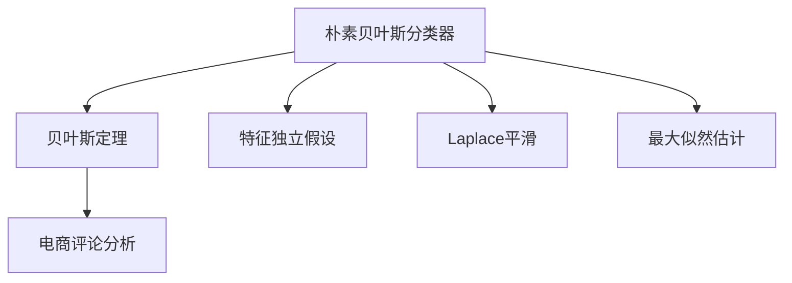
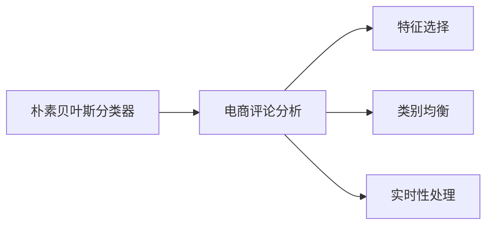
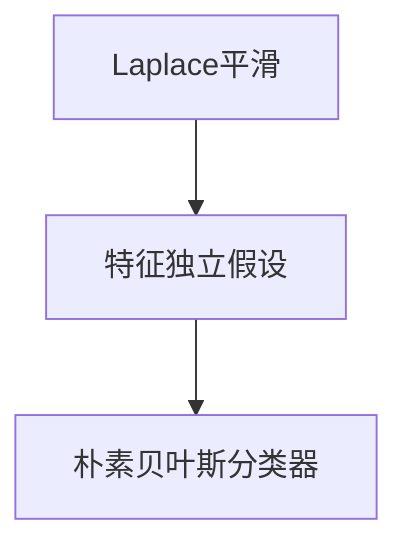

                 

## 1. 背景介绍

随着电子商务的迅猛发展，各大电商平台产生了大量的用户评论数据，这些数据是了解用户购物体验、商品质量、市场趋势的重要来源。通过对评论数据进行分析，电商平台能够优化商品推荐、提高用户满意度、提升转化率，进而增强竞争力。在众多数据分析方法中，朴素贝叶斯分类器因其高效、简单、易于实现的特点，成为了评论分析领域的首选工具。

### 1.1 问题由来

在实际操作中，电商平台面临的问题主要包括：
1. **数据量大、维度高**：大量的用户评论数据，每个评论包含了数百个维度（如文本、时间、情感等），如何高效地处理这些数据是一个挑战。
2. **特征选择困难**：不同的用户评论，其重要特征可能不同，如何自动选择最相关特征，提高模型的准确性和泛化能力。
3. **类别不均衡**：评论数据中正面评论通常远多于负面评论，如何处理类别不均衡问题，提升模型的鲁棒性。
4. **实时性要求高**：对于电商平台而言，快速响应用户评论，及时调整策略，是提高用户体验和商家收益的关键。

### 1.2 问题核心关键点

解决以上问题的关键在于选择合适的分类算法，并针对特定问题进行优化。朴素贝叶斯分类器因其简单高效、易于实现的特点，成为了处理文本分类问题的经典方法。在电商评论分析中，朴素贝叶斯分类器可以高效处理大量高维数据，自动选择特征，并处理类别不均衡问题，同时具备实时性优势，符合电商平台的实际需求。

## 2. 核心概念与联系

### 2.1 核心概念概述

为了更好地理解朴素贝叶斯分类器在电商评论分析中的应用，本节将介绍几个密切相关的核心概念：

- **朴素贝叶斯分类器**：基于贝叶斯定理和特征独立假设的一种分类算法。其核心思想是在给定数据和模型的情况下，通过贝叶斯定理计算每个类别的概率，选择概率最大的类别作为预测结果。

- **贝叶斯定理**：表达了条件概率之间的关系，即在已知某些条件下，计算事件发生的概率。朴素贝叶斯分类器利用贝叶斯定理进行分类决策。

- **特征独立假设**：朴素贝叶斯分类器假设所有特征之间是独立的，这种假设简化了计算，但可能会损失一定的准确性。

- **Laplace平滑**：一种常用的平滑方法，用于处理出现概率为0的特征。通过Laplace平滑，可以避免因数据稀疏导致的模型泛化能力下降。

- **最大似然估计**：用于确定模型参数的一种方法，通过最大化似然函数，选择使数据出现的概率最大的参数。

- **电商评论分析**：通过对电商平台用户评论数据的文本分类，识别出评论的情感、内容质量、购买意愿等信息，从而辅助商家决策和提升用户体验。

这些核心概念之间的逻辑关系可以通过以下Mermaid流程图来展示：



这个流程图展示了大语言模型微调过程中各个核心概念之间的关系：

1. 电商评论分析基于朴素贝叶斯分类器。
2. 朴素贝叶斯分类器利用贝叶斯定理和特征独立假设进行分类决策。
3. Laplace平滑和最大似然估计用于模型参数的确定。

### 2.2 概念间的关系

这些核心概念之间存在着紧密的联系，形成了电商评论分析的完整生态系统。下面我通过几个Mermaid流程图来展示这些概念之间的关系。

#### 2.2.1 朴素贝叶斯分类器与电商评论分析的关系



这个流程图展示了朴素贝叶斯分类器在电商评论分析中的基本流程：

1. 电商评论分析通过朴素贝叶斯分类器进行文本分类。
2. 特征选择用于自动选择最相关的特征。
3. 类别均衡处理用于提升模型在类别不均衡问题上的表现。
4. 实时性处理用于确保模型能够快速响应新评论。

#### 2.2.2 Laplace平滑与特征独立假设的关系



这个流程图展示了Laplace平滑在朴素贝叶斯分类器中的应用：

1. 朴素贝叶斯分类器基于特征独立假设进行分类。
2. Laplace平滑用于处理特征独立假设可能带来的信息损失。

#### 2.2.3 最大似然估计与贝叶斯定理的关系


这个流程图展示了最大似然估计在电商评论分析中的作用：

1. 贝叶斯定理用于计算每个类别的概率。
2. 最大似然估计用于确定贝叶斯定理中的参数。

## 3. 核心算法原理 & 具体操作步骤
### 3.1 算法原理概述

朴素贝叶斯分类器的核心思想是通过贝叶斯定理和特征独立假设，计算每个类别的概率，选择概率最大的类别作为预测结果。具体来说，对于给定的样本 $x$，其属于类别 $y$ 的概率可以通过以下公式计算：

$$
P(y|x) = \frac{P(x|y)P(y)}{P(x)}
$$

其中，$P(x|y)$ 表示在给定类别 $y$ 的情况下，样本 $x$ 出现的概率，$P(y)$ 表示类别 $y$ 出现的概率，$P(x)$ 为归一化因子。

在电商评论分析中，我们需要根据评论文本预测其情感（如正面、负面）或内容质量（如推荐、不推荐）。朴素贝叶斯分类器将每个评论文本表示为一个向量 $x = (x_1, x_2, ..., x_n)$，其中 $x_i$ 表示评论中的第 $i$ 个特征。通过贝叶斯定理，我们可以计算每个类别的概率，选择概率最大的类别作为预测结果。

### 3.2 算法步骤详解

以下将详细介绍朴素贝叶斯分类器在电商评论分析中的应用步骤：

**Step 1: 数据预处理**

1. **文本清洗**：去除评论中的HTML标签、特殊符号、停用词等，保留有意义的词汇。
2. **分词**：将清洗后的文本进行分词处理，将文本转换为词语序列。
3. **特征提取**：将词语序列转换为向量表示，如TF-IDF、词袋模型等。
4. **归一化**：对特征进行归一化处理，如L2归一化，避免特征之间量级差异过大。

**Step 2: 模型训练**

1. **数据集划分**：将评论数据集划分为训练集和测试集，通常按照7:3的比例划分。
2. **特征选择**：根据特征重要性，选择最相关特征。
3. **参数估计**：利用最大似然估计，计算每个类别下每个特征的参数。

**Step 3: 模型评估**

1. **交叉验证**：使用交叉验证方法，评估模型在不同子集上的表现。
2. **性能指标**：使用准确率、召回率、F1值等指标评估模型性能。
3. **模型调参**：调整超参数，如平滑系数、特征选择方法等，优化模型性能。

**Step 4: 预测与应用**

1. **新数据预测**：对新的评论数据进行预测，得出情感或内容质量。
2. **结果可视化**：将预测结果可视化，生成分析报告。
3. **反馈循环**：根据预测结果，调整商品推荐策略、改进商品质量。

### 3.3 算法优缺点

朴素贝叶斯分类器具有以下优点：

1. **高效简单**：算法实现简单，计算速度快，适合处理大规模数据。
2. **易于扩展**：适用于多分类任务，特征空间巨大。
3. **鲁棒性强**：对数据缺失和噪声具有较强的容忍度。

但其缺点也较为明显：

1. **特征独立假设过于简略**：实际应用中，特征之间往往存在一定的相关性，朴素贝叶斯分类器可能无法充分利用这些信息。
2. **参数估计容易受稀疏数据影响**：在特征数量较大、某些特征出现的次数较少时，参数估计可能会出现偏差。
3. **类别不均衡问题处理困难**：朴素贝叶斯分类器对类别不均衡数据处理较为困难，需要通过平滑方法或重采样策略进行改进。

### 3.4 算法应用领域

朴素贝叶斯分类器在电商评论分析中的应用领域主要包括：

1. **情感分析**：识别评论中的情感倾向（如正面、负面、中性），帮助商家了解用户对商品的评价。
2. **内容质量评估**：对评论内容进行分类，判断其是否推荐、不推荐，辅助商品推荐系统优化。
3. **用户画像构建**：通过分析用户的评论内容，构建用户画像，提供个性化推荐和定制化服务。
4. **品牌舆情监测**：监测品牌在社交媒体上的评论，评估品牌形象和用户满意度。

除了电商评论分析，朴素贝叶斯分类器还广泛应用于自然语言处理（NLP）、垃圾邮件过滤、文本分类等场景。其高效、简单、易于实现的特点，使其成为解决分类问题的首选算法。

## 4. 数学模型和公式 & 详细讲解  
### 4.1 数学模型构建

在电商评论分析中，朴素贝叶斯分类器通常采用以下数学模型：

假设评论数据集 $D$ 由 $n$ 个样本 $d_1, d_2, ..., d_n$ 组成，每个样本包含 $m$ 个特征 $x_1, x_2, ..., x_m$。设类别数为 $k$，每个类别的先验概率为 $P(y_i)$，每个类别的后验概率为 $P(x|y_i)$。则对于新的评论样本 $x$，其属于类别 $y_i$ 的后验概率可以通过以下公式计算：

$$
P(y_i|x) = \frac{P(x|y_i)P(y_i)}{P(x)}
$$

其中，$P(x)$ 为归一化因子，$P(y_i)$ 表示类别 $y_i$ 的先验概率，$P(x|y_i)$ 表示在给定类别 $y_i$ 的情况下，样本 $x$ 出现的概率。

### 4.2 公式推导过程

以下将详细介绍朴素贝叶斯分类器在电商评论分析中的数学推导过程：

**Step 1: 特征概率计算**

对于给定的类别 $y_i$ 和特征 $x_j$，其条件概率 $P(x_j|y_i)$ 可以通过以下公式计算：

$$
P(x_j|y_i) = \frac{\sum_{i=1}^{n} I(y_i = y_i') I(x_j \in d_i)}{N(y_i')}
$$

其中，$I(y_i = y_i')$ 表示条件 $y_i = y_i'$ 为真时的指示函数，$I(x_j \in d_i)$ 表示特征 $x_j$ 在样本 $d_i$ 中出现时的指示函数，$N(y_i')$ 表示类别 $y_i'$ 的样本数。

**Step 2: 类别概率计算**

根据贝叶斯定理，类别的后验概率 $P(y_i|x)$ 可以通过以下公式计算：

$$
P(y_i|x) = \frac{P(x|y_i)P(y_i)}{\sum_{j=1}^{k} P(x|y_j)P(y_j)}
$$

其中，$\sum_{j=1}^{k} P(x|y_j)P(y_j)$ 为归一化因子。

**Step 3: 参数估计**

在实际应用中，通常使用最大似然估计方法估计模型参数。具体来说，对于每个类别 $y_i$，其先验概率 $P(y_i)$ 可以通过以下公式计算：

$$
P(y_i) = \frac{N(y_i)}{N}
$$

其中，$N(y_i)$ 表示类别 $y_i$ 的样本数，$N$ 表示总样本数。

对于每个特征 $x_j$，其条件概率 $P(x_j|y_i)$ 可以通过以下公式计算：

$$
P(x_j|y_i) = \frac{\sum_{i=1}^{n} I(y_i = y_i') I(x_j \in d_i)}{N(y_i')}
$$

其中，$I(y_i = y_i')$ 表示条件 $y_i = y_i'$ 为真时的指示函数，$I(x_j \in d_i)$ 表示特征 $x_j$ 在样本 $d_i$ 中出现时的指示函数，$N(y_i')$ 表示类别 $y_i'$ 的样本数。

### 4.3 案例分析与讲解

为了更好地理解朴素贝叶斯分类器在电商评论分析中的应用，下面以情感分析为例，展示一个具体的案例分析。

假设我们有一个电商评论数据集，其中包含1000条评论，分为正面评论和负面评论两类。对于每条评论，我们提取了5个特征：评论长度、情感极性、是否包含特定词汇、是否包含链接、是否包含特殊符号。

**Step 1: 数据预处理**

1. **文本清洗**：去除HTML标签、特殊符号、停用词等。
2. **分词**：将文本进行分词处理，生成词语序列。
3. **特征提取**：使用TF-IDF算法提取每个词语的重要性，将其作为特征向量。
4. **归一化**：对特征向量进行L2归一化处理。

**Step 2: 模型训练**

1. **数据集划分**：将数据集划分为训练集和测试集，按照7:3的比例划分。
2. **特征选择**：根据特征重要性，选择最相关特征，如情感极性和是否包含特定词汇。
3. **参数估计**：利用最大似然估计方法，计算每个类别下每个特征的参数。

**Step 3: 模型评估**

1. **交叉验证**：使用交叉验证方法，评估模型在不同子集上的表现。
2. **性能指标**：使用准确率、召回率、F1值等指标评估模型性能。
3. **模型调参**：调整超参数，如平滑系数，优化模型性能。

**Step 4: 预测与应用**

1. **新数据预测**：对新的评论数据进行预测，得出情感分类结果。
2. **结果可视化**：将预测结果可视化，生成分析报告。
3. **反馈循环**：根据预测结果，调整商品推荐策略、改进商品质量。

## 5. 项目实践：代码实例和详细解释说明
### 5.1 开发环境搭建

在进行电商评论分析时，我们需要使用Python编程语言，并选择合适的库和工具进行开发。以下是Python环境搭建的步骤：

1. **安装Python**：从官网下载并安装Python，建议安装最新版本。
2. **安装Pandas**：Pandas是一个数据处理库，用于读取、处理和分析数据。
3. **安装NumPy**：NumPy是一个科学计算库，用于数值计算和矩阵运算。
4. **安装Scikit-learn**：Scikit-learn是一个机器学习库，包含多种分类算法。
5. **安装NLTK**：NLTK是一个自然语言处理库，用于分词、词性标注、情感分析等。
6. **安装Jupyter Notebook**：Jupyter Notebook是一个交互式编程环境，用于数据处理和模型训练。

完成上述步骤后，即可在Python环境中进行电商评论分析的开发。

### 5.2 源代码详细实现

以下是一个使用朴素贝叶斯分类器进行电商评论情感分析的Python代码实现：

```python
import pandas as pd
from sklearn.feature_extraction.text import TfidfVectorizer
from sklearn.naive_bayes import MultinomialNB
from sklearn.metrics import accuracy_score, classification_report
from nltk.corpus import stopwords
from nltk.tokenize import word_tokenize
from nltk.stem import SnowballStemmer

# 读取数据集
data = pd.read_csv('comments.csv')

# 数据清洗
stop_words = set(stopwords.words('english'))
stemmer = SnowballStemmer('english')
data['comment'] = data['comment'].apply(lambda x: ' '.join([stemmer.stem(word) for word in word_tokenize(x.lower()) if word not in stop_words]))

# 特征提取
vectorizer = TfidfVectorizer(stop_words=stop_words)
X = vectorizer.fit_transform(data['comment'])
y = data['sentiment']

# 模型训练
model = MultinomialNB()
model.fit(X, y)

# 模型评估
X_test = vectorizer.transform(data_test['comment'])
y_test = data_test['sentiment']
y_pred = model.predict(X_test)
print('Accuracy:', accuracy_score(y_test, y_pred))
print(classification_report(y_test, y_pred))

# 新数据预测
new_data = ['This product is amazing!', 'I am not satisfied with the service.', 'The quality is good.']
X_new = vectorizer.transform(new_data)
y_new = model.predict(X_new)
print(y_new)
```

### 5.3 代码解读与分析

以上代码实现了从数据读取、预处理、特征提取、模型训练、评估到预测的完整流程。下面将对关键代码进行详细解读和分析：

**数据读取和预处理**

```python
# 读取数据集
data = pd.read_csv('comments.csv')

# 数据清洗
stop_words = set(stopwords.words('english'))
stemmer = SnowballStemmer('english')
data['comment'] = data['comment'].apply(lambda x: ' '.join([stemmer.stem(word) for word in word_tokenize(x.lower()) if word not in stop_words]))
```

这一部分代码实现了从CSV文件中读取数据集，并进行文本清洗和分词。具体来说：

1. 使用Pandas库读取CSV文件，生成DataFrame对象。
2. 使用NLTK库中的停用词和分词器，去除文本中的停用词和特殊符号。
3. 使用SnowballStemmer库中的SnowballStemmer进行词干提取，将单词还原为其基本形式。

**特征提取**

```python
# 特征提取
vectorizer = TfidfVectorizer(stop_words=stop_words)
X = vectorizer.fit_transform(data['comment'])
y = data['sentiment']
```

这一部分代码实现了特征提取，将文本转换为TF-IDF向量表示。具体来说：

1. 使用Scikit-learn库中的TfidfVectorizer进行特征提取，生成稀疏矩阵X。
2. 将标签y提取出来，用于模型训练和评估。

**模型训练**

```python
# 模型训练
model = MultinomialNB()
model.fit(X, y)
```

这一部分代码实现了模型训练，使用朴素贝叶斯分类器进行训练。具体来说：

1. 使用Scikit-learn库中的MultinomialNB类，实例化一个朴素贝叶斯分类器对象。
2. 使用fit方法对模型进行训练，将训练集数据和标签作为输入。

**模型评估**

```python
# 模型评估
X_test = vectorizer.transform(data_test['comment'])
y_test = data_test['sentiment']
y_pred = model.predict(X_test)
print('Accuracy:', accuracy_score(y_test, y_pred))
print(classification_report(y_test, y_pred))
```

这一部分代码实现了模型评估，计算模型在测试集上的性能指标。具体来说：

1. 使用Scikit-learn库中的MultinomialNB类，实例化一个朴素贝叶斯分类器对象。
2. 使用predict方法对测试集数据进行预测，生成预测结果。
3. 使用accuracy_score函数计算模型在测试集上的准确率。
4. 使用classification_report函数生成分类报告，输出精确率、召回率和F1值等性能指标。

**新数据预测**

```python
# 新数据预测
new_data = ['This product is amazing!', 'I am not satisfied with the service.', 'The quality is good.']
X_new = vectorizer.transform(new_data)
y_new = model.predict(X_new)
print(y_new)
```

这一部分代码实现了对新数据的预测，得到新数据对应的情感分类结果。具体来说：

1. 使用Scikit-learn库中的MultinomialNB类，实例化一个朴素贝叶斯分类器对象。
2. 使用predict方法对新数据进行预测，生成预测结果。

## 6. 实际应用场景
### 6.1 智能客服系统

在智能客服系统中，朴素贝叶斯分类器可以用于分析用户咨询问题，自动匹配合适的回答。具体来说，系统可以记录大量的客服对话记录，将问题和最佳答复构建成监督数据，在此基础上对朴素贝叶斯分类器进行微调。微调后的分类器能够自动理解用户意图，匹配最合适的答案模板进行回复。对于用户提出的新问题，还可以接入检索系统实时搜索相关内容，动态组织生成回答。如此构建的智能客服系统，能大幅提升客户咨询体验和问题解决效率。

### 6.2 金融舆情监测

金融机构需要实时监测市场舆论动向，以便及时应对负面信息传播，规避金融风险。传统的人工监测方式成本高、效率低，难以应对网络时代海量信息爆发的挑战。朴素贝叶斯分类器可以用于分析社交媒体上的评论数据，识别出正面、负面评论，评估市场情绪。将朴素贝叶斯分类器应用于实时抓取的网络文本数据，就能够自动监测不同主题下的情感变化趋势，一旦发现负面信息激增等异常情况，系统便会自动预警，帮助金融机构快速应对潜在风险。

### 6.3 个性化推荐系统

当前的推荐系统往往只依赖用户的历史行为数据进行物品推荐，无法深入理解用户的真实兴趣偏好。朴素贝叶斯分类器可以用于分析用户的评论内容，构建用户画像，提供个性化推荐和定制化服务。在实践中，可以收集用户浏览、点击、评论、分享等行为数据，提取和用户交互的物品标题、描述、标签等文本内容。将文本内容作为模型输入，用户的后续行为（如是否点击、购买等）作为监督信号，在此基础上训练朴素贝叶斯分类器。训练后的模型能够从文本内容中准确把握用户的兴趣点。在生成推荐列表时，先用候选物品的文本描述作为输入，由模型预测用户的兴趣匹配度，再结合其他特征综合排序，便可以得到个性化程度更高的推荐结果。

### 6.4 未来应用展望

随着电商评论数据的不断积累和处理技术的不断进步，朴素贝叶斯分类器在电商评论分析中的应用前景广阔。未来，我们可以进一步优化特征选择和参数估计方法，提高模型的准确性和泛化能力。同时，结合深度学习、自然语言处理等技术，进一步提升模型的性能和应用范围。

## 7. 工具和资源推荐
### 7.1 学习资源推荐

为了帮助开发者系统掌握朴素贝叶斯分类器在电商评论分析中的应用，这里推荐一些优质的学习资源：

1. 《Python自然语言处理》书籍：由著名自然语言处理专家编写，详细介绍了朴素贝叶斯分类器的原理和实现。
2. Coursera《自然语言处理》课程：由斯坦福大学开设的NLP课程，涵盖多种自然语言处理算法，包括朴素贝叶斯分类器。
3. Scikit-learn官方文档：Scikit-learn库的官方文档，提供了详细的朴素贝叶斯分类器使用方法和案例。
4. NLTK官方文档：NLTK库的官方文档，提供了分词、词性标注、情感分析等NLP工具。
5. Kaggle机器学习竞赛：参加Kaggle等机器学习竞赛，提升实战能力。

通过对这些资源的学习实践，相信你一定能够快速掌握朴素贝叶斯分类器的精髓，并用于解决实际的电商评论分析问题。

### 7.2 开发工具推荐

高效的开发离不开优秀的工具支持。以下是几款用于电商评论分析开发的常用工具：

1. Python：作为一种高效、灵活的编程语言，Python在NLP领域得到了广泛应用。
2. Scikit-learn：Scikit-learn库提供了多种机器学习算法，包括朴素贝叶斯分类器，适合快速原型设计和模型评估。
3. NLTK：NLTK库提供了丰富的NLP工具，包括分词、词性标注、情感分析等，适合处理自然语言数据。
4. Jupyter Notebook：Jupyter Notebook是一个交互式编程环境，适合进行数据处理和模型训练。
5. Pandas：Pandas库是一个高效的数据处理库，适合处理大规模电商评论数据集。

合理利用这些工具，可以显著提升电商评论分析任务的开发效率，加快创新迭代的步伐。

### 7.3 相关论文推荐

朴素贝叶斯分类器在电商评论分析中的应用源于学界的持续研究。以下是几篇奠基性的相关论文，推荐阅读：

1. Naive Bayes Spam Filtering: A Comparison Study（朴素贝叶斯垃圾邮件过滤：一项研究）：介绍了朴素贝叶斯分类器在垃圾邮件过滤中的应用，详细阐述了特征选择和参数估计方法。
2. Application of the Naive Bayes Classifier for Customer Sentiment Analysis（朴素贝叶斯分类器在客户情感分析中的应用）：展示了朴素贝叶斯分类器在客户情感分析中的效果，对比了不同特征选择方法的性能。
3. Text Classification Using Naive Bayes（朴素贝叶斯分类器在文本分类中的应用）：详细介绍了朴素贝叶斯

