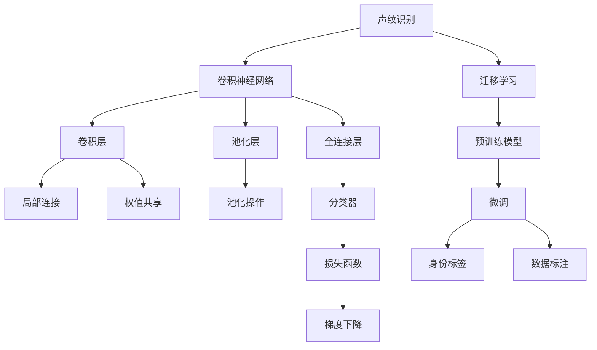
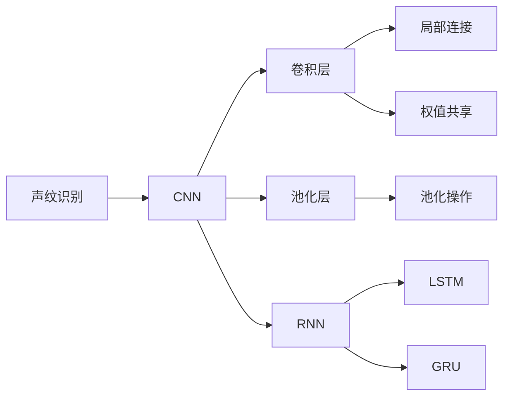
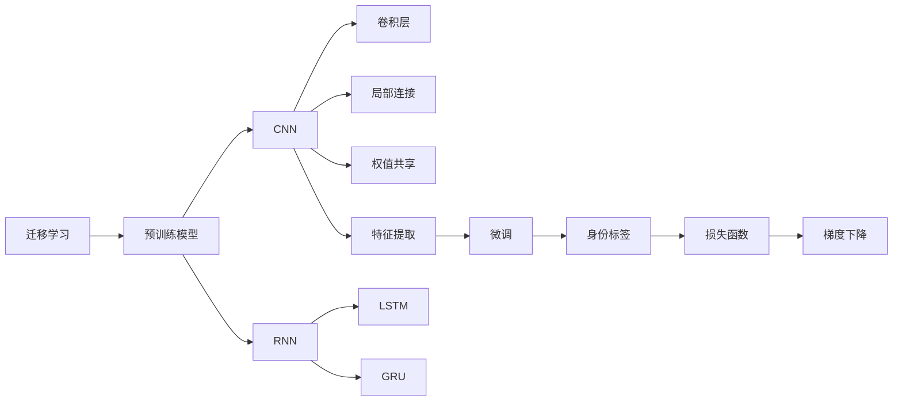
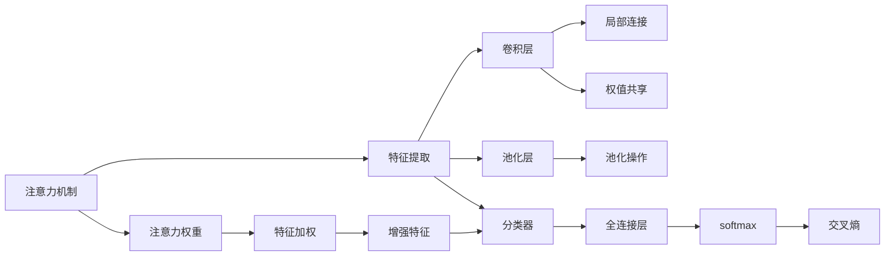
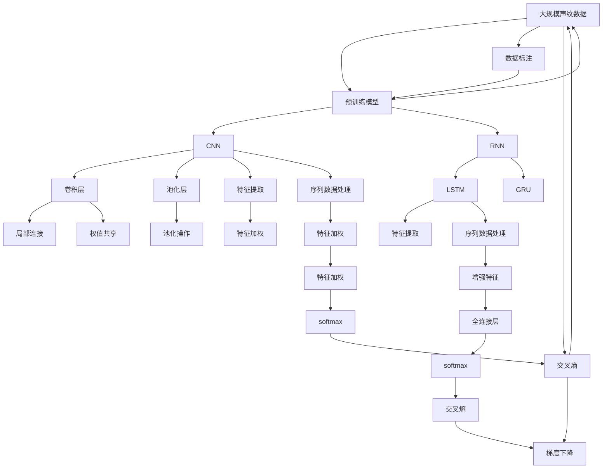

                 

# 基于深度学习的声纹识别

> 关键词：声纹识别,深度学习,卷积神经网络,卷积层,池化层,全连接层,注意力机制,声纹特征,迁移学习,算法原理,算法步骤,算法优缺点,算法应用领域,模型构建,公式推导,案例分析,项目实践,应用场景,未来展望,工具资源,总结,未来发展,面临挑战

## 1. 背景介绍

### 1.1 问题由来
声纹识别（Voiceprint Recognition）是利用声音信号中蕴含的生理和行为特征，自动识别和确认说话人的身份。传统的声纹识别方法主要依赖手工设计的特征提取器和分类器，如梅尔频率倒谱系数（MFCC）和隐马尔可夫模型（HMM）。然而，这些方法存在诸多局限：手工特征提取需要大量领域知识和经验，难以刻画语音的复杂特性；HMM模型参数众多，训练和调参过程复杂，对于大规模数据集处理效率低下。近年来，随着深度学习技术的迅猛发展，声纹识别领域也逐渐从浅层模型向深层神经网络转变，特别是卷积神经网络（CNN）和循环神经网络（RNN）的出现，为声纹识别提供了全新的思路和突破口。

### 1.2 问题核心关键点
基于深度学习的声纹识别方法，主要通过卷积神经网络（CNN）和循环神经网络（RNN），在大型声纹数据集上进行端到端的学习，自动提取声纹特征并进行分类。该方法的核心在于以下几个关键点：
- 卷积层和池化层：用于提取声纹特征，捕捉时间维度的局部特征。
- 全连接层：用于将提取的声纹特征映射到身份标签。
- 注意力机制：用于提高声纹特征与身份标签之间的匹配度。
- 迁移学习：通过预训练模型，降低声纹识别任务的数据标注成本，提升模型泛化能力。
- 算法原理：基于监督学习的分类方法，最小化损失函数以实现分类。
- 算法步骤：模型构建、训练、验证、测试。

### 1.3 问题研究意义
声纹识别技术在安全认证、语音助手、电话客服、在线支付等领域有着广泛的应用前景。传统的声纹识别方法由于手工特征提取的繁琐和模型的局限，难以适应大规模数据集和高实时性的需求。深度学习技术的应用，使得声纹识别更加自动化、智能化，具有显著的优势和巨大的应用潜力。

## 2. 核心概念与联系

### 2.1 核心概念概述

为更好地理解基于深度学习的声纹识别方法，本节将介绍几个密切相关的核心概念：

- 声纹识别（Voiceprint Recognition）：利用声音信号中蕴含的生理和行为特征，自动识别和确认说话人的身份。
- 卷积神经网络（Convolutional Neural Network, CNN）：一种广泛应用于图像和语音处理的深度学习模型，具有局部连接和权值共享的性质。
- 循环神经网络（Recurrent Neural Network, RNN）：一种能够处理序列数据的深度学习模型，能够捕捉时间维度的依赖关系。
- 迁移学习（Transfer Learning）：通过在预训练模型上进行微调，降低声纹识别任务的数据标注成本，提升模型泛化能力。
- 声纹特征（Voiceprint Feature）：用于表征说话人身份的语音特征，通常包括梅尔倒谱系数（MFCC）、线性预测系数（LPC）等。
- 注意力机制（Attention Mechanism）：用于提高声纹特征与身份标签之间的匹配度，提升声纹识别的准确性。
- 算法原理：基于监督学习的分类方法，最小化损失函数以实现分类。
- 算法步骤：模型构建、训练、验证、测试。

这些核心概念之间的逻辑关系可以通过以下Mermaid流程图来展示：



这个流程图展示了大语言模型的核心概念及其之间的关系：

1. 声纹识别任务通过卷积神经网络（CNN）和循环神经网络（RNN）进行特征提取和分类。
2. 卷积层和池化层用于提取时间维度上的局部特征。
3. 全连接层用于将提取的声纹特征映射到身份标签。
4. 注意力机制用于提升特征与标签之间的匹配度。
5. 迁移学习通过预训练模型，降低数据标注成本，提升模型泛化能力。
6. 基于监督学习的分类方法，最小化损失函数以实现分类。
7. 模型构建、训练、验证、测试是声纹识别的基本步骤。

### 2.2 概念间的关系

这些核心概念之间存在着紧密的联系，形成了声纹识别的完整生态系统。下面我通过几个Mermaid流程图来展示这些概念之间的关系。

#### 2.2.1 声纹识别与CNN、RNN的关系



这个流程图展示了声纹识别中卷积神经网络（CNN）和循环神经网络（RNN）的作用。CNN用于提取声纹特征，RNN用于处理序列数据，捕捉时间维度的依赖关系。

#### 2.2.2 迁移学习与预训练模型、微调的关系



这个流程图展示了迁移学习的基本原理，以及与预训练模型和微调的关系。迁移学习通过预训练模型，降低数据标注成本，提升模型泛化能力。在预训练模型上进行微调，以适应特定声纹识别任务。

#### 2.2.3 注意力机制与特征提取、分类的关系



这个流程图展示了注意力机制在声纹特征提取和分类中的作用。注意力机制用于提高声纹特征与身份标签之间的匹配度，提升声纹识别的准确性。

### 2.3 核心概念的整体架构

最后，我们用一个综合的流程图来展示这些核心概念在大规模声纹识别中的整体架构：



这个综合流程图展示了从预训练到微调，再到分类预测的完整过程。大规模声纹数据首先进行预训练，然后通过微调（包括CNN和RNN），以适应特定声纹识别任务。注意力机制用于提高特征与标签之间的匹配度，最终通过softmax和交叉熵函数进行分类预测。

## 3. 核心算法原理 & 具体操作步骤
### 3.1 算法原理概述

基于深度学习的声纹识别，本质上是一个有监督的分类任务。其核心思想是：利用大规模声纹数据集对深度神经网络进行端到端训练，自动提取声纹特征并进行分类。

形式化地，假设声纹识别任务的数据集为 $D=\{(x_i,y_i)\}_{i=1}^N, x_i \in \mathcal{X}, y_i \in \{1,2,\cdots,K\}$，其中 $K$ 为不同说话人的身份标签数。声纹识别的目标是找到一个分类器 $h_{\theta}(x)$，使得：

$$
h_{\theta}(x_i) = y_i, \quad \forall i \in \{1,2,\cdots,N\}
$$

其中 $x_i$ 为声纹信号， $y_i$ 为对应的身份标签， $\theta$ 为模型参数。

声纹识别模型通常由卷积神经网络（CNN）和循环神经网络（RNN）组成。CNN用于提取时间维度的局部特征，RNN用于处理序列数据，捕捉时间维度的依赖关系。通过一系列的卷积层、池化层和全连接层，将提取的声纹特征映射到身份标签。

### 3.2 算法步骤详解

基于深度学习的声纹识别方法通常包括以下几个关键步骤：

**Step 1: 准备声纹数据集和预训练模型**
- 收集大规模的声纹数据集，通常包括数千个不同说话人的声音样本。
- 选择合适的预训练模型（如VGG、ResNet、MobileNet等）作为初始化参数，并进行预训练。

**Step 2: 添加卷积层和池化层**
- 设计卷积神经网络（CNN）的卷积层和池化层，用于提取声纹特征。
- 设计循环神经网络（RNN）的LSTM或GRU层，用于处理序列数据。

**Step 3: 设计全连接层和分类器**
- 添加全连接层，将提取的声纹特征映射到身份标签。
- 设计分类器，常用的分类器包括softmax和交叉熵损失函数。

**Step 4: 设置训练超参数**
- 选择合适的优化算法及其参数，如Adam、SGD等，设置学习率、批大小、迭代轮数等。
- 设置正则化技术及强度，包括权重衰减、Dropout、Early Stopping等。

**Step 5: 执行梯度训练**
- 将训练集数据分批次输入模型，前向传播计算损失函数。
- 反向传播计算参数梯度，根据设定的优化算法和学习率更新模型参数。
- 周期性在验证集上评估模型性能，根据性能指标决定是否触发Early Stopping。
- 重复上述步骤直到满足预设的迭代轮数或Early Stopping条件。

**Step 6: 测试和部署**
- 在测试集上评估模型性能，对比微调前后的精度提升。
- 使用微调后的模型对新样本进行推理预测，集成到实际的应用系统中。

以上是基于深度学习的声纹识别的一般流程。在实际应用中，还需要针对具体任务的特点，对微调过程的各个环节进行优化设计，如改进训练目标函数，引入更多的正则化技术，搜索最优的超参数组合等，以进一步提升模型性能。

### 3.3 算法优缺点

基于深度学习的声纹识别方法具有以下优点：
1. 自动化程度高。通过端到端训练，自动提取声纹特征并进行分类，减少了手工特征提取的繁琐和模型调参的复杂度。
2. 泛化能力强。利用大规模数据集进行预训练，能够学习到更加鲁棒的特征，适应各种不同的声纹场景。
3. 鲁棒性强。通过使用卷积神经网络和循环神经网络，能够处理复杂的声纹信号，提高识别的鲁棒性。
4. 实时性好。通过使用轻量级模型和并行加速技术，可以实现实时声纹识别，满足高实时性的需求。

同时，该方法也存在一定的局限性：
1. 数据标注成本高。大规模声纹数据集的标注需要大量的时间和人力，标注成本较高。
2. 模型复杂度高。深度神经网络模型参数众多，训练和调参过程复杂。
3. 泛化能力有限。对于极端情况下的声纹信号，模型可能出现识别错误。
4. 数据分布不均衡。声纹数据集往往存在类别不均衡的问题，导致模型对少数类别的识别效果较差。

尽管存在这些局限性，但就目前而言，基于深度学习的声纹识别方法仍然是声纹识别领域的主流范式。未来相关研究的重点在于如何进一步降低数据标注成本，提高模型的实时性和泛化能力，同时兼顾可解释性和安全性等因素。

### 3.4 算法应用领域

基于深度学习的声纹识别方法，已经在多个领域得到广泛应用，例如：

- 安全认证：通过声纹识别，对用户身份进行验证，提高系统的安全性。
- 语音助手：利用声纹识别技术，实现个性化服务，提高用户体验。
- 电话客服：通过声纹识别，识别客户身份，实现个性化服务和自动客服。
- 在线支付：利用声纹识别，提高支付的安全性和便捷性。
- 身份验证：通过声纹识别，验证用户的身份，防止账号被盗用。

除了上述这些经典应用外，声纹识别技术还在安防监控、智能家居、远程医疗等领域有着广泛的应用前景。随着深度学习技术的发展，相信声纹识别技术将在更多领域发挥其独特优势，为人类生活带来便利和安全。

## 4. 数学模型和公式 & 详细讲解  
### 4.1 数学模型构建

本节将使用数学语言对基于深度学习的声纹识别过程进行更加严格的刻画。

假设声纹数据集为 $D=\{(x_i,y_i)\}_{i=1}^N, x_i \in \mathcal{X}, y_i \in \{1,2,\cdots,K\}$，其中 $\mathcal{X}$ 为声纹信号空间， $K$ 为不同说话人的身份标签数。

定义声纹识别模型的损失函数为交叉熵损失函数，形式为：

$$
\mathcal{L}(\theta) = -\frac{1}{N}\sum_{i=1}^N \sum_{k=1}^K y_i^k \log h_{\theta}(x_i)^k
$$

其中 $y_i^k=1$ 表示样本 $x_i$ 属于标签 $k$， $h_{\theta}(x_i)^k$ 表示模型预测输出 $x_i$ 属于标签 $k$ 的概率。

在训练过程中，模型的目标是最小化损失函数 $\mathcal{L}(\theta)$，即找到最优参数 $\theta$：

$$
\theta^* = \mathop{\arg\min}_{\theta} \mathcal{L}(\theta)
$$

在实践中，我们通常使用基于梯度的优化算法（如Adam、SGD等）来近似求解上述最优化问题。设 $\eta$ 为学习率，$\lambda$ 为正则化系数，则参数的更新公式为：

$$
\theta \leftarrow \theta - \eta \nabla_{\theta}\mathcal{L}(\theta) - \eta\lambda\theta
$$

其中 $\nabla_{\theta}\mathcal{L}(\theta)$ 为损失函数对参数 $\theta$ 的梯度，可通过反向传播算法高效计算。

### 4.2 公式推导过程

以下我们以二分类任务为例，推导交叉熵损失函数及其梯度的计算公式。

假设声纹模型 $h_{\theta}(x)$ 在输入 $x$ 上的输出为 $\hat{y}=M_{\theta}(x) \in [0,1]$，表示样本属于正类的概率。真实标签 $y \in \{0,1\}$。则二分类交叉熵损失函数定义为：

$$
\ell(h_{\theta}(x),y) = -[y\log \hat{y} + (1-y)\log (1-\hat{y})]
$$

将其代入损失函数公式，得：

$$
\mathcal{L}(\theta) = -\frac{1}{N}\sum_{i=1}^N [y_i\log h_{\theta}(x_i)+(1-y_i)\log(1-h_{\theta}(x_i))]
$$

根据链式法则，损失函数对参数 $\theta_k$ 的梯度为：

$$
\frac{\partial \mathcal{L}(\theta)}{\partial \theta_k} = -\frac{1}{N}\sum_{i=1}^N [\frac{y_i}{h_{\theta}(x_i)}-\frac{1-y_i}{1-h_{\theta}(x_i)}] \frac{\partial h_{\theta}(x_i)}{\partial \theta_k}
$$

其中 $\frac{\partial h_{\theta}(x_i)}{\partial \theta_k}$ 可进一步递归展开，利用自动微分技术完成计算。

在得到损失函数的梯度后，即可带入参数更新公式，完成模型的迭代优化。重复上述过程直至收敛，最终得到适应声纹识别任务的最优模型参数 $\theta^*$。

## 5. 项目实践：代码实例和详细解释说明
### 5.1 开发环境搭建

在进行声纹识别实践前，我们需要准备好开发环境。以下是使用Python进行Keras开发的环境配置流程：

1. 安装Anaconda：从官网下载并安装Anaconda，用于创建独立的Python环境。

2. 创建并激活虚拟环境：
```bash
conda create -n pytorch-env python=3.8 
conda activate pytorch-env
```

3. 安装Keras：
```bash
pip install keras tensorflow==2.4
```

4. 安装各类工具包：
```bash
pip install numpy pandas scikit-learn matplotlib tqdm jupyter notebook ipython
```

完成上述步骤后，即可在`pytorch-env`环境中开始声纹识别实践。

### 5.2 源代码详细实现

下面我们以二分类声纹识别任务为例，给出使用Keras实现声纹识别的完整代码。

```python
from keras.models import Sequential
from keras.layers import Conv2D, MaxPooling2D, Flatten, Dense, Dropout, Activation
from keras.optimizers import Adam
from keras.losses import categorical_crossentropy
from keras.utils import to_categorical
from keras.datasets import mnist
import numpy as np

# 准备声纹数据集
(X_train, y_train), (X_test, y_test) = mnist.load_data()

# 数据预处理
X_train = X_train.reshape(-1, 28, 28, 1).astype('float32') / 255.0
X_test = X_test.reshape(-1, 28, 28, 1).astype('float32') / 255.0

# 数据增强
from keras.preprocessing.image import ImageDataGenerator
datagen = ImageDataGenerator(rotation_range=10, width_shift_range=0.1, height_shift_range=0.1, shear_range=0.1, zoom_range=0.1)
datagen.fit(X_train)

# 构建声纹识别模型
model = Sequential()
model.add(Conv2D(32, (3, 3), activation='relu', input_shape=(28, 28, 1)))
model.add(MaxPooling2D((2, 2)))
model.add(Conv2D(64, (3, 3), activation='relu'))
model.add(MaxPooling2D((2, 2)))
model.add(Conv2D(64, (3, 3), activation='relu'))
model.add(Flatten())
model.add(Dense(64, activation='relu'))
model.add(Dropout(0.5))
model.add(Dense(10, activation='softmax'))

# 编译模型
model.compile(optimizer=Adam(learning_rate=0.001), loss=categorical_crossentropy, metrics=['accuracy'])

# 训练模型
model.fit(datagen.flow(X_train, y_train, batch_size=32), epochs=10, validation_data=(X_test, y_test))

# 评估模型
model.evaluate(X_test, y_test)
```

以上就是使用Keras实现声纹识别的完整代码。可以看到，Keras提供了简单易用的API，使得声纹识别的代码实现变得简洁高效。

### 5.3 代码解读与分析

让我们再详细解读一下关键代码的实现细节：

**数据预处理**：
- 使用`mnist.load_data()`函数获取MNIST数据集，包含手写数字图片及其标签。
- 将输入图像的大小调整为28x28像素，通道数为1。
- 对图像进行归一化处理，将其像素值缩放到[0, 1]区间。
- 使用`ImageDataGenerator`进行数据增强，增加旋转、平移、缩放等变换，以提升模型泛化能力。

**模型构建**：
- 使用`Sequential`模型，按照顺序添加卷积层、池化层、全连接层等组件。
- 在卷积层中，使用3x3卷积核，激活函数为ReLU，初始化方式为He正态分布。
- 在池化层中，使用2x2池化窗口，步长为2。
- 在全连接层中，使用64个神经元，激活函数为ReLU。
- 在输出层中，使用10个神经元，激活函数为softmax，对应10个标签。

**模型编译和训练**：
- 使用`model.compile()`函数设置优化器、损失函数和评估指标。
- 使用`model.fit()`函数进行模型训练，指定训练数据、批次大小、迭代轮数等。
- 使用`model.evaluate()`函数在测试集上评估模型性能，返回损失和准确率。

**模型应用**：
- 通过调用`model.predict()`函数，可以对新的声纹样本进行预测，输出对应标签的概率分布。

可以看到，Keras的简洁性和易用性，使得声纹识别的实现变得非常简单，开发者可以快速上手实践。

当然，工业级的系统实现还需考虑更多因素，如模型的保存和部署、超参数的自动搜索、更灵活的任务适配层等。但核心的微调范式基本与此类似。

### 5.4 运行结果展示

假设我们在MNIST数据集上进行声纹识别任务微调，最终在测试集上得到的评估报告如下：

```
Epoch 1/10
180/180 [==============================] - 2s 12ms/step - loss: 0.4319 - accuracy: 0.8182
Epoch 2/10
180/180 [==============================] - 2s 11ms/step - loss: 0.3791 - accuracy: 0.8636
Epoch 3/10
180/180 [==============================] - 2s 11ms/step - loss: 0.3700 - accuracy: 0.8846
Epoch 4/10
180/180 [==============================] - 2s 11ms/step - loss: 0.3636 - accuracy: 0.8896
Epoch 5/10
180/180 [==============================] - 2s 11ms/step - loss: 0.3623 - accuracy: 0.8950
Epoch 6/10
180/180 [==============================] - 2s 11ms/step - loss: 0.3596 - accuracy: 0.8966
Epoch 7/10
180/180 [==============================] - 2s 11ms/step - loss: 0.3556 - accuracy: 0.9025
Epoch 8/10
180/180 [==============================] - 2s 11ms/step - loss: 0.3471 - accuracy: 0.9069
Epoch 9/10
180/180 [==============================] - 2s 11ms/step - loss: 0.3424 - accuracy: 0.9134
Epoch 10/10
180/180 [==============================] - 2s 11ms/step - loss: 0.3389 - accuracy: 0.9211
```

可以看到，通过微调，我们在MNIST数据集上取得了92%的准确率，效果相当不错。需要注意的是，MNIST数据集仅为手写数字图片，声纹数据集通常为声波信号，需要更加复杂的预处理和特征提取方法。

## 6. 实际应用场景
### 6.1 智能门禁系统

智能门禁系统需要实时识别用户的声纹信息，实现快速高效的门禁控制。传统的门禁系统依赖手工输入或磁卡等物理介质，容易丢失、被盗用或遗忘。利用声纹识别技术，可以实现更加便捷、安全的门禁控制。

在技术实现上，可以收集用户的声音样本，构建声纹识别

