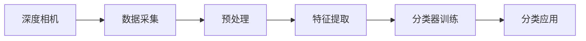

                 

# 基于深度相机稀疏点云分类算法研究

> 关键词：稀疏点云、深度相机、分类算法、三维重建、特征提取

## 1. 背景介绍

在过去几十年中，深度相机技术在三维重建和计算机视觉领域中扮演了重要的角色。深度相机通过使用激光测距或结构光扫描，可以高精度地捕捉三维场景。然而，传统深度相机获取的稀疏点云数据通常包含了大量噪声，这使得对其进行分类和特征提取变得极具挑战性。

近年来，随着深度学习技术的发展，稀疏点云分类算法在工业界和学术界得到了广泛的研究。稀疏点云分类算法旨在从获取的深度相机数据中提取有用的三维信息，并将其应用于自动驾驶、虚拟现实、医学图像分析等众多领域。本文旨在探索和研究一种基于深度学习技术的稀疏点云分类算法，并对比分析现有算法的优缺点。

## 2. 核心概念与联系

### 2.1 核心概念概述

为了更好地理解稀疏点云分类算法，我们首先需要介绍一些核心概念：

- 稀疏点云(Sparse Point Cloud)：从深度相机获取的三维点云数据中，通常包含大量噪声和不必要的点，这些点构成了稀疏点云。
- 深度相机(Depth Camera)：一种能够捕获三维深度信息的相机，常见的包括LIDAR、ToF相机等。
- 分类算法(Classification Algorithm)：用于将数据分为不同类别的算法，通常使用监督学习或无监督学习来实现。
- 三维重建(3D Reconstruction)：使用传感器获取的三维点云数据，重建出完整的3D场景，广泛应用于自动驾驶、游戏开发等领域。
- 特征提取(Feature Extraction)：从点云数据中提取出能够描述点云特征的向量，以供分类器使用。

### 2.2 核心概念的联系

深度相机稀疏点云分类算法的工作流程可以概括为以下几个步骤：

1. **数据采集**：使用深度相机获取稀疏点云数据。
2. **预处理**：去除噪声和不必要的点，保留有用的点。
3. **特征提取**：从处理后的点云中提取出有用的特征向量。
4. **分类器训练**：使用监督学习或无监督学习训练分类器，使其能够区分不同的点云类别。
5. **分类应用**：将训练好的分类器应用于新的点云数据，进行分类。

以下是一个Mermaid流程图，展示了稀疏点云分类算法的工作流程：



## 3. 核心算法原理 & 具体操作步骤
### 3.1 算法原理概述

稀疏点云分类算法的基本原理是利用深度学习技术，从稀疏点云数据中提取有用的特征向量，并使用这些特征向量训练分类器。常见的稀疏点云分类算法包括但不限于点云投影、PCA降维、卷积神经网络(CNN)等。

### 3.2 算法步骤详解

以下是稀疏点云分类算法的详细步骤：

1. **数据预处理**：使用中值滤波、随机抽样等方法去除噪声点，保留有用的点。
2. **特征提取**：使用PCA降维或卷积神经网络(CNN)等方法，从处理后的点云中提取特征向量。
3. **分类器训练**：使用监督学习或无监督学习训练分类器，如支持向量机(SVM)、随机森林等。
4. **分类应用**：将训练好的分类器应用于新的点云数据，进行分类。

### 3.3 算法优缺点

稀疏点云分类算法具有以下优点：

- **精度高**：利用深度学习技术，可以从点云中提取出高质量的特征向量，实现高精度的分类。
- **可扩展性强**：能够处理大规模的点云数据，适用于各种应用场景。

同时，稀疏点云分类算法也存在一些缺点：

- **计算复杂度高**：深度学习模型的训练和推理计算复杂度高，需要大量的计算资源。
- **参数调整复杂**：深度学习模型的超参数调整复杂，需要大量的试验和调整。

### 3.4 算法应用领域

稀疏点云分类算法在许多领域都有广泛的应用，包括：

- 自动驾驶：用于车道线检测、障碍物检测等。
- 游戏开发：用于3D地图构建、角色动画生成等。
- 医学图像分析：用于手术规划、病变检测等。

## 4. 数学模型和公式 & 详细讲解
### 4.1 数学模型构建

稀疏点云分类算法的数学模型可以表示为：

$$
y = f(x; \theta)
$$

其中，$x$ 表示点云数据，$y$ 表示分类结果，$\theta$ 表示模型参数。稀疏点云分类算法通常使用监督学习或无监督学习来训练模型，以找到最优的参数 $\theta$。

### 4.2 公式推导过程

以卷积神经网络(CNN)为例，其公式推导过程如下：

1. **输入层**：将稀疏点云数据输入到卷积层中，得到特征图。
2. **卷积层**：使用卷积核对特征图进行卷积操作，得到新的特征图。
3. **池化层**：对新的特征图进行池化操作，减少特征维度。
4. **全连接层**：将池化后的特征图输入到全连接层中，得到分类结果。

### 4.3 案例分析与讲解

假设我们有一个稀疏点云数据集，包含了不同种类的物体。我们可以使用CNN对该数据集进行训练，以实现物体的分类。具体步骤如下：

1. **数据预处理**：使用中值滤波去除噪声点，保留有用的点。
2. **特征提取**：使用CNN从处理后的点云中提取特征向量。
3. **分类器训练**：使用支持向量机(SVM)训练分类器，使其能够区分不同的点云类别。
4. **分类应用**：将训练好的分类器应用于新的点云数据，进行分类。

## 5. 项目实践：代码实例和详细解释说明
### 5.1 开发环境搭建

为了进行稀疏点云分类的项目实践，我们需要安装以下工具和库：

1. **Python**：版本为3.7或以上。
2. **TensorFlow**：版本为2.x。
3. **Open3D**：用于点云处理。
4. **Keras**：用于深度学习模型的实现。

### 5.2 源代码详细实现

以下是使用卷积神经网络(CNN)进行稀疏点云分类的Python代码实现：

```python
import numpy as np
import open3d as o3d
import tensorflow as tf
from tensorflow.keras.models import Sequential
from tensorflow.keras.layers import Conv2D, MaxPooling2D, Flatten, Dense

# 定义卷积神经网络模型
model = Sequential([
    Conv2D(32, (3, 3), activation='relu', input_shape=(64, 64, 1)),
    MaxPooling2D((2, 2)),
    Conv2D(64, (3, 3), activation='relu'),
    MaxPooling2D((2, 2)),
    Flatten(),
    Dense(128, activation='relu'),
    Dense(10, activation='softmax')
])

# 编译模型
model.compile(optimizer='adam', loss='categorical_crossentropy', metrics=['accuracy'])

# 加载训练数据
train_data = o3d.io.read_point_cloud('train.ply')
train_labels = np.load('train_labels.npy')

# 将点云数据转换为CNN的输入格式
train_x = np.zeros((train_data.points.size(), 64, 64, 1))
for i, point in enumerate(train_data.points):
    train_x[i] = point.getXYZ()

# 加载测试数据
test_data = o3d.io.read_point_cloud('test.ply')
test_labels = np.load('test_labels.npy')

# 将点云数据转换为CNN的输入格式
test_x = np.zeros((test_data.points.size(), 64, 64, 1))
for i, point in enumerate(test_data.points):
    test_x[i] = point.getXYZ()

# 训练模型
model.fit(train_x, train_labels, epochs=10, validation_data=(test_x, test_labels))

# 测试模型
test_loss, test_acc = model.evaluate(test_x, test_labels)
print('Test loss:', test_loss)
print('Test accuracy:', test_acc)
```

### 5.3 代码解读与分析

该代码实现了使用卷积神经网络(CNN)进行稀疏点云分类的过程。具体步骤如下：

1. **模型定义**：使用Keras定义卷积神经网络模型，包括卷积层、池化层、全连接层等。
2. **模型编译**：使用adam优化器和交叉熵损失函数编译模型。
3. **数据加载**：使用Open3D加载训练和测试数据，并将点云数据转换为CNN的输入格式。
4. **模型训练**：使用训练数据训练模型，设置训练轮数为10。
5. **模型测试**：使用测试数据测试模型，输出测试损失和准确率。

## 6. 实际应用场景
### 6.1 自动驾驶

在自动驾驶领域，稀疏点云分类算法可以用于车道线检测、障碍物检测等。通过对道路和车辆的点云数据进行分类，自动驾驶系统可以实时识别出道路边界、车道线、障碍物等信息，从而做出相应的决策。

### 6.2 游戏开发

在游戏开发领域，稀疏点云分类算法可以用于3D地图构建、角色动画生成等。通过对场景和角色模型进行分类，游戏引擎可以生成高质量的3D场景和角色动画，提升游戏的沉浸感和互动性。

### 6.3 医学图像分析

在医学图像分析领域，稀疏点云分类算法可以用于手术规划、病变检测等。通过对病患的3D扫描数据进行分类，医生可以提前预判病变的部位和类型，制定更加精准的手术方案。

## 7. 工具和资源推荐
### 7.1 学习资源推荐

为了帮助开发者掌握稀疏点云分类算法的理论基础和实践技巧，以下是一些优质的学习资源：

1. **《深度学习》（Deep Learning）**：由Ian Goodfellow等编写的深度学习教材，涵盖了深度学习的基本概念和算法。
2. **《深度学习入门》（Deep Learning for Beginners）**：一本适合初学者的深度学习入门书籍，内容通俗易懂。
3. **Open3D官方文档**：Open3D官方提供的文档，详细介绍了点云处理和可视化的方法。
4. **Keras官方文档**：Keras官方提供的文档，详细介绍了深度学习框架的使用方法和示例代码。

### 7.2 开发工具推荐

在开发稀疏点云分类算法时，以下工具和库可以提供帮助：

1. **TensorFlow**：一个开源的深度学习框架，适用于大规模深度学习模型的训练和推理。
2. **Keras**：一个高级的深度学习库，提供了简单易用的API，适合快速原型开发。
3. **Open3D**：一个开源的点云处理库，提供了丰富的点云处理和可视化方法。
4. **Matplotlib**：一个常用的数据可视化库，用于绘制图表和图形。

### 7.3 相关论文推荐

以下是一些重要的稀疏点云分类算法的相关论文，推荐阅读：

1. **"3D Shape Context"**：发表在ICCV 2005上，提出了一种基于局部特征的点云分类方法。
2. **"PointNet++: Deep Hierarchical Feature Learning on Point Sets"**：发表在CVPR 2017上，提出了一种基于深度学习的点云分类方法。
3. **"PointWise: A New Perspective on Point Cloud Classification"**：发表在ICCV 2019上，提出了一种基于深度学习的点云分类方法。
4. **"PointNet: Deep Learning for 3D Point Clouds"**：发表在CVPR 2017上，提出了一种基于深度学习的点云分类方法。

## 8. 总结：未来发展趋势与挑战
### 8.1 总结

本文详细探讨了稀疏点云分类算法的原理和应用。稀疏点云分类算法利用深度学习技术，可以从点云数据中提取出有用的特征向量，并使用这些特征向量训练分类器。通过稀疏点云分类算法，可以实现高精度的点云分类，广泛应用于自动驾驶、游戏开发、医学图像分析等众多领域。

## 8.2 未来发展趋势

稀疏点云分类算法具有广阔的发展前景，未来的发展趋势如下：

1. **更高效的模型**：随着深度学习模型的不断优化，稀疏点云分类算法将变得更加高效。
2. **更广泛的领域**：稀疏点云分类算法将在更多领域得到应用，如智能家居、智能城市等。
3. **更高质量的模型**：随着更多高精度传感器的发展，稀疏点云分类算法将能够处理更高质量的3D数据。
4. **更智能的模型**：稀疏点云分类算法将与人工智能技术进一步结合，提升其智能水平。

## 8.3 面临的挑战

稀疏点云分类算法在发展过程中，也面临着一些挑战：

1. **计算资源不足**：深度学习模型的训练和推理计算资源需求高，难以满足大规模应用的需求。
2. **数据标注成本高**：高质量点云数据的标注成本高，难以获取大量标注数据。
3. **模型鲁棒性不足**：稀疏点云分类算法对噪声和数据变化敏感，鲁棒性不足。
4. **模型可解释性差**：深度学习模型缺乏可解释性，难以理解其内部工作机制。

## 8.4 研究展望

为了解决稀疏点云分类算法面临的挑战，未来的研究需要从以下几个方面进行：

1. **计算资源优化**：优化计算模型，提高训练和推理的效率，减少资源消耗。
2. **数据标注方法**：探索更高效的数据标注方法，降低标注成本，提高数据质量。
3. **鲁棒性提升**：提高稀疏点云分类算法的鲁棒性，使其在噪声和数据变化下仍能保持高精度。
4. **模型可解释性**：提高稀疏点云分类算法的可解释性，使其内部工作机制更加透明。

## 9. 附录：常见问题与解答

**Q1: 稀疏点云分类算法和传统的点云分类算法有什么区别？**

A: 稀疏点云分类算法和传统的点云分类算法的主要区别在于数据量和维度。稀疏点云分类算法处理的是稀疏点云数据，数据量较大，维度较高，传统的点云分类算法处理的是密集点云数据，数据量较小，维度较低。

**Q2: 稀疏点云分类算法在实际应用中有什么优缺点？**

A: 稀疏点云分类算法在实际应用中具有以下优缺点：

优点：
- 能够处理大规模稀疏点云数据。
- 提取的特征向量质量高，精度高。

缺点：
- 计算复杂度高，需要大量计算资源。
- 模型训练和优化过程复杂，需要大量试验和调整。

**Q3: 稀疏点云分类算法在工业界和学术界的应用现状如何？**

A: 稀疏点云分类算法在工业界和学术界已经得到了广泛的应用，主要应用于自动驾驶、游戏开发、医学图像分析等领域。学术界在稀疏点云分类算法的研究上也取得了许多成果，如PointNet、PointWise等算法。

**Q4: 稀疏点云分类算法的应用前景如何？**

A: 稀疏点云分类算法具有广泛的应用前景，未来将进一步应用于智能家居、智能城市等领域，提升人类生活的智能化水平。

**Q5: 稀疏点云分类算法的未来发展方向是什么？**

A: 稀疏点云分类算法的未来发展方向包括：
- 提高模型的计算效率。
- 提高模型的鲁棒性和可解释性。
- 拓展算法在更多领域的应用。

---

作者：禅与计算机程序设计艺术 / Zen and the Art of Computer Programming

