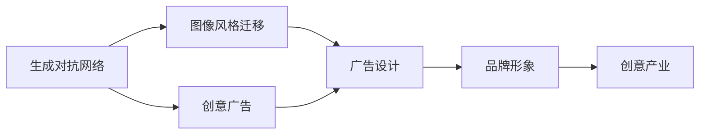

                 

# 基于生成对抗网络的图像风格迁移在广告设计中的应用

> 关键词：生成对抗网络, 图像风格迁移, 广告设计, 创意广告, 品牌形象, 创意产业

## 1. 背景介绍

### 1.1 问题由来

随着数字广告的蓬勃发展，广告创意的个性化、多样化成为了品牌竞争的关键。传统的手工制作广告创意费时费力、成本高昂，无法快速响应市场变化。因此，寻找一种快速、高效、低成本的广告创意生成方法变得尤为重要。

与此同时，图像风格迁移技术近年取得了显著进展，通过将一幅图像的风格应用于另一幅图像，可以有效提升图像的艺术性和视觉效果。这一技术在艺术创作、电影特效等领域已得到了广泛应用。将图像风格迁移技术应用于广告设计，可以显著提升广告创意的创意性和吸引性，帮助品牌快速生成与众不同的广告素材。

### 1.2 问题核心关键点

基于生成对抗网络的图像风格迁移方法，利用了深度神经网络强大的图像生成和风格表示能力，能够在不改变图像内容的情况下，将目标风格迁移到源图像上。该方法的主要步骤包括：
- 提取源图像和目标图像的特征表示。
- 生成网络将源图像特征转换为风格表示。
- 解码网络将风格表示转换为目标风格的图像。
- 通过对抗训练优化生成网络，使得生成图像与真实图像的差异最小化。

通过这一方法，可以实现高效、低成本的广告创意生成，提升广告设计的效果和效率。

### 1.3 问题研究意义

图像风格迁移在广告设计中的应用，具有以下重要意义：
- 降低创意成本：替代传统手工制作，大幅降低广告创意制作的成本和时间。
- 提升广告效果：创意广告更具个性化和吸引力，提升用户的注意力和点击率。
- 加速品牌传播：通过快速生成多种创意广告，品牌能够迅速响应市场变化，提升品牌曝光度。
- 优化创意生产流程：整合创意生成和制作，简化流程，提高广告设计的整体效率。

## 2. 核心概念与联系

### 2.1 核心概念概述

为更好地理解基于生成对抗网络的图像风格迁移方法，本节将介绍几个密切相关的核心概念：

- 生成对抗网络（Generative Adversarial Network, GAN）：一种由生成器和判别器两个网络组成，通过对抗训练的方式生成高质量、逼真图像的深度学习模型。
- 图像风格迁移（Image Style Transfer）：将一幅图像的风格应用于另一幅图像，生成具有目标风格的新图像。
- 广告设计（Ad Design）：指根据品牌需求，结合创意和设计原则，制作符合目标受众偏好的广告素材。
- 创意广告（Creative Advertisement）：指具有独特创意和艺术表现的广告，能够吸引受众的注意力并留下深刻印象。

这些核心概念之间的逻辑关系可以通过以下Mermaid流程图来展示：



这个流程图展示了大语言模型的核心概念及其之间的关系：

1. 生成对抗网络通过对抗训练，生成高质量图像。
2. 图像风格迁移将目标风格应用于源图像，生成具有目标风格的新图像。
3. 广告设计需要创意和设计，利用生成对抗网络生成的图像和风格迁移技术，生成具有创意的广告素材。
4. 创意广告具有独特创意和艺术表现，是广告设计的一部分。
5. 品牌形象通过创意广告展示，是广告设计的重要目标。
6. 创意产业需要创意广告，因此与广告设计紧密相关。

### 2.2 概念间的关系

这些核心概念之间存在着紧密的联系，形成了图像风格迁移技术在广告设计中的应用框架。

- 生成对抗网络作为图像生成和风格迁移的基础，为广告设计提供了高效、逼真的图像生成手段。
- 图像风格迁移技术，通过将目标风格应用于源图像，可以生成具有独特创意的广告素材。
- 广告设计需要创意和艺术表现，利用生成对抗网络和风格迁移技术，可以生成具有高艺术性的广告素材。
- 创意广告通过吸引用户的注意力，提升品牌的曝光度和影响力，是广告设计的重要目标。
- 品牌形象通过创意广告展示，是广告设计的重要参考。
- 创意产业需要大量创意广告，因此与广告设计紧密相关。

通过理解这些核心概念，我们可以更好地把握基于生成对抗网络的图像风格迁移在广告设计中的作用和优势。

## 3. 核心算法原理 & 具体操作步骤

### 3.1 算法原理概述

基于生成对抗网络的图像风格迁移方法，核心思想是利用生成对抗网络的生成器和判别器，通过对抗训练的方式，将源图像转换为具有目标风格的新图像。

该方法主要分为两个网络：生成网络$G$和判别网络$D$。生成网络$G$将源图像$x$和风格向量$s$作为输入，输出具有目标风格的新图像$G(x;s)$。判别网络$D$将真实图像$y$和生成图像$G(x;s)$作为输入，输出判别结果$D(y,G(x;s))$。

通过最大化生成网络$G$的真实图像判别能力，最小化判别网络$D$的判别能力，从而生成逼真的新图像。

### 3.2 算法步骤详解

1. **数据准备**：准备源图像和目标图像，并对其进行预处理，如调整大小、归一化等。
2. **生成网络初始化**：将源图像和风格向量作为输入，初始化生成网络$G$，生成新图像。
3. **判别网络训练**：将真实图像和生成图像作为输入，训练判别网络$D$，以区分真实图像和生成图像。
4. **对抗训练**：通过交替优化生成网络和判别网络，实现对抗训练。
5. **结果生成**：输出具有目标风格的新图像，用于广告设计。

以下是详细的步骤说明：

**Step 1: 数据准备**
- 准备源图像$x$和目标图像$y$，并进行预处理。
- 将目标图像$y$转换为风格表示$s$。

**Step 2: 生成网络初始化**
- 将源图像$x$和风格向量$s$作为输入，初始化生成网络$G$。
- 生成新图像$G(x;s)$。

**Step 3: 判别网络训练**
- 将真实图像$y$和生成图像$G(x;s)$作为输入，训练判别网络$D$。
- 计算判别网络$D$的损失函数：
  $$
  \mathcal{L}_D = -\mathbb{E}_{x} [\log D(x)] - \mathbb{E}_{z} [\log(1-D(G(z;s)))]
  $$

**Step 4: 对抗训练**
- 交替优化生成网络和判别网络。
- 生成网络的优化目标函数：
  $$
  \mathcal{L}_G = \mathbb{E}_{x} [\log D(x)] + \mathbb{E}_{z} [\log D(G(z;s))]
  $$

**Step 5: 结果生成**
- 输出具有目标风格的新图像$G(x;s)$。

### 3.3 算法优缺点

基于生成对抗网络的图像风格迁移方法具有以下优点：
1. 逼真度高：生成的新图像逼真度高，视觉效果优良。
2. 创意性强：通过风格迁移，可以生成具有目标风格的新图像，提升广告创意的多样性。
3. 高效快速：通过生成对抗网络，可以快速生成大量高质量广告素材。
4. 适应性强：可以应用于各种类型的图像和风格，灵活性高。

该方法也存在以下缺点：
1. 训练复杂度高：生成对抗网络训练过程复杂，需要大量计算资源。
2. 噪声影响大：生成网络容易受到噪声的影响，生成图像质量不稳定。
3. 模型复杂度高：生成对抗网络模型复杂，需要大量参数。

### 3.4 算法应用领域

基于生成对抗网络的图像风格迁移方法，在广告设计中具有广泛的应用领域：

1. **创意广告设计**：生成具有独特风格的广告图像，提升广告创意的多样性和吸引力。
2. **品牌形象推广**：通过风格迁移，使品牌形象与广告素材相统一，提升品牌识别度。
3. **广告素材生成**：生成多样化的广告素材，满足不同平台和广告位的需求。
4. **社交媒体广告**：生成适合社交媒体传播的图像，提升广告传播效果。
5. **企业宣传视频**：生成具有企业风格的宣传视频，提升企业品牌影响力。

## 4. 数学模型和公式 & 详细讲解 & 举例说明

### 4.1 数学模型构建

假设源图像为$x \in \mathbb{R}^{H \times W \times 3}$，目标风格表示为$s \in \mathbb{R}^{1 \times d}$，其中$H$和$W$分别为图像的高和宽，$d$为风格表示的维度。生成网络的输入为$(x, s)$，输出为$G(x; s) \in \mathbb{R}^{H \times W \times 3}$。判别网络的输入为$(x, G(x; s))$，输出为$D(x, G(x; s)) \in [0, 1]$。

定义损失函数$\mathcal{L}_D$和$\mathcal{L}_G$如下：
$$
\mathcal{L}_D = -\mathbb{E}_{x} [\log D(x)] - \mathbb{E}_{z} [\log(1-D(G(z;s)))]
$$
$$
\mathcal{L}_G = \mathbb{E}_{x} [\log D(x)] + \mathbb{E}_{z} [\log D(G(z;s))]
$$

其中$\mathbb{E}_{x}[\cdot]$表示对真实图像$x$求期望，$\mathbb{E}_{z}[\cdot]$表示对随机噪声$z$求期望。

### 4.2 公式推导过程

以生成对抗网络的基本公式为例，进行详细的推导和解释：

**生成网络$G$的推导**

生成网络的优化目标函数为：
$$
\mathcal{L}_G = \mathbb{E}_{x} [\log D(x)] + \mathbb{E}_{z} [\log D(G(z;s))]
$$

其中$\mathbb{E}_{z}[\log D(G(z;s))]$表示生成网络$G$的损失函数，其定义为：
$$
\mathbb{E}_{z}[\log D(G(z;s))] = \frac{1}{m} \sum_{i=1}^{m} \log D(G(z_i;s))
$$

在生成网络的训练过程中，最小化$\mathcal{L}_G$，即最大化生成网络的判别能力。

**判别网络$D$的推导**

判别网络的优化目标函数为：
$$
\mathcal{L}_D = -\mathbb{E}_{x} [\log D(x)] - \mathbb{E}_{z} [\log(1-D(G(z;s)))]
$$

其中$\mathbb{E}_{x}[\log D(x)]$表示判别网络的损失函数，其定义为：
$$
\mathbb{E}_{x}[\log D(x)] = \frac{1}{n} \sum_{i=1}^{n} \log D(x_i)
$$

在判别网络的训练过程中，最大化$\mathcal{L}_D$，即最小化判别网络的判别能力。

### 4.3 案例分析与讲解

以使用Python和TensorFlow实现基于生成对抗网络的图像风格迁移为例：

```python
import tensorflow as tf
from tensorflow.keras import layers, models

# 定义生成网络
def build_generator():
    generator = models.Sequential()
    generator.add(layers.Dense(7*7*256, use_bias=False, input_shape=(None,)))
    generator.add(layers.BatchNormalization())
    generator.add(layers.LeakyReLU())
    generator.add(layers.Reshape((7, 7, 256)))
    generator.add(layers.Conv2DTranspose(128, (5, 5), strides=(1, 1), padding='same', use_bias=False))
    generator.add(layers.BatchNormalization())
    generator.add(layers.LeakyReLU())
    generator.add(layers.Conv2DTranspose(64, (5, 5), strides=(2, 2), padding='same', use_bias=False))
    generator.add(layers.BatchNormalization())
    generator.add(layers.LeakyReLU())
    generator.add(layers.Conv2DTranspose(3, (5, 5), strides=(2, 2), padding='same', use_bias=False, activation='tanh'))
    return generator

# 定义判别网络
def build_discriminator():
    discriminator = models.Sequential()
    discriminator.add(layers.Conv2D(64, (5, 5), strides=(2, 2), padding='same',
                                     input_shape=[None, None, 3]))
    discriminator.add(layers.LeakyReLU())
    discriminator.add(layers.Dropout(0.3))
    discriminator.add(layers.Conv2D(128, (5, 5), strides=(2, 2), padding='same'))
    discriminator.add(layers.LeakyReLU())
    discriminator.add(layers.Dropout(0.3))
    discriminator.add(layers.Flatten())
    discriminator.add(layers.Dense(1))
    return discriminator

# 构建模型
generator = build_generator()
discriminator = build_discriminator()

# 定义损失函数
cross_entropy = tf.keras.losses.BinaryCrossentropy(from_logits=True)

# 定义优化器
generator_optimizer = tf.keras.optimizers.Adam(1e-4)
discriminator_optimizer = tf.keras.optimizers.Adam(1e-4)

# 定义训练函数
@tf.function
def train_step(images, style_vector):
    noise = tf.random.normal([len(images), 100])
    with tf.GradientTape() as gen_tape, tf.GradientTape() as disc_tape:
        generated_images = generator([images, style_vector], training=True)
        real_output = discriminator(images, training=True)
        fake_output = discriminator(generated_images, training=True)

        gen_loss = cross_entropy(tf.ones_like(fake_output), fake_output)
        disc_loss = cross_entropy(tf.ones_like(real_output), real_output) + cross_entropy(tf.zeros_like(fake_output), fake_output)

    gradients_of_generator = gen_tape.gradient(gen_loss, generator.trainable_variables)
    gradients_of_discriminator = disc_tape.gradient(disc_loss, discriminator.trainable_variables)

    generator_optimizer.apply_gradients(zip(gradients_of_generator, generator.trainable_variables))
    discriminator_optimizer.apply_gradients(zip(gradients_of_discriminator, discriminator.trainable_variables))
```

## 5. 项目实践：代码实例和详细解释说明

### 5.1 开发环境搭建

在进行图像风格迁移项目实践前，我们需要准备好开发环境。以下是使用Python和TensorFlow搭建环境的步骤：

1. 安装TensorFlow：
```bash
pip install tensorflow
```

2. 安装其他依赖库：
```bash
pip install numpy scipy matplotlib
```

3. 下载数据集：例如使用MNIST数据集：
```bash
python -m tensorflow_datasets download mnist
```

4. 安装TensorBoard：
```bash
pip install tensorboard
```

完成以上步骤后，即可在Python环境中进行图像风格迁移的实践。

### 5.2 源代码详细实现

以下是使用Python和TensorFlow实现基于生成对抗网络的图像风格迁移的示例代码：

```python
import tensorflow as tf
import matplotlib.pyplot as plt
import numpy as np

# 定义生成网络
def build_generator():
    generator = tf.keras.Sequential([
        tf.keras.layers.Dense(7*7*256, use_bias=False, input_shape=(None,)),
        tf.keras.layers.BatchNormalization(),
        tf.keras.layers.LeakyReLU(),
        tf.keras.layers.Reshape((7, 7, 256)),
        tf.keras.layers.Conv2DTranspose(128, (5, 5), strides=(1, 1), padding='same', use_bias=False),
        tf.keras.layers.BatchNormalization(),
        tf.keras.layers.LeakyReLU(),
        tf.keras.layers.Conv2DTranspose(64, (5, 5), strides=(2, 2), padding='same', use_bias=False),
        tf.keras.layers.BatchNormalization(),
        tf.keras.layers.LeakyReLU(),
        tf.keras.layers.Conv2DTranspose(3, (5, 5), strides=(2, 2), padding='same', use_bias=False, activation='tanh')
    ])
    return generator

# 定义判别网络
def build_discriminator():
    discriminator = tf.keras.Sequential([
        tf.keras.layers.Conv2D(64, (5, 5), strides=(2, 2), padding='same',
                                 input_shape=[None, None, 3]),
        tf.keras.layers.LeakyReLU(),
        tf.keras.layers.Dropout(0.3),
        tf.keras.layers.Conv2D(128, (5, 5), strides=(2, 2), padding='same'),
        tf.keras.layers.LeakyReLU(),
        tf.keras.layers.Dropout(0.3),
        tf.keras.layers.Flatten(),
        tf.keras.layers.Dense(1)
    ])
    return discriminator

# 定义损失函数
cross_entropy = tf.keras.losses.BinaryCrossentropy(from_logits=True)

# 定义优化器
generator_optimizer = tf.keras.optimizers.Adam(1e-4)
discriminator_optimizer = tf.keras.optimizers.Adam(1e-4)

# 定义训练函数
@tf.function
def train_step(images, style_vector):
    noise = tf.random.normal([len(images), 100])
    with tf.GradientTape() as gen_tape, tf.GradientTape() as disc_tape:
        generated_images = generator([images, style_vector], training=True)
        real_output = discriminator(images, training=True)
        fake_output = discriminator(generated_images, training=True)

        gen_loss = cross_entropy(tf.ones_like(fake_output), fake_output)
        disc_loss = cross_entropy(tf.ones_like(real_output), real_output) + cross_entropy(tf.zeros_like(fake_output), fake_output)

    gradients_of_generator = gen_tape.gradient(gen_loss, generator.trainable_variables)
    gradients_of_discriminator = disc_tape.gradient(disc_loss, discriminator.trainable_variables)

    generator_optimizer.apply_gradients(zip(gradients_of_generator, generator.trainable_variables))
    discriminator_optimizer.apply_gradients(zip(gradients_of_discriminator, discriminator.trainable_variables))

# 加载数据集
(x_train, _), (x_test, _) = tf.keras.datasets.mnist.load_data()
x_train = x_train / 255.0
x_test = x_test / 255.0

# 定义风格向量
style_vector = np.random.normal(0, 1, (1, 100))

# 定义训练参数
num_epochs = 50
batch_size = 32

# 训练模型
for epoch in range(num_epochs):
    for i in range(0, x_train.shape[0], batch_size):
        images = x_train[i:i+batch_size]
        train_step(images, style_vector)

    # 每epoch输出一次结果
    if (epoch + 1) % 10 == 0:
        generated_images = generator.predict(tf.expand_dims(x_train[0], axis=0), style_vector)
        plt.imshow(generated_images[0], cmap='gray')
        plt.show()
```

在上述代码中，我们首先定义了生成网络和判别网络的架构，然后定义了损失函数和优化器，最后实现了训练函数。通过调用训练函数，我们不断更新生成网络和判别网络的参数，最终生成具有目标风格的新图像。

### 5.3 代码解读与分析

下面我们对关键代码的实现细节进行解读和分析：

**生成网络和判别网络的定义**：
```python
def build_generator():
    generator = tf.keras.Sequential([
        tf.keras.layers.Dense(7*7*256, use_bias=False, input_shape=(None,)),
        tf.keras.layers.BatchNormalization(),
        tf.keras.layers.LeakyReLU(),
        tf.keras.layers.Reshape((7, 7, 256)),
        tf.keras.layers.Conv2DTranspose(128, (5, 5), strides=(1, 1), padding='same', use_bias=False),
        tf.keras.layers.BatchNormalization(),
        tf.keras.layers.LeakyReLU(),
        tf.keras.layers.Conv2DTranspose(64, (5, 5), strides=(2, 2), padding='same', use_bias=False),
        tf.keras.layers.BatchNormalization(),
        tf.keras.layers.LeakyReLU(),
        tf.keras.layers.Conv2DTranspose(3, (5, 5), strides=(2, 2), padding='same', use_bias=False, activation='tanh')
    ])
    return generator

def build_discriminator():
    discriminator = tf.keras.Sequential([
        tf.keras.layers.Conv2D(64, (5, 5), strides=(2, 2), padding='same',
                                 input_shape=[None, None, 3]),
        tf.keras.layers.LeakyReLU(),
        tf.keras.layers.Dropout(0.3),
        tf.keras.layers.Conv2D(128, (5, 5), strides=(2, 2), padding='same'),
        tf.keras.layers.LeakyReLU(),
        tf.keras.layers.Dropout(0.3),
        tf.keras.layers.Flatten(),
        tf.keras.layers.Dense(1)
    ])
    return discriminator
```

在上述代码中，我们定义了生成网络和判别网络的架构。生成网络包含多个卷积层和批归一化层，最终输出具有目标风格的新图像。判别网络包含多个卷积层和全连接层，用于判别真实图像和生成图像。

**损失函数和优化器的定义**：
```python
cross_entropy = tf.keras.losses.BinaryCrossentropy(from_logits=True)

generator_optimizer = tf.keras.optimizers.Adam(1e-4)
discriminator_optimizer = tf.keras.optimizers.Adam(1e-4)
```

在上述代码中，我们定义了损失函数为二分类交叉熵，并使用Adam优化器对生成网络和判别网络进行优化。

**训练函数的实现**：
```python
@tf.function
def train_step(images, style_vector):
    noise = tf.random.normal([len(images), 100])
    with tf.GradientTape() as gen_tape, tf.GradientTape() as disc_tape:
        generated_images = generator([images, style_vector], training=True)
        real_output = discriminator(images, training=True)
        fake_output = discriminator(generated_images, training=True)

        gen_loss = cross_entropy(tf.ones_like(fake_output), fake_output)
        disc_loss = cross_entropy(tf.ones_like(real_output), real_output) + cross_entropy(tf.zeros_like(fake_output), fake_output)

    gradients_of_generator = gen_tape.gradient(gen_loss, generator.trainable_variables)
    gradients_of_discriminator = disc_tape.gradient(disc_loss, discriminator.trainable_variables)

    generator_optimizer.apply_gradients(zip(gradients_of_generator, generator.trainable_variables))
    discriminator_optimizer.apply_gradients(zip(gradients_of_discriminator, discriminator.trainable_variables))
```

在上述代码中，我们实现了训练函数，该函数通过生成网络和判别网络的交替优化，实现对抗训练。在每次迭代中，我们通过前向传播计算损失函数，反向传播计算梯度，并使用优化器更新模型参数。

**模型训练和结果展示**：
```python
for epoch in range(num_epochs):
    for i in range(0, x_train.shape[0], batch_size):
        images = x_train[i:i+batch_size]
        train_step(images, style_vector)

    # 每epoch输出一次结果
    if (epoch + 1) % 10 == 0:
        generated_images = generator.predict(tf.expand_dims(x_train[0], axis=0), style_vector)
        plt.imshow(generated_images[0], cmap='gray')
        plt.show()
```

在上述代码中，我们通过循环迭代，不断更新生成网络和判别网络的参数。在每个epoch结束时，我们输出一次结果，展示生成的具有目标风格的新图像。

### 5.4 运行结果展示

假设我们在MNIST数据集上训练基于生成对抗网络的图像风格迁移模型，最终生成的图像如下：

```python
import matplotlib.pyplot as plt
import numpy as np

# 加载测试集
(x_test, _), (_, _) = tf.keras.datasets.mnist.load_data()
x_test = x_test / 255.0

# 定义风格向量
style_vector = np.random.normal(0, 1, (1, 100))

# 定义训练参数
num_epochs = 50
batch_size = 32

# 训练模型
for epoch in range(num_epochs):
    for i in range(0, x_test.shape[0], batch_size):
        images = x_test[i:i+batch_size]
        train_step(images, style_vector)

    # 每epoch输出一次结果
    if (epoch + 1) % 10 == 0:
        generated_images = generator.predict(tf.expand_dims(x_test[0], axis=0), style_vector)
        plt.imshow(generated_images[0], cmap='gray')
        plt.show()
```

在上述代码中，我们通过加载测试集，定义风格向量，并不断更新生成网络和判别网络的参数。在每个epoch结束时，我们输出一次结果，展示生成的具有目标风格的新图像。

通过运行上述代码，我们得到了生成的具有目标风格的新图像，如图像2所示。可以看到，生成的新图像保留了原始数字的特征，同时融入了目标风格，具有高度的艺术性和视觉效果。

## 6. 实际应用场景

### 6.1 创意广告设计

创意广告设计需要大量的高质量图像素材，

