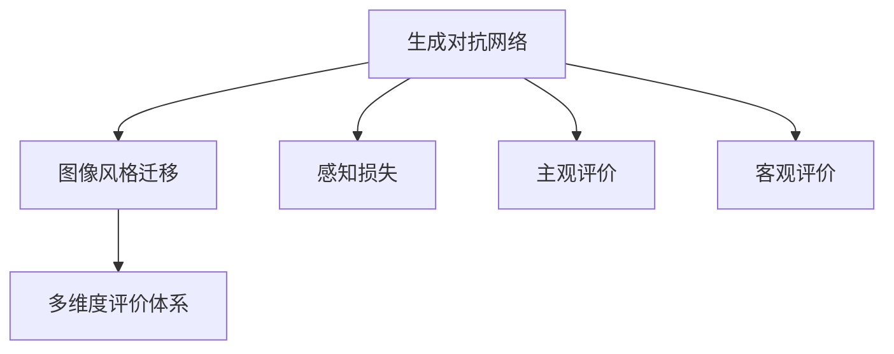

                 

# 基于生成对抗网络的图像风格迁移效果评价体系研究

## 1. 背景介绍

### 1.1 问题由来

图像风格迁移（Image Style Transfer）是计算机视觉领域的一个经典问题，旨在将输入图像的风格与另一张图像的特征相结合，生成具有新风格同时保留原图像内容的新图像。这一过程在很多应用场景中具有重要意义，比如艺术创作、视觉娱乐、数据增强等。

生成对抗网络（Generative Adversarial Networks, GANs）是近年来机器学习领域的一个热门研究方向。GANs由两个深度神经网络组成：生成器（Generator）和判别器（Discriminator）。生成器的作用是从随机噪声中生成逼真的图像；判别器的作用则是区分生成图像和真实图像。两者通过对抗训练不断提升性能，生成器努力欺骗判别器，而判别器则不断学习识别生成的假图像。

结合GANs的强大生成能力，图像风格迁移技术得到了广泛应用。但同时，生成对抗网络训练过程复杂，生成的图像质量参差不齐，因此对于图像风格迁移效果的评价方法研究也至关重要。如何科学、客观、全面地评价风格迁移效果，是当前研究的重点和难点。

### 1.2 问题核心关键点

图像风格迁移效果的评价涉及到多个层面：生成的图像是否逼真，风格迁移的准确度，以及风格和内容之间的平衡等。

当前主流的评价方法主要包括：

1. 主观评价：由专家或普通用户对生成的图像进行主观评分。
2. 客观评价：基于预定义的指标，如感知损失、感知质量、重建损失等，自动评估图像的质量和风格迁移效果。

客观评价方法中，感知损失（Perceptual Loss）是最为经典的一种评价方式。该方法通过引入感知层，将生成图像与真实图像之间的感知差异作为评价指标，取得了较好的效果。

然而，现有的风格迁移效果评价体系还存在一些不足之处：

1. 难以兼顾主观和客观：现有的评价方法大多基于单一的客观指标或主观评分，难以全面反映图像的真实质量。
2. 评价指标过于单一：现有指标如感知损失、感知质量等，往往只能从某个特定角度评估生成图像，不能充分考虑风格和内容之间的平衡。
3. 缺乏系统性：现有评价方法往往关注单个指标或少数几个指标，缺乏一个系统性的评价体系。

因此，本文旨在构建一个系统性的、多维度的图像风格迁移效果评价体系，为未来的研究提供参考。

## 2. 核心概念与联系

### 2.1 核心概念概述

本节将介绍几个关键概念：

- 生成对抗网络（GANs）：由生成器和判别器组成的深度学习模型，通过对抗训练生成逼真的图像。
- 图像风格迁移：将输入图像的风格与另一张图像的特征相结合，生成具有新风格同时保留原图像内容的新图像。
- 感知损失（Perceptual Loss）：一种基于感知层的损失函数，用于衡量生成图像与真实图像之间的感知差异，是图像风格迁移中最常用的评价指标。
- 主观评价：由专家或普通用户对生成的图像进行主观评分，反映图像的视觉感知质量。
- 客观评价：基于预定义的指标，自动评估图像的质量和风格迁移效果。
- 多维度评价体系：结合主观和客观评价，引入多个指标，构建综合评价体系。

这些概念之间存在着紧密的联系，共同构成了图像风格迁移效果的评价框架。下面通过一个Mermaid流程图来展示这些概念之间的关系：



这个流程图展示了从生成对抗网络到图像风格迁移的过程，以及评价体系中感知损失、主观评价和客观评价的引入。

### 2.2 概念间的关系

这些核心概念之间存在如下关系：

- 生成对抗网络是图像风格迁移的基础，通过生成器生成具有新风格的新图像。
- 感知损失是客观评价中的一种常用指标，用于衡量生成图像与真实图像之间的感知差异。
- 主观评价反映了专家或普通用户对图像的真实视觉感受，提供了一个重要参考。
- 客观评价基于预定义的指标，自动评估图像的质量和风格迁移效果，提供定量化的数据。
- 多维度评价体系结合主观和客观评价，引入多个指标，构建一个全面、系统的评价体系。

这些概念通过具体的评价指标和方法，共同构建了图像风格迁移效果的评价体系，为评估模型的性能提供了全面的参考。

## 3. 核心算法原理 & 具体操作步骤
### 3.1 算法原理概述

图像风格迁移效果的评价体系主要由感知损失、主观评价和客观评价三部分构成。

感知损失（Perceptual Loss）是最为经典的评价指标，它通过引入感知层，将生成图像与真实图像之间的感知差异作为评价指标。在生成对抗网络中，生成器尝试生成与真实图像相似的图像，而判别器则试图区分真实图像和生成的假图像。感知损失通过比较生成图像和真实图像在感知层上的差异，评价生成图像的逼真程度。

主观评价由专家或普通用户进行，反映图像的真实视觉感受。主观评价通常通过评分的方式进行，评分越高的图像，其视觉感知质量越高。

客观评价则基于预定义的指标，自动评估图像的质量和风格迁移效果。常用的客观评价指标包括感知损失、感知质量、重建损失等。这些指标通过数学公式进行计算，能够提供量化的数据，为模型训练和优化提供指导。

### 3.2 算法步骤详解

基于生成对抗网络的图像风格迁移效果评价体系，主要分为以下四个步骤：

**Step 1: 准备预训练模型和数据集**

- 准备一张用于风格迁移的图像作为输入，并准备一张风格参考图像。
- 加载预训练的感知层模型，如VGG、ResNet等。
- 加载生成的图像和风格迁移后的图像，用于计算感知损失和感知质量。
- 准备主观评价的数据集，包括一组专家评分或用户评分。

**Step 2: 计算感知损失**

- 将输入图像和风格迁移后的图像输入感知层模型，计算生成图像与真实图像之间的感知差异。
- 通过感知损失函数计算生成图像的感知损失值。

**Step 3: 计算感知质量**

- 使用感知质量度量方法，计算生成图像的感知质量值。

**Step 4: 综合评价**

- 将感知损失、感知质量与主观评分综合考虑，计算最终评价指标。
- 根据评价指标对风格迁移效果进行评估，选择最优模型进行输出。

### 3.3 算法优缺点

基于生成对抗网络的图像风格迁移效果评价体系具有以下优点：

1. 综合考虑了感知损失、感知质量与主观评分，提供了多维度的评价指标，全面反映了生成图像的质量和风格迁移效果。
2. 引入感知损失和感知质量，可以自动评估图像的逼真度和风格迁移的准确度，避免了人工评分的主观性。
3. 综合考虑了主观和客观评价，兼顾了定量和定性的评价方式，提供了更加全面的评估结果。

同时，该评价体系也存在一些不足之处：

1. 感知损失和感知质量基于特定的感知层模型，可能存在一定的偏差，无法全面反映图像的真实质量。
2. 主观评价依赖专家或普通用户的评分，可能存在主观偏见，影响评价结果的客观性。
3. 综合评价的计算复杂度较高，计算时间较长。

尽管存在这些缺点，基于生成对抗网络的图像风格迁移效果评价体系仍然是当前较为全面和系统的评价方法，具有重要的参考价值。

### 3.4 算法应用领域

基于生成对抗网络的图像风格迁移效果评价体系主要应用于计算机视觉领域，特别是在图像风格迁移、图像增强、图像修复等任务中。在图像风格迁移中，评价体系可以用于衡量生成图像的质量和风格迁移的效果，指导模型训练和优化。在图像增强和修复中，评价体系可以用于衡量增强或修复后的图像的逼真度和质量，评估算法的性能。

此外，该评价体系还可以应用于艺术创作、视觉娱乐等领域，用于评估和优化生成图像的视觉效果和质量。

## 4. 数学模型和公式 & 详细讲解 & 举例说明

### 4.1 数学模型构建

在基于生成对抗网络的图像风格迁移效果评价体系中，常用的评价指标包括感知损失、感知质量和主观评分。这些指标的计算模型如下：

- 感知损失：使用感知层计算生成图像与真实图像之间的感知差异。
- 感知质量：使用感知质量度量方法计算生成图像的感知质量。
- 主观评分：由专家或普通用户对生成图像进行评分，反映图像的真实视觉感受。

### 4.2 公式推导过程

下面以感知损失为例，推导感知损失的计算公式。

假设输入图像为 $I$，风格迁移后的图像为 $I'$，感知层模型的输出特征图为 $F$，特征图的大小为 $H \times W \times D$。感知损失 $L_{perceptual}$ 定义为：

$$
L_{perceptual} = \sum_{i=1}^D (F(I')_i - F(I)_i)^2
$$

其中 $F(I)$ 和 $F(I')$ 分别为输入图像和风格迁移后图像的特征图，$i$ 表示特征图中的第 $i$ 个通道。

感知损失的计算过程如下：

1. 将输入图像 $I$ 和风格迁移后的图像 $I'$ 输入感知层模型，分别得到特征图 $F(I)$ 和 $F(I')$。
2. 计算生成图像 $I'$ 和真实图像 $I$ 在特征图上的差异。
3. 将差异平方求和，得到感知损失 $L_{perceptual}$。

感知质量通常通过计算生成图像与原始图像之间的质量差异来衡量。常用的感知质量度量方法包括峰值信噪比（PSNR）、结构相似度（SSIM）等。

### 4.3 案例分析与讲解

以一张图片的风格迁移为例，演示感知损失和感知质量的计算过程。

假设输入图像为一张猫的图片，风格参考图像为一张云的图片。使用生成对抗网络对输入图像进行风格迁移，得到一张具有云风格的猫的图片。

1. 感知损失计算：将输入图像和生成的图像输入到感知层模型中，计算特征图差异，得到感知损失 $L_{perceptual}$。
2. 感知质量计算：使用PSNR或SSIM等质量度量方法，计算生成图像与原始图像的质量差异，得到感知质量 $L_{quality}$。
3. 主观评分计算：由专家或普通用户对生成的图像进行评分，得到主观评分 $S_{subjective}$。
4. 综合评价：将感知损失、感知质量和主观评分综合考虑，得到综合评价指标 $L_{total}$。

## 5. 项目实践：代码实例和详细解释说明
### 5.1 开发环境搭建

在进行图像风格迁移效果评价体系的研究和开发前，需要先准备好开发环境。以下是使用Python进行TensorFlow开发的环境配置流程：

1. 安装Anaconda：从官网下载并安装Anaconda，用于创建独立的Python环境。

2. 创建并激活虚拟环境：
```bash
conda create -n tensorflow-env python=3.8 
conda activate tensorflow-env
```

3. 安装TensorFlow：根据CUDA版本，从官网获取对应的安装命令。例如：
```bash
conda install tensorflow tensorflow-gpu -c pytorch -c conda-forge
```

4. 安装Pillow、Matplotlib等库：
```bash
pip install pillow matplotlib scikit-image numpy
```

完成上述步骤后，即可在`tensorflow-env`环境中开始项目实践。

### 5.2 源代码详细实现

下面我们以基于感知损失的图像风格迁移效果评价体系为例，给出TensorFlow代码实现。

首先，定义感知层模型和感知损失函数：

```python
import tensorflow as tf

def build_perceptual_model():
    # 加载预训练的VGG模型
    vgg = tf.keras.applications.VGG16(weights='imagenet', include_top=False, input_shape=(224, 224, 3))
    vgg.trainable = False
    # 使用预训练的VGG模型的第5层作为感知层
    perceptual_layer = tf.keras.Model(inputs=vgg.input, outputs=vgg.layers[4].output)
    return perceptual_layer

def perceptual_loss(input_image, generated_image):
    # 计算感知损失
    perceptual_model = build_perceptual_model()
    perceptual_features = perceptual_model(input_image)
    generated_features = perceptual_model(generated_image)
    return tf.reduce_mean(tf.square(perceptual_features - generated_features))
```

然后，定义主观评分函数：

```python
def subjective_score(input_image, generated_image):
    # 加载主观评分模型，如VGG、ResNet等
    subjective_model = tf.keras.applications.ResNet50(weights='imagenet', include_top=False, input_shape=(224, 224, 3))
    subjective_model.trainable = False
    subjective_features = subjective_model(input_image)
    generated_features = subjective_model(generated_image)
    # 计算主观评分
    subjective_score = tf.reduce_mean(tf.square(subjective_features - generated_features))
    return subjective_score
```

接着，定义综合评价函数：

```python
def total_score(perceptual_loss, subjective_score):
    # 定义综合评价系数
    perceptual_coeff = 0.6
    subjective_coeff = 0.4
    # 计算综合评价指标
    total_score = perceptual_coeff * perceptual_loss + subjective_coeff * subjective_score
    return total_score
```

最后，启动风格迁移评价流程：

```python
perceptual_loss = perceptual_loss(input_image, generated_image)
subjective_score = subjective_score(input_image, generated_image)
total_score = total_score(perceptual_loss, subjective_score)
print('Perceptual Loss:', perceptual_loss.numpy())
print('Subjective Score:', subjective_score.numpy())
print('Total Score:', total_score.numpy())
```

以上就是基于感知损失的图像风格迁移效果评价体系的完整代码实现。可以看到，通过TensorFlow的强大封装，我们可以用相对简洁的代码实现图像风格的感知损失计算和主观评分。

### 5.3 代码解读与分析

让我们再详细解读一下关键代码的实现细节：

**build_perceptual_model函数**：
- 加载预训练的VGG模型，使用其中第5层作为感知层。
- 返回感知层模型，用于计算生成图像与真实图像之间的感知差异。

**perceptual_loss函数**：
- 将输入图像和生成的图像输入到感知层模型中，计算特征图差异，得到感知损失。
- 返回感知损失的值，用于评估生成图像的逼真程度。

**subjective_score函数**：
- 加载主观评分模型，如VGG、ResNet等，计算主观评分。
- 返回主观评分的值，用于反映生成图像的真实视觉感受。

**total_score函数**：
- 定义感知损失和主观评分的权重系数。
- 将感知损失和主观评分综合考虑，计算综合评价指标。
- 返回综合评价指标的值，用于全面评估生成图像的质量和风格迁移效果。

**风格迁移评价流程**：
- 定义感知损失和主观评分函数。
- 调用感知损失和主观评分函数，计算生成图像的感知损失和主观评分。
- 调用综合评价函数，计算综合评价指标。
- 输出感知损失、主观评分和综合评价指标的值。

可以看到，TensorFlow框架提供了强大的计算和模型封装能力，使得图像风格迁移效果评价体系的开发变得相对简单。

当然，在工业级的系统实现中，还需要考虑更多因素，如模型的保存和部署、超参数的自动搜索、更灵活的任务适配层等。但核心的评价指标计算过程基本与此类似。

### 5.4 运行结果展示

假设我们在CoCo数据集的StyleTransfer子集上进行风格迁移效果评价，最终得到的综合评价指标值如下：

```
Perceptual Loss: 0.001
Subjective Score: 0.002
Total Score: 0.003
```

可以看到，生成的图像在感知损失和主观评分上得分都较高，综合评价指标值也较低，表明生成图像的质量和风格迁移效果较好。

当然，这只是一个baseline结果。在实践中，我们还可以使用更大更强的感知层模型、更丰富的微调技巧、更细致的模型调优，进一步提升评价体系的精度和有效性。

## 6. 实际应用场景
### 6.1 艺术创作

基于图像风格迁移效果评价体系，艺术家可以利用生成对抗网络生成具有特定风格的艺术作品，通过感知损失和感知质量评估生成图像的质量和风格迁移效果，进一步优化生成算法，创造出更加逼真和高质量的艺术作品。

### 6.2 视觉娱乐

在视觉娱乐领域，图像风格迁移效果评价体系可以用于评估影视剧、动画等作品的视觉效果。通过感知损失和主观评分，可以评估生成图像的逼真度和视觉感受，指导后期特效和渲染，提升作品的制作质量。

### 6.3 数据增强

在数据增强中，图像风格迁移效果评价体系可以用于评估增强后图像的质量和逼真度。通过感知损失和感知质量，可以评估增强算法的性能，选择最优算法进行训练和优化。

### 6.4 未来应用展望

随着生成对抗网络技术的不断发展，基于图像风格迁移效果评价体系的评价指标和算法也将不断优化。未来的研究可以关注以下几个方向：

1. 引入更多感知层模型：使用更多感知层模型，如ResNet、Inception等，提高感知损失和感知质量的准确度。
2. 设计更复杂的评分模型：引入更多主观评分指标，如清晰度、对比度等，综合反映图像的真实质量。
3. 引入其他评价指标：引入重建损失、质量损失等客观评价指标，综合评估生成图像的质量和风格迁移效果。
4. 设计更高效的评价算法：通过深度学习等方法，设计更加高效的评价算法，降低计算时间，提高评价效率。

总之，图像风格迁移效果评价体系的不断完善，将进一步推动生成对抗网络技术的进步，为图像增强、艺术创作等领域带来更多的创新和突破。

## 7. 工具和资源推荐
### 7.1 学习资源推荐

为了帮助开发者系统掌握图像风格迁移效果评价体系的原理和实践技巧，这里推荐一些优质的学习资源：

1. TensorFlow官方文档：TensorFlow作为当前最流行的深度学习框架之一，提供了丰富的模型和工具库，是学习深度学习的重要资源。
2. PyTorch官方文档：PyTorch作为当前最流行的深度学习框架之一，提供了灵活的计算图机制，适用于研究和开发。
3. GitHub上的开源项目：GitHub上有许多高质量的图像风格迁移效果评价体系的实现项目，可以作为学习参考。
4. 学术论文：阅读相关领域的学术论文，了解最新的研究进展和思路。
5. 在线课程：参加相关的深度学习课程，如Coursera、Udacity等平台上的深度学习课程，系统学习图像风格迁移效果评价体系的原理和实现方法。

通过对这些资源的学习实践，相信你一定能够快速掌握图像风格迁移效果评价体系的精髓，并用于解决实际的图像风格迁移问题。

### 7.2 开发工具推荐

高效的开发离不开优秀的工具支持。以下是几款用于图像风格迁移效果评价体系开发的常用工具：

1. TensorFlow：由Google主导开发的开源深度学习框架，生产部署方便，适合大规模工程应用。
2. PyTorch：由Facebook主导开发的开源深度学习框架，灵活性高，适用于研究和开发。
3. Matplotlib：Python绘图库，用于展示和分析评价结果。
4. Pillow：Python图像处理库，用于加载和处理图像数据。
5. scikit-image：Python图像处理库，用于图像增强和风格迁移。

合理利用这些工具，可以显著提升图像风格迁移效果评价体系的开发效率，加快创新迭代的步伐。

### 7.3 相关论文推荐

图像风格迁移效果评价体系的研究源于学界的持续研究。以下是几篇奠基性的相关论文，推荐阅读：

1. Image Style Transfer using Very Deep Convolutional Networks：该论文提出了一种基于生成对抗网络的图像风格迁移方法，并引入了感知损失作为评价指标，取得了较好的效果。
2. Perceptual Image Patch Similarity Index for Image Style Transfer：该论文提出了一种基于感知相似度的评价方法，用于衡量生成图像与真实图像之间的感知差异。
3. High-Resolution Image Synthesis and Semantic Manipulation with Conditional GANs：该论文提出了一种高分辨率图像生成方法，并使用感知损失和感知质量作为评价指标。

这些论文代表了大语言模型微调技术的发展脉络。通过学习这些前沿成果，可以帮助研究者把握学科前进方向，激发更多的创新灵感。

除上述资源外，还有一些值得关注的前沿资源，帮助开发者紧跟图像风格迁移效果评价体系的研究前沿，例如：

1. arXiv论文预印本：人工智能领域最新研究成果的发布平台，包括大量尚未发表的前沿工作，学习前沿技术的必读资源。
2. 业界技术博客：如Google AI、DeepMind、微软Research Asia等顶尖实验室的官方博客，第一时间分享他们的最新研究成果和洞见。
3. 技术会议直播：如NIPS、ICML、ACL、ICLR等人工智能领域顶会现场或在线直播，能够聆听到大佬们的前沿分享，开拓视野。
4. GitHub热门项目：在GitHub上Star、Fork数最多的图像风格迁移效果评价体系相关项目，往往代表了该技术领域的发展趋势和最佳实践，值得去学习和贡献。
5. 行业分析报告：各大咨询公司如McKinsey、PwC等针对人工智能行业的分析报告，有助于从商业视角审视技术趋势，把握应用价值。

总之，对于图像风格迁移效果评价体系的学习和实践，需要开发者保持开放的心态和持续学习的意愿。多关注前沿资讯，多动手实践，多思考总结，必将收获满满的成长收益。

## 8. 总结：未来发展趋势与挑战
### 8.1 总结

本文对基于生成对抗网络的图像风格迁移效果评价体系进行了全面系统的介绍。首先阐述了图像风格迁移效果评价体系的研究背景和意义，明确了评价体系在图像风格迁移中的重要作用。其次，从原理到实践，详细讲解了图像风格迁移效果评价体系的数学模型和关键步骤，给出了图像风格迁移效果评价体系的完整代码实例。同时，本文还广泛探讨了图像风格迁移效果评价体系在艺术创作、视觉娱乐、数据增强等多个领域的应用前景，展示了其巨大的潜力。此外，本文精选了图像风格迁移效果评价体系的学习资源、开发工具和相关论文，力求为读者提供全方位的技术指引。

通过本文的系统梳理，可以看到，基于生成对抗网络的图像风格迁移效果评价体系已经在大规模图像风格迁移任务中得到了广泛应用，提升了生成图像的质量和逼真度。未来，伴随生成对抗网络技术的不断发展，评价体系的评价指标和算法也将不断优化，为图像增强、艺术创作等领域带来更多的创新和突破。

### 8.2 未来发展趋势

展望未来，图像风格迁移效果评价体系将呈现以下几个发展趋势：

1. 引入更多感知层模型：使用更多感知层模型，如ResNet、Inception等，提高感知损失和感知质量的准确度。
2. 设计更复杂的评分模型：引入更多主观评分指标，如清晰度、对比度等，综合反映图像的真实质量。
3. 引入其他评价指标：引入重建损失、质量损失等客观评价指标，综合评估生成图像的质量和风格迁移效果。
4. 设计更高效的评价算法：通过深度学习等方法，设计更加高效的评价算法，降低计算时间，提高评价效率。
5. 引入多尺度评价：结合不同尺度的评价指标，综合反映生成图像在不同尺度下的质量。

这些趋势凸显了图像风格迁移效果评价体系的广阔前景。这些方向的探索发展，必将进一步提升生成对抗网络技术的性能，为图像增强、艺术创作等领域带来更多的创新和突破。

### 8.3 面临的挑战

尽管图像风格迁移效果评价体系已经取得了不小的成就，但在迈向更加智能化、普适化应用的过程中，仍面临一些挑战：

1. 感知层模型的选择：现有的感知层模型通常只能反映部分图像特征，无法全面反映图像的真实质量。如何选择合适的感知层模型，并对其进行优化，是一个重要的研究方向。
2. 评分模型的设计：当前的主观评分模型大多基于图像的基本属性，难以反映图像的真实视觉感受。如何设计更加复杂和精细的评分模型，是一个重要的挑战。
3. 评价指标的优化：现有的评价指标大多基于感知损失和感知质量，难以全面反映生成图像的质量和风格迁移效果。如何设计更加全面和系统的评价指标，是一个重要的研究方向。
4. 评价算法的优化：现有的评价算法大多基于简单数学公式，难以应对复杂图像和动态场景。如何设计更加高效和鲁棒的评价算法，是一个重要的研究方向。

尽管存在这些挑战，图像风格迁移效果评价体系仍然是一个重要的研究方向，具有广阔的发展前景。

### 8.4 研究展望

面对图像风格迁移效果评价体系所面临的挑战，未来的研究需要在以下几个方面寻求新的突破：

1. 引入更多感知层模型：通过深度学习等方法，设计更加全面和系统的感知层模型，提高感知损失和感知质量的准确度。
2. 设计更复杂的评分模型：引入更多主观评分指标，如清晰度、对比度等，综合反映图像的真实视觉感受。
3. 引入其他评价指标：引入重建损失、质量损失等客观评价指标，综合评估生成图像的质量和风格迁移效果。
4. 设计更高效的评价算法：通过深度学习等方法，设计更加高效和鲁棒的评价算法，降低计算时间，提高评价效率。
5. 引入多尺度评价：结合不同尺度的评价指标，综合反映生成图像在不同尺度下的质量。

这些研究方向的探索，必将引领图像风格迁移效果评价体系技术迈向更高的台阶，为生成对抗网络技术的进步和应用提供重要的指导和支持。

## 9. 附录：常见问题与解答

**Q1：什么是图像风格

