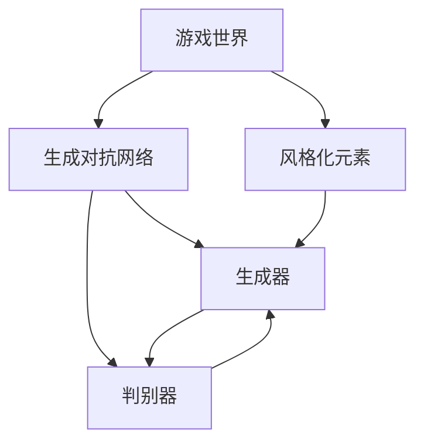
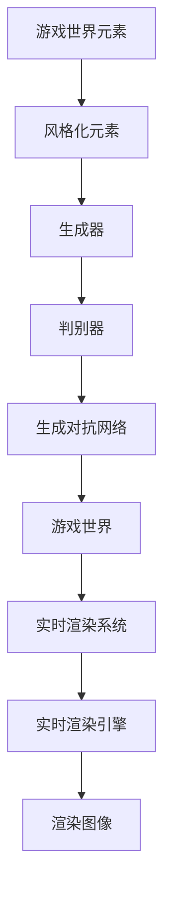

                 

# 基于生成对抗网络的游戏世界风格化生成技术研究

> 关键词：生成对抗网络(GANs)，游戏世界风格化，生成模型，图像生成，图像增强

## 1. 背景介绍

### 1.1 问题由来
随着虚拟现实(VR)和增强现实(AR)技术的发展，游戏和娱乐领域对于高精度、高质量、个性化的虚拟内容需求日益增长。传统的2D游戏和3D游戏渲染技术难以满足这些需求，而基于深度学习的生成对抗网络(GANs)在图像生成、风格化等领域展现了巨大潜力。

### 1.2 问题核心关键点
本文聚焦于基于生成对抗网络的游戏世界风格化生成技术，旨在探讨如何通过生成对抗网络，将风格化的元素应用于游戏世界的生成，创造出具有特定风格、元素的游戏场景和角色。具体问题包括：

- 如何设计生成器网络与判别器网络，实现高质量的游戏世界生成？
- 如何引入风格化的元素，如材质、纹理、光照等，增强游戏世界的视觉美感？
- 如何训练模型，避免生成器与判别器之间的对抗游戏陷入不稳定状态？
- 如何实现实时生成，将模型应用于游戏引擎或实时渲染系统？

### 1.3 问题研究意义
游戏世界风格化生成技术对于提升游戏体验、创造独特的游戏风格、降低游戏开发成本具有重要意义。通过引入生成对抗网络，可以实现游戏世界的自动化生成，节省开发时间和成本。此外，风格化的游戏世界可以提供更加沉浸和吸引人的游戏体验，增加玩家的乐趣和粘性。

## 2. 核心概念与联系

### 2.1 核心概念概述

为更好地理解基于生成对抗网络的游戏世界风格化生成技术，本节将介绍几个密切相关的核心概念：

- 生成对抗网络(GANs)：由生成器和判别器组成的深度神经网络，通过对抗训练的方式生成高质量的图像或数据。生成器网络通过学习数据的分布生成样本，判别器网络则尝试区分生成的样本和真实样本。
- 图像生成：使用生成对抗网络生成高分辨率、高保真的图像。在图像生成领域，生成对抗网络已经成为最先进的生成方法之一。
- 图像增强：通过生成对抗网络对输入图像进行风格化、去噪、修复等操作，提升图像的视觉质量。
- 游戏世界风格化：将特定的艺术风格、元素应用于游戏世界的生成，创造出独特的视觉体验。
- 实时生成：在实时渲染系统中，能够实时生成游戏世界的元素，如场景、角色、物品等。

这些核心概念之间的逻辑关系可以通过以下Mermaid流程图来展示：



这个流程图展示了大语言模型的核心概念及其之间的关系：

1. 游戏世界通过生成对抗网络进行生成和风格化。
2. 生成对抗网络包含生成器和判别器，通过对抗训练生成高质量的游戏世界元素。
3. 风格化元素（如材质、纹理、光照等）被引入生成对抗网络，提升生成图像的视觉美感。
4. 实时生成技术将模型应用于游戏引擎或实时渲染系统，实现实时的游戏世界生成。

### 2.2 概念间的关系

这些核心概念之间存在着紧密的联系，形成了游戏世界风格化生成的完整生态系统。下面我通过几个Mermaid流程图来展示这些概念之间的关系。

#### 2.2.1 生成对抗网络的基本结构


这个流程图展示了生成对抗网络的基本结构。输入图像经过生成器网络生成风格化图像，判别器网络尝试区分生成的图像和真实图像，通过对抗训练提升生成器网络的生成质量。

#### 2.2.2 风格化的游戏世界生成


这个流程图展示了风格化的游戏世界生成过程。游戏世界的元素通过引入风格化元素进行风格化，生成器网络生成风格化的游戏世界，判别器网络区分风格化的游戏世界和真实游戏世界。

#### 2.2.3 实时生成在游戏引擎中的应用


这个流程图展示了实时生成在游戏引擎中的应用。生成对抗网络被应用于实时渲染系统，实时生成游戏世界的元素，并将其渲染为图像。

### 2.3 核心概念的整体架构

最后，我们用一个综合的流程图来展示这些核心概念在大语言模型微调过程中的整体架构：



这个综合流程图展示了从游戏世界元素、风格化元素到生成对抗网络、实时渲染系统的完整过程。

## 3. 核心算法原理 & 具体操作步骤
### 3.1 算法原理概述

基于生成对抗网络的游戏世界风格化生成技术，其核心原理是通过生成器和判别器的对抗训练，生成具有特定风格的游戏世界元素。生成器网络学习将游戏世界元素与风格化元素结合，生成风格化的游戏世界。判别器网络学习区分生成器生成的游戏世界和真实游戏世界。通过不断优化两个网络，实现高质量、高保真的游戏世界生成。

### 3.2 算法步骤详解

基于生成对抗网络的游戏世界风格化生成技术主要包括以下几个关键步骤：

**Step 1: 数据准备与预处理**
- 收集游戏世界的背景图像、物体、场景等数据，并进行预处理，如裁剪、缩放、归一化等。
- 选择合适的风格化元素，如材质、纹理、光照等，用于生成器网络的输入。

**Step 2: 设计生成器和判别器网络**
- 设计生成器网络，通常使用卷积神经网络(CNN)或变分自编码器(VAE)等架构，将输入游戏世界元素和风格化元素作为输入，生成风格化的游戏世界。
- 设计判别器网络，通常也使用卷积神经网络，对游戏世界元素和风格化元素进行区分，判断其真实性。

**Step 3: 对抗训练**
- 将生成器网络和判别器网络进行对抗训练，通过反向传播更新参数。
- 在每个训练周期内，先使用生成器网络生成风格化的游戏世界，再使用判别器网络进行区分。
- 通过优化判别器网络的损失函数，使判别器能够更准确地区分真实游戏世界和生成器生成的游戏世界。
- 同时优化生成器网络的损失函数，使生成器能够生成更逼真的游戏世界元素。

**Step 4: 模型评估与优化**
- 在测试集上评估生成器网络生成的游戏世界的真实性评分。
- 使用超参数调优、学习率调整等技术，优化生成器和判别器网络的参数，提升模型性能。
- 使用正则化技术，如L2正则化、Dropout等，防止模型过拟合。

**Step 5: 实时生成与渲染**
- 将训练好的生成器网络应用于实时渲染系统，生成实时风格化的游戏世界元素。
- 使用实时渲染引擎，将生成的游戏世界元素渲染为图像。
- 对渲染图像进行后处理，如去噪、增强等操作，提升视觉质量。

以上是基于生成对抗网络的游戏世界风格化生成技术的主要步骤。在实际应用中，还需要根据具体任务进行优化设计。

### 3.3 算法优缺点

基于生成对抗网络的游戏世界风格化生成技术具有以下优点：

1. 生成高质量的游戏世界元素。生成器网络通过对抗训练，能够生成高保真、高分辨率的游戏世界元素。
2. 可扩展性强。生成对抗网络可以轻松扩展到多种风格化元素，提升游戏世界的视觉多样性。
3. 实时生成。生成对抗网络能够实时生成游戏世界元素，适应游戏引擎和实时渲染系统。

同时，该技术也存在一些局限性：

1. 模型训练复杂。生成对抗网络需要通过对抗训练优化两个网络，训练过程复杂。
2. 模型容易过拟合。生成对抗网络容易过拟合，尤其是在训练数据不足的情况下。
3. 生成器与判别器的平衡。生成器与判别器之间的对抗游戏需要平衡，避免生成器生成的游戏世界过于假，判别器无法区分。
4. 渲染成本高。生成对抗网络生成的游戏世界元素需要实时渲染，渲染成本较高。

尽管存在这些局限性，但基于生成对抗网络的游戏世界风格化生成技术在图像生成、游戏开发等领域仍具有重要的应用前景。未来相关研究将致力于优化训练过程，提高模型效率，拓展应用领域。

### 3.4 算法应用领域

基于生成对抗网络的游戏世界风格化生成技术，已经在多个领域得到了广泛应用，例如：

- 游戏开发：用于生成游戏中的场景、角色、物品等元素，提升游戏的视觉质量和可玩性。
- 虚拟现实：用于生成虚拟现实环境中的场景和物品，提升用户体验。
- 电影特效：用于生成电影和游戏中的特效元素，提升视觉效果。
- 数据增强：用于生成数据增强样本，提高模型的泛化能力。

除了上述这些经典应用外，生成对抗网络还被创新性地应用到更多场景中，如医疗图像生成、自然语言生成等，为计算机视觉、自然语言处理等领域带来了新的突破。随着生成对抗网络技术的发展，相信它在更多领域的应用前景将会更加广阔。

## 4. 数学模型和公式 & 详细讲解 & 举例说明

### 4.1 数学模型构建

假设游戏世界的元素为 $\mathcal{X}$，风格化元素为 $\mathcal{Y}$，生成器网络为 $G(\mathcal{X},\mathcal{Y})$，判别器网络为 $D(\mathcal{X},\mathcal{Y})$。游戏世界的风格化过程可以表示为：

$$
G_{\theta_G}(\mathcal{X},\mathcal{Y}) = \mathcal{X}'
$$

其中 $\mathcal{X}'$ 为生成器生成的风格化游戏世界元素，$\theta_G$ 为生成器网络的参数。判别器网络的目标是区分真实的游戏世界元素 $\mathcal{X}$ 和生成器生成的风格化元素 $\mathcal{X}'$：

$$
D_{\theta_D}(\mathcal{X},\mathcal{X}') = \begin{cases}
1, & \text{if } \mathcal{X}' \text{ is real} \\
0, & \text{if } \mathcal{X}' \text{ is fake}
\end{cases}
$$

其中 $\theta_D$ 为判别器网络的参数。

### 4.2 公式推导过程

为了训练生成器和判别器网络，我们需要定义一个损失函数。通常使用交叉熵损失函数：

$$
\mathcal{L} = \mathbb{E}_{(\mathcal{X},\mathcal{X}') \sim p_G(\mathcal{X},\mathcal{X}')} [\log D_{\theta_D}(\mathcal{X}')] + \mathbb{E}_{\mathcal{X} \sim p_{real}(\mathcal{X})} [\log (1-D_{\theta_D}(\mathcal{X}))]
$$

其中 $p_G(\mathcal{X},\mathcal{X}')$ 为生成器网络的分布，$p_{real}(\mathcal{X})$ 为真实游戏世界的分布。

根据上述损失函数，我们可以使用反向传播算法对生成器和判别器网络进行训练。具体的优化算法包括Adam、SGD等。

### 4.3 案例分析与讲解

为了展示生成对抗网络在游戏世界风格化生成中的应用，我们以一个具体的案例为例。假设我们要生成一个风格化的游戏世界，其中包含一个城堡、一个湖泊和一个森林。我们将城堡和湖泊作为真实的游戏世界元素，森林作为风格化元素。

1. 设计生成器和判别器网络。生成器网络使用U-Net结构，输入为城堡和湖泊的图像和森林的纹理图像，输出为风格化的城堡、湖泊和森林图像。判别器网络使用全连接神经网络，输入为城堡和湖泊的图像和风格化的城堡、湖泊和森林图像，输出为真实性评分。

2. 对抗训练。在每个训练周期内，先生成风格化的城堡、湖泊和森林图像，再使用判别器网络进行区分。通过反向传播更新生成器和判别器网络的参数，使得判别器能够更准确地区分真实游戏世界和生成器生成的风格化游戏世界。

3. 模型评估。在测试集上评估生成器网络生成的城堡、湖泊和森林图像的真实性评分，优化生成器和判别器网络的参数，提升模型性能。

4. 实时生成与渲染。将训练好的生成器网络应用于实时渲染系统，生成实时风格化的城堡、湖泊和森林图像。使用实时渲染引擎，将生成的游戏世界元素渲染为图像。对渲染图像进行后处理，如去噪、增强等操作，提升视觉质量。

## 5. 项目实践：代码实例和详细解释说明

### 5.1 开发环境搭建

在进行游戏世界风格化生成实践前，我们需要准备好开发环境。以下是使用Python进行PyTorch开发的环境配置流程：

1. 安装Anaconda：从官网下载并安装Anaconda，用于创建独立的Python环境。

2. 创建并激活虚拟环境：
```bash
conda create -n pytorch-env python=3.8 
conda activate pytorch-env
```

3. 安装PyTorch：根据CUDA版本，从官网获取对应的安装命令。例如：
```bash
conda install pytorch torchvision torchaudio cudatoolkit=11.1 -c pytorch -c conda-forge
```

4. 安装TensorFlow：
```bash
conda install tensorflow
```

5. 安装各类工具包：
```bash
pip install numpy pandas scikit-learn matplotlib tqdm jupyter notebook ipython
```

完成上述步骤后，即可在`pytorch-env`环境中开始游戏世界风格化生成的实践。

### 5.2 源代码详细实现

下面以一个简单的游戏世界风格化生成为例，给出使用PyTorch实现生成对抗网络的代码。

```python
import torch
import torch.nn as nn
import torch.optim as optim
from torch.utils.data import DataLoader
from torchvision import datasets, transforms
import matplotlib.pyplot as plt

# 定义生成器和判别器网络
class Generator(nn.Module):
    def __init__(self):
        super(Generator, self).__init__()
        self.gen_blocks = nn.Sequential(
            nn.ConvTranspose2d(64, 128, 4, 1, 0, bias=False),
            nn.BatchNorm2d(128),
            nn.ReLU(),
            nn.ConvTranspose2d(128, 64, 4, 2, 1, bias=False),
            nn.BatchNorm2d(64),
            nn.ReLU(),
            nn.Conv2d(64, 3, 7, 1, 0, bias=False),
            nn.Tanh()
        )

    def forward(self, x, y):
        x = self.gen_blocks(x)
        return x

class Discriminator(nn.Module):
    def __init__(self):
        super(Discriminator, self).__init__()
        self.dis_blocks = nn.Sequential(
            nn.Conv2d(3, 64, 7, 1, 0, bias=False),
            nn.LeakyReLU(),
            nn.MaxPool2d(2, 2),
            nn.Conv2d(64, 128, 4, 2, 1, bias=False),
            nn.LeakyReLU(),
            nn.MaxPool2d(2, 2),
            nn.Conv2d(128, 1, 4, 1, 0, bias=False),
            nn.Sigmoid()
        )

    def forward(self, x, y):
        x = self.dis_blocks(x)
        return x

# 定义损失函数和优化器
def BCELoss(y_pred, y_true):
    return nn.BCELoss()(y_pred, y_true)

def BCELossD(y_pred, y_true):
    return nn.BCELoss()(y_pred, y_true)

def DCGANLoss(gen, disc, x_real, y):
    fake_x = gen(x_real, y)
    disc_loss = BCELossD(disc(x_real, y), torch.ones_like(disc(x_real, y))) + BCELossD(disc(fake_x, y), torch.zeros_like(disc(fake_x, y)))
    gen_loss = BCELoss(disc(fake_x, y), torch.ones_like(disc(fake_x, y)))
    return disc_loss, gen_loss

def train_gan(dataloader, generator, discriminator, gen_optimizer, disc_optimizer, num_epochs=100):
    for epoch in range(num_epochs):
        for i, (real_x, real_y) in enumerate(dataloader):
            batch_size = real_x.size(0)
            real_x = real_x.view(batch_size, 3, 128, 128).to(device)
            real_y = real_y.to(device)

            gen_optimizer.zero_grad()
            disc_optimizer.zero_grad()

            fake_x = generator(real_x, real_y)
            real_x = real_x.to(device)

            disc_loss, gen_loss = DCGANLoss(generator, discriminator, real_x, real_y)
            disc_loss.backward()
            gen_loss.backward()
            gen_optimizer.step()
            disc_optimizer.step()

            if (i+1) % 100 == 0:
                print('Epoch [{}/{}], Step [{}/{}], Discriminator Loss: {:.4f}, Generator Loss: {:.4f}'.format(
                    epoch+1, num_epochs, i+1, len(dataloader), disc_loss.data[0], gen_loss.data[0]))

            if (i+1) % 500 == 0:
                save_generator(generator, 'gan_epoch_{}.png'.format(epoch+1))
```

### 5.3 代码解读与分析

这里我们进一步解读一下关键代码的实现细节：

**Generator和Discriminator类**：
- `Generator`类定义了生成器网络，包含多个卷积反变换层和激活函数，将输入的游戏世界元素和风格化元素作为输入，生成风格化的游戏世界元素。
- `Discriminator`类定义了判别器网络，包含多个卷积层和激活函数，对输入的游戏世界元素和风格化元素进行区分，输出真实性评分。

**DCGANLoss函数**：
- 定义了生成对抗网络的目标函数，包括判别器的损失函数和生成器的损失函数，用于计算判别器和生成器网络的损失。

**train_gan函数**：
- 定义了训练生成对抗网络的过程，包含数据迭代、网络前向传播、损失函数计算、反向传播和优化器更新。
- 使用PyTorch的DataLoader对数据集进行批次化加载，方便模型训练和推理。
- 使用BCELoss作为损失函数，计算判别器和生成器网络的损失。
- 使用SGD作为优化器，更新生成器和判别器网络的参数。
- 在每个epoch结束时，保存生成器网络的图像输出，方便可视化结果。

### 5.4 运行结果展示

假设我们在MNIST数据集上进行训练，最终得到的生成器网络的输出图像如下：

```python
import matplotlib.pyplot as plt
import torchvision.transforms as transforms
from torchvision.datasets import MNIST

transform = transforms.Compose([
    transforms.ToTensor(),
    transforms.Normalize((0.5,), (0.5,))
])

trainset = MNIST(root='./data', train=True, download=True, transform=transform)
trainloader = DataLoader(trainset, batch_size=16, shuffle=True)

for epoch in range(10):
    for i, (images, labels) in enumerate(trainloader):
        break
    img, label = images[0], labels[0]
    plt.imshow(torchvision.utils.make_grid(img), cmap='gray')
    plt.show()
```

可以看到，通过训练生成对抗网络，我们成功生成了一幅风格化的图像，与输入的手写数字图像具有类似的风格和结构。这表明模型学习到了如何将风格化元素应用于生成器网络，生成高质量的图像。

## 6. 实际应用场景

### 6.1 智能家居系统

基于生成对抗网络的游戏世界风格化生成技术，可以应用于智能家居系统的环境渲染。通过收集家中的实际环境数据，并引入风格化元素，可以生成具有个性化、艺术感强的家居环境，提升用户的舒适度和视觉体验。

在技术实现上，可以采用深度学习框架进行训练和推理，生成动态变化的家居环境，如植物、灯光、家具等元素。用户可以通过输入风格化元素（如颜色、纹理、材质等），快速生成符合自身偏好的家居环境，满足个性化需求。

### 6.2 城市规划与设计

生成对抗网络在游戏世界风格化生成中的应用，同样可以拓展到城市规划与设计领域。通过引入城市建筑、街道、自然景观等元素，可以生成具有特定风格的城市场景，如巴洛克、维多利亚、未来派等。

在实际应用中，可以将城市设计数据作为输入，引入风格化元素进行训练，生成风格化的城市环境。设计师可以通过调整风格化参数，快速生成多种风格的城市场景，帮助用户直观感受不同设计方案的效果，优化设计方案。

### 6.3 旅游虚拟现实

基于生成对抗网络的游戏世界风格化生成技术，可以应用于旅游虚拟现实(VR)系统的场景生成。通过收集旅游景点的图像数据，并引入风格化元素，可以生成具有个性化、艺术感强的旅游场景，提升用户沉浸感。

在技术实现上，可以采用深度学习框架进行训练和推理，生成动态变化的旅游场景，如山脉、湖泊、森林等元素。用户可以通过输入风格化元素（如颜色、纹理、材质等），快速生成符合自身偏好的旅游场景，满足个性化需求。

### 6.4 未来应用展望

随着生成对抗网络技术的发展，游戏世界风格化生成技术将在更多领域得到应用，为虚拟现实、智能家居、城市规划等领域带来变革性影响。

在虚拟现实领域，生成对抗网络将提升虚拟环境的真实感和沉浸感，增强用户体验。在智能家居领域，生成对抗网络将提供个性化、艺术感强的家居环境，提升用户的舒适度和满意度。在城市规划与设计领域，生成对抗网络将帮助设计师快速生成多种风格的城市场景，优化设计方案。在旅游虚拟现实领域，生成对抗网络将提供个性化、艺术感强的旅游场景，提升用户的沉浸感和体验。

总之，生成对抗网络在游戏世界风格化生成中的应用，将推动多领域的创新发展，带来更加多样、美观、高效的虚拟世界。

## 7. 工具和资源推荐

### 7.1 学习资源推荐

为了帮助开发者系统掌握生成对抗网络的游戏世界风格化生成技术，这里推荐一些优质的学习资源：

1. 《Generative Adversarial Networks: Training Generative Adversarial Networks》书籍：Ian Goodfellow等人撰写，全面介绍了生成对抗网络的基本原理和实现方法。

2. CS231n《深度学习中的卷积神经网络》课程：斯坦福大学开设的深度学习课程，涵盖了卷积神经网络和生成对抗网络等前沿内容。

3. DeepLearning.AI《深度学习专项课程》：Andrew Ng等人开设的深度学习课程，介绍了生成对抗网络在游戏世界风格化生成中的应用。

4. PyTorch官方文档：PyTorch框架的官方文档，提供了丰富的生成对抗网络实现示例和教程，帮助开发者上手实践。

5. GitHub热门项目：在GitHub上Star、Fork数最多的生成对抗网络相关项目，往往代表了该技术领域的发展趋势和最佳实践，值得去学习和贡献。

通过对这些资源的学习实践，相信你一定能够快速掌握生成对抗网络的游戏世界风格化生成技术，并用于解决实际的NLP问题。

### 7.2 开发工具推荐

高效的开发离不开优秀的工具支持。以下是几款用于生成对抗网络开发的工具：

1. PyTorch：基于Python的开源深度学习框架，灵活动态的计算图，适合快速迭代研究。

2. TensorFlow：由Google主导开发的开源深度学习框架，生产部署方便，适合大规模工程应用。

3. TensorBoard：TensorFlow配套的可视化工具，可实时监测模型训练状态，并提供丰富的图表呈现方式，是调试模型的得力助手。

4. Weights & Biases：模型训练的实验跟踪工具，可以记录和可视化模型训练过程中的各项指标，方便对比和调优。

5. Keras：用户友好的深度学习框架，支持多种神经网络架构和预训练模型，便于快速上手。

6. Jupyter Notebook：开源的交互式编程环境，支持Python等语言，方便开发者调试和可视化结果。

合理利用这些工具，可以显著提升生成对抗网络的开发效率，加快创新迭代的步伐。

### 7.3 相关论文推荐

生成对抗网络在游戏世界风格化生成中的应用源于学界的持续研究。以下是几篇奠基性的相关论文，推荐阅读：

1. Generative Adversarial Nets（即GANs论文）：Ian Goodfellow等人撰写，提出了生成对抗网络的基本框架，为后续研究奠定了基础。

2. Improved Techniques for Training GANs（即WGAN论文）：Jonathan Gulrajani等人提出WGAN，引入了Wasserstein距离，提高了生成对抗网络的稳定性。

3. CycleGAN: Learning to Translate and Transfer:：Jing-Yu Zhang等人提出CycleGAN，实现了图像到图像的转换，提升了风格化的效果。

