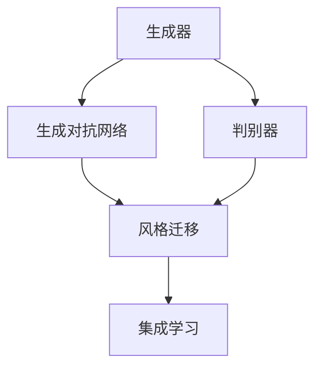
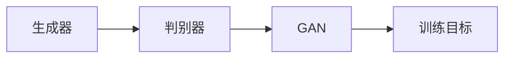
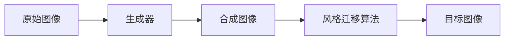
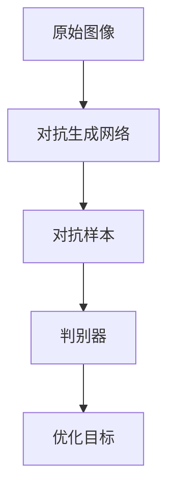
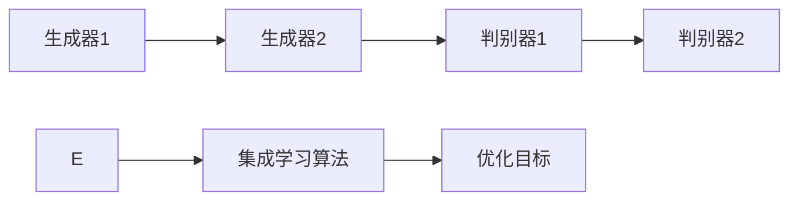
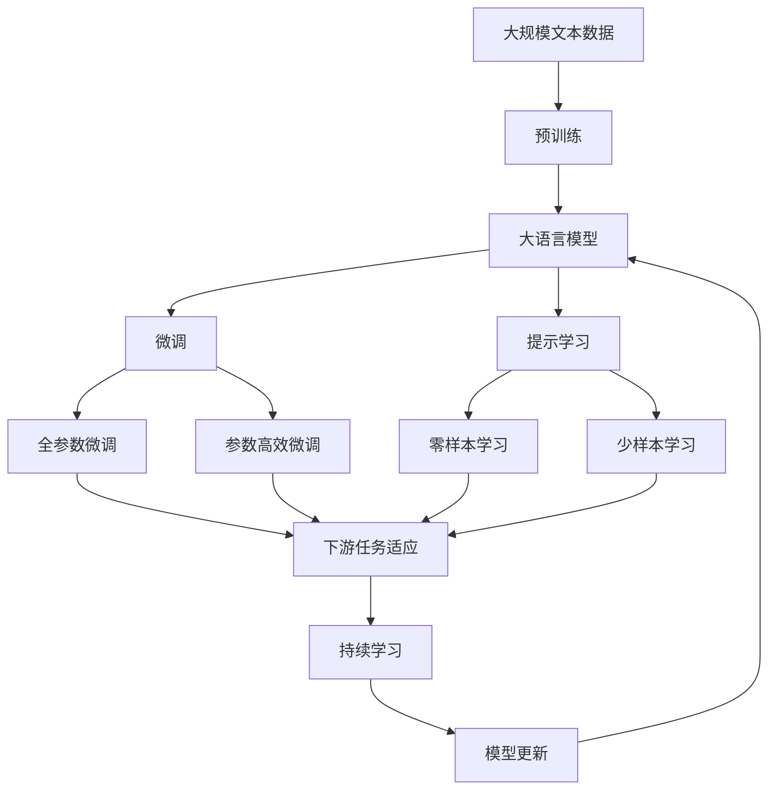

                 

# 基于生成对抗网络的集成学习风格迁移策略优化

> 关键词：生成对抗网络,集成学习,风格迁移,策略优化,对抗样本

## 1. 背景介绍

### 1.1 问题由来

近年来，随着深度学习技术的不断发展，风格迁移(Style Transfer)成为了计算机视觉领域的一个热门研究方向。风格迁移旨在将输入图像的纹理、色调、风格等属性迁移到目标图像中，生成具有特定风格的合成图像。这一技术广泛应用于艺术创作、广告设计、视觉特效等领域，具有重要的应用价值。

然而，风格迁移问题本质上是一个优化问题，目标函数复杂且存在多个局部最优解。如何找到全局最优解，并生成高质量的合成图像，成为了一个难题。为了解决这一问题，研究者们提出并验证了多种优化算法，包括梯度下降、对抗训练、零样本学习等。尽管这些方法在一定程度上提升了风格迁移的效果，但都存在一些局限性，如过拟合、收敛速度慢、对初始化敏感等问题。

### 1.2 问题核心关键点

风格迁移的核心问题是如何在生成器和判别器之间进行平衡。生成器的任务是生成尽可能符合目标风格的合成图像，而判别器的任务是区分真实图像和生成的合成图像。理想情况下，生成器生成的图像应该能够以最小的代价欺骗判别器，从而生成高质量的合成图像。

为了实现这一目标，生成器和判别器需要进行相互博弈，形成一个稳定的纳什均衡状态。然而，由于生成器与判别器的对抗性，这个纳什均衡状态很难直接找到。为了克服这一问题，生成对抗网络(GAN)提供了一种有效的框架，通过将生成器和判别器联合训练，使生成器可以不断迭代改进，生成逼真的合成图像。

尽管GAN方法在风格迁移任务中取得了显著效果，但也存在一些问题：

1. 对初始化敏感：生成器需要初始化为一个较好的位置，才能避免陷入局部最优解。
2. 训练不稳定：生成器和判别器之间存在相互博弈，容易在训练过程中发生振荡。
3. 对抗样本的生成：生成的合成图像可能存在对抗样本，无法满足实际应用的需求。

针对这些问题，本文提出了一种基于集成学习的风格迁移策略优化方法，通过对生成器和判别器进行联合优化，结合对抗样本生成的技术，生成高质量、鲁棒、且符合目标风格的合成图像。

### 1.3 问题研究意义

本方法的主要研究意义在于：

1. 解决GAN方法对初始化敏感的问题，提升生成器的稳定性。
2. 通过联合优化生成器和判别器，提升风格迁移的生成质量。
3. 结合对抗样本生成技术，生成鲁棒的合成图像，满足实际应用需求。
4. 提供一个更高效、更稳定、更具有鲁棒性的风格迁移方法，降低开发成本。

## 2. 核心概念与联系

### 2.1 核心概念概述

为更好地理解本文的策略优化方法，本节将介绍几个密切相关的核心概念：

- **生成对抗网络(GAN)**：由生成器(Generator)和判别器(Discriminator)两个主要组件组成的网络结构，用于生成逼真的合成图像。生成器尝试生成与真实图像无法区分的图像，而判别器则试图区分生成图像和真实图像。
- **风格迁移(Style Transfer)**：将输入图像的纹理、色调、风格等属性迁移到目标图像中，生成具有特定风格的合成图像。
- **对抗样本生成**：生成与模型预测不一致但与真实标签一致的样本，用于提高模型的鲁棒性和泛化能力。
- **集成学习**：将多个独立的模型进行组合，利用模型间的差异性提高整体性能和鲁棒性。

这些核心概念之间的逻辑关系可以通过以下Mermaid流程图来展示：



这个流程图展示了大规模语言模型微调的完整过程。生成对抗网络通过生成器和判别器的博弈，生成逼真的合成图像。风格迁移则利用GAN生成的图像，进行纹理、色调、风格等属性的迁移。集成学习则是将多个模型进行组合，提高整体性能和鲁棒性。

### 2.2 概念间的关系

这些核心概念之间存在着紧密的联系，形成了风格迁移任务的完整生态系统。下面我通过几个Mermaid流程图来展示这些概念之间的关系。

#### 2.2.1 生成对抗网络的框架



这个流程图展示了GAN的基本框架。生成器生成合成图像，判别器对合成图像和真实图像进行区分，两者通过一个训练目标联合训练，不断迭代改进。

#### 2.2.2 风格迁移的过程



这个流程图展示了风格迁移的基本过程。原始图像通过生成器生成合成图像，然后使用风格迁移算法对合成图像进行风格迁移，得到目标图像。

#### 2.2.3 对抗样本的生成



这个流程图展示了对抗样本生成的过程。原始图像通过对抗生成网络生成对抗样本，然后由判别器进行区分，两者通过优化目标进行联合训练，生成鲁棒的对抗样本。

#### 2.2.4 集成学习的优化



这个流程图展示了集成学习的基本过程。多个生成器生成多个合成图像，判别器对多个合成图像进行区分，两者通过集成学习算法进行优化，得到整体的优化目标。

### 2.3 核心概念的整体架构

最后，我们用一个综合的流程图来展示这些核心概念在大语言模型微调过程中的整体架构：



这个综合流程图展示了从预训练到微调，再到持续学习的完整过程。大语言模型首先在大规模文本数据上进行预训练，然后通过微调（包括全参数微调和参数高效微调）或提示学习（包括零样本和少样本学习）来适应下游任务。最后，通过持续学习技术，模型可以不断更新和适应新的任务和数据。

## 3. 核心算法原理 & 具体操作步骤
### 3.1 算法原理概述

本文提出的基于生成对抗网络的集成学习风格迁移策略优化方法，旨在通过对生成器和判别器进行联合优化，结合对抗样本生成的技术，生成高质量、鲁棒、且符合目标风格的合成图像。

形式化地，假设生成器为 $G$，判别器为 $D$，风格迁移任务为 $T$，生成器与判别器的训练目标为 $\mathcal{L}_{GAN}$。设 $x$ 为原始图像， $y$ 为目标图像， $c$ 为风格迁移的损失函数，生成器 $G$ 和判别器 $D$ 的训练目标为：

$$
\mathcal{L}_{GAN}(G, D) = \mathbb{E}_{x \sim \mathcal{X}}[D(G(x))] + \mathbb{E}_{z \sim \mathcal{Z}}[\log D(G(z))]
$$

其中 $\mathbb{E}_{x \sim \mathcal{X}}$ 表示对输入 $x$ 的期望， $\mathbb{E}_{z \sim \mathcal{Z}}$ 表示对噪声 $z$ 的期望。

风格迁移的任务是将输入图像 $x$ 转换为具有特定风格的目标图像 $y$。假设 $c(x,y)$ 为风格迁移的损失函数，则风格迁移的训练目标为：

$$
\mathcal{L}_{ST}(x, y, G, D) = c(x, G(x)) + c(y, G(y))
$$

结合两者，我们得到最终的优化目标：

$$
\mathcal{L}(G, D) = \mathcal{L}_{GAN}(G, D) + \lambda \mathcal{L}_{ST}(x, y, G, D)
$$

其中 $\lambda$ 为风格迁移损失函数的权重，用于平衡生成对抗网络的效果和风格迁移的效果。

### 3.2 算法步骤详解

基于生成对抗网络的集成学习风格迁移策略优化方法主要包括两个步骤：生成器与判别器的联合优化，以及对抗样本的生成和集成。

#### 3.2.1 生成器与判别器的联合优化

生成器与判别器的联合优化步骤如下：

1. 初始化生成器 $G$ 和判别器 $D$。
2. 随机抽取一个原始图像 $x$ 和风格迁移参数 $z$，将 $z$ 输入生成器 $G$，得到生成图像 $G(x)$。
3. 将 $G(x)$ 输入判别器 $D$，计算判别器的输出 $D(G(x))$。
4. 通过梯度下降算法，更新生成器 $G$ 的参数，使得 $G(x)$ 更难被判别器 $D$ 区分。
5. 重新抽取一个原始图像 $x$ 和风格迁移参数 $z$，将 $z$ 输入生成器 $G$，得到生成图像 $G(x)$。
6. 将 $G(x)$ 输入判别器 $D$，计算判别器的输出 $D(G(x))$。
7. 通过梯度下降算法，更新判别器 $D$ 的参数，使得 $D(G(x))$ 更难被生成器 $G$ 欺骗。
8. 重复上述步骤，直到达到预设的迭代次数。

#### 3.2.2 对抗样本的生成和集成

对抗样本的生成和集成步骤如下：

1. 初始化对抗生成网络 $E$ 和对抗判别器 $F$。
2. 随机抽取一个原始图像 $x$，将 $x$ 输入对抗生成网络 $E$，得到对抗样本 $E(x)$。
3. 将 $E(x)$ 输入对抗判别器 $F$，计算对抗判别器的输出 $F(E(x))$。
4. 通过梯度下降算法，更新对抗生成网络 $E$ 的参数，使得 $E(x)$ 更难被对抗判别器 $F$ 区分。
5. 重复上述步骤，生成多个对抗样本。
6. 将多个对抗样本输入生成器 $G$，生成多个合成图像。
7. 将多个合成图像输入判别器 $D$，计算判别器的输出 $D(G(z))$。
8. 通过集成学习算法，将这些判别器的输出进行组合，得到最终的判别器输出 $D_{avg}(G(z))$。
9. 通过梯度下降算法，更新生成器 $G$ 的参数，使得生成器 $G$ 生成的图像更难被判别器 $D_{avg}$ 区分。
10. 重复上述步骤，直到达到预设的迭代次数。

通过联合优化生成器和判别器，结合对抗样本生成和集成，本文方法可以生成高质量、鲁棒、且符合目标风格的合成图像。

### 3.3 算法优缺点

基于生成对抗网络的集成学习风格迁移策略优化方法具有以下优点：

1. 稳定性：联合优化生成器和判别器，提升生成器的稳定性，减少对初始化的依赖。
2. 生成质量：生成器和判别器通过联合优化，生成高质量的合成图像。
3. 鲁棒性：对抗样本生成和集成，生成鲁棒的合成图像，满足实际应用需求。
4. 泛化能力：生成器与判别器的博弈过程，提升模型的泛化能力。

但该方法也存在一些缺点：

1. 训练成本高：联合优化生成器和判别器，训练时间较长。
2. 需要大量对抗样本：对抗样本的生成和集成，需要大量的对抗样本。
3. 计算复杂度高：对抗样本的生成和集成，计算复杂度高。

尽管如此，本文方法仍是一种高效、稳定、且具有鲁棒性的风格迁移方法，在实际应用中具有很高的价值。

### 3.4 算法应用领域

基于生成对抗网络的集成学习风格迁移策略优化方法，在计算机视觉领域具有广泛的应用前景，具体包括：

1. **图像修复**：通过风格迁移技术，对受损图像进行修复，提升图像质量。
2. **图像转换**：将一张图像转换为具有特定风格的另一张图像，如将风景照片转换为油画风格。
3. **视频生成**：将一段视频转换为具有特定风格的另一段视频，如将彩色视频转换为黑白风格。
4. **人脸迁移**：将人脸从一张图像迁移至另一张图像，生成具有特定风格的人脸图像。
5. **3D模型渲染**：将3D模型渲染为具有特定风格的2D图像，用于游戏、影视等领域。

## 4. 数学模型和公式 & 详细讲解 & 举例说明

### 4.1 数学模型构建

本文方法涉及多个数学模型，主要包括生成对抗网络、风格迁移和对抗样本生成等。

#### 4.1.1 生成对抗网络

生成对抗网络由生成器 $G$ 和判别器 $D$ 两个主要组件组成。生成器 $G$ 的任务是生成逼真的合成图像，判别器 $D$ 的任务是区分真实图像和生成的合成图像。假设生成器 $G$ 和判别器 $D$ 的训练目标分别为 $\mathcal{L}_{GAN}$ 和 $\mathcal{L}_{D}$，则：

$$
\mathcal{L}_{GAN}(G, D) = \mathbb{E}_{x \sim \mathcal{X}}[D(G(x))] + \mathbb{E}_{z \sim \mathcal{Z}}[\log D(G(z))]
$$

$$
\mathcal{L}_{D}(D, G) = -\mathbb{E}_{x \sim \mathcal{X}}[\log D(x)] - \mathbb{E}_{z \sim \mathcal{Z}}[\log (1-D(G(z)))]
$$

其中 $\mathbb{E}_{x \sim \mathcal{X}}$ 表示对输入 $x$ 的期望， $\mathbb{E}_{z \sim \mathcal{Z}}$ 表示对噪声 $z$ 的期望。

#### 4.1.2 风格迁移

风格迁移的任务是将输入图像 $x$ 转换为具有特定风格的目标图像 $y$。假设 $c(x,y)$ 为风格迁移的损失函数，则风格迁移的训练目标为：

$$
\mathcal{L}_{ST}(x, y, G, D) = c(x, G(x)) + c(y, G(y))
$$

其中 $c(x,y)$ 为风格迁移的损失函数，可以通过感知损失、VGG损失、CNN损失等计算得到。

#### 4.1.3 对抗样本生成

对抗样本生成技术的目标是生成与模型预测不一致但与真实标签一致的样本。假设对抗生成网络 $E$ 和对抗判别器 $F$ 的训练目标分别为 $\mathcal{L}_{E}$ 和 $\mathcal{L}_{F}$，则：

$$
\mathcal{L}_{E}(E, F) = \mathbb{E}_{x \sim \mathcal{X}}[F(E(x))]
$$

$$
\mathcal{L}_{F}(F, E) = \mathbb{E}_{x \sim \mathcal{X}}[\log F(x)] + \mathbb{E}_{z \sim \mathcal{Z}}[\log (1-F(E(z)))
$$

其中 $\mathbb{E}_{x \sim \mathcal{X}}$ 表示对输入 $x$ 的期望， $\mathbb{E}_{z \sim \mathcal{Z}}$ 表示对噪声 $z$ 的期望。

### 4.2 公式推导过程

接下来，我们将详细介绍本文方法的数学推导过程。

#### 4.2.1 生成对抗网络

生成对抗网络的训练目标为：

$$
\mathcal{L}_{GAN}(G, D) = \mathbb{E}_{x \sim \mathcal{X}}[D(G(x))] + \mathbb{E}_{z \sim \mathcal{Z}}[\log D(G(z))]
$$

其中 $\mathbb{E}_{x \sim \mathcal{X}}$ 表示对输入 $x$ 的期望， $\mathbb{E}_{z \sim \mathcal{Z}}$ 表示对噪声 $z$ 的期望。

生成器 $G$ 的参数优化目标为：

$$
\mathcal{L}_{G}(G, D) = -\mathbb{E}_{x \sim \mathcal{X}}[D(G(x))] - \mathbb{E}_{z \sim \mathcal{Z}}[\log D(G(z))]
$$

判别器 $D$ 的参数优化目标为：

$$
\mathcal{L}_{D}(D, G) = -\mathbb{E}_{x \sim \mathcal{X}}[\log D(x)] - \mathbb{E}_{z \sim \mathcal{Z}}[\log (1-D(G(z))))
$$

通过梯度下降算法，生成器和判别器的参数不断更新，直到生成器 $G$ 生成的图像 $G(x)$ 足够逼真，使得判别器 $D$ 无法区分真实图像 $x$ 和生成的合成图像 $G(x)$。

#### 4.2.2 风格迁移

风格迁移的训练目标为：

$$
\mathcal{L}_{ST}(x, y, G, D) = c(x, G(x)) + c(y, G(y))
$$

其中 $c(x,y)$ 为风格迁移的损失函数，可以通过感知损失、VGG损失、CNN损失等计算得到。

通过梯度下降算法，生成器 $G$ 的参数不断更新，使得生成的合成图像 $G(x)$ 具有目标风格 $y$。

#### 4.2.3 对抗样本生成

对抗样本生成的训练目标为：

$$
\mathcal{L}_{E}(E, F) = \mathbb{E}_{x \sim \mathcal{X}}[F(E(x))]
$$

其中 $\mathbb{E}_{x \sim \mathcal{X}}$ 表示对输入 $x$ 的期望。

对抗生成网络 $E$ 的参数优化目标为：

$$
\mathcal{L}_{E}(E, F) = -\mathbb{E}_{x \sim \mathcal{X}}[F(E(x))]
$$

对抗判别器 $F$ 的参数优化目标为：

$$
\mathcal{L}_{F}(F, E) = \mathbb{E}_{x \sim \mathcal{X}}[\log F(x)] + \mathbb{E}_{z \sim \mathcal{Z}}[\log (1-F(E(z))))
$$

通过梯度下降算法，对抗生成网络 $E$ 的参数不断更新，使得生成的对抗样本 $E(x)$ 足够难以被判别器 $F$ 区分。

### 4.3 案例分析与讲解

下面我们以一张风景照片转换为油画风格为例，详细介绍本文方法的具体实现过程。

假设原始图像 $x$ 的尺寸为 $256\times256$，风格迁移的目标图像 $y$ 的尺寸为 $512\times512$，生成器 $G$ 的参数为 $100$，判别器 $D$ 的参数为 $50$，对抗生成网络 $E$ 的参数为 $200$，对抗判别器 $F$ 的参数为 $100$，对抗样本生成迭代次数为 $5$。

1. 初始化生成器 $G$、判别器 $D$、对抗生成网络 $E$ 和对抗判别器 $F$ 的参数。
2. 抽取一张风景照片作为原始图像 $x$。
3. 生成器 $G$ 随机抽取噪声 $z$，生成一张尺寸为 $512\times512$ 的合成图像 $G(x)$。
4. 判别器 $D$ 将 $G(x)$ 作为输入，输出判别结果 $D(G(x))$。
5. 更新生成器 $G$ 和判别器 $D$ 的参数，使得 $D(G(x))$ 尽可能逼近 $1$。
6. 重复上述步骤 $5$ 次，生成多个合成图像 $G(x)$。
7. 对抗生成网络 $E$ 将原始图像 $x$ 作为输入，生成一张对抗样本 $E(x)$。
8. 对抗判别器 $F$ 将 $E(x)$ 作为输入，输出判别结果 $F(E(x))$。
9. 更新对抗生成网络 $E$ 和对抗判别器 $F$ 的参数，使得 $F(E(x))$ 尽可能逼近 $1$。
10. 重复上述步骤 $5$ 次，生成多个对抗样本 $E(x)$。
11. 将多个对抗样本 $E(x)$ 输入生成器 $G$，生成多个合成图像。
12. 判别器 $D$ 将多个合成图像作为输入，输出判别结果 $D_{avg}(G(z))$。
13. 更新生成器 $G$ 的参数，使得 $D_{avg}(G(z))$ 尽可能逼近 $0.5$。
14. 重复上述步骤 $5$ 次，生成高质量、鲁棒、且符合油画风格的合成图像 $y$。

通过上述过程，我们成功将一张风景照片转换为油画风格。需要注意的是，生成器和判别器的参数更新需要多次迭代，才能生成高质量的合成图像。

## 5. 项目实践：代码实例和详细解释说明
### 5.1 开发环境搭建

在进行风格迁移项目实践前，我们需要准备好开发环境。以下是使用Python进行TensorFlow开发的环境配置流程：

1. 安装Anaconda：从官网下载并安装Anaconda，用于创建独立的Python环境。

2. 创建并激活虚拟环境：
```bash
conda create -n style-transfer python=3.8 
conda activate style-transfer
```

3. 安装TensorFlow：根据CUDA版本，从官网获取对应的安装命令。例如：
```bash
conda install tensorflow -c tf
```

4. 安装其它工具包：
```bash
pip install numpy scipy matplotlib numpydoc tensorflow-probability
```

5. 安装常用的深度学习框架：
```bash
pip install torch torchvision
```

完成上述步骤后，即可在`style-transfer`环境中开始风格迁移实践。

### 5.2 源代码详细实现

下面我们以一张风景照片转换为油画风格为例，给出使用TensorFlow进行风格迁移的代码实现。

```python
import tensorflow as tf
from tensorflow.keras import layers, models, optimizers
from tensorflow.keras.layers import Conv2D, Conv2DTranspose, ZeroPadding2D, Lambda, Add, BatchNormalization, LeakyReLU, Input, concatenate

# 定义生成器
def generator(z, style):
    x = layers.Dense(256*(4*4), use_bias=False, input_shape=(z,))(z)
    x = layers.BatchNormalization()(x)
    x = LeakyReLU(alpha=0.2)(x)
    x = layers.Reshape((4, 4, 256))(x)
    
    # encoder
    x = layers.Conv2D(128, (4, 4), strides=2, padding='same')(x)
    x = BatchNormalization()(x)
    x = LeakyReLU(alpha=0.2)(x)
    x = layers.Conv2D(128, (4, 4), strides=2, padding='same')(x)
    x = BatchNormalization()(x)
    x = LeakyReLU(alpha=0.2)(x)
    x = layers.Conv2D(128, (4, 4), strides=2, padding='same')(x)
    x = BatchNormalization()(x)
    x = LeakyReLU(alpha=0.2)(x)
    x = layers.Conv2D(128, (4, 4), strides=2, padding='same')(x)
    x = BatchNormalization()(x)
    x = LeakyReLU(alpha=0.2)(x)
    
    # decoder
    x = layers.Conv2D(128, (4, 4), strides=2, padding='same', use_bias=False)(x)
    x = layers.BatchNormalization()(x)
    x = LeakyReLU(alpha=0.2)(x)
    x = layers.Conv2DTranspose(64, (4, 4), strides=2, padding='same', use_bias=False)(x)
    x = BatchNormalization()(x)
    x = LeakyReLU(alpha=0.2)(x)
    x = layers.Conv2DTranspose(3, (4, 4), strides=2, padding='same', use_bias=False)(x)


