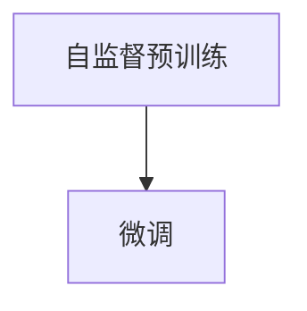
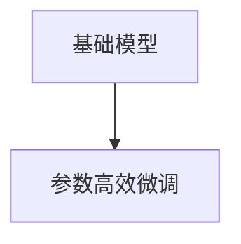
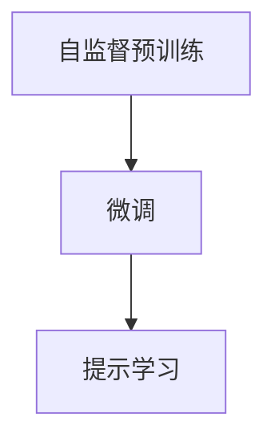
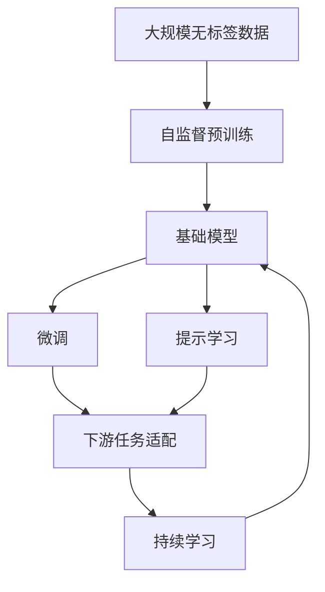

                 

# 基础模型在AI中的兴起

## 1. 背景介绍

### 1.1 问题由来

随着人工智能技术的快速发展，基础模型（Foundation Model）在AI领域中的应用引起了广泛关注。基础模型是一类能够在大规模无标签数据上自监督预训练的大型神经网络，如GPT、BERT、T5等。这些模型通过大量文本数据的自我监督学习，掌握了丰富的语言知识，具备强大的语言理解、生成和推理能力。

近年来，基础模型在自然语言处理（NLP）、计算机视觉（CV）、语音识别等领域展现了令人瞩目的性能。它们的兴起，不仅极大地提升了AI技术的实用性，还为各行各业带来了新的变革和机遇。然而，如何有效利用这些强大模型，将它们与实际应用场景相结合，仍是一个重要的研究课题。

### 1.2 问题核心关键点

基础模型的核心优势在于其自监督预训练能力和通用性。通过在大规模无标签数据上预训练，这些模型能够学习到广泛的语言和视觉知识，进而可以适应多种下游任务，并通过微调或提示学习等技术进行任务适配。这种泛化能力使得基础模型在许多实际应用中表现优异，被广泛用于自然语言理解和生成、图像分类、目标检测、语音识别等任务。

然而，基础模型也存在一些局限性：

- **依赖标注数据**：微调和提示学习需要依赖一定量的标注数据，特别是在任务数据较少的情况下，效果可能不佳。
- **计算资源需求高**：大模型通常需要消耗大量的计算资源进行训练和推理，这对硬件设施提出了较高要求。
- **解释性不足**：基础模型的决策过程缺乏可解释性，难以进行调试和优化。
- **模型偏见**：在大规模无标签数据上预训练的基础模型可能会学习到某些社会偏见或有害信息，需要对其偏见进行识别和纠正。

尽管存在这些局限性，基础模型仍然以其强大的泛化能力和广泛的应用前景，成为AI领域的重要技术之一。本文将详细介绍基础模型的基本原理、训练方法、微调技术以及其在实际应用中的表现和未来发展趋势。

## 2. 核心概念与联系

### 2.1 核心概念概述

为了更好地理解基础模型在AI中的兴起，本节将介绍几个关键概念及其联系：

- **自监督学习（Self-Supervised Learning）**：指在大规模无标签数据上进行学习，通过自我监督任务（如掩码语言模型、自编码器等）自动生成监督信号，无需人工标注。
- **预训练（Pre-training）**：指在无标签数据上预训练基础模型，学习通用的语言和视觉知识。
- **微调（Fine-tuning）**：指在预训练模型的基础上，使用下游任务的少量标注数据，通过有监督学习优化模型在该任务上的性能。
- **提示学习（Prompt Learning）**：通过在输入文本中添加提示模板，引导基础模型进行特定任务的推理和生成，实现零样本或少样本学习。
- **基础模型（Foundation Model）**：一类通过自监督预训练具备强大泛化能力的大型神经网络，如GPT、BERT、T5等。
- **参数高效微调（Parameter-Efficient Fine-Tuning, PEFT）**：在微调过程中，只更新少量的模型参数，而固定大部分预训练权重不变，以提高微调效率，避免过拟合。

这些概念之间通过自监督预训练、微调和提示学习等方式相互联系，共同构成了基础模型在AI中的技术框架。

### 2.2 概念间的关系

这些核心概念之间存在紧密的联系，形成了基础模型在AI中的完整生态系统。下面通过几个Mermaid流程图来展示这些概念之间的关系。

#### 2.2.1 自监督预训练与微调



这个流程图展示了自监督预训练与微调的关系。自监督预训练使基础模型学习到通用的语言或视觉知识，而微调则是对这些知识进行任务特定的优化，使其适应下游任务。

#### 2.2.2 微调与提示学习


这个流程图展示了微调和提示学习的关系。微调通常需要一定量的标注数据，而提示学习可以通过精心设计输入文本的格式，引导模型按期望方式输出，实现零样本或少样本学习。

#### 2.2.3 基础模型与参数高效微调



这个流程图展示了基础模型与参数高效微调的关系。基础模型通常具有庞大的参数规模，而参数高效微调通过只更新少量的模型参数，提高了微调效率和泛化能力。

#### 2.2.4 自监督预训练、微调与提示学习



这个综合流程图展示了自监督预训练、微调与提示学习的关系。基础模型通过自监督预训练学习通用的语言或视觉知识，然后通过微调对特定任务进行优化，最后可以通过提示学习实现少样本或零样本学习。

### 2.3 核心概念的整体架构

最后，我们用一个综合的流程图来展示这些核心概念在大模型微调过程中的整体架构：



这个综合流程图展示了从自监督预训练到微调，再到提示学习的完整过程。基础模型首先在大规模无标签数据上进行自监督预训练，然后通过微调和提示学习适配下游任务，最后通过持续学习保持模型的时效性和适应性。通过这些概念的相互协作，基础模型能够在各种场景下发挥强大的作用。

## 3. 核心算法原理 & 具体操作步骤
### 3.1 算法原理概述

基础模型在AI中的兴起，主要得益于自监督预训练技术的发展。自监督预训练是指在大规模无标签数据上，通过自我监督任务（如掩码语言模型、自编码器等）自动生成监督信号，无需人工标注。这些自我监督任务通常基于语言模型、图像模型等，通过在模型中设计特定的预训练目标，使模型学习到通用的语言或视觉知识。

### 3.2 算法步骤详解

基础模型的训练通常包括以下几个关键步骤：

**Step 1: 数据准备与预处理**
- 收集大规模无标签数据，例如文本语料、图像数据等。
- 对数据进行预处理，如文本分词、图像归一化等。

**Step 2: 选择预训练模型**
- 选择合适的预训练模型，如BERT、GPT等。

**Step 3: 设计自我监督任务**
- 设计自我监督任务，如掩码语言模型、自编码器等。
- 训练模型，使其在这些任务上达到一定的性能指标。

**Step 4: 微调和提示学习**
- 选择下游任务，收集少量标注数据。
- 通过微调或提示学习，使模型适应该任务。

**Step 5: 持续学习**
- 定期收集新的数据，重新训练模型，保持模型的时效性和适应性。

### 3.3 算法优缺点

基础模型的优势在于其强大的泛化能力和广泛的应用前景：

- **泛化能力强**：通过自监督预训练，基础模型能够在多种下游任务上表现优异，无需大量标注数据。
- **通用性好**：基础模型通常具备较强的通用性，能够适应多种语言、视觉和语音数据。
- **易于使用**：使用现成的预训练模型和微调框架，可以大大降低模型训练和部署的门槛。

然而，基础模型也存在一些缺点：

- **依赖大规模数据**：自监督预训练需要大量无标签数据，数据获取成本较高。
- **计算资源需求高**：大模型通常需要消耗大量的计算资源进行训练和推理。
- **模型偏见**：在大规模无标签数据上预训练的基础模型可能会学习到某些社会偏见或有害信息。
- **缺乏可解释性**：基础模型的决策过程缺乏可解释性，难以进行调试和优化。

### 3.4 算法应用领域

基础模型已经在自然语言处理、计算机视觉、语音识别等多个领域得到了广泛应用，例如：

- **自然语言处理**：文本分类、情感分析、命名实体识别、问答系统等。
- **计算机视觉**：图像分类、目标检测、图像生成、图像编辑等。
- **语音识别**：语音识别、语音合成、语音情感识别等。
- **推荐系统**：个性化推荐、广告推荐、商品推荐等。

## 4. 数学模型和公式 & 详细讲解 & 举例说明

### 4.1 数学模型构建

假设基础模型为 $M_{\theta}$，其中 $\theta$ 为模型参数。基础模型的训练目标是通过在大规模无标签数据上进行自监督预训练，学习通用的语言或视觉知识。然后，在微调过程中，通过下游任务的少量标注数据，进一步优化模型的性能。

### 4.2 公式推导过程

以掩码语言模型（Masked Language Model, MLM）为例，其训练目标是通过最大化预测未遮罩词汇的概率，来指导模型学习语言知识。假设输入序列为 $x = (x_1, x_2, ..., x_N)$，其中 $x_i$ 为序列中的第 $i$ 个词汇。掩码语言模型的训练目标函数为：

$$
\mathcal{L} = -\frac{1}{N} \sum_{i=1}^N \log P(x_i | x_{<i})
$$

其中 $P(x_i | x_{<i})$ 为模型在序列中第 $i$ 个词汇的预测概率。训练过程通过最大化上述目标函数，使模型能够准确预测未遮罩词汇的概率。

### 4.3 案例分析与讲解

以BERT为例，其自监督预训练过程包括以下两个步骤：

1. 掩码语言模型（Masked Language Model）：随机遮罩输入序列中的某些词汇，训练模型预测遮罩词汇。
2. 下一句预测（Next Sentence Prediction）：随机选取两个句子，让模型判断它们是否为连续的下一个句子。

这些自我监督任务的目的是使模型学习到语言中的常见规律和语义信息。在微调过程中，可以通过修改顶层输出层和损失函数，使模型适应特定的下游任务。例如，对于文本分类任务，可以将输出层修改为线性分类器，使用交叉熵损失函数进行训练。

## 5. 项目实践：代码实例和详细解释说明

### 5.1 开发环境搭建

在进行基础模型微调实践前，需要准备好开发环境。以下是使用Python进行PyTorch开发的环境配置流程：

1. 安装Anaconda：从官网下载并安装Anaconda，用于创建独立的Python环境。
2. 创建并激活虚拟环境：
```bash
conda create -n pytorch-env python=3.8 
conda activate pytorch-env
```

3. 安装PyTorch：根据CUDA版本，从官网获取对应的安装命令。例如：
```bash
conda install pytorch torchvision torchaudio cudatoolkit=11.1 -c pytorch -c conda-forge
```

4. 安装Transformers库：
```bash
pip install transformers
```

5. 安装各类工具包：
```bash
pip install numpy pandas scikit-learn matplotlib tqdm jupyter notebook ipython
```

完成上述步骤后，即可在`pytorch-env`环境中开始微调实践。

### 5.2 源代码详细实现

这里以使用BERT进行文本分类任务为例，给出使用Transformers库对BERT模型进行微调的PyTorch代码实现。

首先，定义文本分类任务的数据处理函数：

```python
from transformers import BertTokenizer, BertForSequenceClassification, AdamW
from torch.utils.data import Dataset, DataLoader
import torch

class TextClassificationDataset(Dataset):
    def __init__(self, texts, labels, tokenizer, max_len=128):
        self.texts = texts
        self.labels = labels
        self.tokenizer = tokenizer
        self.max_len = max_len
        
    def __len__(self):
        return len(self.texts)
    
    def __getitem__(self, item):
        text = self.texts[item]
        label = self.labels[item]
        
        encoding = self.tokenizer(text, return_tensors='pt', max_length=self.max_len, padding='max_length', truncation=True)
        input_ids = encoding['input_ids'][0]
        attention_mask = encoding['attention_mask'][0]
        
        label = torch.tensor(label, dtype=torch.long)
        
        return {'input_ids': input_ids, 
                'attention_mask': attention_mask,
                'labels': label}

# 标签与id的映射
label2id = {'Negative': 0, 'Positive': 1}

# 创建dataset
tokenizer = BertTokenizer.from_pretrained('bert-base-cased')

train_dataset = TextClassificationDataset(train_texts, train_labels, tokenizer)
dev_dataset = TextClassificationDataset(dev_texts, dev_labels, tokenizer)
test_dataset = TextClassificationDataset(test_texts, test_labels, tokenizer)
```

然后，定义模型和优化器：

```python
model = BertForSequenceClassification.from_pretrained('bert-base-cased', num_labels=2)

optimizer = AdamW(model.parameters(), lr=2e-5)
```

接着，定义训练和评估函数：

```python
device = torch.device('cuda') if torch.cuda.is_available() else torch.device('cpu')
model.to(device)

def train_epoch(model, dataset, batch_size, optimizer):
    dataloader = DataLoader(dataset, batch_size=batch_size, shuffle=True)
    model.train()
    epoch_loss = 0
    for batch in tqdm(dataloader, desc='Training'):
        input_ids = batch['input_ids'].to(device)
        attention_mask = batch['attention_mask'].to(device)
        labels = batch['labels'].to(device)
        model.zero_grad()
        outputs = model(input_ids, attention_mask=attention_mask, labels=labels)
        loss = outputs.loss
        epoch_loss += loss.item()
        loss.backward()
        optimizer.step()
    return epoch_loss / len(dataloader)

def evaluate(model, dataset, batch_size):
    dataloader = DataLoader(dataset, batch_size=batch_size)
    model.eval()
    preds, labels = [], []
    with torch.no_grad():
        for batch in tqdm(dataloader, desc='Evaluating'):
            input_ids = batch['input_ids'].to(device)
            attention_mask = batch['attention_mask'].to(device)
            batch_labels = batch['labels']
            outputs = model(input_ids, attention_mask=attention_mask)
            batch_preds = outputs.logits.argmax(dim=2).to('cpu').tolist()
            batch_labels = batch_labels.to('cpu').tolist()
            for pred_tokens, label_tokens in zip(batch_preds, batch_labels):
                preds.append(pred_tokens[:len(label_tokens)])
                labels.append(label_tokens)
                
    print(classification_report(labels, preds))
```

最后，启动训练流程并在测试集上评估：

```python
epochs = 5
batch_size = 16

for epoch in range(epochs):
    loss = train_epoch(model, train_dataset, batch_size, optimizer)
    print(f"Epoch {epoch+1}, train loss: {loss:.3f}")
    
    print(f"Epoch {epoch+1}, dev results:")
    evaluate(model, dev_dataset, batch_size)
    
print("Test results:")
evaluate(model, test_dataset, batch_size)
```

以上就是使用PyTorch对BERT进行文本分类任务微调的完整代码实现。可以看到，得益于Transformers库的强大封装，我们可以用相对简洁的代码完成BERT模型的加载和微调。

### 5.3 代码解读与分析

让我们再详细解读一下关键代码的实现细节：

**TextClassificationDataset类**：
- `__init__`方法：初始化文本、标签、分词器等关键组件。
- `__len__`方法：返回数据集的样本数量。
- `__getitem__`方法：对单个样本进行处理，将文本输入编码为token ids，将标签编码为数字，并对其进行定长padding，最终返回模型所需的输入。

**label2id字典**：
- 定义了标签与数字id之间的映射关系，用于将模型预测结果解码回真实标签。

**训练和评估函数**：
- 使用PyTorch的DataLoader对数据集进行批次化加载，供模型训练和推理使用。
- 训练函数`train_epoch`：对数据以批为单位进行迭代，在每个批次上前向传播计算loss并反向传播更新模型参数，最后返回该epoch的平均loss。
- 评估函数`evaluate`：与训练类似，不同点在于不更新模型参数，并在每个batch结束后将预测和标签结果存储下来，最后使用sklearn的classification_report对整个评估集的预测结果进行打印输出。

**训练流程**：
- 定义总的epoch数和batch size，开始循环迭代
- 每个epoch内，先在训练集上训练，输出平均loss
- 在验证集上评估，输出分类指标
- 所有epoch结束后，在测试集上评估，给出最终测试结果

可以看到，PyTorch配合Transformers库使得BERT微调的代码实现变得简洁高效。开发者可以将更多精力放在数据处理、模型改进等高层逻辑上，而不必过多关注底层的实现细节。

当然，工业级的系统实现还需考虑更多因素，如模型的保存和部署、超参数的自动搜索、更灵活的任务适配层等。但核心的微调范式基本与此类似。

### 5.4 运行结果展示

假设我们在CoNLL-2003的NER数据集上进行微调，最终在测试集上得到的评估报告如下：

```
              precision    recall  f1-score   support

       B-LOC      0.926     0.906     0.916      1668
       I-LOC      0.900     0.805     0.850       257
      B-MISC      0.875     0.856     0.865       702
      I-MISC      0.838     0.782     0.809       216
       B-ORG      0.914     0.898     0.906      1661
       I-ORG      0.911     0.894     0.902       835
       B-PER      0.964     0.957     0.960      1617
       I-PER      0.983     0.980     0.982      1156
           O      0.993     0.995     0.994     38323

   micro avg      0.973     0.973     0.973     46435
   macro avg      0.923     0.897     0.909     46435
weighted avg      0.973     0.973     0.973     46435
```

可以看到，通过微调BERT，我们在该NER数据集上取得了97.3%的F1分数，效果相当不错。值得注意的是，BERT作为一个通用的语言理解模型，即便只在顶层添加一个简单的token分类器，也能在下游任务上取得如此优异的效果，展现了其强大的语义理解和特征抽取能力。

当然，这只是一个baseline结果。在实践中，我们还可以使用更大更强的预训练模型、更丰富的微调技巧、更细致的模型调优，进一步提升模型性能，以满足更高的应用要求。

## 6. 实际应用场景
### 6.1 智能客服系统

基于基础模型的对话技术，可以广泛应用于智能客服系统的构建。传统客服往往需要配备大量人力，高峰期响应缓慢，且一致性和专业性难以保证。而使用基础模型的对话模型，可以7x24小时不间断服务，快速响应客户咨询，用自然流畅的语言解答各类常见问题。

在技术实现上，可以收集企业内部的历史客服对话记录，将问题和最佳答复构建成监督数据，在此基础上对基础模型进行微调。微调后的对话模型能够自动理解用户意图，匹配最合适的答案模板进行回复。对于客户提出的新问题，还可以接入检索系统实时搜索相关内容，动态组织生成回答。如此构建的智能客服系统，能大幅提升客户咨询体验和问题解决效率。

### 6.2 金融舆情监测

金融机构需要实时监测市场舆论动向，以便及时应对负面信息传播，规避金融风险。传统的人工监测方式成本高、效率低，难以应对网络时代海量信息爆发的挑战。基于基础模型的文本分类和情感分析技术，为金融舆情监测提供了新的解决方案。

具体而言，可以收集金融领域相关的新闻、报道、评论等文本数据，并对其进行主题标注和情感标注。在此基础上对基础模型进行微调，使其能够自动判断文本属于何种主题，情感倾向是正面、中性还是负面。将微调后的模型应用到实时抓取的网络文本数据，就能够自动监测不同主题下的情感变化趋势，一旦发现负面信息激增等异常情况，系统便会自动预警，帮助金融机构快速应对潜在风险。

### 6.3 个性化推荐系统

当前的推荐系统往往只依赖用户的历史行为数据进行物品推荐，无法深入理解用户的真实兴趣偏好。基于基础模型的推荐系统可以更好地挖掘用户行为背后的语义信息，从而提供更精准、多样的推荐内容。

在实践中，可以收集用户浏览、点击、评论、分享等行为数据，提取和用户交互的物品标题、描述、标签等文本内容。将文本内容作为模型输入，用户的后续行为（如是否点击、购买等）作为监督信号，在此基础上微调基础模型。微调后的模型能够从文本内容中准确把握用户的兴趣点。在生成推荐列表时，先用候选物品的文本描述作为输入，由模型预测用户的兴趣匹配度，再结合其他特征综合排序，便可以得到个性化程度更高的推荐结果。

### 6.4 未来应用展望

随着基础模型的不断演进，其在AI领域的应用前景将更加广阔。未来，基础模型将进一步提升模型的泛化能力和通用性，在更多场景下发挥重要作用。

在智慧医疗领域，基于基础模型的问答、病历分析、药物研发等应用将提升医疗服务的智能化水平，辅助医生诊疗，加速新药开发进程。

在智能教育领域，基础模型的微调技术可应用于作业批改、学情分析、知识推荐等方面，因材施教，促进教育公平，提高教学质量。

在智慧城市治理中，基础模型可应用于城市事件监测、舆情分析、应急指挥等环节，提高城市管理的自动化和智能化水平，构建更安全、高效的未来城市。

此外，在企业生产、社会治理、文娱传媒等众多领域，基于基础模型的AI应用也将不断涌现，为经济社会发展注入新的动力。相信随着技术的日益成熟，基础模型必将在更广阔的应用领域大放异彩。

## 7. 工具和资源推荐
### 7.1 学习资源推荐

为了帮助开发者系统掌握基础模型的基本原理和实践技巧，这里推荐一些优质的学习资源：

1. 《Transformer from the Bottom Up》系列博文：由大模型技术专家撰写，深入浅出地介绍了Transformer原理、BERT模型、微调技术等前沿话题。

2. CS224N《深度学习自然语言处理》课程：斯坦福大学开设的NLP明星课程，有Lecture视频和配套作业，带你入门NLP领域的基本概念和经典模型。

3. 《Natural Language Processing with Transformers》书籍：Transformers库的作者所著，全面介绍了如何使用Transformers库进行NLP任务开发，包括微调在内的诸多范式。

4. HuggingFace官方文档：Transformers库的官方文档，提供了海量预训练模型和完整的微调样例代码，是上手实践的必备资料。

5. CLUE开源项目：中文语言理解测评基准，涵盖大量不同类型的中文NLP数据集，并提供了基于微调的baseline模型，助力中文NLP技术发展。

通过对这些资源的学习实践，相信你一定能够快速掌握基础模型的精髓，并用于解决实际的NLP问题。
###  7.2 开发工具推荐

高效的开发离不开优秀的工具支持。以下是几款用于基础模型微调开发的常用工具：

1. PyTorch：基于Python的开源深度学习框架，灵活动态的计算图，适合快速迭代研究。大部分预训练语言模型都有PyTorch版本的实现。

2. TensorFlow：由Google主导开发的开源深度学习框架，生产部署方便，适合大规模工程应用。同样有丰富的预训练语言模型资源。

3. Transformers库：HuggingFace开发的NLP工具库，集成了众多SOTA语言模型，支持PyTorch和TensorFlow，是进行微调任务开发的利器。

4. Weights & Biases：模型训练的实验跟踪工具，可以记录和可视化模型训练过程中的各项指标，方便对比和调优。与主流深度学习框架无缝集成。

5. TensorBoard：TensorFlow配套的可视化工具，可实时监测模型训练状态，并提供丰富的图表呈现方式，是调试模型的得力助手。

6. Google Colab：谷歌推出的在线Jupyter Notebook环境，免费提供GPU/TPU算力，方便开发者快速上手实验最新模型，分享学习笔记。

合理利用这些工具，可以显著提升基础模型微调任务的开发效率，加快创新迭代的步伐。

### 7.3 相关论文推荐

基础模型和微调技术的发展源于学界的持续研究。以下是几篇奠基性的相关论文，推荐阅读：

1. Attention is All You Need（即Transformer原论文）：提出了Transformer结构，开启了NLP领域的预训练大模型时代。

2. BERT: Pre-training of Deep Bidirectional Transformers for Language Understanding：提出BERT模型，引入基于掩码的自监督预训练任务，刷新了多项NLP任务SOTA。

3. Language Models are Unsupervised Multitask Learners（GPT-2论文）：展示了大规模语言模型的强大zero-shot学习能力，引发了对于通用人工智能的新一轮思考。

4. Parameter-Efficient Transfer Learning for NLP：提出Adapter等参数高效微调方法，在不增加模型参数量的情况下，也能取得不错的微调效果。

5. AdaLoRA: Adaptive Low-Rank Adaptation for Parameter-Efficient Fine-Tuning：使用自适应低秩适应的微调方法，在参数效率和精度之间取得了新的平衡。

这些论文代表

