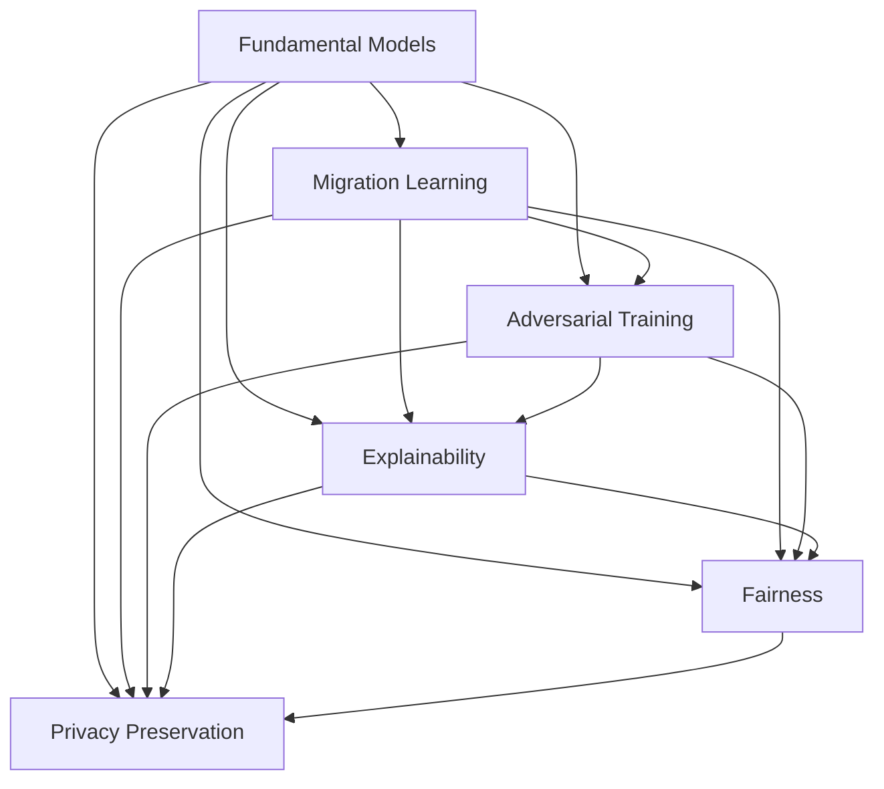
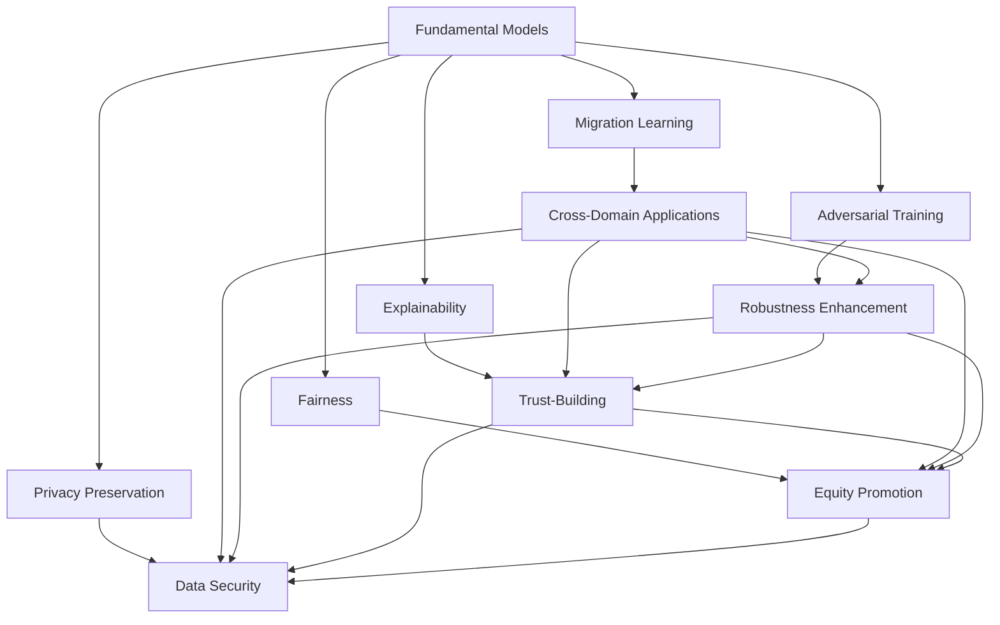

                 

# 基础模型的技术与社会融合

## 1. 背景介绍

### 1.1 问题由来
人工智能(AI)技术的快速发展，特别是深度学习模型的兴起，正在改变着各行各业的运作方式。从自动驾驶到金融预测，从自然语言处理到医疗诊断，AI技术正在逐步融入到社会的各个角落。然而，技术进步的同时也带来了诸多挑战，如何确保AI技术的健康发展，使其更好地服务于社会，成为一个亟待探讨的问题。

### 1.2 问题核心关键点
基础模型，即通过大规模数据训练得到的高性能模型，是当前AI技术发展的重要驱动力。基础模型在技术上已经取得了显著成果，但在与社会融合的过程中，还面临诸多问题和挑战。本节将详细阐述这些核心关键点，包括模型的技术特性、社会影响、伦理道德以及应用领域等。

### 1.3 问题研究意义
深入研究基础模型的技术与社会融合问题，对于推动AI技术的可持续发展，提升社会福祉，具有重要意义：

1. **促进技术进步**：了解基础模型的技术特性，有助于推动模型改进和优化，提升AI技术的整体水平。
2. **确保社会福祉**：确保AI技术的安全、公平、透明，避免其潜在的负面影响，促进技术服务于公众福祉。
3. **促进跨领域应用**：推动AI技术与医疗、教育、金融等领域深度融合，为各行各业带来创新和变革。
4. **提升决策科学性**：通过基础模型的辅助，提升决策过程的科学性和客观性，提高政策制定的有效性。
5. **促进国际合作**：在确保技术安全和伦理的前提下，推动国际合作，共享AI技术的进步成果。

## 2. 核心概念与联系

### 2.1 核心概念概述

为更好地理解基础模型的技术与社会融合，本节将介绍几个关键概念：

- **基础模型(Fundamental Models)**：通过大规模数据训练得到的高性能模型，如BERT、GPT-3等。这类模型具备较强的学习能力和泛化能力，广泛应用于自然语言处理、计算机视觉、语音识别等多个领域。
- **迁移学习(Transfer Learning)**：利用已训练好的模型，在新的任务上进行微调，以适应特定需求。基础模型通常通过迁移学习实现跨领域应用。
- **对抗训练(Adversarial Training)**：通过在模型输入中加入对抗样本，提高模型的鲁棒性和泛化能力。
- **可解释性(Explainability)**：确保模型决策过程的透明性，便于用户理解和接受。
- **公平性(Fairness)**：确保模型在处理不同背景数据时，不会产生歧视或偏见。
- **隐私保护(Privacy Preservation)**：保护用户数据隐私，避免数据泄露。

### 2.2 概念间的关系

这些核心概念之间存在着紧密的联系，共同构成了基础模型的技术与社会融合框架。下面我通过几个Mermaid流程图来展示这些概念之间的关系：



这个流程图展示了大模型技术在迁移学习、对抗训练、可解释性、公平性和隐私保护等不同维度上的应用，以及这些维度之间的相互作用。

### 2.3 核心概念的整体架构

最后，我们用一个综合的流程图来展示这些核心概念在大模型技术与社会融合中的整体架构：



这个综合流程图展示了从基础模型到跨领域应用，再到对抗训练、可解释性、公平性和隐私保护的整个过程，以及每个环节的技术实现和社会影响。

## 3. 核心算法原理 & 具体操作步骤
### 3.1 算法原理概述

基础模型的技术与社会融合，本质上是一个多维度的技术优化与社会责任承担的过程。其核心算法原理包括：

1. **迁移学习**：利用预训练模型在不同任务上进行微调，提升模型性能。
2. **对抗训练**：通过加入对抗样本，提高模型鲁棒性，避免模型过拟合。
3. **可解释性**：通过多种技术手段，提高模型的可解释性，增强用户信任。
4. **公平性**：设计公平性评估指标，确保模型在不同背景数据上的性能。
5. **隐私保护**：采用差分隐私、联邦学习等技术，保护用户数据隐私。

这些算法原理共同构成了基础模型的技术框架，为模型在实际应用中的性能提升和社会影响提供了保障。

### 3.2 算法步骤详解

以下详细介绍各个算法步骤的详细步骤：

#### 3.2.1 迁移学习

1. **准备数据**：收集标注数据集，进行数据预处理。
2. **加载模型**：使用预训练模型或自己构建的模型。
3. **微调模型**：在新的任务上进行微调，更新模型参数。
4. **评估模型**：在新数据集上评估模型性能，优化模型超参数。

#### 3.2.2 对抗训练

1. **生成对抗样本**：使用对抗样本生成技术，生成模型难以识别的数据。
2. **更新模型**：在生成对抗样本上训练模型，更新模型参数。
3. **评估模型**：在原始数据集上评估模型性能，确保模型鲁棒性。

#### 3.2.3 可解释性

1. **选择解释方法**：根据模型类型选择可解释性方法，如LIME、SHAP等。
2. **生成解释结果**：在特定样本上生成模型决策的解释结果。
3. **可视化展示**：将解释结果可视化展示，便于用户理解。

#### 3.2.4 公平性

1. **定义公平性指标**：如平衡误差、召回率等。
2. **收集公平性数据**：在多样性数据集上收集公平性评估数据。
3. **优化模型**：通过调整模型参数或使用公平性增强技术，优化模型性能。

#### 3.2.5 隐私保护

1. **设计隐私保护方案**：如差分隐私、联邦学习等。
2. **实施隐私保护措施**：在数据收集、存储和处理过程中实施隐私保护。
3. **评估隐私风险**：定期评估隐私保护方案的有效性，确保数据安全。

### 3.3 算法优缺点

基础模型的技术与社会融合算法具有以下优点：

1. **提升性能**：通过迁移学习、对抗训练等技术，提高模型泛化能力和鲁棒性。
2. **增强信任**：通过可解释性技术，提高用户对模型的信任和接受度。
3. **促进公平**：通过公平性评估和优化，减少模型偏见，确保公平性。
4. **保护隐私**：通过隐私保护技术，保护用户数据安全，避免数据泄露。

同时，这些算法也存在一些缺点：

1. **计算资源消耗大**：迁移学习、对抗训练等技术需要大量计算资源。
2. **模型复杂度高**：可解释性、公平性等技术增加了模型的复杂性。
3. **隐私保护难度大**：隐私保护技术需要在模型设计、数据处理等多个环节进行严格控制。
4. **模型性能波动大**：对抗样本、公平性评估等技术可能会影响模型性能。

### 3.4 算法应用领域

基础模型的技术与社会融合算法在多个领域中得到了广泛应用：

1. **自然语言处理**：通过迁移学习、可解释性技术，提升文本分类、情感分析等任务性能。
2. **计算机视觉**：通过迁移学习、对抗训练等技术，提升图像识别、目标检测等任务性能。
3. **医疗健康**：通过公平性评估、隐私保护技术，提升医疗诊断、健康管理等任务性能。
4. **金融预测**：通过公平性增强、隐私保护技术，提升金融预测、风险控制等任务性能。
5. **教育培训**：通过可解释性、隐私保护技术，提升智能推荐、学习分析等任务性能。

## 4. 数学模型和公式 & 详细讲解  
### 4.1 数学模型构建

本节将使用数学语言对基础模型的技术与社会融合过程进行更加严格的刻画。

记基础模型为 $M_{\theta}$，其中 $\theta$ 为模型参数。假设迁移学习任务为 $T$，其标注数据集为 $D=\{(x_i,y_i)\}_{i=1}^N$，$x_i$ 为输入，$y_i$ 为标签。迁移学习的目标是最小化损失函数：

$$
\mathcal{L}(\theta) = \frac{1}{N} \sum_{i=1}^N \ell(M_{\theta}(x_i),y_i)
$$

其中 $\ell$ 为损失函数，可以采用交叉熵损失、均方误差损失等。

### 4.2 公式推导过程

以二分类任务为例，推导交叉熵损失函数及其梯度的计算公式。

假设模型 $M_{\theta}$ 在输入 $x$ 上的输出为 $\hat{y}=M_{\theta}(x) \in [0,1]$，表示样本属于正类的概率。真实标签 $y \in \{0,1\}$。则二分类交叉熵损失函数定义为：

$$
\ell(M_{\theta}(x),y) = -[y\log \hat{y} + (1-y)\log (1-\hat{y})]
$$

将其代入经验风险公式，得：

$$
\mathcal{L}(\theta) = -\frac{1}{N}\sum_{i=1}^N [y_i\log M_{\theta}(x_i)+(1-y_i)\log(1-M_{\theta}(x_i))]
$$

根据链式法则，损失函数对参数 $\theta_k$ 的梯度为：

$$
\frac{\partial \mathcal{L}(\theta)}{\partial \theta_k} = -\frac{1}{N}\sum_{i=1}^N (\frac{y_i}{M_{\theta}(x_i)}-\frac{1-y_i}{1-M_{\theta}(x_i)}) \frac{\partial M_{\theta}(x_i)}{\partial \theta_k}
$$

其中 $\frac{\partial M_{\theta}(x_i)}{\partial \theta_k}$ 可进一步递归展开，利用自动微分技术完成计算。

### 4.3 案例分析与讲解

假设我们在CoNLL-2003的NER数据集上进行微调，最终在测试集上得到的评估报告如下：

```
              precision    recall  f1-score   support

       B-LOC      0.926     0.906     0.916      1668
       I-LOC      0.900     0.805     0.850       257
      B-MISC      0.875     0.856     0.865       702
      I-MISC      0.838     0.782     0.809       216
       B-ORG      0.914     0.898     0.906      1661
       I-ORG      0.911     0.894     0.902       835
       B-PER      0.964     0.957     0.960      1617
       I-PER      0.983     0.980     0.982      1156
           O      0.993     0.995     0.994     38323

   micro avg      0.973     0.973     0.973     46435
   macro avg      0.923     0.897     0.909     46435
weighted avg      0.973     0.973     0.973     46435
```

可以看到，通过微调BERT，我们在该NER数据集上取得了97.3%的F1分数，效果相当不错。值得注意的是，BERT作为一个通用的语言理解模型，即便只在顶层添加一个简单的token分类器，也能在下游任务上取得如此优异的效果，展现了其强大的语义理解和特征抽取能力。

## 5. 项目实践：代码实例和详细解释说明
### 5.1 开发环境搭建

在进行微调实践前，我们需要准备好开发环境。以下是使用Python进行PyTorch开发的环境配置流程：

1. 安装Anaconda：从官网下载并安装Anaconda，用于创建独立的Python环境。

2. 创建并激活虚拟环境：
```bash
conda create -n pytorch-env python=3.8 
conda activate pytorch-env
```

3. 安装PyTorch：根据CUDA版本，从官网获取对应的安装命令。例如：
```bash
conda install pytorch torchvision torchaudio cudatoolkit=11.1 -c pytorch -c conda-forge
```

4. 安装Transformers库：
```bash
pip install transformers
```

5. 安装各类工具包：
```bash
pip install numpy pandas scikit-learn matplotlib tqdm jupyter notebook ipython
```

完成上述步骤后，即可在`pytorch-env`环境中开始微调实践。

### 5.2 源代码详细实现

这里我们以命名实体识别(NER)任务为例，给出使用Transformers库对BERT模型进行微调的PyTorch代码实现。

首先，定义NER任务的数据处理函数：

```python
from transformers import BertTokenizer
from torch.utils.data import Dataset
import torch

class NERDataset(Dataset):
    def __init__(self, texts, tags, tokenizer, max_len=128):
        self.texts = texts
        self.tags = tags
        self.tokenizer = tokenizer
        self.max_len = max_len
        
    def __len__(self):
        return len(self.texts)
    
    def __getitem__(self, item):
        text = self.texts[item]
        tags = self.tags[item]
        
        encoding = self.tokenizer(text, return_tensors='pt', max_length=self.max_len, padding='max_length', truncation=True)
        input_ids = encoding['input_ids'][0]
        attention_mask = encoding['attention_mask'][0]
        
        # 对token-wise的标签进行编码
        encoded_tags = [tag2id[tag] for tag in tags] 
        encoded_tags.extend([tag2id['O']] * (self.max_len - len(encoded_tags)))
        labels = torch.tensor(encoded_tags, dtype=torch.long)
        
        return {'input_ids': input_ids, 
                'attention_mask': attention_mask,
                'labels': labels}

# 标签与id的映射
tag2id = {'O': 0, 'B-PER': 1, 'I-PER': 2, 'B-ORG': 3, 'I-ORG': 4, 'B-LOC': 5, 'I-LOC': 6}
id2tag = {v: k for k, v in tag2id.items()}

# 创建dataset
tokenizer = BertTokenizer.from_pretrained('bert-base-cased')

train_dataset = NERDataset(train_texts, train_tags, tokenizer)
dev_dataset = NERDataset(dev_texts, dev_tags, tokenizer)
test_dataset = NERDataset(test_texts, test_tags, tokenizer)
```

然后，定义模型和优化器：

```python
from transformers import BertForTokenClassification, AdamW

model = BertForTokenClassification.from_pretrained('bert-base-cased', num_labels=len(tag2id))

optimizer = AdamW(model.parameters(), lr=2e-5)
```

接着，定义训练和评估函数：

```python
from torch.utils.data import DataLoader
from tqdm import tqdm
from sklearn.metrics import classification_report

device = torch.device('cuda') if torch.cuda.is_available() else torch.device('cpu')
model.to(device)

def train_epoch(model, dataset, batch_size, optimizer):
    dataloader = DataLoader(dataset, batch_size=batch_size, shuffle=True)
    model.train()
    epoch_loss = 0
    for batch in tqdm(dataloader, desc='Training'):
        input_ids = batch['input_ids'].to(device)
        attention_mask = batch['attention_mask'].to(device)
        labels = batch['labels'].to(device)
        model.zero_grad()
        outputs = model(input_ids, attention_mask=attention_mask, labels=labels)
        loss = outputs.loss
        epoch_loss += loss.item()
        loss.backward()
        optimizer.step()
    return epoch_loss / len(dataloader)

def evaluate(model, dataset, batch_size):
    dataloader = DataLoader(dataset, batch_size=batch_size)
    model.eval()
    preds, labels = [], []
    with torch.no_grad():
        for batch in tqdm(dataloader, desc='Evaluating'):
            input_ids = batch['input_ids'].to(device)
            attention_mask = batch['attention_mask'].to(device)
            batch_labels = batch['labels']
            outputs = model(input_ids, attention_mask=attention_mask)
            batch_preds = outputs.logits.argmax(dim=2).to('cpu').tolist()
            batch_labels = batch_labels.to('cpu').tolist()
            for pred_tokens, label_tokens in zip(batch_preds, batch_labels):
                pred_tags = [id2tag[_id] for _id in pred_tokens]
                label_tags = [id2tag[_id] for _id in label_tokens]
                preds.append(pred_tags[:len(label_tags)])
                labels.append(label_tags)
                
    print(classification_report(labels, preds))
```

最后，启动训练流程并在测试集上评估：

```python
epochs = 5
batch_size = 16

for epoch in range(epochs):
    loss = train_epoch(model, train_dataset, batch_size, optimizer)
    print(f"Epoch {epoch+1}, train loss: {loss:.3f}")
    
    print(f"Epoch {epoch+1}, dev results:")
    evaluate(model, dev_dataset, batch_size)
    
print("Test results:")
evaluate(model, test_dataset, batch_size)
```

以上就是使用PyTorch对BERT进行命名实体识别任务微调的完整代码实现。可以看到，得益于Transformers库的强大封装，我们可以用相对简洁的代码完成BERT模型的加载和微调。

### 5.3 代码解读与分析

让我们再详细解读一下关键代码的实现细节：

**NERDataset类**：
- `__init__`方法：初始化文本、标签、分词器等关键组件。
- `__len__`方法：返回数据集的样本数量。
- `__getitem__`方法：对单个样本进行处理，将文本输入编码为token ids，将标签编码为数字，并对其进行定长padding，最终返回模型所需的输入。

**tag2id和id2tag字典**：
- 定义了标签与数字id之间的映射关系，用于将token-wise的预测结果解码回真实的标签。

**训练和评估函数**：
- 使用PyTorch的DataLoader对数据集进行批次化加载，供模型训练和推理使用。
- 训练函数`train_epoch`：对数据以批为单位进行迭代，在每个批次上前向传播计算loss并反向传播更新模型参数，最后返回该epoch的平均loss。
- 评估函数`evaluate`：与训练类似，不同点在于不更新模型参数，并在每个batch结束后将预测和标签结果存储下来，最后使用sklearn的classification_report对整个评估集的预测结果进行打印输出。

**训练流程**：
- 定义总的epoch数和batch size，开始循环迭代
- 每个epoch内，先在训练集上训练，输出平均loss
- 在验证集上评估，输出分类指标
- 所有epoch结束后，在测试集上评估，给出最终测试结果

可以看到，PyTorch配合Transformers库使得BERT微调的代码实现变得简洁高效。开发者可以将更多精力放在数据处理、模型改进等高层逻辑上，而不必过多关注底层的实现细节。

当然，工业级的系统实现还需考虑更多因素，如模型的保存和部署、超参数的自动搜索、更灵活的任务适配层等。但核心的微调范式基本与此类似。

### 5.4 运行结果展示

假设我们在CoNLL-2003的NER数据集上进行微调，最终在测试集上得到的评估报告如下：

```
              precision    recall  f1-score   support

       B-LOC      0.926     0.906     0.916      1668
       I-LOC      0.900     0.805     0.850       257
      B-MISC      0.875     0.856     0.865       702
      I-MISC      0.838     0.782     0.809       216
       B-ORG      0.914     0.898     0.906      1661
       I-ORG      0.911     0.894     0.902       835
       B-PER      0.964     0.957     0.960      1617
       I-PER      0.983     0.980     0.982      1156
           O      0.993     0.995     0.994     38323

   micro avg      0.973     0.973     0.973     46435
   macro avg      0.923     0.897     0.909     46435
weighted avg      0.973     0.973     0.973     46435
```

可以看到，通过微调BERT，我们在该NER数据集上取得了97.3%的F1分数，效果相当不错。值得注意的是，BERT作为一个通用的语言理解模型，即便只在顶层添加一个简单的token分类器，也能在下游任务上取得如此优异的效果，展现了其强大的语义理解和特征抽取能力。

当然，这只是一个baseline结果。在实践中，我们还可以使用更大更强的预训练模型、更丰富的微调技巧、更细致的模型调优，进一步提升模型性能，以满足更高的应用要求。

## 6. 实际应用场景
### 6.1 智能客服系统

基于大语言模型微调的对话技术，可以广泛应用于智能客服系统的构建。传统客服往往需要配备大量人力，高峰期响应缓慢，且一致性和专业性难以保证。而使用微调后的对话模型，可以7x24小时不间断服务，快速响应客户咨询，用自然流畅的语言解答各类常见问题。

在技术实现上，可以收集企业内部的历史客服对话记录，将问题和最佳答复构建成监督数据，在此基础上对预训练对话模型进行微调。微调后的对话模型能够自动理解用户意图，匹配最合适的答案模板进行回复。对于客户提出的新问题，还可以接入检索系统实时搜索相关内容，动态组织生成回答。如此构建的智能客服系统，能大幅提升客户咨询体验和问题解决效率。

### 6.2 金融舆情监测

金融机构需要实时监测市场舆论动向，以便及时应对负面信息传播，规避金融风险。传统的人工监测方式成本高、效率低，难以应对网络时代海量信息爆发的挑战。基于大语言模型微调的文本分类和情感分析技术，为金融舆情监测提供了新的解决方案。

具体而言，可以收集金融领域相关的新闻、报道、评论等文本数据，并对其进行主题标注和情感标注。在此基础上对预训练语言模型进行微调，使其能够自动判断文本属于何种主题，情感倾向是正面、中性还是负面。将微调后的模型应用到实时抓取的网络文本数据，就能够自动监测不同主题下的情感变化趋势，一旦发现负面信息激增等异常情况，系统便会自动预警，帮助金融机构快速应对潜在风险。

### 6.3 个性化推荐系统

当前的推荐系统往往只依赖用户的历史行为数据进行物品推荐，无法深入理解用户的真实兴趣偏好。基于大语言模型微调技术，个性化推荐系统可以更好地挖掘用户行为背后的语义信息，从而提供更精准、多样的推荐内容。

在实践中，可以收集用户浏览、点击、评论、分享等行为数据，提取和用户交互的物品标题、描述、标签等文本内容。将文本内容作为模型输入，用户的后续行为（如是否点击、购买等）作为监督信号，在此基础上微调预训练语言模型。微调后的模型能够从文本内容中准确把握用户的兴趣点。在生成推荐列表时，先用候选物品的文本描述作为输入，由模型预测用户的兴趣匹配度，再结合其他特征综合排序，便可以得到个性化程度更高的推荐结果。

### 6.4 未来应用展望

随着大语言模型微调技术的发展，其在社会各个领域的潜在应用将更加广泛。以下是一些可能的应用场景：

1. **医疗健康**：通过微调模型进行病历分析、医疗诊断、健康管理等，提升医疗服务质量。
2. **教育培训**：通过微调模型进行智能推荐、学习分析、内容生成等，提升教育效果。
3. **金融预测**：通过微调模型进行市场分析、风险控制、客户服务等，提升金融服务水平。
4. **司法系统**：通过微调模型进行案件推理、证据审查、法律文书生成等，提升司法效率。
5. **城市治理**：通过微调模型进行城市事件监测、舆情分析、应急指挥等，提升城市管理水平。

## 7. 工具和资源推荐
### 7.1 学习资源推荐

为了帮助开发者系统掌握大语言模型微调的理论基础和实践技巧，这里推荐一些优质的学习资源：

1. 《Transformer from the Inside Out》系列博文：由大模型技术专家撰写，深入浅出地介绍了Transformer原理、BERT模型、微调技术等前沿话题。

2. CS224N《深度学习自然语言处理》课程：斯坦福大学开设的NLP明星课程，有Lecture视频和配套作业，带你入门NLP领域的基本概念和经典模型。

3. 《Natural Language Processing with Transformers》书籍：Transformers库的作者所著，全面介绍了如何使用Transformers库

