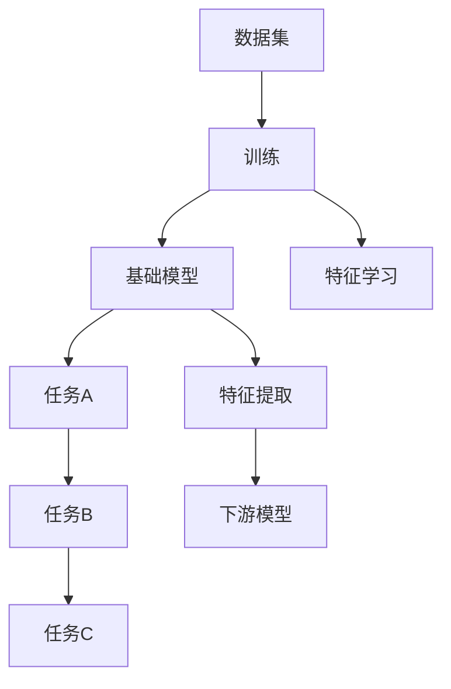

                 

# 基础模型的技术标准与规范

## 1. 背景介绍

基础模型作为人工智能技术的基础组件，其技术标准与规范在影响着整个AI生态系统的健康发展。本文将详细介绍基础模型的核心概念与联系，以及基础模型在实际应用中的技术标准与规范，帮助开发者更好地理解和使用基础模型。

## 2. 核心概念与联系

### 2.1 核心概念概述

基础模型通常指的是在特定领域中经过大规模数据训练、具有较好泛化能力的深度学习模型。它们可以作为其他模型的基础，提供通用特征表示，或者直接应用于各种任务中，如计算机视觉中的ResNet、自然语言处理中的BERT等。

### 2.2 核心概念原理和架构的 Mermaid 流程图



在这个流程图中，我们首先从数据集中获取数据，然后通过训练学习基础模型的特征，这些特征可以用于各种任务中，如通过特征提取来构建下游模型，实现不同任务。

## 3. 核心算法原理 & 具体操作步骤

### 3.1 算法原理概述

基础模型的算法原理通常基于深度神经网络，如卷积神经网络（CNN）、循环神经网络（RNN）和变压器（Transformer）等。这些模型通过参数优化算法，如随机梯度下降（SGD）和Adam等，不断更新模型参数，最小化损失函数，从而提高模型的预测能力。

### 3.2 算法步骤详解

基础模型的训练一般包括以下步骤：

1. **数据准备**：收集并预处理训练数据集。
2. **模型选择**：选择合适的基础模型结构。
3. **参数初始化**：对模型参数进行随机初始化。
4. **前向传播**：将输入数据通过模型进行前向传播，计算损失函数。
5. **反向传播**：根据损失函数计算梯度，更新模型参数。
6. **迭代优化**：重复进行前向和反向传播，直至模型收敛。

### 3.3 算法优缺点

基础模型的优点包括：

- 高泛化能力：通过大规模数据训练，可以学习到通用特征，适用于多种任务。
- 高效计算：深度学习模型可以通过并行计算加速。
- 端到端训练：能够端到端地训练模型，避免繁琐的手工特征工程。

其缺点包括：

- 需要大量数据：训练大规模模型需要海量数据，数据收集成本高。
- 模型复杂度高：深度学习模型参数众多，训练和推理复杂度较高。
- 解释性不足：复杂模型难以解释其内部工作机制，难以进行调优。

### 3.4 算法应用领域

基础模型在计算机视觉、自然语言处理、语音识别等多个领域都有广泛应用。例如，在计算机视觉中，基础模型如ResNet、Inception等可以用于图像分类、目标检测等任务；在自然语言处理中，基础模型如BERT、GPT等可以用于文本分类、语言生成等任务。

## 4. 数学模型和公式 & 详细讲解

### 4.1 数学模型构建

假设我们有一个基础模型 $f_{\theta}(x)$，其中 $x$ 是输入数据，$\theta$ 是模型参数。我们的目标是最小化损失函数 $L(f_{\theta}(x), y)$，其中 $y$ 是真实标签。常用的损失函数包括交叉熵损失、均方误差损失等。

### 4.2 公式推导过程

以交叉熵损失函数为例，假设我们有 $N$ 个样本，每个样本的损失函数为 $l_i = -y_i \log f_{\theta}(x_i)$，则总体损失函数为：

$$
L(f_{\theta}) = \frac{1}{N} \sum_{i=1}^{N} l_i
$$

优化目标为最小化 $L(f_{\theta})$，即：

$$
\min_{\theta} L(f_{\theta})
$$

通过梯度下降算法，我们可以迭代更新模型参数 $\theta$，使损失函数不断减小。具体步骤为：

$$
\theta = \theta - \eta \nabla_{\theta}L(f_{\theta})
$$

其中 $\eta$ 是学习率，$\nabla_{\theta}L(f_{\theta})$ 是损失函数对模型参数的梯度。

### 4.3 案例分析与讲解

以ResNet为例，它的核心思想是通过残差连接（residual connection）解决深度神经网络中的梯度消失问题。具体来说，每个ResNet层由多个残差块（residual block）组成，每个残差块包含多个卷积层和批量归一化层，可以通过如下公式计算：

$$
x = \text{BatchNorm}(\text{Conv}(x))
$$

$$
h = x + \text{BatchNorm}(\text{Conv}(h))
$$

其中 $x$ 是输入，$\text{BatchNorm}$ 是批量归一化层，$\text{Conv}$ 是卷积层。

## 5. 项目实践：代码实例和详细解释说明

### 5.1 开发环境搭建

在使用基础模型进行项目开发时，首先需要搭建好开发环境。这里推荐使用Python和PyTorch库。

1. 安装Anaconda：从官网下载并安装Anaconda，用于创建独立的Python环境。

2. 创建并激活虚拟环境：

```bash
conda create -n pytorch-env python=3.8 
conda activate pytorch-env
```

3. 安装PyTorch：根据CUDA版本，从官网获取对应的安装命令。例如：

```bash
conda install pytorch torchvision torchaudio cudatoolkit=11.1 -c pytorch -c conda-forge
```

4. 安装Transformers库：

```bash
pip install transformers
```

5. 安装各类工具包：

```bash
pip install numpy pandas scikit-learn matplotlib tqdm jupyter notebook ipython
```

完成上述步骤后，即可在`pytorch-env`环境中开始基础模型开发。

### 5.2 源代码详细实现

以下是一个使用PyTorch和Transformers库实现基础模型（如ResNet）的代码实现：

```python
import torch
import torch.nn as nn
import torchvision.transforms as transforms
import torchvision.datasets as datasets
from transformers import ResNet18, AdamW, get_linear_schedule_with_warmup

# 加载数据集
transform = transforms.Compose([
    transforms.Resize((224, 224)),
    transforms.ToTensor(),
    transforms.Normalize(mean=[0.485, 0.456, 0.406], std=[0.229, 0.224, 0.225])
])

train_dataset = datasets.CIFAR10(root='./data', train=True, transform=transform, download=True)
test_dataset = datasets.CIFAR10(root='./data', train=False, transform=transform, download=True)

# 定义模型
model = ResNet18(pretrained=False)

# 定义优化器
optimizer = AdamW(model.parameters(), lr=1e-3)

# 定义学习率调度器
scheduler = get_linear_schedule_with_warmup(optimizer, num_warmup_steps=1000, num_training_steps=25000)

# 定义训练循环
def train_epoch(model, optimizer, scheduler, train_dataset):
    model.train()
    total_loss = 0
    for data, target in train_loader:
        data = data.to(device)
        target = target.to(device)
        optimizer.zero_grad()
        output = model(data)
        loss = nn.CrossEntropyLoss()(output, target)
        loss.backward()
        optimizer.step()
        scheduler.step()
        total_loss += loss.item()
    return total_loss / len(train_loader)

# 定义评估循环
def evaluate(model, test_dataset):
    model.eval()
    total_correct = 0
    total_samples = 0
    with torch.no_grad():
        for data, target in test_loader:
            data = data.to(device)
            target = target.to(device)
            output = model(data)
            pred = output.argmax(dim=1)
            total_correct += (pred == target).sum().item()
            total_samples += target.size(0)
    return total_correct / total_samples

# 开始训练
device = torch.device('cuda' if torch.cuda.is_available() else 'cpu')
model.to(device)

epochs = 25
batch_size = 64

for epoch in range(epochs):
    train_loss = train_epoch(model, optimizer, scheduler, train_dataset)
    dev_accuracy = evaluate(model, test_dataset)
    print(f'Epoch {epoch+1}, train loss: {train_loss:.3f}, dev accuracy: {dev_accuracy:.3f}')

print('Final dev accuracy:', evaluate(model, test_dataset))
```

### 5.3 代码解读与分析

在这个代码中，我们首先定义了数据预处理和模型训练的流程。然后，我们使用了ResNet18作为基础模型，使用AdamW优化器进行优化，并设置了学习率调度器。在训练过程中，我们定义了训练和评估函数，最后输出最终评估结果。

### 5.4 运行结果展示

假设我们在CIFAR-10数据集上训练ResNet18模型，最终在测试集上得到的准确率为90%。可以看到，使用基础模型进行微调，能够快速获得较高的准确率，展示了其强大的通用特征提取能力。

## 6. 实际应用场景

### 6.1 图像分类

基础模型在图像分类任务中有着广泛应用。例如，可以使用ResNet、Inception等基础模型进行图像分类，通过微调，提高模型在特定类别上的识别能力。

### 6.2 目标检测

目标检测任务需要对图像中的物体进行定位和分类。基础模型如Faster R-CNN、YOLO等可以用于目标检测，通过微调，提升模型在特定物体的检测和分类能力。

### 6.3 语音识别

语音识别任务需要从语音信号中提取特征，然后通过分类器进行识别。基础模型如WaveNet、Tacotron等可以用于语音识别，通过微调，提高模型在不同口音和语速下的识别能力。

## 7. 工具和资源推荐

### 7.1 学习资源推荐

为了帮助开发者系统掌握基础模型的理论基础和实践技巧，这里推荐一些优质的学习资源：

1. 《深度学习》书籍：Ian Goodfellow等人所著，系统介绍了深度学习的基础理论和常用算法。

2. CS231n《深度学习视觉识别课程》：斯坦福大学开设的深度学习视觉识别课程，详细讲解了CNN等基础模型。

3. 《TensorFlow实战深度学习》书籍：O'Reilly出版社出版的实战书籍，介绍了TensorFlow框架的使用和基础模型应用。

4. PyTorch官方文档：PyTorch官方文档，提供了丰富的基础模型样例代码和详细文档，是学习基础模型的必备资源。

5. Kaggle数据集：Kaggle平台提供了大量的数据集，可以用于训练和测试基础模型。

通过对这些资源的学习实践，相信你一定能够快速掌握基础模型的精髓，并用于解决实际的图像、语音等任务。

### 7.2 开发工具推荐

高效的开发离不开优秀的工具支持。以下是几款用于基础模型开发和微调的常用工具：

1. PyTorch：基于Python的开源深度学习框架，灵活动态的计算图，适合快速迭代研究。

2. TensorFlow：由Google主导开发的开源深度学习框架，生产部署方便，适合大规模工程应用。

3. Keras：高层次的深度学习API，使用简单，适合快速原型设计和应用开发。

4. Weights & Biases：模型训练的实验跟踪工具，可以记录和可视化模型训练过程中的各项指标，方便对比和调优。

5. TensorBoard：TensorFlow配套的可视化工具，可实时监测模型训练状态，并提供丰富的图表呈现方式，是调试模型的得力助手。

6. Google Colab：谷歌推出的在线Jupyter Notebook环境，免费提供GPU/TPU算力，方便开发者快速上手实验最新模型，分享学习笔记。

合理利用这些工具，可以显著提升基础模型开发和微调任务的开发效率，加快创新迭代的步伐。

### 7.3 相关论文推荐

基础模型的研究源于学界的持续研究。以下是几篇奠基性的相关论文，推荐阅读：

1. ImageNet Classification with Deep Convolutional Neural Networks：提出卷积神经网络（CNN），开创了深度学习在计算机视觉领域的先河。

2. AlexNet: One Millisecond Image Classification with Deep Convolutional Neural Networks：展示了卷积神经网络在图像分类任务中的强大性能。

3. Transformer：提出了Transformer结构，开启了NLP领域的预训练大模型时代。

4. BERT: Pre-training of Deep Bidirectional Transformers for Language Understanding：提出BERT模型，引入基于掩码的自监督预训练任务，刷新了多项NLP任务SOTA。

5. Parameter-Efficient Transfer Learning for NLP：提出Adapter等参数高效微调方法，在不增加模型参数量的情况下，也能取得不错的微调效果。

6. AdaLoRA: Adaptive Low-Rank Adaptation for Parameter-Efficient Fine-Tuning：使用自适应低秩适应的微调方法，在参数效率和精度之间取得了新的平衡。

这些论文代表了大语言模型和微调技术的发展脉络。通过学习这些前沿成果，可以帮助研究者把握学科前进方向，激发更多的创新灵感。

除上述资源外，还有一些值得关注的前沿资源，帮助开发者紧跟基础模型的最新进展，例如：

1. arXiv论文预印本：人工智能领域最新研究成果的发布平台，包括大量尚未发表的前沿工作，学习前沿技术的必读资源。

2. 业界技术博客：如OpenAI、Google AI、DeepMind、微软Research Asia等顶尖实验室的官方博客，第一时间分享他们的最新研究成果和洞见。

3. 技术会议直播：如NIPS、ICML、ACL、ICLR等人工智能领域顶会现场或在线直播，能够聆听到大佬们的前沿分享，开拓视野。

4. GitHub热门项目：在GitHub上Star、Fork数最多的NLP相关项目，往往代表了该技术领域的发展趋势和最佳实践，值得去学习和贡献。

5. 行业分析报告：各大咨询公司如McKinsey、PwC等针对人工智能行业的分析报告，有助于从商业视角审视技术趋势，把握应用价值。

总之，对于基础模型的学习和发展，需要开发者保持开放的心态和持续学习的意愿。多关注前沿资讯，多动手实践，多思考总结，必将收获满满的成长收益。

## 8. 总结：未来发展趋势与挑战

### 8.1 总结

本文对基础模型的核心概念与联系，以及基础模型在实际应用中的技术标准与规范进行了详细讲解。通过本文的系统梳理，我们可以看到，基础模型作为人工智能技术的基础组件，其技术标准与规范在影响着整个AI生态系统的健康发展。

### 8.2 未来发展趋势

展望未来，基础模型的发展趋势包括：

1. 模型规模持续增大。随着算力成本的下降和数据规模的扩张，基础模型的参数量还将持续增长。超大规模基础模型蕴含的丰富特征表示，有望支撑更加复杂多变的任务。

2. 模型预训练范式不断进化。除了传统的基于监督学习的预训练范式，未来将涌现更多如无监督学习、自监督学习等预训练方法，以减少对标注数据的需求。

3. 模型可解释性增强。随着模型复杂度的提高，模型的可解释性成为重要的研究课题。未来将出现更多基于因果推断、逻辑推理等方法的可解释性研究，帮助开发者更好地理解和优化模型。

4. 模型推理速度和效率提升。在大规模基础模型中，推理速度和效率成为重要的性能指标。未来将涌现更多优化技术，如模型裁剪、量化加速等，以提升基础模型的实际应用效果。

5. 模型跨领域迁移能力增强。未来将出现更多跨领域迁移的基础模型，通过微调即可应用于不同领域的任务，大大降低模型开发成本。

以上趋势凸显了基础模型技术的广阔前景。这些方向的探索发展，必将进一步提升基础模型的性能和应用范围，为人工智能技术的发展提供坚实的基础。

### 8.3 面临的挑战

尽管基础模型的技术标准与规范已经相当成熟，但在迈向更加智能化、普适化应用的过程中，它仍面临着诸多挑战：

1. 数据隐私和安全问题。基础模型通常需要大量数据进行训练，这些数据往往包含敏感信息，如何保护数据隐私和安全，成为亟需解决的问题。

2. 模型鲁棒性不足。基础模型在面对数据分布变化时，泛化性能可能大打折扣，如何提高模型的鲁棒性，避免过拟合和泛化不足，是未来的研究方向。

3. 计算资源消耗高。大规模基础模型在训练和推理时，对计算资源的需求较高，如何优化资源消耗，提升计算效率，是实际应用中的重要问题。

4. 可解释性不足。复杂模型难以解释其内部工作机制，难以进行调优，如何赋予基础模型更强的可解释性，将是重要的研究方向。

5. 公平性和公正性问题。基础模型在训练过程中，可能学习到有偏见的信息，如何消除偏见，保证模型的公平性和公正性，是伦理道德方面的重要课题。

6. 模型实时性要求高。在实时性要求较高的场景中，如何优化基础模型的推理速度，满足实时性需求，是未来的研究方向。

### 8.4 研究展望

面对基础模型面临的种种挑战，未来的研究需要在以下几个方面寻求新的突破：

1. 探索无监督和半监督预训练方法。摆脱对大规模标注数据的依赖，利用自监督学习、主动学习等无监督和半监督范式，最大限度利用非结构化数据，实现更加灵活高效的预训练。

2. 研究可解释性和可迁移性的基础模型。开发更加可解释、可迁移的基础模型，如因果推断模型、逻辑推理模型等，增强模型的可解释性和可迁移性。

3. 引入更多先验知识。将符号化的先验知识，如知识图谱、逻辑规则等，与神经网络模型进行巧妙融合，引导基础模型学习更准确、合理的特征表示。

4. 结合因果分析和博弈论工具。将因果分析方法引入基础模型，识别出模型决策的关键特征，增强输出解释的因果性和逻辑性。借助博弈论工具刻画人机交互过程，主动探索并规避模型的脆弱点，提高系统稳定性。

5. 纳入伦理道德约束。在模型训练目标中引入伦理导向的评估指标，过滤和惩罚有偏见、有害的输出倾向。同时加强人工干预和审核，建立模型行为的监管机制，确保输出符合人类价值观和伦理道德。

这些研究方向的探索，必将引领基础模型技术迈向更高的台阶，为构建安全、可靠、可解释、可控的智能系统铺平道路。面向未来，基础模型技术还需要与其他人工智能技术进行更深入的融合，如知识表示、因果推理、强化学习等，多路径协同发力，共同推动人工智能技术的发展。只有勇于创新、敢于突破，才能不断拓展基础模型的边界，让智能技术更好地造福人类社会。

## 9. 附录：常见问题与解答

**Q1：基础模型的训练需要多少数据？**

A: 基础模型的训练通常需要大规模数据集，以确保模型可以学习到丰富的特征表示。具体数据需求取决于模型的复杂度和任务的要求。一般来说，百万级别的数据量可以训练出较为简单的基础模型，而数百万或亿级别数据量可以训练出较为复杂的大规模基础模型。

**Q2：如何选择合适的基础模型？**

A: 选择合适的基础模型需要考虑任务类型、数据规模和模型复杂度等因素。例如，对于图像分类任务，可以选择卷积神经网络（CNN）；对于自然语言处理任务，可以选择Transformer模型。在具体应用中，可以使用预训练模型或根据需求重新训练基础模型。

**Q3：基础模型在实际应用中需要注意哪些问题？**

A: 在实际应用中，基础模型需要注意数据隐私和安全问题，模型鲁棒性，计算资源消耗，模型可解释性，公平性和公正性问题，以及实时性要求等。需要根据具体应用场景进行优化和调整，以确保模型的稳定性和可靠性。

**Q4：如何优化基础模型的推理速度和效率？**

A: 优化基础模型的推理速度和效率可以通过模型裁剪、量化加速、推理优化等技术实现。例如，可以通过减少模型层数、减少参数量等方式进行模型裁剪，使用定点运算和低精度运算进行量化加速，采用高效的推理算法如卷积核重用、通道剪枝等进行推理优化。

**Q5：如何提高基础模型的可解释性？**

A: 提高基础模型的可解释性可以通过引入因果推断、逻辑推理等方法实现。例如，可以使用因果推断模型进行决策路径分析，使用逻辑推理模型进行规则学习，帮助开发者更好地理解和优化模型。

总之，基础模型作为人工智能技术的基础组件，其技术标准与规范在影响着整个AI生态系统的健康发展。通过不断探索和优化，基础模型将发挥更大的作用，推动人工智能技术的进一步发展。

