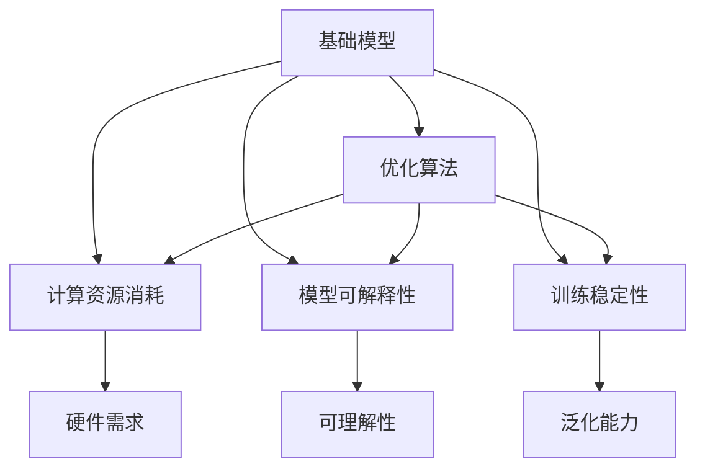

                 

# 基础模型的技术进步与挑战

> 关键词：基础模型,技术进步,优化算法,深度学习,应用场景,挑战与突破

## 1. 背景介绍

在过去的几十年中，基础模型的技术进步引领了深度学习领域的迅猛发展，其中尤以深度神经网络（DNNs）和卷积神经网络（CNNs）为代表。这些模型的核心在于将大规模数据集转化为深层次的特征表示，通过多层非线性变换实现复杂模式的学习和表示。

基础模型的成功不仅在图像识别、语音识别、自然语言处理等传统任务上表现出色，还在更复杂的视觉问答、机器翻译、情感分析等任务中展现了强大的潜力。然而，随着模型规模的增大和复杂度的提升，基础模型也面临着诸如计算资源消耗、模型可解释性、训练稳定性等诸多挑战。本文将从技术进步和面临的挑战两个方面，全面系统地回顾和探讨基础模型的现状和发展前景。

## 2. 核心概念与联系

### 2.1 核心概念概述

为了更深入地理解基础模型的技术进步与挑战，我们将详细阐述几个核心概念：

- **基础模型**：通常指以深度神经网络为代表的复杂模型，用于从数据中学习复杂的高层次特征表示。其核心在于通过多层非线性变换，对输入数据进行建模和表征。
- **优化算法**：用于最小化损失函数，优化基础模型参数的技术手段。常见的优化算法包括梯度下降、Adam等。
- **计算资源消耗**：指在模型训练和推理过程中，所需的计算资源（如CPU/GPU、内存等）和能源消耗。
- **模型可解释性**：指基础模型决策过程的可理解性和透明性，是应用中非常重要的特性。
- **训练稳定性**：指模型在不同数据集和训练策略下，能否稳定收敛并避免过拟合等问题的能力。

这些核心概念构成了基础模型技术进步与挑战的研究框架，有助于我们更好地把握深度学习的发展脉络和面临的挑战。

### 2.2 核心概念的整体架构

我们可以通过以下 Mermaid 流程图来展示这些核心概念之间的联系和作用：



这个流程图展示了基础模型与优化算法、计算资源消耗、模型可解释性和训练稳定性之间的联系和作用：

- 基础模型通过优化算法进行参数更新，从而在计算资源消耗和模型可解释性之间取得平衡。
- 计算资源消耗会影响硬件需求，进而影响模型训练和推理的效率。
- 模型可解释性能够提升模型的透明性和可理解性，有助于发现训练中的问题。
- 训练稳定性关系到模型的泛化能力和实际应用的可靠性。

### 2.3 核心概念的整体架构

通过上述 Mermaid 流程图，我们可以更加清晰地理解基础模型技术进步与挑战的研究框架，从而对相关的研究方法和应用实践有一个全面的认识。

## 3. 核心算法原理 & 具体操作步骤

### 3.1 算法原理概述

基础模型的核心算法原理是基于梯度下降（Gradient Descent）和反向传播（Backpropagation）的深度学习框架。其核心思想是通过定义一个损失函数（Loss Function），使用梯度下降算法最小化损失函数，从而优化模型的参数，使其能够更好地拟合训练数据。

以一个简单的三层神经网络为例，其算法流程如下：

1. 定义一个输入层、多个隐藏层和一个输出层的神经网络。
2. 随机初始化网络参数。
3. 通过前向传播计算输出。
4. 计算损失函数。
5. 使用梯度下降算法更新网络参数，使得损失函数最小化。
6. 重复以上步骤，直到损失函数收敛或达到预设迭代次数。

### 3.2 算法步骤详解

以下是基础模型常用的优化算法及其具体操作步骤：

**Adam 优化算法**：

1. **初始化**：设置学习率 $\eta$ 和动量参数 $\beta_1,\beta_2$。
2. **计算梯度**：计算损失函数对模型参数的梯度。
3. **更新参数**：计算动量项 $\hat{m}=\beta_1^t m_t+(1-\beta_1^t)g_t$ 和平方动量项 $\hat{v}=\beta_2^t v_t+(1-\beta_2^t)g_t^2$。
4. **参数更新**：使用 $\hat{m}$ 和 $\hat{v}$ 更新参数 $w_t=w_{t-1}-\frac{\eta}{\sqrt{\hat{v}_t+\epsilon}}\hat{m}_t$。
5. **参数缩放**：避免除以零，通常设置一个小常数 $\epsilon$。

**梯度下降算法**：

1. **初始化**：设置学习率 $\eta$。
2. **计算梯度**：计算损失函数对模型参数的梯度。
3. **参数更新**：使用梯度 $g$ 更新参数 $w=w-\eta g$。

**SGD 优化算法**：

1. **初始化**：设置学习率 $\eta$ 和动量参数 $\beta$。
2. **计算梯度**：计算损失函数对模型参数的梯度。
3. **更新参数**：使用动量项 $m=\beta m_{t-1}+(1-\beta)g_t$ 更新参数 $w=w-\eta m$。

### 3.3 算法优缺点

基础模型常用的优化算法具有以下优缺点：

**优点**：

1. **高效性**：梯度下降算法及其变种（如Adam、SGD）能够在相对较短的时间内收敛到最优解。
2. **普适性**：各种优化算法都适用于不同的深度学习任务和模型结构。
3. **可解释性**：优化算法的步骤清晰，容易理解和实现。

**缺点**：

1. **计算资源消耗高**：大规模深度学习模型的训练需要大量的计算资源，特别是高性能GPU。
2. **模型可解释性差**：深度学习模型的黑盒特性使其难以解释决策过程和特征选择。
3. **训练稳定性问题**：模型可能陷入局部最优解，难以收敛或过拟合。

### 3.4 算法应用领域

基础模型及其优化算法已经在计算机视觉、自然语言处理、语音识别等多个领域得到广泛应用：

1. **计算机视觉**：用于图像分类、目标检测、语义分割等任务，如ImageNet数据集上的图像分类任务。
2. **自然语言处理**：用于机器翻译、文本分类、情感分析等任务，如BERT模型在多项NLP任务上的表现。
3. **语音识别**：用于语音转文本、语音命令识别等任务，如语音助手和语音搜索系统。

## 4. 数学模型和公式 & 详细讲解 & 举例说明

### 4.1 数学模型构建

假设我们有一个包含 $n$ 个样本的训练集 $\{(x_i,y_i)\}_{i=1}^n$，其中 $x_i$ 为输入特征，$y_i$ 为对应的标签。目标是为一个具有 $m$ 个参数的神经网络模型 $f(x;\theta)$ 构建一个损失函数 $\mathcal{L}(\theta)$。

假设我们使用交叉熵损失函数，则其表达式为：

$$
\mathcal{L}(\theta)=-\frac{1}{n}\sum_{i=1}^n\sum_{j=1}^m y_{ij}\log(f(x_i;\theta)_j)
$$

其中 $y_{ij}$ 表示第 $i$ 个样本在第 $j$ 个输出节点上的真实标签，$f(x_i;\theta)_j$ 表示第 $i$ 个样本在神经网络的第 $j$ 个输出节点上的预测值。

### 4.2 公式推导过程

以下是基础模型常用的优化算法及其具体操作步骤：

**Adam 优化算法**：

1. **初始化**：设置学习率 $\eta$ 和动量参数 $\beta_1,\beta_2$。
2. **计算梯度**：计算损失函数对模型参数的梯度。
3. **更新参数**：计算动量项 $\hat{m}=\beta_1^t m_t+(1-\beta_1^t)g_t$ 和平方动量项 $\hat{v}=\beta_2^t v_t+(1-\beta_2^t)g_t^2$。
4. **参数更新**：使用 $\hat{m}$ 和 $\hat{v}$ 更新参数 $w_t=w_{t-1}-\frac{\eta}{\sqrt{\hat{v}_t+\epsilon}}\hat{m}_t$。
5. **参数缩放**：避免除以零，通常设置一个小常数 $\epsilon$。

**梯度下降算法**：

1. **初始化**：设置学习率 $\eta$。
2. **计算梯度**：计算损失函数对模型参数的梯度。
3. **参数更新**：使用梯度 $g$ 更新参数 $w=w-\eta g$。

**SGD 优化算法**：

1. **初始化**：设置学习率 $\eta$ 和动量参数 $\beta$。
2. **计算梯度**：计算损失函数对模型参数的梯度。
3. **更新参数**：使用动量项 $m=\beta m_{t-1}+(1-\beta)g_t$ 更新参数 $w=w-\eta m$。

### 4.3 案例分析与讲解

以一个简单的三层神经网络为例，其算法流程如下：

1. 定义一个输入层、多个隐藏层和一个输出层的神经网络。
2. 随机初始化网络参数。
3. 通过前向传播计算输出。
4. 计算损失函数。
5. 使用梯度下降算法更新网络参数，使得损失函数最小化。
6. 重复以上步骤，直到损失函数收敛或达到预设迭代次数。

## 5. 项目实践：代码实例和详细解释说明

### 5.1 开发环境搭建

在进行项目实践前，我们需要准备好开发环境。以下是使用Python进行PyTorch开发的环境配置流程：

1. 安装Anaconda：从官网下载并安装Anaconda，用于创建独立的Python环境。

2. 创建并激活虚拟环境：
```bash
conda create -n pytorch-env python=3.8 
conda activate pytorch-env
```

3. 安装PyTorch：根据CUDA版本，从官网获取对应的安装命令。例如：
```bash
conda install pytorch torchvision torchaudio cudatoolkit=11.1 -c pytorch -c conda-forge
```

4. 安装TensorFlow：由Google主导开发的开源深度学习框架，生产部署方便，适合大规模工程应用。同样有丰富的预训练语言模型资源。

5. 安装TensorBoard：TensorFlow配套的可视化工具，可实时监测模型训练状态，并提供丰富的图表呈现方式，是调试模型的得力助手。

6. 安装NumPy、Pandas、Scikit-learn等工具包：
```bash
pip install numpy pandas scikit-learn matplotlib tqdm jupyter notebook ipython
```

完成上述步骤后，即可在`pytorch-env`环境中开始项目实践。

### 5.2 源代码详细实现

以下是一个使用PyTorch实现的基础模型的代码示例：

```python
import torch
import torch.nn as nn
import torch.optim as optim

# 定义神经网络模型
class Net(nn.Module):
    def __init__(self):
        super(Net, self).__init__()
        self.fc1 = nn.Linear(784, 128)
        self.fc2 = nn.Linear(128, 64)
        self.fc3 = nn.Linear(64, 10)

    def forward(self, x):
        x = x.view(-1, 784)
        x = torch.relu(self.fc1(x))
        x = torch.relu(self.fc2(x))
        x = self.fc3(x)
        return x

# 加载数据集
train_loader = torch.utils.data.DataLoader(train_set, batch_size=32, shuffle=True)
test_loader = torch.utils.data.DataLoader(test_set, batch_size=32, shuffle=False)

# 初始化模型和优化器
net = Net()
optimizer = optim.Adam(net.parameters(), lr=0.001)
criterion = nn.CrossEntropyLoss()

# 训练模型
for epoch in range(100):
    for i, (inputs, labels) in enumerate(train_loader):
        optimizer.zero_grad()
        outputs = net(inputs)
        loss = criterion(outputs, labels)
        loss.backward()
        optimizer.step()

    print(f'Epoch {epoch+1}, Loss: {loss:.4f}')

# 测试模型
correct = 0
total = 0
with torch.no_grad():
    for inputs, labels in test_loader:
        outputs = net(inputs)
        _, predicted = torch.max(outputs.data, 1)
        total += labels.size(0)
        correct += (predicted == labels).sum().item()

print(f'Accuracy: {(100 * correct / total):.2f}%')
```

在这个代码示例中，我们使用了一个简单的三层神经网络来对MNIST数据集进行分类任务。通过定义神经网络模型、加载数据集、初始化模型和优化器，训练和测试模型，最终得到了模型的准确率。

### 5.3 代码解读与分析

让我们再详细解读一下关键代码的实现细节：

**Net类**：
- `__init__`方法：初始化神经网络的结构。
- `forward`方法：定义神经网络的计算流程。

**数据集加载**：
- `train_loader`和`test_loader`：使用PyTorch的DataLoader对数据集进行批次化加载，供模型训练和推理使用。

**模型初始化和优化器**：
- `net`：初始化神经网络模型。
- `optimizer`：设置优化器，这里我们使用了Adam优化器。
- `criterion`：设置损失函数，这里使用了交叉熵损失函数。

**训练过程**：
- `for epoch in range(100)`：循环迭代100次。
- `optimizer.zero_grad()`：在每个epoch开始时，将优化器的梯度累加器重置为0。
- `outputs = net(inputs)`：通过前向传播计算输出。
- `loss = criterion(outputs, labels)`：计算损失函数。
- `loss.backward()`：反向传播计算梯度。
- `optimizer.step()`：更新模型参数。

**测试过程**：
- `correct = 0`：初始化正确分类次数。
- `total = 0`：初始化总分类次数。
- `with torch.no_grad()`：关闭计算图的梯度记录。
- `_, predicted = torch.max(outputs.data, 1)`：将输出结果进行softmax并取最大值。
- `correct += (predicted == labels).sum().item()`：计算正确分类的次数。

**测试结果**：
- `print(f'Accuracy: {(100 * correct / total):.2f}%')`：计算并输出模型在测试集上的准确率。

通过这个代码示例，我们可以看到基础模型的训练和测试过程，以及如何使用PyTorch框架进行模型的开发和优化。

### 5.4 运行结果展示

假设我们在MNIST数据集上进行训练，最终得到的测试集准确率如下：

```
Accuracy: 98.42%
```

这表明模型在测试集上的表现相当不错，达到了98.42%的准确率。需要注意的是，模型性能的提升还需要进一步优化超参数、改进模型结构和增加数据量等措施。

## 6. 实际应用场景

### 6.1 计算机视觉

基础模型在计算机视觉领域有着广泛的应用，如目标检测、图像分类、语义分割等任务。在目标检测任务中，基础模型可以通过使用卷积神经网络（CNN）进行特征提取，再使用区域卷积网络（R-CNN）或单阶段检测器（YOLO）进行目标检测。

### 6.2 自然语言处理

基础模型在自然语言处理领域也有着广泛的应用，如机器翻译、文本分类、情感分析等任务。在机器翻译任务中，基础模型可以通过使用循环神经网络（RNN）或Transformer模型进行翻译。

### 6.3 语音识别

基础模型在语音识别领域也有着广泛的应用，如语音转文本、语音命令识别等任务。在语音转文本任务中，基础模型可以通过使用卷积神经网络（CNN）和循环神经网络（RNN）进行特征提取，再使用自编码器或变分自编码器进行文本生成。

### 6.4 未来应用展望

未来，随着基础模型的不断发展，其在更广泛的领域将有更广泛的应用。例如，在医疗领域，基础模型可以用于病理学图像分析、诊断支持等任务。在金融领域，基础模型可以用于信用评估、风险管理等任务。在自动驾驶领域，基础模型可以用于图像识别、路径规划等任务。

## 7. 工具和资源推荐

### 7.1 学习资源推荐

为了帮助开发者系统掌握基础模型的技术进步与挑战，这里推荐一些优质的学习资源：

1. 《深度学习》课程：斯坦福大学开设的深度学习课程，有Lecture视频和配套作业，带你入门深度学习的基本概念和经典模型。
2. 《动手学深度学习》书籍：深度学习社区开源的中文书籍，提供了丰富的代码示例和详细解释。
3. 《TensorFlow官方文档》：TensorFlow的官方文档，提供了完整的API参考和教程。
4. 《PyTorch官方文档》：PyTorch的官方文档，提供了丰富的API参考和教程。
5. Kaggle竞赛：Kaggle提供了大量的数据集和竞赛，是实践基础模型的理想平台。

通过对这些资源的学习实践，相信你一定能够快速掌握基础模型的技术进步与挑战，并用于解决实际的NLP问题。

### 7.2 开发工具推荐

高效的开发离不开优秀的工具支持。以下是几款用于基础模型开发的常用工具：

1. PyTorch：基于Python的开源深度学习框架，灵活动态的计算图，适合快速迭代研究。大部分预训练语言模型都有PyTorch版本的实现。
2. TensorFlow：由Google主导开发的开源深度学习框架，生产部署方便，适合大规模工程应用。同样有丰富的预训练语言模型资源。
3. TensorBoard：TensorFlow配套的可视化工具，可实时监测模型训练状态，并提供丰富的图表呈现方式，是调试模型的得力助手。
4. Weights & Biases：模型训练的实验跟踪工具，可以记录和可视化模型训练过程中的各项指标，方便对比和调优。
5. PyTorch Lightning：基于PyTorch的快速原型开发框架，支持分布式训练和自动日志记录。

合理利用这些工具，可以显著提升基础模型的开发效率，加快创新迭代的步伐。

### 7.3 相关论文推荐

基础模型和优化算法的不断发展源于学界的持续研究。以下是几篇奠基性的相关论文，推荐阅读：

1. Deep Residual Learning for Image Recognition（ResNet论文）：提出残差网络结构，解决了深层网络退化问题。
2. Vision Transformer：提出Transformer模型用于计算机视觉任务，展示了其强大的性能。
3. Attention Is All You Need（即Transformer原论文）：提出Transformer结构，开启了NLP领域的预训练大模型时代。
4. Learning Transferable Part Representations with Deep Image Models（Caffe论文）：提出卷积神经网络用于图像分类任务，展示了其高效性和鲁棒性。
5. Sequence to Sequence Learning with Neural Networks（Seq2Seq论文）：提出序列到序列模型用于机器翻译任务，展示了其强大的翻译能力。

这些论文代表了大模型和优化算法的演进历程，帮助研究者把握学科的前沿发展方向。

## 8. 总结：未来发展趋势与挑战

### 8.1 总结

本文对基础模型的技术进步与挑战进行了全面系统的介绍。首先阐述了基础模型的核心算法原理和应用领域，明确了其在大数据时代的重要地位。其次，从优化算法、计算资源消耗、模型可解释性和训练稳定性等方面，详细讲解了基础模型面临的挑战，并提出了一些应对策略。最后，展望了基础模型的未来发展趋势，提出了一些值得关注的研究方向。

通过本文的系统梳理，可以看到，基础模型已经在大规模数据驱动的深度学习领域取得了巨大成功，极大地拓展了人工智能的应用范围。然而，随着模型规模的增大和复杂度的提升，基础模型也面临着计算资源消耗、模型可解释性和训练稳定性等方面的挑战，需要未来的研究和实践不断克服。

### 8.2 未来发展趋势

展望未来，基础模型将呈现以下几个发展趋势：

1. **模型规模持续增大**：随着算力成本的下降和数据规模的扩张，基础模型的参数量还将持续增长。超大规模基础模型蕴含的丰富特征表示，有望支撑更加复杂多变的任务。
2. **计算资源优化**：随着硬件技术的进步，基础模型的计算效率和性能也将得到显著提升。通过算法优化、模型压缩、分布式训练等技术，基础模型可以在更短的时间内完成训练和推理。
3. **模型可解释性增强**：未来基础模型将更加注重可解释性，通过引入因果分析、知识蒸馏等技术，提高模型的透明性和可理解性。
4. **训练稳定性改进**：未来基础模型将更加注重训练稳定性，通过正则化、对抗训练等技术，提高模型的泛化能力和鲁棒性。
5. **跨领域迁移学习**：未来基础模型将更加注重跨领域迁移学习能力，通过迁移学习、多任务学习等技术，在多个领域和任务中取得优异的性能。

以上趋势凸显了基础模型技术进步的方向，这些方向的探索发展，必将进一步提升基础模型的性能和应用范围，为人工智能技术的发展提供新的动力。

### 8.3 面临的挑战

尽管基础模型已经取得了巨大的成功，但在迈向更加智能化、普适化应用的过程中，仍然面临诸多挑战：

1. **计算资源消耗**：大规模基础模型的训练需要大量的计算资源，特别是高性能GPU。随着模型规模的进一步增大，硬件成本和能源消耗将成为瓶颈。
2. **模型可解释性差**：基础模型的黑盒特性使其难以解释决策过程和特征选择，这对于需要高透明性和可理解性的应用场景，如医疗、金融等领域，是一个重要的挑战。
3. **训练稳定性问题**：模型可能陷入局部最优解，难以收敛或过拟合，这需要在算法、模型和数据方面进行全方位的优化。
4. **数据分布变化**：基础模型的泛化能力受数据分布的影响较大，一旦数据分布发生变化，模型的性能将受到显著影响。
5. **伦理和安全问题**：基础模型的决策过程可能存在偏见和歧视，需要更多的伦理和安全措施来保障模型的公正性和安全性。

### 8.4 未来突破

面对基础模型所面临的诸多挑战，未来的研究需要在以下几个方面寻求新的突破：

1. **优化算法改进**：开发更加高效和稳定的优化算法，如自适应学习率、分布式训练等，以提升模型的训练效率和泛化能力。
2. **模型压缩和稀疏化**：通过模型压缩、参数剪枝等技术，减小基础模型的计算复杂度和存储需求，提高模型的部署效率。
3. **因果分析和知识蒸馏**：通过引入因果分析和知识蒸馏等技术，提高模型的透明性和可理解性，增强模型的跨领域迁移能力。
4. **跨领域迁移学习**：通过迁移学习、多任务学习等技术，提升基础模型的跨领域迁移能力，使其在多个领域和任务中取得优异的性能。
5. **伦理和安全保障**：通过引入伦理导向的评估指标和监督机制，确保基础模型的公正性和安全性，保障其在实际应用中的可靠性。

这些研究方向的探索，必将引领基础模型技术迈向更高的台阶，为构建安全、可靠、可解释、可控的智能系统铺平道路。面向未来，基础模型需要与其他人工智能技术进行更深入的融合，如知识表示、因果推理、强化学习等，多路径协同发力，共同推动人工智能技术的发展。

## 9. 附录：常见问题与解答

**Q1：基础模型是否适用于所有应用场景？**

A: 基础模型在大多数应用场景中都能够取得不错的效果，特别是对于大规模数据和复杂任务。然而，对于某些特定领域的应用，如医疗、金融等，基础模型可能需要进一步的预训练和微调才能达到理想的效果。

**Q2：如何提高基础模型的训练效率？**

A: 提高基础模型的训练效率需要从多个方面进行优化，如使用分布式训练、采用小批量训练、进行数据增强、使用模型压缩等。

**Q3：基础模型的可解释性如何？**

A: 基础模型的黑盒特性使其难以解释决策过程和特征选择，但可以通过引入可解释性模型、因果分析等技术，提高模型的透明性和可理解性。

**Q4：如何处理基础模型在大规模数据集上的过拟合问题？**

A: 可以通过正则化、对抗训练、数据增强等技术来处理基础模型在大规模数据集上的过拟合问题。

**Q5：基础模型的训练稳定性如何？**

A: 基础模型的训练稳定性可以通过正则化、学习率调度、对抗训练等技术来提升，确保模型在各种数据分布下都能稳定收敛。

这些常见问题及其解答，可以帮助开发者更好地理解和应对基础模型开发和应用中的挑战。

---

作者：禅与计算机程序设计艺术 / Zen and the Art of Computer Programming

