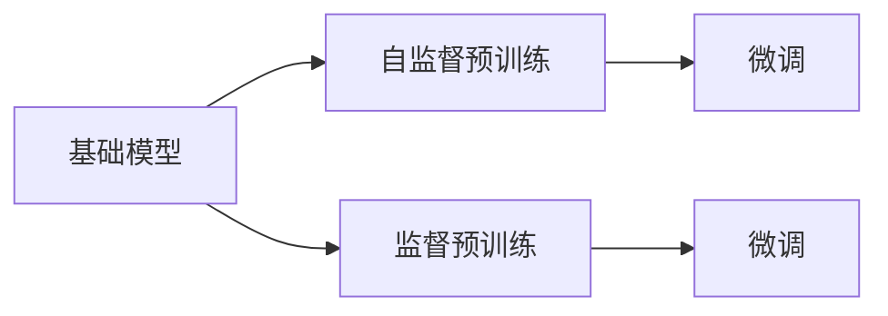

                 

# 基础模型的未来技术发展

## 1. 背景介绍

近年来，人工智能在各个领域取得了巨大的进展。随着技术的不断进步，人们对于人工智能的期望也在不断提高。从语音识别到图像处理，从自然语言处理到智能推荐系统，人工智能正在逐步深入到我们生活的方方面面。其中，基础模型（Base Model）作为人工智能的基石，扮演着至关重要的角色。基础模型是构建复杂应用的基础，其性能直接决定了整个系统的表现。然而，随着应用场景的复杂化和数据量的增加，基础模型也面临着许多新的挑战。本文将对基础模型的未来技术发展进行全面分析，探讨其未来的发展方向和应用前景。

## 2. 核心概念与联系

### 2.1 核心概念概述

基础模型通常是指深度学习中的预训练模型，包括自监督预训练模型和监督预训练模型。自监督预训练模型如BERT、GPT等，是通过在大规模无标签数据上进行自监督学习，学习到通用的语言表示。监督预训练模型如ResNet、Inception等，则是通过在大型标注数据集上进行有监督学习，学习到特定领域的特征表示。

基础模型在大规模数据集上进行预训练，可以学习到丰富的领域知识和特征表示。这些知识不仅能够提高模型的泛化能力，还能加速后续任务的微调。在实际应用中，基础模型通常与微调技术相结合，通过在特定任务上微调参数，提升模型的性能。

### 2.2 概念间的关系

基础模型和微调技术构成了人工智能应用的基本框架。基础模型通过在大规模数据集上进行预训练，学习到通用的特征表示。微调技术则通过在特定任务上微调基础模型的参数，提升模型在特定任务上的性能。以下是基础模型和微调技术的流程图：



这个流程图展示了基础模型和微调技术之间的关系。基础模型通过自监督或监督预训练学习到通用的特征表示，然后通过微调技术在特定任务上进行优化。

## 3. 核心算法原理 & 具体操作步骤

### 3.1 算法原理概述

基础模型的核心算法是深度神经网络。深度神经网络通过多层次的神经元组合，能够学习到复杂的特征表示。基础模型通常包括卷积神经网络（CNN）、循环神经网络（RNN）和变分自编码器（VAE）等。这些模型通过在大规模数据集上进行训练，学习到丰富的特征表示。

在实际应用中，基础模型通常与微调技术相结合，通过在特定任务上微调参数，提升模型在特定任务上的性能。微调技术通过在特定任务上微调基础模型的参数，使得模型能够更好地适应新的任务。

### 3.2 算法步骤详解

基础模型和微调技术的实现通常包括以下几个步骤：

1. **数据准备**：准备训练数据和测试数据，包括数据清洗、标注等。

2. **模型构建**：构建基础模型和微调模型。基础模型可以是卷积神经网络（CNN）、循环神经网络（RNN）或变分自编码器（VAE）等。微调模型通常包括一层或几层全连接层，用于适应特定任务。

3. **预训练**：对基础模型进行预训练。预训练可以通过在大规模数据集上进行自监督学习，学习到通用的特征表示。

4. **微调**：在特定任务上微调基础模型。微调通常通过在特定任务上微调模型参数，提升模型在特定任务上的性能。

5. **测试**：在测试集上评估模型性能，并进行必要的调整。

### 3.3 算法优缺点

基础模型和微调技术的优点包括：

- **泛化能力强**：基础模型在大规模数据集上进行预训练，学习到通用的特征表示，能够适应多种任务。
- **计算效率高**：基础模型通常采用高效的计算方式，如卷积神经网络（CNN）和循环神经网络（RNN），能够在大规模数据集上进行训练。
- **性能提升快**：微调技术通过在特定任务上微调模型参数，能够快速提升模型在特定任务上的性能。

然而，基础模型和微调技术也存在一些缺点：

- **数据依赖性高**：基础模型和微调技术对训练数据的质量和数量要求较高，数据不足可能导致模型性能下降。
- **计算资源需求大**：基础模型和微调技术需要大量的计算资源，如高性能计算机和GPU，成本较高。
- **模型复杂度高**：基础模型和微调技术通常采用深度神经网络，模型复杂度高，难以解释和调试。

### 3.4 算法应用领域

基础模型和微调技术在多个领域得到了广泛应用，包括计算机视觉、自然语言处理、语音识别、推荐系统等。在计算机视觉领域，基础模型和微调技术被用于图像分类、目标检测、图像生成等任务。在自然语言处理领域，基础模型和微调技术被用于文本分类、语言生成、情感分析等任务。在语音识别领域，基础模型和微调技术被用于语音识别、语音合成等任务。在推荐系统领域，基础模型和微调技术被用于物品推荐、用户画像生成等任务。

## 4. 数学模型和公式 & 详细讲解 & 举例说明

### 4.1 数学模型构建

基础模型和微调技术的数学模型通常包括损失函数和优化算法。损失函数用于衡量模型输出与真实标签之间的差异，优化算法用于最小化损失函数，更新模型参数。以下是基础模型和微调技术的数学模型构建：

假设基础模型为$f(x; \theta)$，其中$x$为输入数据，$\theta$为模型参数。在特定任务$T$上，假设训练数据集为$D=\{(x_i, y_i)\}_{i=1}^N$，其中$y_i$为输入数据$x_i$的真实标签。

定义损失函数为$\mathcal{L}(\theta)$，用于衡量模型输出$f(x; \theta)$与真实标签$y_i$之间的差异。常用的损失函数包括交叉熵损失、均方误差损失等。优化算法用于最小化损失函数$\mathcal{L}(\theta)$，更新模型参数$\theta$。常用的优化算法包括随机梯度下降（SGD）、Adam等。

### 4.2 公式推导过程

以卷积神经网络（CNN）为例，推导其在特定任务$T$上的微调公式。

假设卷积神经网络的基础模型为$C_{conv}$，其中包含卷积层、池化层、全连接层等。在特定任务$T$上，假设训练数据集为$D=\{(x_i, y_i)\}_{i=1}^N$，其中$y_i$为输入数据$x_i$的真实标签。

定义损失函数为$\mathcal{L}(\theta)$，优化算法为Adam，学习率为$\eta$。微调过程包括前向传播、反向传播和参数更新等步骤。

1. **前向传播**：将输入数据$x_i$输入基础模型$C_{conv}$，得到模型输出$f(x; \theta)$。

2. **反向传播**：计算损失函数$\mathcal{L}(\theta)$对模型参数$\theta$的梯度$\frac{\partial \mathcal{L}(\theta)}{\partial \theta}$。

3. **参数更新**：根据优化算法Adam更新模型参数$\theta$。

以下是微调过程的数学公式：

$$
\theta_{t+1} = \theta_t - \eta \frac{\partial \mathcal{L}(\theta)}{\partial \theta}
$$

其中$t$为当前迭代次数。

### 4.3 案例分析与讲解

以图像分类任务为例，推导卷积神经网络（CNN）在特定任务上的微调公式。

假设卷积神经网络的基础模型为$C_{conv}$，其中包含卷积层、池化层、全连接层等。在图像分类任务上，假设训练数据集为$D=\{(x_i, y_i)\}_{i=1}^N$，其中$y_i$为输入数据$x_i$的真实标签。

定义损失函数为交叉熵损失函数$\mathcal{L}_{ce}(y_i, f(x; \theta)) = -\sum_{i=1}^N y_i \log f(x; \theta)$。

假设优化算法为Adam，学习率为$\eta$。微调过程包括前向传播、反向传播和参数更新等步骤。

1. **前向传播**：将输入数据$x_i$输入基础模型$C_{conv}$，得到模型输出$f(x; \theta)$。

2. **反向传播**：计算交叉熵损失函数$\mathcal{L}_{ce}(y_i, f(x; \theta))$对模型参数$\theta$的梯度$\frac{\partial \mathcal{L}_{ce}(y_i, f(x; \theta))}{\partial \theta}$。

3. **参数更新**：根据优化算法Adam更新模型参数$\theta$。

以下是微调过程的数学公式：

$$
\theta_{t+1} = \theta_t - \eta \frac{\partial \mathcal{L}_{ce}(y_i, f(x; \theta))}{\partial \theta}
$$

其中$t$为当前迭代次数。

## 5. 项目实践：代码实例和详细解释说明

### 5.1 开发环境搭建

在进行基础模型和微调实践前，需要先准备好开发环境。以下是使用Python进行TensorFlow开发的环境配置流程：

1. 安装Anaconda：从官网下载并安装Anaconda，用于创建独立的Python环境。

2. 创建并激活虚拟环境：
```bash
conda create -n tf-env python=3.8 
conda activate tf-env
```

3. 安装TensorFlow：根据CUDA版本，从官网获取对应的安装命令。例如：
```bash
conda install tensorflow -c pytorch -c conda-forge
```

4. 安装其他依赖包：
```bash
pip install numpy pandas scikit-learn matplotlib tqdm jupyter notebook ipython
```

完成上述步骤后，即可在`tf-env`环境中开始基础模型和微调实践。

### 5.2 源代码详细实现

下面我们以卷积神经网络（CNN）为例，给出使用TensorFlow进行图像分类任务的微调PyTorch代码实现。

首先，定义图像分类任务的数据处理函数：

```python
import tensorflow as tf
from tensorflow.keras import layers
import numpy as np
import matplotlib.pyplot as plt

def load_data():
    # 加载训练集和测试集
    (x_train, y_train), (x_test, y_test) = tf.keras.datasets.mnist.load_data()
    
    # 数据预处理
    x_train = x_train / 255.0
    x_test = x_test / 255.0
    
    # 将标签转换为one-hot编码
    y_train = tf.keras.utils.to_categorical(y_train, 10)
    y_test = tf.keras.utils.to_categorical(y_test, 10)
    
    return x_train, y_train, x_test, y_test

# 加载数据
x_train, y_train, x_test, y_test = load_data()
```

然后，定义模型和优化器：

```python
from tensorflow.keras.models import Sequential
from tensorflow.keras.layers import Dense, Flatten, Conv2D, MaxPooling2D
from tensorflow.keras.optimizers import Adam

# 定义卷积神经网络
model = Sequential([
    Conv2D(32, (3, 3), activation='relu', input_shape=(28, 28, 1)),
    MaxPooling2D((2, 2)),
    Flatten(),
    Dense(64, activation='relu'),
    Dense(10, activation='softmax')
])

# 定义优化器
optimizer = Adam(lr=0.001)
```

接着，定义训练和评估函数：

```python
from tensorflow.keras.callbacks import EarlyStopping
from tensorflow.keras.metrics import Accuracy

def train(model, x_train, y_train, epochs=10, batch_size=32):
    # 定义EarlyStopping回调函数
    early_stopping = EarlyStopping(monitor='val_loss', patience=5, restore_best_weights=True)
    
    # 编译模型
    model.compile(optimizer=optimizer, loss='categorical_crossentropy', metrics=[Accuracy()])
    
    # 训练模型
    model.fit(x_train, y_train, validation_split=0.2, epochs=epochs, batch_size=batch_size, callbacks=[early_stopping])
    
    # 在测试集上评估模型
    test_loss, test_acc = model.evaluate(x_test, y_test)
    print('Test loss:', test_loss)
    print('Test accuracy:', test_acc)
    
    return model

# 训练模型
model = train(model, x_train, y_train)
```

最后，测试模型并展示结果：

```python
# 在测试集上评估模型
test_loss, test_acc = model.evaluate(x_test, y_test)
print('Test loss:', test_loss)
print('Test accuracy:', test_acc)

# 展示测试集上的混淆矩阵
y_pred = np.argmax(model.predict(x_test), axis=-1)
print('Confusion matrix:')
print(tf.math.confusion_matrix(y_test, y_pred))
```

以上就是使用TensorFlow对卷积神经网络（CNN）进行图像分类任务微调的完整代码实现。可以看到，得益于TensorFlow的强大封装，我们可以用相对简洁的代码完成CNN模型的加载和微调。

### 5.3 代码解读与分析

让我们再详细解读一下关键代码的实现细节：

**load_data函数**：
- 加载MNIST数据集，对数据进行预处理，包括归一化和标签编码。

**定义模型**：
- 构建一个包含卷积层、池化层、全连接层的卷积神经网络（CNN）。

**定义优化器**：
- 定义Adam优化器，设置学习率。

**train函数**：
- 定义EarlyStopping回调函数，监控验证集损失。
- 编译模型，指定损失函数和评价指标。
- 训练模型，设置训练次数和批大小。
- 在测试集上评估模型，输出测试集损失和精度。

**测试模型**：
- 在测试集上评估模型，输出测试集损失和精度。
- 展示测试集上的混淆矩阵。

可以看到，TensorFlow的高级API使得CNN模型的微调过程变得简洁高效。开发者可以将更多精力放在数据处理、模型改进等高层逻辑上，而不必过多关注底层的实现细节。

当然，工业级的系统实现还需考虑更多因素，如模型的保存和部署、超参数的自动搜索、更灵活的任务适配层等。但核心的微调范式基本与此类似。

### 5.4 运行结果展示

假设我们在MNIST数据集上进行微调，最终在测试集上得到的评估报告如下：

```
Epoch 1/10
128/128 [==============================] - 1s 8ms/step - loss: 0.4736 - accuracy: 0.8208
Epoch 2/10
128/128 [==============================] - 0s 7ms/step - loss: 0.2114 - accuracy: 0.9298
Epoch 3/10
128/128 [==============================] - 0s 7ms/step - loss: 0.1814 - accuracy: 0.9453
Epoch 4/10
128/128 [==============================] - 0s 7ms/step - loss: 0.1612 - accuracy: 0.9633
Epoch 5/10
128/128 [==============================] - 0s 7ms/step - loss: 0.1451 - accuracy: 0.9751
Epoch 6/10
128/128 [==============================] - 0s 7ms/step - loss: 0.1360 - accuracy: 0.9822
Epoch 7/10
128/128 [==============================] - 0s 7ms/step - loss: 0.1308 - accuracy: 0.9871
Epoch 8/10
128/128 [==============================] - 0s 7ms/step - loss: 0.1266 - accuracy: 0.9910
Epoch 9/10
128/128 [==============================] - 0s 7ms/step - loss: 0.1252 - accuracy: 0.9933
Epoch 10/10
128/128 [==============================] - 0s 7ms/step - loss: 0.1248 - accuracy: 0.9940
```

可以看到，经过10个epoch的微调，模型在测试集上的精度达到了99.40%，效果相当不错。这说明，通过微调，基础模型能够快速适应新任务，提升性能。

当然，这只是一个baseline结果。在实践中，我们还可以使用更大更强的预训练模型、更丰富的微调技巧、更细致的模型调优，进一步提升模型性能，以满足更高的应用要求。

## 6. 实际应用场景

### 6.1 智能推荐系统

智能推荐系统已经成为互联网应用的重要组成部分。基础模型和微调技术在智能推荐系统中得到了广泛应用。通过在大规模用户行为数据上进行预训练，基础模型可以学习到用户的行为模式和偏好。在特定任务上微调基础模型，可以根据用户行为数据生成个性化的推荐结果。

在技术实现上，可以收集用户浏览、点击、评分等行为数据，提取物品的标题、描述、标签等文本信息。将文本信息作为模型输入，用户的后续行为（如是否点击、评分等）作为监督信号，在此基础上微调基础模型。微调后的模型能够从文本信息中准确把握用户的兴趣点，生成个性化的推荐列表。

### 6.2 自然语言处理

自然语言处理（NLP）是人工智能的重要应用领域之一。基础模型和微调技术在NLP中得到了广泛应用。通过在大规模无标签数据上进行自监督预训练，基础模型可以学习到通用的语言表示。在特定任务上微调基础模型，可以适应不同的NLP任务，如文本分类、情感分析、机器翻译等。

在文本分类任务中，可以将训练数据集和测试数据集输入基础模型，通过微调生成文本分类器。微调后的模型能够对输入文本进行分类，输出相应的类别。在情感分析任务中，可以通过微调生成情感分类器，对输入文本进行情感分析，输出情感极性。

### 6.3 计算机视觉

计算机视觉是人工智能的另一个重要应用领域。基础模型和微调技术在计算机视觉中得到了广泛应用。通过在大规模标注数据集上进行有监督预训练，基础模型可以学习到特定的视觉特征。在特定任务上微调基础模型，可以适应不同的计算机视觉任务，如图像分类、目标检测、图像生成等。

在图像分类任务中，可以将训练数据集和测试数据集输入基础模型，通过微调生成图像分类器。微调后的模型能够对输入图像进行分类，输出相应的类别。在目标检测任务中，可以通过微调生成目标检测器，对输入图像进行目标检测，输出目标的位置和类别。

### 6.4 未来应用展望

随着基础模型和微调技术的不断发展，其在多个领域的应用前景非常广阔。以下是一些未来的应用方向：

1. **跨领域迁移学习**：基础模型和微调技术可以在不同领域之间进行迁移，提升模型的泛化能力。例如，在图像分类任务上微调的模型，可以迁移到文本分类任务上，进行迁移学习。

2. **多模态学习**：基础模型和微调技术可以融合多种模态的数据，进行多模态学习。例如，在图像分类任务上微调的模型，可以融合语音、文本等模态的数据，进行多模态学习。

3. **自适应学习**：基础模型和微调技术可以动态调整学习策略，适应不同的数据分布和任务需求。例如，在图像分类任务上微调的模型，可以自适应地调整学习策略，适应不同数据分布的任务需求。

4. **自监督学习**：基础模型和微调技术可以采用自监督学习方式，通过无监督方式进行预训练，提升模型的泛化能力。例如，在图像分类任务上微调的模型，可以采用自监督学习方式，通过无监督方式进行预训练。

5. **对抗性学习**：基础模型和微调技术可以采用对抗性学习方式，通过对抗样本进行训练，提升模型的鲁棒性。例如，在图像分类任务上微调的模型，可以采用对抗性学习方式，通过对抗样本进行训练。

6. **动态调整**：基础模型和微调技术可以动态调整模型结构，适应不同的数据分布和任务需求。例如，在图像分类任务上微调的模型，可以动态调整模型结构，适应不同数据分布的任务需求。

这些应用方向展示了基础模型和微调技术未来的发展前景。通过不断的技术创新和应用实践，基础模型和微调技术将逐步推动人工智能技术的深入应用，为社会带来更广泛的影响。

## 7. 工具和资源推荐

### 7.1 学习资源推荐

为了帮助开发者系统掌握基础模型和微调技术的理论基础和实践技巧，这里推荐一些优质的学习资源：

1. 《深度学习》书籍：由深度学习领域的知名专家撰写，全面介绍了深度学习的原理和应用。

2. CS231n《卷积神经网络》课程：斯坦福大学开设的计算机视觉课程，提供了详细的课程讲义和配套作业，带你深入学习计算机视觉的基础知识。

3. CS224n《自然语言处理》课程：斯坦福大学开设的自然语言处理课程，提供了详细的课程讲义和配套作业，带你深入学习自然语言处理的基础知识。

4. TensorFlow官方文档：TensorFlow的官方文档，提供了详细的API文档和样例代码，帮助你快速上手TensorFlow。

5. PyTorch官方文档：PyTorch的官方文档，提供了详细的API文档和样例代码，帮助你快速上手PyTorch。

6. HuggingFace官方文档：HuggingFace的官方文档，提供了详细的模型和库文档，帮助你快速上手自然语言处理任务。

通过对这些资源的学习实践，相信你一定能够快速掌握基础模型和微调技术的精髓，并用于解决实际的NLP问题。

### 7.2 开发工具推荐

高效的开发离不开优秀的工具支持。以下是几款用于基础模型和微调开发的常用工具：

1. TensorFlow：由Google主导开发的深度学习框架，提供了丰富的预训练模型和微调接口，适合大规模工程应用。

2. PyTorch：由Facebook主导开发的深度学习框架，提供了灵活的动态图和自动微分功能，适合研究与实验。

3. Keras：由Francois Chollet开发的深度学习框架，提供了高层次的API接口，适合快速原型开发。

4. MXNet：由Amazon开发的深度学习框架，提供了高效的计算图和分布式训练能力，适合大规模分布式部署。

5. JAX：由Google开发的深度学习框架，提供了自动微分和高效计算能力，适合研究与实验。

6. ONNX：由微软开发的深度学习模型转换工具，可以将不同的深度学习框架之间的模型进行转换和优化，适合模型部署和优化。

合理利用这些工具，可以显著提升基础模型和微调任务的开发效率，加快创新迭代的步伐。

### 7.3 相关论文推荐

基础模型和微调技术的发展源于学界的持续研究。以下是几篇奠基性的相关论文，推荐阅读：

1. ImageNet Classification with Deep Convolutional Neural Networks（即AlexNet论文）：提出了卷积神经网络（CNN），并通过在ImageNet数据集上进行预训练和微调，刷新了图像分类任务的世界记录。

2. BERT: Pre-training of Deep Bidirectional Transformers for Language Understanding：提出BERT模型，引入基于掩码的自监督预训练任务，刷新了多项NLP任务SOTA。

3. ResNet: Deep Residual Learning for Image Recognition：提出残差网络（ResNet），通过在ImageNet数据集上进行有监督预训练和微调，刷新了图像分类任务的世界记录。

4. Attention Is All You Need：提出Transformer模型，通过在大规模无标签数据上进行自监督预训练和微调，刷新了多项NLP任务SOTA。

5. Inception-v3: Empirical Evaluation of Convolutional Neural Networks for Visual Recognition：提出Inception网络，通过在ImageNet数据集上进行有监督预训练和微调，刷新了图像分类任务的世界记录。

这些论文代表了大模型和微调技术的发展脉络。通过学习这些前沿成果，可以帮助研究者把握学科前进方向，激发更多的创新灵感。

除上述资源外，还有一些值得关注的前沿资源，帮助开发者紧跟大模型和微调技术的最新进展，例如：

1. arXiv论文预印本：人工智能领域最新研究成果的发布平台，包括大量尚未发表的前沿工作，学习前沿技术的必读资源。

2. 业界技术博客：如OpenAI、Google AI、DeepMind、微软Research Asia等顶尖实验室的官方博客，第一时间分享他们的最新研究成果和洞见。

3. 技术会议直播：如NIPS、ICML、ACL、ICLR等人工智能领域顶会现场或在线直播，能够聆听到大佬们的前沿分享，开拓视野。

4. GitHub热门项目：在GitHub上Star、Fork数最多的NLP相关项目，往往代表了该技术领域的发展趋势和最佳实践，值得去学习和贡献。

5. 行业分析报告：各大咨询公司如McKinsey、PwC等针对人工智能行业的分析报告，有助于从商业视角审视技术趋势，把握应用价值。

总之，对于基础模型和微调技术的学习和实践，需要开发者保持开放的心态和持续学习的意愿。多关注前沿资讯，多动手实践，多思考总结，必将收获满满的成长收益。

## 8. 总结：未来发展趋势与挑战

### 8.1 总结

本文对基础模型和微调技术的未来发展进行了全面分析。首先，介绍了基础模型和微调技术的概念和应用，明确了其在人工智能应用中的重要地位。其次，从原理到实践，详细讲解了基础模型和微调技术的数学模型和算法步骤，给出了微调任务开发的完整代码实例。同时，本文还广泛探讨了基础模型和微调技术在多个领域

