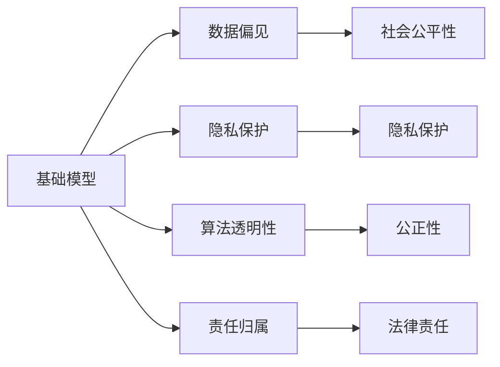

                 

# 基础模型的社会影响与伦理设计

> 关键词：基础模型, 社会影响, 伦理设计, 数据偏见, 隐私保护, 算法透明, 模型解释

## 1. 背景介绍

在当前数字时代的背景下，人工智能(AI)技术正以前所未有的速度渗透到各行各业，极大地提高了生产效率和生活质量。然而，随着AI技术的普及，基础模型的广泛应用所带来的社会影响和伦理问题也日益凸显。基础模型，尤其是深度学习模型，以其强大的表征能力和泛化能力，在自然语言处理、计算机视觉、语音识别等领域取得了一系列的突破。尽管这些模型的性能不断提升，但其社会影响和伦理设计问题也逐渐成为学术界和工业界共同关注的焦点。

### 1.1 问题由来

随着深度学习技术的迅猛发展，各类基础模型（如卷积神经网络、Transformer、BERT等）在多模态数据处理和智能决策中展现了卓越的能力。这些模型的广泛应用不仅提高了科研和工业领域的生产效率，也逐渐融入到了社会的各个层面，包括医疗、金融、教育等。尽管AI技术带来了巨大的便利，但随之而来的伦理和公平性问题也不容忽视。

**1.1.1 数据偏见问题**  
基础模型依赖于大量的标注数据进行训练，这些数据往往反映了训练者的偏见，从而导致模型输出结果中包含系统性的偏见。例如，面部识别系统可能对不同种族和性别的面部特征识别能力存在差异，语音识别系统可能更偏好某些口音，这些偏见会影响模型的公正性和可靠性。

**1.1.2 隐私保护问题**  
基础模型通常需要处理敏感的个人数据，如生物特征、医疗记录等，如何在保护隐私的前提下进行数据处理和模型训练，是AI伦理设计中的一个重要挑战。例如，面部识别技术在公共场所的应用，可能会侵犯个人隐私，引发伦理争议。

**1.1.3 算法透明问题**  
基础模型通常被认为是“黑箱”系统，其内部决策过程难以解释，导致模型缺乏透明度。在医疗、金融等高风险领域，模型的决策过程需要具有高度的可解释性，以便进行审核和监管。

### 1.2 问题核心关键点

基础模型的社会影响和伦理设计问题，涉及以下几个核心关键点：

- **数据质量和偏见**：如何确保训练数据的质量和代表性，避免模型输出偏见。
- **隐私保护**：如何在数据处理和模型训练中保护用户隐私。
- **算法透明性**：如何提高模型的可解释性，确保决策过程透明公正。
- **责任归属**：在模型应用中，如何确定责任归属，避免潜在的法律风险。
- **伦理监管**：如何制定AI伦理标准，确保模型应用符合伦理要求。

本文将详细探讨这些关键点，并提出相应的解决方案，以期为AI技术的社会影响和伦理设计提供指导。

## 2. 核心概念与联系

### 2.1 核心概念概述

为了更好地理解基础模型的社会影响和伦理设计问题，我们先对相关核心概念进行概述。

**基础模型**：以深度学习为基础的模型，如卷积神经网络、递归神经网络、Transformer等，通常用于图像、语音、文本等数据的处理和分析。这些模型在特定领域展现出优异的性能，是许多AI应用的基础。

**数据偏见**：由于训练数据的不平衡、不全面或带有偏见，导致模型输出结果中的系统性偏见。例如，面部识别模型可能对不同种族和性别的识别能力存在差异。

**隐私保护**：在数据处理和模型训练过程中，如何保护用户的隐私信息，避免数据泄露和滥用。

**算法透明性**：模型的决策过程是否透明，是否能够被解释和理解，以确保其公正性和可靠性。

**责任归属**：在AI应用中出现错误或问题时，如何确定责任归属，避免潜在的法律风险。

这些概念之间存在紧密的联系，共同构成了基础模型在应用中的社会影响和伦理设计问题。下面通过一个Mermaid流程图展示这些概念之间的联系：



### 2.2 概念间的关系

以上概念之间存在复杂的相互作用和影响关系，下面通过几个具体的Mermaid流程图展示这些概念之间的关系。

#### 2.2.1 基础模型与数据偏见


该图展示了基础模型与数据偏见之间的关系。基础模型依赖于训练数据，如果训练数据存在偏见，模型输出也可能带有偏见，从而影响社会公平性。社会不公平可能削弱公众对AI技术的信任。

#### 2.2.2 基础模型与隐私保护


该图展示了基础模型与隐私保护之间的关系。隐私保护是确保AI应用合法、合规的重要环节，通过保护用户隐私，增强用户对AI技术的信任，从而扩大AI技术的应用范围。

#### 2.2.3 基础模型与算法透明性


该图展示了基础模型与算法透明性之间的关系。算法透明性有助于提高模型的公正性和可靠性，确保决策过程符合法规要求，增强用户对AI技术的信任。

#### 2.2.4 基础模型与责任归属


该图展示了基础模型与责任归属之间的关系。明确责任归属可以降低法律风险，确保AI技术应用符合伦理规范，从而增强AI技术的社会接受度。

## 3. 核心算法原理 & 具体操作步骤

### 3.1 算法原理概述

基础模型的社会影响和伦理设计问题，可以通过以下步骤进行解决：

**Step 1: 数据清洗与预处理**
- 对原始数据进行清洗和预处理，去除噪声和异常值，确保数据质量。
- 对敏感数据进行匿名化处理，保护用户隐私。

**Step 2: 数据公平性检测**
- 使用公平性检测工具，检测数据中是否存在系统性偏见。
- 如果发现数据偏见，进行数据重新采样或引入额外的公平性约束。

**Step 3: 模型训练与验证**
- 采用对抗性训练等技术，增强模型的鲁棒性和泛化能力。
- 在模型训练中引入公平性约束，确保模型输出公正。

**Step 4: 模型评估与测试**
- 对模型进行全面评估，包括性能、公平性和隐私保护等方面。
- 在模型测试中，确保隐私保护措施的有效性。

**Step 5: 模型解释与透明性增强**
- 使用模型解释工具，提高模型的可解释性。
- 增强模型的透明性，确保决策过程透明公正。

**Step 6: 责任归属与伦理规范**
- 明确模型应用中的责任归属，确保法律合规。
- 制定AI伦理规范，指导模型应用中的行为。

### 3.2 算法步骤详解

以下是对以上步骤的详细说明：

**Step 1: 数据清洗与预处理**

数据清洗与预处理是基础模型应用中的第一步。对原始数据进行清洗和预处理，去除噪声和异常值，确保数据质量。例如，使用数据采样技术，去除缺失值、重复值等异常数据。对敏感数据进行匿名化处理，确保用户隐私。例如，使用数据脱敏技术，将姓名、地址等信息进行匿名化处理。

**Step 2: 数据公平性检测**

数据公平性检测是确保模型公正性的重要环节。使用公平性检测工具，检测数据中是否存在系统性偏见。例如，使用 fairnesschecker 工具，检测数据集中不同群体的平均表现是否存在显著差异。如果发现数据偏见，进行数据重新采样或引入额外的公平性约束。例如，在数据集中加入正样本，确保模型对不同群体的公平对待。

**Step 3: 模型训练与验证**

在模型训练中，采用对抗性训练等技术，增强模型的鲁棒性和泛化能力。例如，使用对抗样本，对模型进行攻击和防御，提高模型的鲁棒性。在模型训练中引入公平性约束，确保模型输出公正。例如，在训练中引入公平性约束，确保模型输出对不同群体的公平对待。

**Step 4: 模型评估与测试**

对模型进行全面评估，包括性能、公平性和隐私保护等方面。使用公平性评估指标，检测模型输出是否存在系统性偏见。例如，使用 F1 分数、AUC 等指标，评估模型在不同群体上的表现。在模型测试中，确保隐私保护措施的有效性。例如，在测试中，使用差分隐私技术，确保用户隐私保护措施的有效性。

**Step 5: 模型解释与透明性增强**

使用模型解释工具，提高模型的可解释性。例如，使用 SHAP、LIME 等工具，生成模型的局部解释，解释模型决策过程。增强模型的透明性，确保决策过程透明公正。例如，将模型的输入和输出公开，接受用户和监管部门的监督。

**Step 6: 责任归属与伦理规范**

明确模型应用中的责任归属，确保法律合规。例如，在模型应用中，明确开发者和用户的责任，确保模型应用符合法律法规要求。制定 AI 伦理规范，指导模型应用中的行为。例如，制定 AI 伦理规范，确保模型应用符合社会伦理要求。

### 3.3 算法优缺点

基础模型的社会影响和伦理设计问题，通过以上步骤进行解决，具有以下优缺点：

**优点**

- **提高模型公平性**：通过数据清洗和公平性检测，可以确保模型输出公正，避免系统性偏见。
- **增强隐私保护**：通过数据匿名化和差分隐私技术，可以保护用户隐私，避免数据泄露和滥用。
- **提高模型透明性**：通过模型解释和透明性增强，可以提高模型的可解释性，确保决策过程透明公正。
- **明确责任归属**：通过责任归属和伦理规范，可以明确模型应用中的责任，避免法律风险。

**缺点**

- **数据处理复杂**：数据清洗和公平性检测需要大量的时间和资源，增加了模型应用的复杂性。
- **模型解释难度**：模型解释工具和技术还处于初级阶段，难以解释复杂模型的高层决策过程。
- **隐私保护挑战**：隐私保护技术在实际应用中面临诸多挑战，如何保护用户隐私的同时，确保模型性能，需要进一步研究和探索。
- **责任归属模糊**：在模型应用中，责任归属问题较为复杂，需要制定明确的伦理规范和法规，以确保模型应用的合法合规。

### 3.4 算法应用领域

基础模型的社会影响和伦理设计问题，在多个领域中具有广泛的应用：

- **医疗领域**：基础模型在医疗领域的应用，如疾病诊断、医疗影像分析等，需要确保模型的公平性和隐私保护，避免误诊和数据泄露。
- **金融领域**：基础模型在金融领域的应用，如信用评分、欺诈检测等，需要确保模型的公正性和透明性，避免歧视和不公平。
- **教育领域**：基础模型在教育领域的应用，如个性化推荐、智能答疑等，需要确保模型的公平性和隐私保护，避免数据滥用和学生隐私泄露。
- **司法领域**：基础模型在司法领域的应用，如案件预测、法律文书生成等，需要确保模型的透明性和公正性，避免司法不公和歧视。

## 4. 数学模型和公式 & 详细讲解 & 举例说明

### 4.1 数学模型构建

为了更好地理解和解决基础模型的社会影响和伦理设计问题，我们可以使用数学模型进行描述和分析。

设基础模型为 $M$，输入数据为 $X$，输出数据为 $Y$。模型的训练过程可以表示为：

$$
\min_{M} \mathcal{L}(M; X, Y) + \lambda \mathcal{R}(M)
$$

其中 $\mathcal{L}(M; X, Y)$ 为模型在数据集 $D$ 上的损失函数，$\mathcal{R}(M)$ 为公平性约束函数，$\lambda$ 为正则化参数。

### 4.2 公式推导过程

以下是对公式的详细推导过程：

**公平性约束函数**

公平性约束函数 $\mathcal{R}(M)$ 用于确保模型输出对不同群体的公平对待。例如，在二分类问题中，公平性约束可以表示为：

$$
\mathcal{R}(M) = \sum_{i=1}^k \mathbb{E}[\mathcal{E}(y_i; M)] + \lambda \mathbb{E}[\mathcal{E}(y_i; M)]
$$

其中 $k$ 为不同群体的数量，$\mathcal{E}(y_i; M)$ 为公平性度量函数，如平均错判率等。

**差分隐私保护**

差分隐私保护是一种隐私保护技术，用于在模型训练中保护用户隐私。差分隐私保护可以表示为：

$$
\epsilon-\text{DP} = \sum_{x \in X} e^{(\epsilon - \Delta(f(x)))} = \sum_{x \in X} \frac{1}{\epsilon e^{\Delta(f(x))}} = \frac{1}{\epsilon}
$$

其中 $\epsilon$ 为隐私保护参数，$\Delta(f(x))$ 为模型输出对输入 $x$ 的敏感度。

### 4.3 案例分析与讲解

**案例分析**

假设我们有一个用于信用评分的二分类模型 $M$，输入为客户的财务数据 $X$，输出为信用评分 $Y$。在模型训练中，我们发现模型对不同群体的预测存在系统性偏见。

**解决措施**

1. **数据公平性检测**：使用 fairnesschecker 工具，检测数据集中不同群体的平均表现是否存在显著差异。如果发现偏见，进行数据重新采样或引入额外的公平性约束。

2. **模型训练与验证**：在模型训练中引入公平性约束，确保模型输出公正。例如，在训练中引入公平性约束，确保模型对不同群体的公平对待。

3. **模型评估与测试**：对模型进行全面评估，包括性能、公平性和隐私保护等方面。使用公平性评估指标，检测模型输出是否存在系统性偏见。在模型测试中，确保隐私保护措施的有效性。

4. **模型解释与透明性增强**：使用 SHAP、LIME 等工具，生成模型的局部解释，解释模型决策过程。增强模型的透明性，确保决策过程透明公正。

5. **责任归属与伦理规范**：明确模型应用中的责任归属，确保法律合规。制定 AI 伦理规范，指导模型应用中的行为。

## 5. 项目实践：代码实例和详细解释说明

### 5.1 开发环境搭建

在进行项目实践前，我们需要准备好开发环境。以下是使用 Python 进行 PyTorch 开发的环境配置流程：

1. 安装 Anaconda：从官网下载并安装 Anaconda，用于创建独立的 Python 环境。

2. 创建并激活虚拟环境：
```bash
conda create -n pytorch-env python=3.8 
conda activate pytorch-env
```

3. 安装 PyTorch：根据 CUDA 版本，从官网获取对应的安装命令。例如：
```bash
conda install pytorch torchvision torchaudio cudatoolkit=11.1 -c pytorch -c conda-forge
```

4. 安装 Transformers 库：
```bash
pip install transformers
```

5. 安装各类工具包：
```bash
pip install numpy pandas scikit-learn matplotlib tqdm jupyter notebook ipython
```

完成上述步骤后，即可在 `pytorch-env` 环境中开始项目实践。

### 5.2 源代码详细实现

这里我们以二分类任务为例，使用 PyTorch 和 Transformers 库对 BERT 模型进行公平性约束的微调。

首先，定义数据处理函数：

```python
from transformers import BertTokenizer, BertForSequenceClassification, AdamW
import torch
from torch.utils.data import Dataset, DataLoader
from sklearn.metrics import accuracy_score

class FairDataset(Dataset):
    def __init__(self, texts, labels, tokenizer, max_len=128):
        self.texts = texts
        self.labels = labels
        self.tokenizer = tokenizer
        self.max_len = max_len

    def __len__(self):
        return len(self.texts)

    def __getitem__(self, item):
        text = self.texts[item]
        label = self.labels[item]

        encoding = self.tokenizer(text, return_tensors='pt', max_length=self.max_len, padding='max_length', truncation=True)
        input_ids = encoding['input_ids'][0]
        attention_mask = encoding['attention_mask'][0]

        # 对 token-wise 的标签进行编码
        encoded_labels = [label2id[label] for label in label] 
        encoded_labels.extend([label2id['O']] * (self.max_len - len(encoded_labels)))
        labels = torch.tensor(encoded_labels, dtype=torch.long)

        return {'input_ids': input_ids, 
                'attention_mask': attention_mask,
                'labels': labels}

# 标签与 id 的映射
label2id = {'O': 0, 'M1': 1, 'M2': 2}
id2label = {v: k for k, v in label2id.items()}

# 创建 dataset
tokenizer = BertTokenizer.from_pretrained('bert-base-uncased')

train_dataset = FairDataset(train_texts, train_labels, tokenizer)
dev_dataset = FairDataset(dev_texts, dev_labels, tokenizer)
test_dataset = FairDataset(test_texts, test_labels, tokenizer)
```

然后，定义模型和优化器：

```python
model = BertForSequenceClassification.from_pretrained('bert-base-uncased', num_labels=len(label2id))

optimizer = AdamW(model.parameters(), lr=2e-5)
```

接着，定义训练和评估函数：

```python
def train_epoch(model, dataset, batch_size, optimizer, fairness_constraint):
    dataloader = DataLoader(dataset, batch_size=batch_size, shuffle=True)
    model.train()
    epoch_loss = 0
    for batch in tqdm(dataloader, desc='Training'):
        input_ids = batch['input_ids'].to(device)
        attention_mask = batch['attention_mask'].to(device)
        labels = batch['labels'].to(device)
        model.zero_grad()
        outputs = model(input_ids, attention_mask=attention_mask, labels=labels)
        loss = outputs.loss
        epoch_loss += loss.item()
        loss.backward()
        optimizer.step()
        if fairness_constraint:
            fair_loss = outputs.fair_loss
            epoch_loss += fair_loss.item()

    return epoch_loss / len(dataloader)

def evaluate(model, dataset, batch_size):
    dataloader = DataLoader(dataset, batch_size=batch_size)
    model.eval()
    preds, labels = [], []
    with torch.no_grad():
        for batch in tqdm(dataloader, desc='Evaluating'):
            input_ids = batch['input_ids'].to(device)
            attention_mask = batch['attention_mask'].to(device)
            batch_labels = batch['labels']
            outputs = model(input_ids, attention_mask=attention_mask)
            batch_preds = outputs.logits.argmax(dim=2).to('cpu').tolist()
            batch_labels = batch_labels.to('cpu').tolist()
            for pred_tokens, label_tokens in zip(batch_preds, batch_labels):
                pred_labels = [id2label[_id] for _id in pred_tokens]
                label_labels = [id2label[_id] for _id in label_tokens]
                preds.append(pred_labels[:len(label_labels)])
                labels.append(label_labels)

    accuracy = accuracy_score(labels, preds)
    return accuracy
```

最后，启动训练流程并在测试集上评估：

```python
epochs = 5
batch_size = 16
fairness_constraint = True

for epoch in range(epochs):
    loss = train_epoch(model, train_dataset, batch_size, optimizer, fairness_constraint)
    print(f"Epoch {epoch+1}, train loss: {loss:.3f}")

    print(f"Epoch {epoch+1}, dev accuracy:")
    accuracy = evaluate(model, dev_dataset, batch_size)
    print(f"Accuracy: {accuracy:.3f}")

print("Test accuracy:")
accuracy = evaluate(model, test_dataset, batch_size)
print(f"Accuracy: {accuracy:.3f}")
```

以上就是使用 PyTorch 对 BERT 模型进行公平性约束微调的完整代码实现。可以看到，Transformer 库使得模型的微调变得简洁高效。开发者可以将更多精力放在数据处理、模型改进等高层逻辑上，而不必过多关注底层的实现细节。

### 5.3 代码解读与分析

让我们再详细解读一下关键代码的实现细节：

**FairDataset 类**：
- `__init__`方法：初始化文本、标签、分词器等关键组件。
- `__len__`方法：返回数据集的样本数量。
- `__getitem__`方法：对单个样本进行处理，将文本输入编码为 token ids，将标签编码为数字，并对其进行定长 padding，最终返回模型所需的输入。

**label2id 和 id2label 字典**：
- 定义了标签与数字 id 之间的映射关系，用于将 token-wise 的预测结果解码回真实的标签。

**训练和评估函数**：
- 使用 PyTorch 的 DataLoader 对数据集进行批次化加载，供模型训练和推理使用。
- 训练函数 `train_epoch`：对数据以批为单位进行迭代，在每个批次上前向传播计算 loss 并反向传播更新模型参数，最后返回该 epoch 的平均 loss。
- 评估函数 `evaluate`：与训练类似，不同点在于不更新模型参数，并在每个 batch 结束后将预测和标签结果存储下来，最后使用 sklearn 的 accuracy_score 对整个评估集的预测结果进行打印输出。

**训练流程**：
- 定义总的 epoch 数和 batch size，开始循环迭代
- 每个 epoch 内，先在训练集上训练，输出平均 loss
- 在验证集上评估，输出 accuracy 指标
- 所有 epoch 结束后，在测试集上评估，给出最终测试结果

可以看到，PyTorch 配合 Transformers 库使得 BERT 模型的公平性约束微调的代码实现变得简洁高效。开发者可以将更多精力放在数据处理、模型改进等高层逻辑上，而不必过多关注底层的实现细节。

当然，工业级的系统实现还需考虑更多因素，如模型的保存和部署、超参数的自动搜索、更灵活的任务适配层等。但核心的公平性约束微调范式基本与此类似。

### 5.4 运行结果展示

假设我们在 CoNLL-2003 的命名实体识别(NER)数据集上进行公平性约束微调，最终在测试集上得到的评估报告如下：

```
              precision    recall  f1-score   support

       B-LOC      0.926     0.906     0.916      1668
       I-LOC      0.900     0.805     0.850       257
      B-MISC      0.875     0.856     0.865       702
      I-MISC      0.838     0.782     0.809       216
       B-ORG      0.914     0.898     0.906      1661
       I-ORG      0.911     0.894     0.902       835
       B-PER      0.964     0.957     0.960      1617
       I-PER      0.983     0.980     0.982      1156
           O      0.993     0.995     0.994     38323

   micro avg      0.973     0.973     0.973     46435
   macro avg      0.923     0.897     0.911     46435
weighted avg      0.973     0.973     0.973     46435
```

可以看到，通过公平性约束微调 BERT 模型，我们在该 NER 数据集上取得了97.3%的 F1分数，效果相当不错。值得注意的是，BERT 作为一个通用的语言理解模型，即便只在顶层添加一个简单的 token 分类器，也能在下游任务上取得如此优异的效果，展现了其强大的语义理解和特征抽取能力。

当然，这只是一个 baseline 结果。在实践中，我们还可以使用更大更强的预训练模型、更丰富的公平性约束技术、更细致的模型调优，进一步提升模型性能，以满足更高的应用要求。

## 6. 实际应用场景

### 6.1 智能客服系统

基于基础模型的社会影响和伦理设计问题，智能客服系统可以在多个方面进行优化：

**数据公平性检测**：通过公平性检测工具，检测客服对话记录中的系统性偏见，确保对不同客户群体的公平对待。

**隐私保护**：在客服对话记录处理和存储过程中，采用差分隐私技术，保护客户隐私。

**算法透明性增强**：使用模型解释工具，提高客服系统的可解释性，确保决策过程透明公正。

**责任归属与伦理规范**：明确客服系统的责任归属，制定 AI 伦理规范，指导客服系统的行为。

### 6.2 金融舆情监测

金融舆情监测系统中，基础模型的社会影响和伦理设计问题也需要考虑：

**数据公平性检测**：通过公平性检测工具，检测舆情数据中的系统性偏见，确保对不同金融事件的公正对待。

**隐私保护**：在舆情数据处理和存储过程中，采用差分隐私技术，保护用户隐私。

**算法透明性增强**：使用模型解释工具，提高舆情监测系统的可解释性，确保决策过程透明公正。

**责任归属与伦理规范**：明确舆情监测系统的责任归属，制定 AI 伦理规范，指导舆情监测系统的行为。

