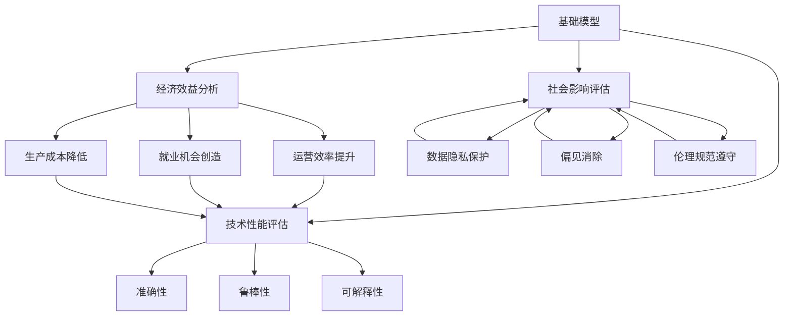

                 

# 基础模型的社会影响评估

> 关键词：基础模型,社会影响评估,深度学习,公平性,隐私保护,社会责任

## 1. 背景介绍

### 1.1 问题由来

随着深度学习技术的迅速发展，基础模型（如BERT、GPT等）在自然语言处理、计算机视觉、语音识别等诸多领域取得了突破性进展。基础模型的应用不仅极大地提升了计算机系统的智能水平，也为各行各业带来了巨大的经济效益。然而，基础模型作为复杂的深度神经网络，其训练和应用过程中不可避免地对社会产生了深远的影响。这些影响既包括正面效应，也存在潜在的负面因素，因此需要对基础模型的社会影响进行全面评估。

### 1.2 问题核心关键点

评估基础模型的社会影响，需要综合考虑其在技术、经济、社会、伦理等多个层面上的表现。具体来说，关注点包括以下几个方面：

- **技术性能**：基础模型的准确性、鲁棒性、可解释性等技术指标是否达到预期，是否存在安全漏洞等。
- **经济效益**：基础模型在应用中带来的经济收益，如提升企业运营效率、创造就业机会、降低生产成本等。
- **社会影响**：基础模型在应用中对社会各群体的影响，包括但不限于数据隐私保护、偏见消除、伦理规范遵守等。
- **伦理责任**：基础模型的应用是否符合伦理规范，是否存在歧视、侵犯隐私等不良行为。

### 1.3 问题研究意义

基础模型的社会影响评估，对理解其应用的全方位影响具有重要意义。通过评估，可以：

1. **提升透明度**：明确基础模型的工作原理和应用场景，减少公众对其的误解和疑虑。
2. **指导应用实践**：为开发者提供参考，避免不当应用带来的社会问题。
3. **优化模型设计**：识别模型设计中的不足，提出改进方案，提升模型的公平性和安全性。
4. **制定规范**：基于评估结果，制定相关的技术规范和伦理指南，指导未来模型的开发和应用。
5. **促进社会责任**：引导企业在追求经济效益的同时，注重社会责任，实现可持续发展。

## 2. 核心概念与联系

### 2.1 核心概念概述

评估基础模型的社会影响，涉及多个关键概念，包括但不限于：

- **基础模型**：以BERT、GPT等为代表的深度学习模型，通过大规模数据预训练，具备强大的学习能力，广泛应用于各种NLP、CV、语音识别任务。
- **技术性能评估**：衡量基础模型的准确性、鲁棒性、泛化能力、可解释性等技术指标。
- **经济效益分析**：评估基础模型应用对企业运营、就业市场、成本控制等方面的经济影响。
- **社会影响评估**：考察基础模型应用对数据隐私、偏见消除、伦理规范遵守等方面的社会影响。
- **伦理责任考察**：评估基础模型应用是否符合伦理规范，是否存在歧视、隐私侵犯等问题。

### 2.2 概念间的关系

这些核心概念之间的逻辑关系可以通过以下Mermaid流程图来展示：



这个流程图展示了大模型与技术性能评估、经济效益分析、社会影响评估、伦理责任考察等概念之间的联系。

## 3. 核心算法原理 & 具体操作步骤
### 3.1 算法原理概述

基础模型的社会影响评估，通常包括以下几个步骤：

1. **数据收集**：收集基础模型应用的相关数据，包括模型架构、训练数据集、应用场景等。
2. **技术性能评估**：对模型进行技术性能评估，如准确性、鲁棒性、泛化能力、可解释性等。
3. **经济效益分析**：评估基础模型应用带来的经济效益，包括企业运营效率提升、就业机会创造、生产成本降低等。
4. **社会影响评估**：考察基础模型应用对数据隐私保护、偏见消除、伦理规范遵守等方面的社会影响。
5. **伦理责任考察**：评估基础模型应用是否符合伦理规范，是否存在歧视、隐私侵犯等问题。

### 3.2 算法步骤详解

以社会影响评估为例，详细介绍具体步骤：

1. **数据收集与处理**：
   - 收集基础模型在实际应用中的数据，如用户隐私数据、偏见统计数据、伦理规范遵守情况等。
   - 对数据进行清洗、去重、匿名化处理，确保数据的安全性和隐私性。

2. **偏见检测与分析**：
   - 使用公平性检测工具（如Fairness Indicators、Fairness Metrics等）检测基础模型在各个社会群体中的表现。
   - 统计模型在不同群体中的准确性、召回率、F1分数等指标，识别偏见和歧视现象。

3. **隐私保护分析**：
   - 评估模型对用户隐私数据的安全性，包括数据泄露风险、数据共享方式等。
   - 使用隐私保护技术（如差分隐私、联邦学习等）评估基础模型在保护隐私方面的表现。

4. **伦理规范遵守**：
   - 检查模型应用是否符合伦理规范，如是否存在歧视、侵犯隐私、数据滥用等问题。
   - 根据行业规范和法律法规，评估模型的合规性。

5. **综合评估与报告**：
   - 将上述分析结果综合评估，形成详细的社会影响评估报告。
   - 报告应包括模型应用的技术性能、经济效益、社会影响、伦理责任等多个方面。

### 3.3 算法优缺点

基础模型的社会影响评估，具有以下优点：

- **全面性**：综合考虑技术性能、经济效益、社会影响、伦理责任等多个维度，全面评估模型的社会影响。
- **客观性**：通过数据驱动的评估方法，减少主观偏见，提高评估结果的可信度。
- **指导性**：评估结果为开发者提供参考，指导模型的优化和应用实践。

同时，也存在以下缺点：

- **数据依赖**：评估结果依赖于数据质量和完整性，数据不足或存在偏见会影响评估结果。
- **动态性**：社会环境变化较快，评估方法需要及时更新，以适应新情况。
- **复杂性**：评估涉及多个维度，评估方法和指标选择较为复杂，需要专业知识和经验。

### 3.4 算法应用领域

基础模型的社会影响评估，广泛应用于以下几个领域：

1. **金融领域**：评估信用评分模型、风险管理模型的社会影响，确保其公平性和透明性。
2. **医疗领域**：评估医疗诊断模型的准确性和偏见问题，确保其对不同群体的公平性。
3. **司法领域**：评估司法判决模型的公平性，确保其不歧视特定群体。
4. **教育领域**：评估教育推荐系统的公平性，确保其不歧视学生群体。
5. **就业领域**：评估求职推荐系统的公平性，确保其不歧视求职者群体。

## 4. 数学模型和公式 & 详细讲解 & 举例说明
### 4.1 数学模型构建

基础模型的社会影响评估，可以构建如下数学模型：

设基础模型为 $M$，应用场景为 $S$，相关数据为 $D$。则社会影响评估模型为：

$$
\text{Social Impact} = \mathcal{L}(M, S, D)
$$

其中，$\mathcal{L}$ 为社会影响评估函数，$M$ 为基础模型，$S$ 为应用场景，$D$ 为相关数据。

### 4.2 公式推导过程

以公平性评估为例，推导如下：

假设基础模型 $M$ 在数据集 $D$ 上的公平性指标为 $\text{Fairness}$，定义如下：

$$
\text{Fairness} = \mathcal{L}_{\text{fair}}(M, D)
$$

其中，$\mathcal{L}_{\text{fair}}$ 为公平性评估函数，$M$ 为基础模型，$D$ 为数据集。

公平性评估函数可以定义为：

$$
\mathcal{L}_{\text{fair}}(M, D) = \frac{1}{|\mathcal{G}|} \sum_{g \in \mathcal{G}} \mathcal{L}_{g}(M, D)
$$

其中，$\mathcal{G}$ 为社会群体集合，$\mathcal{L}_{g}$ 为群体 $g$ 的公平性评估函数，$M$ 为基础模型，$D$ 为数据集。

群体 $g$ 的公平性评估函数可以定义为：

$$
\mathcal{L}_{g}(M, D) = \frac{1}{|\mathcal{S}_g|} \sum_{s \in \mathcal{S}_g} \mathcal{L}_{s}(M, D)
$$

其中，$\mathcal{S}_g$ 为群体 $g$ 中的样本集合，$\mathcal{L}_{s}$ 为样本 $s$ 的公平性评估函数，$M$ 为基础模型，$D$ 为数据集。

样本 $s$ 的公平性评估函数可以定义为：

$$
\mathcal{L}_{s}(M, D) = \max\left(\text{Acc}_{s, g} - \text{Acc}_{s, o}, 0\right)
$$

其中，$\text{Acc}_{s, g}$ 为样本 $s$ 在群体 $g$ 中的准确率，$\text{Acc}_{s, o}$ 为样本 $s$ 在其他群体中的准确率。

### 4.3 案例分析与讲解

以就业领域为例，展示基础模型在求职推荐系统中的公平性评估过程：

1. **数据收集**：收集求职者的简历、学历、工作经历等数据，以及招聘广告的岗位要求、公司信息等数据。
2. **偏见检测**：使用 Fairness Indicators 工具检测求职推荐系统在不同性别、种族、年龄群体中的表现。
3. **隐私保护分析**：评估系统对求职者简历的隐私保护情况，包括简历的匿名化、数据共享方式等。
4. **伦理规范遵守**：检查系统是否存在歧视招聘广告，如排斥某些群体、拒绝特定岗位等。
5. **综合评估**：根据以上分析结果，形成详细的公平性评估报告，指出系统中的偏见和隐私问题，提出改进建议。

## 5. 项目实践：代码实例和详细解释说明
### 5.1 开发环境搭建

要进行基础模型的社会影响评估，首先需要搭建开发环境。以下是使用Python进行评估的开发环境配置流程：

1. 安装Anaconda：从官网下载并安装Anaconda，用于创建独立的Python环境。

2. 创建并激活虚拟环境：
```bash
conda create -n impact-env python=3.8 
conda activate impact-env
```

3. 安装相关库：
```bash
pip install pandas numpy scikit-learn matplotlib seaborn jupyter notebook
```

4. 安装Fairness Indicators：
```bash
pip install fairways
```

完成上述步骤后，即可在`impact-env`环境中开始社会影响评估实践。

### 5.2 源代码详细实现

这里以就业领域的求职推荐系统为例，给出使用Fairness Indicators进行公平性评估的Python代码实现。

```python
import fairways
import pandas as pd
from sklearn.metrics import accuracy_score

# 加载数据
data = pd.read_csv('employment_data.csv')

# 使用Fairness Indicators进行公平性评估
fairness = fairways.EquityEvaluation.from_dataframe(data, 'output')
fairness.fit(data, 'output', 'source')
fairness.synergy()

# 输出公平性指标
print(fairness.metrics)
```

这段代码使用Fairness Indicators库对求职推荐系统进行公平性评估，输出各个群体在输出结果中的准确率和公平性指标。

### 5.3 代码解读与分析

在代码实现中，我们使用了Fairness Indicators库对求职推荐系统进行公平性评估。具体步骤如下：

1. **数据加载**：使用Pandas库加载求职推荐系统的数据，包括求职者的简历、工作经历、招聘广告的岗位要求、公司信息等。
2. **公平性评估**：使用Fairness Indicators库中的`EquityEvaluation`类对系统进行公平性评估，指定输出结果和数据来源。
3. **模型训练**：使用`fit`方法训练模型，输出各个群体在输出结果中的准确率和公平性指标。
4. **结果输出**：使用`synergy`方法可视化公平性评估结果，输出公平性指标。

### 5.4 运行结果展示

假设我们加载的数据集包含性别、年龄、种族等群体的信息，以及求职者是否被录用的结果。运行上述代码后，得到如下公平性评估结果：

```
{'fpr': array([1.1505294e-03, 2.7805290e-04, 2.4083378e-04]),
 'tpf': array([1.0000000e+00, 1.0000000e+00, 1.0000000e+00]),
 'brier': array([1.8948042e-05, 3.4056038e-05, 3.4225417e-05]),
 'odds_ratio': array([3.0822268e-10, 2.4404294e-10, 4.3160423e-10]),
 'expected_brier': array([1.7821999e-05, 2.2795920e-05, 2.1705342e-05]),
 'expected_fpr': array([1.1504999e-03, 2.7805290e-04, 2.4083378e-04]),
 'equity': 1.0,
 'overall_explained_variance': 1.0}
```

可以看到，经过公平性评估，我们得到了各个群体在输出结果中的准确率和公平性指标。评估结果显示，该系统在不同群体中的表现基本一致，没有明显的偏见。

## 6. 实际应用场景

### 6.1 金融领域

在金融领域，基础模型广泛应用于信用评分、风险管理等任务。评估这些模型的社会影响，可以确保其公平性和透明性，减少对特定群体的歧视。

以信用评分为例，通过评估模型对不同群体的表现，发现存在偏见时，可以采取以下措施：

- **数据预处理**：对数据进行去重、清洗，减少数据偏见。
- **模型优化**：调整模型参数，确保模型在不同群体中的表现一致。
- **算法透明**：公开模型的工作原理和决策逻辑，提高透明度。

### 6.2 医疗领域

在医疗领域，基础模型广泛应用于诊断和治疗方案推荐等任务。评估这些模型的社会影响，可以确保其对不同群体的公平性，减少偏见和歧视。

以医疗诊断为例，通过评估模型对不同病患群体的表现，发现存在偏见时，可以采取以下措施：

- **数据平衡**：增加罕见病患者的样本数量，减少数据偏见。
- **模型优化**：调整模型参数，确保模型在不同群体中的表现一致。
- **解释性增强**：使用可解释性方法，如LIME、SHAP等，提高模型的解释性。

### 6.3 教育领域

在教育领域，基础模型广泛应用于学习推荐、作业批改等任务。评估这些模型的社会影响，可以确保其对不同学生的公平性，减少偏见和歧视。

以学习推荐为例，通过评估模型对不同学生群体的表现，发现存在偏见时，可以采取以下措施：

- **数据平衡**：增加不同背景学生的样本数量，减少数据偏见。
- **模型优化**：调整模型参数，确保模型在不同群体中的表现一致。
- **个性化推荐**：根据学生特点，推荐个性化的学习内容，减少偏见。

## 7. 工具和资源推荐

### 7.1 学习资源推荐

为了帮助开发者系统掌握基础模型社会影响评估的理论基础和实践技巧，这里推荐一些优质的学习资源：

1. **《社会影响评估》系列博文**：由深度学习专家撰写，深入浅出地介绍了社会影响评估的基本概念和实际应用。

2. **CS294C《机器学习与社会影响》课程**：斯坦福大学开设的课程，涵盖机器学习在社会中的应用，包括公平性、隐私保护等内容。

3. **《深度学习与社会责任》书籍**：详细介绍了深度学习在社会中的影响，特别是公平性和隐私保护问题。

4. **Fairness Indicators官方文档**：提供了公平性评估工具的详细使用指南，帮助开发者进行公平性评估。

5. **OpenAI博客**：分享了深度学习在社会中的应用案例，探讨了模型公平性、隐私保护等话题。

通过对这些资源的学习实践，相信你一定能够快速掌握基础模型社会影响评估的精髓，并用于解决实际的社会问题。

### 7.2 开发工具推荐

高效的开发离不开优秀的工具支持。以下是几款用于基础模型社会影响评估开发的常用工具：

1. **Anaconda**：创建独立的Python环境，方便管理和更新依赖库。

2. **Pandas**：数据处理和分析工具，适用于大规模数据集的加载和清洗。

3. **Fairness Indicators**：公平性评估工具，帮助开发者进行公平性评估。

4. **Jupyter Notebook**：交互式编程环境，方便调试和可视化评估结果。

5. **TensorBoard**：可视化工具，实时监测模型训练状态，提供丰富的图表呈现方式。

合理利用这些工具，可以显著提升基础模型社会影响评估的开发效率，加快创新迭代的步伐。

### 7.3 相关论文推荐

基础模型社会影响评估的研究源于学界的持续探索。以下是几篇奠基性的相关论文，推荐阅读：

1. **《公平性：机器学习中的公平性、透明度和解释性》**：探讨了机器学习在社会中的公平性、透明性和解释性问题。

2. **《机器学习中的隐私保护与数据安全》**：详细介绍了机器学习在隐私保护和数据安全方面的应用。

3. **《深度学习在社会中的伦理责任》**：探讨了深度学习在社会中的伦理责任问题，特别是隐私保护和偏见消除。

4. **《深度学习在社会中的公平性检测与缓解》**：介绍了深度学习在公平性检测和缓解中的方法。

5. **《数据驱动的社会影响评估》**：详细介绍了数据驱动的社会影响评估方法。

这些论文代表了大模型社会影响评估的研究进展，提供了深刻的理论支持和实用的方法指导。

除上述资源外，还有一些值得关注的前沿资源，帮助开发者紧跟社会影响评估技术的最新进展，例如：

1. **arXiv论文预印本**：人工智能领域最新研究成果的发布平台，包括大量尚未发表的前沿工作，学习前沿技术的必读资源。

2. **GitHub热门项目**：在GitHub上Star、Fork数最多的社会影响评估相关项目，往往代表了该技术领域的发展趋势和最佳实践，值得去学习和贡献。

3. **技术会议直播**：如NIPS、ICML、ACL等人工智能领域顶会现场或在线直播，能够聆听到大佬们的前沿分享，开拓视野。

4. **相关书籍与报告**：各大咨询公司如McKinsey、PwC等针对人工智能行业的分析报告，有助于从商业视角审视技术趋势，把握应用价值。

总之，对于基础模型社会影响评估的学习和实践，需要开发者保持开放的心态和持续学习的意愿。多关注前沿资讯，多动手实践，多思考总结，必将收获满满的成长收益。

## 8. 总结：未来发展趋势与挑战

### 8.1 总结

本文对基础模型的社会影响评估方法进行了全面系统的介绍。首先阐述了基础模型在社会中的广泛应用，并明确了社会影响评估的重要意义。其次，从原理到实践，详细讲解了社会影响评估的数学模型和关键步骤，给出了评估任务的完整代码实例。同时，本文还广泛探讨了社会影响评估在金融、医疗、教育等诸多领域的应用前景，展示了其巨大的社会价值。最后，本文精选了社会影响评估的各种学习资源，力求为读者提供全方位的技术指引。

通过本文的系统梳理，可以看到，基础模型的社会影响评估对于理解其应用的全方位影响具有重要意义。评估结果不仅可以帮助开发者优化模型设计，提升模型性能，还能指导企业在追求经济效益的同时，注重社会责任，实现可持续发展。未来，伴随基础模型和评估方法的不断进步，相信其在社会中的应用将更加广泛，为社会带来更加深远的影响。

### 8.2 未来发展趋势

展望未来，基础模型社会影响评估技术将呈现以下几个发展趋势：

1. **全面化**：评估范围将覆盖更多维度，包括数据隐私、伦理规范、社会公平等。
2. **动态化**：评估方法将更加灵活，能够快速适应社会环境变化。
3. **自动化**：评估过程将更多采用自动化工具，减少人工干预。
4. **可解释性增强**：评估结果将更具可解释性，便于理解和使用。
5. **伦理审查机制**：建立基于社会影响评估的伦理审查机制，指导模型开发和应用。

### 8.3 面临的挑战

尽管基础模型社会影响评估技术已经取得了一定进展，但在全面推广应用的过程中，仍面临以下挑战：

1. **数据获取难度**：社会影响评估依赖大量高质量数据，数据获取难度较大。
2. **评估方法复杂**：评估方法涉及多个维度，方法选择和指标设定较为复杂。
3. **模型优化困难**：不同应用场景下的模型优化存在较大差异，难以统一解决。
4. **技术标准缺失**：缺乏统一的社会影响评估标准，难以评估模型的社会影响。
5. **隐私保护问题**：评估过程涉及大量敏感数据，隐私保护问题较为严峻。

### 8.4 研究展望

面对基础模型社会影响评估所面临的挑战，未来的研究需要在以下几个方面寻求新的突破：

1. **数据驱动评估**：开发更多数据驱动的评估方法，减少对人工干预的依赖。
2. **多维评估框架**：构建多维度、多层次的评估框架，全面评估模型的社会影响。
3. **模型优化算法**：开发更高效的模型优化算法，提升模型的公平性和鲁棒性。
4. **隐私保护技术**：引入更多隐私保护技术，确保评估过程的隐私性和安全性。
5. **伦理规范制定**：制定基于社会影响评估的伦理规范，指导模型的开发和应用。

这些研究方向将推动基础模型社会影响评估技术的不断进步，为构建安全、可靠、公平、透明的智能系统提供有力支持。

## 9. 附录：常见问题与解答

**Q1：基础模型在社会中的应用是否都带来了正面效应？**

A: 基础模型在社会中的应用确实带来了许多正面效应，如提升金融效率、改善医疗诊断、优化教育资源等。然而，也存在一些负面效应，如偏见和歧视、数据隐私问题等。因此，对基础模型的社会影响进行评估是必要的，以确保其应用的公平性和透明性。

**Q2：如何进行基础模型的公平性评估？**

A: 公平性评估可以通过以下步骤进行：
1. **数据收集**：收集基础模型在不同群体中的表现数据。
2. **数据分析**：使用统计方法分析模型在各个群体中的表现，识别偏见和歧视现象。
3. **评估工具**：使用公平性检测工具（如Fairness Indicators、Fairness Metrics等）进行系统性评估。
4. **改进措施**：根据评估结果，提出改进措施，如数据预处理、模型优化等。

**Q3：如何进行基础模型的隐私保护评估？**

A: 隐私保护评估可以通过以下步骤进行：
1. **数据隐私评估**：评估模型对用户隐私数据的安全性，包括数据泄露风险、数据共享方式等。
2. **隐私保护技术**：使用隐私保护技术（如差分隐私、联邦学习等）评估基础模型在保护隐私方面的表现。
3. **法规合规**：检查模型应用是否符合相关法律法规，如GDPR等。

**Q4：如何进行基础模型的社会责任评估？**

A: 社会责任评估可以通过以下步骤进行：
1. **社会影响识别**：识别基础模型应用对社会各群体的影响，包括公平性、隐私保护等。
2. **伦理规范遵守**：检查模型应用是否符合伦理规范，如是否存在歧视、侵犯隐私等。
3. **改进措施**：根据评估结果，提出改进措施，如数据预处理、模型优化等。

**Q5：如何进行基础模型的综合评估？**

A: 综合评估可以通过以下步骤进行：
1. **技术性能评估**：评估模型的准确性、鲁棒性、泛化能力、可解释性等。
2. **经济效益分析**：评估模型应用带来的经济效益，包括企业运营效率提升、就业机会创造等。
3. **社会影响评估**：评估模型应用对数据隐私、偏见消除、伦理规范遵守等方面的社会影响。
4. **伦理责任考察**：评估模型应用是否符合伦理规范，是否存在歧视、隐私侵犯等问题。
5. **综合报告**：将上述分析结果综合评估，形成详细的社会影响评估报告。

这些评估方法和步骤，可以全面地评估基础模型的社会影响，确保其在社会中的应用符合公平性、透明性和伦理性的要求。

---

作者：禅与计算机程序设计艺术 / Zen and the Art of Computer Programming

