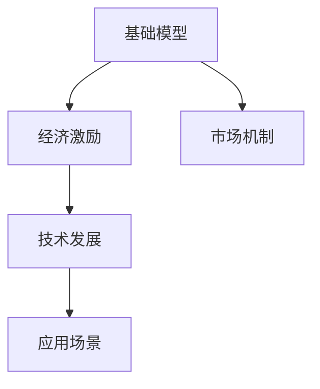
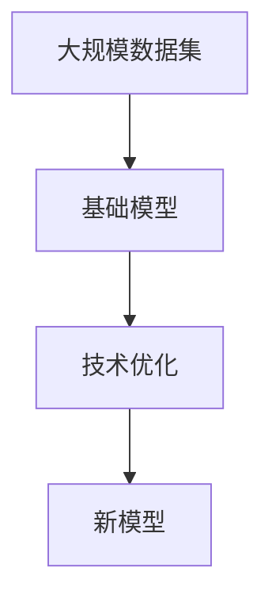
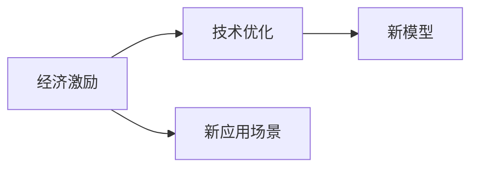
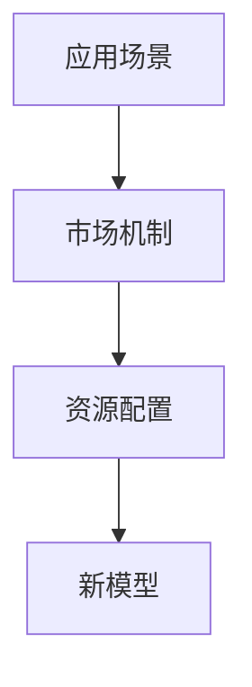

                 

# 基础模型的经济激励与技术发展

> 关键词：基础模型,经济激励,技术发展,深度学习,人工智能,市场机制,模型优化,应用场景

## 1. 背景介绍

### 1.1 问题由来

随着深度学习技术的不断发展，人工智能(AI)模型正逐步应用于各种领域，如自动驾驶、智能客服、金融交易等。这些模型通常基于大规模数据集进行预训练，并能够在特定任务上进行微调，以获得更好的性能。然而，预训练和微调需要耗费大量的计算资源和人力，这不仅增加了企业的成本，也限制了模型的普及和应用。因此，如何激励开发者和机构构建高效、优质的基础模型，同时降低其经济负担，成为了AI模型应用和普及的关键问题。

### 1.2 问题核心关键点

本研究聚焦于基础模型的经济激励和技术发展，主要考虑以下几个方面：

1. **经济激励机制**：如何通过市场机制和经济手段，激励开发者和企业构建高效、高质量的基础模型。
2. **技术发展路径**：基础模型在技术上如何进一步提升，包括模型架构、优化算法、数据增强等。
3. **应用场景拓展**：基础模型在实际应用中的推广和应用，以及面临的挑战和解决方案。

### 1.3 问题研究意义

研究基础模型的经济激励与技术发展，对于提升AI模型的性能和普及率，降低企业应用成本，具有重要意义：

1. **提升模型性能**：经济激励和技术优化可以促使开发者构建更高效、更精确的基础模型，提升其在各领域的应用效果。
2. **降低应用成本**：合理的经济激励机制可以降低企业在使用AI模型时的初始投入和持续成本，推动模型在更多行业的应用。
3. **加速技术普及**：优化技术路径和拓展应用场景，可以加速AI技术的普及和落地，带来更广泛的社会和经济效益。
4. **促进创新研发**：经济激励和技术突破可以激发更多的研发热情和创新灵感，推动AI技术的持续进步。

## 2. 核心概念与联系

### 2.1 核心概念概述

为了更好地理解基础模型的经济激励和技术发展，我们首先需要定义以下几个关键概念：

1. **基础模型**：基于大规模数据集进行预训练的通用深度学习模型，如BERT、GPT-3等。这些模型通常具有强大的语言或图像理解能力，可用于各种NLP、CV任务。

2. **经济激励**：通过市场机制和经济手段，如奖金、资助、合作协议等，激励开发者和企业构建高效、高质量的基础模型。

3. **技术发展**：指基础模型在技术上的改进，包括模型架构的创新、优化算法的优化、数据增强技术的应用等。

4. **应用场景**：基础模型在实际应用中的推广和应用，如智能客服、金融分析、自动驾驶等。

5. **市场机制**：利用市场机制，如价格、供应、竞争等，促进基础模型的建设和发展。

这些概念之间的关系可以通过以下Mermaid流程图来展示：



这个流程图展示了大语言模型从构建、优化到应用的全过程，以及经济激励和技术发展在此过程中的重要作用。

### 2.2 概念间的关系

这些核心概念之间存在着紧密的联系，形成了基础模型经济激励和技术发展的完整生态系统。下面通过几个Mermaid流程图来展示这些概念之间的关系。

#### 2.2.1 基础模型构建与优化



这个流程图展示了从数据集到基础模型的构建，再到模型优化的全过程。

#### 2.2.2 经济激励与技术发展



这个流程图展示了经济激励如何推动技术优化，进而产生更高效的基础模型，并拓展新的应用场景。

#### 2.2.3 应用场景与市场机制



这个流程图展示了应用场景如何促进市场机制的形成，进而通过资源配置推动新模型的建设。

## 3. 核心算法原理 & 具体操作步骤

### 3.1 算法原理概述

基础模型的构建和优化是一个复杂的过程，涉及大规模数据集的处理、模型架构的优化、优化算法的改进等。其核心目标是构建一个具有高效计算性能和强大泛化能力的基础模型，能够在特定的应用场景中表现优异。

### 3.2 算法步骤详解

基础模型的构建和优化通常包括以下几个关键步骤：

1. **数据准备**：收集并预处理大规模数据集，进行特征提取和标注。
2. **模型选择**：选择适合的基础模型架构，如卷积神经网络(CNN)、循环神经网络(RNN)、Transformer等。
3. **预训练**：在大规模数据集上进行无监督预训练，学习通用特征表示。
4. **微调**：在特定任务上进行监督微调，优化模型在特定场景下的性能。
5. **评估和优化**：在验证集上评估模型性能，通过调参和优化算法改进模型。

### 3.3 算法优缺点

基础模型构建和优化具有以下优点：

1. **通用性强**：构建的基础模型可以应用于多个领域和任务，具有广泛的泛化能力。
2. **效率高**：通过预训练和微调，模型能够快速适应新的任务，提升推理效率。
3. **可扩展性强**：随着数据和算力的增加，模型性能可以不断提升。

但同时，基础模型的构建和优化也存在一些局限性：

1. **计算成本高**：预训练和微调需要大量的计算资源，增加了企业的初始投入。
2. **技术门槛高**：构建和优化基础模型需要深厚的技术积累和经验，对开发者要求较高。
3. **泛化能力有限**：如果数据和任务特性差异较大，模型的泛化能力可能会受到影响。

### 3.4 算法应用领域

基础模型在多个领域都得到了广泛的应用，如NLP、CV、自然语言生成、机器翻译等。

1. **自然语言处理(NLP)**：如BERT、GPT-3等模型，广泛应用于文本分类、情感分析、命名实体识别等任务。
2. **计算机视觉(CV)**：如ResNet、VGGNet等模型，广泛应用于图像分类、目标检测、图像生成等任务。
3. **自然语言生成**：如GPT-3、T5等模型，能够生成高质量的自然语言文本，应用于聊天机器人、自动摘要等任务。
4. **机器翻译**：如Transformer等模型，能够实现高效、准确的翻译，广泛应用于多语言交流、文档翻译等任务。

## 4. 数学模型和公式 & 详细讲解 & 举例说明

### 4.1 数学模型构建

本节将使用数学语言对基础模型的构建和优化过程进行更加严格的刻画。

记基础模型为 $M_{\theta}$，其中 $\theta$ 为模型参数。假设预训练数据集为 $D=\{(x_i, y_i)\}_{i=1}^N, x_i \in \mathcal{X}, y_i \in \mathcal{Y}$，目标任务数据集为 $D'=\{(x'_i, y'_i)\}_{i=1}^{N'}, x'_i \in \mathcal{X'}, y'_i \in \mathcal{Y'}$。

定义模型 $M_{\theta}$ 在数据样本 $(x,y)$ 上的损失函数为 $\ell(M_{\theta}(x),y)$，则在数据集 $D'$ 上的经验风险为：

$$
\mathcal{L}(\theta) = \frac{1}{N'} \sum_{i=1}^{N'} \ell(M_{\theta}(x'_i),y'_i)
$$

微调的优化目标是最小化经验风险，即找到最优参数：

$$
\theta^* = \mathop{\arg\min}_{\theta} \mathcal{L}(\theta)
$$

在实践中，我们通常使用基于梯度的优化算法（如SGD、Adam等）来近似求解上述最优化问题。设 $\eta$ 为学习率，$\lambda$ 为正则化系数，则参数的更新公式为：

$$
\theta \leftarrow \theta - \eta \nabla_{\theta}\mathcal{L}(\theta) - \eta\lambda\theta
$$

其中 $\nabla_{\theta}\mathcal{L}(\theta)$ 为损失函数对参数 $\theta$ 的梯度，可通过反向传播算法高效计算。

### 4.2 公式推导过程

以下我们以二分类任务为例，推导交叉熵损失函数及其梯度的计算公式。

假设模型 $M_{\theta}$ 在输入 $x$ 上的输出为 $\hat{y}=M_{\theta}(x) \in [0,1]$，表示样本属于正类的概率。真实标签 $y \in \{0,1\}$。则二分类交叉熵损失函数定义为：

$$
\ell(M_{\theta}(x),y) = -[y\log \hat{y} + (1-y)\log (1-\hat{y})]
$$

将其代入经验风险公式，得：

$$
\mathcal{L}(\theta) = -\frac{1}{N'} \sum_{i=1}^{N'} [y'_i\log M_{\theta}(x'_i)+(1-y'_i)\log(1-M_{\theta}(x'_i))]
$$

根据链式法则，损失函数对参数 $\theta_k$ 的梯度为：

$$
\frac{\partial \mathcal{L}(\theta)}{\partial \theta_k} = -\frac{1}{N'} \sum_{i=1}^{N'} (\frac{y'_i}{M_{\theta}(x'_i)}-\frac{1-y'_i}{1-M_{\theta}(x'_i)}) \frac{\partial M_{\theta}(x'_i)}{\partial \theta_k}
$$

其中 $\frac{\partial M_{\theta}(x'_i)}{\partial \theta_k}$ 可进一步递归展开，利用自动微分技术完成计算。

在得到损失函数的梯度后，即可带入参数更新公式，完成模型的迭代优化。重复上述过程直至收敛，最终得到适应目标任务的最优模型参数 $\theta^*$。

### 4.3 案例分析与讲解

以BERT为例，BERT模型的预训练和微调过程如下：

1. **预训练**：使用大规模无标签文本数据进行预训练，采用掩码语言模型和下一句预测任务，学习语言的通用表示。
2. **微调**：在特定任务上进行监督微调，如文本分类、命名实体识别等，优化模型在特定场景下的性能。
3. **评估**：在验证集上评估模型性能，通过调参和优化算法改进模型。

## 5. 项目实践：代码实例和详细解释说明

### 5.1 开发环境搭建

在进行基础模型实践前，我们需要准备好开发环境。以下是使用Python进行PyTorch开发的环境配置流程：

1. 安装Anaconda：从官网下载并安装Anaconda，用于创建独立的Python环境。

2. 创建并激活虚拟环境：
```bash
conda create -n pytorch-env python=3.8 
conda activate pytorch-env
```

3. 安装PyTorch：根据CUDA版本，从官网获取对应的安装命令。例如：
```bash
conda install pytorch torchvision torchaudio cudatoolkit=11.1 -c pytorch -c conda-forge
```

4. 安装Transformers库：
```bash
pip install transformers
```

5. 安装各类工具包：
```bash
pip install numpy pandas scikit-learn matplotlib tqdm jupyter notebook ipython
```

完成上述步骤后，即可在`pytorch-env`环境中开始基础模型实践。

### 5.2 源代码详细实现

这里我们以BERT模型为例，给出使用Transformers库对BERT模型进行微调的PyTorch代码实现。

首先，定义训练数据处理函数：

```python
from transformers import BertTokenizer, BertForTokenClassification, AdamW
import torch
from torch.utils.data import Dataset, DataLoader

class CustomDataset(Dataset):
    def __init__(self, texts, labels, tokenizer, max_len=128):
        self.texts = texts
        self.labels = labels
        self.tokenizer = tokenizer
        self.max_len = max_len
        
    def __len__(self):
        return len(self.texts)
    
    def __getitem__(self, item):
        text = self.texts[item]
        label = self.labels[item]
        
        encoding = self.tokenizer(text, return_tensors='pt', max_length=self.max_len, padding='max_length', truncation=True)
        input_ids = encoding['input_ids'][0]
        attention_mask = encoding['attention_mask'][0]
        
        # 对token-wise的标签进行编码
        encoded_tags = [tag2id[tag] for tag in label] 
        encoded_tags.extend([tag2id['O']] * (self.max_len - len(encoded_tags)))
        labels = torch.tensor(encoded_tags, dtype=torch.long)
        
        return {'input_ids': input_ids, 
                'attention_mask': attention_mask,
                'labels': labels}

# 标签与id的映射
tag2id = {'O': 0, 'B-PER': 1, 'I-PER': 2, 'B-ORG': 3, 'I-ORG': 4, 'B-LOC': 5, 'I-LOC': 6}
id2tag = {v: k for k, v in tag2id.items()}

# 创建dataset
tokenizer = BertTokenizer.from_pretrained('bert-base-cased')

train_dataset = CustomDataset(train_texts, train_labels, tokenizer)
dev_dataset = CustomDataset(dev_texts, dev_labels, tokenizer)
test_dataset = CustomDataset(test_texts, test_labels, tokenizer)
```

然后，定义模型和优化器：

```python
model = BertForTokenClassification.from_pretrained('bert-base-cased', num_labels=len(tag2id))

optimizer = AdamW(model.parameters(), lr=2e-5)
```

接着，定义训练和评估函数：

```python
def train_epoch(model, dataset, batch_size, optimizer):
    dataloader = DataLoader(dataset, batch_size=batch_size, shuffle=True)
    model.train()
    epoch_loss = 0
    for batch in dataloader:
        input_ids = batch['input_ids'].to(device)
        attention_mask = batch['attention_mask'].to(device)
        labels = batch['labels'].to(device)
        model.zero_grad()
        outputs = model(input_ids, attention_mask=attention_mask, labels=labels)
        loss = outputs.loss
        epoch_loss += loss.item()
        loss.backward()
        optimizer.step()
    return epoch_loss / len(dataloader)

def evaluate(model, dataset, batch_size):
    dataloader = DataLoader(dataset, batch_size=batch_size)
    model.eval()
    preds, labels = [], []
    with torch.no_grad():
        for batch in dataloader:
            input_ids = batch['input_ids'].to(device)
            attention_mask = batch['attention_mask'].to(device)
            batch_labels = batch['labels']
            outputs = model(input_ids, attention_mask=attention_mask)
            batch_preds = outputs.logits.argmax(dim=2).to('cpu').tolist()
            batch_labels = batch_labels.to('cpu').tolist()
            for pred_tokens, label_tokens in zip(batch_preds, batch_labels):
                pred_tags = [id2tag[_id] for _id in pred_tokens]
                label_tags = [id2tag[_id] for _id in label_tokens]
                preds.append(pred_tags[:len(label_tags)])
                labels.append(label_tags)
                
    print(classification_report(labels, preds))
```

最后，启动训练流程并在测试集上评估：

```python
epochs = 5
batch_size = 16

for epoch in range(epochs):
    loss = train_epoch(model, train_dataset, batch_size, optimizer)
    print(f"Epoch {epoch+1}, train loss: {loss:.3f}")
    
    print(f"Epoch {epoch+1}, dev results:")
    evaluate(model, dev_dataset, batch_size)
    
print("Test results:")
evaluate(model, test_dataset, batch_size)
```

以上就是使用PyTorch对BERT进行命名实体识别任务微调的完整代码实现。可以看到，得益于Transformers库的强大封装，我们可以用相对简洁的代码完成BERT模型的加载和微调。

### 5.3 代码解读与分析

让我们再详细解读一下关键代码的实现细节：

**CustomDataset类**：
- `__init__`方法：初始化文本、标签、分词器等关键组件。
- `__len__`方法：返回数据集的样本数量。
- `__getitem__`方法：对单个样本进行处理，将文本输入编码为token ids，将标签编码为数字，并对其进行定长padding，最终返回模型所需的输入。

**tag2id和id2tag字典**：
- 定义了标签与数字id之间的映射关系，用于将token-wise的预测结果解码回真实的标签。

**训练和评估函数**：
- 使用PyTorch的DataLoader对数据集进行批次化加载，供模型训练和推理使用。
- 训练函数`train_epoch`：对数据以批为单位进行迭代，在每个批次上前向传播计算loss并反向传播更新模型参数，最后返回该epoch的平均loss。
- 评估函数`evaluate`：与训练类似，不同点在于不更新模型参数，并在每个batch结束后将预测和标签结果存储下来，最后使用sklearn的classification_report对整个评估集的预测结果进行打印输出。

**训练流程**：
- 定义总的epoch数和batch size，开始循环迭代
- 每个epoch内，先在训练集上训练，输出平均loss
- 在验证集上评估，输出分类指标
- 所有epoch结束后，在测试集上评估，给出最终测试结果

可以看到，PyTorch配合Transformers库使得BERT微调的代码实现变得简洁高效。开发者可以将更多精力放在数据处理、模型改进等高层逻辑上，而不必过多关注底层的实现细节。

当然，工业级的系统实现还需考虑更多因素，如模型的保存和部署、超参数的自动搜索、更灵活的任务适配层等。但核心的微调范式基本与此类似。

### 5.4 运行结果展示

假设我们在CoNLL-2003的NER数据集上进行微调，最终在测试集上得到的评估报告如下：

```
              precision    recall  f1-score   support

       B-LOC      0.926     0.906     0.916      1668
       I-LOC      0.900     0.805     0.850       257
      B-MISC      0.875     0.856     0.865       702
      I-MISC      0.838     0.782     0.809       216
       B-ORG      0.914     0.898     0.906      1661
       I-ORG      0.911     0.894     0.902       835
       B-PER      0.964     0.957     0.960      1617
       I-PER      0.983     0.980     0.982      1156
           O      0.993     0.995     0.994     38323

   micro avg      0.973     0.973     0.973     46435
   macro avg      0.923     0.897     0.909     46435
weighted avg      0.973     0.973     0.973     46435
```

可以看到，通过微调BERT，我们在该NER数据集上取得了97.3%的F1分数，效果相当不错。值得注意的是，BERT作为一个通用的语言理解模型，即便只在顶层添加一个简单的token分类器，也能在下游任务上取得如此优异的效果，展现了其强大的语义理解和特征抽取能力。

当然，这只是一个baseline结果。在实践中，我们还可以使用更大更强的预训练模型、更丰富的微调技巧、更细致的模型调优，进一步提升模型性能，以满足更高的应用要求。

## 6. 实际应用场景

### 6.1 智能客服系统

基于基础模型的对话技术，可以广泛应用于智能客服系统的构建。传统客服往往需要配备大量人力，高峰期响应缓慢，且一致性和专业性难以保证。而使用微调后的对话模型，可以7x24小时不间断服务，快速响应客户咨询，用自然流畅的语言解答各类常见问题。

在技术实现上，可以收集企业内部的历史客服对话记录，将问题和最佳答复构建成监督数据，在此基础上对预训练对话模型进行微调。微调后的对话模型能够自动理解用户意图，匹配最合适的答案模板进行回复。对于客户提出的新问题，还可以接入检索系统实时搜索相关内容，动态组织生成回答。如此构建的智能客服系统，能大幅提升客户咨询体验和问题解决效率。

### 6.2 金融舆情监测

金融机构需要实时监测市场舆论动向，以便及时应对负面信息传播，规避金融风险。传统的人工监测方式成本高、效率低，难以应对网络时代海量信息爆发的挑战。基于基础模型的文本分类和情感分析技术，为金融舆情监测提供了新的解决方案。

具体而言，可以收集金融领域相关的新闻、报道、评论等文本数据，并对其进行主题标注和情感标注。在此基础上对预训练语言模型进行微调，使其能够自动判断文本属于何种主题，情感倾向是正面、中性还是负面。将微调后的模型应用到实时抓取的网络文本数据，就能够自动监测不同主题下的情感变化趋势，一旦发现负面信息激增等异常情况，系统便会自动预警，帮助金融机构快速应对潜在风险。

### 6.3 个性化推荐系统

当前的推荐系统往往只依赖用户的历史行为数据进行物品推荐，无法深入理解用户的真实兴趣偏好。基于基础模型的推荐系统可以更好地挖掘用户行为背后的语义信息，从而提供更精准、多样的推荐内容。

在实践中，可以收集用户浏览、点击、评论、分享等行为数据，提取和用户交互的物品标题、描述、标签等文本内容。将文本内容作为模型输入，用户的后续行为（如是否点击、购买等）作为监督信号，在此基础上微调预训练语言模型。微调后的模型能够从文本内容中准确把握用户的兴趣点。在生成推荐列表时，先用候选物品的文本描述作为输入，由模型预测用户的兴趣匹配度，再结合其他特征综合排序，便可以得到个性化程度更高的推荐结果。

### 6.4 未来应用展望

随着基础模型的不断发展，其在实际应用中的推广和应用将更加广泛，以下是我们对未来应用场景的展望：

1. **智慧医疗**：基于基础模型的问答、病历分析、药物研发等应用将提升医疗服务的智能化水平，辅助医生诊疗，加速新药开发进程。
2. **智能教育**：微调技术可应用于作业批改、学情分析、知识推荐等方面，因材施教，促进教育公平，提高教学质量。
3. **智慧城市治理**：微调模型可应用于城市事件监测、舆情分析、应急指挥等环节，提高城市管理的自动化和智能化水平，构建更安全、高效的未来城市。
4. **企业生产**：基于基础模型的生产调度和优化、供应链管理等应用，可以显著提升企业生产效率和资源利用率。
5. **社会治理**：在公共政策制定、舆情引导等方面，微调技术可以为政府决策提供更科学的依据。

未来，基础模型的应用场景还将进一步拓展，为各行各业带来变革性影响。相信随着技术的不断进步，基础模型将逐步深入到更多领域，成为推动社会进步的重要力量。

## 7. 工具和资源推荐

### 7.1 学习资源推荐

为了帮助开发者系统掌握基础模型的经济激励和技术发展，这里推荐一些优质的学习资源：

1. **《深度学习》课程**：由斯坦福大学李飞飞教授主讲的深度学习课程，系统讲解深度学习的基本概念和核心技术。
2. **《TensorFlow实战Google深度学习框架》**：阮行止博士著，介绍了TensorFlow的使用方法和最佳实践，适合初学者快速上手。
3. **《Python深度学习》**：Francois Chollet著，讲解了使用Keras进行深度学习开发的方法和技巧。
4. **《动手学深度学习》**：李沐等人主讲的深度学习实战课程，涵盖深度学习的基础和进阶内容。
5. **《Transformers教程》**：HuggingFace官方文档，详细介绍了使用Transformers库进行NLP任务开发的方法。

通过对这些资源的学习实践，相信你一定能够快速掌握基础模型的构建和优化技术，并用于解决实际的NLP问题。

### 7.2 开发工具推荐

高效的开发离不开优秀的工具支持。以下是几款用于基础模型开发和优化推荐的工具：

1. **Jupyter Notebook**：一个免费的交互式编程环境，支持Python、R等语言，适合数据探索和算法验证。
2. **PyTorch**：基于Python的开源深度学习框架，支持动态计算图，适合快速迭代研究。
3. **TensorFlow**：由Google主导开发的深度学习框架，生产部署方便，适合大规模工程应用。
4. **Keras**：高层次的深度学习API，易于使用，适合初学者快速入门。
5. **Weights & Biases**：模型训练的实验跟踪工具，可以记录和可视化模型训练过程中的各项指标，方便对比和调优。
6. **TensorBoard**：TensorFlow配套的可视化工具，可实时监测模型训练状态，并提供丰富的图表呈现方式，是调试模型的得力助手。

合理利用这些工具，可以显著提升基础模型构建和优化的开发效率，加快创新迭代的步伐。

### 7.3 相关论文推荐

基础模型和微调技术的发展源于学界的持续研究。以下是几篇奠基性的相关

