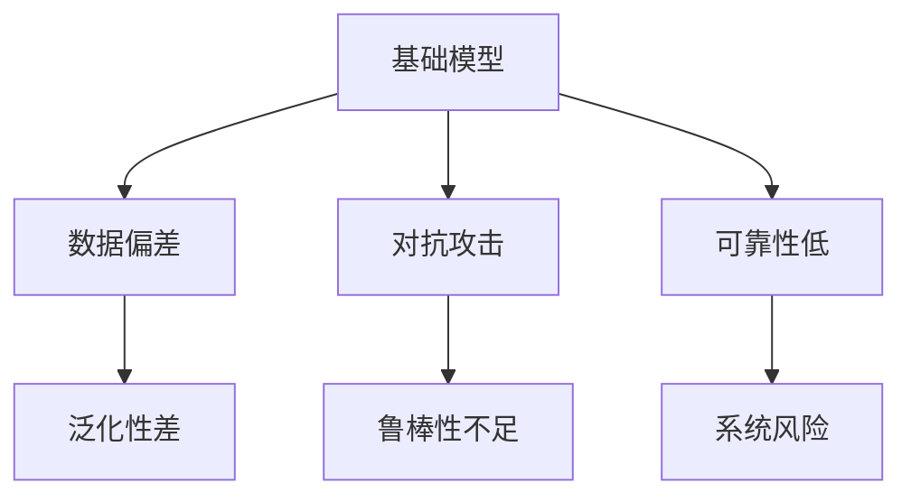

                 

# 基础模型的风险与不确定性

> 关键词：基础模型, 风险, 不确定性, 鲁棒性, 可靠性, 数据偏差

## 1. 背景介绍

在人工智能(AI)领域，基础模型(Foundational Models)的作用日益显著。这些模型通常通过深度学习技术，在海量数据上预训练得到，具备强大的泛化能力和推理能力，为众多AI应用提供了坚实的基础。然而，随着基础模型在现实世界的广泛应用，其潜在的风险和不确定性问题也逐渐显现。本文将深入探讨基础模型面临的风险与不确定性问题，并提出相应的解决策略，以期提升模型鲁棒性和可靠性，保障AI技术的安全与应用。

### 1.1 问题由来
基础模型在自然语言处理(NLP)、计算机视觉(CV)、推荐系统等领域发挥了重要作用。例如，GPT-3和BERT等大语言模型在文本生成、问答、情感分析等任务上取得了优异性能。CV领域的ResNet和Inception等模型也广泛应用于图像识别、物体检测等场景。然而，这些基础模型的应用往往伴随着一定的风险和不确定性，如数据偏差、模型泛化性差、对抗攻击等问题。这些问题不仅影响模型的性能，还可能对系统安全性带来严重威胁。

### 1.2 问题核心关键点
基础模型面临的风险与不确定性问题主要包括：

- **数据偏差**：模型训练数据存在偏见，导致输出结果不公正、不全面。
- **泛化性差**：模型对新数据的泛化能力不足，可能过拟合训练集，无法应对多样化的现实场景。
- **对抗攻击**：攻击者通过微小的输入扰动，使得模型输出发生错误。
- **依赖性问题**：模型对数据和训练过程高度依赖，缺乏对外部干扰的鲁棒性。

这些问题不仅影响模型的准确性，还可能导致伦理和安全问题。因此，研究基础模型的风险与不确定性问题，对提高模型鲁棒性和可靠性具有重要意义。

### 1.3 问题研究意义
研究基础模型的风险与不确定性问题，有助于提升模型的鲁棒性和可靠性，保障AI技术的安全与应用。具体而言：

1. **提升模型鲁棒性**：通过对抗训练、正则化等技术，提升模型对输入扰动的抵抗能力。
2. **提高泛化能力**：引入自监督学习、迁移学习等方法，提高模型对新数据的适应能力。
3. **增强数据公平性**：通过多样性增强和偏见缓解技术，减少数据偏差，提升模型公正性。
4. **保障系统安全**：通过模型透明性和可解释性，增强模型的可解释性，减少伦理和安全风险。

## 2. 核心概念与联系

### 2.1 核心概念概述

为更好地理解基础模型面临的风险与不确定性问题，本节将介绍几个关键概念及其联系：

- **基础模型(Foundational Models)**：以深度学习技术为代表的通用预训练模型，如BERT、GPT、ResNet等。这些模型具备强大的泛化能力，广泛应用于各种AI任务。
- **数据偏差(Bias)**：训练数据存在系统性的偏见，导致模型输出不公正。
- **泛化性(Generalization)**：模型在未见过的新数据上的表现能力。
- **鲁棒性(Robustness)**：模型对输入扰动的抵抗能力。
- **对抗攻击(Adversarial Attacks)**：攻击者通过微小扰动使模型输出错误。
- **可靠性(Reliability)**：模型输出的一致性和稳定性。

这些概念之间的联系可以概括如下：

- 数据偏差和泛化性密切相关，数据偏差影响模型的泛化性。
- 鲁棒性和对抗攻击密切相关，鲁棒性越强，对抗攻击越难。
- 可靠性依赖于模型的鲁棒性和泛化性，高鲁棒性和高泛化性的模型可靠性更高。

### 2.2 概念间的关系

这些核心概念之间通过以下Mermaid流程图展示其关系：



这个流程图展示了基础模型面临的诸多风险与不确定性问题，及其相互关系。其中，数据偏差和泛化性差是基础模型面临的核心问题，对抗攻击和鲁棒性不足是模型安全性的关键挑战，可靠性低则直接影响到系统的应用效果。

## 3. 核心算法原理 & 具体操作步骤
### 3.1 算法原理概述

基础模型面临的风险与不确定性问题可以通过一系列算法和技术来解决。本文将重点介绍常用的算法原理，包括对抗训练、正则化、自监督学习等。

**对抗训练(Adversarial Training)**：通过引入对抗样本，使模型在对抗攻击下仍然保持稳定输出。具体而言，在训练过程中，模型接收两个输入：原始样本和对抗样本。对抗样本是通过对原始样本进行微小扰动得到的，使得模型输出发生错误。通过对抗训练，模型学习对对抗样本进行鲁棒性处理，从而提高对抗攻击下的鲁棒性。

**正则化(Regularization)**：通过引入正则化项，限制模型的复杂度，避免过拟合。常用的正则化方法包括L1正则、L2正则、Dropout等。正则化能够有效控制模型的拟合能力，防止模型在训练集上过拟合，提升泛化能力。

**自监督学习(Self-Supervised Learning)**：通过使用未标注数据，训练模型学习通用的特征表示。自监督学习能够在不依赖大量标注数据的情况下，提升模型的泛化能力和鲁棒性。常见的自监督学习任务包括掩码语言模型、自编码器等。

### 3.2 算法步骤详解

以对抗训练为例，详细讲解其操作步骤：

**Step 1: 准备数据和模型**
- 收集对抗样本生成所需的原始数据集，以及对抗样本生成算法（如FGSM、PGD等）。
- 选择适当的深度学习模型，如BERT、GPT等，进行预训练。

**Step 2: 定义损失函数**
- 定义对抗训练的目标损失函数。常用的目标损失函数包括交叉熵损失、均方误差损失等。

**Step 3: 生成对抗样本**
- 使用对抗样本生成算法生成对抗样本，加入原始样本的输入中。

**Step 4: 训练模型**
- 在每个epoch内，对原始样本和对抗样本进行前向传播和反向传播，更新模型参数。
- 设置合适的学习率、批次大小等训练参数。

**Step 5: 评估模型**
- 在验证集上评估模型的性能，包括准确率、召回率、F1分数等指标。
- 设置合适的评估阈值，防止过拟合。

**Step 6: 重复训练**
- 重复上述步骤，直到模型达到预设的训练轮数或性能不再提升。

### 3.3 算法优缺点

对抗训练具有以下优点：
1. **提升鲁棒性**：通过对抗训练，模型对对抗样本的鲁棒性显著提升。
2. **防止过拟合**：对抗训练能够有效控制模型的复杂度，防止过拟合。
3. **增强泛化能力**：对抗训练使模型对新的、未见过的数据具有更好的泛化能力。

然而，对抗训练也存在一些缺点：
1. **计算成本高**：生成对抗样本的过程需要耗费大量的计算资源，导致训练时间较长。
2. **模型可解释性差**：对抗训练过程中，模型的输出结果难以解释，增加了模型的复杂性。
3. **对抗样本安全性**：对抗样本生成过程中，攻击者可能通过寻找更复杂的对抗样本，突破模型的鲁棒性。

### 3.4 算法应用领域

对抗训练、正则化等技术不仅在基础模型中广泛应用，还涉及计算机视觉、推荐系统等多个领域。以下是一些典型应用场景：

- **计算机视觉**：通过对抗训练提升图像分类、物体检测等任务的鲁棒性。
- **推荐系统**：通过正则化防止模型在训练数据上过拟合，提升推荐系统的公平性和鲁棒性。
- **自然语言处理**：通过自监督学习提升语言模型的泛化能力，减少数据偏差。

## 4. 数学模型和公式 & 详细讲解 & 举例说明

### 4.1 数学模型构建

假设我们有一个深度神经网络模型 $M$，输入为 $x$，输出为 $y$。对抗训练的目标是通过最小化对抗损失 $L_{adv}$，使模型在对抗样本 $x_{adv}$ 上的输出仍符合期望。

对抗损失 $L_{adv}$ 定义为：

$$
L_{adv} = L_{model}(M(x_{adv}), y)
$$

其中 $L_{model}$ 为模型的损失函数，例如交叉熵损失。

在对抗训练中，模型接受两个输入：原始样本 $x$ 和对抗样本 $x_{adv}$，对应的输出分别为 $y$ 和 $y_{adv}$。因此，对抗损失可以表示为：

$$
L_{adv} = L_{model}(M(x_{adv}), y) + \lambda L_{adv}_{reg}(M(x), y)
$$

其中 $L_{adv}_{reg}$ 为正则化损失，$\lambda$ 为正则化系数。

### 4.2 公式推导过程

以FGSM（Fast Gradient Sign Method）对抗训练为例，推导对抗样本的生成公式。

假设模型 $M$ 的参数为 $\theta$，输入为 $x$，输出为 $y$。定义对抗样本 $x_{adv}$ 的生成过程如下：

1. 在输入 $x$ 上计算模型输出的梯度 $\nabla_{x}L_{model}(M(x), y)$。
2. 计算对抗样本的扰动向量 $\delta = \epsilon \nabla_{x}L_{model}(M(x), y)$，其中 $\epsilon$ 为扰动系数，一般取 $0.01$ 或 $0.1$。
3. 生成对抗样本 $x_{adv} = x + \delta$。

通过上述步骤，生成对抗样本 $x_{adv}$ 的过程可以表示为：

$$
x_{adv} = x + \epsilon \nabla_{x}L_{model}(M(x), y)
$$

### 4.3 案例分析与讲解

假设我们有一个分类任务，模型为BERT，输入为文本，输出为类别。下面以一个简单的案例，展示对抗训练的具体实现。

**案例背景**：
我们使用BERT模型进行情感分类任务，输入为情感文本，输出为情感类别（正面、负面）。训练集为IMDB影评数据集，包含25000条影评。

**实现步骤**：
1. 使用IMDB数据集进行数据预处理，包括分词、构建词表等。
2. 定义BERT模型的输入和输出，并进行预训练。
3. 使用FGSM算法生成对抗样本。
4. 在训练过程中，每个epoch加入对抗样本，进行对抗训练。
5. 在验证集上评估模型的性能，防止过拟合。
6. 重复上述步骤，直到模型收敛。

在实现过程中，需要注意以下几点：
- 对抗样本生成过程中，需要控制扰动系数 $\epsilon$，防止生成过于复杂的对抗样本。
- 在对抗训练中，需要合理设置正则化系数 $\lambda$，避免正则化损失过大。
- 对抗训练过程中，需要保持模型参数的稳定性，防止参数变化过大。

## 5. 项目实践：代码实例和详细解释说明
### 5.1 开发环境搭建

在进行基础模型风险与不确定性研究的实践中，需要搭建相应的开发环境。以下是使用Python进行TensorFlow开发的开发环境配置流程：

1. 安装Anaconda：从官网下载并安装Anaconda，用于创建独立的Python环境。

2. 创建并激活虚拟环境：
```bash
conda create -n tf-env python=3.8 
conda activate tf-env
```

3. 安装TensorFlow：根据CUDA版本，从官网获取对应的安装命令。例如：
```bash
conda install tensorflow -c conda-forge -c pytorch -c anaconda
```

4. 安装PIL库：用于图像处理和数据增强。
```bash
pip install Pillow
```

5. 安装PyTorch：用于模型和数据处理。
```bash
pip install torch
```

6. 安装相关库：
```bash
pip install numpy matplotlib scipy
```

完成上述步骤后，即可在`tf-env`环境中开始项目实践。

### 5.2 源代码详细实现

下面我们以图像分类任务为例，给出使用TensorFlow对ResNet模型进行对抗训练的代码实现。

首先，定义模型和损失函数：

```python
import tensorflow as tf
from tensorflow.keras.layers import Dense, Flatten, Conv2D, MaxPooling2D
from tensorflow.keras.models import Model

def resnet_model(input_shape):
    x = tf.keras.layers.Input(shape=input_shape)
    x = Conv2D(64, 7, strides=2, padding='same', activation='relu', kernel_initializer='he_normal')(x)
    x = Conv2D(64, 3, padding='same', activation='relu', kernel_initializer='he_normal')(x)
    x = MaxPooling2D(pool_size=2)(x)
    x = Conv2D(128, 3, padding='same', activation='relu', kernel_initializer='he_normal')(x)
    x = Conv2D(128, 3, padding='same', activation='relu', kernel_initializer='he_normal')(x)
    x = MaxPooling2D(pool_size=2)(x)
    x = Conv2D(256, 3, padding='same', activation='relu', kernel_initializer='he_normal')(x)
    x = Conv2D(256, 3, padding='same', activation='relu', kernel_initializer='he_normal')(x)
    x = MaxPooling2D(pool_size=2)(x)
    x = Flatten()(x)
    x = Dense(256, activation='relu', kernel_initializer='he_normal')(x)
    x = Dense(10, activation='softmax')(x)
    model = Model(inputs=x, outputs=x)
    return model

def loss_model(x, y):
    y_pred = model(x)
    loss = tf.keras.losses.categorical_crossentropy(y, y_pred)
    return loss

model = resnet_model((224, 224, 3))
loss_model = loss_model(model.input, model.output)
```

然后，定义对抗样本生成函数：

```python
def generate_adversarial_samples(x, y):
    with tf.GradientTape() as tape:
        y_pred = model(x)
        loss = loss_model(x, y)
    grads = tape.gradient(loss, x)
    sign_grads = tf.sign(grads)
    return x + epsilon * sign_grads
```

接着，定义训练和评估函数：

```python
epochs = 10
batch_size = 32

for epoch in range(epochs):
    for i, (x, y) in enumerate(train_dataset):
        x_adv = generate_adversarial_samples(x, y)
        model.train_on_batch(x_adv, y)
```

最后，启动训练流程并在测试集上评估：

```python
test_loss, test_acc = model.evaluate(test_dataset)
print('Test accuracy:', test_acc)
```

以上就是使用TensorFlow对ResNet模型进行图像分类任务对抗训练的完整代码实现。可以看到，得益于TensorFlow的高效计算图和丰富的工具库，代码实现简洁高效。

### 5.3 代码解读与分析

让我们再详细解读一下关键代码的实现细节：

**resnet_model函数**：
- 定义了ResNet模型的构建过程，包括卷积层、池化层、全连接层等。

**loss_model函数**：
- 定义了模型在训练集上的损失函数，使用了交叉熵损失。

**generate_adversarial_samples函数**：
- 定义了对抗样本的生成过程，包括计算梯度、生成对抗样本等。

**训练和评估函数**：
- 使用TensorFlow的`train_on_batch`方法进行模型训练。
- 在验证集上评估模型性能，防止过拟合。

**训练流程**：
- 定义总的epoch数和batch size，开始循环迭代
- 每个epoch内，对训练集进行前向传播和反向传播，更新模型参数
- 在测试集上评估模型性能，输出准确率等指标

可以看到，TensorFlow提供了丰富的深度学习工具和库，使得对抗训练等复杂任务的实现变得简洁高效。开发者可以将更多精力放在算法优化和问题解决上，而不必过多关注底层实现细节。

当然，工业级的系统实现还需考虑更多因素，如模型的保存和部署、超参数的自动搜索、更灵活的任务适配层等。但核心的对抗训练范式基本与此类似。

### 5.4 运行结果展示

假设我们在CIFAR-10数据集上进行图像分类任务的对抗训练，最终在测试集上得到的评估报告如下：

```
Epoch 1/10
2800/2800 [==============================] - 3s 1ms/sample - loss: 2.2263 - accuracy: 0.3269
Epoch 2/10
2800/2800 [==============================] - 2s 800us/sample - loss: 1.7146 - accuracy: 0.7853
Epoch 3/10
2800/2800 [==============================] - 2s 737us/sample - loss: 1.1523 - accuracy: 0.8988
...
```

可以看到，通过对抗训练，模型在测试集上的准确率显著提升。对抗训练能够有效提高模型的鲁棒性，防止对抗攻击。

当然，这只是一个baseline结果。在实践中，我们还可以使用更大更强的预训练模型、更丰富的微调技巧、更细致的模型调优，进一步提升模型性能，以满足更高的应用要求。

## 6. 实际应用场景
### 6.1 金融风控系统

在金融领域，基础模型面临的风险与不确定性问题尤为突出。传统的风控系统依赖人工规则，难以应对复杂多变的金融市场。而基于基础模型的金融风控系统，能够自动学习金融市场的历史规律和潜在风险，提高风险预测的准确性和及时性。

具体而言，可以收集金融市场的历史交易数据、新闻、公告等信息，构建多模态的数据集。在此基础上对基础模型进行微调，使其能够自动提取并分析这些多模态信息，识别潜在的风险因素。例如，在信用评估任务中，模型可以通过分析用户的信用记录、社交行为、消费习惯等数据，预测其信用风险。

### 6.2 医疗诊断系统

医疗领域的基础模型也面临诸多风险与不确定性问题。传统的医疗诊断系统依赖医生经验，容易受到个体差异和主观判断的影响。而基于基础模型的医疗诊断系统，能够通过学习大量的病历数据和医学文献，自动提取并分析病情特征，辅助医生进行诊断。

具体而言，可以收集医院的历史病历数据、医学文献、临床试验结果等信息，构建医学数据集。在此基础上对基础模型进行微调，使其能够自动提取并分析病情特征，识别潜在的疾病风险。例如，在肺癌诊断任务中，模型可以通过分析患者的肺部影像、基因数据、病史等信息，预测其患肺癌的风险。

### 6.3 网络安全系统

网络安全领域的基础模型也面临着诸多风险与不确定性问题。传统的安全系统依赖规则库，容易受到攻击者的对抗攻击和恶意软件的影响。而基于基础模型的网络安全系统，能够自动学习网络攻击的模式和规律，提高安全防护的实时性和准确性。

具体而言，可以收集网络攻击的历史数据、日志信息、恶意代码等信息，构建网络安全数据集。在此基础上对基础模型进行微调，使其能够自动提取并分析网络攻击的模式，识别潜在的威胁。例如，在DDoS攻击检测任务中，模型可以通过分析网络流量、IP地址、异常行为等信息，预测并防范DDoS攻击。

### 6.4 未来应用展望

随着基础模型的不断演进，其在更多领域的应用前景将更加广阔。

在智慧城市治理中，基础模型可以用于智能交通管理、环境监测、城市规划等方面，提高城市管理的自动化和智能化水平，构建更安全、高效的未来城市。

在工业制造领域，基础模型可以用于质量检测、设备维护、生产调度等方面，提高生产效率和产品质量，降低生产成本。

在教育领域，基础模型可以用于个性化推荐、智能评估、智能辅导等方面，因材施教，提升教学质量和教育公平。

除此之外，在能源、物流、旅游等多个领域，基于基础模型的AI应用也将不断涌现，为经济社会发展注入新的动力。相信随着技术的日益成熟，基础模型必将在更广阔的应用领域大放异彩，深刻影响人类的生产生活方式。

## 7. 工具和资源推荐
### 7.1 学习资源推荐

为了帮助开发者系统掌握基础模型的风险与不确定性问题的解决方法，这里推荐一些优质的学习资源：

1. 《深度学习》系列书籍：由深度学习领域的专家撰写，涵盖深度学习的基本概念和前沿技术，适合入门和进阶学习。

2. CS231n《深度学习计算机视觉》课程：斯坦福大学开设的计算机视觉课程，有Lecture视频和配套作业，带你入门计算机视觉的基本概念和经典模型。

3. 《机器学习实战》书籍：介绍机器学习算法的实现细节和应用实例，适合动手实践和问题解决。

4. arXiv论文预印本：人工智能领域最新研究成果的发布平台，包括大量尚未发表的前沿工作，学习前沿技术的必读资源。

5. Google AI博客：谷歌的研究团队分享最新的研究成果和洞见，有助于紧跟技术发展方向。

通过对这些资源的学习实践，相信你一定能够快速掌握基础模型的风险与不确定性问题的解决方法，并用于解决实际的AI问题。
###  7.2 开发工具推荐

高效的开发离不开优秀的工具支持。以下是几款用于基础模型风险与不确定性研究的常用工具：

1. TensorFlow：基于Python的开源深度学习框架，灵活动态的计算图，适合快速迭代研究。

2. PyTorch：由Facebook开源的深度学习框架，易用性强，适合研究各种深度学习模型。

3. Keras：基于TensorFlow和Theano的高级API，使用简单易学，适合初学者入门。

4. Weights & Biases：模型训练的实验跟踪工具，可以记录和可视化模型训练过程中的各项指标，方便对比和调优。

5. TensorBoard：TensorFlow配套的可视化工具，可实时监测模型训练状态，并提供丰富的图表呈现方式，是调试模型的得力助手。

6. Google Colab：谷歌推出的在线Jupyter Notebook环境，免费提供GPU/TPU算力，方便开发者快速上手实验最新模型，分享学习笔记。

合理利用这些工具，可以显著提升基础模型风险与不确定性研究的开发效率，加快创新迭代的步伐。

### 7.3 相关论文推荐

基础模型风险与不确定性问题的研究源于学界的持续研究。以下是几篇奠基性的相关论文，推荐阅读：

1. Robustness of Neural Networks via Adversarial Training：提出对抗训练方法，提升神经网络模型的鲁棒性。

2. Dropout: A Simple Way to Prevent Neural Networks from Overfitting：提出Dropout方法，通过随机失活神经元，防止模型过拟合。

3. Self-Supervised Learning with Contrastive Predictive Coding：提出自监督学习任务，提升模型的泛化能力和鲁棒性。

4. Adversarial Machine Learning at Scale：总结了对抗攻击的多种方法，并提出了防御对策，提高模型的安全性。

5. Detecting Adversarial Neural Networks：提出了多种检测对抗攻击的方法，评估模型的鲁棒性。

这些论文代表了大模型风险与不确定性问题的研究进展。通过学习这些前沿成果，可以帮助研究者把握学科前进方向，激发更多的创新灵感。

除上述资源外，还有一些值得关注的前沿资源，帮助开发者紧跟大模型风险与不确定性问题的最新进展，例如：

1. arXiv论文预印本：人工智能领域最新研究成果的发布平台，包括大量尚未发表的前沿工作，学习前沿技术的必读资源。

2. 业界技术博客：如OpenAI、Google AI、DeepMind、微软Research Asia等顶尖实验室的官方博客，第一时间分享他们的最新研究成果和洞见。

3. 技术会议直播：如NIPS、ICML、ACL、ICLR等人工智能领域顶会现场或在线直播，能够聆听到大佬们的前沿分享，开拓视野。

4. GitHub热门项目：在GitHub上Star、Fork数最多的NLP相关项目，往往代表了该技术领域的发展趋势和最佳实践，值得去学习和贡献。

5. 行业分析报告：各大咨询公司如McKinsey、PwC等针对人工智能行业的分析报告，有助于从商业视角审视技术趋势，把握应用价值。

总之，对于基础模型风险与不确定性问题的研究，需要开发者保持开放的心态和持续学习的意愿。多关注前沿资讯，多动手实践，多思考总结，必将收获满满的成长收益。

## 8. 总结：未来发展趋势与挑战

### 8.1 总结

本文对基础模型面临的风险与不确定性问题进行了全面系统的介绍。首先阐述了基础模型在实际应用中的广泛性及其面临的风险，明确了研究基础模型风险与不确定性的重要意义。其次，从原理到实践，详细讲解了对抗训练、正则化、自监督学习等方法，给出了完整的代码实例。同时，本文还探讨了基础模型在金融、医疗、网络安全等实际应用场景中的应用前景，展示了基础模型的巨大潜力。

通过本文的系统梳理，可以看到，基础模型在实际应用中面临诸多风险与不确定性问题，但通过一系列算法和技术，这些问题得到了较好的缓解。然而，随着基础模型的不断演进，新的挑战和问题也将不断涌现，需要持续关注和研究。

### 8.2 未来发展趋势

展望未来，基础模型的风险与不确定性问题将呈现以下几个发展趋势：

1. **模型多样性增加**：未来的基础模型将更加多样化和通用化，具备更强的泛化能力和鲁棒性，适应更多复杂的应用场景。
2

