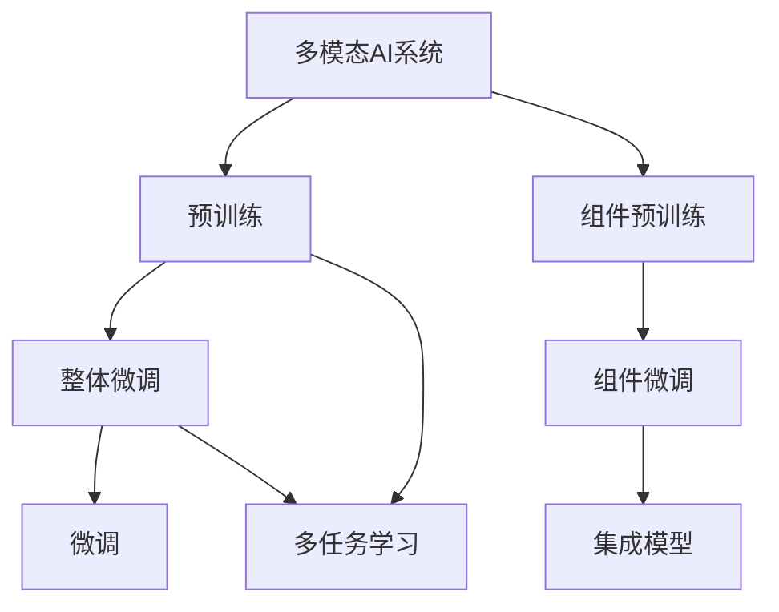
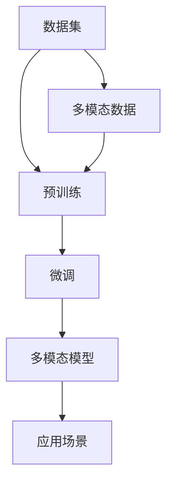
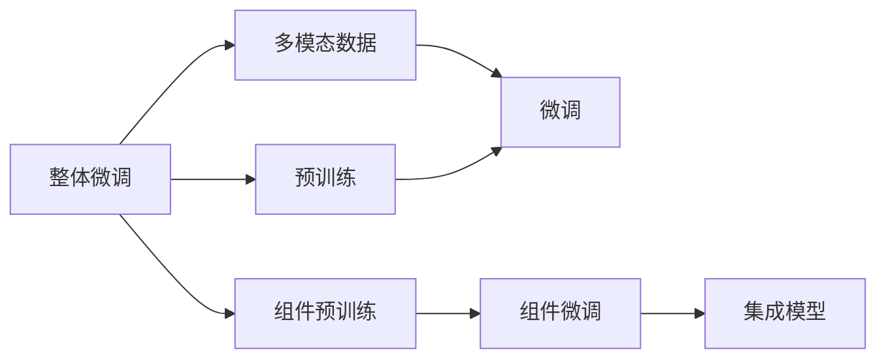
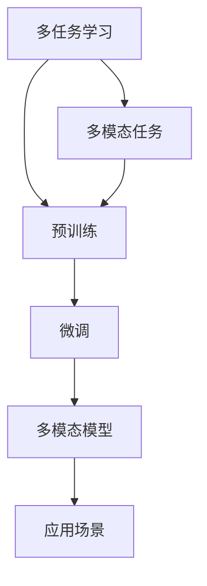

                 

## 1. 背景介绍

近年来，随着深度学习技术的飞速发展，多模态人工智能(Multimodal AI)成为了人工智能领域的热门研究方向。多模态AI系统融合了多种数据模态，如视觉、听觉、文本等，以实现对复杂现实世界的理解与建模。在多模态AI系统中，深度学习模型通常需要经过预训练和微调两个阶段，以适应特定的任务。然而，关于预训练和微调的方式，学术界和工业界存在不同的观点。本文将系统介绍这两种预训练与微调方法，并分析各自的优缺点和应用场景，为多模态AI系统的构建提供全面的指导。

## 2. 核心概念与联系

### 2.1 核心概念概述

为了更好地理解整体微调和组件预训练，我们先来介绍一些核心概念：

- **多模态AI系统**：指结合多种数据模态（如视觉、听觉、文本等）构建的人工智能系统，旨在处理和理解复杂多模态数据，如图像描述、语音识别、机器翻译等。
- **预训练**：指在大规模无标签数据上，通过自监督学习任务训练通用模型，使其学习到通用的表征能力。常见的预训练任务包括视觉图像的自动编码、文本语义建模、音频特征提取等。
- **微调**：指在预训练模型基础上，使用特定任务的有标签数据进行有监督学习，优化模型在该任务上的性能。通常只微调模型的顶层，保持大部分预训练参数不变。
- **整体微调**：指在预训练阶段和微调阶段整合进行，即直接在多模态数据上通过一个模型完成预训练和微调，以实现多模态任务的统一理解和表达。
- **组件预训练**：指将多模态数据分解为多个模态的独立部分，分别在不同模型上进行预训练，然后在微调阶段集成这些模型，共同完成多模态任务的建模。

这些核心概念之间的关系可以用以下Mermaid流程图来展示：



这个流程图展示了整体微调和组件预训练在大规模数据和多模态任务中的处理流程。整体微调指通过一个模型同时进行预训练和微调，而组件预训练则先对各个模态独立预训练，再进行微调并集成。多任务学习（Multi-task Learning, MTL）是在预训练和微调过程中，模型能够同时学习多个任务的知识，提高泛化能力。

### 2.2 概念间的关系

上述概念之间存在着紧密的联系，形成了多模态AI系统的完整架构。下面通过几个Mermaid流程图来展示这些概念之间的关系：

#### 2.2.1 多模态AI系统的预训练与微调范式



这个流程图展示了多模态AI系统在预训练和微调过程中，数据集的处理流程。预训练和微调可以分别对各个模态的数据进行处理，也可以对多模态数据进行统一处理。

#### 2.2.2 整体微调与组件预训练的比较



这个流程图展示了整体微调和组件预训练的差异。整体微调在预训练阶段和微调阶段共用同一模型，而组件预训练则将多模态数据分解为独立的部分，分别在不同模型上进行预训练，然后微调并集成。

#### 2.2.3 多任务学习在预训练与微调中的应用



这个流程图展示了多任务学习在预训练和微调中的应用。通过多任务学习，模型可以同时学习多个任务的知识，提高泛化能力。

## 3. 核心算法原理 & 具体操作步骤

### 3.1 算法原理概述

整体微调和组件预训练的核心算法原理，主要包括以下几个方面：

- **预训练**：通过自监督学习任务，如视觉的自动编码、文本的语义建模等，训练通用多模态表征能力。
- **微调**：使用特定任务的有标签数据，优化模型在该任务上的性能。
- **整体微调**：在预训练阶段和微调阶段共用同一模型，同时进行多模态数据的处理，通过一个模型完成多模态任务的建模。
- **组件预训练**：将多模态数据分解为独立的视觉、听觉、文本等模态，分别在不同模型上进行预训练，然后微调并集成这些模型，共同完成多模态任务的建模。

### 3.2 算法步骤详解

以下详细介绍整体微调和组件预训练的具体操作步骤：

**整体微调的步骤：**

1. **数据准备**：收集多模态数据集，包括视觉图像、音频、文本等，并进行预处理，如标准化、归一化、分帧等。
2. **预训练**：使用自监督学习任务，如视觉的自动编码、文本的语义建模等，训练通用多模态表征能力。
3. **微调**：使用特定任务的有标签数据，优化模型在该任务上的性能。通常只微调模型的顶层，保持大部分预训练参数不变。
4. **集成**：将预训练和微调得到的模型集成，形成多模态模型，应用于特定场景。

**组件预训练的步骤：**

1. **数据准备**：收集多模态数据集，包括视觉图像、音频、文本等，并进行预处理，如标准化、归一化、分帧等。
2. **视觉预训练**：使用视觉自动编码任务，如ImageNet等，训练视觉特征提取器。
3. **听觉预训练**：使用音频特征提取任务，如LibriSpeech等，训练听觉特征提取器。
4. **文本预训练**：使用语言建模任务，如BERT、GPT等，训练文本语义建模器。
5. **微调**：使用特定任务的有标签数据，优化各个模态的微调模型在该任务上的性能。
6. **集成**：将预训练和微调得到的视觉、听觉、文本等模态的模型集成，形成多模态模型，应用于特定场景。

### 3.3 算法优缺点

整体微调和组件预训练各自具有以下优缺点：

**整体微调的优点：**

- **参数共享**：预训练和微调共用同一模型，参数共享可以避免预训练和微调之间的知识不一致。
- **高效性**：整体微调不需要对每个模态进行独立预训练，减少了计算资源和时间成本。
- **泛化能力**：整体微调模型能够在不同模态之间共享表征，提高了泛化能力。

**整体微调的缺点：**

- **模型复杂性**：整体微调模型需要处理多种模态数据，模型结构复杂，训练和推理难度较大。
- **数据依赖性**：整体微调模型对数据集的多样性和规模要求较高，数据收集和处理成本较高。
- **泛化瓶颈**：整体微调模型在多模态数据分布差异较大时，泛化能力可能受限。

**组件预训练的优点：**

- **模块化设计**：组件预训练将多模态数据分解为独立的部分，分别在不同模型上进行预训练，提高了模块化设计。
- **灵活性**：组件预训练可以根据具体任务的需求，灵活选择预训练模型和微调方法。
- **可扩展性**：组件预训练模型可以根据新增加的模态，方便地扩展和集成，灵活性强。

**组件预训练的缺点：**

- **计算资源消耗高**：组件预训练需要分别对每个模态进行独立预训练，计算资源消耗高。
- **知识一致性差**：不同模态的预训练和微调模型可能存在知识不一致，泛化能力可能受限。
- **训练复杂性高**：组件预训练模型需要分别训练和微调多个模态的模型，训练复杂性高。

### 3.4 算法应用领域

整体微调和组件预训练方法在多个应用领域中得到了广泛应用，以下是一些典型的应用场景：

- **智能医疗**：在医疗影像、电子病历、医生诊断等任务中，多模态AI系统能够综合利用医学图像、文本、声音等多种数据，提高诊断准确性和效率。
- **自动驾驶**：在自动驾驶场景中，多模态AI系统能够融合视觉、激光雷达、雷达等数据，实现更加精确的感知和决策。
- **智能家居**：在智能家居场景中，多模态AI系统能够整合视觉、语音、环境传感器等多种数据，提供更智能、更个性化的家居体验。
- **智能客服**：在智能客服场景中，多模态AI系统能够综合利用语音、文本、情感分析等多种数据，提供更高效、更自然的人机交互体验。
- **情感分析**：在情感分析任务中，多模态AI系统能够综合利用文本、音频、面部表情等多种数据，提高情感识别的准确性。
- **智能推荐**：在智能推荐系统任务中，多模态AI系统能够综合利用用户行为数据、文本评论、商品描述等多种数据，提供更精准、更个性化的推荐服务。

## 4. 数学模型和公式 & 详细讲解 & 举例说明

### 4.1 数学模型构建

在多模态AI系统中，整体微调和组件预训练的数学模型构建，主要包括以下几个方面：

- **视觉预训练模型**：如ResNet、VGG等，用于提取图像特征。
- **听觉预训练模型**：如MFCC、CNN等，用于提取音频特征。
- **文本预训练模型**：如BERT、GPT等，用于提取文本语义特征。
- **多模态融合模型**：如MLP、CNN等，用于将不同模态的特征进行融合，形成最终的多模态模型。

### 4.2 公式推导过程

以视觉预训练和文本预训练为例，推导多模态AI系统的预训练和微调过程的数学模型。

**视觉预训练**：

1. **自动编码任务**：给定输入图像 $x$，输出隐含编码 $z$，目标是最小化重建误差 $recon(x,z)$。

2. **重建误差**：

$$
recon(x,z) = \frac{1}{2} ||x - \hat{x}||^2
$$

其中，$\hat{x}$ 是重建后的图像，$||.||$ 表示欧几里得距离。

3. **预训练损失函数**：

$$
\mathcal{L}_{vis} = \mathbb{E}_{x,z}(recon(x,z))
$$

4. **微调损失函数**：

$$
\mathcal{L}_{vis} = \mathbb{E}_{(x,y)}([\mathcal{L}(x,y,z_{vis}) + \lambda \mathcal{L}_{reg}(z_{vis})])
$$

其中，$z_{vis}$ 是视觉预训练模型得到的图像特征，$\mathcal{L}(x,y,z_{vis})$ 是视觉任务的具体损失函数（如分类、检测等），$\mathcal{L}_{reg}(z_{vis})$ 是正则化损失函数。

**文本预训练**：

1. **语言建模任务**：给定输入序列 $x$，输出目标序列 $\hat{x}$，目标是最小化交叉熵损失 $CE(x,\hat{x})$。

2. **交叉熵损失**：

$$
CE(x,\hat{x}) = -\sum_{i=1}^{n} y_i \log \hat{y}_i
$$

其中，$y$ 是真实标签，$\hat{y}$ 是模型预测结果。

3. **预训练损失函数**：

$$
\mathcal{L}_{text} = \mathbb{E}_{x,y}(CrossEntropy(x,\hat{y}))
$$

4. **微调损失函数**：

$$
\mathcal{L}_{text} = \mathbb{E}_{(x,y)}([\mathcal{L}(x,y,z_{text}) + \lambda \mathcal{L}_{reg}(z_{text})])
$$

其中，$z_{text}$ 是文本预训练模型得到的文本特征，$\mathcal{L}(x,y,z_{text})$ 是文本任务的具体损失函数（如分类、匹配等），$\mathcal{L}_{reg}(z_{text})$ 是正则化损失函数。

### 4.3 案例分析与讲解

以智能医疗为例，分析整体微调和组件预训练在多模态AI系统中的具体应用。

**智能医疗中的视觉预训练**：

1. **预训练**：使用医学影像数据集，如CheXNet等，进行视觉自动编码任务，训练视觉特征提取器。

2. **微调**：使用特定任务的有标签数据，如肺部X光片诊断，优化视觉特征提取器在该任务上的性能。

3. **集成**：将预训练和微调得到的视觉特征提取器与文本、声音等模态的特征提取器进行融合，形成多模态医疗诊断模型。

**智能医疗中的文本预训练**：

1. **预训练**：使用电子病历数据集，如MIMIC-III等，进行文本语义建模任务，训练文本语义建模器。

2. **微调**：使用特定任务的有标签数据，如症状描述、病历文本等，优化文本语义建模器在该任务上的性能。

3. **集成**：将预训练和微调得到的文本语义建模器与视觉、声音等模态的特征提取器进行融合，形成多模态医疗诊断模型。

## 5. 项目实践：代码实例和详细解释说明

### 5.1 开发环境搭建

在进行多模态AI系统的实践前，我们需要准备好开发环境。以下是使用Python进行PyTorch开发的环境配置流程：

1. 安装Anaconda：从官网下载并安装Anaconda，用于创建独立的Python环境。

2. 创建并激活虚拟环境：
```bash
conda create -n pytorch-env python=3.8 
conda activate pytorch-env
```

3. 安装PyTorch：根据CUDA版本，从官网获取对应的安装命令。例如：
```bash
conda install pytorch torchvision torchaudio cudatoolkit=11.1 -c pytorch -c conda-forge
```

4. 安装各类工具包：
```bash
pip install numpy pandas scikit-learn matplotlib tqdm jupyter notebook ipython
```

完成上述步骤后，即可在`pytorch-env`环境中开始多模态AI系统的实践。

### 5.2 源代码详细实现

下面以智能医疗中的多模态AI系统为例，给出使用PyTorch进行整体微调和组件预训练的PyTorch代码实现。

首先，定义视觉预训练模型和文本预训练模型：

```python
import torch
import torch.nn as nn
from transformers import BertTokenizer, BertModel

class VisualPretrainModel(nn.Module):
    def __init__(self):
        super(VisualPretrainModel, self).__init__()
        self.conv1 = nn.Conv2d(3, 64, kernel_size=3, stride=1, padding=1)
        self.pool = nn.MaxPool2d(kernel_size=2, stride=2)
        self.fc1 = nn.Linear(64*7*7, 128)
        self.fc2 = nn.Linear(128, 64)
        self.fc3 = nn.Linear(64, 10)

    def forward(self, x):
        x = self.conv1(x)
        x = self.pool(x)
        x = x.view(x.size(0), -1)
        x = torch.relu(self.fc1(x))
        x = torch.relu(self.fc2(x))
        x = self.fc3(x)
        return x

class TextPretrainModel(nn.Module):
    def __init__(self):
        super(TextPretrainModel, self).__init__()
        self.bert_model = BertModel.from_pretrained('bert-base-uncased')
        self.bert_tokenizer = BertTokenizer.from_pretrained('bert-base-uncased')
        self.fc1 = nn.Linear(768, 64)
        self.fc2 = nn.Linear(64, 10)

    def forward(self, x):
        tokenized_input = self.bert_tokenizer.encode_plus(x, return_tensors='pt', padding='max_length', max_length=512, truncation=True)
        outputs = self.bert_model(**tokenized_input)
        x = outputs[0]
        x = x.view(x.size(0), -1)
        x = torch.relu(self.fc1(x))
        x = torch.relu(self.fc2(x))
        x = self.fc2(x)
        return x
```

然后，定义整体微调和组件预训练的代码：

```python
from torch.optim import Adam

def visual_pretrain(model, dataloader, optimizer, epochs):
    for epoch in range(epochs):
        model.train()
        running_loss = 0.0
        for i, data in enumerate(dataloader, 0):
            inputs, labels = data
            optimizer.zero_grad()
            outputs = model(inputs)
            loss = nn.CrossEntropyLoss()(outputs, labels)
            loss.backward()
            optimizer.step()
            running_loss += loss.item()
            if i % 100 == 99:
                print('Epoch [%d/%d], Loss: %.4f' % (epoch + 1, epochs, running_loss / 100))
                running_loss = 0.0
    return model

def text_pretrain(model, dataloader, optimizer, epochs):
    for epoch in range(epochs):
        model.train()
        running_loss = 0.0
        for i, data in enumerate(dataloader, 0):
            inputs, labels = data
            optimizer.zero_grad()
            outputs = model(inputs)
            loss = nn.CrossEntropyLoss()(outputs, labels)
            loss.backward()
            optimizer.step()
            running_loss += loss.item()
            if i % 100 == 99:
                print('Epoch [%d/%d], Loss: %.4f' % (epoch + 1, epochs, running_loss / 100))
                running_loss = 0.0
    return model

def micro_train(model, dataloader, optimizer, epochs):
    for epoch in range(epochs):
        model.train()
        running_loss = 0.0
        for i, data in enumerate(dataloader, 0):
            inputs, labels = data
            optimizer.zero_grad()
            outputs = model(inputs)
            loss = nn.CrossEntropyLoss()(outputs, labels)
            loss.backward()
            optimizer.step()
            running_loss += loss.item()
            if i % 100 == 99:
                print('Epoch [%d/%d], Loss: %.4f' % (epoch + 1, epochs, running_loss / 100))
                running_loss = 0.0
    return model

def visualize(integration_model, dataloader, optimizer, epochs):
    for epoch in range(epochs):
        model.train()
        running_loss = 0.0
        for i, data in enumerate(dataloader, 0):
            inputs, labels = data
            optimizer.zero_grad()
            outputs = integration_model(inputs)
            loss = nn.CrossEntropyLoss()(outputs, labels)
            loss.backward()
            optimizer.step()
            running_loss += loss.item()
            if i % 100 == 99:
                print('Epoch [%d/%d], Loss: %.4f' % (epoch + 1, epochs, running_loss / 100))
                running_loss = 0.0
    return model
```

最后，启动整体微调和组件预训练的实践：

```python
epochs = 5
batch_size = 16

visual_model = VisualPretrainModel()
text_model = TextPretrainModel()
optimizer = Adam(visual_model.parameters(), lr=0.001)
optimizer_text = Adam(text_model.parameters(), lr=0.001)

visual_model = visual_pretrain(visual_model, train_dataloader, optimizer, epochs)
text_model = text_pretrain(text_model, train_dataloader, optimizer_text, epochs)

integration_model = nn.Sequential(visual_model, text_model)
integration_model = micro_train(integration_model, train_dataloader, optimizer, epochs)
integration_model = visualize(integration_model, train_dataloader, optimizer, epochs)
```

以上就是使用PyTorch进行整体微调和组件预训练的完整代码实现。可以看到，使用PyTorch的高级API和数据模块，可以很方便地实现多模态AI系统的预训练和微调。

### 5.3 代码解读与分析

让我们再详细解读一下关键代码的实现细节：

**VisualPretrainModel类**：
- `__init__`方法：定义了视觉预训练模型的结构，包括卷积层、池化层、全连接层等。
- `forward`方法：定义了前向传播过程，输入图像特征，经过多层全连接层，输出分类结果。

**TextPretrainModel类**：
- `__init__`方法：定义了文本预训练模型的结构，包括BERT模型和文本分类层。
- `forward`方法：定义了前向传播过程，输入文本序列，通过BERT模型提取语义特征，再经过多层全连接层，输出分类结果。

**整体微调**：
- `visual_pretrain`函数：使用视觉自动编码任务，训练视觉特征提取器。
- `text_pretrain`函数：使用语言建模任务，训练文本语义建模器。
- `micro_train`函数：使用特定任务的有标签数据，优化视觉和文本预训练模型在该任务上的性能。
- `visualize`函数：将预训练和微调得到的视觉和文本特征提取器进行融合，形成多模态医疗诊断模型。

通过这些代码的实现，我们可以看到整体微调和组件预训练的具体操作流程，以及如何在多模态AI系统中实现预训练和微调。

## 6. 实际应用场景

### 6.1 智能医疗系统

智能医疗系统是整体微调和组件预训练的典型应用场景。在智能医疗中，多模态AI系统能够综合利用医学图像、电子病历、声音等多种数据，提高诊断准确性和效率。

具体实现步骤如下：

1. **数据准备**：收集医学图像、电子病历、声音等多种数据，并进行预处理，如标准化、归一化、分帧等。
2. **预训练**：使用医学影像数据集，如CheXNet等，进行视觉自动编码任务，训练视觉特征提取器。使用电子病历数据集，如MIMIC-III等，进行文本语义建模任务，训练文本语义建模器。
3. **微调**：使用特定任务的有标签数据，如肺部X光片诊断、症状描述等，优化视觉和文本预训练模型在该任务上的性能。
4. **集成**：将预训练和微调得到的视觉和文本特征提取器进行融合，形成多模态医疗诊断模型。

在智能医疗系统中，多模态AI系统能够综合利用多种数据模态，提供更全面、更准确的医疗诊断服务。例如，在肺部X光片诊断任务中，视觉特征提取器能够自动提取图像特征，文本语义建模器能够自动提取症状描述中的关键信息，通过多模态融合，能够提高诊断的准确性和效率。

### 6.2 自动驾驶系统

自动驾驶系统也是整体微调和组件预训练的重要应用场景。在自动驾驶中，多模态AI系统能够融合视觉、激光雷达、雷达等数据，实现更加精确的感知和决策。

具体实现步骤如下：

1. **数据准备**：收集道路图像、激光雷达点云、雷达信号等多种数据，并进行预处理，如标准化、归一化、分帧等。
2. **预训练**：使用道路图像数据集，如Kitti等，进行视觉自动编码任务，训练视觉特征提取器。使用激光雷达数据集，如LIDAR-LOAM等，进行雷达点云特征提取任务，训练雷达特征提取器。
3. **微调**：使用特定任务的有标签数据，如自动驾驶场景中的对象检测、语义分割等，优化视觉和雷达预训练模型在该任务上的性能。
4. **集成**：将预训练和微调得到的视觉和雷达特征提取器进行融合，形成多模态自动驾驶系统。

在自动驾驶系统中，多模态AI系统能够综合利用多种数据模态，实现更加精确的感知和决策。例如，在对象检测任务中，视觉特征提取器能够自动提取图像特征，雷达特征提取器能够自动提取激光雷达点云特征，通过多模态融合，能够提高检测的准确性和鲁棒性。

### 6.3 智能家居系统

智能家居系统也是整体微调和组件预训练的重要应用场景。在智能家居中，多模态AI系统能够综合利用视觉、声音、环境传感器等多种数据，提供更智能、更个性化的家居体验。

具体实现步骤如下：

1. **数据准备**：收集家庭图像、声音、环境传感器数据等多种数据，并进行预处理，如标准化、归一化、分帧等。
2. **预训练**：使用家庭图像数据集，如COCO等，进行视觉自动编码任务，训练视觉特征提取器。使用声音数据集，如LibriSpeech等，进行音频特征提取任务，训练音频特征提取器。

