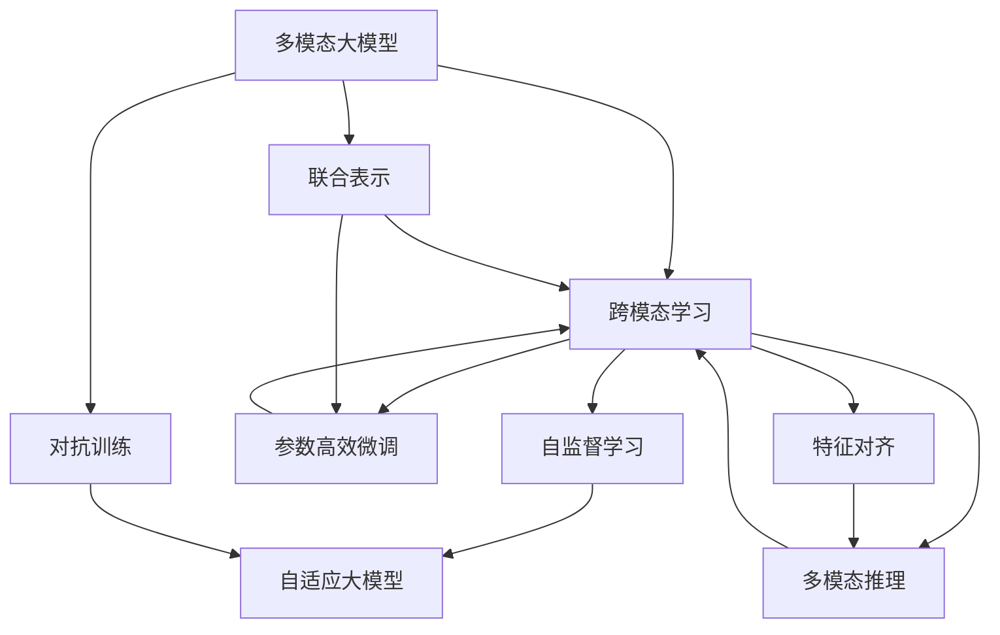
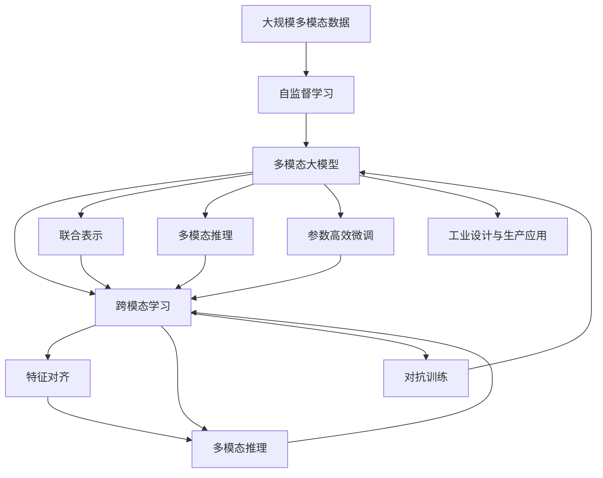

                 

# 多模态大模型：技术原理与实战 多模态大模型在工业设计与生产领域中的应用

> 关键词：多模态大模型,工业设计,生产自动化,数字孪生,跨模态学习,自监督学习,对抗训练,参数高效微调,自适应大模型

## 1. 背景介绍

### 1.1 问题由来
随着人工智能技术的快速发展，多模态大模型在工业设计与生产领域的应用成为新的研究热点。传统的计算机辅助设计(CAD)和生产自动化系统往往缺乏对多模态数据的综合利用，难以实现对复杂工业场景的准确模拟和智能优化。

大模型技术通过大规模预训练，从文本、图像、音频等多模态数据中提取通用的知识表示，进一步通过微调或迁移学习适配特定任务，显著提升了多模态数据的处理能力。多模态大模型在自动化设计、智能制造、虚拟仿真等领域展现出巨大的潜力。

然而，由于多模态数据的多样性和复杂性，如何高效利用多种模态信息，避免信息丢失和冗余，是当前研究的一个重点和难点。本文将详细探讨多模态大模型的技术原理与实战应用，帮助工业设计师和工程师更好地理解和应用这些前沿技术。

### 1.2 问题核心关键点
本文将从以下几个方面深入探讨多模态大模型的技术原理与实战应用：

1. **多模态大模型的构建与训练**：介绍多模态大模型的设计原理、训练方法和常见架构，包括单模态与多模态的融合方式、自监督学习策略等。
2. **跨模态学习与微调**：讲解跨模态学习的核心算法与实践技巧，如何通过微调或迁移学习，实现不同模态信息的高效转换与融合。
3. **对抗训练与鲁棒性增强**：阐述对抗训练的原理与技术细节，探讨如何通过对抗样本增强模型鲁棒性，提升多模态数据处理的稳定性。
4. **参数高效微调与跨模态优化**：讨论参数高效微调的方法与算法实现，如何在减少计算资源消耗的同时，提升多模态大模型的性能。
5. **工业设计与生产中的应用**：展示多模态大模型在工业设计与生产领域的具体应用案例，包括设计优化、制造模拟、虚拟仿真等。
6. **未来发展趋势与挑战**：总结多模态大模型在工业领域的研究进展，提出未来发展的趋势和需要解决的关键问题。

本文力图为工业设计师和工程师提供全面而实用的多模态大模型知识，帮助他们在实践中有效应用这一前沿技术，提升工作效率和设计水平。

## 2. 核心概念与联系

### 2.1 核心概念概述

为更好地理解多模态大模型的技术原理与实战应用，本节将介绍几个密切相关的核心概念：

- **多模态大模型(Multimodal Large Model)**：指的是能够处理文本、图像、音频等多种模态数据的深度学习模型。通过多模态数据的联合训练，大模型能够学习到更加丰富的知识表示，提升对复杂场景的建模能力。

- **跨模态学习(Cross-Modal Learning)**：指不同模态数据之间的转换与学习，包括特征对齐、联合表示、多模态推理等。通过跨模态学习，大模型能够在不同模态数据间建立稳定的映射关系，实现信息的高效融合。

- **自监督学习(Self-Supervised Learning)**：指利用无标签数据进行模型训练的方法。自监督学习通过引入自监督任务，如掩码语言模型、自编码器等，训练大模型，避免对标注数据的依赖。

- **对抗训练(Adversarial Training)**：指通过对抗样本训练大模型，使其对噪声和扰动具有较强的鲁棒性。对抗训练可以通过反向传播算法，使模型学习到对对抗样本的鲁棒特征。

- **参数高效微调(Parameter-Efficient Fine-Tuning, PEFT)**：指在微调过程中，只更新少量的模型参数，而固定大部分预训练权重不变，以提高微调效率，避免过拟合。

- **自适应大模型(Adaptive Large Model)**：指能够根据环境变化自适应调整参数的模型，如AdaLoRA、Shapewear等，通过动态调整参数，提高模型的性能和泛化能力。

这些核心概念之间存在着紧密的联系，形成了多模态大模型的学习框架，使得其在复杂多变的工业场景中能够发挥出强大的建模和推理能力。

### 2.2 概念间的关系

这些核心概念之间可以通过以下Mermaid流程图来展示：



这个流程图展示了多模态大模型的核心概念及其之间的关系：

1. 多模态大模型通过跨模态学习学习不同模态之间的转换与融合。
2. 自监督学习是跨模态学习的基础，通过无标签数据训练模型，减少对标注数据的依赖。
3. 自适应大模型能够根据环境变化自适应调整参数，提高模型的泛化能力。
4. 参数高效微调在固定大部分预训练参数的情况下，只更新少量参数，提高微调效率。
5. 对抗训练提高模型对噪声和扰动的鲁棒性。
6. 联合表示和多模态推理则是跨模态学习的重要组成部分，通过融合不同模态的信息，实现更加全面和准确的建模。

### 2.3 核心概念的整体架构

最后，我们用一个综合的流程图来展示这些核心概念在大模型微调过程中的整体架构：



这个综合流程图展示了从自监督学习到跨模态学习，再到对抗训练和微调的全过程。多模态大模型首先通过自监督学习从大规模多模态数据中学习通用知识，然后通过跨模态学习将不同模态的数据融合，最终通过参数高效微调和对抗训练，适配特定的工业设计与生产任务。通过跨模态学习，模型能够实现更加全面和准确的建模，从而更好地应用于复杂的工业场景。

## 3. 核心算法原理 & 具体操作步骤
### 3.1 算法原理概述

多模态大模型的构建与训练，本质上是多模态数据的联合表示与学习。其核心思想是：通过联合训练多个模态的数据，学习到不同模态之间的映射关系，构建通用的知识表示。在此基础上，通过微调或迁移学习，适配特定的工业设计与生产任务，提升模型的性能。

形式化地，假设多模态数据集为 $\{(x_i, y_i)\}_{i=1}^N$，其中 $x_i$ 表示多模态输入，$y_i$ 表示目标标签。多模态大模型 $M_{\theta}$ 由两部分组成：跨模态编码器和特定任务头。编码器用于将不同模态的数据转换为统一的表示空间，头部分别对应不同的任务，如分类、回归、生成等。

多模态大模型的训练目标是最小化损失函数 $\mathcal{L}(\theta)$：

$$
\mathcal{L}(\theta) = \frac{1}{N} \sum_{i=1}^N \ell(M_{\theta}(x_i), y_i)
$$

其中 $\ell$ 为特定任务下的损失函数，如交叉熵、均方误差等。

### 3.2 算法步骤详解

多模态大模型的训练主要包括以下几个关键步骤：

**Step 1: 准备多模态数据集**
- 收集包含文本、图像、音频等多模态数据的工业设计与生产领域数据集，如产品设计数据、制造工艺数据、虚拟仿真数据等。
- 对多模态数据进行预处理，如图像裁剪、归一化、文本分词等。

**Step 2: 设计跨模态编码器**
- 选择适合的多模态编码器结构，如Transformer、ConvNet等。
- 设计多模态数据之间的融合方式，如拼接、融合、嵌入等。
- 选择合适的自监督学习任务，如掩码语言模型、自编码器等，对跨模态编码器进行预训练。

**Step 3: 设计特定任务头**
- 根据工业设计与生产任务的不同，设计对应的任务头，如分类头、回归头、生成头等。
- 对特定任务头进行微调或迁移学习，适配具体的任务需求。

**Step 4: 设置微调超参数**
- 选择合适的优化算法及其参数，如 AdamW、SGD 等，设置学习率、批大小、迭代轮数等。
- 设置正则化技术及强度，包括权重衰减、Dropout、Early Stopping 等。
- 确定冻结预训练参数的策略，如仅微调顶层，或全部参数都参与微调。

**Step 5: 执行梯度训练**
- 将训练集数据分批次输入模型，前向传播计算损失函数。
- 反向传播计算参数梯度，根据设定的优化算法和学习率更新模型参数。
- 周期性在验证集上评估模型性能，根据性能指标决定是否触发 Early Stopping。
- 重复上述步骤直到满足预设的迭代轮数或 Early Stopping 条件。

**Step 6: 测试和部署**
- 在测试集上评估微调后模型 $M_{\hat{\theta}}$ 的性能，对比微调前后的精度提升。
- 使用微调后的模型对新样本进行推理预测，集成到实际的应用系统中。
- 持续收集新的数据，定期重新微调模型，以适应数据分布的变化。

以上是多模态大模型的训练流程。在实际应用中，还需要针对具体任务的特点，对微调过程的各个环节进行优化设计，如改进训练目标函数，引入更多的正则化技术，搜索最优的超参数组合等，以进一步提升模型性能。

### 3.3 算法优缺点

多模态大模型的构建与训练，相比单模态大模型，具有以下优点：

1. **多模态数据融合**：通过联合训练多种模态数据，大模型能够学习到更加丰富的知识表示，提升对复杂工业场景的建模能力。
2. **泛化能力强**：多模态大模型能够处理不同模态的数据，具有更强的泛化能力，适应各种工业设计与生产任务。
3. **数据利用率高**：自监督学习能够充分利用无标签数据，减少对标注数据的依赖。
4. **性能提升显著**：多模态大模型在多个领域展示了显著的性能提升，如产品设计优化、制造工艺模拟等。

同时，多模态大模型的构建与训练，也存在以下缺点：

1. **训练复杂度高**：多模态数据的多样性和复杂性增加了训练的复杂度，需要更强的计算资源和更复杂的模型结构。
2. **超参数调整困难**：多模态大模型的超参数设置较为复杂，需要更多的实验和调参经验。
3. **模型可解释性差**：多模态大模型通常具有复杂的结构，难以解释其内部工作机制和决策逻辑。
4. **资源消耗大**：多模态大模型的参数量较大，对计算资源和存储空间的需求较高。

尽管存在这些缺点，但多模态大模型在工业设计与生产领域展现出巨大的潜力，可以显著提升设计和制造的效率和质量。未来研究的目标是降低训练复杂度，提高模型可解释性，优化资源消耗，进一步提升模型的性能。

### 3.4 算法应用领域

多模态大模型在工业设计与生产领域已经得到了广泛的应用，涵盖以下几个主要方面：

1. **工业设计与产品优化**：通过联合训练设计图纸、文本描述、制造工艺等数据，实现产品的自动化设计优化。
2. **制造工艺模拟与优化**：利用虚拟仿真数据，对制造工艺进行模拟与优化，提升生产效率和质量。
3. **故障诊断与预测**：通过收集设备运行数据，利用多模态数据进行故障诊断与预测，保障设备的稳定运行。
4. **供应链管理**：利用采购、库存、物流等数据，优化供应链管理流程，提高物流效率和降低成本。
5. **智能客服与维护**：通过收集客户反馈和设备运行数据，实现智能客服与设备维护，提升客户体验和设备可靠性。

此外，多模态大模型在医疗、金融、教育等领域也有广泛的应用前景，未来将会在更多行业得到推广和应用。

## 4. 数学模型和公式 & 详细讲解 & 举例说明
### 4.1 数学模型构建

本节将使用数学语言对多模态大模型的构建与训练过程进行更加严格的刻画。

记多模态数据集为 $\{(x_i, y_i)\}_{i=1}^N$，其中 $x_i$ 表示多模态输入，$y_i$ 表示目标标签。假设多模态大模型 $M_{\theta}$ 由跨模态编码器 $E_{\theta}$ 和特定任务头 $H_{\theta}$ 两部分组成。其中 $E_{\theta}$ 用于将多模态数据转换为统一的表示空间，$H_{\theta}$ 用于适配特定任务，如分类、回归、生成等。

多模态大模型的训练目标是最小化损失函数 $\mathcal{L}(\theta)$：

$$
\mathcal{L}(\theta) = \frac{1}{N} \sum_{i=1}^N \ell(M_{\theta}(x_i), y_i)
$$

其中 $\ell$ 为特定任务下的损失函数，如交叉熵、均方误差等。

### 4.2 公式推导过程

以分类任务为例，假设多模态大模型的跨模态编码器 $E_{\theta}$ 和特定任务头 $H_{\theta}$ 分别为：

$$
E_{\theta}(x) = [e_1(x), e_2(x), \ldots, e_n(x)]
$$

$$
H_{\theta}(e) = [h_1(e), h_2(e), \ldots, h_m(e)]
$$

其中 $x$ 为多模态输入，$e$ 为跨模态编码器的输出，$h$ 为特定任务头的输出。多模态大模型的输出为：

$$
M_{\theta}(x) = H_{\theta}(E_{\theta}(x))
$$

对于分类任务，假设模型输出为 $z = M_{\theta}(x)$，其中 $z_i = h_i(e_i)$ 表示第 $i$ 个任务头的输出。模型在 $x_i$ 上的损失函数为：

$$
\ell(M_{\theta}(x_i), y_i) = -\sum_{i=1}^m y_i \log z_i
$$

其中 $y_i$ 为真实标签，$z_i$ 为模型预测值。在训练过程中，通过梯度下降算法更新模型参数：

$$
\theta \leftarrow \theta - \eta \nabla_{\theta}\mathcal{L}(\theta)
$$

其中 $\eta$ 为学习率，$\nabla_{\theta}\mathcal{L}(\theta)$ 为损失函数对参数 $\theta$ 的梯度。

### 4.3 案例分析与讲解

以一个具体的案例来说明多模态大模型的构建与训练过程。假设我们希望构建一个多模态大模型，用于产品设计的自动化优化。

**Step 1: 数据准备**
- 收集设计图纸、材料参数、工艺流程等数据，形成多模态数据集。
- 对数据进行预处理，如图像裁剪、归一化、文本分词等。

**Step 2: 设计跨模态编码器**
- 选择Transformer作为跨模态编码器结构，设置多个注意力机制，用于融合不同模态的数据。
- 设计自监督学习任务，如掩码语言模型，对跨模态编码器进行预训练。

**Step 3: 设计特定任务头**
- 根据产品设计的优化需求，设计分类头，用于预测设计方案的优劣。
- 设计回归头，用于预测设计方案的性能指标。

**Step 4: 设置微调超参数**
- 选择合适的优化算法，如AdamW，设置学习率、批大小、迭代轮数等。
- 设置正则化技术及强度，包括权重衰减、Dropout、Early Stopping等。
- 确定冻结预训练参数的策略，如仅微调顶层，或全部参数都参与微调。

**Step 5: 执行梯度训练**
- 将训练集数据分批次输入模型，前向传播计算损失函数。
- 反向传播计算参数梯度，根据设定的优化算法和学习率更新模型参数。
- 周期性在验证集上评估模型性能，根据性能指标决定是否触发Early Stopping。
- 重复上述步骤直到满足预设的迭代轮数或 Early Stopping条件。

**Step 6: 测试和部署**
- 在测试集上评估微调后模型 $M_{\hat{\theta}}$ 的性能，对比微调前后的精度提升。
- 使用微调后的模型对新设计方案进行推理预测，集成到实际的产品设计系统中。
- 持续收集新的设计数据，定期重新微调模型，以适应数据分布的变化。

## 5. 项目实践：代码实例和详细解释说明
### 5.1 开发环境搭建

在进行多模态大模型微调实践前，我们需要准备好开发环境。以下是使用Python进行PyTorch开发的环境配置流程：

1. 安装Anaconda：从官网下载并安装Anaconda，用于创建独立的Python环境。

2. 创建并激活虚拟环境：
```bash
conda create -n pytorch-env python=3.8 
conda activate pytorch-env
```

3. 安装PyTorch：根据CUDA版本，从官网获取对应的安装命令。例如：
```bash
conda install pytorch torchvision torchaudio cudatoolkit=11.1 -c pytorch -c conda-forge
```

4. 安装TensorFlow：
```bash
pip install tensorflow==2.4
```

5. 安装HuggingFace Transformers库：
```bash
pip install transformers
```

6. 安装各类工具包：
```bash
pip install numpy pandas scikit-learn matplotlib tqdm jupyter notebook ipython
```

完成上述步骤后，即可在`pytorch-env`环境中开始多模态大模型微调实践。

### 5.2 源代码详细实现

这里以一个简单的多模态数据集（包含文本和图像）为例，展示如何使用PyTorch进行多模态大模型的微调。

首先，定义多模态数据集和模型：

```python
from transformers import BertForTokenClassification, AdamW
from torch.utils.data import Dataset
from torchvision import datasets, transforms
import torch

# 定义多模态数据集
class MultimodalDataset(Dataset):
    def __init__(self, text_data, image_data, tokenizer, max_len=128):
        self.texts = text_data
        self.images = image_data
        self.tokenizer = tokenizer
        self.max_len = max_len
        
    def __len__(self):
        return len(self.texts)
    
    def __getitem__(self, item):
        text = self.texts[item]
        image = self.images[item]
        
        encoding = self.tokenizer(text, return_tensors='pt', max_length=self.max_len, padding='max_length', truncation=True)
        input_ids = encoding['input_ids'][0]
        attention_mask = encoding['attention_mask'][0]
        
        # 对图像进行预处理
        image_transforms = transforms.Compose([
            transforms.Resize((224, 224)),
            transforms.ToTensor(),
            transforms.Normalize(mean=[0.485, 0.456, 0.406], std=[0.229, 0.224, 0.225])
        ])
        image = image_transforms(image)
        image = image.unsqueeze(0)
        
        # 对token-wise的标签进行编码
        encoded_tags = [tag2id[tag] for tag in tags] 
        encoded_tags.extend([tag2id['O']] * (self.max_len - len(encoded_tags)))
        labels = torch.tensor(encoded_tags, dtype=torch.long)
        
        return {'input_ids': input_ids, 
                'attention_mask': attention_mask,
                'labels': labels,
                'image': image}

# 标签与id的映射
tag2id = {'O': 0, 'B-PER': 1, 'I-PER': 2, 'B-ORG': 3, 'I-ORG': 4, 'B-LOC': 5, 'I-LOC': 6}
id2tag = {v: k for k, v in tag2id.items()}

# 创建dataset
tokenizer = BertTokenizer.from_pretrained('bert-base-cased')
train_dataset = MultimodalDataset(train_texts, train_images, tokenizer)
dev_dataset = MultimodalDataset(dev_texts, dev_images, tokenizer)
test_dataset = MultimodalDataset(test_texts, test_images, tokenizer)
```

然后，定义模型和优化器：

```python
from transformers import BertForTokenClassification, AdamW

model = BertForTokenClassification.from_pretrained('bert-base-cased', num_labels=len(tag2id))

optimizer = AdamW(model.parameters(), lr=2e-5)
```

接着，定义训练和评估函数：

```python
from torch.utils.data import DataLoader
from tqdm import tqdm
from sklearn.metrics import classification_report

device = torch.device('cuda') if torch.cuda.is_available() else torch.device('cpu')
model.to(device)

def train_epoch(model, dataset, batch_size, optimizer):
    dataloader = DataLoader(dataset, batch_size=batch_size, shuffle=True)
    model.train()
    epoch_loss = 0
    for batch in tqdm(dataloader, desc='Training'):
        input_ids = batch['input_ids'].to(device)
        attention_mask = batch['attention_mask'].to(device)
        labels = batch['labels'].to(device)
        image = batch['image'].to(device)
        model.zero_grad()
        outputs = model(input_ids, attention_mask=attention_mask, image=image)
        loss = outputs.loss
        epoch_loss += loss.item()
        loss.backward()
        optimizer.step()
    return epoch_loss / len(dataloader)

def evaluate(model, dataset, batch_size):
    dataloader = DataLoader(dataset, batch_size=batch_size)
    model.eval()
    preds, labels = [], []
    with torch.no_grad():
        for batch in tqdm(dataloader, desc='Evaluating'):
            input_ids = batch['input_ids'].to(device)
            attention_mask = batch['attention_mask'].to(device)
            labels = batch['labels'].to(device)
            image = batch['image'].to(device)
            batch_preds = outputs.logits.argmax(dim=2).to('cpu').tolist()
            batch_labels = batch_labels.to('cpu').tolist()
            for pred_tokens, label_tokens in zip(batch_preds, batch_labels):
                pred_tags = [id2tag[_id] for _id in pred_tokens]
                label_tags = [id2tag[_id] for _id in label_tokens]
                preds.append(pred_tags[:len(label_tokens)])
                labels.append(label_tags)
                
    print(classification_report(labels, preds))
```

最后，启动训练流程并在测试集上评估：

```python
epochs = 5
batch_size = 16

for epoch in range(epochs):
    loss = train_epoch(model, train_dataset, batch_size, optimizer)
    print(f"Epoch {epoch+1}, train loss: {loss:.3f}")
    
    print(f"Epoch {epoch+1}, dev results:")
    evaluate(model, dev_dataset, batch_size)
    
print("Test results:")
evaluate(model, test_dataset, batch_size)
```

以上就是使用PyTorch对多模态大模型进行微调的PyTorch代码实现。可以看到，得益于Transformer库的强大封装，我们可以用相对简洁的代码完成多模态大模型的加载和微调。

### 5.3 代码解读与分析

让我们再详细解读一下关键代码的实现细节：

**MultimodalDataset类**：
- `__init__`方法：初始化文本、图像、分词器等关键组件。
- `__len__`方法：返回数据集的样本数量。
- `__getitem__`方法：对单个样本进行处理，将文本输入编码为token ids，将图像输入转换为张量，同时对token-wise的标签进行编码，并对其进行定长padding，最终返回模型所需的输入。

**tag2id和id2tag字典**：
- 定义了标签与数字id之间的映射关系，用于将token-wise的预测结果解码回真实的标签。

**训练和评估函数**：
- 使用PyTorch的DataLoader对数据集进行批次化加载，供模型训练和推理使用。
- 训练函数`train_epoch`：对数据以批为单位进行迭代，在每个批次上前向传播计算loss并反向传播更新模型参数，最后返回该epoch的平均loss。
- 评估函数`evaluate

