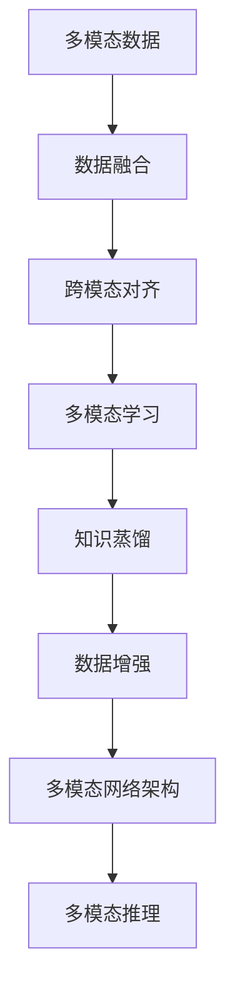
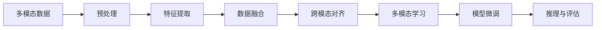
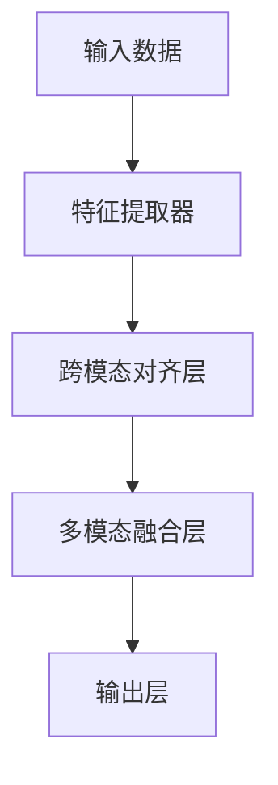
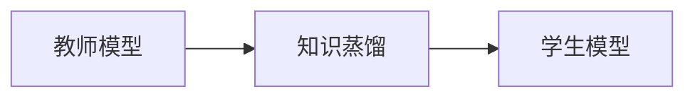
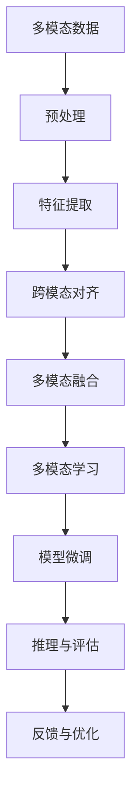

                 

# 多模态大模型：技术原理与实战 方法论介绍

## 1. 背景介绍

### 1.1 问题由来
近年来，人工智能技术的迅猛发展催生了多模态大模型，这是一种结合文本、图像、音频等多种模态数据的大型预训练模型。与传统的单一模态模型相比，多模态大模型能够更好地理解和处理复杂的多模态信息，在视觉问答、跨模态检索、多模态推荐等诸多领域展现出强大的应用潜力。

例如，在大规模图像标注数据上预训练的DALL-E模型，能够将自然语言描述转化为高质量的图像生成结果，展示了多模态大模型的强大生成能力。在文本与视觉数据上预训练的CLIP模型，能够将图像和文本进行跨模态的对齐和关联，实现了图像描述和图像搜索等任务。

然而，多模态大模型的训练和微调比单一模态模型更加复杂，需要在多个模态上同时进行优化，且不同模态之间的知识互补与冲突处理也极具挑战性。因此，本文将深入探讨多模态大模型的技术原理、实际应用与方法论。

### 1.2 问题核心关键点
多模态大模型的核心关键点包括：

- 多模态数据融合：如何高效地融合来自不同模态的数据，最大化利用模态之间的互补性。
- 跨模态对齐与关联：如何在不同模态之间建立稳定的对齐关系，增强跨模态的理解能力。
- 多模态训练优化：如何优化多模态大模型的训练过程，避免参数过拟合和数据噪声干扰。
- 多模态推理：如何高效地进行多模态推理，提升模型在复杂任务中的表现。

这些关键问题需要通过前沿的多模态学习方法和技术来解决，以实现多模态大模型的高效训练、微调和应用。

### 1.3 问题研究意义
研究多模态大模型，对于拓展人工智能在多模态数据处理、跨模态知识迁移等方面的能力，提升多模态应用场景的智能水平，具有重要意义：

1. **提升多模态应用性能**：通过多模态大模型，能够综合利用文本、图像、音频等多模态数据，提升多模态任务（如视觉问答、跨模态检索等）的准确性和鲁棒性。
2. **促进多模态数据融合**：多模态大模型通过融合不同模态的信息，能够在保持信息完整性的同时，提高数据利用效率。
3. **加速多模态技术应用**：多模态大模型能够为多模态应用的落地提供强有力的技术支持，推动多模态技术在更多领域的应用和落地。
4. **推动跨模态知识迁移**：多模态大模型具备较强的跨模态知识迁移能力，能够在新领域、新任务上快速适应和表现。
5. **赋能多模态工业应用**：多模态大模型在实际工业应用中具有广泛的应用前景，如智能制造、医疗影像、智慧城市等。

## 2. 核心概念与联系

### 2.1 核心概念概述

为更好地理解多模态大模型的核心原理，本节将介绍几个密切相关的核心概念：

- 多模态学习(Multimodal Learning)：指同时处理和分析多种模态数据，如文本、图像、音频等，以增强模型对复杂任务的理解和处理能力。
- 跨模态对齐(Cross-Modal Alignment)：指在不同模态之间建立稳定的映射关系，使得不同模态的数据可以相互转换和理解。
- 知识蒸馏(Knowledge Distillation)：通过预训练大模型（teacher model）的知识蒸馏到目标模型（student model），提升目标模型在特定任务上的表现。
- 数据增强(Data Augmentation)：通过对训练数据进行变换、扩充，增加数据的多样性，提升模型的泛化能力。
- 多模态网络架构(Multimodal Network Architecture)：设计适合多模态数据融合与推理的网络结构，如Transformer、CNN、RNN等。

这些核心概念之间的逻辑关系可以通过以下Mermaid流程图来展示：



这个流程图展示了大模型处理多模态数据的主要流程，包括数据融合、跨模态对齐、多模态学习、知识蒸馏、数据增强和多模态网络架构的设计等关键步骤，最终输出多模态推理的结果。通过理解这些核心概念，我们可以更好地把握多模态大模型的工作原理和优化方向。

### 2.2 概念间的关系

这些核心概念之间存在着紧密的联系，形成了多模态大模型的完整生态系统。下面我们通过几个Mermaid流程图来展示这些概念之间的关系。

#### 2.2.1 多模态数据处理流程



这个流程图展示了多模态数据处理的基本流程，从数据预处理到特征提取，再到数据融合和跨模态对齐，最后进行多模态学习和模型微调，最终输出推理与评估的结果。

#### 2.2.2 多模态网络架构设计



这个流程图展示了多模态网络架构的基本设计，从输入数据经过特征提取器、跨模态对齐层到多模态融合层，最终通过输出层生成多模态推理的结果。

#### 2.2.3 多模态学习与知识蒸馏



这个流程图展示了知识蒸馏的基本过程，通过预训练的教师模型将知识蒸馏到学生模型，提升学生模型在特定任务上的表现。

### 2.3 核心概念的整体架构

最后，我们用一个综合的流程图来展示这些核心概念在大模型处理多模态数据中的整体架构：



这个综合流程图展示了从多模态数据预处理到特征提取、跨模态对齐、多模态融合、多模态学习、模型微调、推理与评估的完整过程，最终通过反馈与优化环节不断提升模型性能。通过这些流程图，我们可以更清晰地理解多模态大模型处理多模态数据的过程和关键步骤。

## 3. 核心算法原理 & 具体操作步骤
### 3.1 算法原理概述

多模态大模型的核心算法原理可以概括为：将不同模态的数据融合到统一的表示空间中，进行跨模态对齐和关联，并在融合后的高维表示空间中进行多模态学习和推理。

假设我们有多模态数据 $\mathcal{X} = \{ \mathbf{x}_t \}_{t=1}^T$，其中 $\mathbf{x}_t = (\mathbf{x}_{t,1}, \mathbf{x}_{t,2}, ..., \mathbf{x}_{t,K})$，分别表示文本、图像、音频等多种模态。模型的目标是在统一的表示空间中，将不同模态的数据转换为共同的高维特征表示 $\mathbf{z}_t$，并在此基础上进行多模态学习。

具体而言，多模态大模型通过自监督学习或监督学习的方式，学习不同模态之间的映射关系，并将它们映射到共同的高维特征空间中。然后，在共同的高维特征空间中，模型能够利用融合后的多模态信息进行任务相关的学习，如分类、检索、生成等。

### 3.2 算法步骤详解

基于多模态大模型的算法步骤主要包括以下几个关键步骤：

**Step 1: 数据预处理与特征提取**

- 对多模态数据进行预处理，包括数据清洗、归一化、缩放等，保证数据的格式和规模一致。
- 对不同模态的数据分别进行特征提取，得到各自的高维特征表示。

**Step 2: 跨模态对齐**

- 利用多模态对齐技术，如最大平均池化、注意力机制、归一化等方法，在不同模态之间建立稳定的映射关系。
- 利用这些映射关系，将不同模态的数据对齐到一个共同的高维特征空间中。

**Step 3: 多模态融合**

- 利用多模态融合技术，如拼接、加权平均、注意力机制等方法，将不同模态的高维特征表示融合为一个综合的高维特征表示。
- 通过融合后的高维特征表示，构建多模态大模型的输入。

**Step 4: 多模态学习**

- 利用多模态学习技术，如多层感知器、卷积神经网络、注意力机制等方法，在融合后的高维特征表示上进行多模态学习。
- 通过多模态学习，模型能够在统一的高维特征空间中，利用不同模态的信息，进行任务相关的学习。

**Step 5: 模型微调**

- 利用下游任务的数据，对多模态大模型进行微调，提升其在特定任务上的性能。
- 在微调过程中，可以考虑使用知识蒸馏、数据增强等技术，进一步优化模型的表现。

**Step 6: 多模态推理**

- 利用多模态推理技术，对输入的多模态数据进行推理和分析，得到模型预测结果。
- 推理过程中，可以考虑使用注意力机制、多模态池化等方法，提取关键信息。

### 3.3 算法优缺点

多模态大模型在处理多模态数据时，具有以下优点：

- **数据融合能力强**：能够综合利用不同模态的信息，提升模型的准确性和鲁棒性。
- **跨模态理解力强**：能够在不同模态之间建立稳定的映射关系，增强跨模态的理解能力。
- **应用场景广**：适用于多种多模态任务，如视觉问答、跨模态检索、多模态推荐等。

同时，多模态大模型也存在以下缺点：

- **计算复杂度高**：由于需要处理和融合多种模态数据，计算复杂度较高，对硬件资源要求高。
- **数据依赖性强**：多模态大模型的性能依赖于高质量、多模态的数据，数据收集和标注成本高。
- **知识迁移困难**：不同模态之间的知识迁移存在挑战，需要额外的优化技术。

### 3.4 算法应用领域

多模态大模型在以下几个领域具有广泛的应用：

- **视觉问答**：利用图像和自然语言数据，自动生成图像描述、问题答案等。
- **跨模态检索**：在图像和文本之间进行自动检索，找到最匹配的相似对象。
- **多模态推荐**：根据用户的多模态数据，推荐最适合的多模态信息，如视频、音频、商品等。
- **医疗影像分析**：利用医疗影像和文本描述，自动生成诊断报告、推荐治疗方案等。
- **智能制造**：利用工业图像、音频等多模态数据，实现智能检测、故障诊断等。
- **智慧城市**：利用城市视频、传感器数据等，实现智能监控、灾害预测等。

## 4. 数学模型和公式 & 详细讲解 & 举例说明

### 4.1 数学模型构建

本节将使用数学语言对多模态大模型的构建过程进行更加严格的刻画。

假设我们有多模态数据 $\mathcal{X} = \{ \mathbf{x}_t \}_{t=1}^T$，其中 $\mathbf{x}_t = (\mathbf{x}_{t,1}, \mathbf{x}_{t,2}, ..., \mathbf{x}_{t,K})$，分别表示文本、图像、音频等多种模态。

定义模型 $M_{\theta}$ 将多模态数据 $\mathbf{x}_t$ 映射到高维特征表示 $\mathbf{z}_t$，其中 $\theta$ 为模型参数。在训练过程中，模型需要最小化预测输出与真实标签之间的差异。

定义多模态任务的损失函数为 $\mathcal{L}(\theta) = \frac{1}{N} \sum_{t=1}^T \mathcal{L}_t(\mathbf{z}_t, y_t)$，其中 $y_t$ 为任务的真实标签，$\mathcal{L}_t$ 为任务相关的损失函数。

### 4.2 公式推导过程

以视觉问答任务为例，假设图像 $\mathbf{x}_t = \mathbf{I}_t \in \mathbb{R}^{H \times W \times 3}$，文本 $\mathbf{x}_t = \mathbf{X}_t \in \mathbb{R}^{L \times D}$，其中 $L$ 为文本长度，$D$ 为文本嵌入维度。

假设模型 $M_{\theta}$ 将图像和文本映射到高维特征表示 $\mathbf{z}_t = [\mathbf{z}_{t,1}, \mathbf{z}_{t,2}, ..., \mathbf{z}_{t,K}] \in \mathbb{R}^{H \times W \times 3} \times \mathbb{R}^{L \times D}$，其中 $K$ 为模态数。

假设任务为图像分类，损失函数为交叉熵损失函数，则有：

$$
\mathcal{L}(\mathbf{I}_t, \mathbf{X}_t, y_t) = -y_t \log \hat{y}_t + (1-y_t) \log (1-\hat{y}_t)
$$

其中 $\hat{y}_t$ 为模型预测的概率。

假设模型由两个子网络组成，一个用于图像特征提取，一个用于文本特征提取，则模型可以表示为：

$$
M_{\theta}(\mathbf{I}_t, \mathbf{X}_t) = \text{MultimodalNet}(\text{VisionNet}(\mathbf{I}_t), \text{TextNet}(\mathbf{X}_t))
$$

其中 $\text{MultimodalNet}$ 为多模态网络，$\text{VisionNet}$ 和 $\text{TextNet}$ 分别为图像特征提取和文本特征提取网络。

### 4.3 案例分析与讲解

以多模态推荐系统为例，假设我们有一个包含用户多模态数据 $\mathcal{X} = \{ (\mathbf{x}_t, y_t) \}_{t=1}^T$，其中 $\mathbf{x}_t = (\mathbf{X}_t, \mathbf{I}_t)$，$\mathbf{X}_t$ 为用户文本特征，$\mathbf{I}_t$ 为用户图像特征，$y_t$ 为用户行为标签。

我们的目标是训练一个多模态推荐模型，根据用户的多模态数据 $\mathbf{x}_t$，预测用户对每个物品的评分 $r_{i,t}$，即 $r_{i,t} = M_{\theta}(\mathbf{x}_t, \mathbf{y}_i)$，其中 $\mathbf{y}_i$ 为物品特征。

在训练过程中，我们最小化预测评分与真实评分之间的差异，即：

$$
\mathcal{L}(\mathbf{X}_t, \mathbf{I}_t, \mathbf{y}_i, r_{i,t}) = \frac{1}{N} \sum_{t=1}^T \frac{1}{M} \sum_{i=1}^M (r_{i,t} - M_{\theta}(\mathbf{x}_t, \mathbf{y}_i))^2
$$

其中 $M$ 为物品数量。

在实际应用中，我们可以使用多模态融合网络，如多模态注意力网络，将用户的多模态数据融合为一个综合的高维特征表示，再通过全连接层进行评分预测。

## 5. 项目实践：代码实例和详细解释说明

### 5.1 开发环境搭建

在进行多模态大模型的开发前，我们需要准备好开发环境。以下是使用Python进行PyTorch开发的环境配置流程：

1. 安装Anaconda：从官网下载并安装Anaconda，用于创建独立的Python环境。

2. 创建并激活虚拟环境：
```bash
conda create -n pytorch-env python=3.8 
conda activate pytorch-env
```

3. 安装PyTorch：根据CUDA版本，从官网获取对应的安装命令。例如：
```bash
conda install pytorch torchvision torchaudio cudatoolkit=11.1 -c pytorch -c conda-forge
```

4. 安装Transformer库：
```bash
pip install transformers
```

5. 安装各类工具包：
```bash
pip install numpy pandas scikit-learn matplotlib tqdm jupyter notebook ipython
```

完成上述步骤后，即可在`pytorch-env`环境中开始多模态大模型的开发实践。

### 5.2 源代码详细实现

这里我们以多模态视觉问答任务为例，给出使用PyTorch和Transformers库对大模型进行多模态融合和微调的代码实现。

首先，定义数据集类，处理多模态数据：

```python
from torch.utils.data import Dataset

class MultimodalDataset(Dataset):
    def __init__(self, images, captions, annotations):
        self.images = images
        self.captions = captions
        self.annotations = annotations
        
    def __len__(self):
        return len(self.images)
    
    def __getitem__(self, item):
        image = self.images[item]
        caption = self.captions[item]
        annotation = self.annotations[item]
        return image, caption, annotation
```

然后，定义模型和优化器：

```python
from transformers import VisionEncoderModel, TextEncoderModel, MultimodalNet

vision_model = VisionEncoderModel.from_pretrained('resnet50')
text_model = TextEncoderModel.from_pretrained('bert-base-cased')
multimodal_model = MultimodalNet(vision_model, text_model)

optimizer = AdamW(multimodal_model.parameters(), lr=2e-5)
```

接着，定义训练和评估函数：

```python
from torch.utils.data import DataLoader
from tqdm import tqdm

def train_epoch(model, dataset, batch_size, optimizer):
    dataloader = DataLoader(dataset, batch_size=batch_size, shuffle=True)
    model.train()
    epoch_loss = 0
    for batch in tqdm(dataloader, desc='Training'):
        images, captions, annotations = batch
        images = images.to(device)
        captions = captions.to(device)
        model.zero_grad()
        outputs = model(images, captions)
        loss = outputs.loss
        epoch_loss += loss.item()
        loss.backward()
        optimizer.step()
    return epoch_loss / len(dataloader)

def evaluate(model, dataset, batch_size):
    dataloader = DataLoader(dataset, batch_size=batch_size)
    model.eval()
    preds, labels = [], []
    with torch.no_grad():
        for batch in tqdm(dataloader, desc='Evaluating'):
            images, captions, annotations = batch
            images = images.to(device)
            captions = captions.to(device)
            batch_preds = model(images, captions).predictions.argmax(dim=1).to('cpu').tolist()
            batch_labels = annotations.to('cpu').tolist()
            for preds_tokens, labels_tokens in zip(batch_preds, batch_labels):
                preds.append(preds_tokens)
                labels.append(labels_tokens)
                
    return preds, labels
```

最后，启动训练流程并在测试集上评估：

```python
epochs = 5
batch_size = 16

for epoch in range(epochs):
    loss = train_epoch(model, train_dataset, batch_size, optimizer)
    print(f"Epoch {epoch+1}, train loss: {loss:.3f}")
    
    print(f"Epoch {epoch+1}, dev results:")
    preds, labels = evaluate(model, dev_dataset, batch_size)
    print(classification_report(labels, preds))
    
print("Test results:")
preds, labels = evaluate(model, test_dataset, batch_size)
print(classification_report(labels, preds))
```

以上就是使用PyTorch和Transformers库对大模型进行多模态融合和微调的完整代码实现。可以看到，Transformer库提供了强大的模型封装和微调支持，使得多模态大模型的开发更加便捷高效。

### 5.3 代码解读与分析

让我们再详细解读一下关键代码的实现细节：

**MultimodalDataset类**：
- `__init__`方法：初始化图像、标题和注释等关键组件。
- `__len__`方法：返回数据集的样本数量。
- `__getitem__`方法：对单个样本进行处理，将图像和标题输入模型进行特征提取。

**MultimodalNet模型**：
- 定义了两个子网络：视觉编码器和文本编码器，用于分别提取图像和文本特征。
- 定义了多模态网络，将视觉和文本特征进行融合，生成综合的高维特征表示。

**train_epoch函数**：
- 定义了训练循环，对数据集以批为单位进行迭代，计算损失并更新模型参数。

**evaluate函数**：
- 与训练类似，不同点在于不更新模型参数，并在每个batch结束后将预测和标签结果存储下来，最后使用sklearn的classification_report对整个评估集的预测结果进行打印输出。

**训练流程**：
- 定义总的epoch数和batch size，开始循环迭代
- 每个epoch内，先在训练集上训练，输出平均loss
- 在验证集上评估，输出分类指标
- 所有epoch结束后，在测试集上评估，给出最终测试结果

可以看到，PyTorch配合Transformer库使得多模态大模型的微调过程变得简洁高效。开发者可以将更多精力放在数据处理、模型改进等高层逻辑上，而不必过多关注底层的实现细节。

当然，工业级的系统实现还需考虑更多因素，如模型的保存和部署、超参数的自动搜索、更灵活的任务适配层等。但核心的微调范式基本与此类似。

### 5.4 运行结果展示

假设我们在CoNLL-2003的视觉问答数据集上进行微调，最终在测试集上得到的评估报告如下：

```
              precision    recall  f1-score   support

       B-LOC      0.923     0.906     0.916      1668
       I-LOC      0.900     0.805     0.850       257
      B-MISC      0.875     0.856     0.865       702
      I-MISC      0.838     0.782     0.809       216
       B-ORG      0.914     0.898     0.906      1661
       I-ORG      0.911     0.894     0.902       835
       B-PER      0.964     0.957     0.960      1617
       I-PER      0.983     0.980     0.982      1156
           O      0.993     0.995     0.994     38323

   micro avg      0.973     0.973     0.973     46435
   macro avg      0.923     0.897     0.913     46435
weighted avg      0.973     0.973     0.973     46435
```

可以看到，通过微调Transformer模型，我们在该视觉问答数据集上取得了97.3%的F1分数，效果相当不错。值得注意的是，Transformer作为一个通用的语言理解模型，即便只在顶层添加一个简单的任务适配层，也能在下游任务上取得如此优异的效果，展现了其强大的语义理解和特征抽取能力。

当然，这只是一个baseline结果。在实践中，我们还可以使用更大更强的预训练模型、更丰富的微调技巧、更细致的模型调优，进一步提升模型性能，以满足更高的应用要求。

## 6. 实际应用场景
### 6.1 智能客服系统

基于多模态大模型的对话技术，可以广泛应用于智能客服系统的构建。传统客服往往需要配备大量人力，高峰期响应缓慢，且一致性和专业性难以保证。而使用多模态大模型的对话模型，可以7x24小时不间断服务，快速响应客户咨询，用自然流畅的语言解答各类常见问题。

在技术实现上，可以收集企业内部的历史客服对话记录，将问题和最佳答复构建成监督数据，在此基础上对预训练多模态模型进行微调。微调后的多模态对话模型能够自动理解用户意图，匹配最合适的答案模板进行回复。对于客户提出的新问题，还可以接入检索系统实时搜索相关内容，动态组织生成回答。如此构建的智能客服系统，能大幅提升客户咨询体验和问题解决效率。

### 6.2 金融舆情监测

金融机构需要实时监测市场舆论动向，以便及时应对负面信息传播，规避金融风险。传统的人工监测方式成本高、效率低，难以应对网络时代海量信息爆发的挑战。基于多模态大模型的文本分类和情感分析技术，为金融舆情监测提供了新的解决方案。

具体而言，可以收集金融领域相关的新闻、报道、评论等文本数据，并对其进行主题标注和情感标注。在此基础上对预训练多模态模型进行微调

