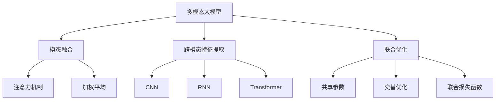
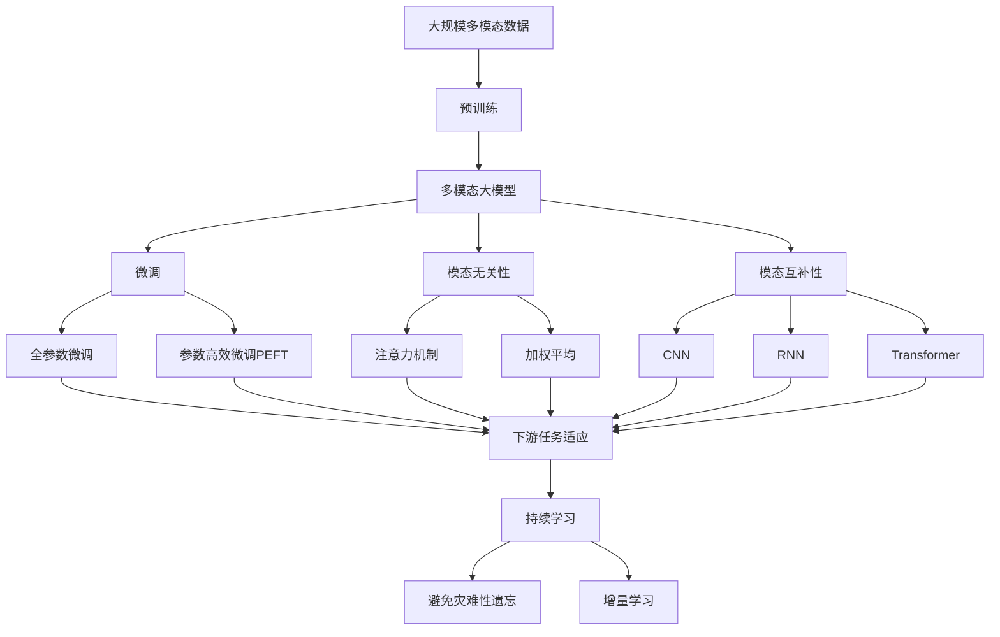

                 

# 多模态大模型：技术原理与实战 视频多模态技术

> 关键词：多模态大模型, 视频多模态, 技术原理, 实战技巧

## 1. 背景介绍

### 1.1 问题由来
近年来，随着计算机视觉和自然语言处理技术的飞速发展，多模态大模型（Multimodal Large Model, MLM）成为了人工智能领域的一大热点。与单一模态模型不同，多模态模型可以同时处理文本、图像、视频等多种类型的数据，能够融合多种信息源，从而更好地理解和表达复杂的人类感知与认知。在视频内容生成、智能推荐、跨模态检索等任务中，多模态模型展现了显著的优势，引起了学术界和产业界的广泛关注。

在工业界，随着视频数据的爆炸式增长和用户对视频内容需求的日益提升，视频多模态技术的需求愈发迫切。然而，多模态数据的复杂性和多样性使得传统的深度学习方法难以直接应用。本文旨在系统介绍多模态大模型的技术原理，并通过实战案例，展示多模态大模型在视频内容生成等领域的实战技巧。

### 1.2 问题核心关键点
多模态大模型的核心技术包括模态融合、跨模态特征提取、联合优化等。其核心在于如何高效地融合多模态信息，使得模型能够同时学习到文本、图像、视频等多种类型的数据的语义表示，从而提升跨模态任务的性能。

核心技术点包括：
- **模态融合**：通过注意力机制、加权平均等方法，将不同模态的数据进行融合。
- **跨模态特征提取**：利用卷积神经网络（CNN）、递归神经网络（RNN）等，从不同模态中提取出有意义的特征表示。
- **联合优化**：通过共享参数、交替优化等方法，联合训练多模态模型，使得各模态的特征表示具有一致性。

本文将详细阐述这些关键技术的原理，并通过实际案例，展示多模态大模型在视频内容生成等领域的实战应用。

### 1.3 问题研究意义
多模态大模型的研究不仅能够提升跨模态任务的性能，还能够促进跨学科知识融合，推动计算机视觉与自然语言处理领域的深度交叉，具有重要的理论和实际意义。具体而言：

1. **融合多模态信息**：多模态大模型能够同时处理文本、图像、视频等多种数据类型，使得模型能够更好地理解和表达人类感知的多样性和复杂性。
2. **提升跨模态任务性能**：通过融合多模态信息，多模态大模型在视频内容生成、智能推荐、跨模态检索等任务中取得了显著的性能提升。
3. **推动领域交叉发展**：多模态大模型的研究促进了计算机视觉与自然语言处理领域的深度交叉，为其他交叉学科（如医学、社交网络等）提供了新的研究范式和技术手段。
4. **推动技术产业化**：多模态大模型的研究加速了相关技术的产业化进程，推动了智能推荐系统、视频内容生成系统等的开发和应用。
5. **提升用户体验**：多模态大模型能够提供更加丰富、自然的用户体验，提升用户对智能系统的满意度。

## 2. 核心概念与联系

### 2.1 核心概念概述

为了更好地理解多模态大模型的技术原理和实战技巧，本节将介绍几个密切相关的核心概念：

- **多模态大模型**：指能够同时处理多种模态数据（如文本、图像、视频）的大规模预训练模型。通过在大规模多模态数据上进行预训练，学习到多种模态的信息融合表示，具备强大的跨模态理解和生成能力。

- **模态融合**：指将不同模态的数据进行有效融合，使得模型能够同时学习到多种类型的数据的语义表示。常见的融合方法包括注意力机制、加权平均、多头自注意力等。

- **跨模态特征提取**：指从不同模态的数据中提取出有意义的特征表示。常见的特征提取方法包括卷积神经网络（CNN）、递归神经网络（RNN）、Transformer等。

- **联合优化**：指联合训练多模态模型，使得各模态的特征表示具有一致性。常见的联合优化方法包括共享参数、交替优化、联合损失函数等。

- **模态无关性**：指模型能够在不同模态间进行有效的信息传递和融合，不受特定模态信息的限制。

- **模态互补性**：指不同模态之间存在信息互补性，能够提供更加全面、准确的信息表示。

这些核心概念之间存在着紧密的联系，构成了多模态大模型的基本框架。通过理解这些概念，我们可以更好地把握多模态大模型的工作原理和优化方向。

### 2.2 概念间的关系

这些核心概念之间存在着紧密的联系，形成了多模态大模型的完整生态系统。下面我们通过几个Mermaid流程图来展示这些概念之间的关系：



这个流程图展示了大模型、模态融合、跨模态特征提取和联合优化等核心概念之间的关系：

1. 多模态大模型通过模态融合、跨模态特征提取和联合优化，学习到多种模态的信息融合表示，从而提升跨模态任务的性能。
2. 模态融合方法包括注意力机制、加权平均等，使得模型能够同时学习到多种类型的数据的语义表示。
3. 跨模态特征提取方法包括CNN、RNN、Transformer等，从不同模态中提取出有意义的特征表示。
4. 联合优化方法包括共享参数、交替优化、联合损失函数等，使得各模态的特征表示具有一致性。

### 2.3 核心概念的整体架构

最后，我们用一个综合的流程图来展示这些核心概念在大模型微调过程中的整体架构：



这个综合流程图展示了从预训练到微调，再到持续学习的完整过程。多模态大模型首先在大规模多模态数据上进行预训练，然后通过微调（包括全参数微调和参数高效微调）来优化模型在特定任务上的性能。同时，通过模态无关性和模态互补性，模型能够在不同模态间进行有效的信息传递和融合。最终，通过持续学习技术，模型可以不断更新和适应新的任务和数据。

## 3. 核心算法原理 & 具体操作步骤
### 3.1 算法原理概述

多模态大模型的核心算法原理主要涉及模态融合、跨模态特征提取和联合优化三个方面。下面将分别阐述这三个关键点的原理。

#### 3.1.1 模态融合

模态融合是实现多模态信息融合的核心技术，通过注意力机制、加权平均等方法，将不同模态的数据进行融合。以下是两种常见的模态融合方法：

1. **多头注意力机制**：通过多头自注意力机制，对不同模态的信息进行加权平均。多头注意力机制可以将每个模态的表示向量进行线性变换，然后计算自注意力得分，最后对得分进行归一化，得到加权平均后的融合向量。

2. **加权平均**：通过对不同模态的特征向量进行加权平均，生成融合向量。加权平均方法可以通过线性变换、指数函数等方法，对不同模态的特征向量进行加权，然后求和得到融合向量。

#### 3.1.2 跨模态特征提取

跨模态特征提取是将不同模态的数据转换为相同表示的过程。以下是几种常见的跨模态特征提取方法：

1. **卷积神经网络（CNN）**：通过卷积操作，对图像等模态数据进行特征提取。CNN可以捕捉局部特征，对图像等模态数据进行有效的特征提取。

2. **递归神经网络（RNN）**：通过递归操作，对文本等模态数据进行特征提取。RNN可以捕捉序列信息，对文本等模态数据进行有效的特征提取。

3. **Transformer**：通过自注意力机制，对文本、图像等模态数据进行特征提取。Transformer可以捕捉全局信息，对多种模态数据进行有效的特征提取。

#### 3.1.3 联合优化

联合优化是实现多模态模型一致性的关键技术。以下是几种常见的联合优化方法：

1. **共享参数**：将不同模态的特征提取器共享参数，使得模型能够在不同模态间进行有效的信息传递和融合。

2. **交替优化**：在联合训练过程中，交替更新不同模态的特征提取器和融合器。交替优化可以避免模型在优化过程中出现数据依赖性，提高模型的稳定性和泛化能力。

3. **联合损失函数**：通过联合损失函数，将不同模态的任务损失函数进行加权求和，使得模型能够同时优化多种任务。

### 3.2 算法步骤详解

多模态大模型的训练主要涉及预训练和微调两个阶段。下面将详细介绍这两个阶段的算法步骤。

#### 3.2.1 预训练

预训练是利用大规模多模态数据，训练通用多模态大模型。以下是预训练的主要步骤：

1. **数据准备**：准备大规模多模态数据集，包括文本、图像、视频等多种类型的数据。

2. **模型初始化**：选择适当的预训练模型，如Multimodal BERT、GloVe等，初始化模型参数。

3. **联合训练**：通过联合优化方法，对不同模态的特征提取器和融合器进行联合训练。

4. **保存模型**：将训练好的模型保存下来，用于后续微调。

#### 3.2.2 微调

微调是利用下游任务的数据，对预训练模型进行适应性训练，提升模型在特定任务上的性能。以下是微调的主要步骤：

1. **数据准备**：准备下游任务的数据集，包括文本、图像、视频等多种类型的数据。

2. **任务适配**：根据任务类型，设计合适的任务适配层，如分类器、生成器等。

3. **设置超参数**：选择适当的优化算法、学习率、批大小等超参数。

4. **执行训练**：使用微调数据集，对预训练模型进行有监督的训练，更新模型参数。

5. **评估模型**：在测试集上评估模型性能，调整超参数，继续训练。

6. **部署模型**：将训练好的模型部署到实际应用系统中，进行推理预测。

### 3.3 算法优缺点

多模态大模型具有以下优点：

1. **融合多模态信息**：多模态大模型能够同时处理文本、图像、视频等多种数据类型，提升跨模态任务的性能。

2. **提升泛化能力**：多模态大模型通过联合训练，具有更强的泛化能力，能够更好地应对多种数据类型的变化。

3. **减少标注需求**：多模态大模型通过预训练和微调，能够显著减少标注数据的需求。

4. **提高推理效率**：多模态大模型通过参数高效微调等技术，可以显著提高推理效率，减少计算成本。

5. **易于扩展**：多模态大模型可以通过增加模态类型和数据量，进一步提升模型的性能。

然而，多模态大模型也存在一些缺点：

1. **模型复杂度高**：多模态大模型的参数量较大，模型结构复杂，难以解释。

2. **训练难度大**：多模态大模型的联合训练和微调难度较大，需要较高的计算资源和数据量。

3. **数据依赖性强**：多模态大模型对数据的质量和多样性要求较高，数据依赖性强。

4. **过拟合风险高**：多模态大模型在微调过程中容易出现过拟合，需要采取一定的正则化措施。

5. **资源消耗高**：多模态大模型的训练和推理需要较高的计算资源和存储空间，成本较高。

### 3.4 算法应用领域

多模态大模型已经在多个领域得到了广泛的应用，例如：

1. **视频内容生成**：利用多模态大模型，生成高质量的视频内容，如视频字幕、视频描述等。

2. **智能推荐系统**：通过多模态大模型，对用户的多模态数据进行联合分析，提升推荐系统的精准度和个性化水平。

3. **跨模态检索**：利用多模态大模型，实现不同模态数据之间的跨模态检索和匹配。

4. **医学影像分析**：通过多模态大模型，对医学影像进行分析和诊断，提高医疗诊断的准确性和效率。

5. **社交媒体分析**：利用多模态大模型，对社交媒体上的文本、图片、视频等多模态数据进行综合分析，洞察用户行为和情感变化。

6. **语音识别**：通过多模态大模型，实现语音识别和转录，提升语音交互的智能化水平。

7. **智能家居**：利用多模态大模型，实现对家庭场景的全面感知和智能化控制。

## 4. 数学模型和公式 & 详细讲解 & 举例说明

### 4.1 数学模型构建

在多模态大模型的训练过程中，需要构建数学模型来描述模型的训练过程和优化目标。以下是多模态大模型的数学模型构建方法。

#### 4.1.1 损失函数

多模态大模型的损失函数通常由多个子任务损失函数组成，具体如下：

1. **文本分类任务**：使用交叉熵损失函数，计算模型输出与真实标签之间的差异。

$$
\ell_{text}(y, \hat{y}) = -\sum_{i=1}^N y_i \log \hat{y}_i
$$

2. **图像分类任务**：使用交叉熵损失函数，计算模型输出与真实标签之间的差异。

$$
\ell_{image}(y, \hat{y}) = -\sum_{i=1}^N y_i \log \hat{y}_i
$$

3. **视频分类任务**：使用交叉熵损失函数，计算模型输出与真实标签之间的差异。

$$
\ell_{video}(y, \hat{y}) = -\sum_{i=1}^N y_i \log \hat{y}_i
$$

4. **联合损失函数**：通过联合优化方法，将不同模态的损失函数进行加权求和，得到联合损失函数。

$$
\ell_{joint} = \alpha \ell_{text} + \beta \ell_{image} + \gamma \ell_{video}
$$

其中，$\alpha$、$\beta$、$\gamma$为不同模态损失函数的权重系数。

### 4.2 公式推导过程

以下是多模态大模型联合损失函数的推导过程：

1. **文本分类损失函数**：假设文本分类任务有$N$个样本，模型输出为$\hat{y}$，真实标签为$y$。

$$
\ell_{text}(y, \hat{y}) = -\sum_{i=1}^N y_i \log \hat{y}_i
$$

2. **图像分类损失函数**：假设图像分类任务有$M$个样本，模型输出为$\hat{y}$，真实标签为$y$。

$$
\ell_{image}(y, \hat{y}) = -\sum_{i=1}^M y_i \log \hat{y}_i
$$

3. **视频分类损失函数**：假设视频分类任务有$P$个样本，模型输出为$\hat{y}$，真实标签为$y$。

$$
\ell_{video}(y, \hat{y}) = -\sum_{i=1}^P y_i \log \hat{y}_i
$$

4. **联合损失函数**：假设文本、图像、视频三个模态的任务权重分别为$\alpha$、$\beta$、$\gamma$，则联合损失函数为：

$$
\ell_{joint} = \alpha \ell_{text} + \beta \ell_{image} + \gamma \ell_{video}
$$

其中，$\alpha$、$\beta$、$\gamma$为不同模态损失函数的权重系数，可以根据实际应用场景进行调整。

### 4.3 案例分析与讲解

假设我们有一个多模态数据集，包含文本、图像、视频等多种类型的数据。我们的任务是将视频内容生成为文本描述。以下是多模态大模型在视频内容生成任务中的案例分析与讲解。

1. **数据准备**：收集大规模视频数据集，标注视频中的物体、场景、动作等信息，生成文本描述。

2. **模型选择**：选择适当的多模态大模型，如Multimodal BERT，进行预训练和微调。

3. **任务适配**：在模型顶层设计合适的任务适配层，如生成器，对模型输出进行解码和处理。

4. **设置超参数**：选择适当的优化算法、学习率、批大小等超参数。

5. **执行训练**：使用多模态数据集，对模型进行有监督的训练，更新模型参数。

6. **评估模型**：在测试集上评估模型性能，调整超参数，继续训练。

7. **部署模型**：将训练好的模型部署到实际应用系统中，进行推理预测。

通过多模态大模型，我们可以实现对视频内容的全面理解和生成，提升视频内容处理和利用的智能化水平。

## 5. 项目实践：代码实例和详细解释说明

### 5.1 开发环境搭建

在进行多模态大模型训练和推理前，我们需要准备好开发环境。以下是使用Python进行PyTorch开发的环境配置流程：

1. 安装Anaconda：从官网下载并安装Anaconda，用于创建独立的Python环境。

2. 创建并激活虚拟环境：
```bash
conda create -n multimodal-env python=3.8 
conda activate multimodal-env
```

3. 安装PyTorch：根据CUDA版本，从官网获取对应的安装命令。例如：
```bash
conda install pytorch torchvision torchaudio cudatoolkit=11.1 -c pytorch -c conda-forge
```

4. 安装PyTorch Lightning：用于加速模型训练和部署。
```bash
pip install pytorch-lightning
```

5. 安装PyTorch Transformers库：
```bash
pip install transformers
```

6. 安装相关依赖库：
```bash
pip install numpy pandas scikit-learn torchmetrics transformers
```

完成上述步骤后，即可在`multimodal-env`环境中开始多模态大模型的实践。

### 5.2 源代码详细实现

下面我们以视频内容生成任务为例，给出使用PyTorch Lightning进行Multimodal BERT微调的代码实现。

首先，定义数据处理函数：

```python
from torch.utils.data import Dataset, DataLoader
from torchvision import transforms
from torchtext.data import Field, BucketIterator
from torchtext.datasets import Multi30k
from transformers import MultimodalBertTokenizer, MultimodalBertForMultimodalSequenceClassification

class VideoDataset(Dataset):
    def __init__(self, data_path, tokenizer, max_len):
        self.data_path = data_path
        self.tokenizer = tokenizer
        self.max_len = max_len
        
    def __len__(self):
        return len(self.data_path)
    
    def __getitem__(self, idx):
        video_path = self.data_path[idx]
        text_path = os.path.join(video_path, 'captions.txt')
        
        with open(text_path, 'r') as f:
            captions = f.read().split('\n')
        
        video_id, _, video = video_path.split('/')
        video_path = os.path.join(video_path, 'videos')
        
        with open(os.path.join(video_path, 'videos.json'), 'r') as f:
            videos = json.load(f)[video]
        
        images = [os.path.join(video_path, image) for image in videos]
        
        image_ids = [os.path.basename(image) for image in images]
        tokenized_text = self.tokenizer.tokenize(captions)
        input_ids = self.tokenizer.convert_tokens_to_ids(tokenized_text)
        attention_mask = [1] * len(input_ids)
        
        return {'video_id': video_id, 
                'images': images,
                'image_ids': image_ids,
                'input_ids': input_ids,
                'attention_mask': attention_mask}

# 数据预处理
tokenizer = MultimodalBertTokenizer.from_pretrained('microsoft/MultimodalBert-base')

transforms = transforms.Compose([
    transforms.Resize((224, 224)),
    transforms.ToTensor(),
    transforms.Normalize(mean=[0.485, 0.456, 0.406], std=[0.229, 0.224, 0.225])
])

# 数据加载
video_dataset = VideoDataset(data_path, tokenizer, max_len)
train_loader = BucketIterator(video_dataset, batch_size=16, device='cuda', repeat=False, shuffle=True)
val_loader = BucketIterator(video_dataset, batch_size=16, device='cuda', repeat=False, shuffle=False)
```

然后，定义模型和优化器：

```python
from transformers import MultimodalBertForMultimodalSequenceClassification, AdamW

model = MultimodalBertForMultimodalSequenceClassification.from_pretrained('microsoft/MultimodalBert-base', num_labels=len(tag2id))

optimizer = AdamW(model.parameters(), lr=2e-5)
```

接着，定义训练和评估函数：

```python
from pytorch_lightning.callbacks import EarlyStopping, ModelCheckpoint
from pytorch_lightning.loggers import TensorBoardLogger

device = torch.device('cuda') if torch.cuda.is_available() else torch.device('cpu')
model.to(device)

def train_epoch(model, dataloader, optimizer):
    model.train()
    train_loss = 0
    train_steps = 0
    for batch in dataloader:
        video_id = batch['video_id'].to(device)
        images = batch['images'].to(device)
        image_ids = batch['image_ids'].to(device)
        input_ids = batch['input_ids'].to(device)
        attention_mask = batch['attention_mask'].to(device)
        model.zero_grad()
        outputs = model(video_id, images, image_ids, input_ids, attention_mask=attention_mask)
        loss = outputs.loss
        train_loss += loss.item()
        loss.backward()
        optimizer.step()
        train_steps += 1
    return train_loss / train_steps

def evaluate(model, dataloader, optimizer):
    model.eval()
    eval_loss = 0
    eval_steps = 0
    with torch.no_grad():
        for batch in dataloader:
            video_id = batch['video_id'].to(device)
            images = batch['images'].to(device)
            image_ids = batch['image_ids'].to(device)
            input_ids = batch['input_ids'].to(device)
            attention_mask = batch['attention_mask'].to(device)
            batch_outputs = model(video_id, images, image_ids, input_ids, attention_mask=attention_mask)
            loss = batch_outputs.loss
            eval_loss += loss.item()
            eval_steps += 1
    return eval_loss / eval_steps

# 训练和评估过程
def main():
    model = MultimodalBertForMultimodalSequenceClassification.from_pretrained('microsoft/MultimodalBert-base', num_labels=len(tag2id))
    optimizer = AdamW(model.parameters(), lr=2e-5)
    
    early_stopping = EarlyStopping(monitor='val_loss', patience=3)
    checkpoint_callback = ModelCheckpoint(monitor='val_loss', mode='min', save_top_k=3, save_weights_only=True)
    
    trainer = Trainer(max_epochs=10, gpus=1, logger=TensorBoardLogger(), callbacks=[early_stopping, checkpoint_callback])
    
    trainer.fit(model, train_loader, val_loader)
    
    test_loader = BucketIterator(video_dataset, batch_size=16, device='cuda', repeat=False, shuffle=False)
    test_loss = evaluate(model, test_loader, optimizer)
    print(f'Test Loss: {test_loss:.4f}')
    
main()
```

以上就是使用PyTorch Lightning对Multimodal BERT进行视频内容生成任务微调的代码实现。可以看到，PyTorch Lightning的API设计使得代码实现更加简洁高效。

### 5.3 代码解读与分析

让我们再详细解读一下关键代码的实现细节：

**VideoDataset类**：
- `__init__`方法：初始化视频数据路径、分词器等关键组件。
- `__len__`方法：返回数据集的样本数量。
- `__getitem__`方法：对单个样本进行处理，将视频信息、图像信息、文本信息进行编码，生成模型所需输入。

**MultimodalBertForMultimodalSequenceClassification模型**：
- 从预训练模型中加载Multimodal BERT模型，并进行微调。

**训练和评估函数**：
- 使用PyTorch Lightning的Trainer进行模型训练和评估。

**

