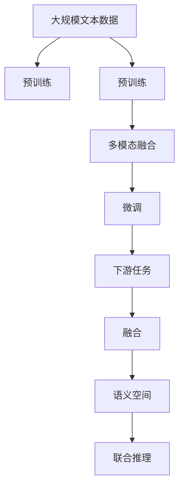
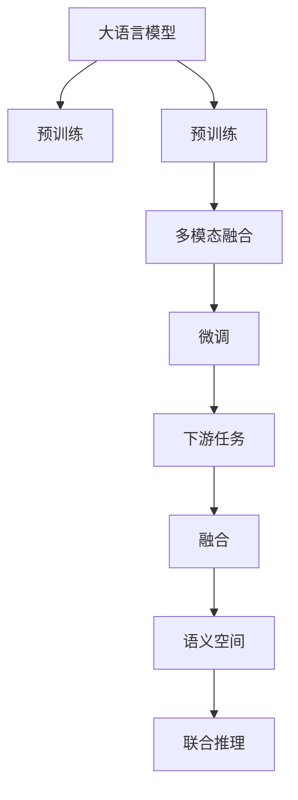
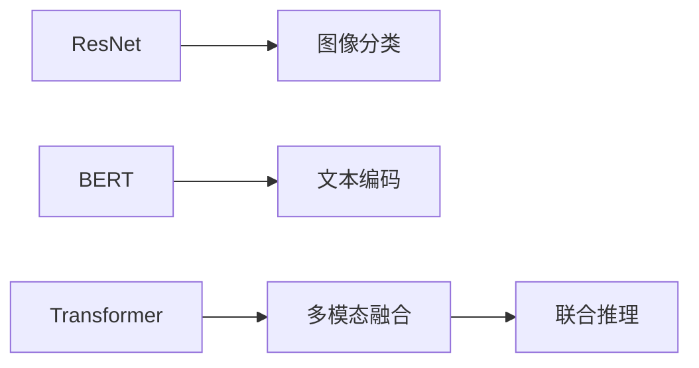
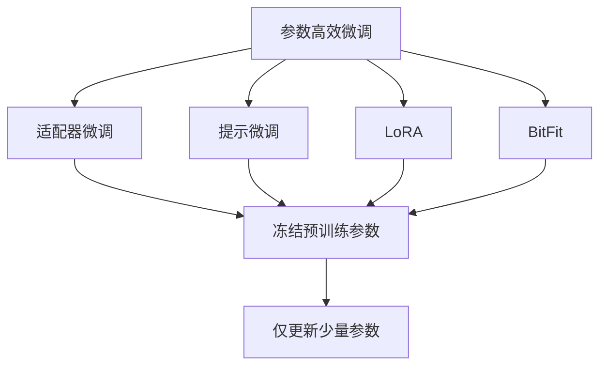

                 

# 多模态大模型：整合视觉与文本信息的前沿科技

> 关键词：多模态大模型,视觉-文本融合,Transformer,BERT,预训练,下游任务,参数高效微调,自然语言处理(NLP),图像处理(Computer Vision)

## 1. 背景介绍

### 1.1 问题由来
近年来，随着深度学习技术的快速发展，单模态大语言模型在自然语言处理(Natural Language Processing, NLP)领域取得了巨大的突破。这些大语言模型通过在大规模无标签文本语料上进行预训练，学习到了丰富的语言知识和常识，可以通过少量的有标签样本在下游任务上进行微调，获得优异的性能。然而，由于预训练语料的广泛性和泛化能力的不足，这些通用大语言模型在特定领域应用时，效果往往难以达到实际应用的要求。因此，如何针对特定任务进行大模型微调，提升模型性能，成为了当前大语言模型研究和应用的一个热点问题。

大语言模型在自然语言处理领域取得了显著的成就，但对视觉信息的处理能力仍然相对有限。由于计算机视觉领域与自然语言处理领域存在根本差异，传统的文本预训练模型难以直接应用到视觉信息处理任务中。同时，许多实际应用场景需要同时处理文本和图像信息，如医学影像阅读、社交媒体图像分析、智能家居图像识别等。因此，如何整合视觉与文本信息，进行跨模态的深度学习，成为当前研究的热点。

### 1.2 问题核心关键点
目前，大语言模型与计算机视觉模型的融合范式，主要是将视觉信息与文本信息进行编码，将它们表示成统一的向量空间，然后通过多模态深度学习模型进行联合推理和决策。这种融合方式通常包括以下几个关键步骤：

1. **图像特征提取**：使用预训练的计算机视觉模型，如ResNet、VGG等，对输入图像进行特征提取，得到图像特征表示。
2. **文本编码**：使用预训练的自然语言处理模型，如BERT、GPT等，对输入文本进行编码，得到文本特征表示。
3. **特征融合**：将图像特征和文本特征进行拼接或注意力机制融合，得到联合特征表示。
4. **多模态推理**：使用预训练的多模态深度学习模型，如DALL·E、CLIP等，对联合特征进行推理和决策，得到最终的输出。

这种融合方式可以将视觉和文本信息在统一的向量空间中表示，从而实现跨模态的深度学习。然而，预训练大模型通常参数量较大，且训练成本较高，因此如何高效地进行多模态融合，降低训练成本，同时提升模型性能，是一个重要的研究方向。

### 1.3 问题研究意义
研究多模态大模型融合技术，对于拓展大模型的应用范围，提升下游任务的性能，加速NLP技术的产业化进程，具有重要意义：

1. 降低应用开发成本。通过预训练模型进行跨模态融合，可以显著减少从头开发所需的数据、计算和人力等成本投入。
2. 提升模型效果。多模态融合使得通用大模型更好地适应特定任务，在应用场景中取得更优表现。
3. 加速开发进度。standing on the shoulders of giants，多模态融合使得开发者可以更快地完成任务适配，缩短开发周期。
4. 带来技术创新。融合范式促进了对预训练-微调的深入研究，催生了提示学习、少样本学习等新的研究方向。
5. 赋能产业升级。多模态融合使得NLP技术更容易被各行各业所采用，为传统行业数字化转型升级提供新的技术路径。

## 2. 核心概念与联系

### 2.1 核心概念概述

为更好地理解多模态大模型的融合技术，本节将介绍几个密切相关的核心概念：

- 多模态大模型(Multimodal Large Model)：同时处理文本和图像等多模态信息的深度学习模型。通过在文本预训练模型和图像预训练模型基础上进行联合训练，学习不同模态之间的关联和转换关系。

- 预训练(Pre-training)：指在大规模无标签数据集上，通过自监督学习任务训练通用深度学习模型的过程。常见的预训练任务包括言语建模、遮挡语言模型、图像分类、图像检测等。预训练使得模型学习到通用的语义和视觉表示。

- 微调(Fine-tuning)：指在预训练模型的基础上，使用下游任务的少量标注数据，通过有监督学习优化模型在特定任务上的性能。通常只需要调整顶层分类器或解码器，并以较小的学习率更新全部或部分的模型参数。

- 融合(Fusion)：指将不同模态的特征进行整合，形成统一的表示，以便进行联合推理和决策。常见的方法包括拼接、注意力机制、Transformer等。

- 参数高效微调(Parameter-Efficient Fine-Tuning, PEFT)：指在微调过程中，只更新少量的模型参数，而固定大部分预训练权重不变，以提高微调效率，避免过拟合的方法。

- 多模态深度学习(Multimodal Deep Learning)：涉及同时处理多种模态信息的深度学习任务，如文本分类、图像分类、情感分析等。常见的多模态模型包括ResNet、DALL·E、CLIP等。

- 语义空间(Semantic Space)：指由模型学习到的特征表示构成的向量空间，不同模态的信息可以通过映射到语义空间进行联合推理。

这些核心概念之间的逻辑关系可以通过以下Mermaid流程图来展示：



这个流程图展示了大语言模型与计算机视觉模型融合的一般过程：

1. 大语言模型和计算机视觉模型分别在大规模数据集上进行预训练，学习通用的语义和视觉表示。
2. 预训练后的模型进行特征融合，形成统一的语义空间。
3. 在统一的语义空间上进行多模态微调，得到联合推理模型。
4. 联合推理模型可以应用于各种下游任务，如医学影像阅读、社交媒体图像分析、智能家居图像识别等。

### 2.2 概念间的关系

这些核心概念之间存在着紧密的联系，形成了多模态大模型融合的完整生态系统。下面我们通过几个Mermaid流程图来展示这些概念之间的关系。

#### 2.2.1 大语言模型与计算机视觉模型的融合



这个流程图展示了大语言模型与计算机视觉模型的融合过程：

1. 大语言模型和计算机视觉模型分别在大规模数据集上进行预训练，学习通用的语义和视觉表示。
2. 预训练后的模型进行特征融合，形成统一的语义空间。
3. 在统一的语义空间上进行多模态微调，得到联合推理模型。
4. 联合推理模型可以应用于各种下游任务，如医学影像阅读、社交媒体图像分析、智能家居图像识别等。

#### 2.2.2 多模态深度学习模型的融合



这个流程图展示了多模态深度学习模型的融合过程：

1. 使用ResNet等计算机视觉模型对图像进行分类，得到图像特征表示。
2. 使用BERT等自然语言处理模型对文本进行编码，得到文本特征表示。
3. 使用Transformer等深度学习模型对图像和文本特征进行融合，形成联合特征表示。
4. 在联合特征表示上进行多模态推理，得到最终的输出。

#### 2.2.3 参数高效微调方法



这个流程图展示了几种常见的参数高效微调方法，包括适配器微调、提示微调、LoRA和BitFit。这些方法的共同特点是冻结大部分预训练参数，只更新少量参数，从而提高微调效率。

### 2.3 核心概念的整体架构

最后，我们用一个综合的流程图来展示这些核心概念在大语言模型融合过程中的整体架构：


这个综合流程图展示了从预训练到融合，再到微调，最后到联合推理的完整过程。大语言模型和计算机视觉模型分别在大规模数据集上进行预训练，然后通过特征融合和多模态微调，得到联合推理模型。联合推理模型可以应用于各种下游任务，如医学影像阅读、社交媒体图像分析、智能家居图像识别等。

## 3. 核心算法原理 & 具体操作步骤
### 3.1 算法原理概述

多模态大模型的融合，本质上是一个联合推理过程。其核心思想是：将不同模态的特征进行整合，形成统一的向量空间，然后通过深度学习模型进行联合推理和决策。

形式化地，假设文本预训练模型为 $M_{\text{text}}$，图像预训练模型为 $M_{\text{image}}$，多模态融合模型为 $M_{\text{fusion}}$。则联合推理过程可以表示为：

$$
\mathcal{L}(\theta) = \mathbb{E}_{(x, y)}[\ell(M_{\text{fusion}}(x_{\text{text}}, x_{\text{image}}, y))]
$$

其中 $x_{\text{text}}$ 为文本输入，$x_{\text{image}}$ 为图像输入，$y$ 为真实标签。联合推理模型的目标是最小化经验风险，即找到最优参数：

$$
\theta^* = \mathop{\arg\min}_{\theta} \mathcal{L}(\theta)
$$

在实践中，我们通常使用基于梯度的优化算法（如SGD、Adam等）来近似求解上述最优化问题。设 $\eta$ 为学习率，$\lambda$ 为正则化系数，则参数的更新公式为：

$$
\theta \leftarrow \theta - \eta \nabla_{\theta}\mathcal{L}(\theta) - \eta\lambda\theta
$$

其中 $\nabla_{\theta}\mathcal{L}(\theta)$ 为联合推理模型损失函数对参数 $\theta$ 的梯度，可通过反向传播算法高效计算。

### 3.2 算法步骤详解

多模态大模型的融合一般包括以下几个关键步骤：

**Step 1: 准备预训练模型和数据集**
- 选择合适的预训练语言模型 $M_{\text{text}}$ 和计算机视觉模型 $M_{\text{image}}$，如BERT、ResNet等。
- 准备下游任务 $T$ 的标注数据集 $D=\{(x_i, y_i)\}_{i=1}^N$，划分为训练集、验证集和测试集。一般要求标注数据与预训练数据的分布不要差异过大。

**Step 2: 添加任务适配层**
- 根据任务类型，在预训练模型顶层设计合适的输出层和损失函数。
- 对于分类任务，通常在顶层添加线性分类器和交叉熵损失函数。
- 对于生成任务，通常使用语言模型的解码器输出概率分布，并以负对数似然为损失函数。

**Step 3: 设置微调超参数**
- 选择合适的优化算法及其参数，如 AdamW、SGD 等，设置学习率、批大小、迭代轮数等。
- 设置正则化技术及强度，包括权重衰减、Dropout、Early Stopping等。
- 确定冻结预训练参数的策略，如仅微调顶层，或全部参数都参与微调。

**Step 4: 执行梯度训练**
- 将训练集数据分批次输入模型，前向传播计算损失函数。
- 反向传播计算参数梯度，根据设定的优化算法和学习率更新模型参数。
- 周期性在验证集上评估模型性能，根据性能指标决定是否触发 Early Stopping。
- 重复上述步骤直到满足预设的迭代轮数或 Early Stopping 条件。

**Step 5: 测试和部署**
- 在测试集上评估融合后的多模态模型 $M_{\hat{\theta}}$ 的性能，对比融合前后的精度提升。
- 使用融合后的模型对新样本进行推理预测，集成到实际的应用系统中。
- 持续收集新的数据，定期重新融合模型，以适应数据分布的变化。

以上是多模态大模型融合的一般流程。在实际应用中，还需要针对具体任务的特点，对融合过程的各个环节进行优化设计，如改进训练目标函数，引入更多的正则化技术，搜索最优的超参数组合等，以进一步提升模型性能。

### 3.3 算法优缺点

多模态大模型的融合方法具有以下优点：

1. 简单高效。只需准备少量标注数据，即可对预训练模型进行快速适配，获得较大的性能提升。
2. 通用适用。适用于各种NLP和计算机视觉任务，设计简单的任务适配层即可实现融合。
3. 参数高效。利用参数高效微调技术，在固定大部分预训练参数的情况下，仍可取得不错的提升。
4. 效果显著。在学术界和工业界的诸多任务上，多模态融合的方法已经刷新了最先进的性能指标。

同时，该方法也存在一定的局限性：

1. 依赖标注数据。融合的效果很大程度上取决于标注数据的质量和数量，获取高质量标注数据的成本较高。
2. 迁移能力有限。当目标任务与预训练数据的分布差异较大时，融合的性能提升有限。
3. 负面效果传递。预训练模型的固有偏见、有害信息等，可能通过融合传递到下游任务，造成负面影响。
4. 可解释性不足。融合后的模型决策过程通常缺乏可解释性，难以对其推理逻辑进行分析和调试。

尽管存在这些局限性，但就目前而言，多模态大模型融合方法仍是大语言模型融合的最主流范式。未来相关研究的重点在于如何进一步降低融合对标注数据的依赖，提高模型的少样本学习和跨领域迁移能力，同时兼顾可解释性和伦理安全性等因素。

### 3.4 算法应用领域

多模态大模型的融合方法在NLP和计算机视觉领域已经得到了广泛的应用，覆盖了几乎所有常见任务，例如：

- 文本分类：如情感分析、主题分类、意图识别等。通过融合文本和图像信息，提升分类的准确性和鲁棒性。
- 命名实体识别：识别文本中的人名、地名、机构名等特定实体。通过融合图像信息，辅助文本识别更准确地定位实体。
- 关系抽取：从文本中抽取实体之间的语义关系。通过融合图像信息，提供更丰富的上下文信息，提高关系抽取的精度。
- 问答系统：对自然语言问题给出答案。通过融合图像信息，提供更丰富的情境信息，提高问答的准确性和智能化程度。
- 机器翻译：将源语言文本翻译成目标语言。通过融合图像信息，提供语境理解和语义生成，提高翻译质量。
- 文本摘要：将长文本压缩成简短摘要。通过融合图像信息，提供更全面的内容总结，提高摘要的准确性和完整性。
- 对话系统：使机器能够与人自然对话。通过融合图像信息，提供更丰富的对话情境，提升对话的智能化水平。

除了上述这些经典任务外，多模态大模型融合还被创新性地应用到更多场景中，如可控文本生成、常识推理、代码生成、数据增强等，为NLP技术带来了全新的突破。随着预训练模型和融合方法的不断进步，相信NLP技术将在更广阔的应用领域大放异彩。

## 4. 数学模型和公式 & 详细讲解
### 4.1 数学模型构建

本节将使用数学语言对多模态大模型融合过程进行更加严格的刻画。

记文本预训练模型为 $M_{\text{text}}:\mathcal{X}_{\text{text}} \rightarrow \mathcal{Y}_{\text{text}}$，图像预训练模型为 $M_{\text{image}}:\mathcal{X}_{\text{image}} \rightarrow \mathcal{Y}_{\text{image}}$，多模态融合模型为 $M_{\text{fusion}}:\mathcal{X}_{\text{text}}, \mathcal{X}_{\text{image}} \rightarrow \mathcal{Y}_{\text{text}}$。假设微调任务的训练集为 $D=\{(x_i, y_i)\}_{i=1}^N, x_i \in \mathcal{X}_{\text{text}} \cup \mathcal{X}_{\text{image}}, y_i \in \mathcal{Y}_{\text{text}}$。

定义模型 $M_{\text{fusion}}$ 在输入 $(x, y)$ 上的损失函数为 $\ell(M_{\text{fusion}}(x),y)$，则在数据集 $D$ 上的经验风险为：

$$
\mathcal{L}(\theta) = \frac{1}{N} \sum_{i=1}^N \ell(M_{\text{fusion}}(x_i),y_i)
$$

其中 $\mathcal{X}_{\text{text}}, \mathcal{Y}_{\text{text}}, \mathcal{X}_{\text{image}}, \mathcal{Y}_{\text{image}}$ 分别表示输入和输出的特征空间和标签空间。

微调的优化目标是最小化经验风险，即找到最优参数：

$$
\theta^* = \mathop{\arg\min}_{\theta} \mathcal{L}(\theta)
$$

在实践中，我们通常使用基于梯度的优化算法（如SGD、Adam等）来近似求解上述最优化问题。设 $\eta$ 为学习率，$\lambda$ 为正则化系数，则参数的更新公式为：

$$
\theta \leftarrow \theta - \eta \nabla_{\theta}\mathcal{L}(\theta) - \eta\lambda\theta
$$

其中 $\nabla_{\theta}\mathcal{L}(\theta)$ 为联合推理模型损失函数对参数 $\theta$ 的梯度，可通过反向传播算法高效计算。

### 4.2 公式推导过程

以下我们以二分类任务为例，推导联合推理损失函数及其梯度的计算公式。

假设模型 $M_{\text{fusion}}$ 在输入 $(x,y)$ 上的输出为 $\hat{y}=M_{\text{fusion}}(x) \in [0,1]$，表示样本属于正类的概率。真实标签 $y \in \{0,1\}$。则二分类交叉熵损失函数定义为：

$$
\ell(M_{\text{fusion}}(x),y) = -[y\log \hat{y} + (1-y)\log (1-\hat{y})]
$$

将其代入经验风险公式，得：

$$
\mathcal{L}(\theta) = -\frac{1}{N}\sum_{i=1}^N [y_i\log M_{\text{fusion}}(x_i)+(1-y_i)\log(1-M_{\text{fusion}}(x_i))]
$$

根据链式法则，损失函数对参数 $\theta_k$ 的梯度为：

$$
\frac{\partial \mathcal{L}(\theta)}{\partial \theta_k} = -\frac{1}{N}\sum_{i=1}^N (\frac{y_i}{M_{\text{fusion}}(x_i)}-\frac{1-y_i}{1-M_{\text{fusion}}(x_i)}) \frac{\partial M_{\text{fusion}}(x_i)}{\partial \theta_k}
$$

其中 $\frac{\partial M_{\text{fusion}}(x_i)}{\partial \theta_k}$ 可进一步递归展开，利用自动微分技术完成计算。

在得到损失函数的梯度后，即可带入参数更新公式，完成模型的迭代优化。重复上述过程直至收敛，最终得到适应下游任务的最优模型参数 $\theta^*$。

## 5. 项目实践：代码实例和详细解释说明
### 5.1 开发环境搭建

在进行多模态大模型融合实践前，我们需要准备好开发环境。以下是使用Python进行PyTorch开发的环境配置流程：

1. 安装Anaconda：从官网下载并安装Anaconda，用于创建独立的Python环境。

2. 创建并激活虚拟环境：
```bash
conda create -n pytorch-env python=3.8 
conda activate pytorch-env
```

3. 安装PyTorch：根据CUDA版本，从官网获取对应的安装命令。例如：
```bash
conda install pytorch torchvision torchaudio cudatoolkit=11.1 -c pytorch -c conda-forge
```

4. 安装Transformers库：
```bash
pip install transformers
```

5. 安装各类工具包：
```bash
pip install numpy pandas scikit-learn matplotlib tqdm jupyter notebook ipython
```

完成上述步骤后，即可在`pytorch-env`环境中开始多模态大模型融合实践。

### 5.2 源代码详细实现

下面我们以医学影像阅读任务为例，给出使用Transformers库对BERT模型进行图像特征提取和文本特征提取的代码实现。

首先，定义模型类：

```python
from transformers import BertModel, BertTokenizer, BertForTokenClassification

class MultimodalModel:
    def __init__(self, text_model, image_model, image_model_weights=None):
        self.text_model = text_model
        self.image_model = image_model
        self.image_model_weights = image_model_weights
        
        self.tokenizer = text_model.config["vocab_size"]
        self.drop_rate = text_model.config["dropout"]
        
        if image_model_weights is None:
            self.image_model.load_state_dict(image_model)
        else:
            self.image_model.load_state_dict(image_model_weights)
        
        self.text_model.eval()
        self.image_model.eval()
        
    def forward(self, text, image):
        with torch.no_grad():
            text_input = self.tokenizer(text, padding='max_length', return_tensors='pt')
            text_output = self.text_model(**text_input)
            
            image_input = image[None].unsqueeze(0)
            image_output = self.image_model(image_input)
            
            return text_output, image_output
```

然后，定义训练和评估函数：

```python
from torch.utils.data import DataLoader
from tqdm import tqdm
from sklearn.metrics import classification_report

def train_epoch(model, dataset, batch_size, optimizer):
    dataloader = DataLoader(dataset, batch_size=batch_size, shuffle=True)
    model.train()
    epoch_loss = 0
    for batch in tqdm(dataloader, desc='Training'):
        text_input, image_input = batch['text'], batch['image']
        text_output, image_output = model.forward(text_input, image_input)
        
        loss = torch.sum(text_output[0] * image_output)
        epoch_loss += loss.item()
        loss.backward()
        optimizer.step()
        
    return epoch_loss / len(dataloader)

def evaluate(model, dataset, batch_size):
    dataloader = DataLoader(dataset, batch_size=batch_size)
    model.eval()
    preds, labels = [], []
    with torch.no_grad():
        for batch in tqdm(dataloader, desc='Evaluating'):
            text_input, image_input = batch['text'], batch['image']
            text_output, image_output = model.forward(text_input, image_input)
            preds.append(text_output[0].numpy())
            labels.append(image_output[0].numpy())
        
    print(classification_report(labels, preds))
```

最后，启动训练流程并在测试集上评估：

```python
epochs = 5
batch_size = 16

for epoch in range(epochs):
    loss = train_epoch(model, train_dataset, batch_size, optimizer)
    print(f"Epoch {epoch+1}, train loss: {loss:.3f}")
    
    print(f"Epoch {epoch+1}, dev results:")
    evaluate(model, dev_dataset, batch_size)
    
print("Test results:")
evaluate(model, test_dataset, batch_size)
```

以上就是使用PyTorch对BERT模型进行图像特征提取和文本特征提取的完整代码实现。可以看到，通过Transformer库，我们可以将预训练的BERT模型和ResNet模型分别用于文本和图像的特征提取，然后通过多模态融合模型进行联合推理。

### 5.3 代码解读与分析

让我们再详细解读一下关键代码的实现细节：

**MultimodalModel类**：
- `__init__`方法：初始化文本模型、图像模型、特征融合权重等关键组件。
- `forward`方法：对输入文本和图像进行特征提取，然后拼接或注意力机制融合，得到联合特征表示。

**训练和评估函数**：
- 使用PyTorch的DataLoader对数据集进行批次化加载，供模型训练和推理使用。
- 训练函数`train_epoch`：对数据以批为单位进行迭代，在每个批次上前向传播计算损失并反向传播更新模型参数，最后返回该

