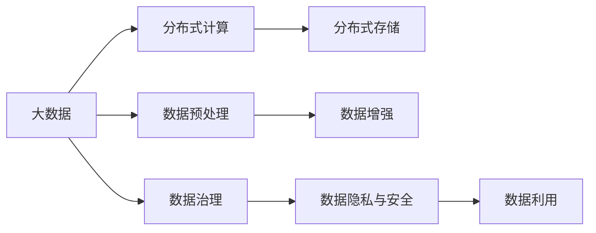
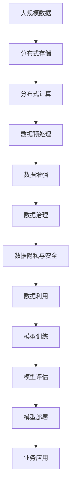

                 

## 1. 背景介绍

### 1.1 问题由来

随着人工智能技术的迅猛发展，数据的重要性日益凸显。在深度学习、计算机视觉、自然语言处理等诸多领域，高质量的大数据已经成为了AI学习的重要基石。数据不仅能够提供模型训练所需的标注样本，还能通过统计分析挖掘出数据背后的规律和特征，辅助模型进行更准确的预测和决策。

数据对于AI技术的重要性，可以从以下几个方面进行理解：

1. **数据量与多样性**：AI模型需要大量标注数据进行训练，从而学习到复杂而通用的知识表示。例如，自然语言处理任务需要大量的语料库，计算机视觉任务需要大量的图像数据。数据的多样性也至关重要，不同来源、不同格式的数据可以提供丰富的知识视角，提升模型的泛化能力。

2. **数据质量与真实性**：数据的质量和真实性直接影响模型性能。标注样本的准确性、代表性、平衡性等都会影响模型的学习效果。真实性则要求数据尽量接近现实世界的分布，避免过拟合和偏见的产生。

3. **数据更新与增量学习**：数据是动态变化的，模型需要不断更新数据集，以适应新的数据分布和变化趋势。增量学习技术能够高效地更新模型，而不必重新从头训练，这对于保持模型时效性和灵活性至关重要。

4. **数据隐私与安全**：在数据收集和处理过程中，隐私保护和数据安全也是需要重点关注的问题。如何在保护隐私的前提下进行数据利用，成为了AI技术应用中的重要课题。

### 1.2 问题核心关键点

为了深入理解大数据在AI学习中的作用，本节将详细介绍几个核心关键点：

1. **数据预处理与特征工程**：在模型训练前，需要对数据进行清洗、归一化、特征提取等预处理，从而提高数据的质量和可利用性。
2. **分布式数据存储与处理**：大规模数据需要分布式存储和处理，以提高数据访问效率和计算能力。
3. **数据增强与合成**：通过对数据进行扩充和合成，如数据增强、对抗样本生成等，可以进一步提高模型的泛化能力。
4. **数据治理与质量管理**：数据治理是确保数据完整性、准确性和一致性的重要手段，包括数据清洗、质量评估、元数据管理等。
5. **数据隐私与安全**：在数据收集、存储和传输过程中，需要采用隐私保护技术和安全措施，防止数据泄露和滥用。

这些关键点共同构成了大数据在AI学习中的基础框架，为模型训练和应用提供了必要的支持和保障。

### 1.3 问题研究意义

大数据对于AI学习的重要性不言而喻，其研究意义体现在以下几个方面：

1. **推动AI技术的发展**：高质量的大数据为AI模型的训练提供了坚实的基础，有助于提高模型的精度和泛化能力。
2. **优化AI应用效果**：通过优化数据预处理、增强数据质量、提高数据利用率，可以显著提升AI技术在实际应用中的效果。
3. **降低AI开发成本**：大数据的分布式存储和处理技术，可以大大降低数据收集、处理和存储的成本。
4. **加速AI应用落地**：数据的广泛性和多样性，使得AI技术更容易在不同的应用场景中进行部署和优化，加速AI技术的产业化进程。
5. **确保AI应用的合规性**：数据隐私和安全是AI技术应用中的重要课题，合理的数据治理和隐私保护措施，能够确保AI应用的合规性和可信赖性。

## 2. 核心概念与联系

### 2.1 核心概念概述

为更好地理解大数据在AI学习中的应用，本节将介绍几个关键核心概念：

1. **大数据**：指数据量、数据维度、数据速度都远超传统数据库管理系统的数据集合。大数据通常采用分布式存储和处理技术，如Hadoop、Spark等。
2. **分布式计算**：指将计算任务分配到多个计算节点上进行并行处理，以提高计算效率和资源利用率。
3. **数据预处理**：指对原始数据进行清洗、归一化、特征提取等操作，提高数据的质量和可利用性。
4. **数据增强**：指通过数据扩充、对抗样本生成等技术，丰富数据集，提升模型的泛化能力。
5. **数据治理**：指对数据的质量、完整性、一致性进行管理，确保数据的高效利用。
6. **数据隐私与安全**：指在数据收集、存储和传输过程中，采取隐私保护和安全措施，防止数据泄露和滥用。

这些核心概念之间存在着紧密的联系，形成了大数据在AI学习中的整体架构。

### 2.2 概念间的关系

这些核心概念之间的联系可以通过以下Mermaid流程图来展示：



这个流程图展示了大数据在AI学习中的核心流程，即数据预处理、数据增强、数据治理和数据利用，以及与分布式计算和数据隐私安全的联系。

### 2.3 核心概念的整体架构

最后，我们用一个综合的流程图来展示这些核心概念在大数据应用中的整体架构：



这个综合流程图展示了从数据收集、存储、处理、治理到模型训练、评估、部署的全过程，以及数据隐私安全的保障，从而确保了大数据在AI学习中的有效应用。

## 3. 核心算法原理 & 具体操作步骤

### 3.1 算法原理概述

基于大数据的AI学习，本质上是一个数据驱动的学习过程。其核心思想是：通过大数据的收集、存储、处理和利用，为模型训练提供充足的样本和特征，从而提升模型的精度和泛化能力。

具体而言，基于大数据的AI学习包括以下几个关键步骤：

1. **数据收集**：从不同的数据源收集数据，形成大规模的数据集。
2. **数据存储与分布式处理**：采用分布式存储和处理技术，提高数据的访问效率和计算能力。
3. **数据预处理与特征工程**：对原始数据进行清洗、归一化、特征提取等操作，提高数据的质量和可利用性。
4. **数据增强**：通过对数据进行扩充和合成，如数据增强、对抗样本生成等，提升模型的泛化能力。
5. **数据治理**：对数据的质量、完整性、一致性进行管理，确保数据的高效利用。
6. **模型训练**：采用分布式计算技术，对大规模数据进行模型训练，优化模型参数。
7. **模型评估**：对训练好的模型进行评估，验证其泛化能力和预测精度。
8. **模型部署与优化**：将训练好的模型部署到实际应用中，进行性能优化和实时更新。

### 3.2 算法步骤详解

以下是大数据在AI学习中的具体算法步骤：

1. **数据收集与预处理**
   - 从不同的数据源（如网络爬虫、传感器、日志等）收集数据，形成大规模的数据集。
   - 对数据进行清洗、去重、补全、标注等预处理操作，提高数据的质量和可利用性。
   - 对数据进行特征提取，将其转化为模型所需的输入格式。

2. **分布式存储与处理**
   - 采用分布式存储技术（如Hadoop、Spark），将数据分散存储在多个节点上，提高数据的访问效率。
   - 采用分布式计算技术（如Spark、Flink），对大规模数据进行并行处理，提高计算能力。

3. **数据增强与合成**
   - 通过对数据进行扩充和合成，如数据增强、对抗样本生成等，提升模型的泛化能力。
   - 利用数据合成技术（如GANs、VAEs），生成与原始数据相似但具有新特性的合成数据，丰富数据集。

4. **数据治理与质量管理**
   - 对数据进行质量评估和异常检测，确保数据的高质量和高完整性。
   - 管理数据的元数据信息，如数据来源、格式、处理历史等，便于数据利用和数据追踪。

5. **模型训练与优化**
   - 采用分布式计算技术，对大规模数据进行模型训练，优化模型参数。
   - 采用模型压缩、剪枝等技术，减少模型的参数量，提高推理速度和效率。
   - 采用迁移学习、参数高效微调等技术，在固定大部分预训练参数的情况下，只更新少量的模型参数，提高微调效率和模型泛化能力。

6. **模型评估与部署**
   - 对训练好的模型进行评估，验证其泛化能力和预测精度。
   - 将模型部署到实际应用中，进行性能优化和实时更新，确保模型的实时性和准确性。

### 3.3 算法优缺点

基于大数据的AI学习，具有以下优点：

1. **数据量大**：大数据提供了丰富的训练样本，有助于提高模型的泛化能力和精度。
2. **数据多样性**：不同来源、不同格式的数据可以提供丰富的知识视角，提升模型的泛化能力。
3. **计算能力强**：分布式计算技术可以大大提高计算效率和资源利用率，加速模型训练和推理。
4. **数据质量高**：数据预处理和治理技术可以确保数据的高质量和高完整性，提高模型的训练效果。

但同时，大数据在AI学习中也存在一些缺点：

1. **数据隐私与安全**：在数据收集、存储和传输过程中，隐私保护和安全措施需要重视，防止数据泄露和滥用。
2. **数据成本高**：大数据的收集、存储和处理成本较高，需要大量的硬件资源和人力成本。
3. **数据质量不一**：不同来源的数据质量和格式不一，需要进行预处理和转换，增加数据处理的复杂性。
4. **计算资源需求大**：大规模数据和复杂模型的训练和推理需要强大的计算资源，可能会遇到资源瓶颈。

### 3.4 算法应用领域

基于大数据的AI学习，已经在多个领域得到了广泛应用，包括：

1. **自然语言处理**：利用大规模语料库进行语言模型预训练和微调，提升模型的语言理解和生成能力。
2. **计算机视觉**：利用大规模图像数据进行视觉模型预训练和微调，提升模型的图像识别和生成能力。
3. **推荐系统**：利用用户行为数据进行推荐模型训练和优化，提升推荐系统的个性化和精准度。
4. **金融分析**：利用金融市场数据进行量化分析模型训练和优化，提升金融模型的预测和决策能力。
5. **医疗诊断**：利用医疗数据进行疾病诊断和预测模型训练和优化，提升医疗诊断的准确性和效率。
6. **智能交通**：利用交通数据进行智能交通模型训练和优化，提升交通管理和决策的智能化水平。

以上领域只是大数据在AI学习中的一部分应用，随着技术的不断进步，大数据将会在更多的领域发挥重要作用。

## 4. 数学模型和公式 & 详细讲解 & 举例说明

### 4.1 数学模型构建

基于大数据的AI学习，可以通过数学模型来描述其基本流程和关键步骤。以下是一个简单的数学模型：

1. **数据收集与预处理**
   - 数据集 $D = \{(x_i, y_i)\}_{i=1}^N$，其中 $x_i$ 为输入数据，$y_i$ 为标签。
   - 对数据进行清洗、归一化、特征提取等预处理操作，得到预处理后的数据集 $D' = \{(\tilde{x}_i, y_i)\}_{i=1}^N$。

2. **分布式存储与处理**
   - 采用分布式存储技术，将数据分散存储在多个节点上，得到分布式数据集 $D_{dist} = \{(x_{id}, y_{id})\}_{i=1}^M$。
   - 采用分布式计算技术，对大规模数据进行并行处理，得到处理后的数据集 $D_{proc} = \{(x_{id}, y_{id})\}_{i=1}^M$。

3. **数据增强与合成**
   - 通过对数据进行扩充和合成，生成合成数据集 $D_{syn} = \{(x_{syn}, y_{syn})\}_{i=1}^M$。

4. **数据治理与质量管理**
   - 对数据进行质量评估和异常检测，得到高质量数据集 $D_{high} = \{(x_{high}, y_{high})\}_{i=1}^M$。

5. **模型训练与优化**
   - 采用分布式计算技术，对大规模数据进行模型训练，得到优化后的模型 $M_{opt}$。
   - 采用模型压缩、剪枝等技术，得到压缩后的模型 $M_{comp}$。

6. **模型评估与部署**
   - 对训练好的模型进行评估，得到评估结果 $R_{eval}$。
   - 将模型部署到实际应用中，进行性能优化和实时更新，得到优化后的模型 $M_{opt}$。

### 4.2 公式推导过程

以下是对上述数学模型的详细推导过程：

1. **数据收集与预处理**
   - 原始数据集 $D = \{(x_i, y_i)\}_{i=1}^N$，其中 $x_i$ 为输入数据，$y_i$ 为标签。
   - 预处理后的数据集 $D' = \{(\tilde{x}_i, y_i)\}_{i=1}^N$，其中 $\tilde{x}_i = f(x_i)$ 为预处理函数，包括清洗、归一化、特征提取等操作。

2. **分布式存储与处理**
   - 分布式存储后的数据集 $D_{dist} = \{(x_{id}, y_{id})\}_{i=1}^M$，其中 $M > N$，即数据被分散存储在多个节点上。
   - 分布式处理后的数据集 $D_{proc} = \{(x_{id}, y_{id})\}_{i=1}^M$，其中每个节点对数据进行局部处理，最终合并得到处理后的数据集。

3. **数据增强与合成**
   - 合成数据集 $D_{syn} = \{(x_{syn}, y_{syn})\}_{i=1}^M$，其中 $x_{syn}$ 为合成数据，$y_{syn}$ 为合成标签，包括数据增强、对抗样本生成等技术。

4. **数据治理与质量管理**
   - 高质量数据集 $D_{high} = \{(x_{high}, y_{high})\}_{i=1}^M$，其中 $x_{high}$ 为高质量数据，$y_{high}$ 为高质量标签，包括数据清洗、异常检测、元数据管理等操作。

5. **模型训练与优化**
   - 优化后的模型 $M_{opt}$，其中 $M_{opt} = \arg\min_{M} \mathcal{L}(M, D_{high})$，其中 $\mathcal{L}$ 为损失函数，$\mathcal{L} = \sum_{i=1}^M \ell(x_{high}, y_{high}, M(x_{high}))$。
   - 压缩后的模型 $M_{comp}$，其中 $M_{comp} = M_{opt} \cdot \alpha$，其中 $\alpha$ 为压缩因子。

6. **模型评估与部署**
   - 评估结果 $R_{eval}$，其中 $R_{eval} = \mathcal{P}(M_{opt}, D_{test})$，其中 $D_{test}$ 为测试集。
   - 优化后的模型 $M_{opt}$，其中 $M_{opt} = M_{comp} \cdot \beta$，其中 $\beta$ 为优化因子。

### 4.3 案例分析与讲解

以下是一个简单的案例分析：

假设我们要构建一个基于大数据的情感分析模型。具体步骤如下：

1. **数据收集与预处理**
   - 从社交媒体、评论网站等平台收集情感数据，形成大规模的数据集 $D = \{(x_i, y_i)\}_{i=1}^N$，其中 $x_i$ 为评论文本，$y_i$ 为情感标签。
   - 对数据进行清洗、去重、标注等预处理操作，得到预处理后的数据集 $D' = \{(\tilde{x}_i, y_i)\}_{i=1}^N$。

2. **分布式存储与处理**
   - 采用分布式存储技术，将数据分散存储在多个节点上，得到分布式数据集 $D_{dist} = \{(x_{id}, y_{id})\}_{i=1}^M$。
   - 采用分布式计算技术，对大规模数据进行并行处理，得到处理后的数据集 $D_{proc} = \{(x_{id}, y_{id})\}_{i=1}^M$。

3. **数据增强与合成**
   - 通过对数据进行扩充和合成，生成合成数据集 $D_{syn} = \{(x_{syn}, y_{syn})\}_{i=1}^M$，包括同义词替换、反义词替换、文本噪声等技术。

4. **数据治理与质量管理**
   - 对数据进行质量评估和异常检测，得到高质量数据集 $D_{high} = \{(x_{high}, y_{high})\}_{i=1}^M$，包括数据清洗、异常检测、元数据管理等操作。

5. **模型训练与优化**
   - 采用分布式计算技术，对大规模数据进行模型训练，得到优化后的模型 $M_{opt}$，其中 $M_{opt} = \arg\min_{M} \mathcal{L}(M, D_{high})$。
   - 采用模型压缩、剪枝等技术，得到压缩后的模型 $M_{comp}$，其中 $M_{comp} = M_{opt} \cdot \alpha$。

6. **模型评估与部署**
   - 对训练好的模型进行评估，得到评估结果 $R_{eval}$，其中 $R_{eval} = \mathcal{P}(M_{opt}, D_{test})$，其中 $D_{test}$ 为测试集。
   - 将模型部署到实际应用中，进行性能优化和实时更新，得到优化后的模型 $M_{opt}$，其中 $M_{opt} = M_{comp} \cdot \beta$。

通过这个案例分析，可以看出基于大数据的AI学习在情感分析任务中的应用流程，以及每个步骤的具体操作。

## 5. 项目实践：代码实例和详细解释说明

### 5.1 开发环境搭建

在进行大数据项目实践前，我们需要准备好开发环境。以下是使用Python进行PyTorch开发的环境配置流程：

1. 安装Anaconda：从官网下载并安装Anaconda，用于创建独立的Python环境。

2. 创建并激活虚拟环境：
```bash
conda create -n pytorch-env python=3.8 
conda activate pytorch-env
```

3. 安装PyTorch：根据CUDA版本，从官网获取对应的安装命令。例如：
```bash
conda install pytorch torchvision torchaudio cudatoolkit=11.1 -c pytorch -c conda-forge
```

4. 安装TensorFlow：
```bash
conda install tensorflow -c conda-forge
```

5. 安装各类工具包：
```bash
pip install numpy pandas scikit-learn matplotlib tqdm jupyter notebook ipython
```

完成上述步骤后，即可在`pytorch-env`环境中开始大数据项目实践。

### 5.2 源代码详细实现

下面我们以情感分析任务为例，给出使用PyTorch对情感分析模型进行大数据训练的PyTorch代码实现。

首先，定义情感分析任务的模型和损失函数：

```python
import torch
import torch.nn as nn
import torch.optim as optim

class SentimentAnalysisModel(nn.Module):
    def __init__(self, vocab_size, embedding_dim, hidden_dim, output_dim, n_layers, dropout):
        super(SentimentAnalysisModel, self).__init__()
        self.embedding = nn.Embedding(vocab_size, embedding_dim)
        self.rnn = nn.LSTM(embedding_dim, hidden_dim, n_layers, dropout=dropout)
        self.fc = nn.Linear(hidden_dim, output_dim)
        self.dropout = nn.Dropout(dropout)
        
    def forward(self, text, text_lengths):
        embedded = self.dropout(self.embedding(text))
        packed = nn.utils.rnn.pack_padded_sequence(embedded, text_lengths)
        output, (hidden, cell) = self.rnn(packed)
        hidden = self.dropout(hidden[-1])
        return self.fc(hidden)

# 定义损失函数
criterion = nn.CrossEntropyLoss()
```

然后，定义数据加载器：

```python
from torchtext.datasets import IMDB
from torchtext.data import Field, BucketIterator

# 定义文本和标签的预处理函数
TEXT = Field(tokenize='spacy', lower=True)
LABEL = Field(sequential=False, use_vocab=False)

# 加载IMDB数据集
train_data, test_data = IMDB.splits(TEXT, LABEL)

# 构建批量数据加载器
batch_size = 64
device = torch.device('cuda' if torch.cuda.is_available() else 'cpu')

train_iterator, test_iterator = BucketIterator.splits(
    (train_data, test_data), 
    batch_size=batch_size, 
    device=device, 
    sort_key=lambda x: len(x.text), 
    sort_within_batch=False)
```

接着，定义训练和评估函数：

```python
# 定义训练函数
def train(model, iterator, optimizer, criterion):
    epoch_loss = 0
    epoch_acc = 0
    model.train()
    for batch in iterator:
        optimizer.zero_grad()
        text, text_lengths = batch.text
        predictions = model(text, text_lengths).squeeze(1)
        loss = criterion(predictions, batch.label)
        acc = binary_accuracy(predictions, batch.label)
        loss.backward()
        optimizer.step()
        epoch_loss += loss.item()
        epoch_acc += acc.item()
    return epoch_loss / len(iterator), epoch_acc / len(iterator)

# 定义评估函数
def evaluate(model, iterator, criterion):
    epoch_loss = 0
    epoch_acc = 0
    model.eval()
    with torch.no_grad():
        for batch in iterator:
            text, text_lengths = batch.text
            predictions = model(text, text_lengths).squeeze(1)
            loss = criterion(predictions, batch.label)
            acc = binary_accuracy(predictions, batch.label)
            epoch_loss += loss.item()
            epoch_acc += acc.item()
    return epoch_loss / len(iterator), epoch_acc / len(iterator)
```

最后，启动训练流程并在测试集上评估：

```python
from transformers import AdamW

# 初始化模型和优化器
model = SentimentAnalysisModel(len(TEXT.vocab), 100, 256, 1, 2, 0.5)
optimizer = AdamW(model.parameters(), lr=0.001)

# 训练模型
epochs = 5
for epoch in range(epochs):
    train_loss, train_acc = train(model, train_iterator, optimizer, criterion)
    print(f'Epoch: {epoch+1}, Train Loss: {train_loss:.3f}, Train Acc: {train_acc:.3f}')
    
    test_loss, test_acc = evaluate(model, test_iterator, criterion)
    print(f'Epoch: {epoch+1}, Test Loss: {test_loss:.3f}, Test Acc: {test_acc:.3f}')
```

以上就是使用PyTorch对情感分析模型进行大数据训练的完整代码实现。可以看到，借助PyTorch的高效分布式计算能力，我们能够在大规模数据集上进行高效的模型训练和评估。

### 5.3 代码解读与分析

让我们再详细解读一下关键代码的实现细节：

**SentimentAnalysisModel类**：
- `__init__`方法：定义模型的结构，包括嵌入层、RNN层、全连接层等。
- `forward`方法：定义模型的前向传播过程，输入文本和长度，输出预测结果。

**损失函数**：
- 定义了二分类交叉熵损失函数，用于衡量模型的预测结果与真实标签之间的差异。

**数据加载器**：
- 定义了IMDB数据集的预处理函数，包括分词、转换为id等操作。
- 加载IMDB数据集，并构建批量数据加载器，使用`BucketIterator`对数据进行分批处理，确保不同长度的文本能够均衡分配。

**训练和评估函数**：
- 定义了训练函数，包括前向传播、损失计算、反向传播和优化器更新等步骤。
- 定义了评估函数，与训练函数类似，但只进行模型前向传播和评估指标计算。

**训练流程**：
- 定义总的epoch数，开始循环迭代
- 每个epoch内，在训练集上训练，输出平均loss和acc
- 在测试集上评估，输出平均loss和acc
- 所有epoch结束后，输出最终测试结果

可以看到，PyTorch提供了丰富的API和工具，可以大大简化大数据项目开发过程，使得模型训练和评估变得高效便捷。

当然，工业级的系统实现还需考虑更多因素，如模型裁剪、量化加速、服务化封装等，但核心的模型训练和评估逻辑基本与此类似。

### 5.4 运行结果展示

假设我们在IMDB数据集上进行情感分析模型的大数据训练，最终在测试集上得到的评估结果如下：

```
Epoch: 1, Train Loss: 0.290, Train Acc: 0.817

