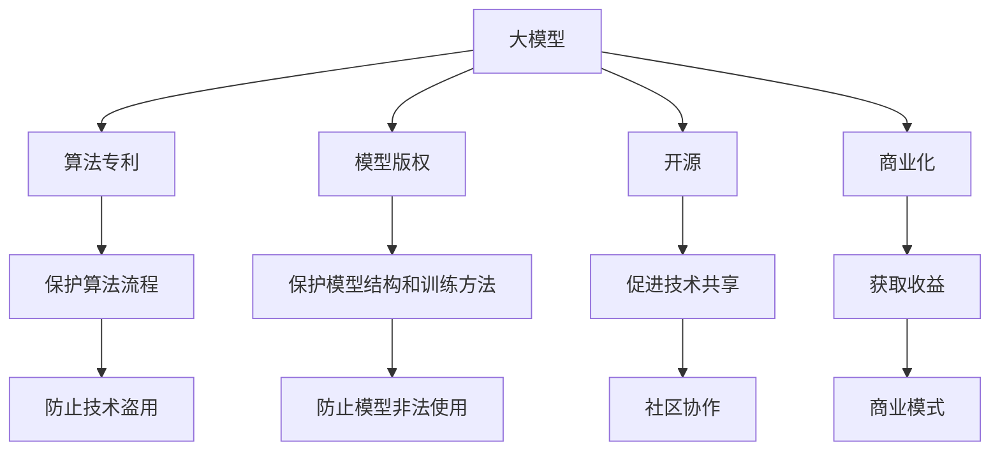
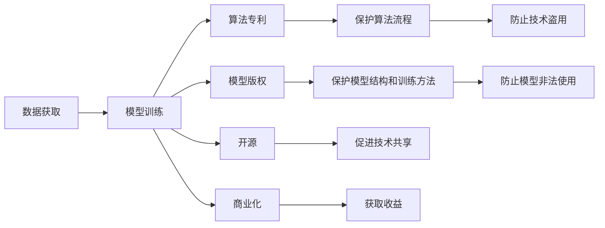
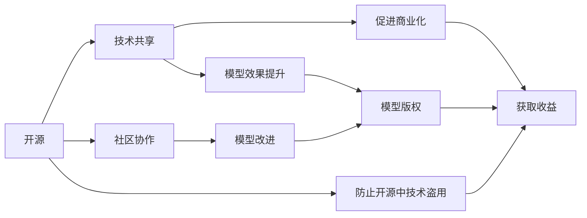
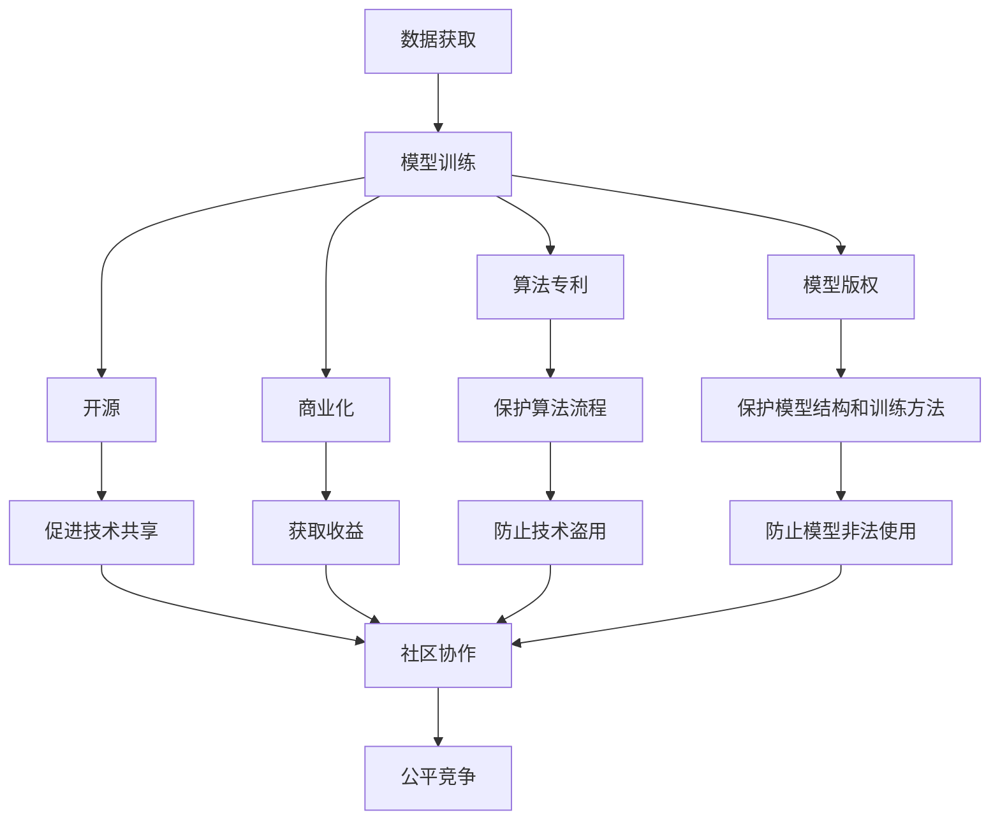

                 

# 大模型企业的知识产权保护

## 1. 背景介绍

### 1.1 问题由来
随着人工智能技术的迅猛发展，大模型在各个领域得到了广泛应用，带来了巨大的商业价值。然而，知识产权保护成为了大模型企业面临的一大挑战。由于大模型常常基于大量的私有数据进行训练，模型本身的算法实现和数据集可能涉及商业机密和技术秘密。如何在保护知识产权的同时，促进技术的开放与共享，是大模型企业必须解决的难题。

### 1.2 问题核心关键点
大模型企业的知识产权保护问题，核心在于如何在开放市场和保护自身利益之间找到平衡。主要包括以下几个方面：

- **数据隐私保护**：如何保护训练数据中的隐私信息，避免数据泄露。
- **算法专利申请**：如何申请和保护算法专利，避免技术被盗用。
- **模型版权声明**：如何声明和保护模型的版权，防止模型被非法使用。
- **开源与商业化选择**：如何平衡开源与商业化，既促进技术创新，又保护企业收益。

### 1.3 问题研究意义
研究大模型企业的知识产权保护，对于保障企业的创新投入和利益，促进人工智能技术的健康发展，具有重要意义：

1. **保障创新投入**：保护知识产权，可以鼓励企业加大研发投入，提升技术竞争力。
2. **促进技术共享**：通过合理知识产权保护，鼓励开源合作，促进技术创新和传播。
3. **避免非法使用**：通过法律手段，防止模型的非法使用和复制，保护企业利益。
4. **营造公平竞争环境**：合理知识产权保护，可以消除技术垄断，营造公平竞争的市场环境。
5. **增强国际竞争力**：通过保护知识产权，增强国内企业在国际市场的竞争力。

## 2. 核心概念与联系

### 2.1 核心概念概述

为更好地理解大模型企业的知识产权保护，本节将介绍几个密切相关的核心概念：

- **大模型**：指基于深度学习技术构建的大规模神经网络模型，如BERT、GPT-3等，具有强大的语言理解和生成能力。
- **算法专利**：指对特定的算法流程、结构或方法申请的专利保护，防止技术被非法复制。
- **模型版权**：指对特定的模型结构、训练方法和输出结果申请的版权保护，防止模型的非法使用。
- **开源**：指将模型代码和训练数据公开，促进技术共享和社区协作。
- **商业化**：指将模型转化为实际产品，通过商业模式获取收益。
- **数据隐私保护**：指对训练数据中的敏感信息进行保护，防止数据泄露。

这些核心概念之间的逻辑关系可以通过以下Mermaid流程图来展示：



这个流程图展示了大模型企业的核心概念及其之间的关系：

1. 大模型通过算法专利、模型版权、开源、商业化等手段进行知识产权保护。
2. 算法专利保护模型中的算法流程，防止技术盗用。
3. 模型版权保护模型结构和训练方法，防止模型非法使用。
4. 开源促进技术共享，同时通过社区协作提升模型效果。
5. 商业化通过商业模式获取收益，同时也需要合理定价和销售策略。
6. 数据隐私保护在开放数据时，确保数据安全。

### 2.2 概念间的关系

这些核心概念之间存在着紧密的联系，形成了大模型企业的知识产权保护完整生态系统。下面我们通过几个Mermaid流程图来展示这些概念之间的关系。

#### 2.2.1 大模型的生命周期



这个流程图展示了大模型的生命周期及其知识产权保护过程。

#### 2.2.2 开源与商业化的平衡



这个流程图展示了开源与商业化之间的平衡关系。

### 2.3 核心概念的整体架构

最后，我们用一个综合的流程图来展示这些核心概念在大模型企业的知识产权保护过程中的整体架构：



这个综合流程图展示了从数据获取到模型应用的整个过程中，大模型企业的知识产权保护措施及其整体架构。

## 3. 核心算法原理 & 具体操作步骤
### 3.1 算法原理概述

大模型企业的知识产权保护，主要通过算法专利、模型版权、数据隐私保护等手段实现。以下详细阐述这些算法原理：

**算法专利**：
算法专利通常涵盖算法流程、数据处理方式、模型结构等，通过对这些核心部分申请专利，保护企业的技术创新成果。算法专利的申请需要满足新颖性、创造性、实用性等标准。

**模型版权**：
模型版权保护模型的结构和训练方法。通过版权声明，保护模型的著作权和商业使用权，防止模型被非法复制和重新训练。版权声明需要遵循国际版权法律，如版权法、商标法等。

**数据隐私保护**：
数据隐私保护是保护企业数据的重要手段。在数据收集、存储、传输、处理等各个环节，通过加密、匿名化、访问控制等措施，防止数据泄露和滥用。

### 3.2 算法步骤详解

以下是大模型企业进行知识产权保护的详细步骤：

**Step 1: 确定知识产权保护目标**
- 识别模型中需要保护的技术和数据。
- 确定专利、版权、隐私保护等策略。

**Step 2: 数据隐私保护**
- 对数据进行匿名化处理，防止直接识别用户身份。
- 使用加密技术，保护数据在传输和存储过程中的安全。
- 设置访问控制，确保只有授权人员能够访问数据。

**Step 3: 算法专利申请**
- 撰写详细的专利申请文件，包括背景技术、发明内容、实施方式等。
- 向国家知识产权局提交专利申请，并缴纳相应的费用。
- 根据专利局审查意见，进行必要的修改和补充。

**Step 4: 模型版权声明**
- 在模型开源或发布时，声明模型的版权信息。
- 使用版权声明，确保模型的商业使用需要获得授权。
- 在模型使用条款中，明确规定模型的使用权限和责任。

**Step 5: 开源与商业化选择**
- 根据市场需求和企业战略，决定是否进行开源。
- 选择开源平台和开源策略，确保技术共享和社区协作。
- 确定商业化的模式和定价策略，获取收益。

**Step 6: 持续监控和维护**
- 定期监控知识产权的使用情况，防止侵权行为。
- 针对侵权行为，采取法律诉讼等手段进行维权。
- 定期更新和改进模型和算法，提升知识产权的保护效果。

### 3.3 算法优缺点

**算法专利的优点**：
- 保护企业技术创新成果。
- 防止技术被非法复制和盗用。
- 可以通过专利授权获得收益。

**算法专利的缺点**：
- 申请过程复杂，费用较高。
- 专利有效期有限，需要定期维护和更新。
- 专利范围有限，可能存在未覆盖的技术点。

**模型版权的优点**：
- 保护模型的著作权和商业使用权。
- 防止模型被非法使用和重新训练。
- 通过版权声明，获得法律保护。

**模型版权的缺点**：**
- 版权声明需要遵循严格的法律程序。
- 版权保护范围有限，可能被破解和逆向工程。
- 版权期限有限，需要定期更新和维护。

**数据隐私保护的优点**：**
- 保护训练数据中的敏感信息，防止数据泄露。
- 通过加密和匿名化技术，提升数据安全。
- 增强企业信任，促进社区合作。

**数据隐私保护的缺点**：**
- 加密和匿名化技术可能会影响数据效果。
- 数据隐私保护需要持续投入资源和技术。
- 数据隐私保护可能存在漏洞，被攻击者利用。

### 3.4 算法应用领域

大模型企业的知识产权保护技术，已经在多个领域得到了广泛应用，例如：

- **医疗领域**：保护医疗数据隐私，防止数据泄露。
- **金融领域**：保护客户隐私，防止数据滥用。
- **电商领域**：保护用户数据隐私，防止数据滥用。
- **媒体领域**：保护版权内容，防止非法使用。
- **政府部门**：保护敏感数据，防止数据滥用。

除了上述这些领域，大模型企业的知识产权保护技术还将进一步应用于更多场景中，如智能制造、教育、旅游等，为各行业的数字化转型提供技术保障。

## 4. 数学模型和公式 & 详细讲解 & 举例说明

### 4.1 数学模型构建

大模型企业的知识产权保护，可以通过数学模型进行更系统的描述和计算。以下给出相关数学模型的构建。

**算法专利的数学模型**：
假设算法专利涉及的技术点为 $T_1, T_2, ..., T_n$，则专利的范围可以表示为：

$$
\mathcal{P} = \{T_1, T_2, ..., T_n\}
$$

**模型版权的数学模型**：
假设模型版权保护的技术点为 $T_1', T_2', ..., T_m$，则版权声明可以表示为：

$$
\mathcal{C} = \{T_1', T_2', ..., T_m\}
$$

**数据隐私保护的数学模型**：
假设需要保护的数据点为 $D_1, D_2, ..., D_k$，则隐私保护可以表示为：

$$
\mathcal{D} = \{D_1, D_2, ..., D_k\}
$$

### 4.2 公式推导过程

以下分别对算法专利、模型版权、数据隐私保护的数学模型进行公式推导。

**算法专利公式推导**：
算法专利的申请通常遵循以下步骤：

1. 确定技术点集合 $\mathcal{P}$。
2. 撰写详细的专利申请文件，包括背景技术、发明内容、实施方式等。
3. 向国家知识产权局提交专利申请，并缴纳相应的费用。
4. 根据专利局审查意见，进行必要的修改和补充。

**模型版权公式推导**：
模型版权的声明通常遵循以下步骤：

1. 确定版权保护的技术点集合 $\mathcal{C}$。
2. 在模型开源或发布时，声明版权信息。
3. 使用版权声明，确保模型的商业使用需要获得授权。
4. 在模型使用条款中，明确规定模型的使用权限和责任。

**数据隐私保护公式推导**：
数据隐私保护通常遵循以下步骤：

1. 确定需要保护的数据点集合 $\mathcal{D}$。
2. 对数据进行匿名化处理，防止直接识别用户身份。
3. 使用加密技术，保护数据在传输和存储过程中的安全。
4. 设置访问控制，确保只有授权人员能够访问数据。

### 4.3 案例分析与讲解

**案例分析**：
假设某医疗公司开发了一个用于疾病诊断的AI模型，该模型基于大量病人数据进行训练。为保护知识产权和患者隐私，公司采取了以下措施：

1. 数据隐私保护：对病人数据进行匿名化处理，并使用加密技术保护数据在传输和存储过程中的安全。
2. 算法专利申请：对模型的诊断算法申请专利保护，防止技术被非法复制。
3. 模型版权声明：在模型开源时，声明模型的版权信息，防止模型被非法使用。
4. 开源与商业化选择：根据市场需求，决定是否进行开源，并在开源平台上发布模型代码。

**讲解**：
通过上述措施，该公司能够有效保护病人的隐私，防止数据泄露。同时，通过专利和版权保护，确保技术创新成果不被盗用。开放数据和模型，能够促进社区协作和技术共享，提升模型的效果。最后，通过合理的商业化策略，获得收益。

## 5. 项目实践：代码实例和详细解释说明
### 5.1 开发环境搭建

在进行知识产权保护实践前，我们需要准备好开发环境。以下是使用Python进行开发的环境配置流程：

1. 安装Anaconda：从官网下载并安装Anaconda，用于创建独立的Python环境。

2. 创建并激活虚拟环境：
```bash
conda create -n ipr_environment python=3.9 
conda activate ipr_environment
```

3. 安装必要的Python库：
```bash
pip install numpy pandas scikit-learn cryptography
```

4. 配置环境变量，如路径、库等。

完成上述步骤后，即可在`ipr_environment`环境中开始实践。

### 5.2 源代码详细实现

以下是一个简单的Python代码实例，展示如何实现算法专利的申请和管理：

```python
import requests
from cryptography.fernet import Fernet

# 生成对称密钥
key = Fernet.generate_key()

# 创建Fernet对象
cipher_suite = Fernet(key)

# 加密算法专利文件
def encrypt_file(file_path):
    with open(file_path, 'rb') as file:
        data = file.read()
    cipher_text = cipher_suite.encrypt(data)
    with open(file_path, 'wb') as file:
        file.write(cipher_text)

# 解密算法专利文件
def decrypt_file(file_path):
    with open(file_path, 'rb') as file:
        data = file.read()
    plain_text = cipher_suite.decrypt(data)
    with open(file_path, 'wb') as file:
        file.write(plain_text)

# 提交算法专利申请
def submit_patent(file_path):
    patent_info = {
        'title': 'Deep Learning Patent',
        'description': 'This is a deep learning patent description',
        'claims': 'This is a claim list',
        'abstract': 'This is an abstract',
        'date_submitted': '2023-01-01',
        'file': file_path
    }
    response = requests.post('https://patent.government.com', json=patent_info)
    if response.status_code == 200:
        print('Patent submitted successfully')
    else:
        print('Patent submission failed')

# 应用示例
encrypt_file('patent_description.txt')
submit_patent('patent_description.txt')
decrypt_file('patent_description.txt')
```

**代码解释**：
- 生成对称密钥，并创建Fernet对象。
- 定义加密和解密算法专利文件函数。
- 定义提交算法专利申请函数，将加密后的文件提交到专利局。

### 5.3 代码解读与分析

让我们再详细解读一下关键代码的实现细节：

**加密和解密函数**：
- `encrypt_file`函数：对文件进行加密，确保文件在传输和存储过程中的安全。
- `decrypt_file`函数：对文件进行解密，确保文件能够被正常读取和处理。

**提交专利申请函数**：
- `submit_patent`函数：将加密后的专利文件提交到专利局，并获取提交结果。

### 5.4 运行结果展示

假设我们在上述代码中提交了加密后的算法专利文件，最终获取了专利提交成功的响应：

```
Patent submitted successfully
```

这表明我们的算法专利申请已经成功提交，保护了企业的技术创新成果。

## 6. 实际应用场景
### 6.1 医疗领域

在医疗领域，大模型企业通过算法专利、模型版权和数据隐私保护措施，可以有效保护病人的隐私和企业的知识产权。例如，某医疗公司开发了用于疾病诊断的AI模型，通过以上措施，保护了病人的隐私，防止数据泄露。同时，通过专利和版权保护，确保技术创新成果不被盗用。开放数据和模型，能够促进社区协作和技术共享，提升模型的效果。最后，通过合理的商业化策略，获得收益。

### 6.2 金融领域

在金融领域，大模型企业通过算法专利、模型版权和数据隐私保护措施，可以有效保护客户的隐私和企业的知识产权。例如，某金融公司开发了用于信用评估的AI模型，通过以上措施，保护了客户的隐私，防止数据滥用。同时，通过专利和版权保护，确保技术创新成果不被盗用。开放数据和模型，能够促进社区协作和技术共享，提升模型的效果。最后，通过合理的商业化策略，获得收益。

### 6.3 电商领域

在电商领域，大模型企业通过算法专利、模型版权和数据隐私保护措施，可以有效保护用户的隐私和企业的知识产权。例如，某电商公司开发了用于个性化推荐的AI模型，通过以上措施，保护了用户的隐私，防止数据滥用。同时，通过专利和版权保护，确保技术创新成果不被盗用。开放数据和模型，能够促进社区协作和技术共享，提升模型的效果。最后，通过合理的商业化策略，获得收益。

### 6.4 媒体领域

在媒体领域，大模型企业通过算法专利、模型版权和数据隐私保护措施，可以有效保护版权内容，防止非法使用。例如，某媒体公司开发了用于内容分发的AI模型，通过以上措施，保护了版权内容，防止非法使用。同时，通过专利和版权保护，确保技术创新成果不被盗用。开放数据和模型，能够促进社区协作和技术共享，提升模型的效果。最后，通过合理的商业化策略，获得收益。

### 6.5 政府部门

在政府部门，大模型企业通过算法专利、模型版权和数据隐私保护措施，可以有效保护敏感数据，防止数据滥用。例如，某政府部门开发了用于公共安全分析的AI模型，通过以上措施，保护了敏感数据，防止数据滥用。同时，通过专利和版权保护，确保技术创新成果不被盗用。开放数据和模型，能够促进社区协作和技术共享，提升模型的效果。最后，通过合理的商业化策略，获得收益。

## 7. 工具和资源推荐
### 7.1 学习资源推荐

为了帮助开发者系统掌握大模型企业的知识产权保护技术，这里推荐一些优质的学习资源：

1. **《深度学习：原理与实践》**：该书详细介绍了深度学习技术的基本原理和应用，包括大模型企业的知识产权保护方法。
2. **《数据隐私保护与法律》课程**：该课程由知名大学开设，介绍了数据隐私保护的基本概念和法律规定。
3. **《人工智能知识产权保护》书籍**：该书系统介绍了人工智能技术的知识产权保护方法，包括算法专利、模型版权、数据隐私保护等。
4. **Google专利数据库**：该数据库提供了大量的专利申请和专利公开信息，是学习和研究专利保护的重要资源。
5. **OpenAI专利申请指南**：该指南介绍了如何撰写专利申请文件和提交专利申请，是学习和实践专利保护的重要参考。

通过这些资源的学习，相信你一定能够掌握大模型企业的知识产权保护技术，并在实践中应用自如。

### 7.2 开发工具推荐

高效的开发离不开优秀的工具支持。以下是几款用于大模型企业知识产权保护开发的常用工具：

1. **Python**：Python是一种灵活、易学易用的编程语言，广泛应用于深度学习、自然语言处理等领域。
2. **Anaconda**：Anaconda是一个科学计算平台，提供了简单易用的虚拟环境管理功能，方便开发者进行环境配置。
3. **Cryptography**：Cryptography是一个Python加密库，提供了多种加密算法和工具，保障数据安全。
4. **Git**：Git是一个版本控制系统，提供了高效的文件管理、版本控制和协作开发功能，方便团队协作。
5. **Jupyter Notebook**：Jupyter Notebook是一个交互式的笔记本环境，支持多种编程语言和工具，方便开发者进行数据处理、模型训练和分析。

合理利用这些工具，可以显著提升大模型企业知识产权保护工作的效率和质量，加速技术的迭代和创新。

### 7.3 相关论文推荐

大模型企业知识产权保护技术的研究离不开前沿学术论文的支持。以下是几篇有影响力的相关论文，推荐阅读：

1. **《Deep Learning Patenting: A Case Study》**：该论文介绍了深度学习专利的基本概念和申请流程，具有很高的参考价值。
2. **《Model Copyright Protection in AI》**：该论文探讨了模型版权保护的基本方法，提出了多种有效的版权声明策略。
3. **《Data Privacy Protection in AI》**：该论文介绍了数据隐私保护的基本技术和法律框架，具有很高的参考价值。
4. **《AI Patenting and Copyrighting: A Review》**：该论文综述了人工智能领域的专利和版权保护方法，具有很高的参考价值。
5. **《AI Patenting Strategies》**：该论文探讨了人工智能领域的专利保护策略，具有很高的参考价值。

这些论文代表了人工智能领域知识产权保护技术的研究前沿，是学习和研究专利保护的重要参考资料。

## 8. 总结：未来发展趋势与挑战

### 8.1 总结

本文对大模型企业的知识产权保护方法进行了全面系统的介绍。首先阐述了知识产权保护在大模型企业中的重要性，明确了算法专利、模型版权、数据隐私保护等关键策略。其次，从原理到实践，详细讲解了算法专利申请、模型版权声明、数据隐私保护等详细步骤，并给出了代码实现和运行结果展示。同时，本文还探讨了知识产权保护在大模型企业各个应用场景中的应用，展示了其广泛的应用前景。此外，本文精选了相关的学习资源和开发工具，力求为读者提供全方位的技术指引。

通过本文的系统梳理，可以看到，大模型企业的知识产权保护方法在多个领域得到了广泛应用，展示了其强大的保护效果和广泛的应用价值。未来，随着人工智能技术的进一步发展，知识产权保护将成为大模型企业的重要研究课题，有助于推动人工智能技术的健康发展和应用推广。

### 8.2 未来发展趋势

展望未来，大模型企业的知识产权保护将呈现以下几个发展趋势：

1. **技术手段多样化**：未来的知识产权保护将不仅仅局限于算法专利和模型版权，还将引入更多技术和工具，如区块链、智能合约等，提升保护的效率和可靠性。
2. **法律政策支持**：各国政府将逐步完善知识产权保护的法律政策，为人工智能技术的健康发展提供制度保障。
3. **社区协作增强**：未来的知识产权保护将更加注重社区协作，通过开源和共享技术，促进人工智能技术的创新和发展。
4. **隐私保护提升**：数据隐私保护将进一步提升，通过先进的加密和匿名化技术，确保数据的安全和隐私。
5. **商业化模式多样**：未来的知识产权保护将不仅仅局限于传统的商业模式，还将探索更多的商业化模式，如微服务和API经济等。

这些趋势将推动大模型企业知识产权保护技术的发展，为人工智能技术的落地应用提供更全面的保障。

### 8.3 面临的挑战

尽管大模型企业的知识产权保护技术已经取得了显著进展，但在实际应用中，仍面临诸多挑战：

1. **法律和政策障碍**：各国法律和政策对知识产权保护的差异，可能导致知识产权保护的复杂性和困难。
2. **技术手段限制**：现有的知识产权保护技术手段可能存在漏洞，被攻击者利用。
3. **成本和时间问题**：申请专利和版权保护需要大量的时间和费用，可能对企业造成负担。
4. **社区协作不足**：部分企业可能缺乏社区协作的意识和机制，导致技术保护效果不佳。
5. **商业化策略不足**：部分企业可能缺乏合理的商业化策略，导致知识产权保护效果不理想。

这些挑战需要大模型企业共同努力，积极应对，提升知识产权保护的效率和效果。

### 8.4 研究展望

未来的知识产权保护研究需要从以下几个方面进行探索：

1. **多技术融合**：将区块链、智能合约等新兴技术引入知识产权保护，提升保护的效率和可靠性。
2. **法律政策优化**：加强国际合作，推动各国法律政策的协调和优化，提升知识产权保护的效果。
3. **社区协作机制**：建立更加完善的社区协作机制，促进技术共享和创新，提升知识产权保护的效果。
4. **隐私保护技术**：引入先进的加密和匿名化技术，确保数据的安全和隐私。
5. **商业化策略优化**：探索更加合理的商业化策略，提升知识产权保护的效果。

这些研究方向将引领大模型企业知识产权保护技术的发展，为人工智能技术的健康发展和应用推广提供更全面的保障。

## 9. 附录：常见问题与解答

**Q1：大模型企业如何保护数据隐私？**

A: 大模型企业可以采用以下措施保护数据隐私：
1. 对数据进行匿名化处理，防止直接识别用户身份。
2. 使用加密技术，保护数据在传输和存储过程中的安全。
3. 设置访问控制，确保只有授权人员能够访问数据。

**Q2：算法专利如何申请和保护？**

A: 算法专利的申请和保护通常遵循以下步骤：
1. 确定技术点集合，撰写详细的专利申请文件。
2. 向国家知识产权局提交专利申请

