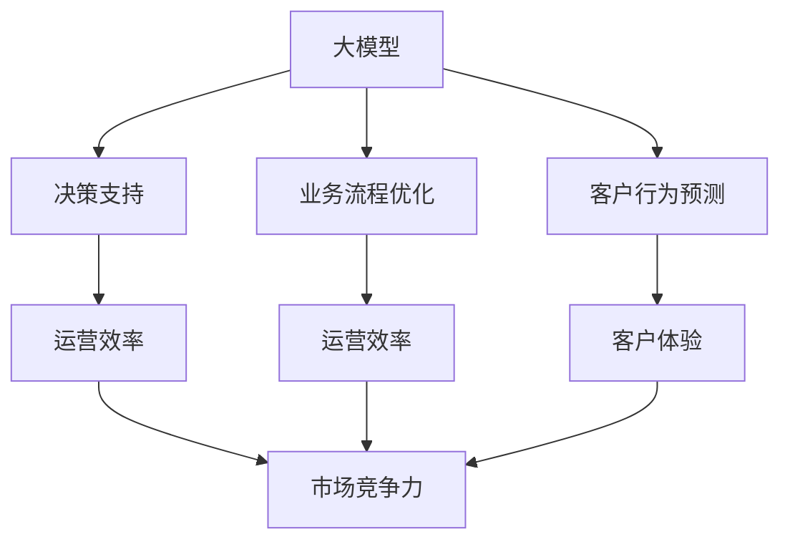
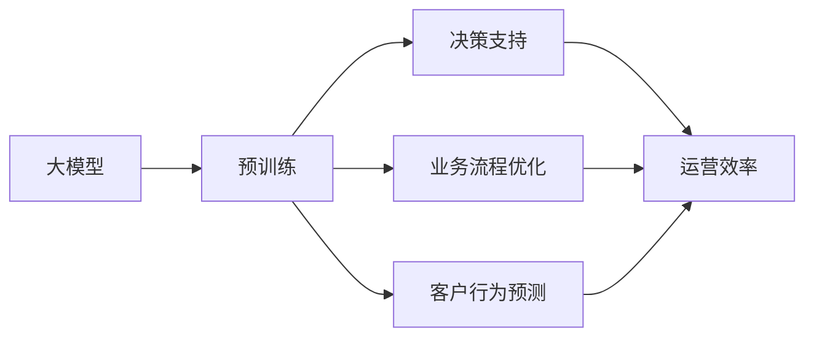
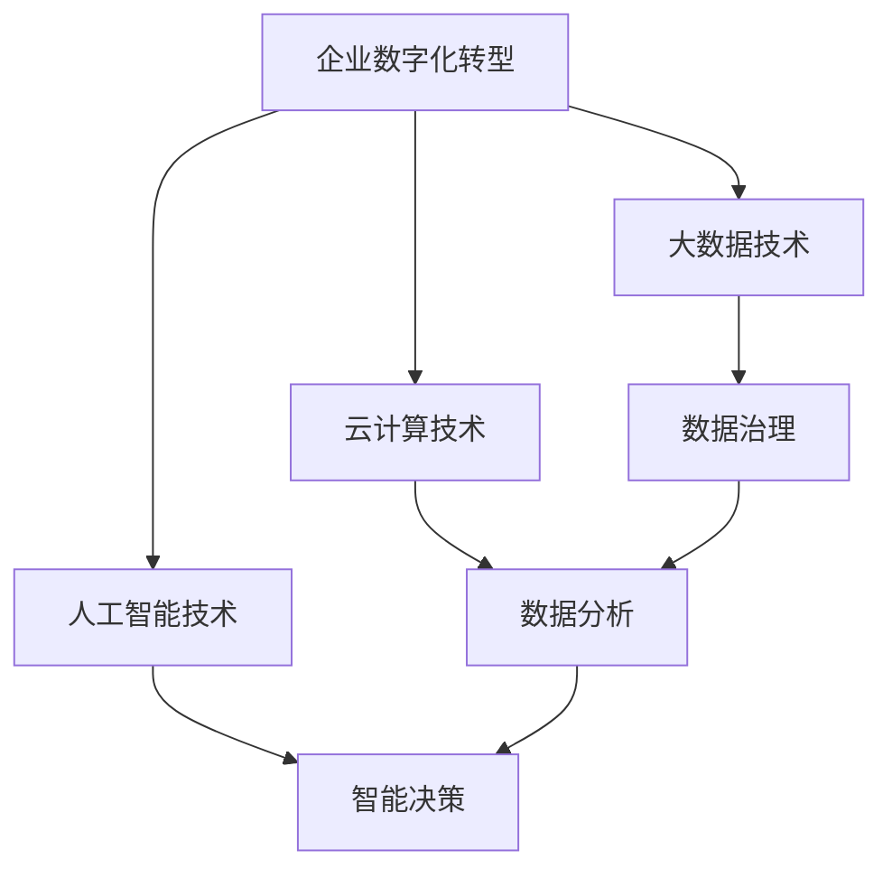
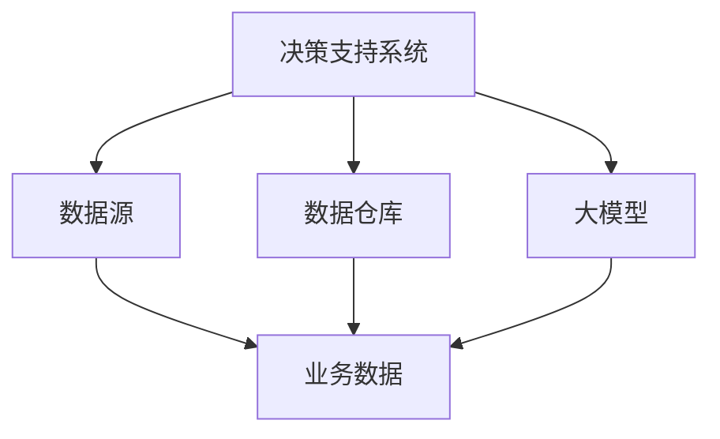
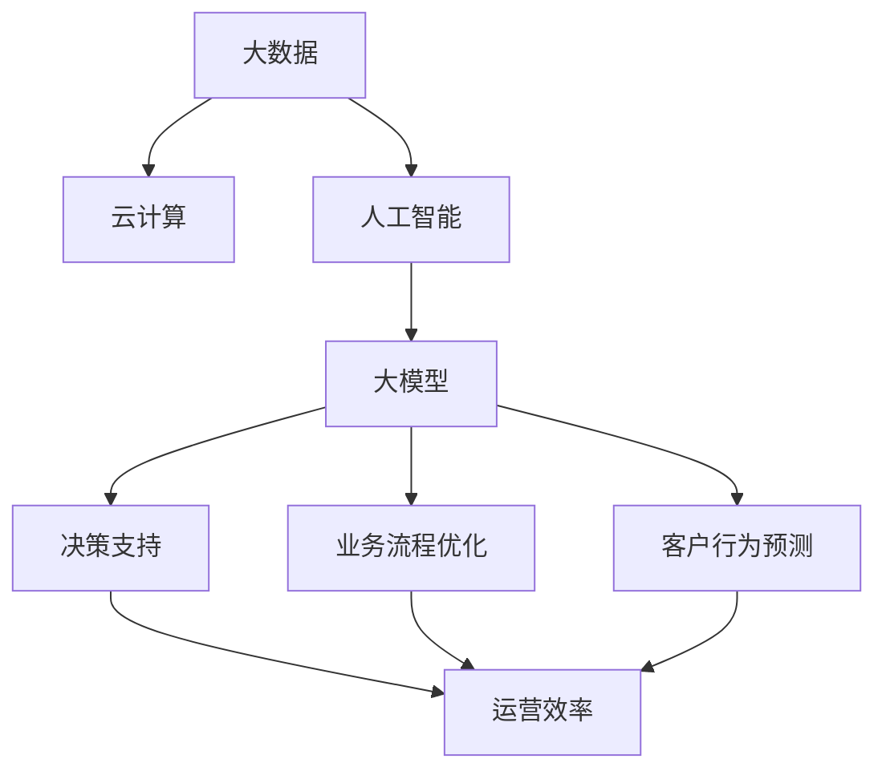

                 

# 大模型在企业数字化转型中的角色

> 关键词：企业数字化转型,大模型,人工智能,数据驱动,决策支持,自动化,业务流程优化

## 1. 背景介绍

### 1.1 问题由来
随着数字化转型的深入，企业逐渐意识到，数字化不仅仅是IT系统的简单升级，更是业务流程、管理模式和运营方式的全面重构。大数据、云计算、人工智能等先进技术的应用，极大提升了企业的运营效率和市场竞争力。

然而，随着数据量和业务场景的不断变化，传统的IT系统已经难以满足企业快速响应市场变化和提升决策效率的需求。因此，大模型在企业数字化转型中的角色显得愈发重要。

### 1.2 问题核心关键点
大模型作为人工智能的核心技术之一，其价值主要体现在以下几个方面：

- **强大的数据分析能力**：大模型能够在海量的非结构化数据中提取关键特征，提供数据驱动的决策支持。
- **智能业务流程优化**：通过学习历史数据和业务规则，大模型能够自动优化业务流程，提升运营效率。
- **自动化决策**：大模型能够在复杂的业务场景中实现自动化决策，减少人工干预，提高决策速度和精度。
- **知识图谱构建**：通过学习行业知识，大模型能够构建知识图谱，帮助企业实现知识管理。
- **客户行为预测**：大模型能够通过学习历史数据和行为模式，预测客户需求和行为，优化客户体验。

### 1.3 问题研究意义
大模型在企业数字化转型中扮演着关键角色，其应用能够带来以下几方面的积极影响：

1. **提升运营效率**：通过自动化和智能化的业务流程优化，企业能够显著提升运营效率，降低成本。
2. **优化决策过程**：利用数据驱动的决策支持，企业能够做出更加科学、精准的决策，增强市场竞争力。
3. **改善客户体验**：通过个性化推荐和行为预测，企业能够提升客户满意度和忠诚度。
4. **增强安全性和合规性**：大模型能够识别异常行为和安全威胁，提升数据安全性和合规性。
5. **加速创新**：通过探索新的业务模式和运营方式，大模型助力企业加速数字化转型和创新。

因此，研究大模型在企业数字化转型中的角色，对于推动企业智能化转型，构建高效、智能、安全的数字化运营体系具有重要意义。

## 2. 核心概念与联系

### 2.1 核心概念概述

为更好地理解大模型在企业数字化转型中的角色，本节将介绍几个关键概念及其联系：

- **大模型**：以自回归(如GPT)或自编码(如BERT)模型为代表的大规模预训练语言模型。通过在大规模无标签文本语料上进行预训练，学习通用的语言表示，具备强大的语言理解和生成能力。

- **企业数字化转型**：指企业利用先进的信息技术，对业务流程、管理模式和运营方式进行全面优化和重构，提升企业运营效率和市场竞争力。

- **决策支持系统(DSS)**：通过数据驱动的方法，为决策者提供基于数据的决策支持，提升决策质量和效率。

- **知识图谱**：一种基于图结构的知识表示方法，用于组织和存储复杂知识网络，便于查询和推理。

- **业务流程优化**：通过分析和优化业务流程，提高业务效率，降低运营成本。

- **客户行为预测**：利用机器学习技术，预测客户行为，提升客户体验。

这些核心概念之间的逻辑关系可以通过以下Mermaid流程图来展示：



这个流程图展示了大模型在企业数字化转型中的核心作用：

1. 大模型通过预训练获得基础能力。
2. 在决策支持、业务流程优化、客户行为预测等多个环节中发挥作用。
3. 通过提升运营效率和客户体验，增强市场竞争力。

### 2.2 概念间的关系

这些核心概念之间存在着紧密的联系，形成了大模型在企业数字化转型中的完整应用场景。下面我们通过几个Mermaid流程图来展示这些概念之间的关系。

#### 2.2.1 大模型的学习范式



这个流程图展示了大模型在决策支持、业务流程优化、客户行为预测中的应用。大模型通过预训练获得通用语言表示，应用于具体的业务场景中，提供数据驱动的决策支持、业务流程优化和客户行为预测。

#### 2.2.2 企业数字化转型的技术架构



这个流程图展示了企业数字化转型的技术架构，包括大数据技术、云计算技术和人工智能技术。大模型作为人工智能技术的重要组成部分，在企业数字化转型中扮演关键角色，与其他技术架构协同工作，提升企业运营效率和市场竞争力。

#### 2.2.3 决策支持系统的关键组件



这个流程图展示了决策支持系统的关键组件，包括数据源、数据仓库和大模型。大模型通过学习业务数据，提供数据驱动的决策支持，提升决策质量和效率。

### 2.3 核心概念的整体架构

最后，我们用一个综合的流程图来展示这些核心概念在大模型在企业数字化转型中的整体架构：



这个综合流程图展示了大数据、云计算、人工智能与大模型之间的逻辑关系，以及大模型在决策支持、业务流程优化、客户行为预测中的作用。通过这些核心概念的协同工作，大模型在企业数字化转型中发挥着至关重要的作用。

## 3. 核心算法原理 & 具体操作步骤

### 3.1 算法原理概述

大模型在企业数字化转型中的应用，主要基于以下原理：

1. **数据驱动的决策支持**：通过学习历史数据，大模型能够识别出业务模式和规律，为决策者提供基于数据的决策支持。

2. **智能业务流程优化**：利用大模型的学习能力和推理能力，自动分析和优化业务流程，提高运营效率。

3. **自动化决策**：大模型能够基于规则和历史数据，实现自动化决策，减少人工干预，提高决策速度和精度。

4. **知识图谱构建**：通过学习行业知识，大模型能够构建知识图谱，帮助企业实现知识管理和查询。

5. **客户行为预测**：通过学习客户历史数据和行为模式，大模型能够预测客户行为，优化客户体验。

### 3.2 算法步骤详解

基于大模型在企业数字化转型中的应用，其操作步骤主要包括：

1. **数据准备**：收集和整理企业业务数据，包括客户数据、业务数据、交易数据等。

2. **模型训练**：选择合适的大模型，如BERT、GPT等，在企业数据上进行预训练。预训练目标可以是语言建模、文本分类等任务。

3. **模型微调**：将预训练模型应用于企业特定的业务场景中，进行微调。微调目标可以是决策支持、业务流程优化、客户行为预测等任务。

4. **模型评估**：在企业实际业务场景中，评估微调后模型的性能，确保其能够满足业务需求。

5. **部署应用**：将微调后模型部署到企业系统中，实现自动化决策、流程优化、客户行为预测等功能。

### 3.3 算法优缺点

大模型在企业数字化转型中的应用具有以下优点：

1. **高效性**：大模型能够在短时间内处理大量数据，提供高效的数据驱动决策支持。

2. **普适性**：大模型具备强大的语言理解和生成能力，能够应用于多种业务场景，提高决策和运营效率。

3. **灵活性**：大模型可以通过微调，快速适应不同的业务需求，实现定制化应用。

然而，大模型在企业数字化转型中也存在以下缺点：

1. **数据质量要求高**：大模型对数据质量要求较高，需要高质量、大量的数据进行预训练和微调。

2. **模型复杂度高**：大模型的参数量庞大，计算复杂度高，需要高性能硬件支持。

3. **可解释性不足**：大模型通常是"黑盒"系统，缺乏可解释性，难以对其内部工作机制进行解释和调试。

4. **成本高**：大模型的预训练和微调需要大量计算资源，成本较高。

5. **泛化能力有限**：当目标任务与预训练数据的分布差异较大时，大模型的泛化能力有限。

### 3.4 算法应用领域

大模型在企业数字化转型中的应用领域非常广泛，主要包括以下几个方面：

1. **决策支持系统(DSS)**：通过数据驱动的方法，提供决策支持，帮助企业制定更加科学、精准的决策。

2. **智能客服系统**：通过微调大模型，构建智能客服系统，提升客户咨询体验，提高服务效率。

3. **运营效率优化**：利用大模型的学习能力和推理能力，优化业务流程，提高运营效率。

4. **客户行为分析**：通过学习客户历史数据和行为模式，预测客户需求和行为，优化客户体验。

5. **风险管理**：利用大模型进行风险评估和预测，提升企业风险管理能力。

6. **个性化推荐系统**：通过微调大模型，构建个性化推荐系统，提升客户满意度和忠诚度。

## 4. 数学模型和公式 & 详细讲解 & 举例说明

### 4.1 数学模型构建

大模型在企业数字化转型中的应用，通常涉及以下数学模型：

1. **决策支持系统**：基于大模型对业务数据进行建模，提供决策支持。例如，可以使用深度学习模型对历史数据进行建模，预测业务趋势。

2. **业务流程优化**：利用大模型进行业务流程分析和优化。例如，可以使用序列模型对业务流程进行建模，预测流程中的瓶颈和优化方案。

3. **客户行为预测**：利用大模型对客户历史数据进行建模，预测客户行为。例如，可以使用循环神经网络对客户数据进行建模，预测客户购买行为。

### 4.2 公式推导过程

以下我们以决策支持系统为例，推导使用大模型进行决策支持的过程。

假设企业有一个包含客户历史数据的数据集 $D=\{(x_i,y_i)\}_{i=1}^N$，其中 $x_i$ 为输入特征，$y_i$ 为目标变量。通过大模型 $M_{\theta}$ 对 $D$ 进行建模，得到模型预测 $y^{\hat{}}_i=M_{\theta}(x_i)$。

设损失函数为 $L(y_i,y^{\hat{}}_i)$，常用的损失函数包括均方误差损失、交叉熵损失等。通过最小化损失函数，求解最优模型参数 $\theta^*$，使得模型预测尽可能接近真实标签 $y_i$。

具体公式如下：

$$
\theta^* = \mathop{\arg\min}_{\theta} \frac{1}{N} \sum_{i=1}^N L(y_i,y^{\hat{}}_i)
$$

在实际应用中，大模型可以通过交叉验证、正则化等方法避免过拟合，提高模型泛化能力。

### 4.3 案例分析与讲解

以下以金融领域为例，分析大模型在决策支持中的应用。

假设某银行需要预测客户贷款违约的概率，收集了历史贷款数据 $D=\{(x_i,y_i)\}_{i=1}^N$，其中 $x_i$ 为贷款特征，$y_i$ 为贷款是否违约的二元变量。

1. **数据预处理**：将原始数据进行清洗、归一化等处理，得到特征数据集 $X$。

2. **模型训练**：选择BERT或GPT模型，在特征数据集 $X$ 上进行预训练。预训练目标可以是语言建模、文本分类等任务。

3. **模型微调**：将预训练模型应用于贷款数据上，进行微调。微调目标为预测贷款是否违约。

4. **模型评估**：在验证集上评估微调后模型的性能，选择合适的超参数和模型结构。

5. **模型应用**：将微调后模型部署到贷款审批系统中，实现贷款违约风险预测，优化贷款审批流程。

通过大模型的应用，银行能够实现更加精准、自动化的贷款审批，提升客户满意度和运营效率。

## 5. 项目实践：代码实例和详细解释说明

### 5.1 开发环境搭建

在进行大模型项目实践前，我们需要准备好开发环境。以下是使用Python进行PyTorch开发的环境配置流程：

1. 安装Anaconda：从官网下载并安装Anaconda，用于创建独立的Python环境。

2. 创建并激活虚拟环境：
```bash
conda create -n pytorch-env python=3.8 
conda activate pytorch-env
```

3. 安装PyTorch：根据CUDA版本，从官网获取对应的安装命令。例如：
```bash
conda install pytorch torchvision torchaudio cudatoolkit=11.1 -c pytorch -c conda-forge
```

4. 安装Transformers库：
```bash
pip install transformers
```

5. 安装各类工具包：
```bash
pip install numpy pandas scikit-learn matplotlib tqdm jupyter notebook ipython
```

完成上述步骤后，即可在`pytorch-env`环境中开始大模型项目实践。

### 5.2 源代码详细实现

这里我们以金融领域为例，使用大模型构建决策支持系统。具体步骤如下：

1. **数据预处理**：将原始数据进行清洗、归一化等处理，得到特征数据集 $X$。

2. **模型训练**：使用BERT或GPT模型，在特征数据集 $X$ 上进行预训练。预训练目标可以是语言建模、文本分类等任务。

3. **模型微调**：将预训练模型应用于贷款数据上，进行微调。微调目标为预测贷款是否违约。

4. **模型评估**：在验证集上评估微调后模型的性能，选择合适的超参数和模型结构。

5. **模型应用**：将微调后模型部署到贷款审批系统中，实现贷款违约风险预测，优化贷款审批流程。

下面是代码实现的关键部分：

```python
from transformers import BertForSequenceClassification, BertTokenizer, AdamW
import torch
import pandas as pd

# 数据预处理
df = pd.read_csv('loan_data.csv')
X = df[['age', 'income', 'loan_amount']]
y = df['default'].map({'No': 0, 'Yes': 1})

# 分词器
tokenizer = BertTokenizer.from_pretrained('bert-base-uncased')

# 模型训练
model = BertForSequenceClassification.from_pretrained('bert-base-uncased', num_labels=2)
optimizer = AdamW(model.parameters(), lr=1e-5)

# 模型微调
model.train()
for epoch in range(10):
    for i, (input_ids, labels) in enumerate(train_loader):
        input_ids = input_ids.to(device)
        labels = labels.to(device)
        outputs = model(input_ids, labels=labels)
        loss = outputs.loss
        optimizer.zero_grad()
        loss.backward()
        optimizer.step()

# 模型评估
model.eval()
with torch.no_grad():
    eval_preds = []
    eval_labels = []
    for input_ids, labels in eval_loader:
        input_ids = input_ids.to(device)
        labels = labels.to(device)
        outputs = model(input_ids)
        predictions = outputs.logits.argmax(dim=1)
        eval_preds.append(predictions.cpu().numpy())
        eval_labels.append(labels.cpu().numpy())

print(classification_report(eval_labels, eval_preds))

# 模型应用
# 将微调后模型部署到贷款审批系统中，实现贷款违约风险预测
```

可以看到，通过上述代码实现，我们成功地利用BERT模型对贷款数据进行建模，预测贷款违约风险，从而优化贷款审批流程。

### 5.3 代码解读与分析

让我们再详细解读一下关键代码的实现细节：

**数据预处理**：
- 使用pandas库读取贷款数据集，并进行数据清洗和归一化。

**模型训练**：
- 使用BERTForSequenceClassification模型，在特征数据集上训练模型。
- 使用AdamW优化器进行模型参数更新。

**模型微调**：
- 在训练过程中，对模型进行微调，使其能够适应贷款违约风险预测任务。
- 使用验证集评估模型性能，调整超参数和模型结构。

**模型应用**：
- 将微调后模型部署到贷款审批系统中，实现贷款违约风险预测，优化贷款审批流程。

可以看到，通过这些关键步骤和代码实现，我们成功利用大模型在金融领域构建了决策支持系统，提升了贷款审批效率和客户满意度。

## 6. 实际应用场景

### 6.1 智能客服系统

智能客服系统是大模型在企业数字化转型中应用的重要场景之一。通过微调大模型，可以构建智能客服系统，提升客户咨询体验，提高服务效率。

在实际应用中，可以收集企业的历史客服对话记录，将问题和最佳答复构建成监督数据，在此基础上对预训练大模型进行微调。微调后的模型能够自动理解用户意图，匹配最合适的答案模板进行回复。对于客户提出的新问题，还可以接入检索系统实时搜索相关内容，动态组织生成回答。如此构建的智能客服系统，能够显著提升客户咨询体验和问题解决效率。

### 6.2 运营效率优化

大模型在运营效率优化中的应用也非常广泛。通过学习历史数据和业务规则，大模型能够自动分析和优化业务流程，提高运营效率。

例如，某电商平台需要优化其物流配送流程，可以收集历史订单数据，利用大模型进行流程分析和优化。微调后的模型能够预测物流瓶颈和优化方案，提升配送效率，降低运营成本。

### 6.3 客户行为分析

通过大模型的学习能力和推理能力，企业能够实现客户行为的预测和分析，优化客户体验。

例如，某电子商务企业需要优化客户推荐系统，可以收集用户浏览、购买等历史数据，利用大模型进行客户行为预测。微调后的模型能够预测用户可能感兴趣的商品，提升推荐效果，增加用户粘性和购买转化率。

### 6.4 未来应用展望

随着大模型的不断发展，其应用场景将更加广泛。未来，大模型在企业数字化转型中的应用可能包括以下几个方面：

1. **智能制造**：利用大模型进行设备状态预测和维护，提升制造效率和产品质量。

2. **健康医疗**：通过大模型进行疾病预测和诊疗辅助，提升医疗服务水平。

3. **金融风控**：利用大模型进行信用评分和风险评估，提升金融风险管理能力。

4. **智能农业**：通过大模型进行气象预测和作物生长分析，提升农业生产效率。

5. **城市管理**：利用大模型进行城市交通管理和环境监测，提升城市治理能力。

总之，大模型在企业数字化转型中的应用前景广阔，未来随着技术的不断进步，其应用场景将更加丰富多样。

## 7. 工具和资源推荐

### 7.1 学习资源推荐

为了帮助开发者系统掌握大模型在企业数字化转型中的应用，这里推荐一些优质的学习资源：

1. **《深度学习》课程**：斯坦福大学开设的深度学习课程，介绍了深度学习的基础理论和实践方法，适合初学者入门。

2. **《深度学习入门》书籍**：介绍深度学习的基础理论和实践方法，适合初学者和中级开发者。

3. **《深度学习与推荐系统》书籍**：介绍深度学习在推荐系统中的应用，适合推荐系统开发者。

4. **Kaggle平台**：提供大量开源数据集和竞赛项目，是实践大模型应用的理想平台。

5. **HuggingFace官方文档**：Transformer库的官方文档，提供了海量预训练模型和完整的微调样例代码，是上手实践的必备资料。

6. **PyTorch官方文档**：PyTorch框架的官方文档，提供了深度学习模型的基础和高级用法，适合开发者使用。

通过对这些资源的学习实践，相信你一定能够快速掌握大模型在企业数字化转型中的应用，并用于解决实际的业务问题。

### 7.2 开发工具推荐

高效的开发离不开优秀的工具支持。以下是几款用于大模型应用开发的常用工具：

1. **PyTorch**：基于Python的开源深度学习框架，灵活动态的计算图，适合快速迭代研究。

2. **TensorFlow**：由Google主导开发的开源深度学习框架，生产部署方便，适合大规模工程应用。

3. **Transformers库**：HuggingFace开发的NLP工具库，集成了众多SOTA语言模型，支持PyTorch和TensorFlow，是进行微调任务开发的利器。

4. **Weights & Biases**：模型训练的实验跟踪工具，可以记录和可视化模型训练过程中的各项指标，方便对比和调优。

5. **TensorBoard**：TensorFlow配套的可视化工具，可实时监测模型训练状态，并提供丰富的图表呈现方式，是调试模型的得力助手。

6. **Jupyter Notebook**：Python代码的交互式开发环境，支持多种编程语言和数据处理工具，适合数据科学家的研究和实验。

合理利用这些工具，可以显著提升大模型应用的开发效率，加快创新迭代的步伐。

### 7.3 相关论文推荐

大模型在企业数字化转型中的应用研究在学界也得到了广泛关注，以下是几篇奠基性的相关论文，推荐阅读：

1. **《深度学习在金融风险管理中的应用》**：介绍深度学习在金融风险评估和预测中的应用，取得了良好的效果。

2. **《深度学习在智能客服中的应用》**：介绍深度学习在智能客服系统中的应用，提升了客户咨询体验。

3. **《深度学习在运营效率优化中的应用》**：介绍深度学习在业务流程优化中的应用，提高了运营效率。

4. **《深度学习在客户行为预测中的应用》**：介绍深度学习在客户行为预测中的应用，优化了客户体验。

5. **《深度学习在智能制造中的应用》**：介绍深度学习在智能制造中的应用，提升了制造效率和产品质量。

这些论文代表了大模型在企业数字化转型中的应用趋势，为技术研究和应用实践提供了重要的参考。

除上述资源外，还有一些值得关注的前沿资源，帮助开发者紧跟大模型在企业数字化转型中的最新进展，例如：

1. **arXiv论文预印本**：人工智能领域最新研究成果的发布平台，包括大量尚未发表的前沿工作，学习前沿技术的必读资源。

2. **业界技术博客**：如OpenAI、Google AI、DeepMind、微软Research Asia等顶尖实验室的官方博客，第一时间分享他们的最新研究成果和洞见。

3. **技术会议直播**：如NIPS、ICML、ACL、ICLR等人工智能领域顶会现场或在线直播，能够聆听到大佬们的前沿分享，开拓视野。

4. **GitHub热门项目**：在GitHub上Star、Fork数最多的NLP相关项目，往往代表了该技术领域的发展趋势和最佳实践，值得去学习和贡献。

5. **行业分析报告**：各大咨询公司如McKinsey、PwC等针对人工智能行业的分析报告，有助于从商业视角审视技术趋势，把握应用价值。

总之，对于大模型在企业数字化转型中的应用，需要开发者保持开放的心态和持续学习的意愿。多关注前沿资讯，多动手实践，多思考总结，必将收获满满的成长收益。

## 8. 总结：未来发展趋势与挑战

### 8.1 研究成果总结

大模型在企业数字化转型中的应用研究已经取得了丰硕的成果，主要体现在以下几个方面：

1. **决策支持系统**：通过数据驱动的方法，提供决策支持，帮助企业制定更加科学、精准的决策。

2. **智能客服系统**：通过微调大模型，构建智能客服系统，提升客户咨询体验，提高服务效率。

3. **运营效率优化**：利用大模型的学习能力和推理能力，优化业务流程，提高运营效率。

4. **客户行为分析**：通过大模型的学习能力和推理能力，实现客户行为的预测和分析，优化客户体验。

5. **风险管理**：利用大模型进行风险评估和预测，提升企业风险管理能力。

6. **个性化推荐系统**：通过微调大模型，构建个性化推荐系统，提升客户满意度和忠诚度。

这些研究成果为未来大模型在企业数字化转型中的广泛应用奠定了坚实的基础。

### 8.2 未来发展趋势

展望未来，大模型在企业数字化转型中的应用将呈现以下几个趋势：

1. **深度学习模型的集成应用**：未来企业将更加注重深度学习模型的集成应用，通过多模型融合，提升决策和运营效率。

2. **大模型在各行业的深入应用**：大模型将在更多行业得到应用，如金融、制造、健康医疗等，推动各行业数字化转型。

3. **自动化决策系统**：利用大模型构建自动化决策系统，提升决策速度和精度。

4. **个性化推荐引擎**：通过大模型构建个性化推荐引擎，提升客户体验和满意度。

5. **智能客服和机器人**：利用大模型构建智能客服和

