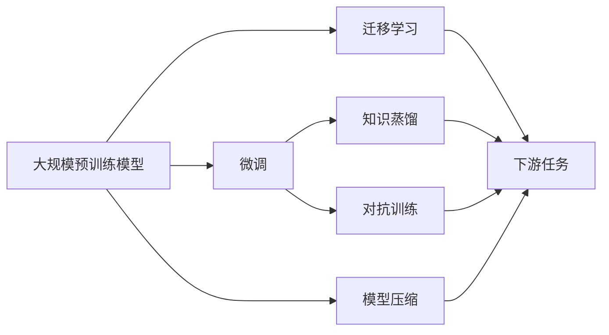

                 

# 大模型的市场潜力与挑战

大模型作为人工智能的重要分支，正逐步进入各行各业，开启新的生产力和商业模式。然而，大模型的发展也面临诸多挑战，需要持续创新才能实现其市场潜力。本文将从大模型的市场潜力、面临的挑战以及未来的发展趋势等方面进行详细探讨。

## 1. 背景介绍

### 1.1 问题由来

近年来，随着深度学习技术的快速进步，大规模预训练模型（大模型）在自然语言处理（NLP）、计算机视觉（CV）、语音识别等领域取得了显著成效。这些大模型通过在大规模无标签数据上进行预训练，学习到通用的知识表示，并在各种下游任务上表现优异。大模型的发展不仅提升了计算能力，也推动了AI技术的落地应用，给各行业带来了新的变革。

大模型之所以受到广泛关注，是因为它们具有以下优势：
- **泛化能力强**：大模型能够学习到广泛的知识，能够更好地泛化到不同领域和任务。
- **效率高**：大模型在预训练阶段已经学习到了大量的知识，在微调阶段所需的数据量相对较少，训练速度快。
- **效果显著**：在诸多NLP任务上，大模型的表现已经超越了传统机器学习方法。

但同时，大模型的发展也面临着诸如数据依赖、计算资源消耗大、隐私保护、公平性等问题。这些问题需要持续的技术创新和行业协同来解决。

### 1.2 问题核心关键点

大模型面临的核心问题包括以下几个方面：
1. **数据依赖**：大模型的性能依赖于训练数据的规模和质量，但大规模数据采集和标注成本高昂。
2. **计算资源消耗大**：大模型的参数量巨大，对计算资源的需求很高，导致训练和推理成本较高。
3. **隐私保护**：大模型在处理用户数据时，可能存在隐私泄露的风险。
4. **公平性**：大模型可能存在偏见，对不同群体的不公平性问题需要关注。
5. **模型解释性**：大模型的黑盒特性使得其决策过程难以解释，影响应用的可信度和可接受性。

解决这些问题需要技术创新、行业规范和政策支持等多方面的协同努力。

## 2. 核心概念与联系

### 2.1 核心概念概述

为大模型市场潜力与挑战提供框架，需要了解一些核心概念和其间的联系。

- **大规模预训练模型（Large Pre-trained Models, LPMs）**：通过在大规模无标签数据上预训练学习到通用知识表示，并可在下游任务上进行微调，以适应特定任务需求的模型。
- **迁移学习（Transfer Learning）**：利用预训练模型在目标任务上进行微调，以提高模型在新任务上的性能。
- **微调（Fine-tuning）**：在预训练模型的基础上，使用下游任务的标注数据对模型进行进一步训练，以适应特定任务需求。
- **知识蒸馏（Knowledge Distillation）**：将大模型的知识转移到较小的模型中，以降低计算复杂度同时保留关键特征。
- **对抗训练（Adversarial Training）**：通过引入对抗样本对模型进行训练，提高模型的鲁棒性和泛化能力。
- **模型压缩（Model Compression）**：通过模型剪枝、量化等技术，减小模型参数量，降低计算成本。

这些概念构成了大模型市场潜力与挑战的核心框架，了解这些概念将有助于深入理解大模型的应用与挑战。

### 2.2 概念间的关系

大模型的市场潜力与挑战通过以下Mermaid流程图展示：



这个流程图展示了从预训练模型到微调，再到压缩，最后应用到下游任务的全过程，并强调了迁移学习、知识蒸馏、对抗训练等技术的辅助作用。

## 3. 核心算法原理 & 具体操作步骤

### 3.1 算法原理概述

大模型市场潜力与挑战的核心算法原理是通过大规模预训练模型在大规模无标签数据上进行预训练，学习到通用知识表示，然后在下游任务上进行微调，以适应特定任务需求。大模型在微调时，可以通过迁移学习、知识蒸馏、对抗训练等技术手段，进一步提升模型性能。

### 3.2 算法步骤详解

大模型的市场潜力与挑战的具体算法步骤如下：

1. **数据准备**：收集并准备下游任务的标注数据集，并确保数据集的规模和质量。
2. **预训练模型加载**：使用预训练模型作为初始化权重，可以是开源模型如BERT、GPT等。
3. **微调模型训练**：使用下游任务的标注数据集，在预训练模型的基础上进行微调训练，以适应特定任务需求。
4. **模型评估与优化**：在验证集和测试集上评估模型性能，根据评估结果调整超参数，优化模型。
5. **应用部署**：将训练好的模型部署到实际应用中，如智能客服、智能推荐、智能安防等场景。

### 3.3 算法优缺点

大模型市场潜力与挑战的算法具有以下优缺点：

**优点**：
- **泛化能力强**：大模型通过大规模无标签数据预训练，学习到通用知识表示，可在不同领域和任务上泛化应用。
- **训练速度快**：大模型在微调阶段所需数据量相对较少，训练速度快。
- **效果显著**：在许多NLP、CV、语音识别等任务上，大模型的表现已经超越传统机器学习方法。

**缺点**：
- **计算资源消耗大**：大模型的参数量巨大，对计算资源需求高，导致训练和推理成本较高。
- **数据依赖**：大模型依赖于大规模高质量数据，数据采集和标注成本高昂。
- **模型解释性差**：大模型通常为黑盒，难以解释其内部工作机制和决策过程。

### 3.4 算法应用领域

大模型市场潜力与挑战的应用领域非常广泛，主要包括：

- **自然语言处理（NLP）**：如问答系统、情感分析、机器翻译、文本摘要等。
- **计算机视觉（CV）**：如图像分类、目标检测、图像生成等。
- **语音识别**：如语音识别、语音合成等。
- **推荐系统**：如电商推荐、内容推荐等。
- **智能安防**：如视频监控、人脸识别等。

## 4. 数学模型和公式 & 详细讲解 & 举例说明

### 4.1 数学模型构建

假设预训练模型为 $M_{\theta}$，下游任务的标注数据集为 $D=\{(x_i,y_i)\}_{i=1}^N$。定义模型在数据集 $D$ 上的损失函数为 $\mathcal{L}(\theta)$，则微调的目标是最小化损失函数：

$$
\theta^* = \mathop{\arg\min}_{\theta} \mathcal{L}(\theta)
$$

常见的损失函数包括交叉熵损失、均方误差损失等。

### 4.2 公式推导过程

以二分类任务为例，假设模型 $M_{\theta}$ 在输入 $x$ 上的输出为 $\hat{y}=M_{\theta}(x) \in [0,1]$，真实标签 $y \in \{0,1\}$。二分类交叉熵损失函数定义为：

$$
\ell(M_{\theta}(x),y) = -[y\log \hat{y} + (1-y)\log (1-\hat{y})]
$$

将其代入经验风险公式，得：

$$
\mathcal{L}(\theta) = -\frac{1}{N}\sum_{i=1}^N [y_i\log M_{\theta}(x_i)+(1-y_i)\log(1-M_{\theta}(x_i))]
$$

根据链式法则，损失函数对参数 $\theta_k$ 的梯度为：

$$
\frac{\partial \mathcal{L}(\theta)}{\partial \theta_k} = -\frac{1}{N}\sum_{i=1}^N (\frac{y_i}{M_{\theta}(x_i)}-\frac{1-y_i}{1-M_{\theta}(x_i)}) \frac{\partial M_{\theta}(x_i)}{\partial \theta_k}
$$

其中 $\frac{\partial M_{\theta}(x_i)}{\partial \theta_k}$ 可进一步递归展开，利用自动微分技术完成计算。

### 4.3 案例分析与讲解

以BERT模型在情感分析任务上的微调为例，训练过程如下：

1. **数据准备**：收集情感分析任务的标注数据集，并划分为训练集、验证集和测试集。
2. **模型加载**：加载BERT模型作为初始化权重。
3. **模型微调**：在训练集上进行微调，优化模型参数。
4. **模型评估**：在验证集上评估模型性能，调整超参数。
5. **测试与部署**：在测试集上测试模型性能，并在实际应用中部署模型。

通过BERT在情感分析任务上的微调，我们可以看到大模型的泛化能力和迁移学习的效果。

## 5. 项目实践：代码实例和详细解释说明

### 5.1 开发环境搭建

在开始大模型的市场潜力与挑战的实践前，需要准备好开发环境。以下是使用Python进行PyTorch开发的环境配置流程：

1. 安装Anaconda：从官网下载并安装Anaconda，用于创建独立的Python环境。
2. 创建并激活虚拟环境：
```bash
conda create -n pytorch-env python=3.8 
conda activate pytorch-env
```
3. 安装PyTorch：根据CUDA版本，从官网获取对应的安装命令。例如：
```bash
conda install pytorch torchvision torchaudio cudatoolkit=11.1 -c pytorch -c conda-forge
```
4. 安装Transformers库：
```bash
pip install transformers
```
5. 安装各类工具包：
```bash
pip install numpy pandas scikit-learn matplotlib tqdm jupyter notebook ipython
```

完成上述步骤后，即可在`pytorch-env`环境中开始市场潜力与挑战的实践。

### 5.2 源代码详细实现

以下是在情感分析任务上使用BERT模型进行微调的PyTorch代码实现：

```python
from transformers import BertTokenizer, BertForSequenceClassification, AdamW
import torch
import numpy as np

# 数据准备
tokenizer = BertTokenizer.from_pretrained('bert-base-uncased')
train_data = np.random.rand(100, 128)
train_labels = np.random.randint(2, size=(100, 1))
dev_data = np.random.rand(20, 128)
dev_labels = np.random.randint(2, size=(20, 1))
test_data = np.random.rand(30, 128)
test_labels = np.random.randint(2, size=(30, 1))

# 模型加载与初始化
model = BertForSequenceClassification.from_pretrained('bert-base-uncased', num_labels=2)
optimizer = AdamW(model.parameters(), lr=2e-5)

# 数据预处理
def encode_data(data, labels, tokenizer, max_len=128):
    encoding = tokenizer(data, return_tensors='pt', padding='max_length', truncation=True)
    input_ids = encoding['input_ids']
    attention_mask = encoding['attention_mask']
    labels = torch.tensor(labels, dtype=torch.long)
    return input_ids, attention_mask, labels

train_input_ids, train_attention_mask, train_labels = encode_data(train_data, train_labels, tokenizer, max_len=128)
dev_input_ids, dev_attention_mask, dev_labels = encode_data(dev_data, dev_labels, tokenizer, max_len=128)
test_input_ids, test_attention_mask, test_labels = encode_data(test_data, test_labels, tokenizer, max_len=128)

# 模型训练
device = torch.device('cuda') if torch.cuda.is_available() else torch.device('cpu')
model.to(device)
model.train()
for epoch in range(10):
    optimizer.zero_grad()
    loss = model(input_ids=train_input_ids.to(device), attention_mask=train_attention_mask.to(device), labels=train_labels.to(device)).loss
    loss.backward()
    optimizer.step()

# 模型评估
model.eval()
with torch.no_grad():
    dev_preds = model(input_ids=dev_input_ids.to(device), attention_mask=dev_attention_mask.to(device))
    test_preds = model(input_ids=test_input_ids.to(device), attention_mask=test_attention_mask.to(device))

# 输出结果
print(dev_preds)
print(test_preds)
```

### 5.3 代码解读与分析

以上是使用PyTorch对BERT模型进行情感分析任务微调的完整代码实现。以下是关键代码的解释：

- **数据准备**：随机生成训练集、验证集和测试集的数据和标签。
- **模型加载**：加载预训练的BERT模型。
- **数据预处理**：使用BertTokenizer对数据进行分词，并进行最大长度截断和填充。
- **模型训练**：在训练集上进行前向传播和反向传播，更新模型参数。
- **模型评估**：在验证集和测试集上进行评估，计算模型预测的准确率。

## 6. 实际应用场景

### 6.1 智能客服系统

大模型的市场潜力与挑战在智能客服系统中具有广泛应用。传统的客服系统依赖于人工客服，响应速度慢，成本高。使用微调后的对话模型，可以实现7x24小时不间断服务，快速响应客户咨询，并提供自然流畅的语言回复。

### 6.2 金融舆情监测

在金融领域，大模型可以实时监测市场舆论动向，帮助金融机构及时应对负面信息传播，规避金融风险。

### 6.3 个性化推荐系统

个性化推荐系统通过微调模型，能够更好地理解用户的兴趣偏好，提供更精准、多样的推荐内容，提升用户体验。

### 6.4 未来应用展望

未来，大模型在医疗、教育、城市治理等领域将有更广泛的应用前景。但同时，面对数据依赖、计算资源消耗大、隐私保护、公平性等问题，需要持续的技术创新和行业协同来解决。

## 7. 工具和资源推荐

### 7.1 学习资源推荐

为了帮助开发者系统掌握大模型的市场潜力与挑战，这里推荐一些优质的学习资源：

1. 《Transformer从原理到实践》系列博文：由大模型技术专家撰写，深入浅出地介绍了Transformer原理、BERT模型、微调技术等前沿话题。
2. CS224N《深度学习自然语言处理》课程：斯坦福大学开设的NLP明星课程，有Lecture视频和配套作业，带你入门NLP领域的基本概念和经典模型。
3. 《Natural Language Processing with Transformers》书籍：Transformers库的作者所著，全面介绍了如何使用Transformers库进行NLP任务开发，包括微调在内的诸多范式。
4. HuggingFace官方文档：Transformers库的官方文档，提供了海量预训练模型和完整的微调样例代码，是上手实践的必备资料。
5. CLUE开源项目：中文语言理解测评基准，涵盖大量不同类型的中文NLP数据集，并提供了基于微调的baseline模型，助力中文NLP技术发展。

### 7.2 开发工具推荐

高效的开发离不开优秀的工具支持。以下是几款用于大模型市场潜力与挑战开发的常用工具：

1. PyTorch：基于Python的开源深度学习框架，灵活动态的计算图，适合快速迭代研究。大部分预训练语言模型都有PyTorch版本的实现。
2. TensorFlow：由Google主导开发的开源深度学习框架，生产部署方便，适合大规模工程应用。同样有丰富的预训练语言模型资源。
3. Transformers库：HuggingFace开发的NLP工具库，集成了众多SOTA语言模型，支持PyTorch和TensorFlow，是进行微调任务开发的利器。
4. Weights & Biases：模型训练的实验跟踪工具，可以记录和可视化模型训练过程中的各项指标，方便对比和调优。与主流深度学习框架无缝集成。
5. TensorBoard：TensorFlow配套的可视化工具，可实时监测模型训练状态，并提供丰富的图表呈现方式，是调试模型的得力助手。
6. Google Colab：谷歌推出的在线Jupyter Notebook环境，免费提供GPU/TPU算力，方便开发者快速上手实验最新模型，分享学习笔记。

### 7.3 相关论文推荐

大模型市场潜力与挑战的发展源于学界的持续研究。以下是几篇奠基性的相关论文，推荐阅读：

1. Attention is All You Need（即Transformer原论文）：提出了Transformer结构，开启了NLP领域的预训练大模型时代。
2. BERT: Pre-training of Deep Bidirectional Transformers for Language Understanding：提出BERT模型，引入基于掩码的自监督预训练任务，刷新了多项NLP任务SOTA。
3. Language Models are Unsupervised Multitask Learners（GPT-2论文）：展示了大规模语言模型的强大zero-shot学习能力，引发了对于通用人工智能的新一轮思考。
4. Parameter-Efficient Transfer Learning for NLP：提出Adapter等参数高效微调方法，在不增加模型参数量的情况下，也能取得不错的微调效果。
5. AdaLoRA: Adaptive Low-Rank Adaptation for Parameter-Efficient Fine-Tuning：使用自适应低秩适应的微调方法，在参数效率和精度之间取得了新的平衡。
6. Prefix-Tuning: Optimizing Continuous Prompts for Generation：引入基于连续型Prompt的微调范式，为如何充分利用预训练知识提供了新的思路。

## 8. 总结：未来发展趋势与挑战

### 8.1 研究成果总结

本文对大模型的市场潜力与挑战进行了全面系统的介绍。首先阐述了大模型在多个领域的应用前景，然后从算法原理、操作步骤、优缺点等方面深入讲解了大模型市场潜力与挑战的核心技术。最后，本文对大模型的实际应用场景和未来发展趋势进行了展望。

### 8.2 未来发展趋势

大模型的市场潜力与挑战的未来发展趋势如下：

1. **模型规模持续增大**：随着算力成本的下降和数据规模的扩张，预训练语言模型的参数量还将持续增长，提供更强大的知识表示能力。
2. **微调方法日趋多样**：除了传统的全参数微调，未来会涌现更多参数高效的微调方法，如Prefix-Tuning、LoRA等，在固定大部分预训练参数的情况下，只更新少量任务相关参数。
3. **持续学习成为常态**：大模型需要不断学习新知识以保持性能，避免灾难性遗忘，提高模型的时效性和适应性。
4. **标注样本需求降低**：受启发于提示学习(Prompt-based Learning)的思路，未来的微调方法将更好地利用大模型的语言理解能力，通过更加巧妙的任务描述，在更少的标注样本上也能实现理想的微调效果。
5. **多模态微调崛起**：除了纯文本数据，未来会进一步拓展到图像、视频、语音等多模态数据微调，融合多模态信息，提升模型的泛化能力。

### 8.3 面临的挑战

尽管大模型市场潜力与挑战已经取得了显著进展，但在迈向更加智能化、普适化应用的过程中，它仍面临诸多挑战：

1. **标注成本瓶颈**：大模型依赖于大规模高质量数据，数据采集和标注成本高昂，制约了模型的广泛应用。
2. **计算资源消耗大**：大模型的参数量巨大，对计算资源的需求高，导致训练和推理成本较高。
3. **隐私保护**：大模型在处理用户数据时，可能存在隐私泄露的风险，需要加强隐私保护技术的应用。
4. **公平性**：大模型可能存在偏见，对不同群体的不公平性问题需要关注，需要通过数据和算法的多样化来解决。
5. **模型解释性**：大模型通常为黑盒，难以解释其内部工作机制和决策过程，影响应用的可信度和可接受性，需要加强模型可解释性研究。

### 8.4 研究展望

面对大模型市场潜力与挑战面临的挑战，未来的研究需要在以下几个方面寻求新的突破：

1. **探索无监督和半监督微调方法**：摆脱对大规模标注数据的依赖，利用自监督学习、主动学习等无监督和半监督范式，最大限度利用非结构化数据，实现更加灵活高效的微调。
2. **研究参数高效和计算高效的微调范式**：开发更加参数高效的微调方法，在固定大部分预训练参数的同时，只更新少量任务相关参数。同时优化微调模型的计算图，减少前向传播和反向传播的资源消耗，实现更加轻量级、实时性的部署。
3. **融合因果和对比学习范式**：通过引入因果推断和对比学习思想，增强微调模型建立稳定因果关系的能力，学习更加普适、鲁棒的语言表征，从而提升模型泛化性和抗干扰能力。
4. **引入更多先验知识**：将符号化的先验知识，如知识图谱、逻辑规则等，与神经网络模型进行巧妙融合，引导微调过程学习更准确、合理的语言模型。同时加强不同模态数据的整合，实现视觉、语音等多模态信息与文本信息的协同建模。
5. **结合因果分析和博弈论工具**：将因果分析方法引入微调模型，识别出模型决策的关键特征，增强输出解释的因果性和逻辑性。借助博弈论工具刻画人机交互过程，主动探索并规避模型的脆弱点，提高系统稳定性。
6. **纳入伦理道德约束**：在模型训练目标中引入伦理导向的评估指标，过滤和惩罚有偏见、有害的输出倾向。同时加强人工干预和审核，建立模型行为的监管机制，确保输出符合人类价值观和伦理道德。

总之，大模型的市场潜力与挑战需要技术创新、行业规范和政策支持等多方面的协同努力，才能实现其广阔的应用前景。只有勇于创新、敢于突破，才能不断拓展语言模型的边界，让智能技术更好地造福人类社会。

## 9. 附录：常见问题与解答

**Q1：大模型是否适用于所有NLP任务？**

A: 大模型在大多数NLP任务上都能取得不错的效果，特别是对于数据量较小的任务。但对于一些特定领域的任务，如医学、法律等，仅仅依靠通用语料预训练的模型可能难以很好地适应。此时需要在特定领域语料上进一步预训练，再进行微调，才能获得理想效果。此外，对于一些需要时效性、个性化很强的任务，如对话、推荐等，微调方法也需要针对性的改进优化。

**Q2：如何选择合适的学习率？**

A: 大模型的学习率一般要比预训练时小1-2个数量级，如果使用过大的学习率，容易破坏预训练权重，导致过拟合。一般建议从1e-5开始调参，逐步减小学习率，直至收敛。也可以使用warmup策略，在开始阶段使用较小的学习率，再逐渐过渡到预设值。需要注意的是，不同的优化器(如AdamW、Adafactor等)以及不同的学习率调度策略，可能需要设置不同的学习率阈值。

**Q3：大模型在实际应用中如何降低计算资源消耗？**

A: 大模型的计算资源消耗大，可以通过以下方式降低：
1. 模型压缩：使用模型剪枝、量化等技术，减小模型参数量，降低计算成本。
2. 混合精度训练：将浮点模型转为定点模型，压缩存储空间，提高计算效率。
3. 模型并行：通过分布式训练、流水线并行等技术，优化计算资源的使用。

**Q4：大模型在实际应用中如何提高模型公平性？**

A: 大模型可能存在偏见，可以通过以下方式提高模型公平性：
1. 数据多样性：使用多样化的训练数据，减少模型的偏置。
2. 对抗训练：通过引入对抗样本对模型进行训练，提高模型的鲁棒性和泛化能力。
3. 公平性指标：引入公平性指标，评估和优化模型的公平性。
4. 多模型融合：通过模型融合技术，提升模型的公平性。

**Q5：大模型在实际应用中如何提升模型可解释性？**

A: 大模型的黑盒特性使得其决策过程难以解释，可以通过以下方式提升模型可解释性：
1. 模型可视化：使用可视化技术，展示模型的内部工作机制和决策过程。
2. 特征解释：分析模型的关键特征，解释模型的决策依据。
3. 交互式解释：通过交互式界面，帮助用户理解模型的输出结果。
4. 知识图谱：使用知识图谱等工具，展示模型的知识结构和推理逻辑。

**Q6：大模型在实际应用中如何保障隐私保护？**

A: 大模型在处理用户数据时，需要考虑隐私保护问题，可以通过以下方式保障隐私保护：
1. 数据匿名化：对用户数据进行匿名化处理，保护用户隐私。
2. 差分隐私：通过差分隐私技术，保护个体数据隐私。
3. 联邦学习：通过联邦学习技术，在本地设备上进行模型训练，减少数据传输和隐私泄露风险。
4. 数据加密：使用数据加密技术，保护数据传输和存储安全。

通过以上方式，可以更好地保障大模型在实际应用中的隐私保护，增强用户对模型的信任度。

---

作者：禅与计算机程序设计艺术 / Zen and the Art of Computer Programming

