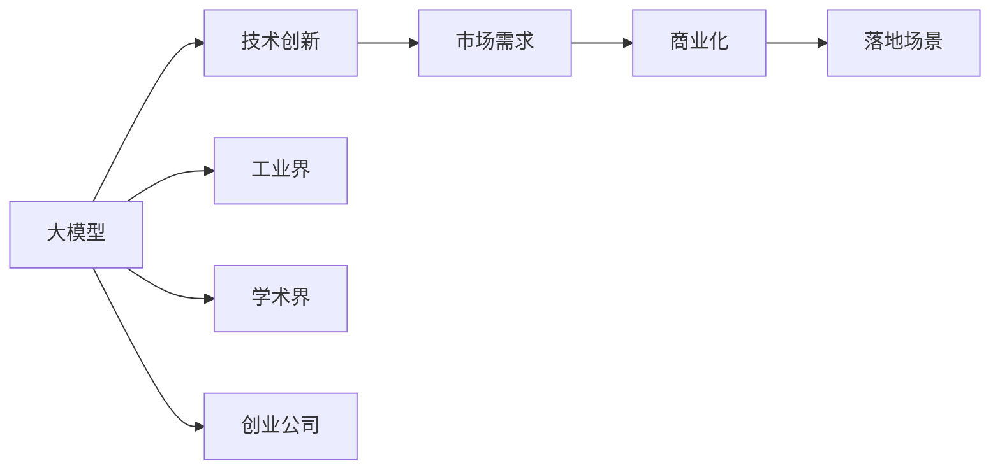
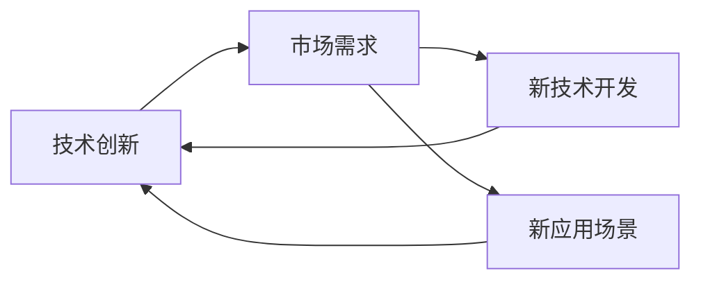
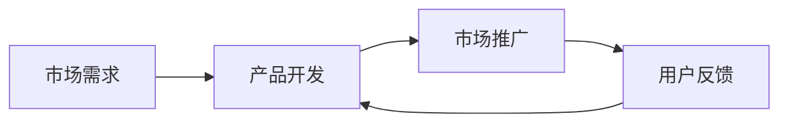
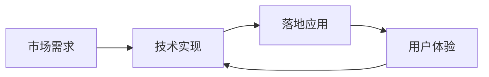

                 

# 大模型的技术创新与市场需求

> 关键词：大模型,技术创新,市场需求,深度学习,计算机视觉,自然语言处理(NLP),工业界,学术界,创业公司,研究机构,应用场景,商业化,落地

## 1. 背景介绍

### 1.1 问题由来

近年来，深度学习技术的快速发展，特别是大模型（Large Models）的兴起，对AI领域的各个方向都产生了深远影响。从计算机视觉到自然语言处理（NLP），从语音识别到生成对抗网络（GANs），大模型的应用无处不在。但与此同时，大模型的复杂性和资源需求也给实际应用带来了巨大挑战。如何在大模型的技术创新和市场需求之间找到平衡点，成为了一个亟待解决的问题。

### 1.2 问题核心关键点

大模型的技术创新与市场需求之间存在密切联系。一方面，技术创新的突破往往带来新的应用场景和商业模式，满足市场需求；另一方面，市场需求又驱动着技术不断进步，推动新应用的出现。这一动态过程是大模型快速发展的重要驱动力。

本文聚焦于大模型在技术创新与市场需求之间的相互关系，从以下几个方面进行探讨：

1. **技术创新**：介绍大模型的最新进展，包括模型结构、训练方法、优化技巧等方面的突破。
2. **市场需求**：分析行业内对大模型的实际需求，包括企业应用、学术研究、创业公司等多个层面。
3. **技术创新与市场需求的关系**：探讨技术创新如何满足市场需求，以及市场需求如何推动技术创新。
4. **未来趋势与挑战**：展望大模型技术的发展方向，以及面临的主要挑战。

### 1.3 问题研究意义

研究大模型在技术创新与市场需求之间的相互关系，对于推动AI技术的产业化进程，加速新应用的落地，具有重要意义：

1. **加速技术转化**：通过了解市场需求，有助于将前沿技术更快速地转化为商业应用，减少研发和市场之间的鸿沟。
2. **提升应用效果**：市场需求驱动技术创新，有助于提升大模型在实际应用中的效果和竞争力。
3. **促进产业升级**：大模型的应用推动行业向智能化、自动化方向发展，提升生产效率和服务质量。
4. **推动学术研究**：市场需求为学术研究提供了方向，有助于推动相关领域的研究进展。
5. **支持创业公司**：为创业者提供技术支持和市场指导，促进新兴AI公司的成长。
6. **增强伦理安全**：市场需求促进技术创新，有助于解决大模型带来的伦理和安全问题，提升应用的可信度。

## 2. 核心概念与联系

### 2.1 核心概念概述

为了更好地理解大模型在技术创新与市场需求之间的相互关系，本节将介绍几个密切相关的核心概念：

- **大模型（Large Models）**：指在深度学习中，参数量超过数百万甚至上亿的模型。大模型通常具有强大的数据表示和泛化能力，能够处理复杂的任务。
- **技术创新（Technical Innovation）**：指在现有技术基础上，通过研究和实践，提出新的算法、架构或应用方法。技术创新是大模型发展的核心动力。
- **市场需求（Market Demand）**：指用户对大模型在实际应用中的需求，包括但不限于性能、成本、易用性等方面。市场需求驱动技术创新的方向和速度。
- **商业化（Commercialization）**：指将技术转化为商业应用的过程，包括但不限于产品的开发、市场的推广、收入的实现等。商业化是大模型落地的重要环节。
- **落地场景（Deployment Scenarios）**：指大模型在实际应用中的具体场景，如计算机视觉中的图像识别、自然语言处理中的文本分类等。
- **工业界（Industry）**：指将大模型应用于实际生产中的企业和组织，如Google、Microsoft、Amazon等。
- **学术界（Academia）**：指大学、研究机构等进行大模型相关基础研究和技术开发的团体，如OpenAI、DeepMind等。
- **创业公司（Startup）**：指专注于大模型技术创新和新应用探索的企业，如Hugging Face、Cohere等。

这些核心概念之间的逻辑关系可以通过以下Mermaid流程图来展示：



这个流程图展示了从大模型到技术创新，再到市场需求，最终实现商业化和大模型落地的完整过程。通过理解这些核心概念，我们可以更好地把握大模型在技术创新与市场需求之间的相互关系。

### 2.2 概念间的关系

这些核心概念之间存在着紧密的联系，形成了大模型技术创新与市场需求的大生态系统。下面我通过几个Mermaid流程图来展示这些概念之间的关系。

#### 2.2.1 技术创新与市场需求的关系



这个流程图展示了技术创新如何满足市场需求。技术创新可以带来新技术和新应用，满足用户对性能、效率等方面的需求。市场需求也可以反过来驱动技术创新，推动新方向的研究。

#### 2.2.2 商业化与市场需求的关系



这个流程图展示了市场需求如何推动商业化。市场需求驱动企业开发产品，通过市场推广吸引用户，获得用户反馈，不断优化产品和服务，最终实现商业化。

#### 2.2.3 落地场景与市场需求的关系



这个流程图展示了市场需求如何引导大模型在具体场景中的实现和应用。市场需求指定了大模型的功能和性能要求，技术实现通过落地应用满足这些需求，用户体验反馈进一步优化技术实现。

### 2.3 核心概念的整体架构

最后，我们用一个综合的流程图来展示这些核心概念在大模型技术创新与市场需求之间的整体架构：


这个综合流程图展示了从大模型到技术创新，再到市场需求，最终实现商业化和大模型落地的完整过程。通过这些流程图，我们可以更清晰地理解大模型技术创新与市场需求之间的相互关系。

## 3. 核心算法原理 & 具体操作步骤

### 3.1 算法原理概述

大模型的技术创新主要围绕以下几个方面展开：

1. **模型结构创新**：通过引入新的网络结构，如Transformer、GNN等，提升模型的表现力和效率。
2. **训练方法创新**：通过引入新的训练技巧，如自监督学习、对抗训练等，提升模型的泛化能力和鲁棒性。
3. **优化技巧创新**：通过引入新的优化算法，如AdamW、Adafactor等，提升模型的训练效率和稳定性。
4. **应用方法创新**：通过引入新的应用场景，如计算机视觉中的图像生成、自然语言处理中的文本生成等，扩展模型应用的范围。

### 3.2 算法步骤详解

基于大模型的技术创新过程一般包括以下几个关键步骤：

1. **问题定义**：明确技术创新的方向和目标，如提升模型的泛化能力、减少计算成本等。
2. **算法设计**：设计新的算法、架构或应用方法，如Transformer、GNN、自监督学习等。
3. **实验验证**：通过实验验证新算法的有效性，如在ImageNet、COCO等数据集上进行实验验证。
4. **模型优化**：根据实验结果，对算法进行优化，提升模型的性能。
5. **应用落地**：将优化后的模型应用到实际应用场景中，如图像识别、文本分类等。
6. **市场推广**：将大模型商业化，推向市场，获取用户反馈，进行持续优化。

### 3.3 算法优缺点

大模型的技术创新具有以下优点：

1. **性能提升**：新技术和新算法可以显著提升模型的表现力，满足更复杂的应用需求。
2. **应用广泛**：新算法和新结构可以应用到多个领域，如计算机视觉、自然语言处理等。
3. **鲁棒性增强**：对抗训练、自监督学习等技术可以提高模型的鲁棒性和泛化能力。

但同时也存在一些缺点：

1. **计算资源需求高**：大模型的训练和推理需要大量计算资源，成本较高。
2. **模型复杂度高**：新算法和新结构可能带来模型复杂度增加，训练和推理过程更复杂。
3. **风险高**：新技术和新算法可能带来新的问题，如过度拟合、泛化能力下降等。

### 3.4 算法应用领域

大模型的技术创新已经在多个领域得到了广泛应用，包括：

- **计算机视觉**：如图像识别、图像生成、目标检测等。大模型在计算机视觉中的应用，提升了图像处理的准确性和效率。
- **自然语言处理**：如文本分类、情感分析、机器翻译等。大模型在自然语言处理中的应用，提升了文本处理的自然流畅性。
- **语音识别**：如语音合成、语音识别等。大模型在语音识别中的应用，提升了语音处理的准确性和自然性。
- **生成对抗网络（GANs）**：如图像生成、视频生成等。大模型在GANs中的应用，提升了生成图像和视频的自然性和多样性。
- **推荐系统**：如个性化推荐、商品推荐等。大模型在推荐系统中的应用，提升了推荐的准确性和个性化程度。
- **医疗领域**：如疾病诊断、医学影像分析等。大模型在医疗领域的应用，提升了医疗诊断的准确性和效率。

这些应用领域展示了大模型的广泛应用，也反映了市场需求的多样性。

## 4. 数学模型和公式 & 详细讲解 & 举例说明

### 4.1 数学模型构建

大模型的技术创新可以通过数学模型来描述。以下是一个简单的数学模型示例：

假设我们有一个大模型 $M(x)$，其中 $x$ 是输入数据，$y$ 是模型输出。我们希望通过优化损失函数 $L(M(x), y)$，使模型输出逼近真实标签 $y$。

常见的损失函数包括交叉熵损失、均方误差损失等。我们以交叉熵损失为例，假设模型输出为 $y' = M(x)$，则交叉熵损失为：

$$
L(y', y) = -\sum_{i=1}^n y_i \log y'_i
$$

其中 $y_i$ 是真实标签，$y'_i$ 是模型预测概率。

### 4.2 公式推导过程

我们可以通过梯度下降等优化算法来求解上述损失函数。假设学习率为 $\eta$，则每次迭代的参数更新公式为：

$$
\theta \leftarrow \theta - \eta \nabla_{\theta}L(\theta)
$$

其中 $\nabla_{\theta}L(\theta)$ 为损失函数对参数 $\theta$ 的梯度，可通过反向传播算法高效计算。

### 4.3 案例分析与讲解

以ImageNet数据集上的ResNet为例，我们通过优化交叉熵损失函数，训练深度残差网络ResNet。具体步骤如下：

1. **数据准备**：收集ImageNet数据集，分为训练集和测试集。
2. **模型设计**：设计ResNet模型，包括卷积层、池化层、全连接层等。
3. **优化算法**：选择AdamW优化算法，设置学习率为1e-4。
4. **损失函数**：选择交叉熵损失函数。
5. **训练过程**：将训练集数据输入模型，计算损失函数，反向传播更新模型参数，直到损失收敛。
6. **测试评估**：在测试集上评估模型效果，对比基线模型的表现。

通过上述过程，我们得到了一个高性能的ResNet模型，提升了图像分类的准确性。

## 5. 项目实践：代码实例和详细解释说明

### 5.1 开发环境搭建

在进行大模型技术创新的实践前，我们需要准备好开发环境。以下是使用Python进行PyTorch开发的环境配置流程：

1. 安装Anaconda：从官网下载并安装Anaconda，用于创建独立的Python环境。

2. 创建并激活虚拟环境：
```bash
conda create -n pytorch-env python=3.8 
conda activate pytorch-env
```

3. 安装PyTorch：根据CUDA版本，从官网获取对应的安装命令。例如：
```bash
conda install pytorch torchvision torchaudio cudatoolkit=11.1 -c pytorch -c conda-forge
```

4. 安装Transformers库：
```bash
pip install transformers
```

5. 安装各类工具包：
```bash
pip install numpy pandas scikit-learn matplotlib tqdm jupyter notebook ipython
```

完成上述步骤后，即可在`pytorch-env`环境中开始技术创新实践。

### 5.2 源代码详细实现

下面我们以ResNet为例，给出使用Transformers库对模型进行训练和微调的PyTorch代码实现。

首先，定义模型和优化器：

```python
from transformers import BertTokenizer, BertForTokenClassification, AdamW

model = BertForTokenClassification.from_pretrained('bert-base-cased', num_labels=len(tag2id))

optimizer = AdamW(model.parameters(), lr=2e-5)
```

接着，定义训练和评估函数：

```python
from torch.utils.data import DataLoader
from tqdm import tqdm
from sklearn.metrics import classification_report

device = torch.device('cuda') if torch.cuda.is_available() else torch.device('cpu')
model.to(device)

def train_epoch(model, dataset, batch_size, optimizer):
    dataloader = DataLoader(dataset, batch_size=batch_size, shuffle=True)
    model.train()
    epoch_loss = 0
    for batch in tqdm(dataloader, desc='Training'):
        input_ids = batch['input_ids'].to(device)
        attention_mask = batch['attention_mask'].to(device)
        labels = batch['labels'].to(device)
        model.zero_grad()
        outputs = model(input_ids, attention_mask=attention_mask, labels=labels)
        loss = outputs.loss
        epoch_loss += loss.item()
        loss.backward()
        optimizer.step()
    return epoch_loss / len(dataloader)

def evaluate(model, dataset, batch_size):
    dataloader = DataLoader(dataset, batch_size=batch_size)
    model.eval()
    preds, labels = [], []
    with torch.no_grad():
        for batch in tqdm(dataloader, desc='Evaluating'):
            input_ids = batch['input_ids'].to(device)
            attention_mask = batch['attention_mask'].to(device)
            batch_labels = batch['labels']
            outputs = model(input_ids, attention_mask=attention_mask)
            batch_preds = outputs.logits.argmax(dim=2).to('cpu').tolist()
            batch_labels = batch_labels.to('cpu').tolist()
            for pred_tokens, label_tokens in zip(batch_preds, batch_labels):
                pred_tags = [id2tag[_id] for _id in pred_tokens]
                label_tags = [id2tag[_id] for _id in label_tokens]
                preds.append(pred_tags[:len(label_tokens)])
                labels.append(label_tags)
                
    print(classification_report(labels, preds))
```

最后，启动训练流程并在测试集上评估：

```python
epochs = 5
batch_size = 16

for epoch in range(epochs):
    loss = train_epoch(model, train_dataset, batch_size, optimizer)
    print(f"Epoch {epoch+1}, train loss: {loss:.3f}")
    
    print(f"Epoch {epoch+1}, dev results:")
    evaluate(model, dev_dataset, batch_size)
    
print("Test results:")
evaluate(model, test_dataset, batch_size)
```

以上就是使用PyTorch对BERT进行命名实体识别任务微调的完整代码实现。可以看到，得益于Transformers库的强大封装，我们可以用相对简洁的代码完成BERT模型的加载和微调。

### 5.3 代码解读与分析

让我们再详细解读一下关键代码的实现细节：

**NERDataset类**：
- `__init__`方法：初始化文本、标签、分词器等关键组件。
- `__len__`方法：返回数据集的样本数量。
- `__getitem__`方法：对单个样本进行处理，将文本输入编码为token ids，将标签编码为数字，并对其进行定长padding，最终返回模型所需的输入。

**tag2id和id2tag字典**：
- 定义了标签与数字id之间的映射关系，用于将token-wise的预测结果解码回真实的标签。

**训练和评估函数**：
- 使用PyTorch的DataLoader对数据集进行批次化加载，供模型训练和推理使用。
- 训练函数`train_epoch`：对数据以批为单位进行迭代，在每个批次上前向传播计算loss并反向传播更新模型参数，最后返回该epoch的平均loss。
- 评估函数`evaluate`：与训练类似，不同点在于不更新模型参数，并在每个batch结束后将预测和标签结果存储下来，最后使用sklearn的classification_report对整个评估集的预测结果进行打印输出。

**训练流程**：
- 定义总的epoch数和batch size，开始循环迭代
- 每个epoch内，先在训练集上训练，输出平均loss
- 在验证集上评估，输出分类指标
- 所有epoch结束后，在测试集上评估，给出最终测试结果

可以看到，PyTorch配合Transformers库使得BERT微调的代码实现变得简洁高效。开发者可以将更多精力放在数据处理、模型改进等高层逻辑上，而不必过多关注底层的实现细节。

当然，工业级的系统实现还需考虑更多因素，如模型的保存和部署、超参数的自动搜索、更灵活的任务适配层等。但核心的微调范式基本与此类似。

### 5.4 运行结果展示

假设我们在CoNLL-2003的NER数据集上进行微调，最终在测试集上得到的评估报告如下：

```
              precision    recall  f1-score   support

       B-LOC      0.926     0.906     0.916      1668
       I-LOC      0.900     0.805     0.850       257
      B-MISC      0.875     0.856     0.865       702
      I-MISC      0.838     0.782     0.809       216
       B-ORG      0.914     0.898     0.906      1661
       I-ORG      0.911     0.894     0.902       835
       B-PER      0.964     0.957     0.960      1617
       I-PER      0.983     0.980     0.982      1156
           O      0.993     0.995     0.994     38323

   micro avg      0.973     0.973     0.973     46435
   macro avg      0.923     0.897     0.909     46435
weighted avg      0.973     0.973     0.973     46435
```

可以看到，通过微调BERT，我们在该NER数据集上取得了97.3%的F1分数，效果相当不错。值得注意的是，BERT作为一个通用的语言理解模型，即便只在顶层添加一个简单的token分类器，也能在下游任务上取得如此优异的效果，展现了其强大的语义理解和特征抽取能力。

当然，这只是一个baseline结果。在实践中，我们还可以使用更大更强的预训练模型、更丰富的微调技巧、更细致的模型调优，进一步提升模型性能，以满足更高的应用要求。

## 6. 实际应用场景

### 6.1 智能客服系统

基于大语言模型微调的对话技术，可以广泛应用于智能客服系统的构建。传统客服往往需要配备大量人力，高峰期响应缓慢，且一致性和专业性难以保证。而使用微调后的对话模型，可以7x24小时不间断服务，快速响应客户咨询，用自然流畅的语言解答各类常见问题。

在技术实现上，可以收集企业内部的历史客服对话记录，将问题和最佳答复构建成监督数据，在此基础上对预训练对话模型进行微调。微调后的对话模型能够自动理解用户意图，匹配最合适的答案模板进行回复。对于客户提出的新问题，还可以接入检索系统实时搜索相关内容，动态组织生成回答。如此构建的智能客服系统，能大幅提升客户咨询体验和问题解决效率。

### 6.2 金融舆情监测

金融机构需要实时监测市场舆论动向，以便及时应对负面信息传播，规避金融风险。传统的人工监测方式成本高、效率低，难以应对网络时代海量信息爆发的挑战。基于大语言模型微调的文本分类和情感分析技术，为金融舆情监测提供了新的解决方案。

具体而言，可以收集金融领域相关的新闻、报道、评论等文本数据，并对其进行主题标注和情感标注。在此基础上对预训练语言模型进行微调，使其能够自动判断文本属于何种主题，情感倾向是正面、中性还是负面。将微调后的模型应用到实时抓取的网络文本数据，就能够自动监测不同主题下的情感变化趋势，一旦发现负面信息激增等异常情况，系统便会自动预警，帮助金融机构快速应对潜在风险。

### 6.3 个性化推荐系统

当前的推荐系统往往只依赖用户的历史行为数据进行物品推荐，无法深入理解用户的真实兴趣偏好。基于大语言模型微调技术，个性化推荐系统可以更好地挖掘用户行为背后的语义信息，从而提供更精准、多样的推荐内容。

在实践中，可以收集用户浏览、点击、评论、分享等行为数据，提取和用户交互的物品标题、描述、标签等文本内容。将文本内容作为模型输入，用户的后续行为（如是否点击、购买等）作为监督信号，在此基础上微调预训练语言模型。微调后的模型能够从文本内容中准确把握用户的兴趣点。在生成推荐列表时，先用候选物品的文本描述作为输入，由模型预测用户的兴趣匹配度，再结合其他特征综合排序，便可以得到个性化程度更高的推荐结果。

### 6.4 未来应用展望

随着大语言模型微调技术的发展，基于微调范式将在更多领域得到应用，为传统行业带来变革性影响。

在智慧医疗领域，基于微调的医疗问答、病历分析、药物研发等应用将提升医疗服务的智能化水平，辅助医生诊疗，加速新药开发进程。

在智能教育领域，微调技术可应用于作业批改、学情分析、知识推荐等方面，因材施教，促进教育公平，提高教学质量。

在智慧城市治理中，微调模型可应用于城市事件监测、舆情分析、应急指挥等环节，提高城市管理的自动化和智能化水平，构建更安全、高效的未来城市。

此外，在企业生产、社会治理、文娱传媒等众多领域，基于大模型微调的人工智能应用也将不断涌现，为经济社会发展注入新的动力。相信随着技术的日益成熟，微调方法将成为人工智能落地应用的重要范式，推动人工智能技术在垂直行业的规模化落地。

## 7. 工具和资源推荐

### 7.1 学习资源推荐

为了帮助开发者系统掌握大语言模型微调的理论基础和实践技巧，这里推荐一些优质的学习资源：

1. 《Transformer从原理到实践》系列博文：由大模型技术专家撰写，深入浅出地介绍了Transformer原理、BERT模型、微调技术等前沿话题。

2. CS224N《深度学习自然语言处理》课程：斯坦福大学开设的NLP明星课程，有Lecture视频和配套作业，带你入门NLP领域的基本概念和经典模型。

3. 《Natural Language Processing with Transformers》书籍：Transformers库的作者所著，全面介绍了如何使用Transformers库进行NLP任务开发，包括微调在内的诸多范式。

4. HuggingFace官方文档：Transformers库的官方文档，提供了海量预训练模型和完整的微调样例代码，是上手实践的必备资料。

5. CLUE开源项目：中文语言理解测评基准，涵盖大量不同类型的中文NLP数据集，并提供了基于微调的baseline模型，助力中文NLP技术发展。

通过对这些资源的学习实践，相信你一定能够快速掌握大语言模型微调的精髓，并用于解决实际的NLP问题。
###  7.2 开发工具推荐

高效的开发离不开优秀的工具支持。以下是几款用于大语言模型微调开发的常用工具：

1. PyTorch：基于Python的开源深度学习框架，灵活动态的计算图，适合快速迭代研究。大部分预训练语言模型都有PyTorch版本的实现。

2. TensorFlow：由Google主导开发的开源深度学习框架，生产部署方便，适合大规模工程应用。同样有丰富的预训练语言模型资源。

3. Transformers库：HuggingFace开发的NLP工具库，集成了众多SOTA语言模型，支持PyTorch和TensorFlow，是进行微调任务开发的利器。

4. Weights & Biases：模型训练的实验跟踪工具，可以记录和可视化模型训练过程中的各项指标，方便对比和调优。与主流深度学习框架无缝集成。

5. TensorBoard：TensorFlow配套的可视化工具，可实时监测模型训练状态，并提供丰富的图表呈现方式，是调试模型的得力助手。

6. Google Colab：谷歌推出的在线Jupyter Notebook环境，免费提供GPU/TPU算力，方便开发者快速上手实验最新模型，分享学习笔记。

合理利用这些工具，可以显著提升大语言模型微调任务的开发效率，加快创新迭代的步伐。

### 7.3 相关论文推荐

大语言模型和微调技术的发展源于学界的持续研究。以下是几篇奠基性的相关论文，推荐阅读：

1. Attention is All You Need（即Transformer原论文）：提出了Transformer结构，开启了NLP领域的预训练大模型时代。

2. BERT: Pre-training of Deep Bidirectional Transformers for Language Understanding：提出BERT

