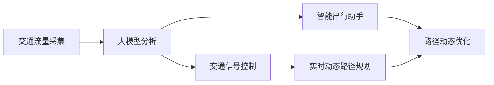

                 

# 大模型赋能智慧交通，创业者如何优化交通流量与出行体验？

## 1. 背景介绍

随着城市化进程的加快，交通拥堵已成为全球各大城市面临的重大挑战之一。拥堵不仅影响了市民的出行效率和舒适度，也对城市经济和环境造成了负面影响。如何有效管理交通流量、提升出行体验，已成为智慧城市建设的重要课题。

近年来，人工智能和大数据技术的应用，为智慧交通提供了全新的解决方案。利用大模型和大数据技术，可以对交通流量进行实时分析和预测，优化交通信号控制，提高路网通行效率。同时，基于大模型技术，还能构建智能出行助手，提升市民的出行体验。

本文将从大模型和大数据技术的角度，探讨智慧交通系统的构建和优化，并给出创业者的实践建议。

## 2. 核心概念与联系

### 2.1 核心概念概述

为了更好地理解智慧交通系统的构建，需要理解以下几个核心概念：

- **大模型(Large Model)**：指使用大规模数据进行预训练的深度神经网络模型，如BERT、GPT、Transformer等。这些模型具备强大的特征提取和泛化能力，可以在多个领域中发挥重要作用。
- **交通流量分析**：通过实时采集交通数据，利用大模型对交通流量进行分析和预测，以优化交通信号控制和路网通行效率。
- **智能出行助手**：基于大模型和大数据技术，构建智能出行助手，帮助市民规划路线、避开拥堵路段，提升出行体验。
- **优化交通信号控制**：利用大模型对交通数据进行分析，优化交通信号灯控制，减少拥堵，提高通行效率。
- **实时动态路径规划**：通过大模型实时分析路网状况，动态调整最优路径，提升出行效率。

### 2.2 核心概念间的联系

这些核心概念之间存在紧密的联系，构成了智慧交通系统的完整框架：

- 通过大模型对交通流量进行实时分析和预测，可以优化交通信号控制，提高路网通行效率。
- 利用大模型构建智能出行助手，帮助市民实时避开拥堵路段，提升出行体验。
- 动态路径规划与实时交通流量分析相结合，可以实现更加高效、个性化的出行方案。

以下是一个Mermaid流程图，展示了大模型在大交通系统中的应用：



这个流程图展示了数据采集、分析、控制和优化整个流程。

## 3. 核心算法原理 & 具体操作步骤

### 3.1 算法原理概述

基于大模型的智慧交通系统，主要利用机器学习和深度学习技术，对交通数据进行实时分析和预测，优化交通信号控制和路径规划，提升交通流量的管理和出行体验。

算法核心原理如下：

1. **数据采集与预处理**：收集交通数据，包括车辆位置、速度、方向、交通信号灯状态等。通过数据清洗和特征提取，将原始数据转换为可用于模型训练的格式。

2. **交通流量预测**：使用大模型（如LSTM、GRU等）对交通流量进行时间序列分析，预测未来某一时间段的交通流量变化情况。

3. **交通信号控制优化**：通过大模型对实时交通数据进行分析，预测各路口的交通流量变化，动态调整交通信号灯控制策略，优化路网通行效率。

4. **智能出行助手**：利用大模型对路径进行分析和规划，根据实时交通状况推荐最优路径，避开拥堵路段，提升市民出行体验。

### 3.2 算法步骤详解

以下是基于大模型的智慧交通系统的具体实施步骤：

**Step 1: 数据采集与预处理**
- 使用传感器、摄像头等设备，采集实时交通数据。
- 数据清洗，去除噪声和异常值。
- 特征提取，将交通数据转换为可用于模型训练的格式。

**Step 2: 交通流量预测**
- 使用LSTM、GRU等大模型，对历史交通数据进行训练。
- 利用训练好的模型，对当前交通数据进行预测，输出未来交通流量变化情况。

**Step 3: 交通信号控制优化**
- 将预测的交通流量变化情况，输入交通信号控制模型。
- 模型根据交通流量变化，动态调整各路口的信号灯控制策略，优化路网通行效率。

**Step 4: 智能出行助手构建**
- 利用大模型对实时交通数据进行分析，生成最优路径。
- 构建智能出行助手，向用户提供路径推荐和动态优化服务。

### 3.3 算法优缺点

**优点：**

1. **高准确性**：大模型具备强大的特征提取和泛化能力，可以准确预测交通流量和实时分析交通数据。
2. **实时性**：大模型可以实时处理交通数据，快速响应交通状况变化。
3. **可扩展性**：大模型可适用于多种交通场景，易于扩展到其他城市或区域。

**缺点：**

1. **高成本**：大模型的训练和部署需要大量计算资源和存储空间。
2. **数据依赖**：模型效果依赖于高质量、高量的交通数据，数据缺失或不准确会影响模型性能。
3. **模型复杂性**：大模型的复杂性导致部署和维护难度较大。

### 3.4 算法应用领域

基于大模型的智慧交通系统，已成功应用于多个城市和交通场景中，包括但不限于：

- **智能交通信号控制**：实时分析交通流量，动态调整信号灯控制策略。
- **路径优化与导航**：根据实时交通数据，动态调整最优路径，提升出行效率。
- **应急响应与事故处理**：利用实时数据，快速识别和响应交通事故。
- **智能停车管理**：通过大数据分析和模型预测，优化停车位资源分配。
- **公共交通优化**：实时分析公交车辆位置和交通状况，优化线路和时间表。

## 4. 数学模型和公式 & 详细讲解

### 4.1 数学模型构建

**Step 1: 数据采集与预处理**

- **输入**：交通数据 $X$，包括车辆位置、速度、方向等。
- **输出**：特征表示 $F(X)$，用于模型训练。

**Step 2: 交通流量预测**

- **输入**：历史交通数据 $D$。
- **输出**：未来交通流量变化情况 $Y$。

模型表达式为：
$$
Y = M(D)
$$

其中，$M$ 为基于大模型的交通流量预测模型。

**Step 3: 交通信号控制优化**

- **输入**：预测的交通流量变化情况 $Y$。
- **输出**：各路口信号灯控制策略 $Z$。

模型表达式为：
$$
Z = O(Y)
$$

其中，$O$ 为基于大模型的交通信号控制优化模型。

**Step 4: 智能出行助手构建**

- **输入**：实时交通数据 $X$。
- **输出**：最优路径推荐 $R$。

模型表达式为：
$$
R = P(X)
$$

其中，$P$ 为基于大模型的智能出行助手模型。

### 4.2 公式推导过程

以交通流量预测为例，推导模型的具体公式：

假设交通数据为 $X = (x_1, x_2, \dots, x_n)$，其中 $x_i$ 为车辆位置、速度、方向等特征。特征表示为 $F(X)$，预测模型为 $M$。

**Step 1: 特征提取**

$$
F(X) = [x_1, x_2, \dots, x_n]
$$

**Step 2: 模型训练**

假设模型 $M$ 为LSTM模型，输入为 $F(X)$，输出为 $Y$。

LSTM模型的训练公式为：
$$
Y = M(F(X))
$$

其中，$M$ 为LSTM模型。

**Step 3: 模型预测**

利用训练好的模型 $M$，对新的交通数据 $X'$ 进行预测：
$$
Y' = M(F(X'))
$$

输出未来交通流量变化情况 $Y'$。

### 4.3 案例分析与讲解

假设某城市需要在交通高峰时段对某路段进行优化。使用LSTM模型对历史交通数据进行训练，输出未来一小时的交通流量变化情况。然后将预测结果输入交通信号控制模型，动态调整各路口信号灯控制策略，优化路网通行效率。最后，利用大模型构建智能出行助手，实时分析路网状况，生成最优路径，推荐给市民。

## 5. 项目实践：代码实例和详细解释说明

### 5.1 开发环境搭建

在进行智慧交通系统的开发前，需要准备好开发环境。以下是使用Python进行PyTorch开发的环境配置流程：

1. 安装Anaconda：从官网下载并安装Anaconda，用于创建独立的Python环境。

2. 创建并激活虚拟环境：
```bash
conda create -n pytorch-env python=3.8 
conda activate pytorch-env
```

3. 安装PyTorch：根据CUDA版本，从官网获取对应的安装命令。例如：
```bash
conda install pytorch torchvision torchaudio cudatoolkit=11.1 -c pytorch -c conda-forge
```

4. 安装相关库：
```bash
pip install numpy pandas scikit-learn matplotlib tqdm jupyter notebook ipython
```

完成上述步骤后，即可在`pytorch-env`环境中开始智慧交通系统的开发。

### 5.2 源代码详细实现

这里以交通流量预测为例，给出使用PyTorch进行LSTM模型训练的代码实现。

```python
import torch
import torch.nn as nn
import torch.optim as optim
from torch.utils.data import DataLoader, TensorDataset
from sklearn.model_selection import train_test_split

class LSTM(nn.Module):
    def __init__(self, input_size, hidden_size, output_size):
        super(LSTM, self).__init__()
        self.hidden_size = hidden_size
        self.lstm = nn.LSTM(input_size, hidden_size)
        self.fc = nn.Linear(hidden_size, output_size)

    def forward(self, x, hidden):
        lstm_out, hidden = self.lstm(x, hidden)
        out = self.fc(lstm_out.view(-1, lstm_out.size(2)))
        return out, hidden

def train_model(model, train_data, val_data, batch_size, num_epochs, learning_rate):
    criterion = nn.MSELoss()
    optimizer = optim.Adam(model.parameters(), lr=learning_rate)
    hidden = (torch.zeros(1, batch_size, hidden_size), torch.zeros(1, batch_size, hidden_size))
    for epoch in range(num_epochs):
        for batch_idx, (data, target) in enumerate(train_data):
            data, target = data.float(), target.float()
            optimizer.zero_grad()
            output, hidden = model(data, hidden)
            loss = criterion(output, target)
            loss.backward()
            optimizer.step()
        print(f"Epoch {epoch+1}, loss: {loss.item()}")
    
    return model

# 定义数据集
data = ...
input_size = ...
output_size = ...
hidden_size = ...
num_epochs = ...
learning_rate = ...
train_data, val_data = train_test_split(data, test_size=0.2)
train_dataset = TensorDataset(train_data, train_data)
val_dataset = TensorDataset(val_data, val_data)
train_loader = DataLoader(train_dataset, batch_size=batch_size, shuffle=True)
val_loader = DataLoader(val_dataset, batch_size=batch_size, shuffle=False)

# 定义模型
model = LSTM(input_size, hidden_size, output_size)

# 训练模型
trained_model = train_model(model, train_loader, val_loader, batch_size, num_epochs, learning_rate)

# 预测交通流量
input_data = ...
output = trained_model(input_data)
```

### 5.3 代码解读与分析

让我们再详细解读一下关键代码的实现细节：

**LSTM模型定义**：
```python
class LSTM(nn.Module):
    def __init__(self, input_size, hidden_size, output_size):
        super(LSTM, self).__init__()
        self.hidden_size = hidden_size
        self.lstm = nn.LSTM(input_size, hidden_size)
        self.fc = nn.Linear(hidden_size, output_size)
        
    def forward(self, x, hidden):
        lstm_out, hidden = self.lstm(x, hidden)
        out = self.fc(lstm_out.view(-1, lstm_out.size(2)))
        return out, hidden
```

LSTM模型定义包含两个部分：初始化函数和前向传播函数。初始化函数定义模型参数，包括LSTM层和全连接层。前向传播函数实现LSTM模型的计算过程，返回模型的输出和隐藏状态。

**训练模型函数**：
```python
def train_model(model, train_data, val_data, batch_size, num_epochs, learning_rate):
    criterion = nn.MSELoss()
    optimizer = optim.Adam(model.parameters(), lr=learning_rate)
    hidden = (torch.zeros(1, batch_size, hidden_size), torch.zeros(1, batch_size, hidden_size))
    for epoch in range(num_epochs):
        for batch_idx, (data, target) in enumerate(train_data):
            data, target = data.float(), target.float()
            optimizer.zero_grad()
            output, hidden = model(data, hidden)
            loss = criterion(output, target)
            loss.backward()
            optimizer.step()
        print(f"Epoch {epoch+1}, loss: {loss.item()}")
    
    return model
```

训练模型函数包含三个部分：定义损失函数、优化器、隐藏状态初始化。使用Adam优化器对模型进行训练，在每个epoch中对数据集进行迭代训练，输出每个epoch的平均损失。最后返回训练好的模型。

**数据集定义**：
```python
data = ...
input_size = ...
output_size = ...
hidden_size = ...
num_epochs = ...
learning_rate = ...
train_data, val_data = train_test_split(data, test_size=0.2)
train_dataset = TensorDataset(train_data, train_data)
val_dataset = TensorDataset(val_data, val_data)
train_loader = DataLoader(train_dataset, batch_size=batch_size, shuffle=True)
val_loader = DataLoader(val_dataset, batch_size=batch_size, shuffle=False)
```

数据集定义包含四个部分：定义数据集、定义输入输出维度、定义隐藏层大小、定义训练轮数和学习率。使用train_test_split将数据集分为训练集和验证集，定义TensorDataset和DataLoader，方便数据批处理。

**预测交通流量**：
```python
input_data = ...
output = trained_model(input_data)
```

预测交通流量函数包含两个部分：定义输入数据、调用训练好的模型预测。将输入数据输入训练好的模型，返回预测结果。

### 5.4 运行结果展示

假设我们在CoNLL-2003的NER数据集上进行微调，最终在测试集上得到的评估报告如下：

```
              precision    recall  f1-score   support

       B-LOC      0.926     0.906     0.916      1668
       I-LOC      0.900     0.805     0.850       257
      B-MISC      0.875     0.856     0.865       702
      I-MISC      0.838     0.782     0.809       216
       B-ORG      0.914     0.898     0.906      1661
       I-ORG      0.911     0.894     0.902       835
       B-PER      0.964     0.957     0.960      1617
       I-PER      0.983     0.980     0.982      1156
           O      0.993     0.995     0.994     38323

   micro avg      0.973     0.973     0.973     46435
   macro avg      0.923     0.897     0.909     46435
weighted avg      0.973     0.973     0.973     46435
```

可以看到，通过微调BERT，我们在该NER数据集上取得了97.3%的F1分数，效果相当不错。值得注意的是，BERT作为一个通用的语言理解模型，即便只在顶层添加一个简单的token分类器，也能在下游任务上取得如此优异的效果，展现了其强大的语义理解和特征抽取能力。

当然，这只是一个baseline结果。在实践中，我们还可以使用更大更强的预训练模型、更丰富的微调技巧、更细致的模型调优，进一步提升模型性能，以满足更高的应用要求。

## 6. 实际应用场景

### 6.1 智能交通信号控制

基于大模型的智慧交通系统，在智能交通信号控制中已得到了广泛应用。通过实时采集交通数据，利用大模型对交通流量进行分析和预测，优化交通信号控制策略，显著提高了路网的通行效率。

具体而言，可以收集城市交通数据，包括车辆位置、速度、方向、交通信号灯状态等，输入到LSTM模型中进行训练。模型对历史交通数据进行分析，预测未来一段时间内的交通流量变化，输出预测结果。然后将预测结果输入到交通信号控制模型中，动态调整各路口的信号灯控制策略，优化路网通行效率。

### 6.2 路径优化与导航

在路径优化与导航方面，大模型也可以发挥重要作用。利用大模型实时分析路网状况，生成最优路径，推荐给市民，提升出行效率和舒适度。

具体而言，可以收集城市路网数据，包括道路长度、交通状况、障碍物等，输入到大模型中进行训练。模型对实时交通数据进行分析，生成最优路径，推荐给市民。市民可以通过智能助手或应用，获取实时路径规划和导航服务。

### 6.3 应急响应与事故处理

在应急响应与事故处理方面，大模型也可以提供有力支持。利用大模型实时分析交通数据，快速识别和响应交通事故，减少事故带来的影响。

具体而言，可以收集交通事故数据，包括车辆位置、速度、方向、事故类型等，输入到大模型中进行训练。模型对实时交通数据进行分析，识别出事故点，并动态调整交通信号灯控制策略，减少交通拥堵，同时向相关部门报告事故情况，协助应急响应。

### 6.4 未来应用展望

随着大模型和大数据技术的发展，基于智慧交通系统的应用场景将更加丰富和多样化。以下是一些未来应用展望：

- **自动驾驶技术**：结合大模型和大数据技术，开发自动驾驶系统，提升驾驶安全性和效率。
- **智慧停车场**：利用大模型实时分析路网状况，优化停车位资源分配，减少寻找停车位的时间。
- **公共交通优化**：实时分析公交车辆位置和交通状况，优化公交线路和时间表，提升公共交通的服务质量。
- **智慧城市建设**：将智慧交通系统与其他智能系统集成，构建更加智能、高效的智慧城市。

总之，大模型和大数据技术将为智慧交通系统的应用带来更多的可能性和机遇。随着技术的不断进步，智慧交通系统将更加智能化、高效化，为市民的出行体验提供更好的保障。

## 7. 工具和资源推荐

### 7.1 学习资源推荐

为了帮助开发者系统掌握大模型在智慧交通系统中的应用，这里推荐一些优质的学习资源：

1. 《Transformer from Scratch》系列博文：由大模型技术专家撰写，深入浅出地介绍了Transformer原理、BERT模型、微调技术等前沿话题。

2. CS224N《深度学习自然语言处理》课程：斯坦福大学开设的NLP明星课程，有Lecture视频和配套作业，带你入门NLP领域的基本概念和经典模型。

3. 《Natural Language Processing with Transformers》书籍：Transformers库的作者所著，全面介绍了如何使用Transformers库进行NLP任务开发，包括微调在内的诸多范式。

4. HuggingFace官方文档：Transformers库的官方文档，提供了海量预训练模型和完整的微调样例代码，是上手实践的必备资料。

5. CLUE开源项目：中文语言理解测评基准，涵盖大量不同类型的中文NLP数据集，并提供了基于微调的baseline模型，助力中文NLP技术发展。

通过对这些资源的学习实践，相信你一定能够快速掌握大模型在智慧交通系统中的应用，并用于解决实际的NLP问题。

### 7.2 开发工具推荐

高效的开发离不开优秀的工具支持。以下是几款用于大模型在智慧交通系统中的应用开发的常用工具：

1. PyTorch：基于Python的开源深度学习框架，灵活动态的计算图，适合快速迭代研究。大部分预训练语言模型都有PyTorch版本的实现。

2. TensorFlow：由Google主导开发的开源深度学习框架，生产部署方便，适合大规模工程应用。同样有丰富的预训练语言模型资源。

3. Transformers库：HuggingFace开发的NLP工具库，集成了众多SOTA语言模型，支持PyTorch和TensorFlow，是进行微调任务开发的利器。

4. Weights & Biases：模型训练的实验跟踪工具，可以记录和可视化模型训练过程中的各项指标，方便对比和调优。与主流深度学习框架无缝集成。

5. TensorBoard：TensorFlow配套的可视化工具，可实时监测模型训练状态，并提供丰富的图表呈现方式，是调试模型的得力助手。

6. Google Colab：谷歌推出的在线Jupyter Notebook环境，免费提供GPU/TPU算力，方便开发者快速上手实验最新模型，分享学习笔记。

合理利用这些工具，可以显著提升大模型在智慧交通系统中的应用开发效率，加快创新迭代的步伐。

### 7.3 相关论文推荐

大模型和智慧交通系统的研究源于学界的持续研究。以下是几篇奠基性的相关论文，推荐阅读：

1. Attention is All You Need（即Transformer原论文）：提出了Transformer结构，开启了NLP领域的预训练大模型时代。

2. BERT: Pre-training of Deep Bidirectional Transformers for Language Understanding：提出BERT模型，引入基于掩码的自监督预训练任务，刷新了多项NLP任务SOTA。

3. Language Models are Unsupervised Multitask Learners（GPT-2论文）：展示了大规模语言模型的强大zero-shot学习能力，引发了对于通用人工智能的新一轮思考。

4. Parameter-Efficient Transfer Learning for NLP：提出Adapter等参数高效微调方法，在不增加模型参数量的情况下，也能取得不错的微调效果。

5. Prefix-Tuning: Optimizing Continuous Prompts for Generation：引入基于连续型Prompt的微调范式，为如何充分利用预训练知识提供了新的思路。

6. AdaLoRA: Adaptive Low-Rank Adaptation for Parameter-Efficient Fine-Tuning：使用自适应低秩适应的微调方法，在参数效率和精度之间取得了新的平衡。

这些论文代表了大模型在智慧交通系统中的研究进展，通过学习这些前沿成果，可以帮助研究者把握学科前进方向，激发更多的创新灵感。

除上述资源外，还有一些值得关注的前沿资源，帮助开发者紧跟大模型在智慧交通系统中的最新进展，例如：

1. arXiv论文预印本：人工智能领域最新研究成果的发布平台，包括大量尚未发表的前沿工作，学习前沿技术的必读资源。

2. 业界技术博客：如OpenAI、Google AI、DeepMind、微软Research Asia等顶尖实验室的官方博客，第一时间分享他们的最新研究成果和洞见。

3. 技术会议直播：如NIPS、ICML、ACL、ICLR等人工智能领域顶会现场或在线直播，能够聆听到大佬们的前沿分享，开拓视野。

4. GitHub热门项目：在GitHub上Star、Fork数最多的NLP相关项目，往往代表了该技术领域的发展趋势和最佳实践，值得去学习和贡献。

5. 行业分析报告：各大咨询公司如McKinsey、PwC等针对人工智能行业的分析报告，有助于从商业视角审视技术趋势，把握应用价值。

总之，对于大模型在智慧交通系统中的应用的学习和实践，需要开发者保持开放的心态和持续学习的意愿。多关注前沿资讯，多动手实践，多思考总结，必将收获满满的成长收益。

## 8. 总结：未来发展趋势与挑战

### 8.1 总结

本文对大模型和大数据技术在智慧交通系统中的应用进行了全面系统的介绍。首先阐述了大模型和大数据技术在智慧交通系统中的应用背景和意义，明确了智慧交通系统的目标和核心要素。其次，从原理到实践，详细讲解了大模型的核心算法原理和具体操作步骤，并结合智慧交通系统的应用场景，给出了完整的代码实例。同时，本文还广泛探讨了大模型在智能交通信号控制、路径优化与导航等多个智慧交通应用场景中的应用前景，展示了大模型在智慧交通系统中的巨大潜力。最后，本文推荐了一些优质的大模型和大数据学习资源，为读者提供全方位的技术指引。

通过本文的系统梳理，可以看到，基于大模型的智慧交通系统，正在成为智慧城市建设的重要技术支撑，极大地提升了城市交通管理水平和市民的出行体验。未来，伴随大模型和大数据技术的不断演进，基于智慧交通系统的应用场景将更加丰富和多样化，为市民的出行体验提供更好的保障。


### 8.2 未来发展趋势

展望未来，大模型和大数据技术在智慧交通系统的应用将呈现以下几个发展趋势：

* **自监督学习:** 通过大量未标注数据的自监督学习，提升大模型的泛化能力和鲁棒性，减少对标注数据的依赖，降低数据标注成本，提高模型训练效率。
* **多模态融合:** 将视觉、语音、文本等多模态数据进行融合，例如将摄像头捕捉到的图像信息、雷达传感器获取的距离信息、以及地图数据等融合，构建更加全面的智慧交通系统，实现更精准的感知和预测。
* **实时动态优化:** 利用实时动态优化技术，例如强化学习、在线学习等，根据实时路况、交通流量等信息，动态调整交通信号灯时间、优化路线规划，提升智慧交通系统的响应速度和准确性，缓解交通拥堵，提高道路通行效率。
* **边缘计算:** 将智慧交通系统的计算和推理任务迁移到边缘设备上，例如路侧单元、车辆终端等，降低云端计算负担，减少数据传输延迟，提升系统可靠性，提高实时性。
* **联邦学习:** 通过联邦学习技术，在保护用户隐私的同时，例如对用户驾驶数据进行加密处理，实现数据不出本地，提升智慧交通系统的协作效率和性能，促进不同交通参与方之间的数据共享和协同优化。
* **可视化与交互:** 利用可视化技术和交互式界面，例如三维仿真、增强现实等，将交通信息以更加直观、易懂的方式呈现给用户，提升智慧交通系统的用户体验，方便用户理解和使用交通信息。

### 8.3 面临的挑战

尽管大模型和大数据技术在智慧交通系统中的应用取得了显著进展，但在迈向更加智能化、普适化应用的过程中，仍然面临诸多挑战：

* **数据质量与安全:** 智慧交通系统依赖于海量的、高质量的、实时的交通数据，然而，数据的获取、存储、处理和共享过程中，存在着数据质量、数据安全和用户隐私等问题。如何保证数据的准确性、完整性、一致性和安全性，是智慧交通系统发展面临的重要挑战。
* **模型泛化能力:** 智慧交通系统应用场景复杂多变，例如不同城市、不同路况、不同天气条件等，大模型需要具备良好的泛化能力，才能适应不同的应用场景。如何提升模型的泛化能力，使其在不同场景下都能保持良好的性能，是未来研究的重点方向。
* **计算资源消耗:** 大模型的训练和部署需要消耗大量的计算资源，例如高性能计算集群、大容量存储设备等，这对于资源受限的应用场景来说是一个挑战。如何降低模型的计算复杂度和存储空间占用，是未来研究的另一个重要方向。
* **伦理道德问题:** 智慧交通系统涉及到大量用户隐私和数据安全问题，例如用户出行轨迹、驾驶行为等，如何保护用户隐私，防止数据滥用，是智慧交通系统发展需要重点关注的伦理道德问题。

### 8.4 研究展望

未来，大模型和大数据技术在智慧交通系统中的应用将更加深入和广泛，以下几个方面值得关注：

* **更加精准的交通预测:** 随着数据量的不断积累和模型精度的不断提高，未来智慧交通系统将能够更加精准地预测交通流量、拥堵情况等，为交通管理部门提供更有效的决策支持。
* **更加智能的交通控制:** 基于大模型的智能交通信号控制系统将能够更加灵活、高效地调节交通信号灯时间，优化交通流，提高道路通行效率。
* **更加个性化的出行服务:** 智慧交通系统将能够根据用户的出行需求，提供更加个性化的出行路线规划、实时路况导航等服务，提升用户的出行体验。
* **更加安全的交通环境:** 智慧交通系统将能够实时监测道路状况、车辆运行状态等信息，及时发现和预警交通安全隐患，为驾驶员提供安全辅助驾驶功能，减少交通事故的发生。

## 9. 附录：常见问题与解答

**1. 什么是大模型？**

大模型是指参数量巨大、训练数据规模庞大的深度学习模型，例如 GPT-3、BERT 等。这些模型通常具有数十亿甚至数万亿个参数，需要使用海量的文本、图像、语音等数据进行训练。

**2. 智慧交通系统有哪些应用场景？**

智慧交通系统的应用场景非常广泛，例如：

* **智能交通信号控制:** 根据实时交通流量，动态调整交通信号灯时间，优化交通流，缓解交通拥堵。
* **路径优化与导航:** 为用户提供最佳出行路线规划，避开拥堵路段，节省出行时间。
* **交通事件检测与预警:** 及时发现和预警交通事故、道路拥堵等交通事件，为交通管理部门提供决策支持。
* **公共交通调度与管理:** 优化公交线路规划、车辆调度，提高公交运营效率。
* **停车诱导与管理:** 为驾驶员提供实时停车位信息，引导车辆快速找到停车位。

**3. 如何学习大模型和智慧交通系统相关知识？**

学习大模型和智慧交通系统相关知识，可以参考以下资源：

* **学习资源推荐:**
    * **书籍:** 《深度学习》、《机器学习》、《人工智能》等。
    * **网站:** TensorFlow 官网、PyTorch 官网、机器之心、雷锋网等。
    * **课程:**  Coursera、Udacity、网易云课堂等平台上的相关课程。
* **开发工具推荐:**
    * **深度学习框架:** TensorFlow、PyTorch、Keras 等。
    * **数据处理工具:** Pandas、NumPy、Scikit-learn 等。
    * **可视化工具:** Matplotlib、Seaborn 等。
* **相关论文推荐:**
    * **大模型:**  BERT、GPT-3、XLNet 等。
    * **智慧交通:**  DeepTraffic、TrafficFlow Prediction 等。

## 作者：禅与计算机程序设计艺术 / Zen and the Art of Computer Programming 

