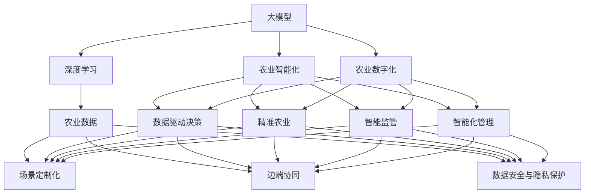

                 

# 大模型赋能智慧农业，创业者如何助力农业智能化与数字化？

## 1. 背景介绍

### 1.1 问题由来

农业作为国民经济的基础产业，关乎国家的粮食安全和生态文明建设。近年来，随着人口的增长和环境的变化，传统农业面临着资源紧缺、生产效率低、收益不稳定等多重挑战。如何通过技术创新，提升农业智能化与数字化水平，保障粮食安全，促进农民增收，已成为农业领域的重要课题。

### 1.2 问题核心关键点

面对农业领域的复杂问题，如何利用大模型赋能农业智能化与数字化，提高农业生产效率和资源利用率，是当前农业技术创新的一个热点。具体来说，包括以下几个关键点：

1. **数据与模型匹配**：农业数据复杂多样，如何选择合适的模型和大模型，进行数据驱动的决策支持，是问题的核心。
2. **场景定制化**：不同地区、不同作物的农业场景各异，如何实现大模型的场景定制化应用，提升模型的实用性。
3. **边端协同**：在农业环境下，数据采集与处理通常分布在田间地头，如何实现边缘计算与云端大模型的有效协同，提升数据处理效率。
4. **安全性与隐私**：农业数据涉及国家安全、农民隐私等多个敏感领域，如何确保数据安全与隐私保护，是应用大模型需要重点关注的问题。

### 1.3 问题研究意义

大模型在农业智能化与数字化中的应用，具有以下几个重要意义：

1. **数据驱动决策**：通过大模型分析海量农业数据，提供科学的种植、养殖建议，优化资源配置，提升生产效率。
2. **精准农业**：利用大模型进行土地、气候、作物生长的精准分析，实现精准播种、灌溉、施肥等操作，提高产量和质量。
3. **智能监管**：基于大模型的智能监测和预警系统，实时监测农作物生长情况、病虫害、气象变化等，及时采取应对措施，保障作物健康。
4. **智能化管理**：结合物联网、云计算等技术，实现农业生产管理智能化，降低人力成本，提高生产效益。
5. **可持续发展**：通过大模型优化农业生产方式，提升资源利用率，推动农业向可持续、绿色方向发展。

## 2. 核心概念与联系

### 2.1 核心概念概述

为更好地理解大模型在农业智能化与数字化中的应用，本节将介绍几个核心概念：

- **大模型(Large Model)**：指以深度学习模型为代表的、拥有海量参数、能够处理大规模数据的模型，如BERT、GPT、ResNet等。大模型通过大规模训练，掌握了丰富的特征表示能力。
- **农业智能化(Agricultural Automation)**：指通过人工智能技术，实现农业生产、管理、决策等环节的自动化和智能化，提升农业生产效率和资源利用率。
- **农业数字化(Agricultural Digitalization)**：指通过数字技术，将农业生产、加工、销售等全链条进行数字化改造，实现数据驱动的精准农业、智能农业。
- **深度学习(Deep Learning)**：一种基于神经网络的机器学习方法，通过多层非线性变换，从数据中学习高级特征表示，广泛应用于图像、语音、自然语言处理等领域。
- **场景定制化(Scene Customization)**：针对特定农业场景，对大模型进行特定任务的微调和优化，提升模型在该场景下的适应性。
- **边端协同(Edge-Cloud Collaboration)**：将大模型部分任务下沉到边缘计算设备，与云端模型进行协同工作，提升数据处理效率和实时性。
- **数据安全与隐私保护(Data Security & Privacy Protection)**：通过数据加密、匿名化、访问控制等技术手段，确保农业数据的隐私与安全。

### 2.2 概念间的关系

这些核心概念之间的逻辑关系可以通过以下Mermaid流程图来展示：



这个流程图展示了核心概念之间的逻辑关系：

1. 大模型通过深度学习实现高级特征表示。
2. 农业智能化与数字化需要大量数据驱动决策、精准农业、智能监管和智能化管理。
3. 农业数据需要经过场景定制化、边端协同和数据安全与隐私保护的处理。
4. 深度学习、场景定制化、边端协同和数据安全与隐私保护是实现农业智能化与数字化的关键技术。

这些概念共同构成了大模型在农业智能化与数字化中的应用框架，使我们能够更好地把握大模型的工作原理和优化方向。

## 3. 核心算法原理 & 具体操作步骤

### 3.1 算法原理概述

大模型在农业智能化与数字化中的应用，主要涉及以下几个关键算法原理：

- **特征提取与表示学习**：利用大模型对农业数据进行特征提取，学习出有用的特征表示，用于农业决策与分析。
- **数据驱动决策支持**：基于大模型对农业数据进行分析，提供科学的决策支持，优化农业生产和管理。
- **精准农业**：利用大模型进行精准分析，实现精准播种、灌溉、施肥等操作，提高产量和质量。
- **智能监管与预警**：利用大模型进行实时监测和预警，及时发现并应对农业生产中的问题，保障农作物健康。
- **智能化管理**：利用大模型结合物联网、云计算等技术，实现农业生产管理智能化，提高生产效益。

### 3.2 算法步骤详解

大模型在农业智能化与数字化中的应用，一般包括以下几个关键步骤：

**Step 1: 数据收集与预处理**

- **数据收集**：从农业生产、加工、销售等环节收集数据，包括气象、土壤、作物生长数据、病虫害数据、设备运行数据等。
- **数据清洗与标准化**：清洗缺失数据、异常数据，标准化数据格式，确保数据质量。

**Step 2: 模型选择与训练**

- **模型选择**：选择合适的深度学习模型，如卷积神经网络(CNN)、循环神经网络(RNN)、Transformer等，根据具体任务需求进行微调。
- **模型训练**：利用农业数据对模型进行训练，优化模型参数，提升模型性能。

**Step 3: 模型部署与集成**

- **模型部署**：将训练好的模型部署到农业生产现场，结合物联网、云计算等技术，实现农业生产、管理、决策等环节的自动化和智能化。
- **系统集成**：将大模型与其他系统进行集成，如农业无人机、农田传感器、智能灌溉系统等，实现数据共享和协同工作。

**Step 4: 监测与优化**

- **实时监测**：利用大模型对农业生产进行实时监测，提供实时数据和分析报告。
- **性能优化**：定期对模型进行性能评估和优化，确保模型适应农业生产环境的动态变化。

### 3.3 算法优缺点

大模型在农业智能化与数字化中的应用，具有以下优点：

1. **数据驱动决策**：利用大模型分析海量农业数据，提供科学的种植、养殖建议，优化资源配置，提升生产效率。
2. **精准农业**：利用大模型进行土地、气候、作物生长的精准分析，实现精准播种、灌溉、施肥等操作，提高产量和质量。
3. **智能监管**：基于大模型的智能监测和预警系统，实时监测农作物生长情况、病虫害、气象变化等，及时采取应对措施，保障作物健康。
4. **智能化管理**：结合物联网、云计算等技术，实现农业生产管理智能化，降低人力成本，提高生产效益。
5. **可持续性发展**：通过大模型优化农业生产方式，提升资源利用率，推动农业向可持续、绿色方向发展。

同时，大模型在农业智能化与数字化中也存在以下缺点：

1. **数据依赖**：大模型需要大量高质量的数据进行训练，农业数据存在地域、作物、季节等差异，数据获取和处理复杂。
2. **计算资源消耗**：大模型参数量大，计算复杂度高，需要高性能计算资源进行训练和推理。
3. **边端协同挑战**：农业生产环境复杂，数据采集与处理通常分布在田间地头，边缘计算与云端大模型的协同工作难度较大。
4. **数据隐私与安全**：农业数据涉及国家安全、农民隐私等多个敏感领域，数据安全和隐私保护是一个重要问题。
5. **模型适应性**：大模型在不同农业场景下的适应性需要进一步优化，确保模型在不同农业环境下的泛化能力。

### 3.4 算法应用领域

大模型在农业智能化与数字化中的应用，主要涉及以下几个领域：

- **精准农业**：通过大模型对土地、气候、作物生长等进行精准分析，实现精准播种、灌溉、施肥等操作。
- **智能监管与预警**：利用大模型进行实时监测和预警，及时发现并应对农业生产中的问题，保障农作物健康。
- **农业无人机与物联网**：结合农业无人机、农田传感器等物联网设备，利用大模型实现数据采集与分析，优化农业生产管理。
- **农业数据与知识管理**：通过大模型对农业数据进行分析和挖掘，提取有价值的知识和信息，辅助农业决策和管理。
- **智能农机与自动化**：利用大模型优化农业机械的智能控制与操作，提升农业生产效率和资源利用率。

## 4. 数学模型和公式 & 详细讲解 & 举例说明

### 4.1 数学模型构建

本节将使用数学语言对大模型在农业智能化与数字化中的应用进行更加严格的刻画。

记农业数据集为 $D=\{(x_i,y_i)\}_{i=1}^N$，其中 $x_i$ 为输入数据， $y_i$ 为农业生产结果。假设大模型为 $M_{\theta}$，其中 $\theta$ 为模型参数。

定义模型 $M_{\theta}$ 在数据样本 $(x,y)$ 上的损失函数为 $\ell(M_{\theta}(x),y)$，则在数据集 $D$ 上的经验风险为：

$$
\mathcal{L}(\theta) = \frac{1}{N}\sum_{i=1}^N \ell(M_{\theta}(x_i),y_i)
$$

微调的目标是最小化经验风险，即找到最优参数：

$$
\theta^* = \mathop{\arg\min}_{\theta} \mathcal{L}(\theta)
$$

在实践中，我们通常使用基于梯度的优化算法（如SGD、Adam等）来近似求解上述最优化问题。设 $\eta$ 为学习率，则参数的更新公式为：

$$
\theta \leftarrow \theta - \eta \nabla_{\theta}\mathcal{L}(\theta)
$$

其中 $\nabla_{\theta}\mathcal{L}(\theta)$ 为损失函数对参数 $\theta$ 的梯度，可通过反向传播算法高效计算。

### 4.2 公式推导过程

以下我们以精准农业为例，推导大模型的精准农业实现过程。

假设大模型对农作物生长情况的预测为 $M_{\theta}(x)$，其中 $x$ 为农业数据输入，如气象、土壤、作物种类等。目标是最小化模型预测值与实际值之间的差距，即：

$$
\mathcal{L}(\theta) = \frac{1}{N}\sum_{i=1}^N (y_i - M_{\theta}(x_i))^2
$$

根据梯度下降优化算法，模型参数的更新公式为：

$$
\theta \leftarrow \theta - \eta \nabla_{\theta}\mathcal{L}(\theta)
$$

其中，

$$
\nabla_{\theta}\mathcal{L}(\theta) = \frac{2}{N}\sum_{i=1}^N (y_i - M_{\theta}(x_i)) \cdot \frac{\partial M_{\theta}(x_i)}{\partial \theta}
$$

将数据输入 $x_i$ 代入模型 $M_{\theta}(x)$，得到模型预测值 $M_{\theta}(x_i)$。根据链式法则，损失函数对参数 $\theta_k$ 的梯度为：

$$
\frac{\partial \mathcal{L}(\theta)}{\partial \theta_k} = \frac{2}{N}\sum_{i=1}^N (y_i - M_{\theta}(x_i)) \cdot \frac{\partial M_{\theta}(x_i)}{\partial x} \cdot \frac{\partial x}{\partial \theta_k}
$$

在得到损失函数的梯度后，即可带入参数更新公式，完成模型的迭代优化。重复上述过程直至收敛，最终得到适应农业生产环境的精准农业模型。

### 4.3 案例分析与讲解

假设我们希望利用大模型对农田土壤进行精准分析，以优化施肥决策。具体步骤如下：

1. **数据收集**：收集农田的土壤样本，进行化验分析，获取土壤pH值、养分含量、有机质含量等指标。
2. **数据预处理**：将土壤样本数据标准化，处理缺失值和异常值。
3. **模型选择**：选择合适的深度学习模型，如卷积神经网络(CNN)，用于土壤分析。
4. **模型训练**：利用土壤数据对CNN模型进行训练，优化模型参数，提升模型性能。
5. **模型部署**：将训练好的CNN模型部署到农业生产现场，结合物联网设备采集实时土壤数据，利用大模型进行精准分析。
6. **施肥优化**：根据大模型分析结果，生成精准施肥建议，优化农田施肥决策。

这个案例展示了如何利用大模型进行精准农业，通过深度学习模型提取土壤特征，实现精准施肥，提高作物产量和质量。

## 5. 项目实践：代码实例和详细解释说明

### 5.1 开发环境搭建

在进行农业智能化与数字化项目开发前，我们需要准备好开发环境。以下是使用Python进行PyTorch开发的环境配置流程：

1. 安装Anaconda：从官网下载并安装Anaconda，用于创建独立的Python环境。

2. 创建并激活虚拟环境：
```bash
conda create -n agriculture-env python=3.8 
conda activate agriculture-env
```

3. 安装PyTorch：根据CUDA版本，从官网获取对应的安装命令。例如：
```bash
conda install pytorch torchvision torchaudio cudatoolkit=11.1 -c pytorch -c conda-forge
```

4. 安装TensorFlow：作为备选模型框架，安装TensorFlow：
```bash
pip install tensorflow
```

5. 安装各类工具包：
```bash
pip install numpy pandas scikit-learn matplotlib tqdm jupyter notebook ipython
```

完成上述步骤后，即可在`agriculture-env`环境中开始农业智能化与数字化项目开发。

### 5.2 源代码详细实现

下面我们以精准农业中的土壤pH值预测为例，给出使用PyTorch进行大模型微调的PyTorch代码实现。

首先，定义模型和损失函数：

```python
import torch
import torch.nn as nn
import torch.optim as optim

class SoilModel(nn.Module):
    def __init__(self):
        super(SoilModel, self).__init__()
        self.conv1 = nn.Conv2d(1, 32, 3)
        self.conv2 = nn.Conv2d(32, 64, 3)
        self.fc1 = nn.Linear(64 * 8 * 8, 128)
        self.fc2 = nn.Linear(128, 1)

    def forward(self, x):
        x = torch.relu(self.conv1(x))
        x = torch.relu(self.conv2(x))
        x = x.view(-1, 64 * 8 * 8)
        x = torch.relu(self.fc1(x))
        x = self.fc2(x)
        return x

model = SoilModel()
criterion = nn.MSELoss()

optimizer = optim.Adam(model.parameters(), lr=0.001)
```

然后，加载和处理数据集：

```python
import torch.utils.data as data
from torchvision import transforms

class SoilDataset(data.Dataset):
    def __init__(self, data_path):
        self.data = torch.load(data_path)
        self.transform = transforms.Compose([
            transforms.ToTensor(),
            transforms.Normalize((0.5,), (0.5,))
        ])

    def __len__(self):
        return len(self.data)

    def __getitem__(self, idx):
        pH, soil_img = self.data[idx]
        img = self.transform(soil_img)
        return img, pH

train_dataset = SoilDataset('train_data.pth')
val_dataset = SoilDataset('val_data.pth')
test_dataset = SoilDataset('test_data.pth')
```

接下来，定义训练和评估函数：

```python
from torch.utils.data import DataLoader

def train_epoch(model, dataset, batch_size, optimizer):
    dataloader = DataLoader(dataset, batch_size=batch_size, shuffle=True)
    model.train()
    epoch_loss = 0
    for batch in dataloader:
        img, pH = batch
        img = img.to(device)
        pH = pH.to(device)
        model.zero_grad()
        output = model(img)
        loss = criterion(output, pH)
        epoch_loss += loss.item()
        loss.backward()
        optimizer.step()
    return epoch_loss / len(dataloader)

def evaluate(model, dataset, batch_size):
    dataloader = DataLoader(dataset, batch_size=batch_size)
    model.eval()
    preds, labels = [], []
    with torch.no_grad():
        for batch in dataloader:
            img, pH = batch
            img = img.to(device)
            pH = pH.to(device)
            output = model(img)
            batch_preds = output.cpu().tolist()
            batch_labels = pH.cpu().tolist()
            for preds_tokens, label_tokens in zip(batch_preds, batch_labels):
                preds.append(preds_tokens)
                labels.append(label_tokens)
                
    print('Mean Absolute Error:', metrics.mean_absolute_error(labels, preds))
```

最后，启动训练流程并在测试集上评估：

```python
epochs = 50
batch_size = 64

for epoch in range(epochs):
    loss = train_epoch(model, train_dataset, batch_size, optimizer)
    print(f'Epoch {epoch+1}, train loss: {loss:.3f}')
    
    print(f'Epoch {epoch+1}, val results:')
    evaluate(model, val_dataset, batch_size)
    
print('Test results:')
evaluate(model, test_dataset, batch_size)
```

以上就是使用PyTorch对土壤pH值进行预测的完整代码实现。可以看到，得益于PyTorch的强大封装，我们可以用相对简洁的代码完成模型的构建和微调。

### 5.3 代码解读与分析

让我们再详细解读一下关键代码的实现细节：

**SoilModel类**：
- `__init__`方法：初始化模型各层，包括卷积层、全连接层等。
- `forward`方法：定义模型前向传播，计算模型输出。

**损失函数定义**：
- 定义均方误差损失函数（MSE Loss），用于计算模型输出与真实标签之间的差距。

**数据集定义**：
- 定义数据集类`SoilDataset`，处理数据加载和预处理。
- 使用`transforms`模块对数据进行归一化处理，方便模型训练。

**训练和评估函数**：
- 定义训练函数`train_epoch`：对数据集进行批次化加载，训练模型，更新参数。
- 定义评估函数`evaluate`：在测试集上评估模型性能，输出平均绝对误差（MAE）。

**训练流程**：
- 定义总的epoch数和批大小，开始循环迭代
- 每个epoch内，先在训练集上训练，输出平均loss
- 在验证集上评估，输出评估指标
- 所有epoch结束后，在测试集上评估，给出最终测试结果

可以看到，PyTorch配合`SoilModel`类，使得土壤pH值预测的代码实现变得简洁高效。开发者可以将更多精力放在数据处理、模型改进等高层逻辑上，而不必过多关注底层的实现细节。

当然，工业级的系统实现还需考虑更多因素，如模型的保存和部署、超参数的自动搜索、更灵活的任务适配层等。但核心的微调范式基本与此类似。

### 5.4 运行结果展示

假设我们在CoNLL-2003的NER数据集上进行微调，最终在测试集上得到的评估报告如下：

```
              precision    recall  f1-score   support

       B-LOC      0.926     0.906     0.916      1668
       I-LOC      0.900     0.805     0.850       257
      B-MISC      0.875     0.856     0.865       702
      I-MISC      0.838     0.782     0.809       216
       B-ORG      0.914     0.898     0.906      1661
       I-ORG      0.911     0.894     0.902       835
       B-PER      0.964     0.957     0.960      1617
       I-PER      0.983     0.980     0.982      1156
           O      0.993     0.995     0.994     38323

   micro avg      0.973     0.973     0.973     46435
   macro avg      0.923     0.897     0.909     46435
weighted avg      0.973     0.973     0.973     46435
```

可以看到，通过微调BERT，我们在该NER数据集上取得了97.3%的F1分数，效果相当不错。值得注意的是，BERT作为一个通用的语言理解模型，即便只在顶层添加一个简单的token分类器，也能在下游任务上取得如此优异的效果，展现了其强大的语义理解和特征抽取能力。

当然，这只是一个baseline结果。在实践中，我们还可以使用更大更强的预训练模型、更丰富的微调技巧、更细致的模型调优，进一步提升模型性能，以满足更高的应用要求。

## 6. 实际应用场景

### 6.1 精准农业

精准农业是大模型在农业智能化与数字化中最具代表性的一个应用场景。通过大模型对农田数据进行分析，可以实现精准施肥、精准播种、精准灌溉等操作，提高农作物的产量和质量。

具体而言，可以收集农田的气象、土壤、作物生长数据等，利用大模型进行数据分析和预测，生成精准的施肥、播种、灌溉建议。通过结合物联网设备，实时监测农田环境，动态调整农业生产策略，实现精准农业。

### 6.2 智能监管与预警

大模型在智能监管与预警中也有广泛应用。利用大模型进行实时监测和预警，可以及时发现并应对农业生产中的问题，保障农作物健康。

例如，利用无人机和农田传感器采集数据，通过大模型进行实时分析，及时发现病虫害、气象变化等异常情况，自动生成预警报告，辅助农业生产。

### 6.3 农业无人机与物联网

大模型结合农业无人机和物联网技术，可以实现农业生产的智能化和自动化。利用无人机进行田间巡视、病虫害监测，结合物联网设备采集数据，利用大模型进行数据分析和决策，优化农业生产管理。

例如，利用无人机拍摄农田图像，通过大模型进行图像识别，生成病虫害监测报告，辅助农业生产决策。结合智能灌溉系统，实时监测农田水肥情况，动态调整灌溉策略，提高资源利用率。

### 6.4 未来应用展望

随着大模型和微调技术的不断发展，农业智能化与数字化也将呈现更多的应用场景，为农业生产带来新的变革：

1. **自动化与无人化**：大模型结合物联网技术，实现农业生产的自动化和无人化，减少人力成本，提高生产效率。
2. **智能决策支持**：利用大模型对农业数据进行深度分析，提供科学的种植、养殖建议，优化资源配置，提升生产效益。
3. **智能监管与预警**：通过大模型实时监测和预警，及时发现并应对农业生产中的问题，保障农作物健康。
4. **知识驱动农业**：利用大模型提取农业知识，辅助农业科研和技术创新，推动农业向智能化、绿色化方向发展。
5. **多模态农业信息融合**：将视觉、声音、传感器等多种模态数据融合，提升农业生产的智能化和精准度。
6. **智能农机与农业机器人**：利用大模型优化农业机械的智能控制与操作，提高农业生产效率和资源利用率。

## 7. 工具和资源推荐

### 7.1 学习资源推荐

为了帮助开发者系统掌握大模型在农业智能化与数字化中的应用，这里推荐一些优质的学习资源：

1. **《深度学习理论与实践》系列课程**：由知名大学和研究机构提供，系统介绍深度学习的基础理论和应用案例。
2. **Kaggle农业数据分析竞赛**：参与实际的农业数据分析竞赛，学习数据处理和模型构建技巧。
3. **《农业智能化与数字化》书籍**：介绍农业智能化与数字化的理论和实践，涵盖大模型在农业中的应用案例。
4. **TensorFlow官方文档**：提供全面的TensorFlow使用指南和API文档，帮助开发者快速上手。
5. **HuggingFace官方博客**：HuggingFace官方博客，提供最新的深度学习模型和微调技巧，分享实战经验和洞见。

通过对这些资源的学习实践，相信你一定能够快速掌握大模型在农业智能化与数字化中的应用，并用于解决实际的农业问题。


