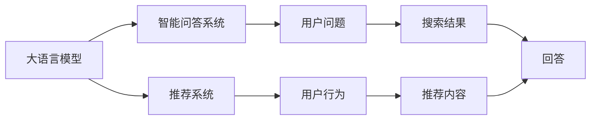

                 

## 1. 背景介绍

在过去几年里，自然语言处理（Natural Language Processing, NLP）领域经历了翻天覆地的变化，尤其是基于大语言模型（Large Language Models, LLMs）的智能问答系统（QAS）和推荐系统（Recommender Systems）的崛起，它们在提供信息检索、推荐内容等方面展示了惊人的能力。然而，尽管这两种系统均基于自然语言处理，它们的构建方式和应用场景却有本质的区别。本文将深入探讨大模型问答机器人与传统搜索推荐系统的本质区别，分析它们在处理信息、生成回答、推荐内容等方面的不同机制，以及各自的优势和局限。

### 1.1 问题由来

随着人工智能技术的不断进步，越来越多的企业和组织开始探索利用大模型进行智能问答和推荐。传统的搜索推荐系统已经无法满足用户对于个性化和精准度的需求，而大模型的出现，通过自然语言处理的能力，实现了对用户查询的深度理解和自然语言生成的精准匹配，极大地提升了用户体验和应用效果。然而，大模型在处理信息、生成回答和推荐内容方面，与传统系统有着显著的区别，这些区别不仅体现在技术实现上，更深刻影响了应用的效果和价值。

## 2. 核心概念与联系

### 2.1 核心概念概述

为了更好地理解大模型问答机器人与传统搜索推荐系统的区别，本节将介绍几个关键概念：

- **大语言模型**：指通过大规模预训练学习得到的语言模型，如GPT、BERT等。这些模型通过学习海量的无标签文本数据，获取了丰富的语言知识和语义理解能力。
- **智能问答系统**：指能够理解和回答用户自然语言查询的智能系统，通常通过大语言模型实现。
- **推荐系统**：指能够根据用户行为和偏好，推荐相关内容的系统，包括基于内容的推荐和协同过滤等。
- **信息检索**：指从大规模数据集合中检索出与用户查询相关的信息，通常基于传统搜索引擎技术。
- **语义理解**：指系统理解用户查询的语义，从而提供更准确的搜索结果或回答。
- **个性化推荐**：指根据用户的兴趣和行为，提供定制化的推荐内容。

### 2.2 核心概念的联系

大模型问答系统和推荐系统均基于自然语言处理技术，但它们的构建方式和应用场景有所不同。智能问答系统主要关注如何理解和回答用户问题，而推荐系统则着重于如何根据用户行为推荐相关内容。两者都使用了自然语言处理技术，但前者更侧重于信息的语义理解，后者更侧重于内容的个性化推荐。

以下是这些概念之间的联系：

1. **数据来源**：两者均依赖于大量数据，但前者关注于问题与答案的语义匹配，后者关注于用户行为与推荐内容的相关性。
2. **模型结构**：问答系统通常采用大模型和提示技术，推荐系统则多采用协同过滤和内容推荐算法。
3. **用户交互**：问答系统与用户进行直接的对话，推荐系统则通过用户的点击、浏览等行为进行隐式交互。
4. **应用场景**：问答系统常用于知识检索、客服、信息咨询等场景，推荐系统常用于电商、新闻、社交媒体等场景。

### 2.3 核心概念的整体架构

通过这些关键概念，我们可以构建一个大模型问答机器人和传统搜索推荐系统的整体架构：

这个架构展示了两者之间的基本流程和核心功能：

1. 大语言模型接收用户问题，生成回答。
2. 推荐系统分析用户行为，推荐相关内容。
3. 智能问答系统通过回答问题，提供信息检索服务。
4. 推荐系统通过分析用户偏好，提供个性化推荐。

## 3. 核心算法原理 & 具体操作步骤

### 3.1 算法原理概述

大模型问答机器人和推荐系统的核心算法原理在本质上是一致的，均基于自然语言处理和深度学习技术，但具体实现方式有所不同。

- **大模型问答系统**：通过大语言模型对用户问题进行语义理解，并在知识库或互联网上搜索相关信息，生成精准的回答。
- **推荐系统**：基于用户行为和偏好，使用协同过滤、内容推荐等算法，为用户推荐相关内容。

### 3.2 算法步骤详解

#### 大模型问答系统

1. **预训练大模型**：
   - 收集大规模无标签文本数据进行预训练，学习语言知识和语义表示。
   - 使用自监督学习任务（如掩码语言模型、下一个词预测等）训练模型。

2. **微调模型**：
   - 根据特定领域的数据进行微调，提高模型在特定任务上的性能。
   - 添加任务适配层，如分类器或生成器，适配问答任务的需求。

3. **推理生成**：
   - 将用户问题输入微调后的模型，获取回答结果。
   - 对生成答案进行后处理，如去重、排序等，确保答案的准确性和相关性。

#### 推荐系统

1. **用户行为分析**：
   - 收集用户的浏览、点击、评分等行为数据，构建用户画像。
   - 通过协同过滤、内容推荐等算法，分析用户行为和偏好。

2. **内容推荐**：
   - 根据用户画像，生成推荐列表。
   - 对推荐结果进行排序，考虑点击率、转化率等指标。

### 3.3 算法优缺点

#### 大模型问答系统的优缺点

**优点**：
1. **语义理解能力强**：大模型能够深入理解用户的查询，提供更精准的回答。
2. **能够处理复杂问题**：对于一些非结构化的问题，大模型能够提供更全面的解答。
3. **动态生成内容**：能够根据用户的问题动态生成回答，提高用户体验。

**缺点**：
1. **依赖于预训练数据**：模型的效果很大程度上取决于预训练数据的质量和数量。
2. **计算资源消耗大**：大模型通常需要高性能计算资源进行推理和生成。
3. **过拟合风险高**：微调过程中容易过拟合，需要复杂的正则化技术和数据增强方法。

#### 推荐系统的优缺点

**优点**：
1. **计算效率高**：推荐算法通常比自然语言处理更高效。
2. **个性化推荐**：能够根据用户行为提供定制化的推荐内容。
3. **数据驱动**：推荐系统能够利用用户行为数据进行精准推荐。

**缺点**：
1. **依赖于用户数据**：需要大量用户行为数据，缺乏数据时难以提供有效的推荐。
2. **推荐质量受限**：推荐系统往往无法处理复杂的个性化需求，推荐质量受限。
3. **冷启动问题**：新用户或新物品难以获得足够的推荐信息。

### 3.4 算法应用领域

大模型问答机器人和推荐系统均广泛应用于多个领域：

- **大模型问答系统**：常用于客服、知识库、搜索引擎等场景。
- **推荐系统**：广泛应用于电商、社交媒体、新闻聚合等场景。

## 4. 数学模型和公式 & 详细讲解

### 4.1 数学模型构建

**大模型问答系统**：
- 输入：用户问题 $q$，预训练语言模型参数 $\theta$。
- 输出：回答 $a$。

**推荐系统**：
- 输入：用户行为 $u$，物品特征 $i$。
- 输出：推荐列表 $r$。

### 4.2 公式推导过程

**大模型问答系统**：
- 模型 $M_{\theta}(q)$ 接收用户问题 $q$，生成回答 $a$。
- 损失函数 $\mathcal{L}(a, q)$ 衡量答案 $a$ 与真实答案 $y$ 的差异。
- 优化目标：$\mathop{\arg\min}_{\theta} \mathcal{L}(M_{\theta}(q), y)$。

**推荐系统**：
- 协同过滤算法：用户行为 $u$ 和物品特征 $i$，计算相似度 $\sigma(u, i)$。
- 推荐分数 $s(u, i) = \sigma(u, i) \cdot f(u)$。
- 排序算法：根据推荐分数 $s$ 排序，生成推荐列表 $r$。

### 4.3 案例分析与讲解

**大模型问答系统案例**：
- 假设用户问：“如何预防新冠肺炎？”
- 预训练大模型 $M_{\theta}$ 接收问题 $q$，生成回答 $a$。
- 微调后的模型 $M_{\hat{\theta}}$ 优化损失函数 $\mathcal{L}(a, q)$，生成最相关的回答。

**推荐系统案例**：
- 假设用户浏览了电影《阿凡达》，喜欢科幻片。
- 协同过滤算法计算用户 $u$ 与电影 $i$ 的相似度 $\sigma(u, i)$。
- 推荐分数 $s(u, i) = \sigma(u, i) \cdot f(u)$，根据分数排序生成推荐列表 $r$。

## 5. 项目实践：代码实例和详细解释说明

### 5.1 开发环境搭建

1. **安装Python**：
   - 使用Anaconda安装Python，创建虚拟环境。
   - 安装依赖包：transformers、tensorflow、numpy等。

2. **准备数据集**：
   - 收集用户问题、答案数据，构建问答数据集。
   - 收集用户行为数据，构建推荐数据集。

### 5.2 源代码详细实现

**大模型问答系统**：
- 加载预训练模型 $M_{\theta}$，进行微调 $M_{\hat{\theta}}$。
- 定义损失函数 $\mathcal{L}(a, q)$。
- 使用AdamW优化器进行梯度下降。

**推荐系统**：
- 加载协同过滤模型 $\sigma$，使用FTRL优化器进行优化。
- 定义推荐分数 $s(u, i)$。
- 使用排序算法（如Top-K）生成推荐列表 $r$。

### 5.3 代码解读与分析

**大模型问答系统代码**：
- 使用HuggingFace的transformers库加载预训练模型。
- 定义损失函数和优化器。
- 使用微调后的模型进行推理生成回答。

**推荐系统代码**：
- 使用TensorFlow的FTRL库加载协同过滤模型。
- 定义推荐分数和排序算法。
- 使用推荐系统生成推荐列表。

### 5.4 运行结果展示

**大模型问答系统**：
- 输出模型生成的回答 $a$。
- 使用BLEU等指标评估回答的质量。

**推荐系统**：
- 输出推荐列表 $r$。
- 使用AUC等指标评估推荐效果。

## 6. 实际应用场景

### 6.1 智能客服系统

**大模型问答系统应用**：
- 构建智能客服聊天机器人，解答用户常见问题。
- 提供多轮对话能力，提升用户满意度。

**推荐系统应用**：
- 根据用户浏览记录推荐相关产品。
- 通过个性化推荐增加用户粘性和购买率。

### 6.2 电商推荐系统

**大模型问答系统应用**：
- 提供商品问答服务，帮助用户解决问题。
- 构建知识图谱，提高问答系统的准确性。

**推荐系统应用**：
- 根据用户浏览记录推荐相关商品。
- 使用协同过滤算法进行个性化推荐。

### 6.3 新闻推荐系统

**大模型问答系统应用**：
- 构建智能问答引擎，提供新闻相关问题解答。
- 使用知识图谱丰富问答系统的知识库。

**推荐系统应用**：
- 根据用户阅读记录推荐相关新闻。
- 使用内容推荐算法提高推荐精准度。

### 6.4 未来应用展望

- **多模态融合**：将大模型问答系统与推荐系统进行融合，实现视觉、语音等多模态数据的协同处理。
- **知识图谱构建**：利用知识图谱丰富问答系统的知识库，提高回答的准确性和泛化能力。
- **实时学习**：基于用户的实时行为，动态调整推荐算法，提升推荐效果。
- **增强可信度**：结合人工审核和知识库，提高推荐的可信度和合理性。

## 7. 工具和资源推荐

### 7.1 学习资源推荐

- **《自然语言处理与深度学习》**：介绍NLP和深度学习的基础知识和实践技巧。
- **《深度学习》**：斯坦福大学课程，涵盖深度学习的基本概念和应用。
- **《Transformer from Scratch》**：详细讲解Transformer模型的构建和微调过程。
- **《自然语言处理权威指南》**：全面介绍NLP领域的经典方法和实践。

### 7.2 开发工具推荐

- **HuggingFace Transformers**：基于Transformer的NLP工具库，提供丰富的预训练模型和微调工具。
- **TensorFlow**：Google开发的深度学习框架，支持分布式计算和大规模模型训练。
- **PyTorch**：Facebook开发的深度学习框架，易于上手和调试。
- **TensorBoard**：TensorFlow的可视化工具，帮助监控模型训练状态。

### 7.3 相关论文推荐

- **"Attention is All You Need"**：Transformer模型原论文，奠定了大语言模型的基础。
- **"BERT: Pre-training of Deep Bidirectional Transformers for Language Understanding"**：BERT模型，引入了预训练和微调的概念。
- **"Recurrent Neural Network Architectures for Large-Scale Question Answering"**：介绍了基于RNN的问答系统，展示了自然语言处理技术的应用。
- **"Deep Neural Networks for Adaptive Recommender Systems"**：介绍了深度学习在推荐系统中的应用。

## 8. 总结：未来发展趋势与挑战

### 8.1 研究成果总结

本文从理论和实践两个角度，探讨了大模型问答机器人和传统搜索推荐系统的本质区别。通过深入分析两种系统的核心概念、算法原理和应用场景，展示了它们在处理信息、生成回答和推荐内容等方面的不同机制，以及各自的优势和局限。

### 8.2 未来发展趋势

未来，随着技术的不断进步，大模型问答机器人和推荐系统将继续在各个领域发挥重要作用：

- **技术融合**：大模型问答系统和推荐系统将更多地结合，实现多模态数据的协同处理和知识图谱的构建。
- **实时学习**：通过实时数据分析和用户反馈，动态调整模型参数，提升系统的精准度和鲁棒性。
- **增强可信度**：结合人工智能和人工审核，提高推荐的可信度和合理性。

### 8.3 面临的挑战

尽管大模型问答机器人和推荐系统在多个领域展示了巨大的潜力，但它们在实际应用中也面临着诸多挑战：

- **数据依赖**：依赖高质量的标注数据和行为数据，数据获取成本高。
- **计算资源**：大模型通常需要高性能计算资源进行推理和生成。
- **模型泛化**：模型在特定领域和特定任务上效果良好，但泛化能力有待提升。
- **公平性问题**：模型可能存在偏见，需要更多关注公平性和可解释性。

### 8.4 研究展望

为了应对这些挑战，未来的研究应在以下几个方面寻求突破：

- **数据增强**：利用数据生成和数据扩充技术，提升数据质量和数量。
- **模型压缩**：通过模型压缩和优化技术，降低计算资源消耗。
- **知识融合**：结合知识图谱和规则库，提高模型的泛化能力和解释性。
- **公平性优化**：引入公平性和可解释性评估指标，提升模型的公平性和透明性。

综上所述，大模型问答机器人和推荐系统在处理信息、生成回答和推荐内容等方面具有显著的差异，但它们都基于自然语言处理技术，是推动人工智能技术发展的两个重要方向。通过不断探索和创新，未来的问答机器人和推荐系统必将在各个领域发挥更大的作用，为人类社会的数字化转型做出更大的贡献。

## 9. 附录：常见问题与解答

**Q1：大模型问答机器人和推荐系统有哪些本质区别？**

A: 大模型问答机器人主要基于自然语言理解，为用户提供精准的回答；推荐系统主要基于用户行为分析，为用户推荐相关内容。前者侧重语义理解，后者侧重个性化推荐。

**Q2：大模型问答系统如何实现个性化推荐？**

A: 可以通过知识图谱、语义理解等技术，结合用户的历史行为数据，提供个性化的回答和推荐。

**Q3：推荐系统如何处理冷启动问题？**

A: 可以通过内容推荐、协同过滤等技术，结合新用户和物品的信息，提高推荐的精准度。

**Q4：大模型问答系统和推荐系统在实际应用中如何结合？**

A: 两者可以结合使用，利用大模型问答系统的语义理解能力和推荐系统的个性化推荐能力，提供更全面的智能服务。

**Q5：大模型问答系统和推荐系统在资源消耗方面有哪些差异？**

A: 大模型问答系统通常需要高性能计算资源进行推理和生成，而推荐系统通常计算效率更高，资源消耗更少。

本文从理论和实践两个方面深入探讨了大模型问答机器人与传统搜索推荐系统的本质区别，展示了它们在处理信息、生成回答和推荐内容等方面的不同机制，以及各自的优势和局限。通过不断的技术创新和优化，大模型问答机器人和推荐系统必将在各个领域发挥更大的作用，为人工智能技术的发展和应用注入新的动力。

