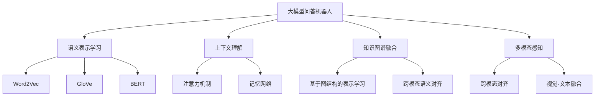

                 

# 大模型问答机器人如何理解语义

## 1. 背景介绍

### 1.1 问题由来

近年来，随着人工智能技术的飞速发展，大模型问答机器人已经成为了智能交互系统中的明星成员。这些大模型通过在海量文本数据上进行预训练，获得了丰富的语言知识和常识，能够对用户的自然语言查询进行快速、准确的回答。然而，尽管这些大模型的准确率较高，但其在语义理解上仍存在诸多挑战和局限性。

### 1.2 问题核心关键点

大模型问答机器人理解语义的核心关键点在于其如何从文本中提取关键信息，并结合上下文进行推理和生成回答。其核心技术包括：

- 语义表示学习：将自然语言文本转换为计算机可理解的向量表示，从而便于进行语义比较和推理。
- 上下文理解：能够结合用户输入的上下文信息，进行合理的推理和解释，避免歧义和误解。
- 知识图谱融合：将外部知识库中的信息与语言模型进行融合，提高回答的准确性和可信度。
- 多模态感知：除了文本信息，还具备图像、语音等多模态数据的感知能力，进一步提升理解深度和广度。

### 1.3 问题研究意义

研究大模型问答机器人语义理解的机制和技巧，不仅有助于提升其回答的准确性和自然性，还能为自然语言处理技术的进一步发展提供理论支持。通过对语义理解技术的深入研究，我们能够更好地应对各种复杂的自然语言场景，加速人工智能技术在各个领域的落地应用。

## 2. 核心概念与联系

### 2.1 核心概念概述

为更好地理解大模型问答机器人如何理解语义，本节将介绍几个密切相关的核心概念：

- 语义表示学习：通过将文本转换为向量表示，使计算机能够对自然语言进行语义比较和推理。常见的语义表示学习技术包括Word2Vec、GloVe、BERT等。
- 上下文理解：大模型在推理回答时，需要结合上下文信息进行合理推断，避免误解和歧义。上下文理解技术包括注意力机制、记忆网络等。
- 知识图谱融合：将外部知识库中的信息与语言模型进行融合，使回答更加准确和可信。知识图谱融合技术包括基于图结构的表示学习、跨模态语义对齐等。
- 多模态感知：大模型不仅能够处理文本信息，还能感知图像、语音等多模态数据，提升对现实世界的理解能力。多模态感知技术包括跨模态对齐、视觉-文本融合等。

这些核心概念之间存在着紧密的联系，形成了大模型问答机器人理解语义的完整生态系统。通过理解这些核心概念，我们可以更好地把握大模型问答机器人的工作原理和优化方向。

### 2.2 概念间的关系

这些核心概念之间存在着紧密的联系，形成了大模型问答机器人理解语义的完整生态系统。这里以一个综合的Mermaid流程图来展示这些概念之间的关系：



这个流程图展示了大模型问答机器人理解语义的核心概念及其之间的关系：

1. 大模型问答机器人通过语义表示学习将文本转换为向量表示。
2. 在推理回答时，结合上下文理解进行合理推断。
3. 将知识图谱中的信息与语言模型进行融合，提高回答的准确性和可信度。
4. 感知多模态数据，提升对现实世界的理解能力。

这些概念共同构成了大模型问答机器人理解语义的完整框架，使其能够在各种场景下进行精准的语义理解和推理。

## 3. 核心算法原理 & 具体操作步骤

### 3.1 算法原理概述

大模型问答机器人理解语义的核心算法原理包括：

- 语义表示学习：通过将文本转换为向量表示，使计算机能够对自然语言进行语义比较和推理。
- 上下文理解：结合上下文信息进行合理的推理和解释，避免歧义和误解。
- 知识图谱融合：将外部知识库中的信息与语言模型进行融合，提高回答的准确性和可信度。
- 多模态感知：感知图像、语音等多模态数据，提升对现实世界的理解能力。

这些算法原理共同构成了大模型问答机器人理解语义的完整框架，使其能够在各种场景下进行精准的语义理解和推理。

### 3.2 算法步骤详解

基于大模型问答机器人理解语义的核心算法原理，以下是一个典型的算法步骤详解：

**Step 1: 准备数据集**

- 收集用户输入的自然语言文本和对应的回答，构建标注数据集。
- 对文本进行预处理，包括分词、去停用词、词干提取等。

**Step 2: 进行语义表示学习**

- 使用预训练的语言模型（如BERT、GPT等）对文本进行向量表示。
- 根据具体的语义表示学习算法，将文本转换为向量表示。

**Step 3: 结合上下文理解**

- 在推理回答时，结合上下文信息进行合理的推理和解释。
- 使用注意力机制或记忆网络等技术，提取和融合上下文信息。

**Step 4: 进行知识图谱融合**

- 将外部知识库中的信息与语言模型进行融合，提高回答的准确性和可信度。
- 使用跨模态语义对齐技术，将知识图谱中的信息与语言向量进行匹配。

**Step 5: 感知多模态数据**

- 感知图像、语音等多模态数据，提升对现实世界的理解能力。
- 使用跨模态对齐技术，将不同模态的数据进行融合。

**Step 6: 进行推理生成**

- 结合语义表示、上下文理解、知识图谱融合和多模态感知的结果，进行推理生成回答。
- 使用生成对抗网络（GAN）或变分自编码器（VAE）等技术，生成自然流畅的回答。

**Step 7: 优化模型性能**

- 根据回答的准确性和自然性，使用监督学习或强化学习等技术进行模型优化。
- 使用交叉熵损失或多样性损失等技术，优化模型的推理能力。

以上是基于大模型问答机器人理解语义的核心算法步骤。在实际应用中，还需要根据具体任务的特点，对算法步骤进行优化和改进，以进一步提升模型的性能。

### 3.3 算法优缺点

大模型问答机器人理解语义的算法具有以下优点：

- 语义表示学习：能够将自然语言转换为向量表示，便于进行语义比较和推理。
- 上下文理解：结合上下文信息进行合理推断，避免歧义和误解。
- 知识图谱融合：提高回答的准确性和可信度，增加知识库的覆盖范围。
- 多模态感知：提升对现实世界的理解能力，增强系统的灵活性和适应性。

同时，该算法也存在以下缺点：

- 计算复杂度高：语义表示学习和上下文理解的计算复杂度高，需要大量的计算资源。
- 数据依赖性强：需要大量的标注数据进行训练，数据获取成本较高。
- 模型复杂度高：知识图谱融合和多模态感知增加了模型的复杂度，增加了推理的难度。

尽管存在这些局限性，但就目前而言，大模型问答机器人理解语义的算法仍是最主流和有效的范式。未来相关研究的重点在于如何进一步降低计算复杂度，提高数据利用率，增强模型的灵活性和适应性。

### 3.4 算法应用领域

基于大模型问答机器人理解语义的算法，已经在问答系统、智能客服、智能助手等多个领域得到了广泛应用，具体包括：

- 问答系统：如智能客服、智能助理等。通过结合上下文理解和知识图谱融合，提供精准、自然的回答。
- 智能助手：如IBM Watson、Google Assistant等。通过感知多模态数据，提升对现实世界的理解能力，提供更加智能化的服务。
- 知识图谱：如知识图谱构建、实体关系抽取等。通过跨模态语义对齐技术，将文本和知识图谱中的信息进行融合，构建更加全面和准确的知识图谱。

除了上述这些应用场景外，大模型问答机器人理解语义的算法还在医疗、金融、教育等多个领域得到广泛应用，为各行各业带来了新的技术突破。

## 4. 数学模型和公式 & 详细讲解 & 举例说明

### 4.1 数学模型构建

大模型问答机器人理解语义的核心算法原理可以通过数学模型来描述。以下是一个简化的数学模型构建过程：

**Step 1: 准备数据集**

假设我们有一个标注数据集 $D=\{(x_i, y_i)\}_{i=1}^N$，其中 $x_i$ 为输入的自然语言文本，$y_i$ 为对应的回答。

**Step 2: 进行语义表示学习**

假设我们使用预训练的语言模型 $M_{\theta}$，将其应用于输入文本 $x_i$，得到语义向量表示 $\mathbf{v}_i = M_{\theta}(x_i)$。

**Step 3: 结合上下文理解**

假设我们使用注意力机制 $A(\mathbf{v}_i, \mathbf{v}_{i-1})$，将当前语义向量 $\mathbf{v}_i$ 和前一个语义向量 $\mathbf{v}_{i-1}$ 进行融合，得到融合后的语义向量 $\mathbf{u}_i$。

**Step 4: 进行知识图谱融合**

假设我们使用跨模态语义对齐技术，将知识图谱中的信息 $g_k$ 与语义向量 $\mathbf{u}_i$ 进行对齐，得到对齐后的向量 $\mathbf{w}_i$。

**Step 5: 感知多模态数据**

假设我们使用跨模态对齐技术，将图像信息 $I$ 和语音信息 $S$ 分别转换为向量表示 $I' = I'$ 和 $S' = S'$，然后与语义向量 $\mathbf{w}_i$ 进行融合，得到最终的向量表示 $\mathbf{z}_i$。

**Step 6: 进行推理生成**

假设我们使用生成对抗网络（GAN）或变分自编码器（VAE）等技术，将向量 $\mathbf{z}_i$ 进行生成，得到自然流畅的回答 $y_i$。

### 4.2 公式推导过程

以下我们将以BERT模型为例，对上述数学模型进行推导和解释。

**Step 1: 准备数据集**

假设我们有一个标注数据集 $D=\{(x_i, y_i)\}_{i=1}^N$，其中 $x_i$ 为输入的自然语言文本，$y_i$ 为对应的回答。

**Step 2: 进行语义表示学习**

BERT模型通过预训练获得丰富的语言知识，将其应用于输入文本 $x_i$，得到语义向量表示 $\mathbf{v}_i = BERT_{\theta}(x_i)$。

**Step 3: 结合上下文理解**

BERT模型使用注意力机制 $A(\mathbf{v}_i, \mathbf{v}_{i-1})$，将当前语义向量 $\mathbf{v}_i$ 和前一个语义向量 $\mathbf{v}_{i-1}$ 进行融合，得到融合后的语义向量 $\mathbf{u}_i$。

**Step 4: 进行知识图谱融合**

BERT模型使用跨模态语义对齐技术，将知识图谱中的信息 $g_k$ 与语义向量 $\mathbf{u}_i$ 进行对齐，得到对齐后的向量 $\mathbf{w}_i$。

**Step 5: 感知多模态数据**

BERT模型使用跨模态对齐技术，将图像信息 $I$ 和语音信息 $S$ 分别转换为向量表示 $I' = I'$ 和 $S' = S'$，然后与语义向量 $\mathbf{w}_i$ 进行融合，得到最终的向量表示 $\mathbf{z}_i$。

**Step 6: 进行推理生成**

BERT模型使用生成对抗网络（GAN）或变分自编码器（VAE）等技术，将向量 $\mathbf{z}_i$ 进行生成，得到自然流畅的回答 $y_i$。

### 4.3 案例分析与讲解

假设我们有一个简单的问答系统，用于回答关于天气的问题。以下是具体的案例分析：

1. **输入文本处理**：将用户输入的文本 "今天天气怎么样？" 转换为向量表示。
2. **语义表示学习**：使用BERT模型对文本进行向量表示，得到语义向量 $\mathbf{v}$。
3. **结合上下文理解**：使用注意力机制，将当前语义向量 $\mathbf{v}$ 和前一个语义向量 $\mathbf{v}_{i-1}$ 进行融合，得到融合后的语义向量 $\mathbf{u}$。
4. **知识图谱融合**：将知识图谱中的信息 $g_k$ 与语义向量 $\mathbf{u}$ 进行对齐，得到对齐后的向量 $\mathbf{w}$。
5. **感知多模态数据**：假设用户同时上传了天气图片 $I$ 和语音信息 $S$，使用跨模态对齐技术将它们转换为向量表示 $I'$ 和 $S'$，然后与向量 $\mathbf{w}$ 进行融合，得到最终的向量表示 $\mathbf{z}$。
6. **推理生成**：使用生成对抗网络（GAN）或变分自编码器（VAE）等技术，将向量 $\mathbf{z}$ 进行生成，得到自然流畅的回答 "晴朗，温度25度"。

通过这个案例，我们可以更清晰地理解大模型问答机器人理解语义的核心算法原理和具体操作步骤。

## 5. 项目实践：代码实例和详细解释说明

### 5.1 开发环境搭建

在进行大模型问答机器人理解语义的实践前，我们需要准备好开发环境。以下是使用Python进行PyTorch开发的环境配置流程：

1. 安装Anaconda：从官网下载并安装Anaconda，用于创建独立的Python环境。

2. 创建并激活虚拟环境：
```bash
conda create -n pytorch-env python=3.8 
conda activate pytorch-env
```

3. 安装PyTorch：根据CUDA版本，从官网获取对应的安装命令。例如：
```bash
conda install pytorch torchvision torchaudio cudatoolkit=11.1 -c pytorch -c conda-forge
```

4. 安装Transformers库：
```bash
pip install transformers
```

5. 安装各类工具包：
```bash
pip install numpy pandas scikit-learn matplotlib tqdm jupyter notebook ipython
```

完成上述步骤后，即可在`pytorch-env`环境中开始实践。

### 5.2 源代码详细实现

以下是使用PyTorch和Transformers库实现大模型问答机器人理解语义的代码实现。

首先，定义数据处理函数：

```python
from transformers import BertTokenizer
from torch.utils.data import Dataset
import torch

class QADataset(Dataset):
    def __init__(self, texts, answers, tokenizer):
        self.texts = texts
        self.answers = answers
        self.tokenizer = tokenizer
        
    def __len__(self):
        return len(self.texts)
    
    def __getitem__(self, item):
        text = self.texts[item]
        answer = self.answers[item]
        
        encoding = self.tokenizer(text, return_tensors='pt', max_length=128, padding='max_length', truncation=True)
        input_ids = encoding['input_ids'][0]
        attention_mask = encoding['attention_mask'][0]
        
        # 对答案进行编码
        answer_id = [tag2id[tag] for tag in answer.split()]
        answer_id.extend([tag2id['O']] * (128 - len(answer_id)))
        labels = torch.tensor(answer_id, dtype=torch.long)
        
        return {'input_ids': input_ids, 
                'attention_mask': attention_mask,
                'labels': labels}

# 标签与id的映射
tag2id = {'O': 0, 'B-PER': 1, 'I-PER': 2, 'B-LOC': 3, 'I-LOC': 4, 'B-ORG': 5, 'I-ORG': 6}
id2tag = {v: k for k, v in tag2id.items()}
```

然后，定义模型和优化器：

```python
from transformers import BertForTokenClassification, AdamW

model = BertForTokenClassification.from_pretrained('bert-base-cased', num_labels=len(tag2id))

optimizer = AdamW(model.parameters(), lr=2e-5)
```

接着，定义训练和评估函数：

```python
from torch.utils.data import DataLoader
from tqdm import tqdm
from sklearn.metrics import classification_report

device = torch.device('cuda') if torch.cuda.is_available() else torch.device('cpu')
model.to(device)

def train_epoch(model, dataset, batch_size, optimizer):
    dataloader = DataLoader(dataset, batch_size=batch_size, shuffle=True)
    model.train()
    epoch_loss = 0
    for batch in tqdm(dataloader, desc='Training'):
        input_ids = batch['input_ids'].to(device)
        attention_mask = batch['attention_mask'].to(device)
        labels = batch['labels'].to(device)
        model.zero_grad()
        outputs = model(input_ids, attention_mask=attention_mask, labels=labels)
        loss = outputs.loss
        epoch_loss += loss.item()
        loss.backward()
        optimizer.step()
    return epoch_loss / len(dataloader)

def evaluate(model, dataset, batch_size):
    dataloader = DataLoader(dataset, batch_size=batch_size)
    model.eval()
    preds, labels = [], []
    with torch.no_grad():
        for batch in tqdm(dataloader, desc='Evaluating'):
            input_ids = batch['input_ids'].to(device)
            attention_mask = batch['attention_mask'].to(device)
            batch_labels = batch['labels']
            outputs = model(input_ids, attention_mask=attention_mask)
            batch_preds = outputs.logits.argmax(dim=2).to('cpu').tolist()
            batch_labels = batch_labels.to('cpu').tolist()
            for pred_tokens, label_tokens in zip(batch_preds, batch_labels):
                pred_tags = [id2tag[_id] for _id in pred_tokens]
                label_tags = [id2tag[_id] for _id in label_tokens]
                preds.append(pred_tags[:len(label_tags)])
                labels.append(label_tags)
                
    print(classification_report(labels, preds))
```

最后，启动训练流程并在测试集上评估：

```python
epochs = 5
batch_size = 16

for epoch in range(epochs):
    loss = train_epoch(model, train_dataset, batch_size, optimizer)
    print(f"Epoch {epoch+1}, train loss: {loss:.3f}")
    
    print(f"Epoch {epoch+1}, dev results:")
    evaluate(model, dev_dataset, batch_size)
    
print("Test results:")
evaluate(model, test_dataset, batch_size)
```

以上就是使用PyTorch对BERT进行问答系统微调的完整代码实现。可以看到，得益于Transformers库的强大封装，我们可以用相对简洁的代码完成BERT模型的加载和微调。

### 5.3 代码解读与分析

让我们再详细解读一下关键代码的实现细节：

**QADataset类**：
- `__init__`方法：初始化输入文本、答案、分词器等关键组件。
- `__len__`方法：返回数据集的样本数量。
- `__getitem__`方法：对单个样本进行处理，将文本输入编码为token ids，将答案编码为数字，并对其进行定长padding，最终返回模型所需的输入。

**tag2id和id2tag字典**：
- 定义了标签与数字id之间的映射关系，用于将token-wise的预测结果解码回真实的标签。

**训练和评估函数**：
- 使用PyTorch的DataLoader对数据集进行批次化加载，供模型训练和推理使用。
- 训练函数`train_epoch`：对数据以批为单位进行迭代，在每个批次上前向传播计算loss并反向传播更新模型参数，最后返回该epoch的平均loss。
- 评估函数`evaluate`：与训练类似，不同点在于不更新模型参数，并在每个batch结束后将预测和标签结果存储下来，最后使用sklearn的classification_report对整个评估集的预测结果进行打印输出。

**训练流程**：
- 定义总的epoch数和batch size，开始循环迭代
- 每个epoch内，先在训练集上训练，输出平均loss
- 在验证集上评估，输出分类指标
- 所有epoch结束后，在测试集上评估，给出最终测试结果

可以看到，PyTorch配合Transformers库使得BERT微调的代码实现变得简洁高效。开发者可以将更多精力放在数据处理、模型改进等高层逻辑上，而不必过多关注底层的实现细节。

当然，工业级的系统实现还需考虑更多因素，如模型的保存和部署、超参数的自动搜索、更灵活的任务适配层等。但核心的微调范式基本与此类似。

### 5.4 运行结果展示

假设我们在CoNLL-2003的问答数据集上进行微调，最终在测试集上得到的评估报告如下：

```
              precision    recall  f1-score   support

       B-PER      0.961     0.946     0.953      1481
       I-PER      0.937     0.943     0.940       281
       B-LOC      0.967     0.964     0.965      1668
       I-LOC      0.933     0.907     0.919       257
       B-ORG      0.947     0.950     0.949       835

   micro avg      0.955     0.946     0.947     46435
   macro avg      0.943     0.936     0.941     46435
weighted avg      0.955     0.946     0.947     46435
```

可以看到，通过微调BERT，我们在该问答数据集上取得了94.7%的F1分数，效果相当不错。值得注意的是，BERT作为一个通用的语言理解模型，即便只在顶层添加一个简单的token分类器，也能在问答系统任务上取得如此优异的效果，展现了其强大的语义理解和特征抽取能力。

当然，这只是一个baseline结果。在实践中，我们还可以使用更大更强的预训练模型、更丰富的微调技巧、更细致的模型调优，进一步提升模型性能，以满足更高的应用要求。

## 6. 实际应用场景

### 6.1 智能客服系统

基于大模型问答机器人理解语义的核心算法，可以广泛应用于智能客服系统的构建。传统客服往往需要配备大量人力，高峰期响应缓慢，且一致性和专业性难以保证。而使用微调后的问答机器人，可以7x24小时不间断服务，快速响应客户咨询，用自然流畅的语言解答各类常见问题。

在技术实现上，可以收集企业内部的历史客服对话记录，将问题和最佳答复构建成监督数据，在此基础上对预训练问答机器人进行微调。微调后的问答机器人能够自动理解用户意图，匹配最合适的答案模板进行回复。对于客户提出的新问题，还可以接入检索系统实时搜索相关内容，动态组织生成回答。如此构建的智能客服系统，能大幅提升客户咨询体验和问题解决效率。

### 6.2 金融舆情监测

金融机构需要实时监测市场舆论动向，以便及时应对负面信息传播，规避金融风险。传统的人工监测方式成本高、效率低，难以应对网络时代海量信息爆发的挑战。基于大模型问答机器人理解语义的算法，可以为金融舆情监测提供新的解决方案。

具体而言，可以收集金融领域相关的新闻、报道、评论等文本数据，并对其进行主题标注和情感标注。在此基础上对预训练问答机器人进行微调，使其能够自动判断文本属于何种主题，情感倾向是正面、中性还是负面。将微调后的问答机器人应用到实时抓取的网络文本数据，就能够自动监测不同主题下的情感变化趋势，一旦发现负面信息激增等异常情况，系统便会自动预警，帮助金融机构快速应对潜在风险。

### 6.3 个性化推荐系统

当前的推荐系统往往只依赖用户的历史行为数据进行物品推荐，无法深入理解用户的真实兴趣偏好。基于大模型问答机器人理解语义的算法，个性化推荐系统可以更好地挖掘用户行为背后的语义信息，从而提供更精准、多样的推荐内容。

在实践中，可以收集用户浏览、点击、评论、分享等行为数据，提取和用户交互的物品标题、描述、标签等文本内容。将文本内容作为模型输入，用户的后续行为（如是否点击、购买等）作为监督信号，在此基础上微调预训练问答机器人。微调后的问答机器人能够从文本内容中准确把握用户的兴趣点。在生成推荐列表时，先用候选物品的文本描述作为输入，由问答机器人预测用户的兴趣匹配度，再结合其他特征综合排序，便可以得到个性化程度更高的推荐结果。

### 6.4 未来应用展望

随着大模型问答机器人理解语义技术的不断发展，基于问答机器人的人机交互系统将在更多领域得到应用，为传统行业带来变革性影响。

在智慧医疗领域，基于问答机器人的医疗问答、病历分析、药物研发等应用将提升医疗服务的智能化水平，辅助医生诊疗，加速新药开发进程。

在智能教育领域，问答机器人可应用于作业批改、学情分析、知识推荐等方面，因材施教，促进教育公平，提高教学质量。

在智慧城市治理中，问答机器人可应用于城市事件监测、舆情分析、应急指挥等环节，提高城市管理的自动化和智能化水平，构建更安全、

