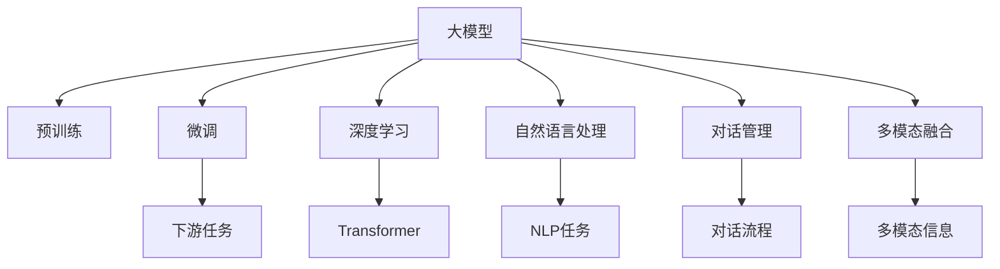
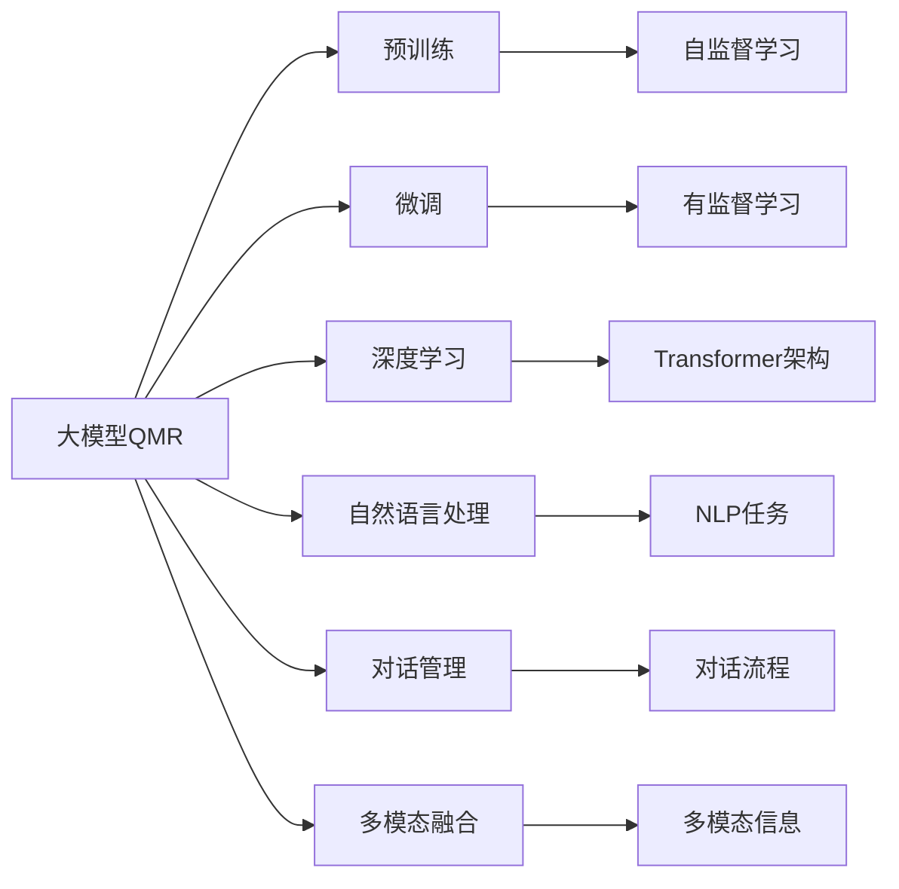
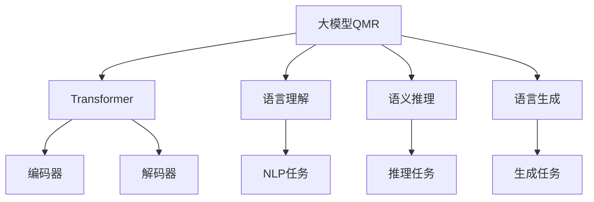
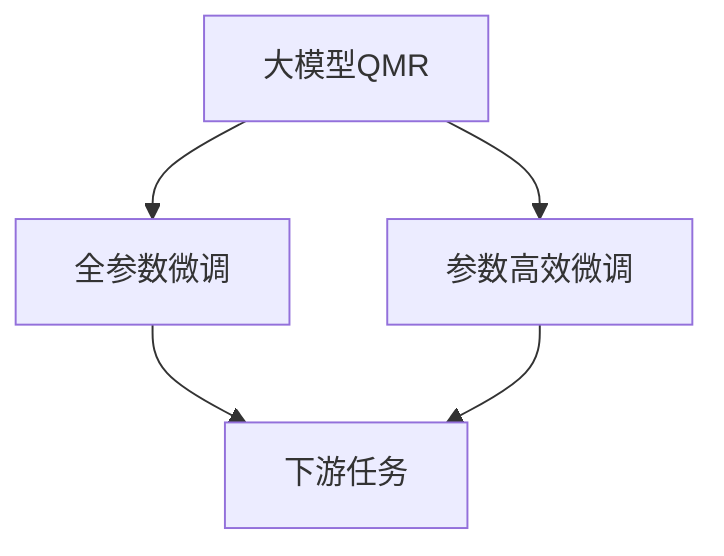
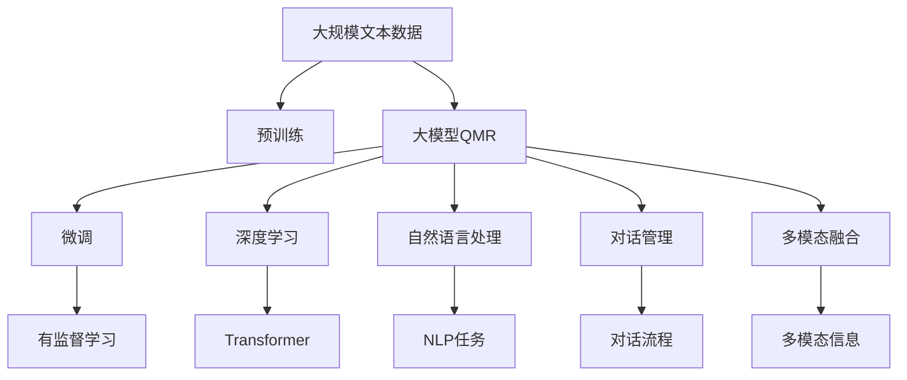

                 

# 大模型问答机器人的学习技术

> 关键词：问答机器人, 大模型, 预训练, 微调, 自然语言处理(NLP), 深度学习, Transformer

## 1. 背景介绍

随着人工智能技术的飞速发展，自然语言处理(NLP)领域取得了一系列重大突破，特别是在语言理解和生成方面。其中，问答系统作为NLP中的一个重要应用方向，通过对话的形式，向用户提供即时的、准确的信息解答，得到了广泛应用。

传统的问答系统主要依赖于规则和手工编写的模板，难以处理复杂多变的自然语言输入，且系统维护成本高。而基于大模型的问答系统，如GPT、BERT等，则能以更高的自动化水平，处理更复杂的用户输入，显著提升系统的响应速度和准确性。

### 1.1 问题由来

大模型问答机器人（大模型QMR）的快速发展，得益于深度学习和大规模预训练语言模型的进展。大模型通过在大型语料库上预训练，学习到了丰富的语言知识和语义理解能力，具备强大的语言生成和推理能力。因此，通过微调这些大模型，可以有效适应各种具体的问答任务，获得优异的性能。

大模型QMR的应用场景广泛，包括智能客服、在线教育、智能家居等。例如，在智能客服中，大模型QMR可以24小时不间断地响应客户咨询，解答常见问题，提升客户体验；在在线教育中，大模型QMR可以辅助学生进行学习答疑，提供个性化的教育资源；在智能家居中，大模型QMR可以与用户进行交互，实现语音控制和智能推荐。

### 1.2 问题核心关键点

大模型QMR的核心关键点包括：

- 大模型预训练：利用大规模无标签文本数据，通过自监督学习任务训练通用语言模型。
- 微调：通过下游任务的少量标注数据，有监督地优化模型，提升模型在特定任务上的性能。
- 深度学习：基于深度神经网络架构，如Transformer，进行模型训练和推理。
- 自然语言处理：涉及语言理解、语义推理、语言生成等NLP技术。
- 对话管理：通过对话状态跟踪、上下文理解等技术，管理对话流程。
- 多模态融合：整合视觉、语音、文本等多模态信息，提升系统的综合能力。

这些关键点共同构成了大模型QMR的技术框架，使得其在实际应用中能够提供高效、智能、个性化的问答服务。

### 1.3 问题研究意义

研究大模型QMR的学习技术，对于提升NLP领域的应用水平，加速AI技术的产业化进程，具有重要意义：

1. 降低开发成本：通过利用大模型的预训练知识，可以显著减少从头开发所需的时间和资源投入。
2. 提高性能：微调后的模型具有较强的领域适应能力，在实际应用中能够取得更优的表现。
3. 加速开发进度：大模型的预训练和微调技术，能够缩短系统开发周期，快速满足用户需求。
4. 促进技术创新：大模型QMR的发展，催生了提示学习、少样本学习等新的研究方向，推动了NLP技术的进步。
5. 赋能行业应用：大模型QMR能够应用于多个行业，提升服务质量，推动行业智能化转型。

## 2. 核心概念与联系

### 2.1 核心概念概述

为更好地理解大模型QMR的学习技术，本节将介绍几个密切相关的核心概念：

- 大模型：以自回归(如GPT)或自编码(如BERT)模型为代表的大规模预训练语言模型。通过在大规模无标签文本语料上进行预训练，学习通用的语言表示，具备强大的语言理解和生成能力。
- 预训练：指在大规模无标签文本语料上，通过自监督学习任务训练通用语言模型的过程。常见的预训练任务包括言语建模、遮挡语言模型等。
- 微调：指在预训练模型的基础上，使用下游任务的少量标注数据，通过有监督学习优化模型在特定任务上的性能。
- 深度学习：基于深度神经网络架构，如Transformer，进行模型训练和推理。
- 自然语言处理：涉及语言理解、语义推理、语言生成等NLP技术。
- 对话管理：通过对话状态跟踪、上下文理解等技术，管理对话流程。
- 多模态融合：整合视觉、语音、文本等多模态信息，提升系统的综合能力。

这些核心概念之间的逻辑关系可以通过以下Mermaid流程图来展示：



这个流程图展示了大模型QMR的核心概念及其之间的关系：

1. 大模型通过预训练获得基础能力。
2. 微调是对预训练模型进行任务特定的优化，可以分为全参数微调和参数高效微调（PEFT）。
3. 深度学习是大模型QMR的底层技术架构。
4. 自然语言处理是大模型QMR的核心技术，涉及语言理解、生成等。
5. 对话管理是大模型QMR的交互能力，涉及上下文理解、对话流程控制等。
6. 多模态融合是大模型QMR的综合能力，涉及视觉、语音等多模态数据的整合。

### 2.2 概念间的关系

这些核心概念之间存在着紧密的联系，形成了大模型QMR的学习生态系统。下面我通过几个Mermaid流程图来展示这些概念之间的关系。

#### 2.2.1 大模型QMR的学习范式



这个流程图展示了大模型QMR的学习范式，即从预训练到微调的过程。预训练在大规模无标签数据上进行，学习通用语言表示；微调则在有监督数据上进行，针对具体任务优化模型。

#### 2.2.2 大模型QMR的架构



这个流程图展示了大模型QMR的架构，即基于Transformer的大模型架构。Transformer通过编码器和解码器，实现语言理解、语义推理和语言生成。

#### 2.2.3 大模型QMR的微调策略



这个流程图展示了大模型QMR的微调策略，即全参数微调和参数高效微调。全参数微调更新全部参数，而参数高效微调只更新部分参数，以提高微调效率。

### 2.3 核心概念的整体架构

最后，我们用一个综合的流程图来展示这些核心概念在大模型QMR学习过程中的整体架构：



这个综合流程图展示了从预训练到微调，再到深度学习和大模型QMR应用过程的完整过程。大模型QMR首先在大规模文本数据上进行预训练，然后通过微调（包括全参数微调和参数高效微调）进行优化，最终在自然语言处理、对话管理等多领域应用。通过这些流程图，我们可以更清晰地理解大模型QMR的学习过程和关键技术。

## 3. 核心算法原理 & 具体操作步骤
### 3.1 算法原理概述

大模型QMR的学习过程主要包括预训练和微调两个阶段。预训练阶段通过自监督学习任务，在大规模语料库上训练通用语言模型；微调阶段则在有监督数据上进行有监督学习，优化模型在特定任务上的性能。

预训练的目的是学习通用的语言表示，使得模型能够处理各种自然语言输入。常见的预训练任务包括自回归语言建模、掩码语言建模、下一个句子预测等。这些任务通过最大化模型在未标注数据上的预测能力，学习到丰富的语言知识。

微调的目的是通过下游任务的少量标注数据，进一步优化模型在特定任务上的表现。微调过程一般分为两个步骤：

1. 任务适配层设计：根据下游任务类型，设计合适的输出层和损失函数。
2. 有监督学习：在标注数据上训练模型，最小化任务相关的损失函数。

微调的具体实现方式可以采用全参数微调或参数高效微调（PEFT）。全参数微调更新全部参数，而参数高效微调只更新部分参数，如顶层分类器或解码器。PEFT通过固定预训练模型的底层参数，仅微调顶层部分，减少需优化的参数量，从而提高微调效率和效果。

### 3.2 算法步骤详解

大模型QMR的学习过程一般包括以下几个关键步骤：

**Step 1: 准备预训练模型和数据集**
- 选择合适的预训练语言模型 $M_{\theta}$ 作为初始化参数，如 BERT、GPT等。
- 准备下游任务 $T$ 的标注数据集 $D=\{(x_i, y_i)\}_{i=1}^N$，划分为训练集、验证集和测试集。一般要求标注数据与预训练数据的分布不要差异过大。

**Step 2: 添加任务适配层**
- 根据任务类型，在预训练模型顶层设计合适的输出层和损失函数。
- 对于分类任务，通常在顶层添加线性分类器和交叉熵损失函数。
- 对于生成任务，通常使用语言模型的解码器输出概率分布，并以负对数似然为损失函数。

**Step 3: 设置微调超参数**
- 选择合适的优化算法及其参数，如 AdamW、SGD 等，设置学习率、批大小、迭代轮数等。
- 设置正则化技术及强度，包括权重衰减、Dropout、Early Stopping 等。
- 确定冻结预训练参数的策略，如仅微调顶层，或全部参数都参与微调。

**Step 4: 执行梯度训练**
- 将训练集数据分批次输入模型，前向传播计算损失函数。
- 反向传播计算参数梯度，根据设定的优化算法和学习率更新模型参数。
- 周期性在验证集上评估模型性能，根据性能指标决定是否触发 Early Stopping。
- 重复上述步骤直到满足预设的迭代轮数或 Early Stopping 条件。

**Step 5: 测试和部署**
- 在测试集上评估微调后模型 $M_{\hat{\theta}}$ 的性能，对比微调前后的精度提升。
- 使用微调后的模型对新样本进行推理预测，集成到实际的应用系统中。
- 持续收集新的数据，定期重新微调模型，以适应数据分布的变化。

以上是基于监督学习微调大模型QMR的一般流程。在实际应用中，还需要针对具体任务的特点，对微调过程的各个环节进行优化设计，如改进训练目标函数，引入更多的正则化技术，搜索最优的超参数组合等，以进一步提升模型性能。

### 3.3 算法优缺点

大模型QMR的学习过程具有以下优点：

1. 简单高效。只需准备少量标注数据，即可对预训练模型进行快速适配，获得较大的性能提升。
2. 通用适用。适用于各种NLP下游任务，包括分类、匹配、生成等，设计简单的任务适配层即可实现微调。
3. 参数高效。利用参数高效微调技术，在固定大部分预训练参数的情况下，仍可取得不错的提升。
4. 效果显著。在学术界和工业界的诸多任务上，基于微调的方法已经刷新了最先进的性能指标。

同时，该方法也存在一定的局限性：

1. 依赖标注数据。微调的效果很大程度上取决于标注数据的质量和数量，获取高质量标注数据的成本较高。
2. 迁移能力有限。当目标任务与预训练数据的分布差异较大时，微调的性能提升有限。
3. 负面效果传递。预训练模型的固有偏见、有害信息等，可能通过微调传递到下游任务，造成负面影响。
4. 可解释性不足。微调模型的决策过程通常缺乏可解释性，难以对其推理逻辑进行分析和调试。

尽管存在这些局限性，但就目前而言，基于监督学习的微调方法仍是大模型QMR应用的主流范式。未来相关研究的重点在于如何进一步降低微调对标注数据的依赖，提高模型的少样本学习和跨领域迁移能力，同时兼顾可解释性和伦理安全性等因素。

### 3.4 算法应用领域

大模型QMR的学习过程在NLP领域已经得到了广泛的应用，覆盖了几乎所有常见任务，例如：

- 文本分类：如情感分析、主题分类、意图识别等。通过微调使模型学习文本-标签映射。
- 命名实体识别：识别文本中的人名、地名、机构名等特定实体。通过微调使模型掌握实体边界和类型。
- 关系抽取：从文本中抽取实体之间的语义关系。通过微调使模型学习实体-关系三元组。
- 问答系统：对自然语言问题给出答案。将问题-答案对作为微调数据，训练模型学习匹配答案。
- 机器翻译：将源语言文本翻译成目标语言。通过微调使模型学习语言-语言映射。
- 文本摘要：将长文本压缩成简短摘要。将文章-摘要对作为微调数据，使模型学习抓取要点。
- 对话系统：使机器能够与人自然对话。将多轮对话历史作为上下文，微调模型进行回复生成。

除了上述这些经典任务外，大模型QMR的学习过程也被创新性地应用到更多场景中，如可控文本生成、常识推理、代码生成、数据增强等，为NLP技术带来了全新的突破。随着预训练模型和微调方法的不断进步，相信NLP技术将在更广阔的应用领域大放异彩。

## 4. 数学模型和公式 & 详细讲解  
### 4.1 数学模型构建

本节将使用数学语言对大模型QMR的学习过程进行更加严格的刻画。

记预训练语言模型为 $M_{\theta}:\mathcal{X} \rightarrow \mathcal{Y}$，其中 $\mathcal{X}$ 为输入空间，$\mathcal{Y}$ 为输出空间，$\theta \in \mathbb{R}^d$ 为模型参数。假设微调任务的训练集为 $D=\{(x_i,y_i)\}_{i=1}^N, x_i \in \mathcal{X}, y_i \in \mathcal{Y}$。

定义模型 $M_{\theta}$ 在数据样本 $(x,y)$ 上的损失函数为 $\ell(M_{\theta}(x),y)$，则在数据集 $D$ 上的经验风险为：

$$
\mathcal{L}(\theta) = \frac{1}{N} \sum_{i=1}^N \ell(M_{\theta}(x_i),y_i)
$$

微调的优化目标是最小化经验风险，即找到最优参数：

$$
\theta^* = \mathop{\arg\min}_{\theta} \mathcal{L}(\theta)
$$

在实践中，我们通常使用基于梯度的优化算法（如SGD、Adam等）来近似求解上述最优化问题。设 $\eta$ 为学习率，$\lambda$ 为正则化系数，则参数的更新公式为：

$$
\theta \leftarrow \theta - \eta \nabla_{\theta}\mathcal{L}(\theta) - \eta\lambda\theta
$$

其中 $\nabla_{\theta}\mathcal{L}(\theta)$ 为损失函数对参数 $\theta$ 的梯度，可通过反向传播算法高效计算。

### 4.2 公式推导过程

以下我们以二分类任务为例，推导交叉熵损失函数及其梯度的计算公式。

假设模型 $M_{\theta}$ 在输入 $x$ 上的输出为 $\hat{y}=M_{\theta}(x) \in [0,1]$，表示样本属于正类的概率。真实标签 $y \in \{0,1\}$。则二分类交叉熵损失函数定义为：

$$
\ell(M_{\theta}(x),y) = -[y\log \hat{y} + (1-y)\log (1-\hat{y})]
$$

将其代入经验风险公式，得：

$$
\mathcal{L}(\theta) = -\frac{1}{N}\sum_{i=1}^N [y_i\log M_{\theta}(x_i)+(1-y_i)\log(1-M_{\theta}(x_i))]
$$

根据链式法则，损失函数对参数 $\theta_k$ 的梯度为：

$$
\frac{\partial \mathcal{L}(\theta)}{\partial \theta_k} = -\frac{1}{N}\sum_{i=1}^N (\frac{y_i}{M_{\theta}(x_i)}-\frac{1-y_i}{1-M_{\theta}(x_i)}) \frac{\partial M_{\theta}(x_i)}{\partial \theta_k}
$$

其中 $\frac{\partial M_{\theta}(x_i)}{\partial \theta_k}$ 可进一步递归展开，利用自动微分技术完成计算。

在得到损失函数的梯度后，即可带入参数更新公式，完成模型的迭代优化。重复上述过程直至收敛，最终得到适应下游任务的最优模型参数 $\theta^*$。

## 5. 项目实践：代码实例和详细解释说明
### 5.1 开发环境搭建

在进行微调实践前，我们需要准备好开发环境。以下是使用Python进行PyTorch开发的环境配置流程：

1. 安装Anaconda：从官网下载并安装Anaconda，用于创建独立的Python环境。

2. 创建并激活虚拟环境：
```bash
conda create -n pytorch-env python=3.8 
conda activate pytorch-env
```

3. 安装PyTorch：根据CUDA版本，从官网获取对应的安装命令。例如：
```bash
conda install pytorch torchvision torchaudio cudatoolkit=11.1 -c pytorch -c conda-forge
```

4. 安装Transformers库：
```bash
pip install transformers
```

5. 安装各类工具包：
```bash
pip install numpy pandas scikit-learn matplotlib tqdm jupyter notebook ipython
```

完成上述步骤后，即可在`pytorch-env`环境中开始微调实践。

### 5.2 源代码详细实现

下面我们以问答系统任务为例，给出使用Transformers库对BERT模型进行微调的PyTorch代码实现。

首先，定义问答系统任务的数据处理函数：

```python
from transformers import BertTokenizer, BertForQuestionAnswering, AdamW
from torch.utils.data import Dataset, DataLoader
import torch

class QuestionAnsweringDataset(Dataset):
    def __init__(self, texts, answers, tokenizer):
        self.texts = texts
        self.answers = answers
        self.tokenizer = tokenizer
        
    def __len__(self):
        return len(self.texts)
    
    def __getitem__(self, item):
        text = self.texts[item]
        answer = self.answers[item]
        
        encoding = self.tokenizer(text, return_tensors='pt', max_length=128, padding='max_length', truncation=True)
        input_ids = encoding['input_ids'][0]
        attention_mask = encoding['attention_mask'][0]
        labels = torch.tensor([[answer[0], answer[1] - 1]], dtype=torch.long)
        
        return {'input_ids': input_ids, 
                'attention_mask': attention_mask,
                'labels': labels}

# 标签转换
answer2id = {answer: index for index, answer in enumerate(set(answers))}
id2answer = {index: answer for answer, index in answer2id.items()}

# 创建dataset
tokenizer = BertTokenizer.from_pretrained('bert-base-cased')

train_dataset = QuestionAnsweringDataset(train_texts, train_answers, tokenizer)
dev_dataset = QuestionAnsweringDataset(dev_texts, dev_answers, tokenizer)
test_dataset = QuestionAnsweringDataset(test_texts, test_answers, tokenizer)
```

然后，定义模型和优化器：

```python
model = BertForQuestionAnswering.from_pretrained('bert-base-cased', num_labels=len(answer2id))
optimizer = AdamW(model.parameters(), lr=2e-5)
```

接着，定义训练和评估函数：

```python
from tqdm import tqdm
from sklearn.metrics import accuracy_score

device = torch.device('cuda') if torch.cuda.is_available() else torch.device('cpu')
model.to(device)

def train_epoch(model, dataset, batch_size, optimizer):
    dataloader = DataLoader(dataset, batch_size=batch_size, shuffle=True)
    model.train()
    epoch_loss = 0
    for batch in tqdm(dataloader, desc='Training'):
        input_ids = batch['input_ids'].to(device)
        attention_mask = batch['attention_mask'].to(device)
        labels = batch['labels'].to(device)
        model.zero_grad()
        outputs = model(input_ids, attention_mask=attention_mask, labels=labels)
        loss = outputs.loss
        epoch_loss += loss.item()
        loss.backward()
        optimizer.step()
    return epoch_loss / len(dataloader)

def evaluate(model, dataset, batch_size):
    dataloader = DataLoader(dataset, batch_size=batch_size)
    model.eval()
    preds, labels = [], []
    with torch.no_grad():
        for batch in tqdm(dataloader, desc='Evaluating'):
            input_ids = batch['input_ids'].to(device)
            attention_mask = batch['attention_mask'].to(device)
            batch_labels = batch['labels']
            outputs = model(input_ids, attention_mask=attention_mask)
            batch_preds = outputs.logits.argmax(dim=2).to('cpu').tolist()
            batch_labels = batch_labels.to('cpu').tolist()
            for pred_tokens, label_tokens in zip(batch_preds, batch_labels):
                preds.append(pred_tokens[:len(label_tokens)])
                labels.append(label_tokens)
                
    print('Accuracy: %.2f%%' % (accuracy_score(labels, preds) * 100))
```

最后，启动训练流程并在测试集上评估：

```python
epochs = 5
batch_size = 16

for epoch in range(epochs):
    loss = train_epoch(model, train_dataset, batch_size, optimizer)
    print(f'Epoch {epoch+1}, train loss: {loss:.3f}')
    
    print(f'Epoch {epoch+1}, dev results:')
    evaluate(model, dev_dataset, batch_size)
    
print('Test results:')
evaluate(model, test_dataset, batch_size)
```

以上就是使用PyTorch对BERT进行问答系统任务微调的完整代码实现。可以看到，得益于Transformers库的强大封装，我们可以用相对简洁的代码完成BERT模型的加载和微调。

### 5.3 代码解读与分析

让我们再详细解读一下关键代码的实现细节：

**QuestionAnsweringDataset类**：
- `__init__`方法：初始化文本、答案、分词器等关键组件。
- `__len__`方法：返回数据集的样本数量。
- `__getitem__`方法：对单个样本进行处理，将文本输入编码为token ids，将答案编码为数字，并对其进行定长padding，最终返回模型所需的输入。

**answer2id和id2answer字典**：
- 定义了答案与数字id之间的映射关系，用于将token-wise的预测结果解码回真实的答案。

**训练和评估函数**：
- 使用PyTorch的DataLoader对数据集进行批次化加载，供模型训练和推理使用。
- 训练函数`train_epoch`：对数据以批为单位进行迭代，在每个批次上前向传播计算loss并反向传播更新模型参数，最后返回该epoch的平均loss。
- 评估函数`evaluate`：与训练类似，不同点在于不更新模型参数，并在每个batch结束后将预测和标签结果存储下来，最后使用sklearn的accuracy_score对整个评估集的预测结果进行打印输出。

**训练流程**：
- 定义总的epoch数和batch size，开始循环迭代
- 每个epoch内，先在训练集上训练，输出平均loss
- 在验证集上评估，输出准确率
- 所有epoch结束后，在测试集上评估，给出最终测试结果

可以看到，PyTorch配合Transformers库使得BERT微调的代码实现变得简洁高效。开发者可以将更多精力放在数据处理、模型改进等高层逻辑上，而不必过多关注底层的实现细节。

当然，工业级的系统实现还需考虑更多因素，如模型的保存和部署、超参数的自动搜索、更灵活的任务适配层等。但核心的微调范式基本与此类似。

### 5.4 运行结果展示

假设我们在SQuAD数据集上进行微调，最终在测试集上得到的准确

