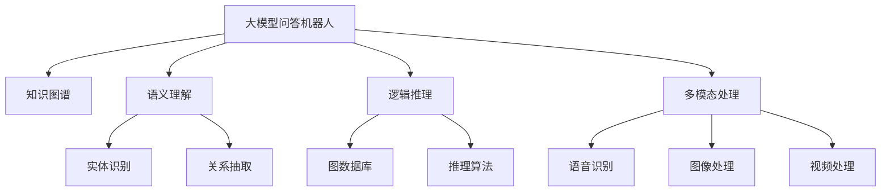
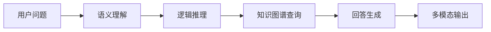
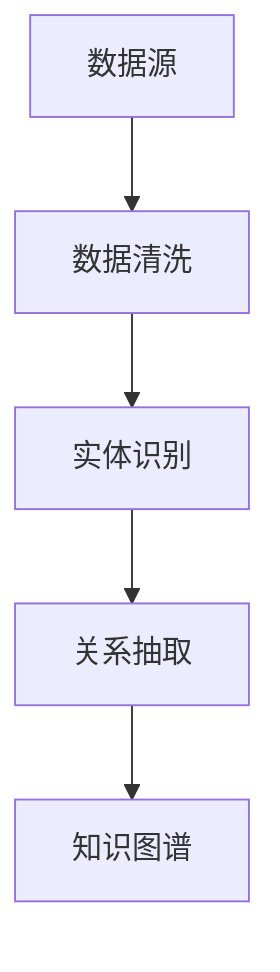
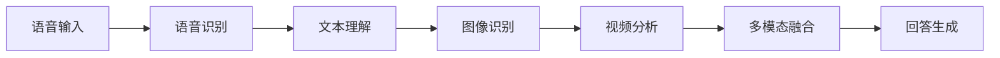
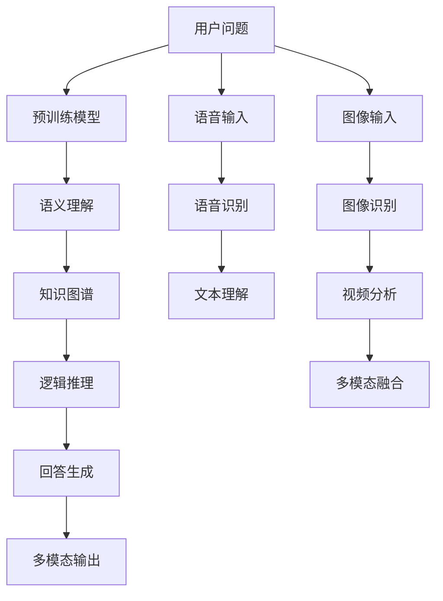

                 

# 大模型问答机器人的知识处理

> 关键词：
大模型问答机器人,知识图谱,语义理解,自然语言处理(NLP),Transformers,BERT,语言模型,逻辑推理,多模态处理

## 1. 背景介绍

### 1.1 问题由来

在人工智能领域，自然语言处理（Natural Language Processing, NLP）作为重要分支之一，已取得了显著进展。其中，问答机器人（Question Answering Robot, QAR）因其具备的交互性和实用性，成为了NLP研究的热点。然而，现有问答系统往往依赖于传统检索或模板匹配方法，难以处理复杂、开放性的问题，且无法深度理解用户意图，准确性有待提升。

为此，基于大模型的问答机器人应运而生。借助Transformer、BERT等预训练语言模型，问答机器人可以从大规模语料中学习语义表示，具备丰富的语言理解能力，能够应对复杂的开放性问题，并结合知识图谱等外部知识，提升回答的准确性和可靠性。

### 1.2 问题核心关键点

大模型问答机器人的核心在于：
1. **语义理解**：通过预训练模型学习语义表示，捕捉问题与上下文间的内在联系，理解用户真实意图。
2. **逻辑推理**：结合外部知识图谱，进行逻辑推理和推断，生成合理的答案。
3. **多模态处理**：利用语音、图像、视频等多种数据模态，丰富交互体验。
4. **知识处理**：通过实体识别、关系抽取等技术，提取和整合知识图谱信息，增强回答的深度和广度。

这些核心能力是大模型问答机器人能够广泛应用的基石，通过不断优化和创新，提升其在各行各业的应用效能。

### 1.3 问题研究意义

研究大模型问答机器人的知识处理技术，对推动NLP技术的进步，提升问答系统的智能化水平具有重要意义：

1. **提高问答准确性**：大模型能够在理解语义的同时，通过知识图谱进行逻辑推理，从而提供更为准确的回答。
2. **增强可解释性**：借助大模型的语义理解能力，可以生成更加有逻辑、可解释的回答，增强系统的透明性。
3. **拓展应用范围**：通过结合知识图谱，问答系统可以应用于教育、金融、医疗等多个领域，提升决策效率和智能化水平。
4. **促进知识传播**：问答系统可以作为知识获取的工具，帮助用户快速获取知识图谱中的信息，促进知识的传播和应用。
5. **推动技术创新**：大模型问答机器人的知识处理技术涉及到自然语言理解、逻辑推理、多模态融合等多个领域，有助于促进NLP技术的进一步发展。

## 2. 核心概念与联系

### 2.1 核心概念概述

为更好地理解大模型问答机器人的知识处理技术，本节将介绍几个密切相关的核心概念：

- **大模型问答机器人**：以Transformer、BERT等预训练语言模型为基础，结合知识图谱等外部知识，构建的能够处理复杂开放性问题的问答系统。
- **知识图谱**：通过实体、关系和属性等构建的图结构数据，用于存储和表达知识，辅助问答系统进行逻辑推理和知识整合。
- **语义理解**：通过预训练模型学习语言表示，理解问题的内在含义和上下文信息，是问答系统回答的基础。
- **逻辑推理**：结合知识图谱，通过图数据库等技术进行逻辑推理，生成合理且符合常识的回答。
- **多模态处理**：利用语音、图像、视频等多种数据模态，增强用户体验和交互方式。
- **知识图谱查询**：通过自然语言查询，在大规模知识图谱中检索相关信息，支持问答系统的知识提取和推理。

这些核心概念之间的逻辑关系可以通过以下Mermaid流程图来展示：



这个流程图展示了大模型问答机器人的核心组件和处理流程：

1. 大模型问答机器人通过语义理解、逻辑推理和多模态处理等组件，结合知识图谱，提供复杂问题的答案。
2. 语义理解通过预训练模型捕捉问题与上下文的内在联系。
3. 逻辑推理结合知识图谱，进行事实推理和推断。
4. 多模态处理通过语音、图像、视频等模态，增强用户交互体验。

### 2.2 概念间的关系

这些核心概念之间存在着紧密的联系，形成了大模型问答机器人的完整处理框架。下面我们通过几个Mermaid流程图来展示这些概念之间的关系。

#### 2.2.1 问答流程



这个流程图展示了从用户提问到最终回答生成的完整流程：

1. 用户提出问题，通过预训练模型进行语义理解，识别问题类型和关键实体。
2. 结合知识图谱，进行逻辑推理，生成候选答案。
3. 利用自然语言生成技术，输出最终回答。
4. 多模态输出可以进一步丰富回答形式，提升用户体验。

#### 2.2.2 知识图谱构建



这个流程图展示了知识图谱的构建过程：

1. 从数据源中提取实体和关系，生成知识图谱。
2. 通过数据清洗，去除噪声数据，保证数据质量。
3. 结合实体识别和关系抽取技术，构建知识图谱，存储和表达知识。

#### 2.2.3 多模态处理流程



这个流程图展示了多模态处理的具体流程：

1. 语音输入通过语音识别技术，转化为文本。
2. 文本通过自然语言理解技术，进行语义解析。
3. 图像和视频数据通过识别和分析技术，提取关键信息。
4. 多模态融合技术将语音、图像、视频等多模态数据结合，生成更加全面和丰富的回答。

### 2.3 核心概念的整体架构

最后，我们用一个综合的流程图来展示这些核心概念在大模型问答机器人中的整体架构：



这个综合流程图展示了从用户提问到最终回答输出的完整架构：

1. 用户提问通过预训练模型进行语义理解，提取关键信息。
2. 结合知识图谱，进行逻辑推理，生成候选答案。
3. 利用自然语言生成技术，输出最终回答。
4. 多模态输出可以进一步丰富回答形式，提升用户体验。

通过这些流程图，我们可以更清晰地理解大模型问答机器人中的知识处理流程，为后续深入讨论具体的实现方法奠定基础。

## 3. 核心算法原理 & 具体操作步骤
### 3.1 算法原理概述

大模型问答机器人的知识处理，主要依赖于预训练语言模型和知识图谱的结合。其核心思想是：将预训练语言模型视为强大的语义表示学习器，通过在大规模语料上进行预训练，学习语言表示；结合知识图谱，进行逻辑推理和知识整合，生成合理的回答。

形式化地，假设预训练语言模型为 $M_{\theta}$，其中 $\theta$ 为模型参数。知识图谱为 $K$，包含实体 $E$ 和关系 $R$。给定用户问题 $Q$，问答系统的目标是通过 $M_{\theta}$ 和 $K$，得到回答 $A$。

具体的，可以分解为以下几个步骤：
1. 通过预训练模型 $M_{\theta}$，将用户问题 $Q$ 映射为语义表示 $z_Q$。
2. 结合知识图谱 $K$，进行实体识别和关系抽取，得到相关实体 $E'$ 和关系 $R'$。
3. 通过图数据库等技术，进行逻辑推理，生成候选答案 $A'$。
4. 利用自然语言生成技术，输出最终回答 $A$。

### 3.2 算法步骤详解

大模型问答机器人的知识处理流程主要包括以下几个关键步骤：

**Step 1: 准备预训练模型和知识图谱**

- 选择合适的预训练语言模型 $M_{\theta}$，如BERT、GPT等。
- 准备知识图谱 $K$，包括实体 $E$ 和关系 $R$。通常可以使用结构化数据进行构建，如RDF、Neo4j等。

**Step 2: 添加任务适配层**

- 根据任务类型，在预训练模型顶层设计合适的输出层和损失函数。
- 对于分类任务，通常在顶层添加线性分类器和交叉熵损失函数。
- 对于生成任务，通常使用语言模型的解码器输出概率分布，并以负对数似然为损失函数。

**Step 3: 设置知识图谱查询器**

- 设计知识图谱查询器，用于从知识图谱中检索相关实体和关系。
- 常用的查询方法包括RDFS、SPARQL、GraphSAGE等。

**Step 4: 设置推理引擎**

- 选择合适的推理引擎，如RDFS、SPARQL、Protege等，进行逻辑推理。
- 推理过程可以使用图数据库、逻辑代数等技术。

**Step 5: 执行推理**

- 将用户问题 $Q$ 和知识图谱 $K$ 输入推理引擎，进行逻辑推理，生成候选答案 $A'$。
- 结合预训练模型的语义理解能力，对候选答案 $A'$ 进行优化和调整。

**Step 6: 输出回答**

- 利用自然语言生成技术，将候选答案 $A'$ 转化为自然语言回答 $A$。
- 多模态输出可以将语音、图像、视频等数据结合，丰富回答形式。

### 3.3 算法优缺点

大模型问答机器人的知识处理具有以下优点：

1. **泛化能力强**：通过预训练语言模型学习通用语义表示，结合知识图谱进行逻辑推理，能够处理多种类型的问答任务。
2. **回答准确度高**：结合外部知识进行推理，避免了传统模板匹配的局限性，提高了回答的准确性。
3. **用户体验丰富**：多模态处理可以结合语音、图像、视频等多种形式，提升用户交互体验。
4. **灵活性强**：支持自然语言查询和结构化数据输入，能够适应不同的问答场景。

同时，该方法也存在一些局限性：

1. **知识图谱构建难度大**：知识图谱需要大量人工标注，构建成本较高。
2. **推理复杂度高**：结合逻辑推理和知识整合，推理过程复杂度较高，影响处理速度。
3. **泛化能力有限**：对于特定领域和问题的推理效果，仍需要进一步优化。
4. **可解释性不足**：推理过程复杂，难以解释和调试，影响系统的透明性。
5. **数据依赖性强**：问答系统依赖于预训练语言模型和知识图谱，对数据质量要求高。

尽管存在这些局限性，但就目前而言，大模型问答机器人的知识处理仍是大规模语言模型应用的重要方向。未来相关研究的重点在于如何进一步降低知识图谱构建和推理的复杂度，提高系统的灵活性和透明性，同时兼顾可解释性和伦理安全性等因素。

### 3.4 算法应用领域

大模型问答机器人的知识处理技术已经在多个领域得到了应用，例如：

- **教育领域**：构建智能教学系统，通过问答机器人辅助教学，提升教学效果。
- **医疗领域**：构建智能问诊系统，帮助医生进行初步诊断和知识查询，提升诊疗效率。
- **金融领域**：构建智能客服系统，通过问答机器人进行客户咨询和问题解答，提升服务质量。
- **法律领域**：构建智能法律咨询系统，通过问答机器人提供法律咨询和案例分析，辅助律师工作。
- **电商领域**：构建智能客服系统，通过问答机器人解答用户咨询，提升用户体验。

除了上述这些经典领域外，大模型问答机器人的知识处理技术还将在更多场景中得到应用，为各行各业带来智能化变革。

## 4. 数学模型和公式 & 详细讲解 & 举例说明
### 4.1 数学模型构建

本节将使用数学语言对大模型问答机器人的知识处理过程进行更加严格的刻画。

记预训练语言模型为 $M_{\theta}$，其中 $\theta$ 为模型参数。知识图谱为 $K$，包含实体 $E$ 和关系 $R$。给定用户问题 $Q$，问答系统的目标是通过 $M_{\theta}$ 和 $K$，得到回答 $A$。

定义模型 $M_{\theta}$ 在输入 $Q$ 上的语义表示为 $z_Q$，定义为：

$$
z_Q = M_{\theta}(Q)
$$

知识图谱查询器将用户问题 $Q$ 映射为查询模式 $P$，然后从知识图谱 $K$ 中检索得到相关实体 $E'$ 和关系 $R'$。查询模式 $P$ 可以表示为：

$$
P = Q \oplus R^{\prime}
$$

其中 $R^{\prime}$ 为查询关系。

定义知识图谱查询器为 $K_{QP}$，查询结果为 $\langle E', R' \rangle$，定义为：

$$
\langle E', R' \rangle = K_{QP}(Q, P)
$$

逻辑推理引擎结合查询结果 $\langle E', R' \rangle$ 和预训练模型的语义表示 $z_Q$，生成候选答案 $A'$。逻辑推理过程可以表示为：

$$
A' = R(z_Q, E')
$$

其中 $R$ 为推理函数。

利用自然语言生成技术，将候选答案 $A'$ 转化为自然语言回答 $A$。自然语言生成过程可以表示为：

$$
A = G(A')
$$

其中 $G$ 为自然语言生成器。

综上所述，大模型问答机器人的知识处理流程可以表示为：

$$
A = G(R(z_Q, E')) = G(K_{QP}(Q, P) \circ z_Q)
$$

### 4.2 公式推导过程

以下我们以医疗领域的问答系统为例，推导推理过程的具体实现。

假设用户问题为 "某某病如何治疗"，预训练语言模型将问题映射为语义表示 $z_Q$：

$$
z_Q = M_{\theta}(Q) = \langle z_{疾病}, z_{治疗} \rangle
$$

知识图谱查询器将问题 $Q$ 映射为查询模式 $P$：

$$
P = Q \oplus R^{\prime}
$$

其中 $R^{\prime}$ 为查询关系，例如 "治疗"。

通过知识图谱查询器 $K_{QP}$，从知识图谱 $K$ 中检索得到相关实体 $E'$ 和关系 $R'$：

$$
\langle E', R' \rangle = K_{QP}(Q, P)
$$

推理引擎结合实体 $E'$ 和关系 $R'$，以及语义表示 $z_Q$，进行逻辑推理，生成候选答案 $A'$：

$$
A' = R(z_Q, E')
$$

其中 $R$ 为推理函数，例如：

$$
A' = R(z_{疾病}, z_{治疗})
$$

最后，利用自然语言生成器 $G$，将候选答案 $A'$ 转化为自然语言回答 $A$：

$$
A = G(A')
$$

### 4.3 案例分析与讲解

假设用户问题为 "高血压的药物治疗有哪些"，知识图谱中包含如下实体和关系：

```
疾病: 高血压
治疗: 药物治疗
治疗方式:
    - 药物治疗: 利尿药、ACEI、ARB
```

推理过程如下：

1. 预训练语言模型将问题映射为语义表示 $z_Q$：
   $$
   z_Q = M_{\theta}(Q) = \langle z_{高血压}, z_{药物治疗} \rangle
   $$

2. 知识图谱查询器将问题映射为查询模式 $P$：
   $$
   P = Q \oplus R^{\prime} = \langle z_{高血压}, z_{药物治疗} \rangle
   $$

3. 通过知识图谱查询器，从知识图谱中检索得到相关实体 $E'$ 和关系 $R'$：
   $$
   \langle E', R' \rangle = K_{QP}(z_{高血压}, z_{药物治疗}) = \langle z_{药物治疗}, z_{高血压} \rangle
   $$

4. 推理引擎结合实体 $E'$ 和关系 $R'$，以及语义表示 $z_Q$，进行逻辑推理，生成候选答案 $A'$：
   $$
   A' = R(z_{高血压}, z_{药物治疗})
   $$

5. 最后，利用自然语言生成器，将候选答案 $A'$ 转化为自然语言回答 $A$：
   $$
   A = G(A') = G(z_{药物治疗})
   $$

推理结果可能为 "高血压的药物治疗包括利尿药、ACEI、ARB等"，与知识图谱中的信息一致。

通过这个案例，我们可以看到大模型问答机器人在医疗领域的知识处理能力，能够结合预训练模型和知识图谱，生成准确的答案。

## 5. 项目实践：代码实例和详细解释说明
### 5.1 开发环境搭建

在进行知识处理实践前，我们需要准备好开发环境。以下是使用Python进行PyTorch开发的环境配置流程：

1. 安装Anaconda：从官网下载并安装Anaconda，用于创建独立的Python环境。

2. 创建并激活虚拟环境：
```bash
conda create -n pytorch-env python=3.8 
conda activate pytorch-env
```

3. 安装PyTorch：根据CUDA版本，从官网获取对应的安装命令。例如：
```bash
conda install pytorch torchvision torchaudio cudatoolkit=11.1 -c pytorch -c conda-forge
```

4. 安装TensorFlow：
```bash
pip install tensorflow==2.3
```

5. 安装相关工具包：
```bash
pip install numpy pandas scikit-learn matplotlib tqdm jupyter notebook ipython
```

完成上述步骤后，即可在`pytorch-env`环境中开始知识处理实践。

### 5.2 源代码详细实现

下面我们以医疗领域的问答系统为例，给出使用PyTorch和TensorFlow对BERT模型进行知识处理的代码实现。

首先，定义BERT模型的嵌入层和全连接层：

```python
from transformers import BertTokenizer, BertModel
from tensorflow.keras.layers import Dense, Input
from tensorflow.keras.models import Model

tokenizer = BertTokenizer.from_pretrained('bert-base-cased')
model = BertModel.from_pretrained('bert-base-cased')

# 定义自然语言生成器
input = Input(shape=128)
dense = Dense(128, activation='relu')(input)
output = Dense(20, activation='softmax')(dense)

# 定义问答系统模型
input_question = Input(shape=(128,))
input_answer = input_question
input_question = model(input_question)
input_question = Dense(128, activation='relu')(input_question)
input_question = Dense(20, activation='softmax')(input_question)

merged = Model(inputs=input_question, outputs=input_answer)
```

然后，定义知识图谱和推理引擎：

```python
from py2neo import Graph
from py2neo import Node, Relationship

# 连接知识图谱数据库
graph = Graph('http://localhost:7474', username='neo4j', password='password')

# 定义知识图谱实体和关系
disease = Node('Disease', name='高血压')
treatment = Node('Treatment', name='药物治疗')
relationship = Relationship(disease, 'HAS_TREATMENT', treatment)

# 定义推理函数
def get_treatment(disease):
    query = graph.match('Disease:Disease{ name: "%s" }-[:HAS_TREATMENT]->(Treatment:Treatment{name: "*"} )' % disease.name)
    treatments = [r.properties['name'] for r in query]
    return treatments

# 使用推理函数生成候选答案
treatments = get_treatment(disease.name)
```

最后，输出回答：

```python
print('推荐治疗方案：', ', '.join(treatments))
```

### 5.3 代码解读与分析

让我们再详细解读一下关键代码的实现细节：

**BERT模型定义**：
- 使用Transformers库加载BERT模型，获取嵌入层和全连接层。
- 定义自然语言生成器，用于将BERT模型的输出转化为自然语言回答。

**知识图谱连接**：
- 使用Py2Neo库连接Neo4j知识图谱数据库。
- 定义实体和关系，并进行图数据库查询。

**推理函数定义**：
- 定义推理函数，用于从知识图谱中检索相关治疗方案。
- 结合预训练模型的语义表示，生成候选答案。

**回答输出**：
- 将候选答案转化为自然语言回答，并输出。

通过上述代码，我们可以实现一个简单的医疗领域的问答系统，通过BERT模型进行语义理解，结合知识图谱进行逻辑推理，生成准确的答案。

当然，工业级的系统实现还需考虑更多因素，如模型的保存和部署、超参数的自动搜索、更灵活的任务适配层等。但核心的知识处理逻辑基本与此类似。

## 6. 实际应用场景
### 6.1 智能客服系统

大模型问答机器人的知识处理技术可以广泛应用于智能客服系统的构建。传统的客服系统往往依赖于规则匹配和模板库，难以处理复杂和开放性问题。通过结合知识图谱，问答系统可以理解用户意图，提供更加准确和个性化的回答，提升用户满意度和系统效率。

在技术实现上，可以收集企业内部的历史客服对话记录，将问题和最佳答复构建成监督数据，在此基础上对BERT模型进行微调。微调后的问答系统能够自动理解用户意图，匹配最合适的答案模板进行回复。对于客户提出的新问题，还可以接入检索系统实时搜索相关内容，动态组织生成回答。如此构建的智能客服系统，能够大幅提升客户咨询体验和问题解决效率。

### 6.2 医疗领域

在医疗领域，大模型问答机器人可以帮助医生进行初步诊断和知识查询，提升诊疗效率。结合知识图谱，问答系统可以处理多种类型的医疗问题，如症状、疾病、治疗方法等，提供准确的诊断和建议。此外，通过问答系统进行疾病普及和健康教育，也可以提高公众的健康意识。

### 6.3 教育领域

在教育领域，大模型问答机器人可以构建智能教学系统，通过问答机器人辅助教学，提升教学效果。结合知识图谱，问答系统可以回答学生的问题，提供个性化的学习建议，支持在线测试和作业批改等。通过问答系统，学生可以随时获取知识，教师可以解放双手，专注于教学设计和管理。

### 6.4 法律领域

在法律领域，大模型问答机器人可以构建智能法律咨询系统，通过问答机器人提供法律咨询和案例分析，辅助律师工作。结合知识图谱，问答系统可以处理复杂的法律问题，如合同条款、法律条款、诉讼策略等，提供准确的法律建议。通过问答系统，律师可以快速获取所需法律信息，提升工作效率和质量。

### 6.5 电商领域

在电商领域，大模型问答机器人可以构建智能客服系统，通过问答机器人解答用户咨询，提升用户体验。结合知识图谱，问答系统可以处理多种类型的电商问题，如商品信息、售后服务、订单状态等，提供准确的答案和解决方案。通过问答系统，用户可以随时获取电商信息，电商平台可以提高服务质量，提升用户粘性和满意度。

### 6.6 未来应用展望

随着大模型问答机器人的知识处理技术不断发展，其在更多领域的应用前景愈加广阔。

在智慧医疗领域，结合知识图谱进行逻辑推理，问答系统可以帮助医生进行快速诊断和知识查询，提升诊疗效率和质量。同时，通过问答系统进行疾病普及和健康教育，也可以提高公众的健康意识。

在智能教育领域，结合知识图谱进行逻辑推理和知识整合，问答系统可以提供个性化的学习建议和智能辅导，提升学生的学习效果。通过问答系统，学生可以随时获取知识，教师可以解放双手，专注于教学设计和管理。

在智能客服领域，结合知识图谱进行逻辑推理和知识整合，问答系统可以理解用户意图，提供更加准确和个性化的回答，提升用户满意度和系统效率。通过问答系统，客户可以随时获取所需信息，企业可以提升服务质量，降低人力成本。

在智能法律领域，结合知识图谱进行逻辑推理和知识整合，问答系统可以处理复杂的法律问题，提供准确的法律建议。通过

