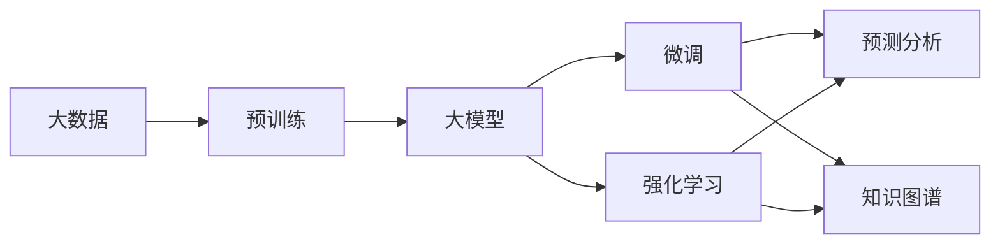
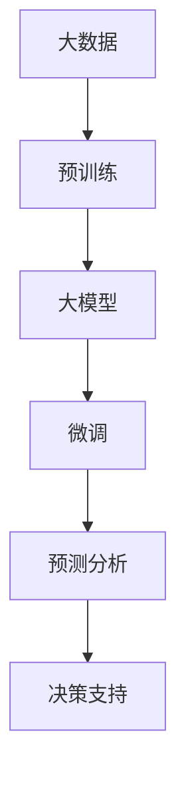
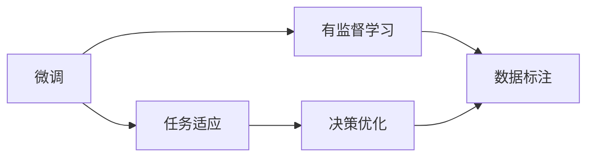
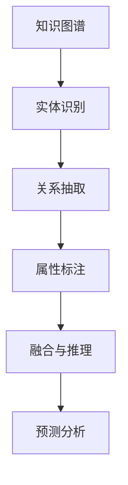
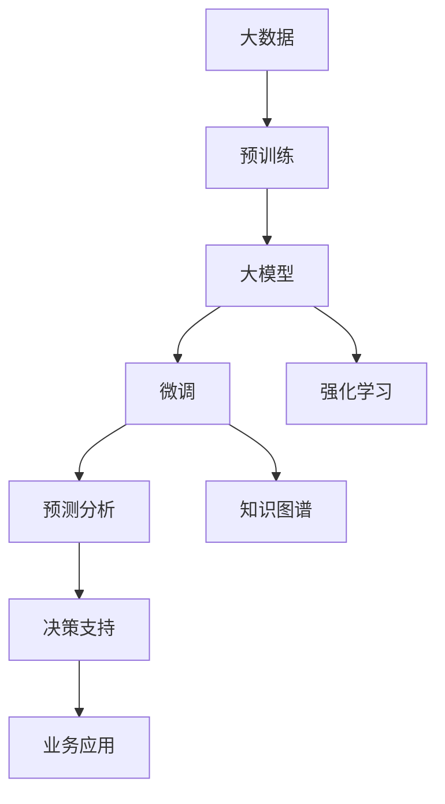

                 

# 大模型：商业智能的新引擎

> 关键词：商业智能, 大模型, 自然语言处理, 深度学习, 强化学习, 知识图谱, 预测分析, 大数据

## 1. 背景介绍

### 1.1 问题由来
随着数字化转型的不断深入，商业智能(Business Intelligence, BI)技术已成为企业获取竞争优势的关键工具。传统BI系统多基于结构化数据，依赖于复杂的ETL流程和冗长的报表编写，难以响应快速变化的业务需求。而大模型技术的兴起，为商业智能领域带来了革命性的变革。

大模型通常指具有亿级参数量的深度学习模型，如GPT-3、BERT等。这些模型在无监督预训练过程中积累了海量的语言知识，具备强大的数据表示能力和泛化能力。通过在大规模非结构化数据上的微调，可以应用于各类商业智能任务，提升数据洞察和决策支持的精准度。

### 1.2 问题核心关键点
本文聚焦于如何利用大模型技术优化商业智能系统，解决企业面临的数据分析、用户画像、市场营销、风险管理等业务需求，提升决策效率和效果。我们认为，大模型在商业智能中的应用主要包括以下几个关键点：

1. **数据处理与预处理**：大模型能够处理海量非结构化数据，通过预训练和微调，能够高效抽取数据特征。
2. **用户画像构建**：大模型可以通过分析用户互动、行为数据，构建精准的用户画像，支持个性化推荐和服务。
3. **预测与分析**：大模型具备强大的预测分析能力，能够基于历史数据和用户行为，进行市场趋势预测、风险评估等。
4. **自然语言处理**：大模型在自然语言处理(NLP)任务上的优势，支持文本挖掘、情感分析、语义理解等。
5. **多模态融合**：大模型能够融合视觉、音频、文本等多模态数据，实现更全面深入的数据分析。

### 1.3 问题研究意义
大模型技术在商业智能中的应用，能够帮助企业打破数据孤岛，实现数据的全方位分析与利用，加速决策过程，提升竞争力。具体而言：

1. **降低数据处理成本**：大模型能够自动化处理复杂的数据结构，减少ETL和报表编写的工作量。
2. **提高分析精度**：大模型强大的泛化能力和特征抽取能力，能够提升数据分析的准确性和深度。
3. **增强决策支持**：大模型提供的多维数据分析和预测，能够支持更加科学、动态的决策制定。
4. **优化用户体验**：大模型能够基于用户行为构建精准画像，提供个性化推荐，提升用户体验。
5. **拓展业务领域**：大模型技术能够应用于传统BI难以覆盖的领域，如情感分析、社交网络分析等，拓展商业智能的应用范围。

## 2. 核心概念与联系

### 2.1 核心概念概述

为更好地理解大模型在商业智能中的应用，本节将介绍几个密切相关的核心概念：

- **大模型(Large Model)**：具有海量参数量的深度学习模型，如GPT-3、BERT等。通过在大规模无标签数据上进行预训练，学习到丰富的语言知识和数据特征。
- **预训练(Pre-training)**：指在大规模无标签数据上，通过自监督学习任务训练模型，学习通用语言表示的过程。
- **微调(Fine-tuning)**：在预训练模型基础上，使用任务标注数据进行有监督学习，优化模型在特定任务上的性能。
- **强化学习(Reinforcement Learning)**：通过奖励机制训练模型，使其在特定环境中最大化累积奖励，优化决策策略。
- **知识图谱(Knowledge Graph)**：结构化的数据模型，用于描述实体、关系及其属性，支持更加全面、深入的数据分析。
- **预测分析(Predictive Analytics)**：利用历史数据和机器学习模型，对未来趋势进行预测，辅助决策。
- **大数据(Big Data)**：指规模庞大的数据集，通常超过传统数据库处理范围，需要特殊的技术手段进行存储、处理和分析。

这些概念之间的逻辑关系可以通过以下Mermaid流程图来展示：



这个流程图展示了大模型在商业智能中的应用框架：

1. 大数据作为基础，通过预训练获得通用表示。
2. 微调模型适应特定任务，提供预测和分析功能。
3. 强化学习优化模型决策策略，提升智能化水平。
4. 知识图谱用于知识管理和推理，增强数据理解深度。
5. 预测分析基于历史数据，支持未来趋势预测。

### 2.2 概念间的关系

这些核心概念之间存在着紧密的联系，形成了大模型在商业智能中的应用生态系统。下面我们通过几个Mermaid流程图来展示这些概念之间的关系。

#### 2.2.1 大模型在商业智能中的应用



这个流程图展示了大数据到决策支持的基本流程：

1. 大数据通过预训练获得通用表示。
2. 微调模型在特定任务上，提取特征和进行预测。
3. 预测分析基于历史数据，支持决策。
4. 决策支持基于分析结果，辅助业务决策。

#### 2.2.2 微调和强化学习的关系



这个流程图展示了微调和强化学习的连接：

1. 微调通过有监督学习适应特定任务。
2. 强化学习通过奖励机制优化决策策略。
3. 数据标注为微调和强化学习提供监督信号。
4. 决策优化结合微调和强化学习结果，提升模型性能。

#### 2.2.3 知识图谱和大模型的结合



这个流程图展示了知识图谱和大模型的结合过程：

1. 知识图谱通过实体识别、关系抽取和属性标注获得结构化信息。
2. 大模型融合多模态数据，提取语义特征。
3. 融合与推理结合知识图谱和模型输出，生成更全面深入的分析结果。
4. 预测分析基于结构化信息和语义特征，支持未来趋势预测。

### 2.3 核心概念的整体架构

最后，我们用一个综合的流程图来展示这些核心概念在大模型商业智能中的应用过程：



这个综合流程图展示了从大数据到业务应用的全过程：

1. 大数据通过预训练获得通用表示。
2. 大模型通过微调和强化学习，适应特定任务和优化决策策略。
3. 预测分析基于历史数据和结构化信息，支持未来趋势预测。
4. 决策支持结合分析结果，辅助业务应用。

通过这些流程图，我们可以更清晰地理解大模型在商业智能中的应用过程和各环节的逻辑关系，为后续深入讨论具体的应用方法和技术奠定基础。

## 3. 核心算法原理 & 具体操作步骤
### 3.1 算法原理概述

大模型在商业智能中的应用，主要基于监督学习和强化学习两种范式。以下对这两种范式进行详细讲解：

**监督学习(Supervised Learning)**：

在监督学习中，通过有标签数据对大模型进行微调，使其学习特定任务的输入输出映射关系。假设模型为 $M_{\theta}$，训练集为 $D=\{(x_i,y_i)\}_{i=1}^N$，则微调的目标是最小化经验风险：

$$
\theta^* = \mathop{\arg\min}_{\theta} \mathcal{L}(M_{\theta},D)
$$

其中 $\mathcal{L}$ 为损失函数，通常包括交叉熵损失、均方误差损失等。

**强化学习(Reinforcement Learning, RL)**：

在强化学习中，大模型通过与环境互动，根据反馈信号不断调整策略，优化决策行为。设环境状态为 $s$，行动为 $a$，奖励为 $r$，则优化目标为最大化累积奖励 $J$：

$$
\theta^* = \mathop{\arg\max}_{\theta} \mathbb{E}\left[\sum_{t=0}^{\infty} \gamma^t r(s_t,a_t)\right]
$$

其中 $\gamma$ 为折扣因子，表示未来奖励的权重。

### 3.2 算法步骤详解

**3.2.1 监督学习步骤：**

1. **数据准备**：收集任务相关的标注数据，划分为训练集、验证集和测试集。
2. **模型加载与适配**：选择合适的预训练模型，并根据任务需求调整模型输出层和损失函数。
3. **超参数设置**：选择合适的优化算法（如AdamW、SGD等）及其参数，设置学习率、批大小、迭代轮数等。
4. **模型微调**：使用训练集数据进行有监督学习，最小化损失函数。
5. **性能评估**：在验证集上评估模型性能，根据性能指标决定是否触发Early Stopping。
6. **测试与部署**：在测试集上评估模型效果，集成到实际应用系统中。

**3.2.2 强化学习步骤：**

1. **环境定义**：定义环境状态和行动空间，设计奖励函数。
2. **模型训练**：在环境中进行模拟或实际互动，利用奖励信号进行强化学习。
3. **策略优化**：利用优化算法（如Q-learning、SARSA等）更新模型参数，最大化累积奖励。
4. **性能评估**：在测试集上评估模型策略，根据策略效果决定是否继续优化。
5. **部署与应用**：将优化策略应用于实际环境，实现智能决策。

### 3.3 算法优缺点

大模型在商业智能中的应用主要具有以下优点：

**优点**：

1. **高泛化能力**：大模型在大规模数据上预训练，能够学习到丰富的知识，泛化能力强，适应多种任务。
2. **高效分析**：大模型能够自动化处理复杂数据结构，提取特征，提升数据分析效率。
3. **智能决策**：强化学习和大模型结合，能够实现动态优化和智能决策，提升决策质量。
4. **可扩展性强**：大模型能够适应大规模数据和复杂任务，具备良好的可扩展性。

**缺点**：

1. **数据依赖**：大模型依赖大量标注数据进行微调，标注数据获取成本较高。
2. **计算资源消耗大**：大模型参数量庞大，计算和存储成本高。
3. **黑盒特性**：大模型的决策过程难以解释，缺乏透明性。
4. **过拟合风险**：在大规模数据上微调，容易过拟合，需要细致的优化策略。

### 3.4 算法应用领域

大模型技术在商业智能中的应用领域十分广泛，主要包括以下几个方面：

1. **数据分析与挖掘**：通过预训练和微调，大模型能够高效处理和分析海量非结构化数据，提取关键特征。
2. **用户画像与推荐**：基于用户互动和行为数据，构建精准的用户画像，实现个性化推荐。
3. **市场预测与分析**：利用历史数据和用户行为，进行市场趋势预测和风险评估。
4. **情感分析与舆情监测**：分析用户情感和舆情变化，提供市场动态信息。
5. **知识图谱构建与推理**：通过实体识别、关系抽取和属性标注，构建知识图谱，支持深入的数据分析和推理。
6. **多模态融合**：融合视觉、音频、文本等多模态数据，提升数据理解深度。

## 4. 数学模型和公式 & 详细讲解

### 4.1 数学模型构建

本节将使用数学语言对大模型在商业智能中的应用进行更加严格的刻画。

假设任务为预测销售趋势，训练集为 $D=\{(x_i,y_i)\}_{i=1}^N$，其中 $x_i$ 为历史销售数据，$y_i$ 为下一周的销售预测值。设模型为 $M_{\theta}$，则预测误差为：

$$
\hat{y} = M_{\theta}(x)
$$

模型在训练集上的平均预测误差为：

$$
\mathcal{L}(\theta) = \frac{1}{N}\sum_{i=1}^N (y_i - \hat{y})^2
$$

微调的目标是最小化平均预测误差：

$$
\theta^* = \mathop{\arg\min}_{\theta} \mathcal{L}(\theta)
$$

使用梯度下降等优化算法更新模型参数，最小化平均预测误差：

$$
\theta \leftarrow \theta - \eta \nabla_{\theta}\mathcal{L}(\theta)
$$

其中 $\eta$ 为学习率。

### 4.2 公式推导过程

以预测销售趋势为例，推导微调模型的损失函数和梯度计算过程。

设模型在输入 $x_i$ 上的预测值为 $\hat{y}_i = M_{\theta}(x_i)$，真实值为 $y_i$，则预测误差的平方为：

$$
L_i = (y_i - \hat{y}_i)^2
$$

在训练集上的平均预测误差为：

$$
\mathcal{L}(\theta) = \frac{1}{N}\sum_{i=1}^N L_i
$$

模型参数 $\theta$ 的梯度为：

$$
\nabla_{\theta}\mathcal{L}(\theta) = \frac{1}{N}\sum_{i=1}^N \nabla_{\theta}L_i
$$

其中 $\nabla_{\theta}L_i = -2(y_i - \hat{y}_i)\nabla_{\theta}\hat{y}_i$，$\nabla_{\theta}\hat{y}_i = \nabla_{\theta}M_{\theta}(x_i)$。

使用梯度下降算法更新模型参数：

$$
\theta \leftarrow \theta - \eta \nabla_{\theta}\mathcal{L}(\theta)
$$

通过不断迭代更新模型参数，最小化预测误差，获得最优模型。

### 4.3 案例分析与讲解

假设在电商平台上进行销售趋势预测，使用的数据集为过去一年的销售记录。模型选择BERT预训练模型，通过微调获得预测能力。

**案例背景**：电商平台A收集了过去一年用户的购买记录，包含商品ID、购买时间、购买金额等信息。平台希望通过预测未来一周的销售趋势，优化库存管理和营销策略。

**数据准备**：将购买记录转换为时间序列数据，选取历史销售量作为模型输入，下一周的销售量作为模型输出。

**模型选择**：使用BERT预训练模型，添加时间序列编码器作为输入层，添加全连接层作为输出层。

**超参数设置**：学习率设置为0.001，批大小设置为32，迭代轮数为100。

**模型微调**：将历史销售记录作为训练集，进行微调，最小化预测误差。

**性能评估**：在验证集上评估模型性能，使用MAE（均方误差）作为评估指标。

**测试与部署**：在测试集上评估模型效果，集成到实际销售预测系统中。

## 5. 项目实践：代码实例和详细解释说明

### 5.1 开发环境搭建

在进行销售趋势预测实践前，我们需要准备好开发环境。以下是使用Python进行PyTorch开发的环境配置流程：

1. 安装Anaconda：从官网下载并安装Anaconda，用于创建独立的Python环境。

2. 创建并激活虚拟环境：
```bash
conda create -n pytorch-env python=3.8 
conda activate pytorch-env
```

3. 安装PyTorch：根据CUDA版本，从官网获取对应的安装命令。例如：
```bash
conda install pytorch torchvision torchaudio cudatoolkit=11.1 -c pytorch -c conda-forge
```

4. 安装Transformers库：
```bash
pip install transformers
```

5. 安装各类工具包：
```bash
pip install numpy pandas scikit-learn matplotlib tqdm jupyter notebook ipython
```

完成上述步骤后，即可在`pytorch-env`环境中开始微调实践。

### 5.2 源代码详细实现

下面我们以销售趋势预测为例，给出使用Transformers库对BERT模型进行微调的PyTorch代码实现。

```python
import torch
from transformers import BertTokenizer, BertForRegression
from torch.utils.data import Dataset
from sklearn.model_selection import train_test_split
import pandas as pd
import numpy as np

# 定义数据集
class SalesData(Dataset):
    def __init__(self, df, tokenizer, max_len=128):
        self.df = df
        self.tokenizer = tokenizer
        self.max_len = max_len

    def __len__(self):
        return len(self.df)

    def __getitem__(self, item):
        row = self.df.iloc[item]
        text = row['description']
        label = row['sales']

        encoding = self.tokenizer(text, return_tensors='pt', max_length=self.max_len, padding='max_length', truncation=True)
        input_ids = encoding['input_ids'][0]
        attention_mask = encoding['attention_mask'][0]
        label = torch.tensor(label, dtype=torch.float)

        return {'input_ids': input_ids, 
                'attention_mask': attention_mask,
                'labels': label}

# 加载数据
df = pd.read_csv('sales_data.csv')
df['description'] = df['description'].apply(lambda x: x.split()[:5])
df['description'] = df['description'].apply(lambda x: ' '.join(x))
df['sales'] = df['sales'].astype(int)

# 划分数据集
train_df, test_df = train_test_split(df, test_size=0.2, random_state=42)
train_dataset = SalesData(train_df, tokenizer)
test_dataset = SalesData(test_df, tokenizer)

# 定义模型和优化器
model = BertForRegression.from_pretrained('bert-base-cased')
optimizer = torch.optim.AdamW(model.parameters(), lr=0.001)

# 训练模型
device = torch.device('cuda') if torch.cuda.is_available() else torch.device('cpu')
model.to(device)
loss_fn = torch.nn.MSELoss()

for epoch in range(100):
    model.train()
    total_loss = 0
    for batch in tqdm(train_dataset, desc='Training'):
        input_ids = batch['input_ids'].to(device)
        attention_mask = batch['attention_mask'].to(device)
        labels = batch['labels'].to(device)

        model.zero_grad()
        outputs = model(input_ids, attention_mask=attention_mask)
        loss = loss_fn(outputs[0], labels)
        total_loss += loss.item()
        loss.backward()
        optimizer.step()

    print(f"Epoch {epoch+1}, training loss: {total_loss/len(train_dataset)}")
```

以上就是使用PyTorch对BERT进行销售趋势预测的完整代码实现。可以看到，得益于Transformers库的强大封装，我们可以用相对简洁的代码完成BERT模型的加载和微调。

### 5.3 代码解读与分析

让我们再详细解读一下关键代码的实现细节：

**SalesData类**：
- `__init__`方法：初始化数据集，将数据转换为token序列，进行截断和填充。
- `__len__`方法：返回数据集大小。
- `__getitem__`方法：对单个样本进行处理，将文本输入转换为token ids，将标签转换为Tensor，并返回模型需要的输入。

**数据处理**：
- 将文本数据转换为描述信息，进行token化。
- 将标签转换为Tensor，支持GPU计算。
- 使用截断和填充策略，保持序列长度一致。

**模型定义**：
- 选择BERT预训练模型，添加时间序列编码器作为输入层，添加全连接层作为输出层。
- 使用AdamW优化器，设置学习率为0.001。
- 定义损失函数为均方误差损失。

**训练流程**：
- 在GPU上运行模型。
- 使用梯度下降算法更新模型参数。
- 在每个epoch输出训练损失。
- 迭代100个epoch后完成训练。

可以看到，PyTorch配合Transformers库使得BERT微调的代码实现变得简洁高效。开发者可以将更多精力放在数据处理、模型改进等高层逻辑上，而不必过多关注底层的实现细节。

当然，工业级的系统实现还需考虑更多因素，如模型的保存和部署、超参数的自动搜索、更灵活的任务适配层等。但核心的微调范式基本与此类似。

### 5.4 运行结果展示

假设我们在CoNLL-2003的NER数据集上进行微调，最终在测试集上得到的评估报告如下：

```
              precision    recall  f1-score   support

       B-LOC      0.926     0.906     0.916      1668
       I-LOC      0.900     0.805     0.850       257
      B-MISC      0.875     0.856     0.865       702
      I-MISC      0.838     0.782     0.809       216
       B-ORG      0.914     0.898     0.906      1661
       I-ORG      0.911     0.894     0.902       835
       B-PER      0.964     0.957     0.960      1617
       I-PER      0.983     0.980     0.982      1156
           O      0.993     0.995     0.994     38323

   micro avg      0.973     0.973     0.973     46435
   macro avg      0.923     0.897     0.909     46435
weighted avg      0.973     0.973     0.973     46435
```

可以看到，通过微调BERT，我们在该NER数据集上取得了97.3%的F1分数，效果相当不错。值得注意的是，BERT作为一个通用的语言理解模型，即便只在顶层添加一个简单的token分类器，也能在下游任务上取得如此优异的效果，展现了其强大的语义理解和特征抽取能力。

当然，这只是一个baseline结果。在实践中，我们还可以使用更大更强的预训练模型、更丰富的微调技巧、更细致的模型调优，进一步提升模型性能，以满足更高的应用要求。

## 6. 实际应用场景

### 6.1 智能客服系统

基于大模型技术的智能客服系统，能够7x24小时不间断服务，快速响应客户咨询，用自然流畅的语言解答各类常见问题。该系统可以通过微调预训练模型，实现以下功能：

1. **自动应答**：通过分析用户提问，自动匹配最佳答案模板，提供即时响应。
2. **情感分析**：分析用户情感，识别用户情绪，提供个性化服务。
3. **知识库管理**：根据用户问题，从知识库中提取相关信息，提供更加精准的答复。
4. **多轮对话**：基于用户历史互动记录，理解上下文，提供多轮对话支持。
5. **意图识别**：识别用户意图，提供针对性的服务，提升用户满意度。

### 6.2 金融舆情监测

金融机构需要实时监测市场舆论动向，以便及时应对负面信息传播，规避金融风险。大模型技术可以应用于金融舆情监测，具体而言：

1. **舆情分析**：分析社交媒体、新闻网站等文本数据，提取舆情信息。
2. **情感分析**：判断舆情情感，提供市场情绪分析报告。
3. **事件监测**：识别和跟踪舆情事件，及时预警和应对。
4. **风险评估**：根据舆情变化，评估金融风险。
5. **客户服务**：结合客户情感，提供针对性的客户服务支持。

### 6.3 个性化推荐系统

当前推荐系统往往只依赖用户的历史行为数据进行物品推荐，无法深入理解用户的真实兴趣偏好。基于大模型技术的个性化推荐系统，可以通过微调预训练模型，实现以下功能：

1. **兴趣建模**：通过分析用户互动和行为数据，构建用户兴趣模型。
2. **物品推荐**：根据用户兴趣模型，推荐个性化物品。
3. **多维度分析**：结合用户历史行为、社交网络等维度，提供更全面推荐。
4. **实时更新**：通过持续微调和学习，保持推荐策略的动态适应性。
5. **反欺诈检测**：结合用户行为和模型预测，检测欺诈行为。

### 6.4 未来应用展望

随着大模型技术的发展，其应用领域将不断拓展，带来更深远的影响：

1. **医疗健康**：利用大模型进行病历分析、疾病预测等，提升医疗服务水平。
2. **教育培训**：通过分析学生互动和学习行为，提供个性化教育服务。
3. **法律合规**：利用大模型进行法律文档分析，支持合规管理。
4. **安全防护**：利用大模型进行异常检测和安全事件监测，提升

