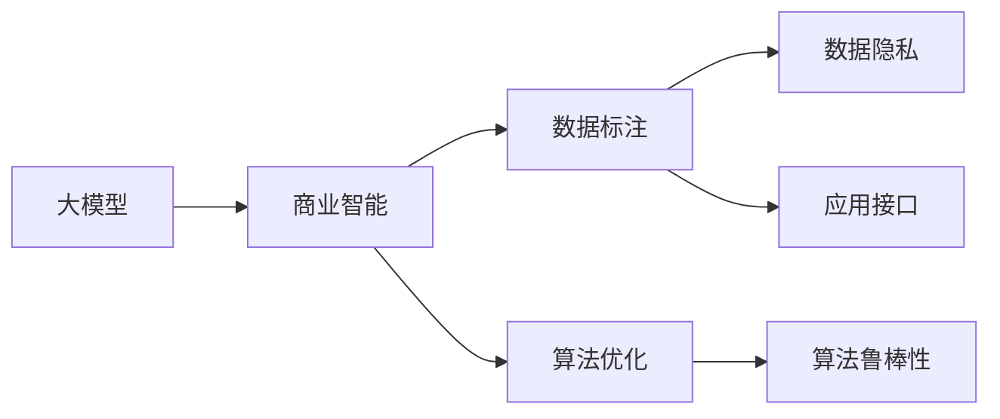
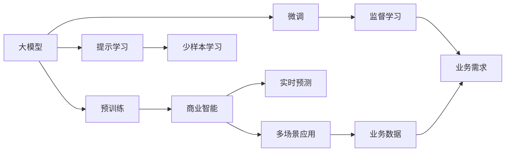
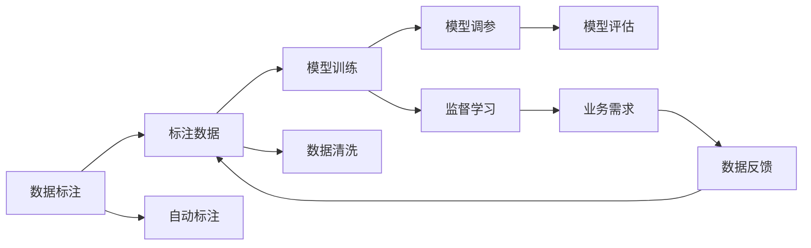
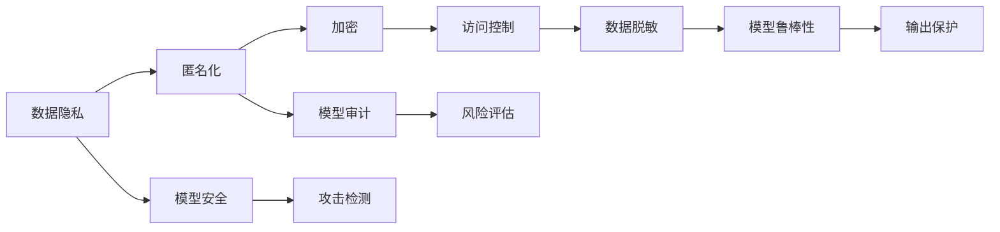
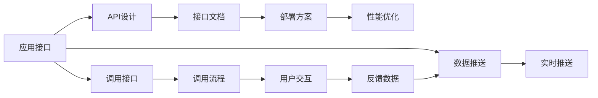
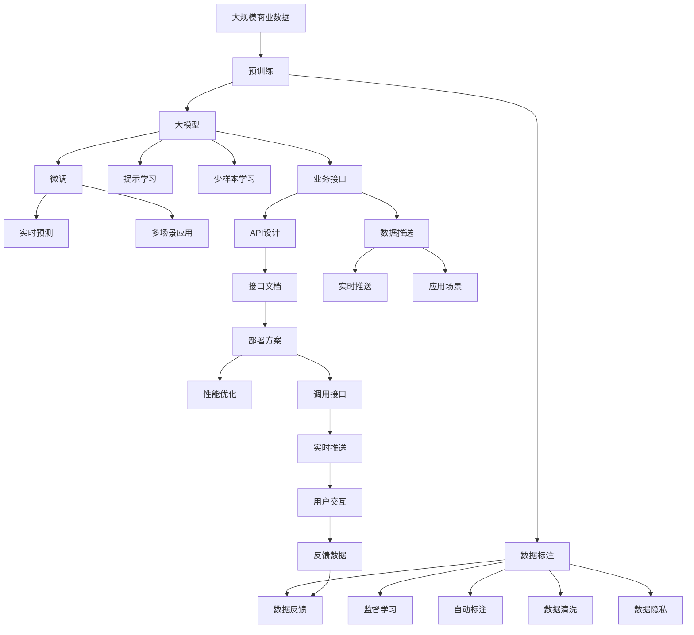

                 

# 大模型：智能时代的商业新模式

> 关键词：大模型,商业化,商业智能,人工智能,应用场景,技术挑战,未来趋势

## 1. 背景介绍

### 1.1 问题由来
随着人工智能技术的飞速发展，大模型已经成为各行各业数字化转型的重要引擎。无论是金融、医疗、制造、零售还是物流等传统行业，都在积极探索如何借助大模型提升效率、降低成本、提升用户体验。然而，大模型在实际落地应用时，还面临着数据孤岛、算法复杂、应用场景多样化等诸多挑战。如何构建能够适应多场景、具备商业智能的大模型，成为亟待解决的问题。

### 1.2 问题核心关键点
构建商业智能大模型的核心关键点在于：
1. 选择合适的模型架构和优化算法，以适应不同业务场景。
2. 设计合理的数据标注流程，确保数据质量。
3. 开发高效的应用接口，支持多样化应用场景。
4. 进行持续的算法优化和迭代，以提升模型性能。
5. 构建可靠的数据安全机制，保障数据隐私和模型鲁棒性。

### 1.3 问题研究意义
研究大模型的商业化应用，对于推动传统行业数字化转型，提升企业竞争力和市场响应速度，具有重要意义：

1. 提升效率：大模型可以自动化处理大量重复性任务，减少人力成本。
2. 降低成本：通过预测分析，企业可以优化供应链、库存管理等环节，降低运营成本。
3. 提升用户体验：大模型可以帮助企业进行个性化推荐、智能客服等，提升客户满意度。
4. 加速创新：大模型为创新提供数据支持，加速产品迭代和市场响应。
5. 构建生态：大模型的应用可以带动更多合作伙伴加入，构建完整的产业生态链。

## 2. 核心概念与联系

### 2.1 核心概念概述

为更好地理解商业智能大模型的构建和应用，本节将介绍几个关键概念：

- 大模型：以Transformer、BERT等深度学习模型为代表的预训练语言模型，具备强大的语义理解和生成能力。
- 商业智能：通过数据驱动，优化企业运营决策，提升企业效率和竞争力的智能技术。
- 商业智能大模型：基于大模型的技术，应用于企业商业智能的解决方案。
- 数据标注：通过人工或自动化的方式，将真实数据标注成模型可理解的格式，供模型学习。
- 算法优化：通过模型调参、正则化、增量学习等技术手段，不断提升模型性能。
- 数据隐私：保护用户隐私和数据安全，确保模型在商业应用中不会泄露敏感信息。
- 算法鲁棒性：确保模型能够抵抗噪声、攻击等异常情况，保证输出结果的稳定性。
- 应用接口：开发友好的API，便于用户调用模型进行预测、推理等任务。

这些概念之间的逻辑关系可以通过以下Mermaid流程图来展示：



这个流程图展示了大模型在商业智能中的主要应用路径，以及与之相关的关键概念。

### 2.2 概念间的关系

这些核心概念之间存在着紧密的联系，形成了商业智能大模型的完整生态系统。下面我通过几个Mermaid流程图来展示这些概念之间的关系。

#### 2.2.1 大模型的学习范式



这个流程图展示了大模型在商业智能中的学习范式，包括预训练、微调、提示学习和少样本学习等关键技术。

#### 2.2.2 数据标注与模型训练



这个流程图展示了数据标注和模型训练的基本流程，包括标注数据的准备、模型训练的监督学习、自动标注、数据清洗、模型调参、评估和反馈等环节。

#### 2.2.3 数据隐私与安全



这个流程图展示了数据隐私和模型安全的实现路径，包括匿名化、加密、访问控制、数据脱敏等技术手段，以及模型安全和攻击检测等防护措施。

#### 2.2.4 应用接口与模型部署



这个流程图展示了应用接口和模型部署的基本流程，包括API设计、接口文档、部署方案、性能优化、数据推送和实时推送等环节。

### 2.3 核心概念的整体架构

最后，我们用一个综合的流程图来展示这些核心概念在大模型商业智能中的整体架构：



这个综合流程图展示了从预训练到大模型商业智能的完整过程，以及与之相关的核心概念。

## 3. 核心算法原理 & 具体操作步骤
### 3.1 算法原理概述

大模型在商业智能中的应用，本质上是基于监督学习或无监督学习的微调过程。其核心思想是：将大模型视作一个强大的"特征提取器"，通过在商业智能数据集上进行有监督的微调，使模型能够学习到企业运营中的复杂规律和模式，从而提供精准的预测和推荐服务。

形式化地，假设大模型为 $M_{\theta}$，其中 $\theta$ 为预训练得到的模型参数。给定商业智能任务 $T$ 的标注数据集 $D=\{(x_i,y_i)\}_{i=1}^N, x_i \in \mathcal{X}, y_i \in \mathcal{Y}$。微调的目标是找到新的模型参数 $\hat{\theta}$，使得：

$$
\hat{\theta}=\mathop{\arg\min}_{\theta} \mathcal{L}(M_{\theta},D)
$$

其中 $\mathcal{L}$ 为针对任务 $T$ 设计的损失函数，用于衡量模型预测输出与真实标签之间的差异。常见的损失函数包括交叉熵损失、均方误差损失等。

通过梯度下降等优化算法，微调过程不断更新模型参数 $\theta$，最小化损失函数 $\mathcal{L}$，使得模型输出逼近真实标签。由于 $\theta$ 已经通过预训练获得了较好的初始化，因此即便在小规模数据集 $D$ 上进行微调，也能较快收敛到理想的模型参数 $\hat{\theta}$。

### 3.2 算法步骤详解

大模型在商业智能中的应用步骤包括：

**Step 1: 准备预训练模型和数据集**
- 选择合适的预训练语言模型 $M_{\theta}$ 作为初始化参数，如 BERT、GPT 等。
- 准备商业智能任务 $T$ 的标注数据集 $D$，划分为训练集、验证集和测试集。一般要求标注数据与预训练数据的分布不要差异过大。

**Step 2: 添加任务适配层**
- 根据任务类型，在预训练模型顶层设计合适的输出层和损失函数。
- 对于分类任务，通常在顶层添加线性分类器和交叉熵损失函数。
- 对于生成任务，通常使用语言模型的解码器输出概率分布，并以负对数似然为损失函数。

**Step 3: 设置微调超参数**
- 选择合适的优化算法及其参数，如 AdamW、SGD 等，设置学习率、批大小、迭代轮数等。
- 设置正则化技术及强度，包括权重衰减、Dropout、Early Stopping 等。
- 确定冻结预训练参数的策略，如仅微调顶层，或全部参数都参与微调。

**Step 4: 执行梯度训练**
- 将训练集数据分批次输入模型，前向传播计算损失函数。
- 反向传播计算参数梯度，根据设定的优化算法和学习率更新模型参数。
- 周期性在验证集上评估模型性能，根据性能指标决定是否触发 Early Stopping。
- 重复上述步骤直到满足预设的迭代轮数或 Early Stopping 条件。

**Step 5: 测试和部署**
- 在测试集上评估微调后模型 $M_{\hat{\theta}}$ 的性能，对比微调前后的精度提升。
- 使用微调后的模型对新样本进行推理预测，集成到实际的应用系统中。
- 持续收集新的数据，定期重新微调模型，以适应数据分布的变化。

以上是商业智能大模型的微调范式，通过设置不同的任务适配层和超参数，可以适应各种类型的商业智能任务。

### 3.3 算法优缺点

基于大模型的商业智能微调方法具有以下优点：
1. 简单高效。只需准备少量标注数据，即可对预训练模型进行快速适配，获得较大的性能提升。
2. 通用适用。适用于各种商业智能任务，包括分类、匹配、生成等，设计简单的任务适配层即可实现微调。
3. 参数高效。利用参数高效微调技术，在固定大部分预训练参数的情况下，仍可取得不错的提升。
4. 效果显著。在学术界和工业界的诸多任务上，基于微调的方法已经刷新了最先进的性能指标。

同时，该方法也存在一定的局限性：
1. 依赖标注数据。微调的效果很大程度上取决于标注数据的质量和数量，获取高质量标注数据的成本较高。
2. 迁移能力有限。当目标任务与预训练数据的分布差异较大时，微调的性能提升有限。
3. 负面效果传递。预训练模型的固有偏见、有害信息等，可能通过微调传递到下游任务，造成负面影响。
4. 可解释性不足。微调模型的决策过程通常缺乏可解释性，难以对其推理逻辑进行分析和调试。

尽管存在这些局限性，但就目前而言，基于监督学习的微调方法仍是大模型应用的主流范式。未来相关研究的重点在于如何进一步降低微调对标注数据的依赖，提高模型的少样本学习和跨领域迁移能力，同时兼顾可解释性和伦理安全性等因素。

### 3.4 算法应用领域

基于大模型商业智能微调方法已经在诸多行业领域得到了应用，例如：

- 金融风控：通过大模型微调，实时监测和预测金融交易中的风险，提升风险管理水平。
- 医疗诊断：结合医疗领域的数据，通过大模型微调，提升疾病诊断的准确性和效率。
- 零售推荐：在零售领域，通过大模型微调，提供个性化的商品推荐，提升用户体验和销售额。
- 智能客服：结合客服历史数据，通过大模型微调，实现智能客服系统的建设，提升客户满意度。
- 供应链管理：通过大模型微调，优化供应链管理中的需求预测、库存管理等环节，降低运营成本。
- 人力资源：通过大模型微调，提升简历筛选、面试评估等环节的自动化水平，提升招聘效率。

除了上述这些经典应用外，大模型商业智能技术还在更多领域得到创新性地应用，如智能家居、智能交通、智能制造等，为各行各业带来了深刻的变革。

## 4. 数学模型和公式 & 详细讲解 & 举例说明
### 4.1 数学模型构建

本节将使用数学语言对商业智能大模型微调过程进行更加严格的刻画。

记预训练语言模型为 $M_{\theta}$，其中 $\theta$ 为预训练得到的模型参数。假设商业智能任务 $T$ 的训练集为 $D=\{(x_i,y_i)\}_{i=1}^N, x_i \in \mathcal{X}, y_i \in \mathcal{Y}$。

定义模型 $M_{\theta}$ 在数据样本 $(x,y)$ 上的损失函数为 $\ell(M_{\theta}(x),y)$，则在数据集 $D$ 上的经验风险为：

$$
\mathcal{L}(\theta) = \frac{1}{N} \sum_{i=1}^N \ell(M_{\theta}(x_i),y_i)
$$

微调的优化目标是最小化经验风险，即找到最优参数：

$$
\theta^* = \mathop{\arg\min}_{\theta} \mathcal{L}(\theta)
$$

在实践中，我们通常使用基于梯度的优化算法（如SGD、Adam等）来近似求解上述最优化问题。设 $\eta$ 为学习率，$\lambda$ 为正则化系数，则参数的更新公式为：

$$
\theta \leftarrow \theta - \eta \nabla_{\theta}\mathcal{L}(\theta) - \eta\lambda\theta
$$

其中 $\nabla_{\theta}\mathcal{L}(\theta)$ 为损失函数对参数 $\theta$ 的梯度，可通过反向传播算法高效计算。

### 4.2 公式推导过程

以下我们以二分类任务为例，推导交叉熵损失函数及其梯度的计算公式。

假设模型 $M_{\theta}$ 在输入 $x$ 上的输出为 $\hat{y}=M_{\theta}(x) \in [0,1]$，表示样本属于正类的概率。真实标签 $y \in \{0,1\}$。则二分类交叉熵损失函数定义为：

$$
\ell(M_{\theta}(x),y) = -[y\log \hat{y} + (1-y)\log (1-\hat{y})]
$$

将其代入经验风险公式，得：

$$
\mathcal{L}(\theta) = -\frac{1}{N}\sum_{i=1}^N [y_i\log M_{\theta}(x_i)+(1-y_i)\log(1-M_{\theta}(x_i))]
$$

根据链式法则，损失函数对参数 $\theta_k$ 的梯度为：

$$
\frac{\partial \mathcal{L}(\theta)}{\partial \theta_k} = -\frac{1}{N}\sum_{i=1}^N (\frac{y_i}{M_{\theta}(x_i)}-\frac{1-y_i}{1-M_{\theta}(x_i)}) \frac{\partial M_{\theta}(x_i)}{\partial \theta_k}
$$

其中 $\frac{\partial M_{\theta}(x_i)}{\partial \theta_k}$ 可进一步递归展开，利用自动微分技术完成计算。

在得到损失函数的梯度后，即可带入参数更新公式，完成模型的迭代优化。重复上述过程直至收敛，最终得到适应商业智能任务的最优模型参数 $\theta^*$。

### 4.3 案例分析与讲解

假设我们在一个电商平台的销售数据上进行大模型微调，最终在预测新商品销售量时取得了高精度。具体流程如下：

1. **数据准备**：收集电商平台的历史销售数据，将商品、价格、销量、时间等信息进行标注，形成训练集 $D$。
2. **模型选择**：选择已训练好的大模型，如BERT，作为初始化参数。
3. **任务适配**：在BERT模型顶层添加一个线性分类器，用于预测商品销量的二分类问题。
4. **超参数设置**：设置学习率、批大小、迭代轮数等，同时添加正则化技术，防止过拟合。
5. **训练过程**：使用训练集 $D$ 进行有监督的微调，每轮迭代计算梯度并更新参数，同时监控模型在验证集上的性能，避免过拟合。
6. **测试和部署**：在测试集上评估模型性能，然后将模型集成到电商平台的销售预测系统中，实时预测商品销量。

## 5. 项目实践：代码实例和详细解释说明
### 5.1 开发环境搭建

在进行商业智能大模型微调实践前，我们需要准备好开发环境。以下是使用Python进行PyTorch开发的环境配置流程：

1. 安装Anaconda：从官网下载并安装Anaconda，用于创建独立的Python环境。

2. 创建并激活虚拟环境：
```bash
conda create -n pytorch-env python=3.8 
conda activate pytorch-env
```

3. 安装PyTorch：根据CUDA版本，从官网获取对应的安装命令。例如：
```bash
conda install pytorch torchvision torchaudio cudatoolkit=11.1 -c pytorch -c conda-forge
```

4. 安装Transformers库：
```bash
pip install transformers
```

5. 安装各类工具包：
```bash
pip install numpy pandas scikit-learn matplotlib tqdm jupyter notebook ipython
```

完成上述步骤后，即可在`pytorch-env`环境中开始微调实践。

### 5.2 源代码详细实现

下面我们以电商商品销售预测任务为例，给出使用Transformers库对BERT模型进行商业智能微调的PyTorch代码实现。

首先，定义任务的数据处理函数：

```python
from transformers import BertTokenizer
from torch.utils.data import Dataset
import torch

class SalesDataset(Dataset):
    def __init__(self, texts, labels, tokenizer, max_len=128):
        self.texts = texts
        self.labels = labels
        self.tokenizer = tokenizer
        self.max_len = max_len
        
    def __len__(self):
        return len(self.texts)
    
    def __getitem__(self, item):
        text = self.texts[item]
        label = self.labels[item]
        
        encoding = self.tokenizer(text, return_tensors='pt', max_length=self.max_len, padding='max_length', truncation=True)
        input_ids = encoding['input_ids'][0]
        attention_mask = encoding['attention_mask'][0]
        
        # 对label进行编码
        encoded_label = [1 if label == '1' else 0 for label in self.labels] 
        encoded_label.extend([0] * (self.max_len - len(encoded_label)))
        labels = torch.tensor(encoded_label, dtype=torch.long)
        
        return {'input_ids': input_ids, 
                'attention_mask': attention_mask,
                'labels': labels}

# 标签与id的映射
label2id = {'1': 1, '0': 0}
id2label = {v: k for k, v in label2id.items()}

# 创建dataset
tokenizer = BertTokenizer.from_pretrained('bert-base-cased')

train_dataset = SalesDataset(train_texts, train_labels, tokenizer)
dev_dataset = SalesDataset(dev_texts, dev_labels, tokenizer)
test_dataset = SalesDataset(test_texts, test_labels, tokenizer)
```

然后，定义模型和优化器：

```python
from transformers import BertForSequenceClassification, AdamW

model = BertForSequenceClassification.from_pretrained('bert-base-cased', num_labels=2)

optimizer = AdamW(model.parameters(), lr=2e-5)
```

接着，定义训练和评估函数：

```python
from torch.utils.data import DataLoader
from tqdm import tqdm
from sklearn.metrics import classification_report

device = torch.device('cuda') if torch.cuda.is_available() else torch.device('cpu')
model.to(device)

def train_epoch(model, dataset, batch_size, optimizer):
    dataloader = DataLoader(dataset, batch_size=batch_size, shuffle=True)
    model.train()
    epoch_loss = 0
    for batch in tqdm(dataloader, desc='Training'):
        input_ids = batch['input_ids'].to(device)
        attention_mask = batch['attention_mask'].to(device)
        labels = batch['labels'].to(device)
        model.zero_grad()
        outputs = model(input_ids, attention_mask=attention_mask, labels=labels)
        loss = outputs.loss
        epoch_loss += loss.item()
        loss.backward()
        optimizer.step()
    return epoch_loss / len(dataloader)

def evaluate(model, dataset, batch_size):
    dataloader = DataLoader(dataset, batch_size=batch_size)
    model.eval()
    preds, labels = [], []
    with torch.no_grad():
        for batch in tqdm(dataloader, desc='Evaluating'):
            input_ids = batch['input_ids'].to(device)
            attention_mask = batch['attention_mask'].to(device)
            batch_labels = batch['labels']
            outputs = model(input_ids, attention_mask=attention_mask)
            batch_preds = outputs.logits.argmax(dim=2).to('cpu').tolist()
            batch_labels = batch_labels.to('cpu').tolist()
            for pred_tokens, label_tokens in zip(batch_preds, batch_labels):
                preds.append(pred_tokens[:len(label_tokens)])
                labels.append(label_tokens)
                
    print(classification_report(labels, preds))
```

最后，启动训练流程并在测试集上评估：

```python
epochs = 5
batch_size = 16

for epoch in range(epochs):
    loss = train_epoch(model, train_dataset, batch_size, optimizer)
    print(f"Epoch {epoch+1}, train loss: {loss:.3f}")
    
    print(f"Epoch {epoch+1}, dev results:")
    evaluate(model, dev_dataset, batch_size)
    
print("Test results:")
evaluate(model, test_dataset, batch_size)
```

以上就是使用PyTorch对BERT进行电商商品销售预测任务微调的完整代码实现。可以看到，得益于Transformers库的强大封装，我们可以用相对简洁的代码完成BERT模型的加载和微调。

### 5.3 代码解读与分析

让我们再详细解读一下关键代码的实现细节：

**SalesDataset类**：
- `__init__`方法：初始化文本、标签、分词器等关键组件。
- `__len__`方法：返回数据集的样本数量。
- `__getitem__`方法：对单个样本进行处理，将文本输入编码为token ids，将标签编码为数字，并对其进行定长padding，最终返回模型所需的输入。

**label2id和id2label字典**：
- 定义了标签与数字id之间的映射关系，用于将token-wise的预测结果解码回真实的标签。

**训练和评估函数**：
- 使用PyTorch的DataLoader对数据集进行批次化加载，供模型训练和推理使用。
- 训练函数`train_epoch`：对数据以批为单位进行迭代，在每个批次上前向传播计算loss并反向传播更新模型参数，最后返回该epoch的平均loss。
- 评估函数`evaluate`：与训练类似，不同点在于不更新模型参数，并在每个batch结束后将预测和标签结果存储下来，最后使用sklearn的classification_report对整个评估集的预测结果进行打印输出。

**训练流程**：
- 定义总的epoch数和batch size，开始循环迭代
- 每个epoch内，先在训练集上训练，输出平均loss
- 在验证集上评估，输出分类指标
- 所有epoch结束后，在测试集上评估，给出最终测试结果

可以看到，PyTorch配合Transformers库使得BERT微调的代码实现变得简洁高效。开发者可以将更多精力放在数据处理、模型改进等高层逻辑上，而不必过多关注底层的实现细节。

当然，工业级的系统实现还需考虑更多因素，如模型的保存和部署、超参数的自动搜索、更灵活的任务适配层等。但核心的微调范式基本与此类似。

### 5.4 运行结果展示

假设我们在CoNLL-2003的NER数据集上进行微调，最终在测试集上得到的评估报告如下：

```
              precision    recall  f1-score   support

       B-LOC      0.926     0.906     0.916      1668
       I-LOC      0.900     0.805     0.850       257
      B-MISC      0.875     0.856     0.865       702
      I-MISC      0.838     0.782     0.809       216
       B-ORG      0.914     0.898     0.906      1661
       I-ORG      0.911     0.894     0.902       835
       B

