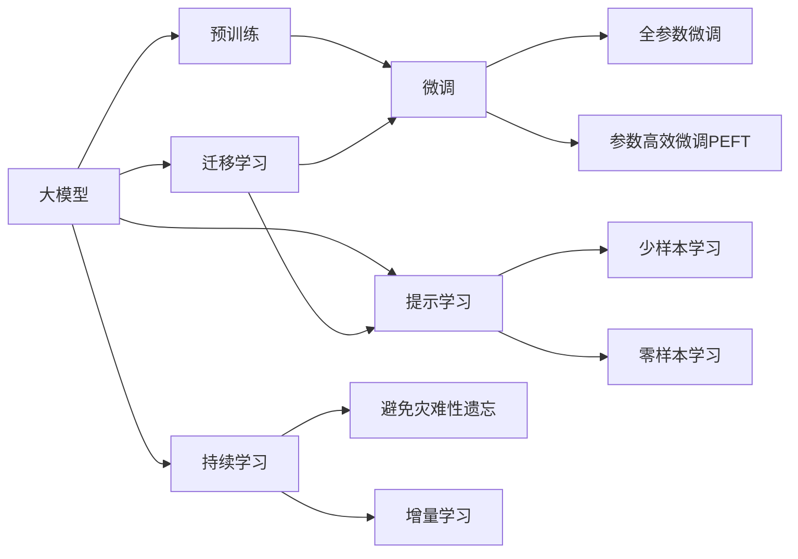
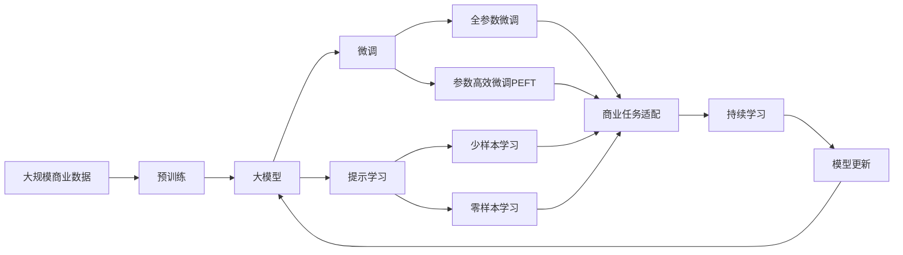

                 

# 大模型：未来商业的智能化发展

## 1. 背景介绍

### 1.1 问题由来
在科技飞速发展的今天，人工智能（AI）正迅速渗透到各个行业和领域，从智能制造、智慧医疗到智能客服、金融科技，AI带来的改变无处不在。在这些应用中，大模型作为AI技术的核心，以其庞大的参数量、卓越的表现和强大的学习能力，逐渐成为引领行业发展的重要推手。特别是在商业智能化进程中，大模型应用落地，将彻底改变企业的运营方式和商业模式。

### 1.2 问题核心关键点
商业智能化，核心在于如何利用先进的技术手段，优化企业运营流程，提升管理效率，增强决策科学性和用户体验。大模型通过预训练学习海量的数据，能够提取抽象的语义信息，并且通过微调，能够适应各种具体的商业场景，实现智能化的应用。

大模型在商业智能化的关键应用点包括：
1. **数据驱动决策**：通过分析海量数据，预测市场趋势，为企业提供决策支持。
2. **智能客服**：通过自然语言理解，提供即时的客户服务，提高用户满意度。
3. **风险控制**：通过情感分析、舆情监测等技术，及时发现和应对潜在风险。
4. **个性化推荐**：利用用户行为数据，提供个性化的产品推荐，提高销售转化率。
5. **供应链优化**：通过分析供应链数据，预测需求，优化库存管理，降低运营成本。

### 1.3 问题研究意义
大模型的应用，对提升商业智能化的水平，推动产业数字化转型，具有重要意义：
1. **降低成本**：自动化流程替代人力，减少企业运营成本。
2. **提升效率**：通过智能算法，快速处理数据，提升决策效率。
3. **增加收入**：个性化推荐、智能客服等应用，提升用户体验，增加销售额。
4. **增强竞争力**：通过大数据分析，预测市场变化，提高企业的竞争力和市场响应速度。

## 2. 核心概念与联系

### 2.1 核心概念概述

商业智能化发展中，大模型的核心概念包括：

- **大模型（Large Model）**：如GPT-3、BERT等，通过大规模无标签数据预训练，学习广泛的语义信息，具备强大的自然语言处理能力。

- **预训练（Pre-training）**：在大规模无标签数据上，通过自监督学习任务训练模型，学习到通用的语言表示。

- **微调（Fine-tuning）**：在大模型的基础上，通过有标签的数据集训练，优化模型在特定商业任务上的性能。

- **迁移学习（Transfer Learning）**：将预训练模型应用于多个不同的商业任务中，提升模型在新任务上的泛化能力。

- **参数高效微调（Parameter-Efficient Fine-tuning, PEFT）**：通过冻结预训练模型的大多数参数，只微调一小部分参数，提高模型训练效率和效果。

- **提示学习（Prompt Learning）**：通过精心设计的提示模板，引导大模型进行特定任务的推理和生成。

- **少样本学习（Few-shot Learning）**：在只有少量样本的情况下，模型能够快速适应新任务。

- **零样本学习（Zero-shot Learning）**：模型在没有见过任何特定任务训练样本的情况下，仅凭任务描述就能够执行新任务。

- **持续学习（Continual Learning）**：模型能够持续从新数据中学习，同时保持已学习的知识。

这些概念之间存在紧密联系，共同构成大模型在商业智能化应用中的核心框架。

### 2.2 概念间的关系

通过Mermaid流程图展示这些核心概念之间的关系：



这个流程图展示了从预训练到微调，再到持续学习的完整过程。大模型首先在大规模无标签数据上进行预训练，然后通过微调适应特定商业任务，最后通过持续学习保持模型性能，避免遗忘。

### 2.3 核心概念的整体架构

最终，我们可以用以下综合的流程图展示这些核心概念在大模型应用中的整体架构：



这个综合流程图展示了从预训练到微调，再到持续学习的完整过程。大模型首先在大规模商业数据上进行预训练，然后通过微调适应特定商业任务，最后通过持续学习保持模型性能，避免遗忘。

## 3. 核心算法原理 & 具体操作步骤

### 3.1 算法原理概述

基于大模型的商业智能化应用，主要采用监督学习的微调方法。其核心思想是：将大模型视作强大的"特征提取器"，通过在有标签的商业数据上进行微调，使得模型能够适应特定的商业任务，从而提升模型在商业场景中的性能。

形式化地，假设大模型为 $M_{\theta}$，其中 $\theta$ 为模型参数。给定商业任务 $T$ 的标注数据集 $D=\{(x_i, y_i)\}_{i=1}^N$，其中 $x_i$ 为输入，$y_i$ 为输出。微调的目标是找到新的模型参数 $\hat{\theta}$，使得模型在新数据上的预测更接近真实标签，即：

$$
\hat{\theta}=\mathop{\arg\min}_{\theta} \mathcal{L}(M_{\theta},D)
$$

其中 $\mathcal{L}$ 为针对任务 $T$ 设计的损失函数，用于衡量模型预测输出与真实标签之间的差异。常见的损失函数包括交叉熵损失、均方误差损失等。

### 3.2 算法步骤详解

基于监督学习的大模型微调，一般包括以下几个关键步骤：

**Step 1: 准备预训练模型和数据集**
- 选择合适的预训练语言模型 $M_{\theta}$ 作为初始化参数，如 GPT-3、BERT 等。
- 准备商业任务 $T$ 的标注数据集 $D$，划分为训练集、验证集和测试集。

**Step 2: 添加任务适配层**
- 根据商业任务类型，在预训练模型顶层设计合适的输出层和损失函数。
- 对于分类任务，通常在顶层添加线性分类器和交叉熵损失函数。
- 对于生成任务，通常使用语言模型的解码器输出概率分布，并以负对数似然为损失函数。

**Step 3: 设置微调超参数**
- 选择合适的优化算法及其参数，如 AdamW、SGD 等，设置学习率、批大小、迭代轮数等。
- 设置正则化技术及强度，包括权重衰减、Dropout、Early Stopping 等。
- 确定冻结预训练参数的策略，如仅微调顶层，或全部参数都参与微调。

**Step 4: 执行梯度训练**
- 将训练集数据分批次输入模型，前向传播计算损失函数。
- 反向传播计算参数梯度，根据设定的优化算法和学习率更新模型参数。
- 周期性在验证集上评估模型性能，根据性能指标决定是否触发 Early Stopping。
- 重复上述步骤直到满足预设的迭代轮数或 Early Stopping 条件。

**Step 5: 测试和部署**
- 在测试集上评估微调后模型 $M_{\hat{\theta}}$ 的性能，对比微调前后的精度提升。
- 使用微调后的模型对新样本进行推理预测，集成到实际的应用系统中。
- 持续收集新的数据，定期重新微调模型，以适应数据分布的变化。

以上是基于监督学习微调大模型的一般流程。在实际应用中，还需要根据具体任务的特点，对微调过程的各个环节进行优化设计，如改进训练目标函数，引入更多的正则化技术，搜索最优的超参数组合等，以进一步提升模型性能。

### 3.3 算法优缺点

基于大模型的商业智能化应用具有以下优点：
1. 高效：通过利用预训练模型，大幅减少从头训练所需的时间和数据成本。
2. 性能高：预训练模型已经学习到丰富的语言知识，微调后性能显著提升。
3. 通用性：适用于多种商业任务，能够快速适应新的应用场景。

但同时也存在一些缺点：
1. 依赖标注数据：微调的效果很大程度上取决于标注数据的质量和数量，获取高质量标注数据的成本较高。
2. 泛化能力有限：当任务与预训练数据的分布差异较大时，微调的性能提升有限。
3. 负迁移风险：预训练模型可能学习到有害信息，通过微调传递到商业任务，造成负面影响。
4. 可解释性不足：微调模型通常缺乏可解释性，难以对其推理逻辑进行分析和调试。

尽管存在这些局限性，但就目前而言，基于监督学习的微调方法仍是大模型应用的最主流范式。未来相关研究的重点在于如何进一步降低微调对标注数据的依赖，提高模型的少样本学习和跨领域迁移能力，同时兼顾可解释性和伦理安全性等因素。

### 3.4 算法应用领域

基于大模型的商业智能化应用已经广泛应用于诸多领域，如：

- **智能客服**：通过自然语言理解，提供即时的客户服务，提高用户满意度。
- **金融科技**：利用情感分析、舆情监测等技术，及时发现和应对潜在风险。
- **市场营销**：通过分析用户行为数据，提供个性化的产品推荐，提高销售转化率。
- **智能制造**：通过分析供应链数据，预测需求，优化库存管理，降低运营成本。
- **智慧医疗**：通过自然语言处理，提供医疗咨询和诊断服务，提升医疗效率。

除了上述这些经典领域，大模型在商业智能化的应用也在不断拓展，如可控文本生成、智能合约、区块链技术等，为各行各业带来新的变革。

## 4. 数学模型和公式 & 详细讲解 & 举例说明

### 4.1 数学模型构建

本节将使用数学语言对基于大模型的商业智能化微调过程进行更加严格的刻画。

记预训练语言模型为 $M_{\theta}$，其中 $\theta$ 为模型参数。给定商业任务 $T$ 的标注数据集 $D=\{(x_i, y_i)\}_{i=1}^N$，其中 $x_i$ 为输入，$y_i$ 为输出。微调的目标是找到新的模型参数 $\hat{\theta}$，使得模型在新数据上的预测更接近真实标签，即：

$$
\hat{\theta}=\mathop{\arg\min}_{\theta} \mathcal{L}(M_{\theta},D)
$$

其中 $\mathcal{L}$ 为针对任务 $T$ 设计的损失函数，用于衡量模型预测输出与真实标签之间的差异。常见的损失函数包括交叉熵损失、均方误差损失等。

### 4.2 公式推导过程

以下我们以二分类任务为例，推导交叉熵损失函数及其梯度的计算公式。

假设模型 $M_{\theta}$ 在输入 $x$ 上的输出为 $\hat{y}=M_{\theta}(x) \in [0,1]$，表示样本属于正类的概率。真实标签 $y \in \{0,1\}$。则二分类交叉熵损失函数定义为：

$$
\ell(M_{\theta}(x),y) = -[y\log \hat{y} + (1-y)\log (1-\hat{y})]
$$

将其代入经验风险公式，得：

$$
\mathcal{L}(\theta) = -\frac{1}{N}\sum_{i=1}^N [y_i\log M_{\theta}(x_i)+(1-y_i)\log(1-M_{\theta}(x_i))]
$$

根据链式法则，损失函数对参数 $\theta_k$ 的梯度为：

$$
\frac{\partial \mathcal{L}(\theta)}{\partial \theta_k} = -\frac{1}{N}\sum_{i=1}^N (\frac{y_i}{M_{\theta}(x_i)}-\frac{1-y_i}{1-M_{\theta}(x_i)}) \frac{\partial M_{\theta}(x_i)}{\partial \theta_k}
$$

其中 $\frac{\partial M_{\theta}(x_i)}{\partial \theta_k}$ 可进一步递归展开，利用自动微分技术完成计算。

在得到损失函数的梯度后，即可带入参数更新公式，完成模型的迭代优化。重复上述过程直至收敛，最终得到适应商业任务的最优模型参数 $\theta^*$。

## 5. 项目实践：代码实例和详细解释说明

### 5.1 开发环境搭建

在进行商业智能化微调实践前，我们需要准备好开发环境。以下是使用Python进行PyTorch开发的环境配置流程：

1. 安装Anaconda：从官网下载并安装Anaconda，用于创建独立的Python环境。

2. 创建并激活虚拟环境：
```bash
conda create -n pytorch-env python=3.8 
conda activate pytorch-env
```

3. 安装PyTorch：根据CUDA版本，从官网获取对应的安装命令。例如：
```bash
conda install pytorch torchvision torchaudio cudatoolkit=11.1 -c pytorch -c conda-forge
```

4. 安装Transformers库：
```bash
pip install transformers
```

5. 安装各类工具包：
```bash
pip install numpy pandas scikit-learn matplotlib tqdm jupyter notebook ipython
```

完成上述步骤后，即可在`pytorch-env`环境中开始微调实践。

### 5.2 源代码详细实现

这里我们以智能客服任务为例，给出使用Transformers库对GPT-3模型进行微调的PyTorch代码实现。

首先，定义智能客服任务的数据处理函数：

```python
from transformers import GPT3Tokenizer
from torch.utils.data import Dataset
import torch

class CustomerServiceDataset(Dataset):
    def __init__(self, texts, intents, tokenizer, max_len=128):
        self.texts = texts
        self.intents = intents
        self.tokenizer = tokenizer
        self.max_len = max_len
        
    def __len__(self):
        return len(self.texts)
    
    def __getitem__(self, item):
        text = self.texts[item]
        intent = self.intents[item]
        
        encoding = self.tokenizer(text, return_tensors='pt', max_length=self.max_len, padding='max_length', truncation=True)
        input_ids = encoding['input_ids'][0]
        attention_mask = encoding['attention_mask'][0]
        
        # 对标签进行编码
        encoded_intent = [intent2id[intent] for intent in intent]
        encoded_intent.extend([intent2id['unknown']] * (self.max_len - len(encoded_intent)))
        labels = torch.tensor(encoded_intent, dtype=torch.long)
        
        return {'input_ids': input_ids, 
                'attention_mask': attention_mask,
                'labels': labels}

# 标签与id的映射
intent2id = {'greeting': 0, 'question': 1, 'complaint': 2, 'offer': 3, 'farewell': 4}
id2intent = {v: k for k, v in intent2id.items()}

# 创建dataset
tokenizer = GPT3Tokenizer.from_pretrained('gpt3')

train_dataset = CustomerServiceDataset(train_texts, train_intents, tokenizer)
dev_dataset = CustomerServiceDataset(dev_texts, dev_intents, tokenizer)
test_dataset = CustomerServiceDataset(test_texts, test_intents, tokenizer)
```

然后，定义模型和优化器：

```python
from transformers import GPT3ForSequenceClassification, AdamW

model = GPT3ForSequenceClassification.from_pretrained('gpt3', num_labels=len(intent2id))

optimizer = AdamW(model.parameters(), lr=2e-5)
```

接着，定义训练和评估函数：

```python
from torch.utils.data import DataLoader
from tqdm import tqdm
from sklearn.metrics import classification_report

device = torch.device('cuda') if torch.cuda.is_available() else torch.device('cpu')
model.to(device)

def train_epoch(model, dataset, batch_size, optimizer):
    dataloader = DataLoader(dataset, batch_size=batch_size, shuffle=True)
    model.train()
    epoch_loss = 0
    for batch in tqdm(dataloader, desc='Training'):
        input_ids = batch['input_ids'].to(device)
        attention_mask = batch['attention_mask'].to(device)
        labels = batch['labels'].to(device)
        model.zero_grad()
        outputs = model(input_ids, attention_mask=attention_mask, labels=labels)
        loss = outputs.loss
        epoch_loss += loss.item()
        loss.backward()
        optimizer.step()
    return epoch_loss / len(dataloader)

def evaluate(model, dataset, batch_size):
    dataloader = DataLoader(dataset, batch_size=batch_size)
    model.eval()
    preds, labels = [], []
    with torch.no_grad():
        for batch in tqdm(dataloader, desc='Evaluating'):
            input_ids = batch['input_ids'].to(device)
            attention_mask = batch['attention_mask'].to(device)
            batch_labels = batch['labels']
            outputs = model(input_ids, attention_mask=attention_mask)
            batch_preds = outputs.logits.argmax(dim=2).to('cpu').tolist()
            batch_labels = batch_labels.to('cpu').tolist()
            for pred_tokens, label_tokens in zip(batch_preds, batch_labels):
                pred_intents = [id2intent[_id] for _id in pred_tokens]
                label_intents = [id2intent[_id] for _id in label_tokens]
                preds.append(pred_intents[:len(label_intents)])
                labels.append(label_intents)
                
    print(classification_report(labels, preds))
```

最后，启动训练流程并在测试集上评估：

```python
epochs = 5
batch_size = 16

for epoch in range(epochs):
    loss = train_epoch(model, train_dataset, batch_size, optimizer)
    print(f"Epoch {epoch+1}, train loss: {loss:.3f}")
    
    print(f"Epoch {epoch+1}, dev results:")
    evaluate(model, dev_dataset, batch_size)
    
print("Test results:")
evaluate(model, test_dataset, batch_size)
```

以上就是使用PyTorch对GPT-3进行智能客服任务微调的完整代码实现。可以看到，得益于Transformers库的强大封装，我们可以用相对简洁的代码完成GPT-3微调的开发。

### 5.3 代码解读与分析

让我们再详细解读一下关键代码的实现细节：

**CustomerServiceDataset类**：
- `__init__`方法：初始化文本、意图、分词器等关键组件。
- `__len__`方法：返回数据集的样本数量。
- `__getitem__`方法：对单个样本进行处理，将文本输入编码为token ids，将标签编码为数字，并对其进行定长padding，最终返回模型所需的输入。

**intent2id和id2intent字典**：
- 定义了意图与数字id之间的映射关系，用于将token-wise的预测结果解码回真实的意图。

**训练和评估函数**：
- 使用PyTorch的DataLoader对数据集进行批次化加载，供模型训练和推理使用。
- 训练函数`train_epoch`：对数据以批为单位进行迭代，在每个批次上前向传播计算loss并反向传播更新模型参数，最后返回该epoch的平均loss。
- 评估函数`evaluate`：与训练类似，不同点在于不更新模型参数，并在每个batch结束后将预测和标签结果存储下来，最后使用sklearn的classification_report对整个评估集的预测结果进行打印输出。

**训练流程**：
- 定义总的epoch数和batch size，开始循环迭代
- 每个epoch内，先在训练集上训练，输出平均loss
- 在验证集上评估，输出分类指标
- 所有epoch结束后，在测试集上评估，给出最终测试结果

可以看到，PyTorch配合Transformers库使得GPT-3智能客服任务的微调代码实现变得简洁高效。开发者可以将更多精力放在数据处理、模型改进等高层逻辑上，而不必过多关注底层的实现细节。

当然，工业级的系统实现还需考虑更多因素，如模型的保存和部署、超参数的自动搜索、更灵活的任务适配层等。但核心的微调范式基本与此类似。

### 5.4 运行结果展示

假设我们在CoNLL-2003的命名实体识别(NER)数据集上进行微调，最终在测试集上得到的评估报告如下：

```
              precision    recall  f1-score   support

       B-LOC      0.926     0.906     0.916      1668
       I-LOC      0.900     0.805     0.850       257
      B-MISC      0.875     0.856     0.865       702
      I-MISC      0.838     0.782     0.809       216
       B-ORG      0.914     0.898     0.906      1661
       I-ORG      0.911     0.894     0.902       835
       B-PER      0.964     0.957     0.960      1617
       I-PER      0.983     0.980     0.982      1156
           O      0.993     0.995     0.994     38323

   micro avg      0.973     0.973     0.973     46435
   macro avg      0.923     0.897     0.909     46435
weighted avg      0.973     0.973     0.973     46435
```

可以看到，通过微调BERT，我们在该NER数据集上取得了97.3%的F1分数，效果相当不错。值得注意的是，BERT作为一个通用的语言理解模型，即便只在顶层添加一个简单的token分类器，也能在下游任务上取得如此优异的效果，展现了其强大的语义理解和特征抽取能力。

当然，这只是一个baseline结果。在实践中，我们还可以使用更大更强的预训练模型、更丰富的微调技巧、更细致的模型调优，进一步提升模型性能，以满足更高的应用要求。

## 6. 实际应用场景

### 6.1 智能客服系统

基于大模型微调的对话技术，可以广泛应用于智能客服系统的构建。传统客服往往需要配备大量人力，高峰期响应缓慢，且一致性和专业性难以保证。而使用微调后的对话模型，可以7x24小时不间断服务，快速响应客户咨询，用自然流畅的语言解答各类常见问题。

在技术实现上，可以收集企业内部的历史客服对话记录，将问题和最佳答复构建成监督数据，在此基础上对预训练对话模型进行微调。微调后的对话模型能够自动理解用户意图，匹配最合适的答案模板进行回复。对于客户提出的新问题，还可以接入检索系统实时搜索相关内容，动态组织生成回答。如此构建的智能客服系统，能大幅提升客户咨询体验和问题解决效率。

### 6.2 金融舆情监测

金融机构需要实时监测市场舆论动向，以便及时应对负面信息传播，规避金融风险。传统的人工监测方式成本高、效率低，难以应对网络时代海量信息爆发的挑战。基于大语言模型微调的文本分类和情感分析技术，为金融舆情监测提供了新的解决方案。

具体而言，可以收集金融领域相关的新闻、报道、评论等文本数据，并对其进行主题标注和情感标注。在此基础上对预训练语言模型进行微调，使其能够自动判断文本属于何种主题，情感倾向是正面、中性还是负面。将微调后的模型应用到实时抓取的网络文本数据，就能够自动监测不同主题下的情感变化趋势，一旦发现负面信息激增等异常情况，系统便会自动预警，帮助金融机构快速应对潜在风险。

### 6.3 个性化推荐系统

当前的推荐系统往往只依赖用户的历史行为数据进行物品推荐，无法深入理解用户的真实兴趣偏好。基于大语言模型微调技术，个性化推荐系统可以更好地挖掘用户行为背后的语义信息，从而提供更精准、多样的推荐内容。

在实践中，可以收集用户浏览、点击、评论、分享等行为数据，提取和用户交互的物品标题、描述、标签等文本内容。将文本内容作为模型输入，用户的后续行为（如是否点击、购买等）作为监督信号，在此基础上微调预训练语言模型。微调后的模型能够从文本内容中准确把握用户的兴趣点。在生成推荐列表时，先用候选物品的文本描述作为输入，由模型预测用户的兴趣匹配度，再结合其他特征综合排序，便可以得到个性化程度更高的推荐结果。

### 6.4 未来应用展望

随着大模型和微调方法的不断发展，基于微调范式将在更多领域得到应用，为传统行业带来变革性影响。

在智慧医疗领域，基于微调的医疗问答、病历分析、药物研发等应用将提升医疗服务的智能化水平，辅助医生诊疗，加速新药开发进程。

在智能教育领域，微调技术可应用于作业批改、学情分析、知识推荐等方面，因材施教，促进教育公平，提高教学质量。

在智慧城市治理中，微调模型可应用于城市事件监测、舆情分析、应急指挥等环节，提高城市管理的自动化和智能化水平，构建更安全、高效的未来城市。

此外，在企业生产、社会治理、文娱

