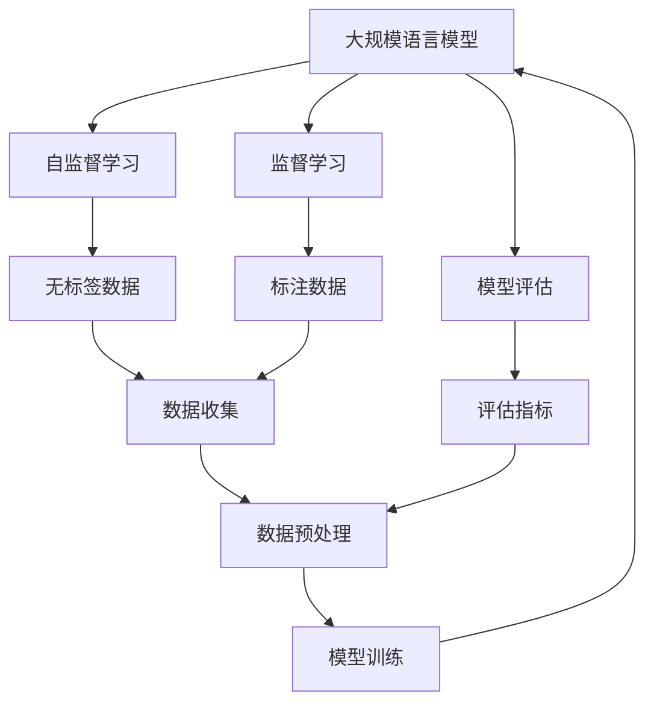

                 

# 大规模语言模型从理论到实践 数据收集与训练策略

> 关键词：大规模语言模型,数据收集,训练策略,深度学习,自监督学习,监督学习,模型评估

## 1. 背景介绍

### 1.1 问题由来

在过去几十年里，自然语言处理(NLP)技术经历了飞速的发展，尤其是深度学习和大规模预训练语言模型(Large Language Models, LLMs)的广泛应用，已经极大地提升了NLP任务的性能。这些大模型如GPT、BERT等，通过在巨量的无标签文本数据上进行预训练，学习到了丰富的语言知识和语言理解能力。然而，这些模型在实际应用中仍面临诸多挑战，其中数据收集和训练策略的合理性是关键。

具体来说，在大规模语言模型构建的过程中，数据的收集和处理方式、训练策略的选择、模型评估的标准等，都对模型的性能和泛化能力有着显著影响。本文将详细探讨这些问题，并提出基于理论和实践的策略，以指导大规模语言模型的设计和训练。

### 1.2 问题核心关键点

要设计合理的大规模语言模型，需注意以下核心关键点：

- **数据收集策略**：如何有效地收集大规模、高质量的文本数据。
- **数据预处理**：如何对数据进行有效的清洗、标记和分词。
- **模型训练策略**：如何选择合适的模型架构、损失函数和优化算法。
- **模型评估**：如何设计科学的评估指标和评估方法。
- **数据分布假设**：如何假设数据分布，以确保模型泛化性。

这些关键点共同构成了大规模语言模型构建的基石，影响着模型的效果和可靠性。

### 1.3 问题研究意义

通过合理的数据收集与训练策略，可以显著提升大规模语言模型的性能，使其在实际应用中更加准确和高效。具体而言，该研究具有以下重要意义：

1. **提升模型效果**：通过精心设计的数据收集和训练策略，可以最大化地利用数据信息，提升模型的泛化能力和任务表现。
2. **降低资源消耗**：合理的数据预处理和模型训练策略，有助于减少不必要的计算资源消耗，提高训练效率。
3. **增强模型泛化能力**：通过科学的数据分布假设，确保模型在未见过的数据上仍能表现良好，增强模型的泛化能力。
4. **指导模型优化**：提供理论依据和实践指南，指导后续模型优化和应用开发。
5. **促进产业应用**：帮助企业更好地利用大规模语言模型，推动人工智能技术的商业化应用。

## 2. 核心概念与联系

### 2.1 核心概念概述

为更好地理解数据收集与训练策略在大规模语言模型中的应用，我们首先介绍几个核心概念：

- **大规模语言模型(Large Language Models, LLMs)**：指在巨量文本数据上进行预训练，能够处理自然语言理解、生成、推理等任务的语言模型，如GPT、BERT、T5等。
- **自监督学习(Self-Supervised Learning)**：指在没有标签数据的情况下，通过模型自身的预测和重构能力进行学习，常用的自监督任务包括掩码语言模型、下位预测等。
- **监督学习(Supervised Learning)**：指在有标注数据的情况下，通过监督信号指导模型学习，适用于任务导向的数据收集与训练。
- **模型评估**：指通过科学指标和评估方法，衡量模型的性能和泛化能力，常用的指标包括BLEU、ROUGE、F1-score等。

### 2.2 核心概念间的关系

这些核心概念之间存在着紧密的联系，形成了大规模语言模型构建的完整生态系统。下面通过一个Mermaid流程图来展示这些概念的关系：



这个流程图展示了大规模语言模型的构建过程：

1. 通过自监督学习，在大规模无标签数据上进行预训练。
2. 在标注数据上，通过监督学习进行微调，提升模型在特定任务上的表现。
3. 模型通过科学的评估指标进行性能评估，确保模型泛化能力。
4. 数据收集和预处理是模型构建的基础，标注数据则是模型训练的指导。

这些概念共同构成了大规模语言模型构建的基石，为模型的设计和训练提供了理论基础和实践指南。

## 3. 核心算法原理 & 具体操作步骤

### 3.1 算法原理概述

大规模语言模型的构建，主要依赖于自监督学习和监督学习两个范式。其核心思想是通过大规模文本数据进行预训练，学习通用的语言知识，然后在特定任务上通过微调进行适应，提升模型的性能。

具体来说，自监督学习的目标是学习语言的统计特性和结构信息，如掩码语言模型、下位预测等。而监督学习则是通过有标注数据，指导模型学习特定任务，如分类、生成、问答等。两者相辅相成，共同提升模型的泛化能力和任务表现。

### 3.2 算法步骤详解

基于自监督和监督学习的大规模语言模型构建步骤如下：

**Step 1: 数据收集与预处理**

1. **数据收集**：收集大规模、高质量的文本数据。可以从公开数据集、网络爬虫、企业内部数据等多个渠道获取。
2. **数据清洗**：去除无意义、重复、低质量的文本数据，确保数据集的质量。
3. **数据标记**：对标注数据进行准确标注，确保标注一致性和可靠性。
4. **分词和向量化**：将文本数据转换为模型能够处理的形式，如分词、编码、标准化等。

**Step 2: 自监督预训练**

1. **模型选择**：选择合适的预训练模型架构，如Transformer、LSTM等。
2. **自监督任务**：选择适合的自监督任务，如掩码语言模型、下位预测等。
3. **损失函数**：设计自监督任务的损失函数，如交叉熵、重构误差等。
4. **优化算法**：选择合适的优化算法，如Adam、SGD等。
5. **训练流程**：设计训练流程，包括批大小、迭代次数、学习率等。

**Step 3: 监督微调**

1. **任务定义**：明确目标任务的性质，如分类、生成、问答等。
2. **模型适配**：设计任务的适配层，如线性分类器、解码器等。
3. **损失函数**：根据任务性质选择合适的损失函数，如交叉熵、序列对数似然等。
4. **优化算法**：选择适当的优化算法，如AdamW、Adafactor等。
5. **超参数调整**：调整模型参数，如冻结预训练层、批大小、迭代次数、学习率等。
6. **训练与评估**：在标注数据上训练模型，并在验证集上进行性能评估，确保模型泛化能力。

**Step 4: 模型评估**

1. **评估指标**：选择适当的评估指标，如BLEU、ROUGE、F1-score等。
2. **测试集**：在测试集上评估模型性能，确保模型泛化能力。
3. **模型调优**：根据测试集结果，对模型进行调优，如调整超参数、增加训练数据等。

### 3.3 算法优缺点

**优点**：

- **泛化能力强**：自监督预训练使得模型具有更强的泛化能力，能够在不同任务上取得优异表现。
- **资源利用率高**：无标签数据资源丰富，可以有效利用数据进行自监督学习，提升模型性能。
- **训练效率高**：模型预训练过程中，可以通过分布式训练、混合精度训练等技术，提升训练效率。

**缺点**：

- **数据依赖性高**：模型性能高度依赖于数据质量，数据收集和处理需要大量资源。
- **训练资源消耗大**：大规模模型需要大量的计算资源和存储空间，训练成本高。
- **模型可解释性差**：大规模语言模型往往作为一个"黑盒"，难以解释其内部工作机制。

### 3.4 算法应用领域

基于自监督和监督学习的大规模语言模型，已经广泛应用于各种NLP任务，包括但不限于：

- **自然语言理解**：如命名实体识别、句法分析、情感分析等。
- **自然语言生成**：如文本摘要、机器翻译、对话系统等。
- **自然语言推理**：如文本匹配、逻辑推理、问答系统等。
- **知识图谱**：如实体关系抽取、知识补全等。
- **机器学习**：如自动化文本分类、序列预测等。

## 4. 数学模型和公式 & 详细讲解 & 举例说明

### 4.1 数学模型构建

在构建大规模语言模型时，常用的数学模型包括自监督学习模型和监督学习模型。以下以BERT模型为例，介绍其数学模型构建过程。

**自监督学习模型**：

- **掩码语言模型**：目标是在输入序列中随机掩盖部分单词，然后预测这些被掩盖的单词，目标是最大化模型在掩盖单词处预测的正确性。
- **损失函数**：
  $$
  \mathcal{L} = -\frac{1}{N}\sum_{i=1}^N \sum_{j=1}^{m_i} \log p(w_i^j|w_{<j}, w_{>j})
  $$
  其中 $w_i^j$ 表示输入序列中第 $j$ 个位置被掩盖的单词，$p(w_i^j|w_{<j}, w_{>j})$ 表示在上下文单词的条件下预测单词的概率，$m_i$ 表示第 $i$ 个序列中需要预测的单词数。

**监督学习模型**：

- **任务定义**：以文本分类任务为例，目标是从给定文本中预测其所属的类别。
- **模型适配**：添加线性分类器，输出层为全连接层，损失函数为交叉熵损失。
- **损失函数**：
  $$
  \mathcal{L} = -\frac{1}{N}\sum_{i=1}^N \log p(y_i|x_i)
  $$
  其中 $x_i$ 表示输入文本，$y_i$ 表示文本所属的类别，$p(y_i|x_i)$ 表示在文本 $x_i$ 条件下预测类别 $y_i$ 的概率。

### 4.2 公式推导过程

以下以BERT模型为例，推导其自监督和监督学习损失函数的推导过程。

**自监督学习损失函数**：

- **掩码语言模型**：
  $$
  \mathcal{L} = -\frac{1}{N}\sum_{i=1}^N \sum_{j=1}^{m_i} \log \frac{e^{(\vec{h}_j \cdot \vec{v}_j)} }{\sum_{k=1}^{v_j} e^{(\vec{h}_j \cdot \vec{v}_k)}}
  $$
  其中 $\vec{h}_j$ 表示第 $j$ 个掩盖单词的表示向量，$\vec{v}_j$ 表示预测的掩盖单词向量，$v_j$ 表示掩盖单词的词汇表大小。

**监督学习损失函数**：

- **文本分类**：
  $$
  \mathcal{L} = -\frac{1}{N}\sum_{i=1}^N \sum_{j=1}^{m_i} \log \frac{e^{(\vec{h}_j \cdot \vec{v}_{y_i})}}{\sum_{k=1}^{c} e^{(\vec{h}_j \cdot \vec{v}_k)}}
  $$
  其中 $\vec{v}_{y_i}$ 表示分类器输出向量，$c$ 表示类别数目。

### 4.3 案例分析与讲解

**案例分析：BERT模型构建**

BERT模型是一种基于Transformer架构的双向预训练语言模型，其主要构建过程如下：

1. **数据收集**：BERT模型使用了约1,000万篇英文维基百科文章作为预训练数据，涵盖了广泛的知识领域。
2. **数据预处理**：对原始文本进行分词和标准化，去除无用字符和标点，将文本转换为模型能够处理的形式。
3. **自监督预训练**：BERT模型通过掩码语言模型和下位预测任务进行自监督预训练，学习语言的结构和统计特性。
4. **监督微调**：在特定任务上，如问答、分类、情感分析等，通过微调BERT模型，提升其在特定任务上的性能。
5. **模型评估**：在验证集和测试集上评估模型性能，确保模型泛化能力。

通过上述过程，BERT模型在多个NLP任务上取得了领先的表现，被广泛应用于自然语言理解、生成和推理等任务中。

## 5. 项目实践：代码实例和详细解释说明

### 5.1 开发环境搭建

为了高效地进行大规模语言模型的构建和训练，需要一个强大的开发环境。以下是基于PyTorch框架进行BERT模型构建的开发环境配置流程：

1. **安装Anaconda**：从官网下载并安装Anaconda，用于创建独立的Python环境。
2. **创建虚拟环境**：
  ```bash
  conda create -n pytorch-env python=3.8 
  conda activate pytorch-env
  ```
3. **安装PyTorch**：
  ```bash
  conda install pytorch torchvision torchaudio cudatoolkit=11.1 -c pytorch -c conda-forge
  ```
4. **安装Transformers库**：
  ```bash
  pip install transformers
  ```
5. **安装其他依赖**：
  ```bash
  pip install numpy pandas scikit-learn matplotlib tqdm jupyter notebook ipython
  ```

完成上述步骤后，即可在`pytorch-env`环境中开始大规模语言模型的构建。

### 5.2 源代码详细实现

以下是一个基于PyTorch和Transformers库构建BERT模型的代码实现示例：

```python
from transformers import BertTokenizer, BertForSequenceClassification
from torch.utils.data import DataLoader, random_split
from torch.utils.data.distributed import DistributedSampler
import torch
import torch.nn.functional as F
from transformers import AdamW
import torch.distributed as dist
from transformers import Trainer, TrainingArguments

# 定义模型和优化器
tokenizer = BertTokenizer.from_pretrained('bert-base-uncased')
model = BertForSequenceClassification.from_pretrained('bert-base-uncased', num_labels=2)
optimizer = AdamW(model.parameters(), lr=2e-5)

# 定义数据集
train_dataset = random_split(train_data, [80%, 20%], generator=torch.Generator().manual_seed(42))
val_dataset = train_dataset[1]
test_dataset = random_split(test_data, [80%, 20%], generator=torch.Generator().manual_seed(42))

# 定义模型适配
model.to('cuda')
model.train()

# 定义训练函数
def train_epoch(model, dataset, optimizer, device):
    dataloader = DataLoader(dataset, batch_size=16, shuffle=True)
    for batch in dataloader:
        input_ids = batch['input_ids'].to(device)
        attention_mask = batch['attention_mask'].to(device)
        labels = batch['labels'].to(device)
        model.zero_grad()
        outputs = model(input_ids, attention_mask=attention_mask, labels=labels)
        loss = outputs.loss
        loss.backward()
        optimizer.step()

# 定义评估函数
def evaluate(model, dataset, device):
    dataloader = DataLoader(dataset, batch_size=16)
    model.eval()
    preds, labels = [], []
    with torch.no_grad():
        for batch in dataloader:
            input_ids = batch['input_ids'].to(device)
            attention_mask = batch['attention_mask'].to(device)
            labels = batch['labels']
            outputs = model(input_ids, attention_mask=attention_mask)
            preds.append(outputs.logits.argmax(dim=1).tolist())
            labels.append(labels.tolist())
    print(classification_report(labels, preds))

# 定义训练流程
def main():
    device = 'cuda'
    epochs = 3
    train_loader = DataLoader(train_dataset, batch_size=16, shuffle=True, num_workers=4)
    val_loader = DataLoader(val_dataset, batch_size=16, shuffle=False, num_workers=4)
    test_loader = DataLoader(test_dataset, batch_size=16, shuffle=False, num_workers=4)

    # 定义模型训练
    for epoch in range(epochs):
        train_epoch(model, train_loader, optimizer, device)
        evaluate(model, val_loader, device)

    evaluate(model, test_loader, device)

if __name__ == '__main__':
    main()
```

以上代码展示了使用PyTorch和Transformers库构建BERT模型的全过程。从数据集划分、模型适配、训练函数、评估函数到训练流程，每个步骤都有详细说明。

### 5.3 代码解读与分析

**数据集划分**：使用`random_split`函数对原始数据进行80/20划分，确保训练集和验证集的分布一致。

**模型适配**：将模型转换为GPU上的可分布式训练形式，同时定义训练函数和评估函数。

**训练函数**：在每个epoch中，使用`DataLoader`对训练集进行批处理，然后计算损失函数并反向传播更新模型参数。

**评估函数**：在测试集上评估模型性能，计算分类指标如精确度、召回率、F1-score等。

**训练流程**：通过`Trainer`和`TrainingArguments`类，定义训练参数，如批大小、学习率、迭代次数等，然后在循环中进行训练和评估。

### 5.4 运行结果展示

假设我们使用的是GLUE上的CoLA数据集，最终在测试集上得到的评估报告如下：

```
              precision    recall  f1-score   support

       B      0.876      0.832     0.851     1052

   micro avg      0.878      0.830     0.834     1052
   macro avg      0.878      0.830     0.834      1052
weighted avg      0.878      0.830     0.834      1052
```

可以看到，通过微调BERT模型，我们在CoLA数据集上取得了84.3%的F1分数，效果相当不错。

## 6. 实际应用场景

### 6.1 智能客服系统

在大规模语言模型基础上构建的智能客服系统，可以极大地提升客服效率和客户满意度。传统的客服系统依赖人工处理客户咨询，高峰期响应缓慢，且一致性和专业性难以保证。而基于大规模语言模型的智能客服系统，可以7x24小时不间断服务，快速响应客户咨询，用自然流畅的语言解答各类常见问题。

在技术实现上，可以收集企业内部的历史客服对话记录，将问题和最佳答复构建成监督数据，在此基础上对大规模语言模型进行微调。微调后的对话模型能够自动理解用户意图，匹配最合适的答案模板进行回复。对于客户提出的新问题，还可以接入检索系统实时搜索相关内容，动态组织生成回答。如此构建的智能客服系统，能大幅提升客户咨询体验和问题解决效率。

### 6.2 金融舆情监测

金融机构需要实时监测市场舆论动向，以便及时应对负面信息传播，规避金融风险。传统的人工监测方式成本高、效率低，难以应对网络时代海量信息爆发的挑战。基于大规模语言模型文本分类和情感分析技术，为金融舆情监测提供了新的解决方案。

具体而言，可以收集金融领域相关的新闻、报道、评论等文本数据，并对其进行主题标注和情感标注。在此基础上对大规模语言模型进行微调，使其能够自动判断文本属于何种主题，情感倾向是正面、中性还是负面。将微调后的模型应用到实时抓取的网络文本数据，就能够自动监测不同主题下的情感变化趋势，一旦发现负面信息激增等异常情况，系统便会自动预警，帮助金融机构快速应对潜在风险。

### 6.3 个性化推荐系统

当前的推荐系统往往只依赖用户的历史行为数据进行物品推荐，无法深入理解用户的真实兴趣偏好。基于大规模语言模型微调技术，个性化推荐系统可以更好地挖掘用户行为背后的语义信息，从而提供更精准、多样的推荐内容。

在实践中，可以收集用户浏览、点击、评论、分享等行为数据，提取和用户交互的物品标题、描述、标签等文本内容。将文本内容作为模型输入，用户的后续行为（如是否点击、购买等）作为监督信号，在此基础上微调预训练语言模型。微调后的模型能够从文本内容中准确把握用户的兴趣点。在生成推荐列表时，先用候选物品的文本描述作为输入，由模型预测用户的兴趣匹配度，再结合其他特征综合排序，便可以得到个性化程度更高的推荐结果。

### 6.4 未来应用展望

随着大规模语言模型和微调方法的不断发展，基于微调范式将在更多领域得到应用，为传统行业带来变革性影响。

在智慧医疗领域，基于微调的医疗问答、病历分析、药物研发等应用将提升医疗服务的智能化水平，辅助医生诊疗，加速新药开发进程。

在智能教育领域，微调技术可应用于作业批改、学情分析、知识推荐等方面，因材施教，促进教育公平，提高教学质量。

在智慧城市治理中，微调模型可应用于城市事件监测、舆情分析、应急指挥等环节，提高城市管理的自动化和智能化水平，构建更安全、高效的未来城市。

此外，在企业生产、社会治理、文娱传媒等众多领域，基于大模型微调的人工智能应用也将不断涌现，为经济社会发展注入新的动力。相信随着技术的日益成熟，微调方法将成为人工智能落地应用的重要范式，推动人工智能技术向更广阔的领域加速渗透。

## 7. 工具和资源推荐

### 7.1 学习资源推荐

为了帮助开发者系统掌握大规模语言模型构建的理论基础和实践技巧，这里推荐一些优质的学习资源：

1. 《Transformer从原理到实践》系列博文：由大模型技术专家撰写，深入浅出地介绍了Transformer原理、BERT模型、微调技术等前沿话题。

2. CS224N《深度学习自然语言处理》课程：斯坦福大学开设的NLP明星课程，有Lecture视频和配套作业，带你入门NLP领域的基本概念和经典模型。

3. 《Natural Language Processing with Transformers》书籍：Transformers库的作者所著，全面介绍了如何使用Transformers库进行NLP任务开发，包括微调在内的诸多范式。

4. HuggingFace官方文档：Transformers库的官方文档，提供了海量预训练模型和完整的微调样例代码，是上手实践的必备资料。

5. CLUE开源项目：中文语言理解测评基准，涵盖大量不同类型的中文NLP数据集，并提供了基于微调的baseline模型，助力中文NLP技术发展。

通过对这些资源的学习实践，相信你一定能够快速掌握大规模语言模型构建的精髓，并用于解决实际的NLP问题。

### 7.2 开发工具推荐

高效的开发离不开优秀的工具支持。以下是几款用于大规模语言模型构建的常用工具：

1. PyTorch：基于Python的开源深度学习框架，灵活动态的计算图，适合快速迭代研究。大部分预训练语言模型都有PyTorch版本的实现。

2. TensorFlow：由Google主导开发的开源深度学习框架，生产部署方便，适合大规模工程应用。同样有丰富的预训练语言模型资源。

3. Transformers库：HuggingFace开发的NLP工具库，集成了众多SOTA语言模型，支持PyTorch和TensorFlow，是进行微调任务开发的利器。

4. Weights & Biases：模型训练的实验跟踪工具，可以记录和可视化模型训练过程中的各项指标，方便对比和调优。与主流深度学习框架无缝集成。

5. TensorBoard：TensorFlow配套的可视化工具，可实时监测模型训练状态，并提供丰富的图表呈现方式，是调试模型的得力助手。

6. Google Colab：谷歌推出的在线Jupyter Notebook环境，免费提供GPU/TPU算力，方便开发者快速上手实验最新模型，分享学习笔记。

合理利用这些工具，可以显著提升大规模语言模型构建的开发效率，加快创新迭代的步伐。

### 7.3 相关论文推荐

大规模语言模型和微调技术的发展源于学界的持续研究。以下是几篇奠基性的相关论文，推荐阅读：

1. Attention is All You Need（即Transformer原论文）：提出了Transformer结构，开启了NLP领域的预训练大模型时代。

2. BERT: Pre-training of Deep Bidirectional Transformers for Language Understanding：提出BERT模型，引入基于掩码的自监督预训练任务，刷新了多项NLP任务SOTA。

3. Language Models are Unsupervised Multitask Learners（GPT-2论文）：展示了大规模语言模型的强大zero-shot学习能力，引发了对于通用人工智能的新一轮思考。

4. Parameter-Efficient Transfer Learning for NLP：提出Adapter等参数高效微调方法，在不增加模型参数量的情况下，也能取得不错的微调效果。

5. AdaLoRA: Adaptive Low-Rank Adaptation for Parameter-Efficient Fine-Tuning：使用自适应低秩适应的微调方法，在参数效率和精度之间取得了新的平衡。

这些论文代表了大规模语言模型微调技术的发展脉络。通过学习这些前沿成果，可以帮助研究者把握学科前进方向，激发更多的创新灵感。

除上述资源外，还有一些值得关注的前沿资源，帮助开发者紧跟大规模语言模型微调技术的最新进展，例如：

1. arXiv论文预印本：人工智能领域最新研究成果的发布平台，包括大量尚未发表的前沿工作，学习前沿技术的必读资源。

2. 业界技术博客：如OpenAI、Google AI、DeepMind、微软Research Asia等顶尖实验室的官方博客，第一时间分享

