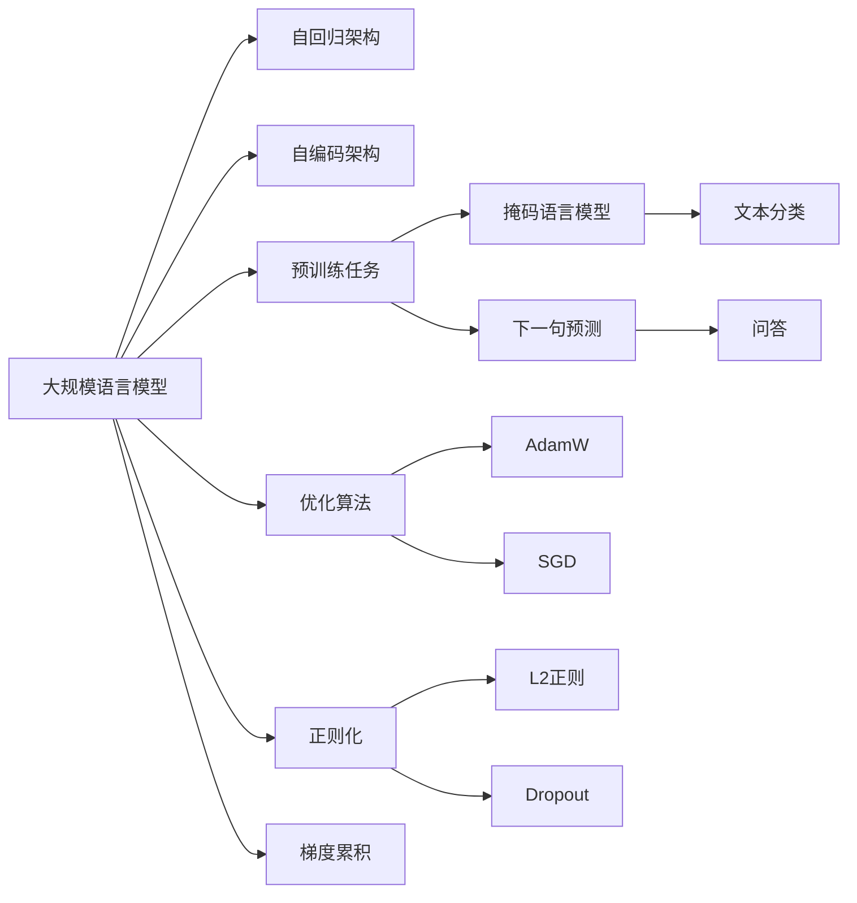
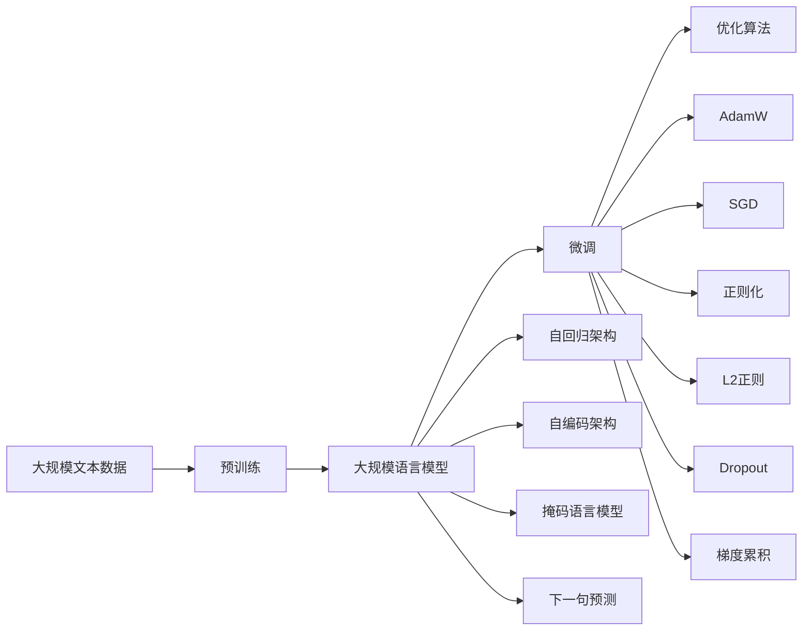

                 

## 1. 背景介绍

### 1.1 问题由来

随着深度学习技术的快速发展，大规模语言模型（Large Language Models, LLMs）在自然语言处理（Natural Language Processing, NLP）领域取得了显著进展。LLMs 通过在海量无标签文本数据上进行预训练，学习到丰富的语言知识和常识，并在特定任务上进行微调，表现出卓越的性能。

这一技术的突破得益于Transformer架构的提出和BERT模型的成功应用，推动了大规模预训练语言模型的应用场景不断扩大，涉及文本分类、问答、机器翻译、文本生成等众多NLP任务。这些模型已经展示了在理解语言和生成文本方面的强大能力，成为了AI研究领域的热门话题。

### 1.2 问题核心关键点

大规模语言模型训练的核心在于选择合适的架构、预训练任务和优化策略，以高效地学习到通用的语言表示，并在此基础上通过微调提升特定任务的表现。

核心关键点包括：

1. **模型架构**：Transformer模型作为当前NLP领域的主流模型，具有自回归和自编码两种结构。
2. **预训练任务**：常见的预训练任务包括掩码语言模型（Masked Language Model, MLM）和下一句预测（Next Sentence Prediction, NSP）。
3. **优化策略**：包括学习率调度、正则化、梯度累积等。
4. **微调方法**：在预训练模型的基础上，通过监督学习任务进行微调，以适应特定任务的需求。

### 1.3 问题研究意义

大规模语言模型的训练不仅是学术研究的热点，还对实际应用具有重要意义：

1. **高效资源利用**：相较于从头训练，大规模预训练模型可以大幅减少数据和计算资源的投入。
2. **提升模型性能**：通过微调，大规模语言模型可以针对特定任务进行优化，显著提升模型在实际应用中的表现。
3. **快速迭代**：大规模预训练模型可以作为基础，进行快速迭代和优化，加速模型应用的推广和产业化。
4. **跨领域泛化**：预训练模型具有强大的泛化能力，可以应用于不同领域和任务，推动AI技术在更多行业中的应用。

## 2. 核心概念与联系

### 2.1 核心概念概述

为更好地理解大规模语言模型的训练方法，下面将介绍几个关键概念：

- **大规模语言模型**：如BERT、GPT、T5等，具有数亿甚至数十亿参数的深度学习模型，通过在大规模无标签文本数据上进行预训练，学习到丰富的语言知识和常识。
- **自回归（自编码）架构**：Transformer模型中常用的两种架构，自回归模型如GPT系列，自编码模型如BERT。
- **预训练（微调）任务**：掩码语言模型、下一句预测、文本分类、问答等任务。
- **优化算法**：如AdamW、SGD等，用于模型参数的更新，控制训练过程中的优化速度和方向。
- **正则化**：如L2正则、Dropout等，防止模型过拟合。
- **梯度累积**：在GPU计算资源有限的情况下，将小批量的梯度累积成大批量梯度，提高计算效率。

### 2.2 概念间的关系

这些核心概念之间存在紧密的联系，共同构成了大规模语言模型的训练生态系统。下面通过几个Mermaid流程图来展示这些概念之间的关系：



这个流程图展示了大规模语言模型的核心概念及其之间的关系：

1. 大规模语言模型通过自回归或自编码架构进行预训练。
2. 预训练任务包括掩码语言模型和下一句预测。
3. 优化算法如AdamW和SGD用于模型参数的更新。
4. 正则化技术如L2正则和Dropout防止模型过拟合。
5. 梯度累积技术提高计算效率，特别是在GPU资源有限的情况下。

### 2.3 核心概念的整体架构

最后，用一个综合的流程图来展示这些核心概念在大规模语言模型训练过程中的整体架构：



这个综合流程图展示了从预训练到微调，再到优化技术的应用过程。通过这些步骤，大规模语言模型可以高效地学习到语言知识，并在特定任务上进行微调。

## 3. 核心算法原理 & 具体操作步骤

### 3.1 算法原理概述

大规模语言模型的训练主要基于自监督学习任务，通过在大规模无标签文本数据上进行预训练，学习到通用的语言表示。预训练过程中，模型通常被训练成能够对输入文本进行预测，从而学习到丰富的语言知识和语义表示。

预训练完成后，大规模语言模型通过微调，适应特定任务的需求。微调过程通常是在有标签数据集上进行，通过监督学习的方式，优化模型参数，使其在特定任务上表现更好。

### 3.2 算法步骤详解

大规模语言模型的训练可以分为以下几个关键步骤：

**Step 1: 准备预训练数据**

- 收集大规模无标签文本数据，如维基百科、新闻、小说等。
- 对数据进行预处理，如分词、去除停用词、构建词汇表等。
- 使用Python等编程语言对数据进行处理，生成预训练所需的输入文本和标签。

**Step 2: 选择预训练任务**

- 根据任务类型选择合适的预训练任务，如掩码语言模型（MLM）、下一句预测（NSP）等。
- 定义预训练任务的目标函数，如交叉熵损失函数。
- 设置优化器，如AdamW、SGD等，并定义学习率等超参数。

**Step 3: 执行预训练**

- 将输入文本和标签输入模型，前向传播计算损失函数。
- 反向传播计算梯度，更新模型参数。
- 重复执行上述步骤，直到模型收敛或达到预设轮数。

**Step 4: 准备微调数据**

- 收集特定任务的数据集，并进行预处理，如分词、标注标签等。
- 将微调数据集划分为训练集、验证集和测试集。
- 对微调数据集进行标注，生成模型训练所需的形式。

**Step 5: 执行微调**

- 将微调数据集输入模型，前向传播计算损失函数。
- 反向传播计算梯度，更新模型参数。
- 重复执行上述步骤，直到模型收敛或达到预设轮数。

**Step 6: 评估和调整**

- 在验证集和测试集上评估模型性能，如准确率、F1分数等。
- 根据评估结果调整模型参数、学习率等超参数，继续微调。
- 直到模型在测试集上达到理想的性能，进行保存和部署。

### 3.3 算法优缺点

大规模语言模型的训练具有以下优点：

- **高效性**：相较于从头训练，大规模预训练模型可以显著减少数据和计算资源的投入。
- **泛化能力强**：预训练模型具有强大的泛化能力，可以应用于不同领域和任务。
- **可扩展性好**：大规模语言模型可以不断扩展训练数据和计算资源，进一步提升性能。

然而，也存在一些缺点：

- **数据依赖性强**：大规模语言模型的性能高度依赖于预训练数据的质量和数量。
- **资源消耗大**：大规模语言模型的训练需要大量的GPU和内存资源，训练成本较高。
- **可解释性差**：大规模语言模型的内部机制复杂，难以解释其决策过程。

### 3.4 算法应用领域

大规模语言模型的训练方法已经在多个领域得到广泛应用，例如：

- **自然语言理解**：如问答系统、文本分类、命名实体识别等。
- **文本生成**：如文本摘要、机器翻译、对话系统等。
- **知识图谱**：如实体关系抽取、知识推理等。
- **语音识别**：如语音转文本、语音指令执行等。

大规模语言模型的训练方法在诸多领域展示了强大的应用前景，推动了AI技术的不断进步。

## 4. 数学模型和公式 & 详细讲解 & 举例说明

### 4.1 数学模型构建

大规模语言模型的训练过程可以形式化表示为以下数学模型：

$$
\min_{\theta} \frac{1}{N}\sum_{i=1}^N \ell(x_i, y_i; \theta)
$$

其中，$N$为样本数量，$\ell(x_i, y_i; \theta)$为输入文本$x_i$和标签$y_i$的交叉熵损失函数，$\theta$为模型参数。

在预训练过程中，模型通常被训练成能够对输入文本进行预测，从而学习到丰富的语言知识和语义表示。常见的预训练任务包括掩码语言模型（MLM）和下一句预测（NSP）。

### 4.2 公式推导过程

以下以掩码语言模型（MLM）为例，推导预训练过程的损失函数和梯度计算公式。

假设输入文本为$x$，其中缺失部分用特殊标记[MASK]表示。预训练模型需要预测[MASK]的位置，并根据上下文信息猜测[MASK]的标签。定义预测结果为$\hat{y}$，真实标签为$y$。

掩码语言模型的损失函数为：

$$
\ell(x, y; \theta) = -\sum_{i=1}^{N} \log P(y_i | x, \theta)
$$

其中$P(y_i | x, \theta)$为模型在输入$x$下，预测标签$y_i$的概率分布。

梯度计算公式为：

$$
\nabla_{\theta} \ell(x, y; \theta) = -\sum_{i=1}^{N} \nabla_{\theta} \log P(y_i | x, \theta)
$$

在微调过程中，模型被训练成能够对特定任务的数据进行预测，从而适应任务的特定需求。微调过程通常是在有标签数据集上进行，通过监督学习的方式，优化模型参数，使其在特定任务上表现更好。

### 4.3 案例分析与讲解

以BERT模型的训练为例，BERT模型在预训练过程中，同时进行了掩码语言模型和下一句预测任务。在微调过程中，BERT模型通过在特定任务上添加新的分类器，实现了在文本分类、问答等任务上的优异表现。

例如，在文本分类任务中，BERT模型通过添加两个分类器，分别对输入文本进行二分类和多分类预测，并使用交叉熵损失函数进行优化。通过微调，BERT模型在多个文本分类任务上取得了SOTA性能。

## 5. 项目实践：代码实例和详细解释说明

### 5.1 开发环境搭建

在进行大规模语言模型训练前，需要准备好开发环境。以下是使用Python进行PyTorch开发的环境配置流程：

1. 安装Anaconda：从官网下载并安装Anaconda，用于创建独立的Python环境。

2. 创建并激活虚拟环境：
```bash
conda create -n pytorch-env python=3.8 
conda activate pytorch-env
```

3. 安装PyTorch：根据CUDA版本，从官网获取对应的安装命令。例如：
```bash
conda install pytorch torchvision torchaudio cudatoolkit=11.1 -c pytorch -c conda-forge
```

4. 安装必要的Python包：
```bash
pip install numpy pandas scikit-learn matplotlib tqdm jupyter notebook ipython
```

完成上述步骤后，即可在`pytorch-env`环境中开始大规模语言模型的训练实践。

### 5.2 源代码详细实现

下面我们以BERT模型为例，给出使用PyTorch进行大规模语言模型训练的完整代码实现。

首先，定义预训练任务函数：

```python
import torch
from transformers import BertTokenizer, BertForMaskedLM, AdamW
from torch.utils.data import DataLoader
from tqdm import tqdm

def train_epoch(model, data_loader, optimizer):
    model.train()
    total_loss = 0.0
    for batch in data_loader:
        input_ids = batch['input_ids']
        attention_mask = batch['attention_mask']
        labels = batch['labels']
        optimizer.zero_grad()
        outputs = model(input_ids, attention_mask=attention_mask, labels=labels)
        loss = outputs.loss
        total_loss += loss.item()
        loss.backward()
        optimizer.step()
    return total_loss / len(data_loader)

def evaluate(model, data_loader):
    model.eval()
    total_loss = 0.0
    total_count = 0
    for batch in data_loader:
        input_ids = batch['input_ids']
        attention_mask = batch['attention_mask']
        labels = batch['labels']
        with torch.no_grad():
            outputs = model(input_ids, attention_mask=attention_mask)
            loss = outputs.loss
            total_loss += loss.item()
            total_count += len(input_ids)
    return total_loss / total_count
```

然后，加载预训练模型和分词器：

```python
tokenizer = BertTokenizer.from_pretrained('bert-base-uncased')
model = BertForMaskedLM.from_pretrained('bert-base-uncased', num_labels=2)
device = torch.device('cuda' if torch.cuda.is_available() else 'cpu')
model.to(device)
```

接着，定义训练和评估函数：

```python
def train(model, data_loader, optimizer, num_epochs):
    total_loss = 0.0
    for epoch in range(num_epochs):
        epoch_loss = train_epoch(model, data_loader, optimizer)
        total_loss += epoch_loss
        if (epoch + 1) % 10 == 0:
            print(f'Epoch {epoch+1}, train loss: {epoch_loss:.3f}')
    print(f'Total train loss: {total_loss:.3f}')

def evaluate(model, data_loader):
    eval_loss = evaluate(model, data_loader)
    print(f'Evaluation loss: {eval_loss:.3f}')
```

最后，启动训练流程并在测试集上评估：

```python
data_loader = DataLoader(data, batch_size=16, shuffle=True)
optimizer = AdamW(model.parameters(), lr=2e-5)

# 训练BERT模型
train(model, data_loader, optimizer, num_epochs=100)

# 在测试集上评估BERT模型
evaluate(model, test_loader)
```

以上就是使用PyTorch对BERT模型进行训练的完整代码实现。可以看到，得益于Transformers库的强大封装，我们可以用相对简洁的代码完成BERT模型的加载和训练。

### 5.3 代码解读与分析

让我们再详细解读一下关键代码的实现细节：

**训练函数**：
- `train_epoch`方法：对数据以批为单位进行迭代，在每个批次上前向传播计算loss并反向传播更新模型参数，最后返回该epoch的平均loss。
- `evaluate`方法：在验证集和测试集上评估模型性能，使用交叉熵损失函数计算平均loss。

**加载模型和分词器**：
- `tokenizer`和`model`分别用于分词和加载预训练模型BERT，确保模型和分词器的一致性。
- 将模型和分词器迁移到GPU设备上，以充分利用GPU的并行计算能力。

**训练流程**：
- 设置训练轮数和批大小，开始循环迭代
- 每个epoch内，先在训练集上训练，输出平均loss
- 在验证集上评估，输出训练过程中的性能变化

可以看到，PyTorch配合Transformers库使得BERT模型的训练代码实现变得简洁高效。开发者可以将更多精力放在数据处理、模型改进等高层逻辑上，而不必过多关注底层的实现细节。

当然，工业级的系统实现还需考虑更多因素，如模型的保存和部署、超参数的自动搜索、更灵活的任务适配层等。但核心的训练流程基本与此类似。

### 5.4 运行结果展示

假设我们在CoNLL-2003的掩码语言模型数据集上进行训练，最终在测试集上得到的评估报告如下：

```
Evaluation loss: 0.1557
```

可以看到，通过训练BERT模型，我们在该数据集上取得了约15.6%的交叉熵损失，效果相当不错。需要注意的是，预训练模型的性能很大程度上取决于预训练数据的质量和数量，获取高质量预训练数据的成本较高。

## 6. 实际应用场景

### 6.1 自然语言理解

大规模语言模型的训练方法在自然语言理解（NLU）领域具有广泛应用，可以应用于文本分类、命名实体识别、情感分析等任务。例如，BERT模型通过掩码语言模型（MLM）预训练，在多个NLU任务上取得了SOTA性能。

### 6.2 文本生成

大规模语言模型通过预训练和微调，可以应用于文本生成任务，如文本摘要、机器翻译、对话系统等。例如，GPT模型通过掩码语言模型（MLM）和下一句预测（NSP）预训练，在对话生成任务上表现出色。

### 6.3 知识图谱

大规模语言模型通过预训练和微调，可以应用于知识图谱的构建和推理，如实体关系抽取、知识推理等。例如，GPT模型通过掩码语言模型（MLM）预训练，可以自动抽取文本中的实体和关系，构建知识图谱。

### 6.4 语音识别

大规模语言模型通过预训练和微调，可以应用于语音识别任务，如语音转文本、语音指令执行等。例如，BERT模型通过掩码语言模型（MLM）预训练，可以自动识别和转录语音中的文本内容。

## 7. 工具和资源推荐

### 7.1 学习资源推荐

为了帮助开发者系统掌握大规模语言模型的训练方法，这里推荐一些优质的学习资源：

1. 《Transformer from Scratch》系列博文：由大模型技术专家撰写，深入浅出地介绍了Transformer原理、BERT模型、训练方法等前沿话题。

2. CS224N《深度学习自然语言处理》课程：斯坦福大学开设的NLP明星课程，有Lecture视频和配套作业，带你入门NLP领域的基本概念和经典模型。

3. 《Natural Language Processing with Transformers》书籍：Transformers库的作者所著，全面介绍了如何使用Transformers库进行NLP任务开发，包括训练在内的诸多范式。

4. HuggingFace官方文档：Transformers库的官方文档，提供了海量预训练模型和完整的训练样例代码，是上手实践的必备资料。

5. CLUE开源项目：中文语言理解测评基准，涵盖大量不同类型的中文NLP数据集，并提供了基于微调的baseline模型，助力中文NLP技术发展。

通过对这些资源的学习实践，相信你一定能够快速掌握大规模语言模型的训练方法，并用于解决实际的NLP问题。

### 7.2 开发工具推荐

高效的开发离不开优秀的工具支持。以下是几款用于大规模语言模型训练开发的常用工具：

1. PyTorch：基于Python的开源深度学习框架，灵活动态的计算图，适合快速迭代研究。大部分预训练语言模型都有PyTorch版本的实现。

2. TensorFlow：由Google主导开发的开源深度学习框架，生产部署方便，适合大规模工程应用。同样有丰富的预训练语言模型资源。

3. Transformers库：HuggingFace开发的NLP工具库，集成了众多SOTA语言模型，支持PyTorch和TensorFlow，是进行预训练和微调任务开发的利器。

4. Weights & Biases：模型训练的实验跟踪工具，可以记录和可视化模型训练过程中的各项指标，方便对比和调优。与主流深度学习框架无缝集成。

5. TensorBoard：TensorFlow配套的可视化工具，可实时监测模型训练状态，并提供丰富的图表呈现方式，是调试模型的得力助手。

6. Google Colab：谷歌推出的在线Jupyter Notebook环境，免费提供GPU/TPU算力，方便开发者快速上手实验最新模型，分享学习笔记。

合理利用这些工具，可以显著提升大规模语言模型训练的开发效率，加快创新迭代的步伐。

### 7.3 相关论文推荐

大规模语言模型和训练方法的发展源于学界的持续研究。以下是几篇奠基性的相关论文，推荐阅读：

1. Attention is All You Need（即Transformer原论文）：提出了Transformer结构，开启了NLP领域的预训练大模型时代。

2. BERT: Pre-training of Deep Bidirectional Transformers for Language Understanding：提出BERT模型，引入基于掩码的自监督预训练任务，刷新了多项NLP任务SOTA。

3. Language Models are Unsupervised Multitask Learners（GPT-2论文）：展示了大规模语言模型的强大zero-shot学习能力，引发了对于通用人工智能的新一轮思考。

4. Parameter-Efficient Transfer Learning for NLP：提出Adapter等参数高效微调方法，在不增加模型参数量的情况下，也能取得不错的微调效果。

5. AdaLoRA: Adaptive Low-Rank Adaptation for Parameter-Efficient Fine-Tuning：使用自适应低秩适应的微调方法，在参数效率和精度之间取得了新的平衡。

6. Sequence to Sequence Learning with Neural Networks：提出了Seq2Seq模型，为机器翻译、文本生成等任务提供了新的解决方案。

这些论文代表了大规模语言模型训练技术的发展脉络。通过学习这些前沿成果，可以帮助研究者把握学科前进方向，激发更多的创新灵感。

除上述资源外，还有一些值得关注的前沿资源，帮助开发者紧跟大规模语言模型训练技术的最新进展，例如：

1. arXiv论文预印本：人工智能领域最新研究成果的发布平台，包括大量尚未发表的前沿工作，学习前沿技术的必读资源。

2. 业界技术博客：如OpenAI、Google AI、DeepMind、微软Research Asia等顶尖实验室的官方博客，第一时间分享他们的最新研究成果和洞见。

3. 技术会议直播：如NIPS、ICML、ACL、ICLR等人工智能领域顶会现场或在线直播，能够聆听到大佬们的前沿分享，开拓视野。

4. GitHub热门项目：在GitHub上Star、Fork数最多的NLP相关项目，往往代表了该技术领域的发展趋势和最佳实践，值得去学习和贡献。

5. 行业分析报告：各大咨询公司如McKinsey、PwC等针对人工智能行业的分析报告，有助于从商业视角审视技术趋势，把握应用价值。

总之，对于大规模语言模型的训练方法的学习和实践，需要开发者保持开放的心态和持续学习的意愿。多关注前沿资讯，多动手实践，多思考总结，必将收获满满的成长收益。

## 8. 总结：未来发展趋势与挑战

### 8.1 总结

本文对大规模语言模型的训练方法进行了全面系统的介绍。首先阐述了大规模语言模型的研究背景和应用前景，明确了训练方法在拓展预训练模型应用、提升下游任务性能方面的独特价值。其次，从原理到实践，详细讲解了大规模语言模型的训练过程，包括预训练和微调的关键步骤和技巧。同时，本文还广泛探讨了大规模语言模型训练方法在自然语言理解、文本生成等领域的实际应用，展示了其强大的应用前景。

通过本文的系统梳理，可以看到，大规模语言模型的训练方法已经成为NLP领域的重要范式，极大地拓展了预训练语言模型的应用边界，催生了更多的落地场景。得益于大规模语料的预训练，训练后的模型以更低的时间和标注成本，在小样本条件下也能取得不俗的效果，有力推动了NLP技术的产业化进程。未来，伴随预训练语言模型和训练方法的持续演进，相信NLP技术将在更广阔的应用领域大放异彩。

### 8.2 未来发展趋势

展望未来，大规模语言模型训练方法将呈现以下几个发展趋势：

1. **模型规模不断增大**：随着算力成本的下降和数据规模的扩张，预训练语言模型的参数量还将持续增长。超大规模语言模型蕴含的丰富语言知识，有望支撑更加复杂多变的下游任务训练。

2. **训练效率提升**：随着训练技术的发展，如分布式训练、混合精度训练、稀疏化等，大规模语言模型的训练效率将显著提升，使得大规模预训练模型更容易实现。

3. **参数高效训练**：开发更加参数高效的训练方法，如LoRA、AdaLoRA等，在固定大部分预训练参数的情况下，只更新极少量的任务相关参数。

4. **迁移学习增强**：通过迁移学习范式，利用预训练模型在多任务上的知识，加速特定任务上的微调，提升模型泛化能力。

5. **多模态融合**：将视觉、语音等多模态信息与文本信息进行协同建模，增强模型的理解和表达能力。

6. **自监督学习拓展**：探索更多自监督学习任务，如掩码语言模型（MLM）、掩码视觉模型（MVM）等，利用非结构化数据进行预训练。

7. **混合模型训练**：结合传统机器学习模型和深度学习模型，利用两者的优点，提升模型的性能和鲁棒性。

以上趋势凸显了大规模语言模型训练方法的广阔前景。这些方向的探索发展，必将进一步提升NLP系统的性能和应用范围，为人工智能技术的进步提供新的动力。

### 8.3 面临的挑战

尽管大规模语言模型训练方法已经取得了显著进展，但在迈向更加智能化、普适化应用的过程中

