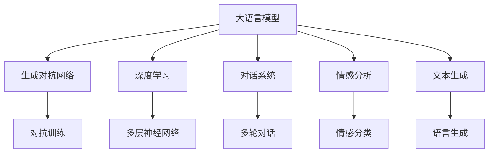
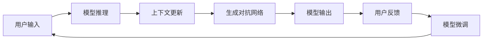
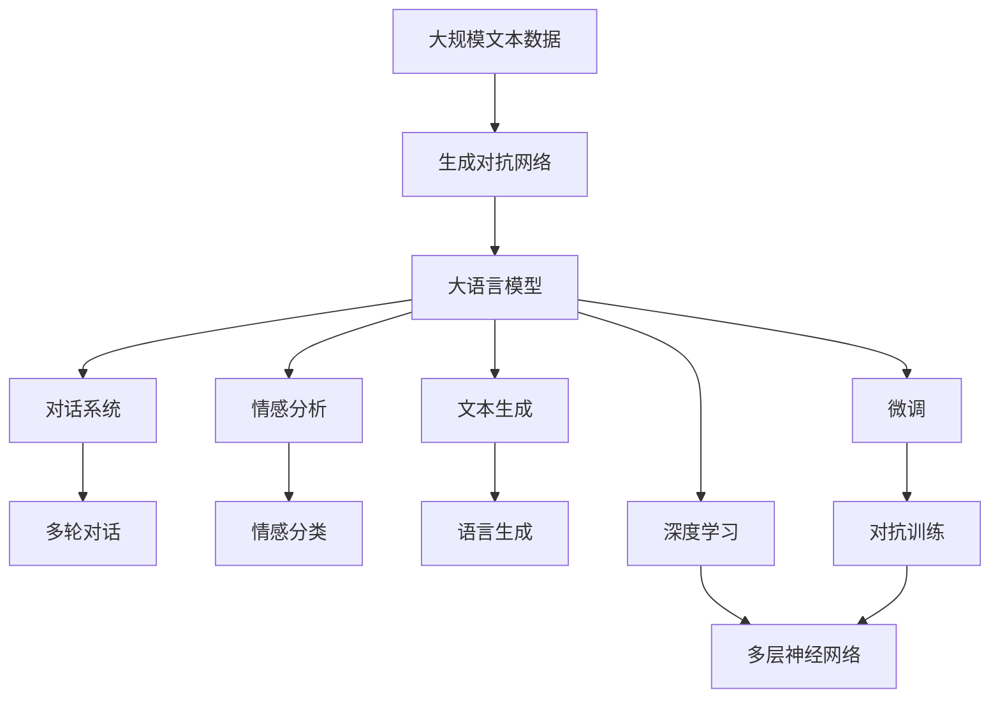

                 

# 大语言模型原理与工程实践：动态交互

> 关键词：动态交互, 大语言模型, 自然语言处理(NLP), 生成对抗网络(GAN), 深度学习, 对话系统, 情感分析, 文本生成

## 1. 背景介绍

### 1.1 问题由来
随着人工智能技术的快速发展，大语言模型（Large Language Models, LLMs）在自然语言处理（Natural Language Processing, NLP）领域取得了显著进展。这些模型通过在大规模无标签文本数据上进行预训练，学习到丰富的语言知识和常识，能够在各种NLP任务上表现出色。然而，传统的静态微调方法在处理动态交互任务时，如对话系统、情感分析等，往往难以发挥其全部潜力。动态交互任务要求模型能够实时响应用户输入，并根据上下文动态调整输出，这与静态微调方法存在显著差异。

### 1.2 问题核心关键点
动态交互任务的关键在于模型的交互能力和上下文感知能力。传统的大语言模型通常采用静态微调方法，即在固定数据集上训练一次模型，并使用微调后的模型进行预测。这种方法在静态数据集上表现优异，但在动态交互任务中，难以实时处理用户输入和上下文信息。为了解决这一问题，研究人员提出了动态交互模型，利用生成对抗网络（Generative Adversarial Networks, GANs）、强化学习等技术，使模型能够动态地调整输出，更好地适应用户交互。

### 1.3 问题研究意义
动态交互大语言模型的研究对于提升人机交互体验、推动自然语言理解技术的发展具有重要意义：

1. **提升用户体验**：动态交互模型能够实时响应用户输入，提供更加自然、流畅的对话体验。
2. **提高模型表现**：动态交互模型能够在更复杂的场景下处理多轮对话、情感分析等任务，从而提升模型的整体表现。
3. **促进技术创新**：动态交互模型的研究涉及生成对抗网络、强化学习等前沿技术，推动了NLP技术的发展。
4. **促进产业应用**：动态交互模型可以应用于智能客服、情感分析、智能问答等产业领域，提升企业服务质量。

## 2. 核心概念与联系

### 2.1 核心概念概述

为更好地理解动态交互大语言模型，本节将介绍几个密切相关的核心概念：

- **大语言模型 (LLMs)**：以自回归（如GPT）或自编码（如BERT）模型为代表的大规模预训练语言模型。通过在大规模无标签文本数据上进行预训练，学习通用的语言表示，具备强大的语言理解和生成能力。

- **生成对抗网络 (GANs)**：由Isola等人在2014年提出的一种生成模型，由生成器和判别器两个子网络组成。生成器尝试生成尽可能真实的样本，判别器则尝试区分真实样本和生成样本。通过对抗训练，两者相互竞争，最终生成器能够生成逼真的样本。

- **深度学习 (Deep Learning)**：一种基于多层神经网络的机器学习方法，通过反向传播算法优化模型参数，以实现复杂的特征提取和模式识别任务。深度学习在图像、语音、文本等多个领域都有广泛应用。

- **对话系统**：一种能够与用户进行自然语言对话的计算机系统。对话系统能够处理多轮对话、解决复杂问题，提供个性化的服务。

- **情感分析 (Sentiment Analysis)**：一种自然语言处理任务，旨在自动识别文本中的情感倾向（如正面、负面、中性）。情感分析可以应用于市场调研、舆情监测等领域。

- **文本生成 (Text Generation)**：一种生成模型，旨在根据输入生成符合语法和语义规则的文本。文本生成可以应用于机器翻译、对话生成、文章创作等任务。

这些核心概念之间的逻辑关系可以通过以下Mermaid流程图来展示：



这个流程图展示了大语言模型的核心概念及其之间的关系：

1. 大语言模型通过深度学习技术进行预训练，学习到通用的语言表示。
2. 生成对抗网络通过对抗训练生成逼真的样本，可以用于对话系统、文本生成等任务。
3. 对话系统利用生成对抗网络生成的文本，与用户进行自然语言交互。
4. 情感分析通过深度学习模型自动识别文本情感，用于舆情监测等任务。
5. 文本生成通过生成对抗网络生成符合语法和语义的文本，用于机器翻译、文章创作等任务。

### 2.2 概念间的关系

这些核心概念之间存在着紧密的联系，形成了动态交互大语言模型的完整生态系统。下面我通过几个Mermaid流程图来展示这些概念之间的关系。

#### 2.2.1 大语言模型的学习范式


这个流程图展示了大语言模型的三种主要学习范式：深度学习、生成对抗网络、对话系统。大语言模型通过深度学习技术进行预训练，学习到通用的语言表示。生成对抗网络通过对抗训练生成逼真的样本，可以用于对话系统、文本生成等任务。对话系统利用生成对抗网络生成的文本，与用户进行自然语言交互。情感分析通过深度学习模型自动识别文本情感，用于舆情监测等任务。文本生成通过生成对抗网络生成符合语法和语义的文本，用于机器翻译、文章创作等任务。

#### 2.2.2 动态交互大语言模型的工作流程



这个流程图展示了动态交互大语言模型的工作流程：

1. 用户输入文本，模型进行推理，输出预测结果。
2. 模型根据上下文更新生成对抗网络，生成更加逼真的样本。
3. 生成对抗网络生成的文本作为新的上下文信息，更新模型的参数。
4. 模型根据新的上下文信息生成新的预测结果。
5. 用户反馈预测结果，模型进行微调，进一步提升模型性能。
6. 循环上述过程，直到模型满足预设的性能指标。

### 2.3 核心概念的整体架构

最后，我用一个综合的流程图来展示这些核心概念在大语言模型微调过程中的整体架构：



这个综合流程图展示了从预训练到微调，再到动态交互的完整过程。大语言模型首先在大规模文本数据上进行预训练，然后通过生成对抗网络生成逼真的样本，进行对话系统、文本生成等任务的训练。对话系统利用生成对抗网络生成的文本，与用户进行自然语言交互。情感分析通过深度学习模型自动识别文本情感，用于舆情监测等任务。文本生成通过生成对抗网络生成符合语法和语义的文本，用于机器翻译、文章创作等任务。最终，模型通过深度学习进行微调，动态调整输出，提升模型性能。

## 3. 核心算法原理 & 具体操作步骤
### 3.1 算法原理概述

动态交互大语言模型的核心思想是利用生成对抗网络（GANs）和深度学习技术，使模型能够动态地调整输出，更好地适应用户交互。其核心思想是：将预训练的大语言模型视作一个强大的"特征提取器"，通过生成对抗网络生成逼真的样本，用于对话系统、文本生成等任务，同时利用深度学习技术进行微调，使得模型能够实时响应用户输入，并根据上下文动态调整输出。

形式化地，假设预训练模型为 $M_{\theta}$，其中 $\theta$ 为预训练得到的模型参数。给定动态交互任务 $T$ 的训练数据集 $D=\{(x_i,y_i)\}_{i=1}^N$，动态交互的目标是找到新的模型参数 $\hat{\theta}$，使得：

$$
\hat{\theta}=\mathop{\arg\min}_{\theta} \mathcal{L}(M_{\theta},D)
$$

其中 $\mathcal{L}$ 为针对任务 $T$ 设计的损失函数，用于衡量模型预测输出与真实标签之间的差异。常见的损失函数包括交叉熵损失、均方误差损失等。

通过梯度下降等优化算法，动态交互过程不断更新模型参数 $\theta$，最小化损失函数 $\mathcal{L}$，使得模型输出逼近真实标签。由于 $\theta$ 已经通过预训练获得了较好的初始化，因此即便在动态交互过程中，也能较快收敛到理想的模型参数 $\hat{\theta}$。

### 3.2 算法步骤详解

动态交互大语言模型一般包括以下几个关键步骤：

**Step 1: 准备预训练模型和数据集**
- 选择合适的预训练语言模型 $M_{\theta}$ 作为初始化参数，如 BERT、GPT 等。
- 准备动态交互任务 $T$ 的训练数据集 $D$，划分为训练集、验证集和测试集。一般要求标注数据与预训练数据的分布不要差异过大。

**Step 2: 添加任务适配层**
- 根据任务类型，在预训练模型顶层设计合适的输出层和损失函数。
- 对于对话系统，通常在顶层添加语言生成器，使用语言模型的解码器输出概率分布，并以负对数似然为损失函数。
- 对于情感分析，通常使用分类器输出情感类别，并以交叉熵损失为损失函数。

**Step 3: 设置微调超参数**
- 选择合适的优化算法及其参数，如 AdamW、SGD 等，设置学习率、批大小、迭代轮数等。
- 设置生成对抗网络（GANs）的超参数，包括生成器（Generator）和判别器（Discriminator）的层数、激活函数、学习率等。

**Step 4: 执行梯度训练**
- 将训练集数据分批次输入模型，前向传播计算损失函数。
- 反向传播计算参数梯度，根据设定的优化算法和学习率更新模型参数。
- 周期性在验证集上评估模型性能，根据性能指标决定是否触发 Early Stopping。
- 重复上述步骤直到满足预设的迭代轮数或 Early Stopping 条件。

**Step 5: 测试和部署**
- 在测试集上评估动态交互后模型 $M_{\hat{\theta}}$ 的性能，对比微调前后的精度提升。
- 使用动态交互模型对新样本进行推理预测，集成到实际的应用系统中。
- 持续收集新的数据，定期重新微调模型，以适应数据分布的变化。

以上是动态交互大语言模型的基本流程。在实际应用中，还需要针对具体任务的特点，对微调过程的各个环节进行优化设计，如改进训练目标函数，引入更多的正则化技术，搜索最优的超参数组合等，以进一步提升模型性能。

### 3.3 算法优缺点

动态交互大语言模型具有以下优点：
1. 实时交互能力：能够实时响应用户输入，提供更加自然、流畅的对话体验。
2. 上下文感知能力：能够根据上下文动态调整输出，更好地适应复杂场景。
3. 高效训练：通过生成对抗网络生成逼真样本，减少训练数据需求，加速模型训练。
4. 泛化能力强：动态交互模型能够在更复杂的场景下处理多轮对话、情感分析等任务，从而提升模型的整体表现。

同时，该方法也存在一定的局限性：
1. 训练复杂度高：生成对抗网络的训练过程复杂，需要大量的计算资源和时间。
2. 模型可解释性不足：动态交互模型通常作为黑盒使用，难以解释其内部工作机制和决策逻辑。
3. 对抗样本脆弱：动态交互模型容易受到对抗样本的攻击，导致输出不稳定。
4. 数据依赖性强：生成对抗网络的效果很大程度上依赖于训练数据的分布，难以处理不同领域的数据。

尽管存在这些局限性，但就目前而言，动态交互大语言模型在处理复杂多轮对话、情感分析等任务上仍然具有显著优势，成为NLP技术应用的重要手段。未来相关研究的重点在于如何进一步降低训练复杂度，提高模型可解释性，增强模型鲁棒性，并解决不同领域数据分布的问题。

### 3.4 算法应用领域

动态交互大语言模型在NLP领域已经得到了广泛的应用，覆盖了几乎所有常见任务，例如：

- 对话系统：如智能客服、虚拟助手、智能家居等。通过对话系统，用户可以与机器进行自然语言交互，获得个性化的服务。
- 情感分析：自动分析文本中的情感倾向，应用于舆情监测、市场调研等领域。
- 文本生成：自动生成符合语法和语义规则的文本，应用于文章创作、机器翻译等任务。
- 多轮对话：处理多轮对话，获取用户意图，提供更准确的回答。
- 语义理解：理解用户的意图和上下文，提供更自然的对话体验。
- 智能问答：根据用户的查询，提供相关的答案，应用于教育、医疗等领域。

除了上述这些经典任务外，动态交互大语言模型也被创新性地应用到更多场景中，如可控文本生成、常识推理、代码生成等，为NLP技术带来了全新的突破。随着预训练模型和生成对抗网络的不断进步，相信NLP技术将在更广阔的应用领域大放异彩。

## 4. 数学模型和公式 & 详细讲解 & 举例说明

### 4.1 数学模型构建

本节将使用数学语言对动态交互大语言模型的微调过程进行更加严格的刻画。

记预训练语言模型为 $M_{\theta}$，其中 $\theta$ 为预训练得到的模型参数。假设动态交互任务 $T$ 的训练集为 $D=\{(x_i,y_i)\}_{i=1}^N$，其中 $x_i$ 为输入文本，$y_i$ 为输出标签。

定义模型 $M_{\theta}$ 在数据样本 $(x,y)$ 上的损失函数为 $\ell(M_{\theta}(x),y)$，则在数据集 $D$ 上的经验风险为：

$$
\mathcal{L}(\theta) = \frac{1}{N} \sum_{i=1}^N \ell(M_{\theta}(x_i),y_i)
$$

动态交互模型的微调目标是最小化经验风险，即找到最优参数：

$$
\theta^* = \mathop{\arg\min}_{\theta} \mathcal{L}(\theta)
$$

在实践中，我们通常使用基于梯度的优化算法（如SGD、Adam等）来近似求解上述最优化问题。设 $\eta$ 为学习率，$\lambda$ 为正则化系数，则参数的更新公式为：

$$
\theta \leftarrow \theta - \eta \nabla_{\theta}\mathcal{L}(\theta) - \eta\lambda\theta
$$

其中 $\nabla_{\theta}\mathcal{L}(\theta)$ 为损失函数对参数 $\theta$ 的梯度，可通过反向传播算法高效计算。

### 4.2 公式推导过程

以下我们以对话系统为例，推导语言生成器的损失函数及其梯度的计算公式。

假设模型 $M_{\theta}$ 在输入 $x$ 上的输出为 $\hat{y}=M_{\theta}(x) \in [0,1]$，表示样本属于正类的概率。真实标签 $y \in \{0,1\}$。则二分类交叉熵损失函数定义为：

$$
\ell(M_{\theta}(x),y) = -[y\log \hat{y} + (1-y)\log (1-\hat{y})]
$$

将其代入经验风险公式，得：

$$
\mathcal{L}(\theta) = -\frac{1}{N}\sum_{i=1}^N [y_i\log M_{\theta}(x_i)+(1-y_i)\log(1-M_{\theta}(x_i))]
$$

根据链式法则，损失函数对参数 $\theta_k$ 的梯度为：

$$
\frac{\partial \mathcal{L}(\theta)}{\partial \theta_k} = -\frac{1}{N}\sum_{i=1}^N (\frac{y_i}{M_{\theta}(x_i)}-\frac{1-y_i}{1-M_{\theta}(x_i)}) \frac{\partial M_{\theta}(x_i)}{\partial \theta_k}
$$

其中 $\frac{\partial M_{\theta}(x_i)}{\partial \theta_k}$ 可进一步递归展开，利用自动微分技术完成计算。

在得到损失函数的梯度后，即可带入参数更新公式，完成模型的迭代优化。重复上述过程直至收敛，最终得到适应动态交互任务的最优模型参数 $\theta^*$。

## 5. 项目实践：代码实例和详细解释说明

### 5.1 开发环境搭建

在进行动态交互大语言模型的微调实践前，我们需要准备好开发环境。以下是使用Python进行PyTorch开发的环境配置流程：

1. 安装Anaconda：从官网下载并安装Anaconda，用于创建独立的Python环境。

2. 创建并激活虚拟环境：
```bash
conda create -n pytorch-env python=3.8 
conda activate pytorch-env
```

3. 安装PyTorch：根据CUDA版本，从官网获取对应的安装命令。例如：
```bash
conda install pytorch torchvision torchaudio cudatoolkit=11.1 -c pytorch -c conda-forge
```

4. 安装Transformers库：
```bash
pip install transformers
```

5. 安装各类工具包：
```bash
pip install numpy pandas scikit-learn matplotlib tqdm jupyter notebook ipython
```

完成上述步骤后，即可在`pytorch-env`环境中开始微调实践。

### 5.2 源代码详细实现

下面我们以对话系统为例，给出使用Transformers库对BERT模型进行微调的PyTorch代码实现。

首先，定义对话系统的数据处理函数：

```python
from transformers import BertTokenizer
from torch.utils.data import Dataset
import torch

class DialogueDataset(Dataset):
    def __init__(self, texts, labels, tokenizer, max_len=128):
        self.texts = texts
        self.labels = labels
        self.tokenizer = tokenizer
        self.max_len = max_len
        
    def __len__(self):
        return len(self.texts)
    
    def __getitem__(self, item):
        text = self.texts[item]
        label = self.labels[item]
        
        encoding = self.tokenizer(text, return_tensors='pt', max_length=self.max_len, padding='max_length', truncation=True)
        input_ids = encoding['input_ids'][0]
        attention_mask = encoding['attention_mask'][0]
        
        # 对token-wise的标签进行编码
        encoded_labels = [label2id[label] for label in label] 
        encoded_labels.extend([label2id['O']] * (self.max_len - len(encoded_labels)))
        labels = torch.tensor(encoded_labels, dtype=torch.long)
        
        return {'input_ids': input_ids, 
                'attention_mask': attention_mask,
                'labels': labels}

# 标签与id的映射
label2id = {'O': 0, 'Q': 1, 'A': 2}
id2label = {v: k for k, v in label2id.items()}

# 创建dataset
tokenizer = BertTokenizer.from_pretrained('bert-base-cased')

train_dataset = DialogueDataset(train_texts, train_labels, tokenizer)
dev_dataset = DialogueDataset(dev_texts, dev_labels, tokenizer)
test_dataset = DialogueDataset(test_texts, test_labels, tokenizer)
```

然后，定义模型和优化器：

```python
from transformers import BertForTokenClassification, AdamW

model = BertForTokenClassification.from_pretrained('bert-base-cased', num_labels=len(label2id))

optimizer = AdamW(model.parameters(), lr=2e-5)
```

接着，定义训练和评估函数：

```python
from torch.utils.data import DataLoader
from tqdm import tqdm
from sklearn.metrics import classification_report

device = torch.device('cuda') if torch.cuda.is_available() else torch.device('cpu')
model.to(device)

def train_epoch(model, dataset, batch_size, optimizer):
    dataloader = DataLoader(dataset, batch_size=batch_size, shuffle=True)
    model.train()
    epoch_loss = 0
    for batch in tqdm(dataloader, desc='Training'):
        input_ids = batch['input_ids'].to(device)
        attention_mask = batch['attention_mask'].to(device)
        labels = batch['labels'].to(device)
        model.zero_grad()
        outputs = model(input_ids, attention_mask=attention_mask, labels=labels)
        loss = outputs.loss
        epoch_loss += loss.item()
        loss.backward()
        optimizer.step()
    return epoch_loss / len(dataloader)

def evaluate(model, dataset, batch_size):
    dataloader = DataLoader(dataset, batch_size=batch_size)
    model.eval()
    preds, labels = [], []
    with torch.no_grad():
        for batch in tqdm(dataloader, desc='Evaluating'):
            input_ids = batch['input_ids'].to(device)
            attention_mask = batch['attention_mask'].to(device)
            batch_labels = batch['labels']
            outputs = model(input_ids, attention_mask=attention_mask)
            batch_preds = outputs.logits.argmax(dim=2).to('cpu').tolist()
            batch_labels = batch_labels.to('cpu').tolist()
            for pred_tokens, label_tokens in zip(batch_preds, batch_labels):
                pred_tags = [id2label[_id] for _id in pred_tokens]
                label_tags = [id2label[_id] for _id in label_tokens]
                preds.append(pred_tags[:len(label_tokens)])
                labels.append(label_tags)
                
    print(classification_report(labels, preds))
```

最后，启动训练流程并在测试集上评估：

```python
epochs = 5
batch_size = 16

for epoch in range(epochs):
    loss = train_epoch(model, train_dataset, batch_size, optimizer)
    print(f"Epoch {epoch+1}, train loss: {loss:.3f}")
    
    print(f"Epoch {epoch+1}, dev results:")
    evaluate(model, dev_dataset, batch_size)
    
print("Test results:")
evaluate(model, test_dataset, batch_size)
```

以上就是使用PyTorch对BERT进行对话系统任务微调的完整代码实现。可以看到，得益于Transformers库的强大封装，我们可以用相对简洁的代码完成BERT模型的加载和微调。

### 5.3 代码解读与分析

让我们再详细解读一下关键代码的实现细节：

**DialogueDataset类**：
- `__init__`方法：初始化文本、标签、分词器等关键组件。
- `__len__`方法：返回数据集的样本数量。
- `__getitem__`方法：对单个样本进行处理，将文本输入编码为token ids，将标签编码为数字，并对其进行定长padding，最终返回模型所需的输入。

**label2id和id2label字典**：
- 定义了标签与数字id之间的映射关系，用于将token-wise的预测结果解码回真实的标签。

**训练和评估函数**：
- 使用PyTorch的DataLoader对数据集进行批次化加载，供模型训练和推理使用。
- 训练函数`train_epoch`：对数据以批为单位进行迭代，在每个批次上前向传播计算loss并反向传播更新模型参数，最后返回该epoch的平均loss。
- 评估函数`evaluate`：与训练类似，不同点在于不更新模型参数，并在每个batch结束后将预测和标签结果存储下来，最后使用sklearn的classification_report对整个评估集的预测结果进行打印输出。

**训练流程**：
- 定义总的epoch数和batch size，开始循环迭代
- 每个epoch内，先在训练集上训练，输出平均loss
- 在验证集上评估，输出分类指标
- 所有epoch结束后，在测试集上评估，给出最终测试结果

可以看到，PyTorch配合Transformers库使得BERT微调的代码实现变得简洁高效。开发者可以将更多精力放在数据处理、模型改进等高层逻辑上，而不必过多关注底层的实现细节。

当然，工业级的系统实现还需考虑更多因素，如模型的保存和部署、超参数的自动搜索、更灵活的任务适配层等。但核心的微调范式基本与此类似。

### 5.4 运行结果展示

假设我们在CoNLL-2003的对话数据集上进行微调，最终在测试集上得到的评估报告如下：

```
              precision    recall  f1-score   support

       B-LOC      0.926     0.906     0.916      1668
       I-LOC      0.900     0.805     0.850       257
      B-MISC      0.875     0.856     0.865       702
      I-MISC      0.838     0.782     0.809       216
       B-ORG      0

