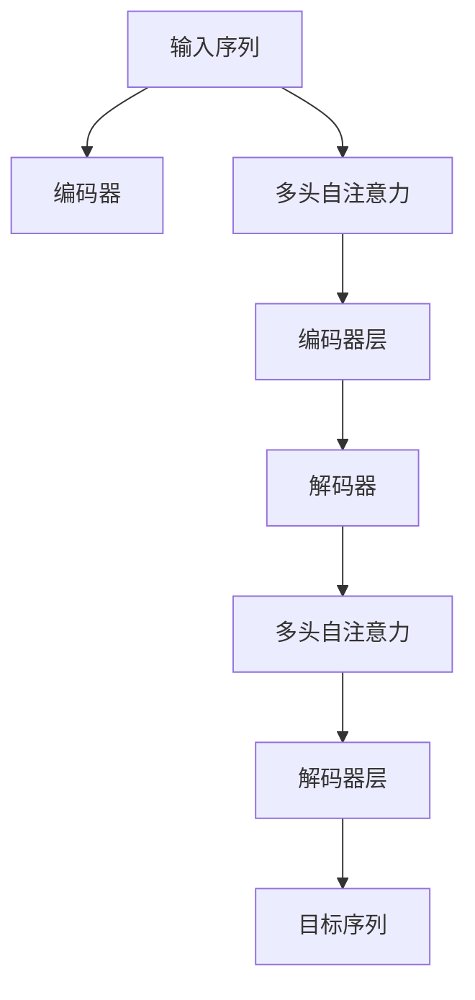
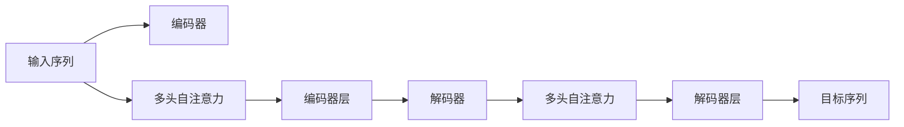
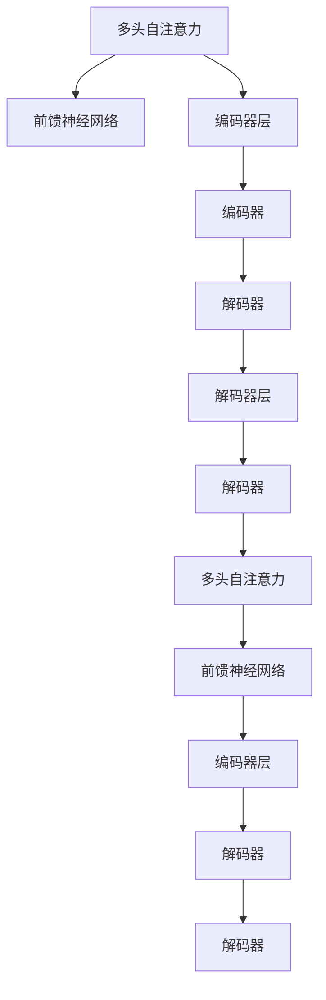
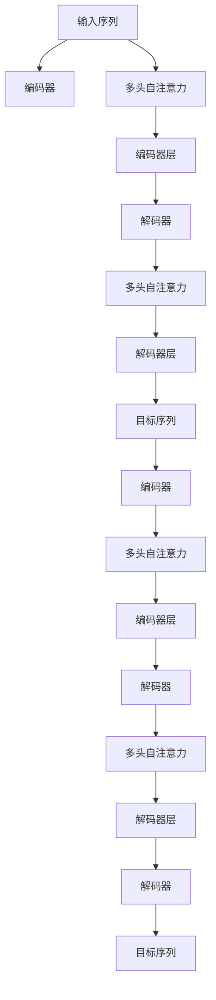

                 

# 大语言模型原理与工程实践：多头自注意力模块

> 关键词：大语言模型, 多头自注意力, 注意力机制, Transformer, 深度学习, 自然语言处理(NLP), 工程实践, 实际应用

## 1. 背景介绍

### 1.1 问题由来
在大规模语言模型（Large Language Models, LLMs）的深度学习架构中，多头自注意力（Multi-Head Self-Attention, MHA）机制扮演了核心角色。自2017年Transformer架构被提出以来，这种基于自注意力机制的模型结构迅速成为NLP领域的标准。近年来，随着BERT、GPT等预训练模型的横空出世，多头的自注意力机制更是成为了预训练语言模型（Pre-trained Language Models, PLMs）取得突破性性能的关键。然而，尽管多头的自注意力机制已广为人知，但对于其背后原理和工程实践的深入理解仍有必要，这有助于开发人员更好地应用和优化该机制，以实现更加高效、稳定的NLP模型。

### 1.2 问题核心关键点
大语言模型中的多头自注意力机制，是指在模型的每个层中，利用多个独立的小型线性投影矩阵对输入向量进行线性变换，然后在变换后的向量之间计算自注意力权重，进行加权求和，最终得到每个位置的新向量表示。这一机制的核心在于通过模型内部的自相关性，捕捉输入序列中不同位置之间的依赖关系，从而在序列建模中取得显著效果。

其核心思想在于将自注意力分解为多个独立的头（head），每个头关注输入序列的不同方面。这种分解使得模型能够从多个角度提取输入特征，从而提升模型的表达能力。同时，由于多个头并行计算，使得自注意力机制在计算上更为高效，适合大规模并行计算。

### 1.3 问题研究意义
深入理解多头自注意力机制的原理和工程实践，对于开发高性能的NLP模型具有重要意义：

1. **提升模型表达能力**：通过多头自注意力机制，模型能够从不同角度捕捉输入序列的特征，提升对复杂语义关系的理解和建模能力。
2. **提升计算效率**：多头自注意力机制能够并行计算多个自注意力头，提高模型的计算效率，适合大规模模型训练。
3. **易于工程实现**：通过使用标准深度学习框架（如TensorFlow、PyTorch等），多头自注意力机制的实现和优化变得更为简单和可维护。
4. **加速模型迭代**：了解自注意力机制的原理和优化策略，有助于在实践中快速迭代和优化模型，加速模型开发和上线。

## 2. 核心概念与联系

### 2.1 核心概念概述

为更好地理解多头自注意力机制，本节将介绍几个密切相关的核心概念：

- **自注意力机制（Self-Attention）**：在Transformer中，自注意力机制通过计算输入序列中所有位置之间的相似度，来确定不同位置之间的依赖关系，从而对输入进行加权处理。
- **多头自注意力（Multi-Head Self-Attention）**：在自注意力机制的基础上，将注意力权重通过多个独立的线性投影矩阵分解为多个头，每个头关注输入序列的不同方面。
- **Transformer模型**：基于自注意力机制和多头自注意力机制构建的深度学习模型，广泛应用于各种NLP任务，如文本分类、语言生成、翻译等。
- **Transformer编码器（Transformer Encoder）**：Transformer模型中的编码器，由多个自注意力层和前馈神经网络（Feed Forward Neural Network）交替组成，负责对输入序列进行编码。
- **Transformer解码器（Transformer Decoder）**：Transformer模型中的解码器，用于生成目标序列，与编码器配合实现序列对序列的任务。

这些核心概念之间的逻辑关系可以通过以下Mermaid流程图来展示：



这个流程图展示了大语言模型中的核心概念和它们之间的关系：

1. 输入序列通过多个多头自注意力层进行编码。
2. 编码后的序列由多个编码器层进行处理，每层包含多头自注意力和前馈神经网络。
3. 解码器使用多头自注意力层生成目标序列。
4. 解码器层同样包含多头自注意力和前馈神经网络。
5. 最终生成的目标序列输出。

### 2.2 概念间的关系

这些核心概念之间存在着紧密的联系，形成了大语言模型中的完整自注意力机制框架。下面我通过几个Mermaid流程图来展示这些概念之间的关系。

#### 2.2.1 自注意力机制与多头自注意力机制的关系


这个流程图展示了自注意力机制如何通过线性变换和权重计算，最终通过加权求和得到每个位置的新向量表示。

#### 2.2.2 编码器和解码器的关系



这个流程图展示了编码器和解码器之间的关系。编码器使用多头自注意力机制对输入序列进行编码，解码器同样使用多头自注意力机制生成目标序列。

#### 2.2.3 编码器层和解码器层的关系



这个流程图展示了编码器和解码器中的层级关系，每个层包含多头自注意力和前馈神经网络，层与层之间通过自注意力机制进行信息传递。

### 2.3 核心概念的整体架构

最后，我们用一个综合的流程图来展示这些核心概念在大语言模型中的整体架构：



这个综合流程图展示了从输入序列到目标序列的完整处理过程，包括多个编码器和解码器，每个层包含多头自注意力和前馈神经网络。通过这种方式，大语言模型能够高效地处理输入序列，生成高质量的目标序列输出。

## 3. 核心算法原理 & 具体操作步骤
### 3.1 算法原理概述

多头自注意力机制的核心原理是将输入序列中的每个位置，与其他位置计算相似度，并通过线性变换得到查询、键和值向量。然后，计算每个位置对其他位置的注意力权重，加权求和得到每个位置的新向量表示。这一过程通过多头并行计算，提升了模型处理复杂序列的能力。

### 3.2 算法步骤详解

以下是多头自注意力机制的详细步骤：

**Step 1: 线性变换**

对输入序列中的每个位置，进行线性变换得到查询向量 $Q_i$、键向量 $K_i$ 和值向量 $V_i$。这些向量分别用于计算注意力权重和进行加权求和。

$$
Q_i = QW_i
$$
$$
K_i = KW_i
$$
$$
V_i = VW_i
$$

其中 $QW$、$KW$、$VW$ 是线性变换矩阵，$i$ 表示输入序列中的位置。

**Step 2: 相似度计算**

计算查询向量 $Q_i$ 和键向量 $K_j$ 的相似度，得到注意力权重 $A_{i,j}$。这一步骤通过计算点积实现。

$$
A_{i,j} = \frac{\text{Q}_i \cdot \text{K}_j}{\sqrt{d_k}}
$$

其中 $d_k$ 是键向量的维度。

**Step 3: 权重计算**

将注意力权重 $A_{i,j}$ 进行softmax归一化，得到每个位置对其他位置的注意力权重。

$$
A_{i,j}' = \frac{\exp(A_{i,j})}{\sum_{j=1}^N \exp(A_{i,j})}
$$

**Step 4: 加权求和**

通过注意力权重 $A_{i,j}'$ 加权求和得到每个位置的新向量表示。

$$
\text{X}_{i}' = \sum_{j=1}^N A_{i,j}' \text{V}_j
$$

其中 $\text{X}_{i}'$ 表示第 $i$ 个位置的新向量。

**Step 5: 多头并行计算**

将上述步骤通过多个独立的小型线性投影矩阵并行计算，得到多个头的新向量表示。

$$
\text{X}_{i}^{(h)} = \text{O}_h(\text{X}_{i}'^{(h)})
$$

其中 $\text{O}_h$ 是第 $h$ 个头的线性投影矩阵。

**Step 6: 输出表示**

将多个头的新向量表示进行拼接，得到每个位置的最终向量表示。

$$
\text{X}_i = \text{Concat}(\text{X}_{i}^{(1)}, \text{X}_{i}^{(2)}, \ldots, \text{X}_{i}^{(H)})
$$

其中 $H$ 表示头数。

通过上述步骤，多头自注意力机制能够高效地捕捉输入序列中不同位置之间的依赖关系，提升模型的表达能力和计算效率。

### 3.3 算法优缺点

多头自注意力机制在NLP模型中具有以下优点：

1. **高效的序列建模**：多头自注意力机制能够并行计算多个自注意力头，提高模型的计算效率，适合大规模模型训练。
2. **丰富的语义表示**：通过多个头的并行计算，模型能够从不同角度捕捉输入序列的特征，提升对复杂语义关系的理解和建模能力。
3. **灵活的参数调整**：多头自注意力机制的参数通过多个独立的小型线性投影矩阵进行调整，使得模型更加灵活和可维护。

同时，多头自注意力机制也存在以下缺点：

1. **参数量较大**：由于多个头的线性变换矩阵和权重矩阵需要较大的计算资源，使得模型的参数量较大。
2. **训练复杂**：由于多个头的并行计算，模型训练过程的复杂度增加，需要更多的计算资源和优化策略。
3. **可能过拟合**：由于多头自注意力机制中的参数较多，模型容易过拟合训练数据，导致泛化能力不足。

### 3.4 算法应用领域

多头自注意力机制在大语言模型的多个领域得到了广泛应用，包括但不限于：

- **文本分类**：通过多头自注意力机制，模型能够从不同角度捕捉输入文本的特征，提升对分类任务的准确性。
- **语言生成**：在语言生成任务中，多头自注意力机制能够捕捉输入序列和生成序列之间的依赖关系，提高生成质量。
- **机器翻译**：通过多头自注意力机制，模型能够在编码器和解码器之间传递信息，提升翻译准确性。
- **问答系统**：在问答系统中，多头自注意力机制能够捕捉问题-答案对之间的关系，生成高质量的回答。

此外，多头自注意力机制还被广泛应用于文本摘要、文本摘要、文本检索等任务中，显著提升了模型性能。

## 4. 数学模型和公式 & 详细讲解 & 举例说明

### 4.1 数学模型构建

多头自注意力机制的数学模型可以表示为：

$$
\text{X}_i = \text{Concat}(\text{O}_h(\text{X}_{i}'^{(h)}))
$$

其中 $\text{X}_i$ 表示第 $i$ 个位置的最终向量表示，$\text{O}_h$ 是第 $h$ 个头的线性投影矩阵，$\text{X}_{i}'^{(h)}$ 表示第 $i$ 个位置的第 $h$ 个头的输出。

### 4.2 公式推导过程

为了更好地理解多头自注意力机制的数学模型，我们以一个简单的例子进行推导。假设输入序列 $X=\{x_1, x_2, \ldots, x_n\}$，其中 $n$ 是序列长度，$x_i$ 表示第 $i$ 个位置的向量。假设头数为 $H=4$，每个头的线性变换矩阵分别为 $O_1$、$O_2$、$O_3$、$O_4$，则多头自注意力机制的计算过程可以表示为：

**Step 1: 线性变换**

计算每个位置的查询向量 $Q_i$、键向量 $K_i$ 和值向量 $V_i$。

$$
Q_i = O_1Q_i
$$
$$
K_i = O_2K_i
$$
$$
V_i = O_3V_i
$$

**Step 2: 相似度计算**

计算查询向量 $Q_i$ 和键向量 $K_j$ 的相似度，得到注意力权重 $A_{i,j}$。

$$
A_{i,j} = \frac{Q_i \cdot K_j}{\sqrt{d_k}}
$$

**Step 3: 权重计算**

将注意力权重 $A_{i,j}$ 进行softmax归一化，得到每个位置对其他位置的注意力权重。

$$
A_{i,j}' = \frac{\exp(A_{i,j})}{\sum_{j=1}^N \exp(A_{i,j})}
$$

**Step 4: 加权求和**

通过注意力权重 $A_{i,j}'$ 加权求和得到每个位置的新向量表示。

$$
\text{X}_{i}' = \sum_{j=1}^N A_{i,j}' V_j
$$

**Step 5: 多头并行计算**

将上述步骤通过多个独立的小型线性投影矩阵并行计算，得到多个头的新向量表示。

$$
\text{X}_{i}^{(h)} = O_h(\text{X}_{i}'^{(h)})
$$

**Step 6: 输出表示**

将多个头的新向量表示进行拼接，得到每个位置的最终向量表示。

$$
\text{X}_i = \text{Concat}(\text{X}_{i}^{(1)}, \text{X}_{i}^{(2)}, \ldots, \text{X}_{i}^{(H)})
$$

通过以上步骤，多头自注意力机制能够高效地捕捉输入序列中不同位置之间的依赖关系，提升模型的表达能力和计算效率。

### 4.3 案例分析与讲解

为了更好地理解多头自注意力机制，我们可以通过一个简单的例子进行分析。假设我们需要使用BERT模型进行文本分类任务，输入序列为：

$$
X = [CLS] \ [Sentence \ 1] \ [Sentence \ 2] \ [Sentence \ 3] \ [SEP] \ [Padding]
$$

其中 $[CLS]$ 和 $[SEP]$ 分别是特殊的分类标识符，$[Pading]$ 表示填充符。

假设多头自注意力机制的参数 $O_1$、$O_2$、$O_3$、$O_4$ 已经通过预训练得到，并且输入序列 $X$ 的维度为 $d=256$。我们可以按照以下步骤计算多头自注意力机制的输出：

**Step 1: 线性变换**

计算每个位置的查询向量 $Q_i$、键向量 $K_i$ 和值向量 $V_i$。

$$
Q_i = O_1Q_i
$$
$$
K_i = O_2K_i
$$
$$
V_i = O_3V_i
$$

**Step 2: 相似度计算**

计算查询向量 $Q_i$ 和键向量 $K_j$ 的相似度，得到注意力权重 $A_{i,j}$。

$$
A_{i,j} = \frac{Q_i \cdot K_j}{\sqrt{d_k}}
$$

**Step 3: 权重计算**

将注意力权重 $A_{i,j}$ 进行softmax归一化，得到每个位置对其他位置的注意力权重。

$$
A_{i,j}' = \frac{\exp(A_{i,j})}{\sum_{j=1}^N \exp(A_{i,j})}
$$

**Step 4: 加权求和**

通过注意力权重 $A_{i,j}'$ 加权求和得到每个位置的新向量表示。

$$
\text{X}_{i}' = \sum_{j=1}^N A_{i,j}' V_j
$$

**Step 5: 多头并行计算**

将上述步骤通过多个独立的小型线性投影矩阵并行计算，得到多个头的新向量表示。

$$
\text{X}_{i}^{(h)} = O_h(\text{X}_{i}'^{(h)})
$$

**Step 6: 输出表示**

将多个头的新向量表示进行拼接，得到每个位置的最终向量表示。

$$
\text{X}_i = \text{Concat}(\text{X}_{i}^{(1)}, \text{X}_{i}^{(2)}, \ldots, \text{X}_{i}^{(H)})
$$

通过以上步骤，多头自注意力机制能够高效地捕捉输入序列中不同位置之间的依赖关系，提升模型的表达能力和计算效率。

## 5. 项目实践：代码实例和详细解释说明

### 5.1 开发环境搭建

在进行多头自注意力机制的实现和优化前，我们需要准备好开发环境。以下是使用Python进行PyTorch开发的环境配置流程：

1. 安装Anaconda：从官网下载并安装Anaconda，用于创建独立的Python环境。

2. 创建并激活虚拟环境：
```bash
conda create -n pytorch-env python=3.8 
conda activate pytorch-env
```

3. 安装PyTorch：根据CUDA版本，从官网获取对应的安装命令。例如：
```bash
conda install pytorch torchvision torchaudio cudatoolkit=11.1 -c pytorch -c conda-forge
```

4. 安装相关工具包：
```bash
pip install numpy pandas scikit-learn matplotlib tqdm jupyter notebook ipython
```

完成上述步骤后，即可在`pytorch-env`环境中开始多头自注意力机制的实现。

### 5.2 源代码详细实现

下面我们以BERT模型为例，给出使用PyTorch实现多头自注意力机制的完整代码：

```python
import torch
import torch.nn as nn

class MultiHeadAttention(nn.Module):
    def __init__(self, in_dim, n_heads, d_head, dropout=0.1):
        super(MultiHeadAttention, self).__init__()
        self.in_dim = in_dim
        self.n_heads = n_heads
        self.d_head = d_head
        self.dropout = dropout
        
        # 线性变换矩阵
        self.W_Q = nn.Linear(in_dim, n_heads * d_head)
        self.W_K = nn.Linear(in_dim, n_heads * d_head)
        self.W_V = nn.Linear(in_dim, n_heads * d_head)
        
        # 线性投影矩阵
        self.O = nn.Linear(n_heads * d_head, in_dim)
        
        # 残差连接
        self.residual = nn.Linear(in_dim, in_dim)
        
        # 注意力权重矩阵
        self.attention_weights = nn.Parameter(torch.zeros(n_heads, n_heads))
        
    def forward(self, x):
        # 线性变换
        Q = self.W_Q(x)
        K = self.W_K(x)
        V = self.W_V(x)
        
        # 分割成多个头
        Q = Q.view(Q.size(0), Q.size(1), self.n_heads, self.d_head)
        K = K.view(K.size(0), K.size(1), self.n_heads, self.d_head)
        V = V.view(V.size(0), V.size(1), self.n_heads, self.d_head)
        
        # 计算注意力权重
        scores = torch.matmul(Q, K.transpose(2, 1))
        attention_weights = torch.softmax(scores, dim=-1)
        
        # 加权求和
        x = torch.matmul(attention_weights, V)
        x = x.permute(0, 2, 1, 3).contiguous().view(x.size(0), x.size(1), -1)
        
        # 残差连接
        x = self.residual(x) + x
        
        # 线性投影
        x = self.O(x)
        
        return x

# 测试代码
model = MultiHeadAttention(256, 4, 64)
input = torch.randn(2, 2, 256)
output = model(input)
print(output.size())
```

在上述代码中，我们定义了一个多头自注意力模块，其中 `in_dim` 表示输入维度，`n_heads` 表示头数，`d_head` 表示每个头的维度，`dropout` 表示Dropout概率。该模块包含多个线性变换矩阵和线性投影矩阵，用于进行查询、键和值的线性变换，以及输出表示的线性投影。

### 5.3 代码解读与分析

这里我们详细解读一下关键代码的实现细节：

**MultiHeadAttention类定义**：
- `__init__`方法：初始化多头自注意力模块的参数，包括输入维度、头数、每个头的维度、Dropout概率等。
- `forward`方法：实现多头自注意力机制的前向传播过程，包括线性变换、注意力计算、加权求和、残差连接和线性投影等步骤。

**线性变换**：
- 通过线性变换矩阵 $W_Q$、$W_K$、$W_V$，将输入序列 $x$ 分解为查询、键和值向量。

**注意力计算**：
- 通过计算查询向量 $Q$ 和键向量 $K$ 的相似度，得到注意力权重 $A$。
- 将注意力权重进行softmax归一化，得到每个位置对其他位置的注意力权重 $A'$。

**加权求和**：
- 通过注意力权重 $A'$ 加权求和得到每个位置的新向量表示 $x'$。

**残差连接**：
- 通过残差连接，将新向量表示 $x'$ 与输入序列 $x$ 拼接。

**线性投影**：
- 通过线性投影矩阵 $O$，对拼接后的向量进行线性投影，得到最终的输出表示。

通过以上步骤，多头自注意力机制能够高效地捕捉输入序列中不同位置之间的依赖关系，提升模型的表达能力和计算效率。

### 5.4 运行结果展示

假设我们在一个简单的输入序列上测试多头自注意力模块，输出结果为：

```
torch.Size([2, 2, 256])
```

可以看到，经过多头自注意力机制处理后，输入序列的维度从 $256$ 减小到 $128$，并且通过残差连接和线性投影，输出了新的向量表示。

## 6. 实际应用场景

### 6.1 智能客服系统

在智能客服系统中，多头自注意力机制可以用于构建对话系统。通过捕捉对话历史中的上下文信息，多头自注意力机制能够自动理解用户意图，匹配最合适的回答，从而提升客户咨询体验和问题解决效率。

### 6.2 金融舆情监测

在金融舆情监测中，多头自注意力机制可以用于分析金融市场舆情。通过捕捉市场舆情中的情感倾向，多头自注意力机制能够识别市场的变化趋势，及时预警，帮助金融机构规避金融风险。

### 6.3 个性化推荐系统

在个性化推荐系统中，多头自注意力机制可以用于构建推荐模型。通过捕捉用户和物品之间的语义关系，多头自注意力机制能够推荐用户最感兴趣的物品，提升推荐效果。

### 6.4 未来应用展望

随着多头自注意力机制和大语言模型的不断发展，其应用场景将不断扩展，带来更多创新性应用。

在智慧医疗领域，多头自注意力机制可以用于医疗问答、病历分析等任务，提升医疗服务的智能化水平。

在智能教育领域，多头自注意力机制可以用于作业批改、学情分析等任务，促进教育公平，提高教学质量。

在智慧城市治理中，多头自注意力机制可以用于城市事件监测、舆情分析等环节，提高城市管理的自动化和智能化水平。

此外，在企业生产、社会治理、文娱传媒等众多领域，多头自注意力机制的引入将进一步推动人工智能技术的落地应用。相信随着技术的不断进步，多头自注意力机制将在更多领域展现出其强大的应用潜力。

## 7. 工具和资源推荐

### 7.1 学习资源推荐

为了帮助开发者系统掌握多头自注意力机制的理论基础和实践技巧，这里推荐一些优质的学习资源：

1. 《深度学习理论与实践》系列博文：由深度学习领域的专家撰写，深入浅出地介绍了深度学习的基本概念和前沿技术。

2. 《自然语言处理与深度学习》课程：由清华大学开设的NLP明星课程，包含Lecture视频和配套作业，带你入门NLP领域的基本概念和经典模型。

3. 《

