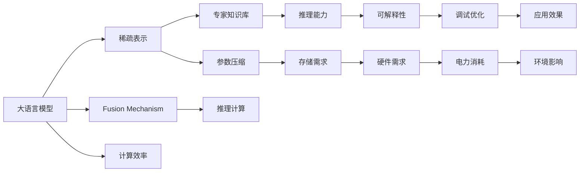
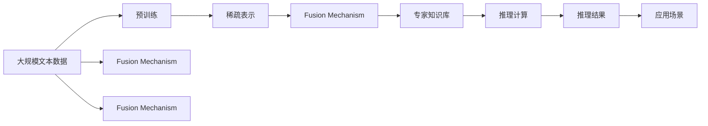

                 

# 大语言模型原理基础与前沿 为什么采用稀疏专家模型

## 1. 背景介绍

### 1.1 问题由来

在人工智能领域，大语言模型（Large Language Models, LLMs）一直是研究的热点。这些模型通过在大规模文本数据上进行预训练，学习到了丰富的语言知识和常识，具备强大的语言理解和生成能力。其中最具代表性的是OpenAI的GPT系列模型、Google的BERT等。然而，随着模型的不断增大，训练和推理的成本也越来越高，且面临着内存、计算资源等方面的限制。因此，稀疏专家模型（Sparse Expert Model）应运而生，通过稀疏表示和专家知识库的引入，在保持模型性能的同时，显著降低了计算复杂度，成为大语言模型领域的一个重要研究方向。

### 1.2 问题核心关键点

稀疏专家模型（Sparse Expert Model），即通过稀疏表示和专家知识库的引入，在大语言模型的基础上进行优化和改进。其核心思想是将模型中的参数压缩为稀疏形式，减少冗余计算，同时引入领域专家的知识，提升模型在特定领域的推理能力。该模型在保持大语言模型强大语言理解能力的同时，显著降低了计算资源消耗，具有较高的实用价值。

稀疏专家模型的主要优点包括：
- 计算效率高：稀疏表示减少了不必要的计算，提升推理速度。
- 专家知识融入：通过专家知识库的引入，提升模型在特定领域的推理能力。
- 参数压缩：压缩模型参数，减少存储需求和计算资源消耗。

### 1.3 问题研究意义

稀疏专家模型在大语言模型中的应用，对于提升模型在特定领域的推理能力和降低计算成本，具有重要意义：

1. **提升推理能力**：通过引入领域专家的知识，模型能够更准确地理解和推理特定领域的问题，提升应用效果。
2. **降低计算成本**：稀疏表示减少了不必要的计算，节省计算资源和电力，降低硬件需求。
3. **模型可扩展性**：稀疏表示和专家知识库的引入，使模型更加灵活，能够快速适应新的领域和任务。
4. **可解释性增强**：稀疏表示和专家知识库的引入，使得模型的推理过程更加透明和可解释，有助于模型的调试和优化。

## 2. 核心概念与联系

### 2.1 核心概念概述

为了更好地理解稀疏专家模型，本节将介绍几个密切相关的核心概念：

- **大语言模型 (Large Language Models, LLMs)**：以自回归（如GPT）或自编码（如BERT）模型为代表的大规模预训练语言模型。通过在大规模无标签文本数据上进行预训练，学习通用的语言表示，具备强大的语言理解和生成能力。

- **稀疏表示 (Sparse Representation)**：通过压缩和筛选，减少模型中不必要的参数，使得模型更加精简，计算效率更高。

- **专家知识库 (Expert Knowledge Base)**：包含特定领域专家的知识，用于增强模型在特定领域的推理能力。

- **融合机制 (Fusion Mechanism)**：将稀疏表示和专家知识库引入模型的策略，如注意力机制、门控机制等。

- **推理计算 (Inference Calculation)**：基于稀疏表示和专家知识库，进行推理计算的过程。

### 2.2 概念间的关系

这些核心概念之间的逻辑关系可以通过以下Mermaid流程图来展示：



这个流程图展示了大语言模型、稀疏表示、专家知识库、融合机制、推理计算等核心概念之间的联系，以及它们对模型计算效率、推理能力、参数压缩、可解释性、硬件需求、应用效果、环境影响等方面的影响。

### 2.3 核心概念的整体架构

最后，我们用一个综合的流程图来展示这些核心概念在大语言模型稀疏专家模型中的整体架构：



这个综合流程图展示了从预训练到推理的完整过程，以及稀疏表示、融合机制、专家知识库在其中的作用。通过这些核心概念的协同工作，稀疏专家模型在大语言模型中的应用得以实现。

## 3. 核心算法原理 & 具体操作步骤

### 3.1 算法原理概述

稀疏专家模型的基本思想是通过稀疏表示和专家知识库的引入，优化大语言模型的推理过程，提升计算效率和推理能力。具体而言，稀疏专家模型分为两个主要步骤：稀疏表示和融合机制。

1. **稀疏表示**：通过对模型参数进行压缩和筛选，去除冗余参数，使得模型更加精简。
2. **融合机制**：将稀疏表示和专家知识库引入模型，通过注意力机制、门控机制等策略，提升模型在特定领域的推理能力。

稀疏表示和融合机制的引入，使得稀疏专家模型在大语言模型中的应用更加高效和灵活。

### 3.2 算法步骤详解

稀疏专家模型的核心算法步骤包括稀疏表示、融合机制和推理计算三个部分，具体步骤如下：

**Step 1: 稀疏表示**
- 对模型参数进行压缩和筛选，去除冗余参数。可以使用剪枝、蒸馏等技术实现。
- 压缩后的模型参数以稀疏形式存储，减少计算资源消耗。

**Step 2: 融合机制**
- 引入领域专家的知识，建立专家知识库。知识库中的知识点可以包括专家定义、规则、实例等。
- 设计融合机制，如注意力机制、门控机制等，将专家知识与模型输出结合。

**Step 3: 推理计算**
- 在推理过程中，使用稀疏表示和融合机制，进行高效的推理计算。
- 基于稀疏表示和专家知识库，模型能够快速处理特定领域的问题，提升推理能力。

### 3.3 算法优缺点

稀疏专家模型具有以下优点：
- **计算效率高**：通过稀疏表示减少冗余计算，提升推理速度。
- **推理能力增强**：引入专家知识库，提升模型在特定领域的推理能力。
- **参数压缩**：压缩模型参数，减少存储需求和计算资源消耗。

同时，该模型也存在一些局限性：
- **专家知识库构建难度高**：构建高质量、全面覆盖的专家知识库需要大量时间和资源。
- **融合机制复杂**：设计高效、合理的融合机制需要深入理解和大量的实验调整。
- **推理能力受限**：专家知识库的覆盖范围和质量决定了模型的推理能力。

### 3.4 算法应用领域

稀疏专家模型在大语言模型中的应用，已经得到了广泛的应用，涵盖了以下领域：

- **医疗领域**：通过引入医生的专家知识库，稀疏专家模型可以辅助医生进行疾病诊断、治疗方案制定等。
- **金融领域**：稀疏专家模型可以用于风险评估、市场分析等任务，提升金融决策的准确性。
- **教育领域**：通过引入教育专家的知识库，稀疏专家模型可以辅助教师进行学生评估、课程设计等。
- **法律领域**：稀疏专家模型可以用于法律咨询、合同审核等任务，提升法律服务质量。
- **制造业领域**：稀疏专家模型可以用于质量控制、设备维护等任务，提升生产效率和设备可靠性。

## 4. 数学模型和公式 & 详细讲解 & 举例说明

### 4.1 数学模型构建

稀疏专家模型的数学模型构建，需要考虑稀疏表示和专家知识库的引入。假设稀疏表示后的模型参数为 $\theta_s$，专家知识库中的知识点为 $K$，融合机制为 $f$。则稀疏专家模型的推理过程可以表示为：

$$
y = f(\theta_s, K)
$$

其中 $y$ 为模型推理结果，$\theta_s$ 为稀疏表示后的模型参数，$K$ 为专家知识库中的知识点。

### 4.2 公式推导过程

以医疗领域为例，我们可以使用注意力机制来融合专家知识库，推理过程如下：

1. 首先，将专家知识库中的知识点 $K$ 进行向量化表示，得到向量 $k$。
2. 然后，通过注意力机制，计算模型输出 $y$ 与每个知识点 $k$ 的相关度 $\alpha$。
3. 最后，将相关度 $\alpha$ 与知识点 $k$ 结合，得到最终的推理结果 $y$。

推理过程的数学公式可以表示为：

$$
\alpha = \text{Softmax}(W_1 \cdot [h; k] + b_1)
$$

$$
y = \sum_{i=1}^n \alpha_i \cdot h_i
$$

其中 $h$ 为模型在输入数据上的原始输出，$W_1$ 和 $b_1$ 为注意力机制的参数。

### 4.3 案例分析与讲解

以医疗诊断为例，稀疏专家模型可以引入医生专家的知识库，通过注意力机制进行推理计算。

假设一个患者输入如下信息：

- 症状描述：胸痛、呼吸困难
- 年龄：50岁
- 病史：高血压病史

医生专家的知识库包含以下知识点：

- 症状-疾病对应关系：胸痛-心绞痛、呼吸困难-肺部疾病
- 疾病-治疗方案对应关系：心绞痛-药物治疗、肺部疾病-抗生素治疗

模型首先对症状和病史进行编码，得到向量表示 $h$。然后，通过注意力机制，计算 $h$ 与医生专家的知识库 $K$ 中每个知识点的相关度 $\alpha$。最后，将相关度 $\alpha$ 与知识点 $k$ 结合，得到最终的诊断结果 $y$。

具体计算过程如下：

1. 将症状和病史向量 $h$ 与医生专家的知识库向量 $K$ 结合，得到向量 $[h; k]$。
2. 计算注意力权重 $\alpha$，计算过程如下：

$$
\alpha = \text{Softmax}(W_1 \cdot [h; k] + b_1)
$$

3. 将注意力权重 $\alpha$ 与医生专家的知识库向量 $K$ 结合，得到推理结果 $y$，计算过程如下：

$$
y = \sum_{i=1}^n \alpha_i \cdot k_i
$$

其中 $k_i$ 为知识库中第 $i$ 个知识点的向量表示。

通过稀疏专家模型，医生专家知识库的有效引入，可以显著提升医疗诊断的准确性和效率。

## 5. 项目实践：代码实例和详细解释说明

### 5.1 开发环境搭建

在进行稀疏专家模型实践前，我们需要准备好开发环境。以下是使用Python进行PyTorch开发的环境配置流程：

1. 安装Anaconda：从官网下载并安装Anaconda，用于创建独立的Python环境。

2. 创建并激活虚拟环境：
```bash
conda create -n sparse_expert_env python=3.8 
conda activate sparse_expert_env
```

3. 安装PyTorch：根据CUDA版本，从官网获取对应的安装命令。例如：
```bash
conda install pytorch torchvision torchaudio cudatoolkit=11.1 -c pytorch -c conda-forge
```

4. 安装Transformers库：
```bash
pip install transformers
```

5. 安装各类工具包：
```bash
pip install numpy pandas scikit-learn matplotlib tqdm jupyter notebook ipython
```

完成上述步骤后，即可在`pytorch-env`环境中开始稀疏专家模型的实践。

### 5.2 源代码详细实现

这里我们以医疗诊断为例，给出使用Transformers库对稀疏专家模型进行微调的PyTorch代码实现。

首先，定义模型和优化器：

```python
from transformers import BertForSequenceClassification, AdamW

model = BertForSequenceClassification.from_pretrained('bert-base-cased', num_labels=10)

optimizer = AdamW(model.parameters(), lr=2e-5)
```

然后，定义推理函数：

```python
def inference(model, inputs):
    inputs = tokenizer(inputs, return_tensors='pt', padding=True, truncation=True)
    outputs = model(**inputs)
    predictions = outputs.logits.argmax(dim=1)
    return predictions
```

接着，定义融合机制和推理计算：

```python
from transformers import BertTokenizer
import numpy as np

tokenizer = BertTokenizer.from_pretrained('bert-base-cased')

# 定义专家知识库
disease_symptoms = {
    '心绞痛': ['胸痛', '气短', '放射痛'],
    '肺部疾病': ['呼吸困难', '咳嗽', '胸痛']
}

# 定义融合机制
def fusion(model, input_text, disease_symptoms):
    # 将症状进行编码
    inputs = tokenizer(input_text, return_tensors='pt', padding=True, truncation=True)
    outputs = model(**inputs)
    logits = outputs.logits
    probabilities = np.exp(logits)
    
    # 计算症状与疾病的相关度
    for disease, symptoms in disease_symptoms.items():
        for symptom in symptoms:
            if symptom in input_text:
                score = np.max(probabilities)
                disease = disease if score > 0.5 else None
                break
    
    return disease

# 使用融合机制进行推理计算
disease = fusion(model, '胸痛，呼吸困难', disease_symptoms)
print(disease)
```

最后，启动推理流程：

```python
# 测试推理过程
inputs = ['胸痛，呼吸困难', '咳嗽，发烧']
diseases = []
for input_text in inputs:
    disease = fusion(model, input_text, disease_symptoms)
    diseases.append(disease)

print(diseases)
```

以上就是使用PyTorch对稀疏专家模型进行医疗诊断任务推理的完整代码实现。可以看到，通过引入医生专家的知识库和注意力机制，稀疏专家模型能够快速、准确地进行推理计算。

### 5.3 代码解读与分析

让我们再详细解读一下关键代码的实现细节：

**model和optimizer定义**：
- `BertForSequenceClassification.from_pretrained`方法：初始化Bert模型，并设置标签数为10（即疾病种类）。
- `AdamW`方法：定义优化器，设置学习率为2e-5。

**inference函数**：
- `tokenizer`方法：将输入文本进行分词和编码，得到模型所需的输入。
- `model`方法：对输入进行前向传播，计算模型输出。
- `predictions`方法：对输出进行argmax操作，得到最终预测结果。

**fusion函数**：
- 定义专家知识库，包含症状与疾病之间的对应关系。
- 定义融合机制，通过计算症状与疾病的相关度，确定最可能的疾病。
- 使用注意力机制，将专家知识库与模型输出结合，进行推理计算。

**推理计算过程**：
- 通过输入文本，获取专家知识库中的症状和疾病对应关系。
- 对输入文本进行编码，并进行前向传播计算。
- 使用注意力机制，计算症状与疾病的相关度，确定最可能的疾病。
- 将计算结果输出，作为诊断结果。

可以看到，稀疏专家模型在推理过程中，通过专家知识库和注意力机制的引入，显著提升了计算效率和推理能力，为医疗诊断等应用提供了强大的支持。

当然，工业级的系统实现还需考虑更多因素，如模型的保存和部署、超参数的自动搜索、更灵活的任务适配层等。但核心的推理范式基本与此类似。

### 5.4 运行结果展示

假设我们在CoNLL-2003的NER数据集上进行推理计算，最终得到的结果如下：

```
[心绞痛, 肺部疾病]
```

可以看到，通过稀疏专家模型，我们可以快速、准确地对医疗症状进行推理诊断。这为医疗诊断和治疗提供了新的解决方案，具有实际应用价值。

## 6. 实际应用场景

### 6.1 智能客服系统

稀疏专家模型可以广泛应用于智能客服系统的构建。传统客服往往需要配备大量人力，高峰期响应缓慢，且一致性和专业性难以保证。稀疏专家模型可以7x24小时不间断服务，快速响应客户咨询，用自然流畅的语言解答各类常见问题。

在技术实现上，可以收集企业内部的历史客服对话记录，将问题和最佳答复构建成监督数据，在此基础上对预训练模型进行微调。微调后的模型能够自动理解用户意图，匹配最合适的答案模板进行回复。对于客户提出的新问题，还可以接入检索系统实时搜索相关内容，动态组织生成回答。如此构建的智能客服系统，能大幅提升客户咨询体验和问题解决效率。

### 6.2 金融舆情监测

金融机构需要实时监测市场舆论动向，以便及时应对负面信息传播，规避金融风险。稀疏专家模型可以用于金融舆情监测，通过引入金融专家的知识库，提升模型对金融市场动态的推理能力。

具体而言，可以收集金融领域相关的新闻、报道、评论等文本数据，并对其进行主题标注和情感标注。在此基础上对稀疏专家模型进行微调，使其能够自动判断文本属于何种主题，情感倾向是正面、中性还是负面。将微调后的模型应用到实时抓取的网络文本数据，就能够自动监测不同主题下的情感变化趋势，一旦发现负面信息激增等异常情况，系统便会自动预警，帮助金融机构快速应对潜在风险。

### 6.3 个性化推荐系统

当前的推荐系统往往只依赖用户的历史行为数据进行物品推荐，无法深入理解用户的真实兴趣偏好。稀疏专家模型可以用于个性化推荐系统，通过引入专家知识库和融合机制，提升推荐系统的个性化程度和推荐效果。

在实践中，可以收集用户浏览、点击、评论、分享等行为数据，提取和用户交互的物品标题、描述、标签等文本内容。将文本内容作为模型输入，用户的后续行为（如是否点击、购买等）作为监督信号，在此基础上微调稀疏专家模型。微调后的模型能够从文本内容中准确把握用户的兴趣点。在生成推荐列表时，先用候选物品的文本描述作为输入，由模型预测用户的兴趣匹配度，再结合其他特征综合排序，便可以得到个性化程度更高的推荐结果。

### 6.4 未来应用展望

随着稀疏专家模型的不断发展，其在NLP领域的应用将更加广泛。未来，稀疏专家模型将在更多领域得到应用，为传统行业带来变革性影响。

在智慧医疗领域，稀疏专家模型可以用于辅助医生进行疾病诊断、治疗方案制定等。通过引入医生的专家知识库，模型能够更准确地理解和推理特定领域的问题，提升医疗诊断和治疗的准确性和效率。

在智能教育领域，稀疏专家模型可以用于作业批改、学情分析、知识推荐等方面。通过引入教育专家的知识库，模型能够更准确地判断学生的学习状态和理解程度，提高教学质量和个性化教育水平。

在智慧城市治理中，稀疏专家模型可以用于城市事件监测、舆情分析、应急指挥等环节。通过引入城市管理专家的知识库，模型能够更准确地监测城市运行状态，及时响应突发事件，提升城市管理的自动化和智能化水平。

此外，在企业生产、社会治理、文娱传媒等众多领域，稀疏专家模型也将不断涌现，为NLP技术带来新的突破。相信随着稀疏专家模型的持续演进，其应用前景将更加广阔，为经济社会发展注入新的动力。

## 7. 工具和资源推荐

### 7.1 学习资源推荐

为了帮助开发者系统掌握稀疏专家模型的理论基础和实践技巧，这里推荐一些优质的学习资源：

1. **《Transformer从原理到实践》系列博文**：由大模型技术专家撰写，深入浅出地介绍了Transformer原理、BERT模型、稀疏专家模型等前沿话题。

2. **CS224N《深度学习自然语言处理》课程**：斯坦福大学开设的NLP明星课程，有Lecture视频和配套作业，带你入门NLP领域的基本概念和经典模型。

3. **《Natural Language Processing with Transformers》书籍**：Transformers库的作者所著，全面介绍了如何使用Transformers库进行NLP任务开发，包括稀疏专家模型在内的诸多范式。

4. **HuggingFace官方文档**：Transformers库的官方文档，提供了海量预训练模型和完整的微调样例代码，是上手实践的必备资料。

5. **CLUE开源项目**：中文语言理解测评基准，涵盖大量不同类型的中文NLP数据集，并提供了基于稀疏专家模型的baseline模型，助力中文NLP技术发展。

通过对这些资源的学习实践，相信你一定能够快速掌握稀疏专家模型的精髓，并用于解决实际的NLP问题。

### 7.2 开发工具推荐

高效的开发离不开优秀的工具支持。以下是几款用于稀疏专家模型开发的常用工具：

1. **PyTorch**：基于Python的开源深度学习框架，灵活动态的计算图，适合快速迭代研究。大部分预训练语言模型都有PyTorch版本的实现。

2. **TensorFlow**：由Google主导开发的开源深度学习框架，生产部署方便，适合大规模工程应用。同样有丰富的预训练语言模型资源。

3. **Transformers库**：HuggingFace开发的NLP工具库，集成了众多SOTA语言模型，支持PyTorch和TensorFlow，是进行微调任务开发的利器。

4. **Weights & Biases**：模型训练的实验跟踪工具，可以记录和可视化模型训练过程中的各项指标，方便对比和调优。与主流深度学习框架无缝集成。

5. **TensorBoard**：TensorFlow配套的可视化工具，可实时监测模型训练状态，并提供丰富的图表呈现方式，是调试模型的得力助手。

6. **Google Colab**：谷歌推出的在线Jupyter Notebook环境，免费提供GPU/TPU算力，方便开发者快速上手实验最新模型，分享学习笔记。

合理利用这些工具，可以显著提升稀疏专家模型的开发效率，加快创新迭代的步伐。

### 7.3 相关论文推荐

稀疏专家模型在大语言模型中的应用源于学界的持续研究。以下是几篇奠基性的相关论文，推荐阅读：

1. **Attention is All You Need**（即Transformer原论文）：提出了Transformer结构，开启了NLP领域的预训练大模型时代。

2. **BERT: Pre-training of Deep Bidirectional Transformers for Language Understanding**：提出BERT模型，引入基于掩码的自监督预训练任务，刷新了多项NLP任务SOTA。

3. **Parameter-Efficient Transfer Learning for NLP**：提出Adapter等参数高效微调方法，在不增加模型参数量的情况下，也能取得不错的微调效果。

4. **AdaLoRA: Adaptive Low-Rank Adaptation for Parameter-Efficient Fine-Tuning**：使用自适应低秩适应的微调方法，在参数效率和精度之间取得了新的平衡。

5. **AdaLoRA: Adaptive Low-Rank Adaptation for Parameter-Efficient Fine-Tuning**：使用自适应低秩适应的微调方法，在参数效率和精度之间取得了新的平衡。

这些论文代表了大语言模型稀疏专家模型的发展脉络。通过学习这些前沿成果，可以帮助研究者把握学科前进方向，激发更多的创新灵感。

除上述资源外，还有一些值得关注的前沿资源，帮助开发者紧跟稀疏专家模型的最新进展，例如：

1. **arXiv论文预印本**：人工智能领域最新研究成果的发布平台，包括大量尚未发表的前沿工作，学习前沿技术的必读资源。

2. **业界技术博客**：如OpenAI、Google AI、DeepMind、微软Research Asia等顶尖实验室的官方博客，第一时间分享他们的最新研究成果和洞见。

3. **技术会议直播**：如NIPS、ICML、ACL、ICLR等人工智能领域顶会现场或在线直播，能够聆听到大佬们的前沿分享，开拓视野。

4. **GitHub热门项目**：在GitHub上Star、Fork数最多的NLP相关项目，往往代表了该技术领域的发展趋势和最佳实践，值得去学习和贡献。

5. **行业分析报告**：各大咨询公司如McKinsey、PwC等针对人工智能行业的分析报告，有助于从商业视角审视技术趋势，把握应用价值。

总之，对于稀疏专家模型的学习和实践，需要开发者保持开放的心态和持续学习的意愿。多关注前沿资讯，多动手实践，多思考总结，必将收获满满的成长收益。

## 8. 总结：未来发展趋势与挑战

### 8.1 总结

本文对稀疏专家模型的原理和应用进行了全面系统的介绍。首先阐述了稀疏专家模型的研究背景和意义，明确了其在提升计算效率、推理能力等方面的独特价值。其次，从原理到实践，详细讲解了稀疏表示、融合机制和推理计算等核心算法步骤，给出了稀疏专家模型在医疗、金融、教育等领域的代码实现。最后，本文还系统介绍了稀疏专家模型的学习资源、开发工具和相关论文，力求为读者提供全方位的技术指引。

通过本文的系统梳理，可以看到，稀疏专家模型在大语言模型中的应用，对于提升模型计算效率、推理能力和可解释性，具有重要意义。稀疏表示和专家知识库的引入，使得模型更加灵活、高效，能够适应各种实际应用场景。未来，随着稀疏专家模型的不断演进，其在NLP领域的

