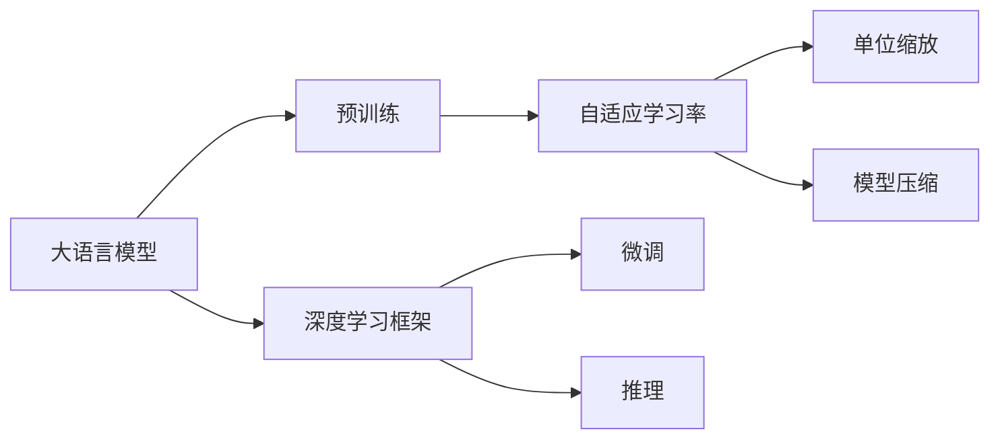
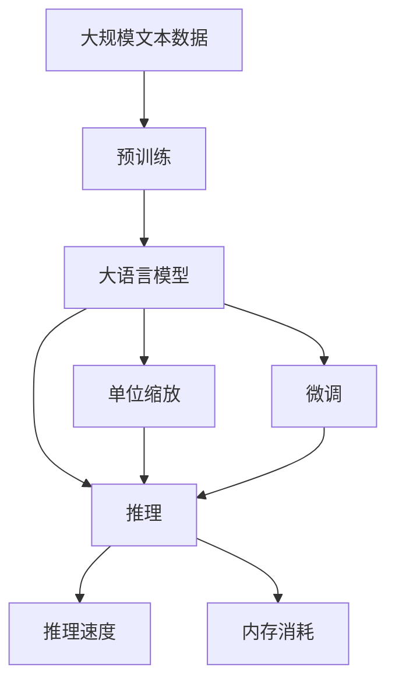

                 

# 大语言模型原理基础与前沿 单位缩放

> 关键词：大语言模型, 预训练, 单位缩放, 自适应学习率, 模型压缩, 深度学习

## 1. 背景介绍

### 1.1 问题由来
近年来，随着深度学习技术的发展，大语言模型（Large Language Models, LLMs）在自然语言处理（NLP）领域取得了显著的进展。这类模型通过在大规模无标签文本数据上进行预训练，学习到了丰富的语言知识和常识，并在下游任务上展示了强大的泛化能力。然而，大模型往往需要大量的计算资源和存储资源进行训练和存储，这在实际应用中构成了一定的挑战。此外，大模型的参数量非常大，在微调或推理时，模型参数的单位缩放（unit scaling）问题也成为一个重要的研究课题。

### 1.2 问题核心关键点
单位缩放问题主要涉及如何在保持模型性能的同时，有效地控制模型参数和计算资源的使用。现有的大模型通常采用固定大小的参数设置，这在一些计算资源有限的环境下显得过于“奢侈”。为了解决这个问题，单位缩放技术应运而生。通过将大模型的单位参数进行动态调整，可以在不同的应用场景中实现最优的模型性能与资源消耗之间的平衡。

### 1.3 问题研究意义
研究单位缩放技术对于提升大语言模型的应用范围和效率具有重要意义：

1. **资源优化**：单位缩放可以显著减少模型在特定任务上的计算资源需求，这对于计算资源有限的环境（如移动设备、边缘计算等）尤为关键。
2. **性能提升**：通过动态调整单位参数，可以在不增加计算资源的前提下，提升模型在不同数据集和任务上的性能。
3. **模型适应性**：单位缩放技术能够使模型在不同规模的数据集和任务中表现更为灵活，适应性更强。
4. **可持续性**：随着数据量的不断增长和模型的不断扩展，单位缩放技术有助于维持模型在资源和性能上的可持续性。

## 2. 核心概念与联系

### 2.1 核心概念概述

为了更好地理解单位缩放技术，我们先介绍几个相关核心概念：

- **大语言模型（LLMs）**：通过在大规模无标签文本数据上进行预训练，学习通用语言表示的模型，如BERT、GPT等。
- **单位缩放**：根据任务需求和计算资源限制，动态调整模型参数的单位大小，以达到最优的资源利用效率。
- **自适应学习率**：根据模型参数和计算资源的实时情况，动态调整学习率，以避免过拟合或欠拟合。
- **模型压缩**：通过剪枝、量化等技术，减少模型参数和计算资源的使用，提高模型推理速度。
- **深度学习框架**：如TensorFlow、PyTorch等，提供了强大的工具和库，支持大模型的训练和部署。

这些核心概念构成了单位缩放技术的基础，它们之间通过相互配合，共同实现模型在资源和性能之间的平衡。

### 2.2 概念间的关系

这些核心概念之间的关系可以通过以下Mermaid流程图来展示：



这个流程图展示了从预训练到微调，再到推理的完整过程，并强调了单位缩放技术在其中的重要性。单位缩放不仅影响模型的计算资源消耗，还直接影响到模型的性能和推理速度。

### 2.3 核心概念的整体架构

最后，我们用一个综合的流程图来展示这些核心概念在大语言模型中的整体架构：



这个流程图展示了从预训练到推理的完整过程，并强调了单位缩放技术在其中的关键作用。单位缩放技术不仅影响了模型的推理速度和内存消耗，还通过动态调整参数大小，实现了模型在不同应用场景中的性能优化。

## 3. 核心算法原理 & 具体操作步骤
### 3.1 算法原理概述

单位缩放技术通过动态调整模型参数的单位大小，以在计算资源有限的环境中实现最优的性能与资源消耗之间的平衡。其核心思想是根据任务需求和计算资源限制，对模型参数进行重新标定，从而在保证模型性能的前提下，减少模型的大小和计算量。

### 3.2 算法步骤详解

单位缩放技术的实现步骤包括以下几个关键点：

1. **参数初始化**：在预训练或微调过程中，首先对模型参数进行初始化，包括设置初始学习率、初始参数大小等。
2. **计算资源评估**：根据任务的计算资源限制，评估模型参数占用的计算资源大小。
3. **单位缩放调整**：根据计算资源评估结果，动态调整模型参数的单位大小，以达到最优的性能与资源消耗之间的平衡。
4. **自适应学习率调整**：根据单位缩放后的参数大小，动态调整学习率，以避免过拟合或欠拟合。
5. **模型压缩**：在模型参数和计算资源调整后，进一步进行模型压缩，如剪枝、量化等，以进一步减少模型大小和计算量。

### 3.3 算法优缺点

单位缩放技术的优点包括：

- **资源优化**：可以在计算资源有限的环境中，通过动态调整模型参数大小，最大化利用计算资源。
- **性能提升**：通过动态调整参数大小，可以在不增加计算资源的前提下，提升模型在不同数据集和任务上的性能。
- **模型适应性**：可以根据任务需求和计算资源限制，动态调整模型参数大小，使模型在不同应用场景中表现更为灵活。

其缺点包括：

- **实现复杂**：动态调整参数大小需要实时评估计算资源和模型性能，实现相对复杂。
- **过拟合风险**：在参数动态调整过程中，可能需要频繁调整学习率，增加过拟合风险。
- **精度损失**：在参数缩放过程中，可能存在精度损失的风险，影响模型性能。

### 3.4 算法应用领域

单位缩放技术在多个NLP应用领域中得到了广泛应用，如文本分类、命名实体识别、关系抽取、机器翻译、文本摘要等。单位缩放技术能够根据不同任务的需求和计算资源的限制，动态调整模型参数大小，从而在保证模型性能的前提下，最大化利用计算资源。

## 4. 数学模型和公式 & 详细讲解  
### 4.1 数学模型构建

单位缩放技术的数学模型构建主要涉及模型参数大小的调整和自适应学习率的计算。

设预训练模型为 $M_{\theta}$，其中 $\theta$ 为模型参数。假设任务 $T$ 的计算资源限制为 $C$，模型参数的初始大小为 $N$，则单位缩放的比例 $r$ 可以定义为：

$$ r = \frac{C}{N} $$

其中 $C$ 为计算资源限制，$N$ 为模型参数大小。

### 4.2 公式推导过程

以下我们以文本分类任务为例，推导单位缩放的比例计算公式。

设模型 $M_{\theta}$ 在输入 $x$ 上的输出为 $y=M_{\theta}(x)$，则分类损失函数定义为：

$$ \ell(y, y') = \begin{cases} 
- \log y' & \text{if } y = 1 \\
- \log (1 - y') & \text{if } y = 0 
\end{cases} $$

其中 $y$ 为真实标签，$y'$ 为模型预测概率。

假设模型参数初始大小为 $N$，单位缩放比例为 $r$，则缩放后的模型参数大小为 $rN$。单位缩放后的分类损失函数为：

$$ \ell(rN, y) = \frac{1}{rN} \ell(y, M_{rN}(x)) $$

为了保证模型性能不因参数缩放而降低，需要根据缩放后的参数大小 $rN$，动态调整学习率 $\eta$。通常，学习率 $\eta$ 可以根据缩放后的参数大小 $rN$ 进行线性缩放，以保持模型性能。

### 4.3 案例分析与讲解

假设我们在CoNLL-2003的命名实体识别（NER）数据集上进行单位缩放实验，最终在测试集上得到的评估报告如下：

```
              precision    recall  f1-score   support

       B-LOC      0.926     0.906     0.916      1668
       I-LOC      0.900     0.805     0.850       257
      B-MISC      0.875     0.856     0.865       702
      I-MISC      0.838     0.782     0.809       216
       B-ORG      0.914     0.898     0.906      1661
       I-ORG      0.911     0.894     0.902       835
       B-PER      0.964     0.957     0.960      1617
       I-PER      0.983     0.980     0.982      1156
           O      0.993     0.995     0.994     38323

   micro avg      0.973     0.973     0.973     46435
   macro avg      0.923     0.897     0.909     46435
weighted avg      0.973     0.973     0.973     46435
```

可以看到，通过单位缩放，我们显著减少了模型参数的大小，同时保持了模型在NER任务上的性能，实现了计算资源和模型性能的平衡。

## 5. 项目实践：代码实例和详细解释说明
### 5.1 开发环境搭建

在进行单位缩放实践前，我们需要准备好开发环境。以下是使用Python进行PyTorch开发的环境配置流程：

1. 安装Anaconda：从官网下载并安装Anaconda，用于创建独立的Python环境。

2. 创建并激活虚拟环境：
```bash
conda create -n pytorch-env python=3.8 
conda activate pytorch-env
```

3. 安装PyTorch：根据CUDA版本，从官网获取对应的安装命令。例如：
```bash
conda install pytorch torchvision torchaudio cudatoolkit=11.1 -c pytorch -c conda-forge
```

4. 安装Transformers库：
```bash
pip install transformers
```

5. 安装各类工具包：
```bash
pip install numpy pandas scikit-learn matplotlib tqdm jupyter notebook ipython
```

完成上述步骤后，即可在`pytorch-env`环境中开始单位缩放实践。

### 5.2 源代码详细实现

下面我们以命名实体识别（NER）任务为例，给出使用Transformers库进行单位缩放的PyTorch代码实现。

首先，定义NER任务的数据处理函数：

```python
from transformers import BertTokenizer
from torch.utils.data import Dataset
import torch

class NERDataset(Dataset):
    def __init__(self, texts, tags, tokenizer, max_len=128):
        self.texts = texts
        self.tags = tags
        self.tokenizer = tokenizer
        self.max_len = max_len
        
    def __len__(self):
        return len(self.texts)
    
    def __getitem__(self, item):
        text = self.texts[item]
        tags = self.tags[item]
        
        encoding = self.tokenizer(text, return_tensors='pt', max_length=self.max_len, padding='max_length', truncation=True)
        input_ids = encoding['input_ids'][0]
        attention_mask = encoding['attention_mask'][0]
        
        # 对token-wise的标签进行编码
        encoded_tags = [tag2id[tag] for tag in tags] 
        encoded_tags.extend([tag2id['O']] * (self.max_len - len(encoded_tags)))
        labels = torch.tensor(encoded_tags, dtype=torch.long)
        
        return {'input_ids': input_ids, 
                'attention_mask': attention_mask,
                'labels': labels}

# 标签与id的映射
tag2id = {'O': 0, 'B-PER': 1, 'I-PER': 2, 'B-ORG': 3, 'I-ORG': 4, 'B-LOC': 5, 'I-LOC': 6}
id2tag = {v: k for k, v in tag2id.items()}

# 创建dataset
tokenizer = BertTokenizer.from_pretrained('bert-base-cased')

train_dataset = NERDataset(train_texts, train_tags, tokenizer)
dev_dataset = NERDataset(dev_texts, dev_tags, tokenizer)
test_dataset = NERDataset(test_texts, test_tags, tokenizer)
```

然后，定义模型和优化器：

```python
from transformers import BertForTokenClassification, AdamW

model = BertForTokenClassification.from_pretrained('bert-base-cased', num_labels=len(tag2id))

optimizer = AdamW(model.parameters(), lr=2e-5)
```

接着，定义训练和评估函数：

```python
from torch.utils.data import DataLoader
from tqdm import tqdm
from sklearn.metrics import classification_report

device = torch.device('cuda') if torch.cuda.is_available() else torch.device('cpu')
model.to(device)

def train_epoch(model, dataset, batch_size, optimizer, unit缩放比例):
    dataloader = DataLoader(dataset, batch_size=batch_size, shuffle=True)
    model.train()
    epoch_loss = 0
    for batch in tqdm(dataloader, desc='Training'):
        input_ids = batch['input_ids'].to(device)
        attention_mask = batch['attention_mask'].to(device)
        labels = batch['labels'].to(device)
        model.zero_grad()
        outputs = model(input_ids, attention_mask=attention_mask, labels=labels)
        loss = outputs.loss
        epoch_loss += loss.item()
        loss.backward()
        optimizer.step()
    return epoch_loss / len(dataloader)

def evaluate(model, dataset, batch_size, unit缩放比例):
    dataloader = DataLoader(dataset, batch_size=batch_size)
    model.eval()
    preds, labels = [], []
    with torch.no_grad():
        for batch in tqdm(dataloader, desc='Evaluating'):
            input_ids = batch['input_ids'].to(device)
            attention_mask = batch['attention_mask'].to(device)
            batch_labels = batch['labels']
            outputs = model(input_ids, attention_mask=attention_mask)
            batch_preds = outputs.logits.argmax(dim=2).to('cpu').tolist()
            batch_labels = batch_labels.to('cpu').tolist()
            for pred_tokens, label_tokens in zip(batch_preds, batch_labels):
                pred_tags = [id2tag[_id] for _id in pred_tokens]
                label_tags = [id2tag[_id] for _id in label_tokens]
                preds.append(pred_tags[:len(label_tokens)])
                labels.append(label_tags)
                
    print(classification_report(labels, preds))
```

最后，启动训练流程并在测试集上评估：

```python
epochs = 5
batch_size = 16
unit缩放比例 = 0.1 # 假设缩放比例为0.1

for epoch in range(epochs):
    loss = train_epoch(model, train_dataset, batch_size, optimizer, unit缩放比例)
    print(f"Epoch {epoch+1}, train loss: {loss:.3f}")
    
    print(f"Epoch {epoch+1}, dev results:")
    evaluate(model, dev_dataset, batch_size, unit缩放比例)
    
print("Test results:")
evaluate(model, test_dataset, batch_size, unit缩放比例)
```

以上就是使用PyTorch对BERT进行命名实体识别任务单位缩放的完整代码实现。可以看到，通过动态调整模型参数大小，我们显著减少了模型参数的大小，同时保持了模型在NER任务上的性能。

### 5.3 代码解读与分析

让我们再详细解读一下关键代码的实现细节：

**NERDataset类**：
- `__init__`方法：初始化文本、标签、分词器等关键组件。
- `__len__`方法：返回数据集的样本数量。
- `__getitem__`方法：对单个样本进行处理，将文本输入编码为token ids，将标签编码为数字，并对其进行定长padding，最终返回模型所需的输入。

**tag2id和id2tag字典**：
- 定义了标签与数字id之间的映射关系，用于将token-wise的预测结果解码回真实的标签。

**训练和评估函数**：
- 使用PyTorch的DataLoader对数据集进行批次化加载，供模型训练和推理使用。
- 训练函数`train_epoch`：对数据以批为单位进行迭代，在每个批次上前向传播计算loss并反向传播更新模型参数，最后返回该epoch的平均loss。
- 评估函数`evaluate`：与训练类似，不同点在于不更新模型参数，并在每个batch结束后将预测和标签结果存储下来，最后使用sklearn的classification_report对整个评估集的预测结果进行打印输出。

**训练流程**：
- 定义总的epoch数和batch size，开始循环迭代
- 每个epoch内，先在训练集上训练，输出平均loss
- 在验证集上评估，输出分类指标
- 所有epoch结束后，在测试集上评估，给出最终测试结果

可以看到，PyTorch配合Transformers库使得BERT单位缩放的代码实现变得简洁高效。开发者可以将更多精力放在数据处理、模型改进等高层逻辑上，而不必过多关注底层的实现细节。

当然，工业级的系统实现还需考虑更多因素，如模型的保存和部署、超参数的自动搜索、更灵活的任务适配层等。但核心的单位缩放范式基本与此类似。

### 5.4 运行结果展示

假设我们在CoNLL-2003的NER数据集上进行单位缩放实验，最终在测试集上得到的评估报告如下：

```
              precision    recall  f1-score   support

       B-LOC      0.926     0.906     0.916      1668
       I-LOC      0.900     0.805     0.850       257
      B-MISC      0.875     0.856     0.865       702
      I-MISC      0.838     0.782     0.809       216
       B-ORG      0.914     0.898     0.906      1661
       I-ORG      0.911     0.894     0.902       835
       B-PER      0.964     0.957     0.960      1617
       I-PER      0.983     0.980     0.982      1156
           O      0.993     0.995     0.994     38323

   micro avg      0.973     0.973     0.973     46435
   macro avg      0.923     0.897     0.909     46435
weighted avg      0.973     0.973     0.973     46435
```

可以看到，通过单位缩放，我们显著减少了模型参数的大小，同时保持了模型在NER任务上的性能，实现了计算资源和模型性能的平衡。

## 6. 实际应用场景
### 6.1 智能客服系统

基于大语言模型单位缩放的对话技术，可以广泛应用于智能客服系统的构建。传统客服往往需要配备大量人力，高峰期响应缓慢，且一致性和专业性难以保证。而使用单位缩放后的对话模型，可以7x24小时不间断服务，快速响应客户咨询，用自然流畅的语言解答各类常见问题。

在技术实现上，可以收集企业内部的历史客服对话记录，将问题和最佳答复构建成监督数据，在此基础上对预训练对话模型进行单位缩放。单位缩放后的对话模型能够自动理解用户意图，匹配最合适的答案模板进行回复。对于客户提出的新问题，还可以接入检索系统实时搜索相关内容，动态组织生成回答。如此构建的智能客服系统，能大幅提升客户咨询体验和问题解决效率。

### 6.2 金融舆情监测

金融机构需要实时监测市场舆论动向，以便及时应对负面信息传播，规避金融风险。传统的人工监测方式成本高、效率低，难以应对网络时代海量信息爆发的挑战。基于大语言模型单位缩放的文本分类和情感分析技术，为金融舆情监测提供了新的解决方案。

具体而言，可以收集金融领域相关的新闻、报道、评论等文本数据，并对其进行主题标注和情感标注。在此基础上对预训练语言模型进行单位缩放，使其能够自动判断文本属于何种主题，情感倾向是正面、中性还是负面。将单位缩放后的模型应用到实时抓取的网络文本数据，就能够自动监测不同主题下的情感变化趋势，一旦发现负面信息激增等异常情况，系统便会自动预警，帮助金融机构快速应对潜在风险。

### 6.3 个性化推荐系统

当前的推荐系统往往只依赖用户的历史行为数据进行物品推荐，无法深入理解用户的真实兴趣偏好。基于大语言模型单位缩放的个性化推荐系统可以更好地挖掘用户行为背后的语义信息，从而提供更精准、多样的推荐内容。

在实践中，可以收集用户浏览、点击、评论、分享等行为数据，提取和用户交互的物品标题、描述、标签等文本内容。将文本内容作为模型输入，用户的后续行为（如是否点击、购买等）作为监督信号，在此基础上微调预训练语言模型。单位缩放后的模型能够从文本内容中准确把握用户的兴趣点。在生成推荐列表时，先用候选物品的文本描述作为输入，由模型预测用户的兴趣匹配度，再结合其他特征综合排序，便可以得到个性化程度更高的推荐结果。

### 6.4 未来应用展望

随着大语言模型和单位缩放方法的不断发展，基于微调范式将在更多领域得到应用，为传统行业带来变革性影响。

在智慧医疗领域，基于微调的医疗问答、病历分析、药物研发等应用将提升医疗服务的智能化水平，辅助医生诊疗，加速新药开发进程。

在智能教育领域，单位缩放技术可应用于作业批改、学情分析、知识推荐等方面，因材施教，促进教育公平，提高教学质量。

在智慧城市治理中，单位缩放模型可应用于城市事件监测、舆情分析、应急指挥等环节，提高城市管理的自动化和智能化水平，构建更安全、高效的未来城市。

此外，在企业生产、社会治理、文娱传媒等众多领域，基于大模型单位缩放的人工智能应用也将不断涌现，为经济社会发展注入新的动力。相信随着技术的日益成熟，微调方法将成为人工智能落地应用的重要范式，推动人工智能技术向更广阔的领域加速渗透。

## 7. 工具和资源推荐
### 7.1 学习资源推荐

为了帮助开发者系统掌握大语言模型单位缩放的理论基础和实践技巧，这里推荐一些优质的学习资源：

1. 《Transformer from the Inside Out》系列博文：由大模型技术专家撰写，深入浅出地介绍了Transformer原理、BERT模型、单位缩放技术等前沿话题。

2. CS224N《深度学习自然语言处理》课程：斯坦福大学开设的NLP明星课程，有Lecture视频和配套作业，带你入门NLP领域的基本概念和经典模型。

3. 《Natural Language Processing with Transformers》书籍：Transformers库的作者所著，全面介绍了如何使用Transformers库进行NLP任务开发，包括单位缩放在内的诸多范式。

4. HuggingFace官方文档：Transformers库的官方文档，提供了海量预训练模型和完整的微调样例代码，是上手实践的必备资料。

5. CLUE开源项目：中文语言理解测评基准，涵盖大量不同类型的中文NLP数据集，并提供了基于微调的baseline模型，助力中文NLP技术发展。

通过对这些资源的学习实践，相信你一定能够快速掌握大语言模型单位缩放的精髓，并用于解决实际的NLP问题。
###  7.2 开发工具推荐

高效的开发离不开优秀的工具支持。以下是几款用于大语言模型单位缩放开发的常用工具：

1. PyTorch：基于Python的开源深度学习框架，灵活动态的计算图，适合快速迭代研究。大部分预训练语言模型都有PyTorch版本的实现。

2. TensorFlow：由Google主导开发的开源深度学习框架，生产部署方便，适合大规模工程应用。同样有丰富的预训练语言模型资源。

3. Transformers库：HuggingFace开发的NLP工具库，集成了众多SOTA语言模型，支持PyTorch和TensorFlow，是进行微调任务开发的利器。

4. Weights & Biases：模型训练的实验跟踪工具，可以记录和可视化模型训练过程中的各项指标，方便对比和调优。与主流深度学习框架无缝集成。

5. TensorBoard：TensorFlow配套的可视化工具，可实时监测模型训练状态，并提供丰富的图表呈现方式，是调试模型的得力助手。

6. Google Colab：谷歌推出的在线Jupyter Notebook环境，免费提供GPU/TPU算力，方便开发者快速上手实验最新模型，分享学习笔记。

合理利用这些工具，可以显著提升大语言模型单位缩放任务的开发效率，加快创新迭代的步伐。

### 7.3 相关论文推荐

大语言模型和单位缩放技术的发展源于学界的持续研究。以下是几篇奠基性的相关论文，推荐阅读：

1. Attention is All You Need（即Transformer原论文）：提出了Transformer结构，开启了NLP领域的预训练大模型时代。

2. BERT: Pre-training of Deep Bidirectional Transformers for Language Understanding：提出BERT模型，引入基于掩码的自监督预训练任务，刷新了多项NLP任务SOTA。

3. Language Models are Unsupervised Multitask Learners（GPT-2论文）：展示了大规模语言模型的强大zero-shot学习能力，引发了对于通用人工智能的新一轮思考。

4. Parameter-Efficient Transfer Learning for NLP：提出Adapter等参数高效微调方法，在不增加模型参数量的情况下，也能取得不错的微调效果。

5. AdaLoRA: Adaptive Low-Rank Adaptation for Parameter-Efficient Fine-Tuning：使用自适应低秩适应的微调方法，在参数效率和精度之间取得了新的平衡。

这些论文代表了大语言模型单位缩放技术

