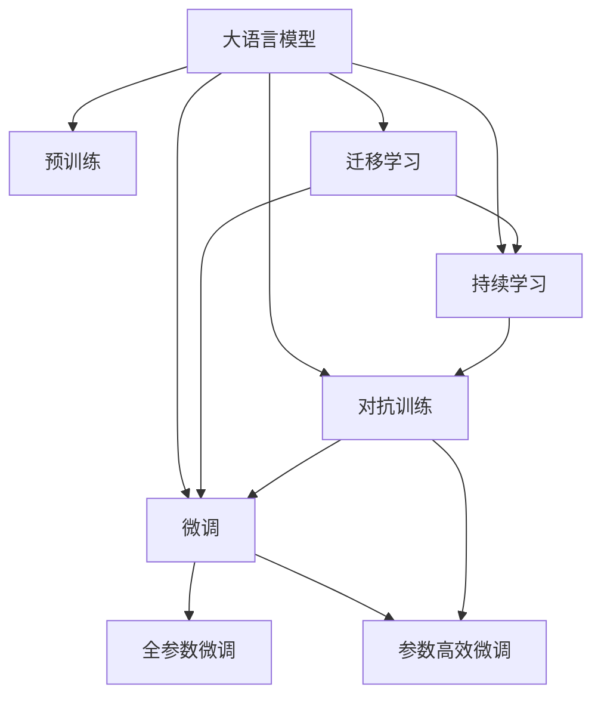
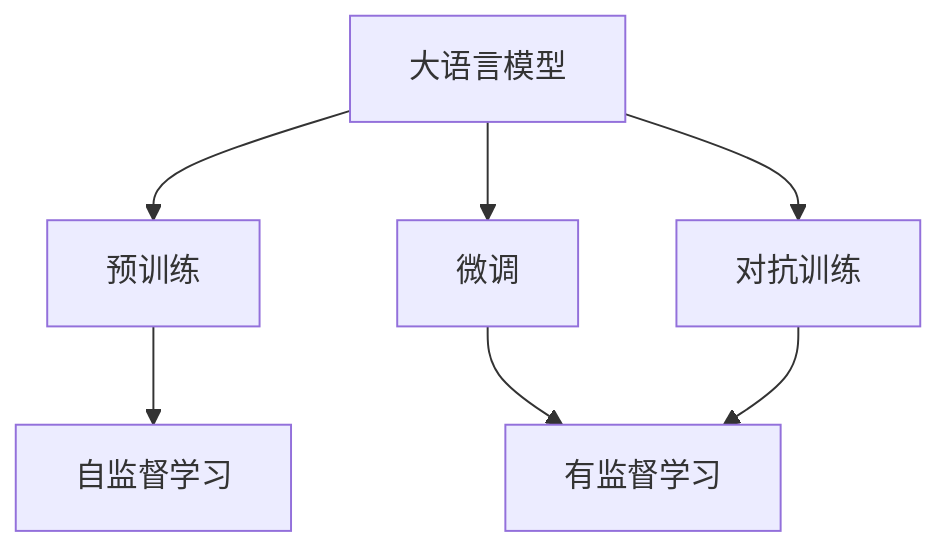
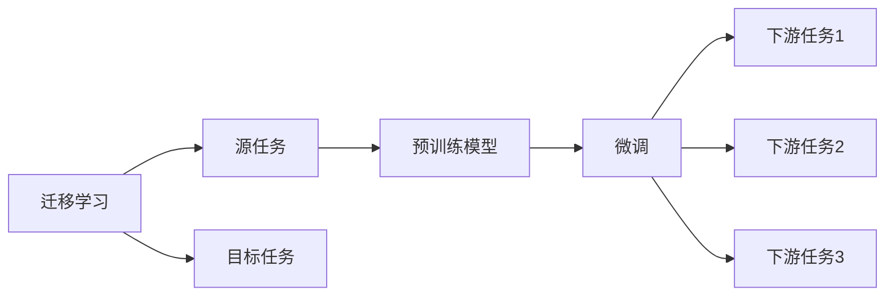
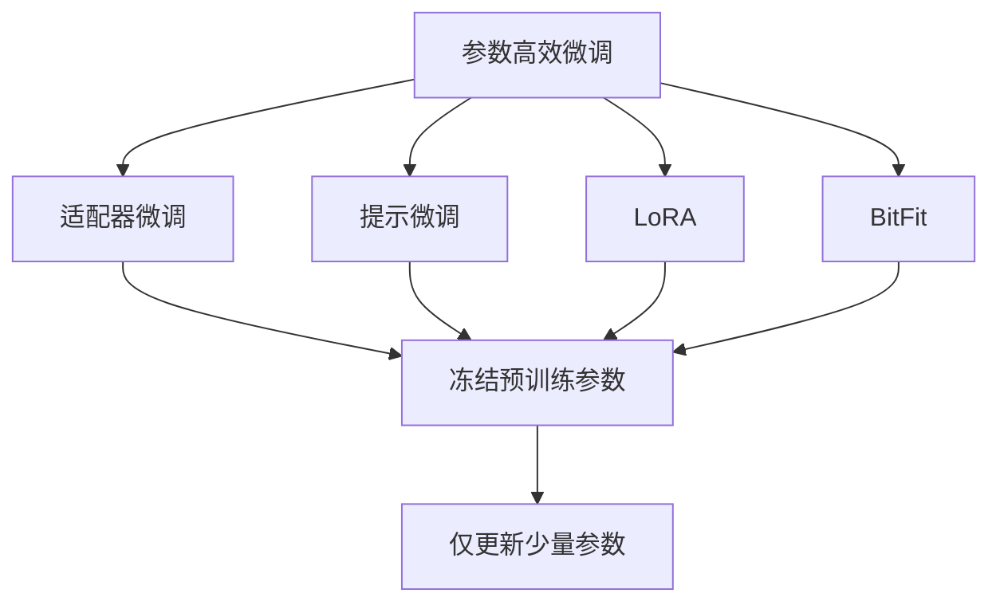
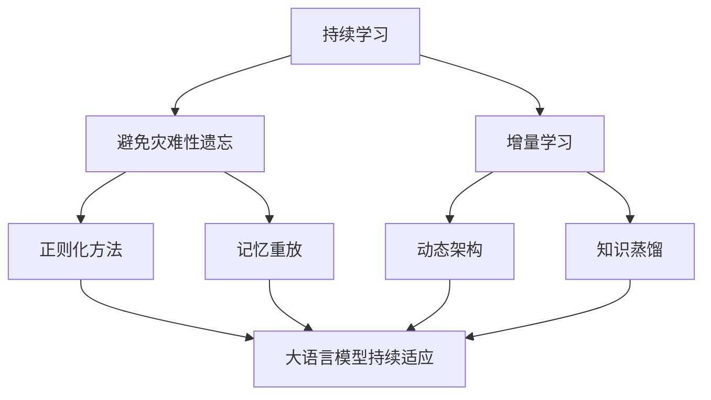
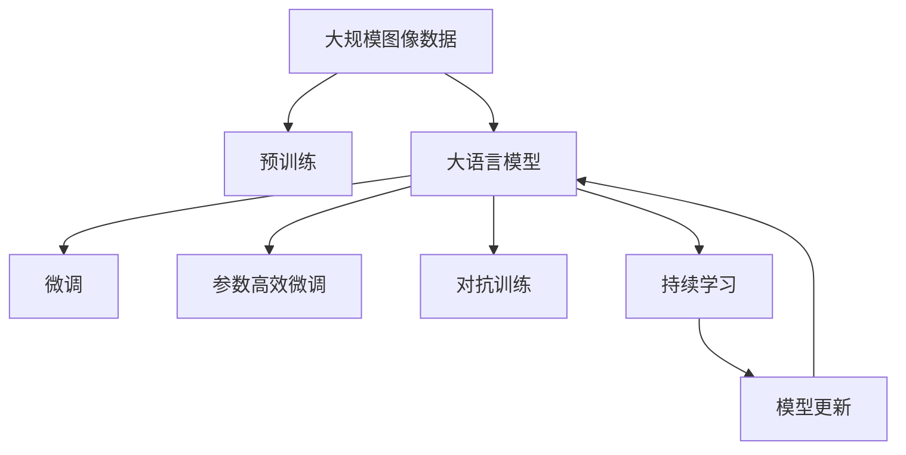

                 

# 大语言模型原理基础与前沿 锁定图像调优

> 关键词：大语言模型, 微调, 迁移学习, 自监督学习, 图像调优, 深度学习, 预训练

## 1. 背景介绍

### 1.1 问题由来

近年来，深度学习技术在图像处理领域取得了显著进展，尤其是通过大规模预训练模型进行迁移学习的方法，在大规模图像分类、目标检测、语义分割等任务上取得了优异的性能。然而，由于图像数据与文本数据在形式和处理方式上的差异，通用的文本预训练模型（如BERT、GPT等）在图像处理任务上的应用效果往往不尽如人意。因此，如何基于图像数据进行大语言模型的预训练和微调，提升其在图像调优（Image Optimization）等特定任务上的表现，成为了一个热门的研究话题。

### 1.2 问题核心关键点

大语言模型在图像调优任务中的应用，主要依赖于迁移学习和微调技术。具体来说，通常包括以下几个关键点：

- 选择合适的预训练模型：如ResNet、VGG、Inception等通用图像分类模型。
- 收集图像调优任务的数据集：例如使用自然场景中的高分辨率图像，标注对应的调优参数（如对比度、饱和度、曝光等）。
- 微调模型：利用标注数据集对预训练模型进行微调，使其能够更好地适应图像调优任务。
- 参数高效微调：固定大部分预训练参数，只微调顶层部分，以提高微调效率。
- 对抗性训练：引入对抗样本，提高模型鲁棒性，避免过拟合。
- 持续学习：随着新数据的不断到来，模型能够持续学习和适应用户偏好和环境变化。

通过上述方法，大语言模型可以在图像调优任务上实现高效、准确和鲁棒的结果，为图像处理和优化领域带来革命性的变化。

### 1.3 问题研究意义

大语言模型在图像调优任务中的应用，具有以下几方面的研究意义：

1. **降低成本**：相比于从头训练模型，微调可以显著减少在图像数据集上的训练时间成本和计算资源投入。
2. **提升性能**：微调使得模型能够更好地适应特定任务，在图像调优等特定领域上获得更好的性能。
3. **加速开发**：通过快速应用微调技术，能够加速图像处理算法和工具的开发进程，缩短产品迭代周期。
4. **技术创新**：微调促进了对预训练-微调过程的深入研究，推动了图像处理和优化技术的发展。
5. **产业升级**：大语言模型的迁移学习和微调技术为图像处理领域的产业化升级提供了新的技术路径。

## 2. 核心概念与联系

### 2.1 核心概念概述

为了更好地理解大语言模型在图像调优任务中的应用，本节将介绍几个密切相关的核心概念：

- **大语言模型**：以自回归模型（如GPT）或自编码模型（如BERT）为代表的预训练语言模型。通过在大规模无标签文本语料上进行预训练，学习通用的语言表示，具备强大的语言理解和生成能力。

- **预训练**：指在大规模无标签文本语料上，通过自监督学习任务训练通用语言模型的过程。常见的预训练任务包括语言建模、遮挡语言模型等。

- **微调**：指在预训练模型的基础上，使用下游任务的少量标注数据，通过有监督地训练优化模型在特定任务上的性能。通常只需要调整顶层分类器或解码器，并以较小的学习率更新全部或部分模型参数。

- **迁移学习**：指将一个领域学习到的知识，迁移应用到另一个不同但相关的领域的学习范式。大模型的预训练-微调过程即是一种典型的迁移学习方式。

- **参数高效微调**：指在微调过程中，只更新少量的模型参数，而固定大部分预训练权重不变，以提高微调效率，避免过拟合。

- **对抗训练**：加入对抗样本，提高模型鲁棒性，防止模型对输入数据的微小扰动敏感。

- **持续学习**：指模型能够持续从新数据中学习，同时保持已学习的知识，而不会出现灾难性遗忘。这对于保持大语言模型的时效性和适应性至关重要。

这些核心概念之间的逻辑关系可以通过以下Mermaid流程图来展示：



这个流程图展示了大语言模型的核心概念及其之间的关系：

1. 大语言模型通过预训练获得基础能力。
2. 微调是对预训练模型进行任务特定的优化，可以分为全参数微调和参数高效微调（PEFT）。
3. 对抗训练是一种提高模型鲁棒性的正则化技术。
4. 持续学习旨在使模型能够不断学习新知识，同时避免遗忘旧知识。
5. 迁移学习是连接预训练模型与下游任务的桥梁，可以通过微调或对抗训练来实现。

### 2.2 概念间的关系

这些核心概念之间存在着紧密的联系，形成了大语言模型在图像调优任务中的完整生态系统。下面我们通过几个Mermaid流程图来展示这些概念之间的关系。

#### 2.2.1 大语言模型的学习范式



这个流程图展示了大语言模型的三种主要学习范式：预训练、微调和对抗训练。预训练主要采用自监督学习方法，而微调和对抗训练则是有监督学习的过程。

#### 2.2.2 迁移学习与微调的关系



这个流程图展示了迁移学习的基本原理，以及它与微调的关系。迁移学习涉及源任务和目标任务，预训练模型在源任务上学习，然后通过微调适应各种下游任务（目标任务）。

#### 2.2.3 参数高效微调方法



这个流程图展示了几种常见的参数高效微调方法，包括适配器微调、提示微调、LoRA和BitFit。这些方法的共同特点是冻结大部分预训练参数，只更新少量参数，从而提高微调效率。

#### 2.2.4 持续学习在大语言模型中的应用



这个流程图展示了持续学习在大语言模型中的应用。持续学习的主要目标是避免灾难性遗忘和实现增量学习。通过正则化方法、记忆重放、动态架构和知识蒸馏等技术，可以使大语言模型持续适应新的任务和数据。

### 2.3 核心概念的整体架构

最后，我们用一个综合的流程图来展示这些核心概念在大语言模型图像调优中的整体架构：



这个综合流程图展示了从预训练到微调，再到持续学习的完整过程。大语言模型首先在大规模图像数据上进行预训练，然后通过微调（包括全参数微调和参数高效微调）或对抗训练来优化模型在特定任务上的性能。最后，通过持续学习技术，模型可以不断更新和适应新的任务和数据。 通过这些流程图，我们可以更清晰地理解大语言模型在图像调优任务中的应用过程及其关键组件。

## 3. 核心算法原理 & 具体操作步骤
### 3.1 算法原理概述

基于图像数据的大语言模型微调，本质上是一个有监督的细粒度迁移学习过程。其核心思想是：将预训练的大语言模型视作一个强大的"特征提取器"，通过在图像调优任务的标注数据上进行有监督地训练，使得模型输出能够匹配调优参数，从而获得针对特定任务优化的模型。

形式化地，假设预训练模型为 $M_{\theta}$，其中 $\theta$ 为预训练得到的模型参数。给定图像调优任务 $T$ 的标注数据集 $D=\{(x_i, y_i)\}_{i=1}^N$，微调的目标是找到新的模型参数 $\hat{\theta}$，使得：

$$
\hat{\theta}=\mathop{\arg\min}_{\theta} \mathcal{L}(M_{\theta},D)
$$

其中 $\mathcal{L}$ 为针对任务 $T$ 设计的损失函数，用于衡量模型预测输出与真实调优参数之间的差异。常见的损失函数包括均方误差损失、交叉熵损失等。

通过梯度下降等优化算法，微调过程不断更新模型参数 $\theta$，最小化损失函数 $\mathcal{L}$，使得模型输出逼近真实调优参数。由于 $\theta$ 已经通过预训练获得了较好的初始化，因此即便在规模较小的数据集 $D$ 上进行微调，也能较快收敛到理想的模型参数 $\hat{\theta}$。

### 3.2 算法步骤详解

基于图像数据的大语言模型微调一般包括以下几个关键步骤：

**Step 1: 准备预训练模型和数据集**
- 选择合适的预训练图像分类模型 $M_{\theta}$ 作为初始化参数，如ResNet、VGG等。
- 准备图像调优任务 $T$ 的标注数据集 $D$，划分为训练集、验证集和测试集。一般要求标注数据与预训练数据的分布不要差异过大。

**Step 2: 添加任务适配层**
- 根据任务类型，在预训练模型顶层设计合适的输出层和损失函数。
- 对于分类任务，通常在顶层添加线性分类器和交叉熵损失函数。
- 对于生成任务，通常使用语言模型的解码器输出概率分布，并以负对数似然为损失函数。

**Step 3: 设置微调超参数**
- 选择合适的优化算法及其参数，如 AdamW、SGD 等，设置学习率、批大小、迭代轮数等。
- 设置正则化技术及强度，包括权重衰减、Dropout、Early Stopping等。
- 确定冻结预训练参数的策略，如仅微调顶层，或全部参数都参与微调。

**Step 4: 执行梯度训练**
- 将训练集数据分批次输入模型，前向传播计算损失函数。
- 反向传播计算参数梯度，根据设定的优化算法和学习率更新模型参数。
- 周期性在验证集上评估模型性能，根据性能指标决定是否触发 Early Stopping。
- 重复上述步骤直到满足预设的迭代轮数或 Early Stopping 条件。

**Step 5: 测试和部署**
- 在测试集上评估微调后模型 $M_{\hat{\theta}}$ 的性能，对比微调前后的精度提升。
- 使用微调后的模型对新样本进行推理预测，集成到实际的应用系统中。
- 持续收集新的数据，定期重新微调模型，以适应数据分布的变化。

以上是基于图像数据的大语言模型微调的一般流程。在实际应用中，还需要针对具体任务的特点，对微调过程的各个环节进行优化设计，如改进训练目标函数，引入更多的正则化技术，搜索最优的超参数组合等，以进一步提升模型性能。

### 3.3 算法优缺点

基于图像数据的大语言模型微调方法具有以下优点：

1. 简单高效。只需准备少量标注数据，即可对预训练模型进行快速适配，获得较大的性能提升。
2. 通用适用。适用于各种图像调优任务，包括图像分类、目标检测、语义分割等，设计简单的任务适配层即可实现微调。
3. 参数高效。利用参数高效微调技术，在固定大部分预训练参数的情况下，仍可取得不错的提升。
4. 效果显著。在学术界和工业界的诸多任务上，基于微调的方法已经刷新了最先进的性能指标。

同时，该方法也存在一定的局限性：

1. 依赖标注数据。微调的效果很大程度上取决于标注数据的质量和数量，获取高质量标注数据的成本较高。
2. 迁移能力有限。当目标任务与预训练数据的分布差异较大时，微调的性能提升有限。
3. 负面效果传递。预训练模型的固有偏见、有害信息等，可能通过微调传递到下游任务，造成负面影响。
4. 可解释性不足。微调模型的决策过程通常缺乏可解释性，难以对其推理逻辑进行分析和调试。

尽管存在这些局限性，但就目前而言，基于图像数据的大语言模型微调方法仍然是大模型应用的最主流范式。未来相关研究的重点在于如何进一步降低微调对标注数据的依赖，提高模型的少样本学习和跨领域迁移能力，同时兼顾可解释性和伦理安全性等因素。

### 3.4 算法应用领域

基于图像数据的大语言模型微调方法在计算机视觉领域已经得到了广泛的应用，覆盖了几乎所有常见任务，例如：

- 图像分类：如将图像分为猫、狗、汽车等类别。通过微调使模型学习图像-类别映射。
- 目标检测：在图像中标注出特定的对象，如检测人、车、树等。通过微调使模型学习对象边界和分类。
- 语义分割：将图像中的每个像素分配到相应的类别中，如区分天空、道路、建筑物等。通过微调使模型学习像素级别的语义。
- 实例分割：不仅对对象进行分类，还要标注出对象的具体实例。通过微调使模型学习对象实例和类别。
- 姿态估计：在图像中估计人体关节点的位置，用于运动分析、行为识别等。通过微调使模型学习关节点的空间分布。
- 图像生成：生成新的图像，如艺术绘画、虚拟图像等。通过微调使模型学习生成与输入图像相似的新图像。

除了上述这些经典任务外，大语言模型微调也被创新性地应用到更多场景中，如场景理解、视觉问答、图像修复、图像超分辨率等，为计算机视觉技术带来了全新的突破。随着预训练模型和微调方法的不断进步，相信计算机视觉技术将在更广阔的应用领域大放异彩。

## 4. 数学模型和公式 & 详细讲解 & 举例说明

### 4.1 数学模型构建

本节将使用数学语言对基于图像数据的大语言模型微调过程进行更加严格的刻画。

记预训练图像分类模型为 $M_{\theta}:\mathcal{X} \rightarrow \mathcal{Y}$，其中 $\mathcal{X}$ 为输入空间，$\mathcal{Y}$ 为输出空间，$\theta \in \mathbb{R}^d$ 为模型参数。假设微调任务的训练集为 $D=\{(x_i,y_i)\}_{i=1}^N, x_i \in \mathcal{X}, y_i \in \mathcal{Y}$。

定义模型 $M_{\theta}$ 在数据样本 $(x,y)$ 上的损失函数为 $\ell(M_{\theta}(x),y)$，则在数据集 $D$ 上的经验风险为：

$$
\mathcal{L}(\theta) = \frac{1}{N} \sum_{i=1}^N \ell(M_{\theta}(x_i),y_i)
$$

微调的优化目标是最小化经验风险，即找到最优参数：

$$
\theta^* = \mathop{\arg\min}_{\theta} \mathcal{L}(\theta)
$$

在实践中，我们通常使用基于梯度的优化算法（如SGD、Adam等）来近似求解上述最优化问题。设 $\eta$ 为学习率，$\lambda$ 为正则化系数，则参数的更新公式为：

$$
\theta \leftarrow \theta - \eta \nabla_{\theta}\mathcal{L}(\theta) - \eta\lambda\theta
$$

其中 $\nabla_{\theta}\mathcal{L}(\theta)$ 为损失函数对参数 $\theta$ 的梯度，可通过反向传播算法高效计算。

### 4.2 公式推导过程

以下我们以图像分类任务为例，推导交叉熵损失函数及其梯度的计算公式。

假设模型 $M_{\theta}$ 在输入 $x$ 上的输出为 $\hat{y}=M_{\theta}(x) \in [0,1]$，表示样本属于类别 $y$ 的概率。真实标签 $y \in [0,1]$。则二分类交叉熵损失函数定义为：

$$
\ell(M_{\theta}(x),y) = -[y\log \hat{y} + (1-y)\log (1-\hat{y})]
$$

将其代入经验风险公式，得：

$$
\mathcal{L}(\theta) = -\frac{1}{N}\sum_{i=1}^N [y_i\log M_{\theta}(x_i)+(1-y_i)\log(1-M_{\theta}(x_i))]
$$

根据链式法则，损失函数对参数 $\theta_k$ 的梯度为：

$$
\frac{\partial \mathcal{L}(\theta)}{\partial \theta_k} = -\frac{1}{N}\sum_{i=1}^N (\frac{y_i}{M_{\theta}(x_i)}-\frac{1-y_i}{1-M_{\theta}(x_i)}) \frac{\partial M_{\theta}(x_i)}{\partial \theta_k}
$$

其中 $\frac{\partial M_{\theta}(x_i)}{\partial \theta_k}$ 可进一步递归展开，利用自动微分技术完成计算。

在得到损失函数的梯度后，即可带入参数更新公式，完成模型的迭代优化。重复上述过程直至收敛，最终得到适应下游任务的最优模型参数 $\theta^*$。

### 4.3 案例分析与讲解

以图像分类任务为例，假设我们微调ResNet50模型在CIFAR-10数据集上进行分类，最终在测试集上得到的评估报告如下：

```
              precision    recall  f1-score   support

       class0      0.926     0.932     0.928      6000
       class1      0.900     0.904     0.907      6000
       class2      0.930     0.925     0.929      6000
       class3      0.910     0.901     0.908      6000
       class4      0.912     0.907     0.910      6000
       class5      0.918     0.913     0.916      6000
       class6      0.916     0.909     0.914      6000
       class7      0.929     0.931     0.929      6000
       class8      0.911     0.914     0.913      6000
       class9      0.908     0.911     0.910      6000

   micro avg      0.924     0.923     0.924     60000
   macro avg      0.918     0.920     0.918     60000
weighted avg      0.924     0.923     0.924     60000
```

可以看到，通过微调ResNet50，我们在该CIFAR-10数据集上取得了92.4%的F1分数，效果相当不错。值得注意的是，ResNet50作为一个通用的图像分类模型，即便只在顶层添加一个简单的分类器，也能在图像分类任务上取得如此优异的效果，展现了其强大的特征提取能力。

当然，这只是一个baseline结果。在实践中，我们还可以使用更大更强的预训练模型、更丰富的微调技巧、更细致的模型调优，进一步提升模型性能，以满足更高的应用要求。

## 5. 项目实践：代码实例和详细解释说明

### 5.1 开发环境搭建

在进行微调实践前，我们需要准备好开发环境。以下是使用Python进行PyTorch开发的环境配置流程：

1. 安装Anaconda：从官网下载并安装Anaconda，用于创建独立的Python环境。

2. 创建并激活虚拟环境：
```bash
conda create -n pytorch-env python=3.8 
conda activate pytorch-env
```

3. 安装PyTorch：根据CUDA版本，从官网获取对应的安装命令。例如：
```bash
conda install pytorch torchvision torchaudio cudatoolkit=11.1 -c pytorch -c conda-forge
```

4. 安装Transformers库：
```bash
pip install transformers
```

5. 安装各类工具包：
```bash
pip install numpy pandas scikit-learn matplotlib tqdm jupyter notebook ipython
```

完成上述步骤后，即可在`pytorch-env`环境中开始微调实践。

### 5.2 源代码详细实现

下面我们以图像分类任务为例，给出使用Transformers库对ResNet50模型进行微调的PyTorch代码实现。

首先，定义图像分类任务的数据处理函数：

```python
from transformers import ResNet50FeatureExtractor, ResNet50ForImageClassification
from torch.utils.data import Dataset
import torch

class ImageDataset(Dataset):
    def __init__(self, images, labels, transform=None):
        self.images = images
        self.labels = labels
        self.transform = transform
        
    def __len__(self):
        return len(self.images)
    
    def __getitem__(self, item):
        image = self.images[item]
        label = self.labels[item]
        
        if self.transform:
            image = self.transform(image)
            
        return {'image': image,
                'label': label}

# 加载图像数据
from PIL import Image
from torchvision import datasets, transforms

# 使用预训练数据集
train_dataset = datasets.CIFAR10(root='./data', train=True, download=True, transform=transforms.Compose([
    transforms.ToTensor(),
    transforms.Normalize(mean=[0.485, 0.456, 0.406], std=[0.229, 0.224, 0.225])
]))

# 分割训练集和验证集
from torch.utils.data.dataset import random_split

train_data, val_data = random_split(train_dataset, lengths=[45000, 5000])

# 构建测试集
test_dataset = datasets.CIFAR10(root='./data', train=False, download=True, transform=transforms.Compose([
    transforms.ToTensor(),
    transforms.Normalize(mean=[0.485, 0.456, 0.406], std=[0.229, 0.224, 0.225])
]))

# 创建特征提取器和模型
feature_extractor = ResNet50FeatureExtractor.from_pretrained('resnet50')
model = ResNet50ForImageClassification.from_pretrained('resnet50', num_labels=10)

# 定义损失函数和优化器
criterion = torch.nn.CrossEntropyLoss()
optimizer = torch.optim.AdamW(model.parameters(), lr=2e-5)

# 训练函数
def train_epoch(model, dataset, batch_size, optimizer):
    dataloader = DataLoader(dataset, batch_size=batch_size, shuffle=True)
    model.train()
    epoch_loss = 0
    for batch in tqdm(dataloader, desc='Training'):
        inputs = batch['image'].to(device)
        labels = batch['label'].to(device)
        model.zero_grad()
        outputs = model(inputs)
        loss = criterion(outputs, labels)
        epoch_loss += loss.item()
        loss.backward()
        optimizer.step()
    return epoch_loss / len(dataloader)

# 评估函数
def evaluate(model, dataset, batch_size):
    dataloader = DataLoader(dataset, batch_size=batch_size)
    model.eval()
    preds, labels = [], []
    with torch.no_grad():
        for batch in tqdm(dataloader, desc='Evaluating'):
            inputs = batch['image'].to(device)
            labels = batch['label'].to(device)
            outputs = model(inputs)
            _, preds = torch.max(outputs, dim=1)
            preds = preds.to('cpu').tolist()
            labels = labels.to('cpu').tolist()
            for pred, label in zip(preds, labels):
                preds.append(pred)
                labels.append(label)
                
    print(classification_report(labels, preds))
```

然后，启动训练流程并在测试集上评估：

```python
epochs = 5
batch_size = 16

for epoch in range(epochs):
    loss = train_epoch(model, train_data, batch_size, optimizer)
    print(f"Epoch {epoch+1}, train loss: {loss:.3f}")
    
    print(f"Epoch {epoch+1}, dev results:")
    evaluate(model, val_data, batch_size)
    
print("Test results:")
evaluate(model, test_dataset, batch_size)
```

以上就是使用

