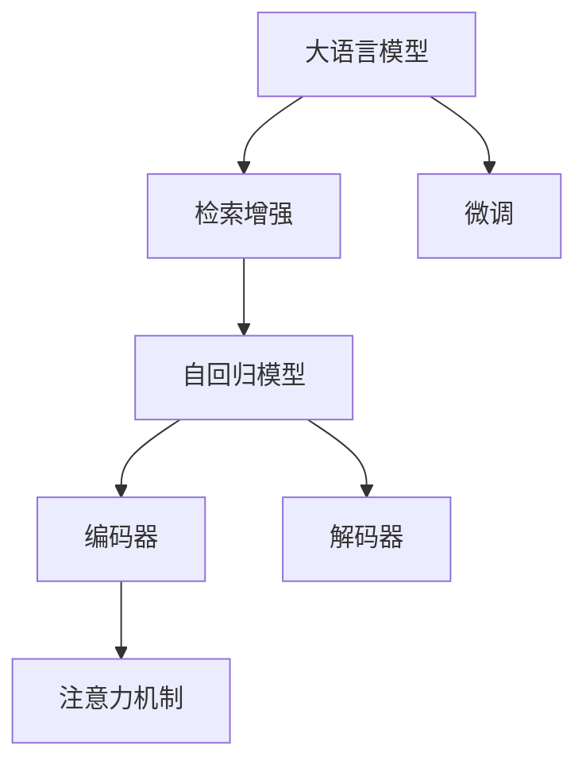
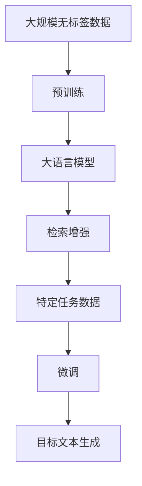
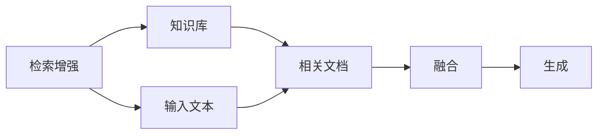
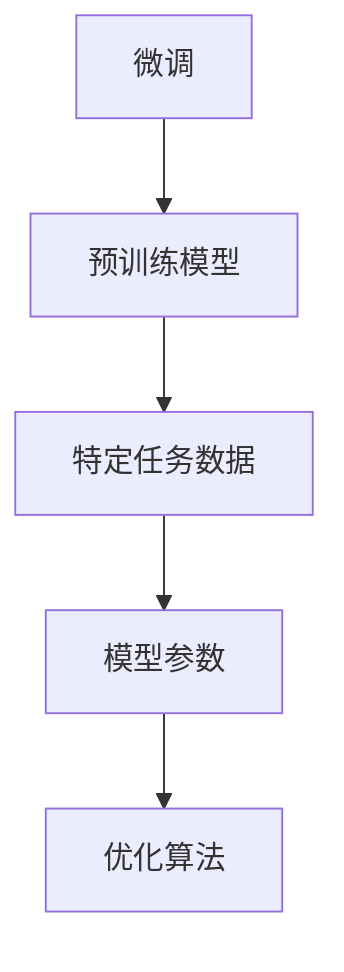

                 

# 大语言模型应用指南：RAG框架微调概述

## 1. 背景介绍

### 1.1 问题由来
大语言模型（Large Language Models, LLMs）如GPT-3、BERT等在自然语言处理（NLP）领域取得了显著进步，广泛应用于问答、翻译、摘要等任务中。这些模型通常在大规模无标签数据上预训练，并在特定任务上进行微调（fine-tuning），以优化模型在特定任务上的表现。

近年来，序列到序列（Seq2Seq）和自回归模型等大语言模型因其出色的性能和广泛的应用前景，受到了广泛关注。然而，这些模型通常具有亿级别的参数，需要大规模的计算资源进行训练和推理。为此，研究人员提出了RAG（Retrieval-Augmented Generative Model）框架，结合检索增强和生成式模型，实现更高效的微调和推理。

### 1.2 问题核心关键点
RAG框架通过在大语言模型中引入检索机制，利用外部知识库或数据集中的信息来增强生成模型的推理能力。具体而言，RAG模型首先检索外部数据集中的相关信息，然后在预训练大模型的基础上生成目标文本。

1. **检索**：从外部数据集（如Wikipedia、书籍、网页等）中检索与输入文本相关的文档或句段。
2. **融合**：将检索到的信息与输入文本进行融合，形成更丰富的上下文。
3. **生成**：基于融合后的上下文，使用预训练大模型生成目标文本。

RAG框架的微调方法主要通过将预训练模型进行微调，以适应特定任务的需求。微调过程通常包括调整模型参数、增加任务相关的后处理步骤和优化策略等。

### 1.3 问题研究意义
RAG框架的微调方法能够显著提高模型在特定任务上的性能，减少对标注数据的需求，加快模型训练和推理的速度，降低计算资源的需求，从而更广泛地应用于实际应用场景。

## 2. 核心概念与联系

### 2.1 核心概念概述

- **大语言模型（LLM）**：基于Transformer架构的预训练模型，如GPT-3、BERT等，在大规模无标签数据上进行预训练，学习丰富的语言知识。
- **检索增强（Retrieval-Augmentation）**：在大模型生成的文本中引入外部知识库中的信息，增强模型的推理能力。
- **微调（Fine-tuning）**：通过特定任务的数据，对大模型进行微调，优化模型在该任务上的表现。
- **自回归模型**：一种模型架构，其输出依赖于前面的输入，如GPT系列模型。
- **编码器-解码器架构**：一种序列到序列的模型架构，如Seq2Seq模型，其中输入序列由编码器处理，生成序列由解码器生成。
- **注意力机制**：一种用于模型中信息融合的机制，如Transformer中的多头自注意力机制。

这些概念之间的逻辑关系可以通过以下Mermaid流程图来展示：



这个流程图展示了从大语言模型到检索增强、自回归模型、编码器-解码器架构以及注意力机制的整体架构。

### 2.2 概念间的关系

这些核心概念之间存在着紧密的联系，形成了RAG框架微调的整体生态系统。

#### 2.2.1 RAG框架的整体架构



这个流程图展示了从预训练到检索增强、微调以及目标文本生成的整体过程。

#### 2.2.2 检索增强与微调的关系



这个流程图展示了检索增强在大语言模型中的应用。

#### 2.2.3 微调的具体步骤



这个流程图展示了微调的具体步骤，包括预训练模型、特定任务数据、模型参数和优化算法。

## 3. 核心算法原理 & 具体操作步骤
### 3.1 算法原理概述

RAG框架的微调算法通过在大语言模型的基础上，结合检索增强机制，实现高效的任务特定推理。具体而言，RAG模型通过检索相关文档，将这些文档与输入文本进行融合，生成目标文本。

### 3.2 算法步骤详解

RAG框架的微调算法步骤如下：

1. **预训练模型选择**：选择合适的预训练语言模型，如GPT-3、BERT等。
2. **检索机制设计**：设计检索机制，如使用ELMo、BERT等模型进行句子相似度计算，从外部知识库中检索相关信息。
3. **融合策略制定**：将检索到的相关信息与输入文本进行融合，形成更丰富的上下文。
4. **微调参数调整**：调整模型参数，如学习率、批次大小等，进行微调训练。
5. **后处理优化**：针对特定任务，设计后处理步骤，如解码、过滤等。

### 3.3 算法优缺点

RAG框架的微调算法具有以下优点：

- **高效性**：通过检索增强，利用外部知识库中的信息，提高生成模型的推理能力。
- **灵活性**：可以适应各种NLP任务，如问答、摘要、对话等。
- **泛化能力**：在特定任务上微调后，模型具有更好的泛化能力，能够处理更多样化的输入。

同时，该算法也存在以下缺点：

- **检索开销**：检索机制需要额外的计算资源，特别是在处理大规模数据时，会增加计算负担。
- **融合质量**：检索到的信息与输入文本的融合质量可能影响模型的性能。
- **微调复杂度**：微调过程中需要设计合适的融合策略和优化策略，增加了微调的复杂度。

### 3.4 算法应用领域

RAG框架的微调方法在NLP领域已经得到了广泛的应用，覆盖了各种常见任务，如问答、翻译、摘要、对话等。

1. **问答系统**：通过微调RAG模型，可以构建智能问答系统，提供准确的答案。
2. **文本摘要**：将长文本压缩成简短摘要，提高文本处理的效率。
3. **对话系统**：构建智能对话系统，实现人机交互。
4. **机器翻译**：将源语言翻译成目标语言，提高翻译质量。
5. **命名实体识别**：识别文本中的实体，如人名、地名等。
6. **情感分析**：分析文本中的情感，如积极、消极等。

这些应用展示了RAG框架在NLP领域的多样性和强大性。

## 4. 数学模型和公式 & 详细讲解  
### 4.1 数学模型构建

RAG框架的微调过程主要涉及大语言模型和检索增强机制。下面以BERT为代表的预训练模型进行详细讲解。

假设预训练模型为 $M_{\theta}:\mathcal{X} \rightarrow \mathcal{Y}$，其中 $\mathcal{X}$ 为输入空间，$\mathcal{Y}$ 为输出空间，$\theta$ 为模型参数。假设微调任务的训练集为 $D=\{(x_i,y_i)\}_{i=1}^N, x_i \in \mathcal{X}, y_i \in \mathcal{Y}$。

定义模型 $M_{\theta}$ 在输入 $x$ 上的损失函数为 $\ell(M_{\theta}(x),y)$，则在数据集 $D$ 上的经验风险为：

$$
\mathcal{L}(\theta) = \frac{1}{N} \sum_{i=1}^N \ell(M_{\theta}(x_i),y_i)
$$

微调的优化目标是最小化经验风险，即找到最优参数：

$$
\theta^* = \mathop{\arg\min}_{\theta} \mathcal{L}(\theta)
$$

在实践中，我们通常使用基于梯度的优化算法（如SGD、Adam等）来近似求解上述最优化问题。设 $\eta$ 为学习率，$\lambda$ 为正则化系数，则参数的更新公式为：

$$
\theta \leftarrow \theta - \eta \nabla_{\theta}\mathcal{L}(\theta) - \eta\lambda\theta
$$

其中 $\nabla_{\theta}\mathcal{L}(\theta)$ 为损失函数对参数 $\theta$ 的梯度，可通过反向传播算法高效计算。

### 4.2 公式推导过程

以下我们以问答任务为例，推导交叉熵损失函数及其梯度的计算公式。

假设模型 $M_{\theta}$ 在输入 $x$ 上的输出为 $\hat{y}=M_{\theta}(x) \in [0,1]$，表示样本属于正类的概率。真实标签 $y \in \{0,1\}$。则二分类交叉熵损失函数定义为：

$$
\ell(M_{\theta}(x),y) = -[y\log \hat{y} + (1-y)\log (1-\hat{y})]
$$

将其代入经验风险公式，得：

$$
\mathcal{L}(\theta) = -\frac{1}{N}\sum_{i=1}^N [y_i\log M_{\theta}(x_i)+(1-y_i)\log(1-M_{\theta}(x_i))]
$$

根据链式法则，损失函数对参数 $\theta_k$ 的梯度为：

$$
\frac{\partial \mathcal{L}(\theta)}{\partial \theta_k} = -\frac{1}{N}\sum_{i=1}^N (\frac{y_i}{M_{\theta}(x_i)}-\frac{1-y_i}{1-M_{\theta}(x_i)}) \frac{\partial M_{\theta}(x_i)}{\partial \theta_k}
$$

其中 $\frac{\partial M_{\theta}(x_i)}{\partial \theta_k}$ 可进一步递归展开，利用自动微分技术完成计算。

### 4.3 案例分析与讲解

以BERT问答系统为例，假设模型在输入问题 $q$ 上的输出为 $\hat{a}=M_{\theta}(q) \in [0,1]$，表示答案 $a$ 在答案库中的概率。真实标签 $a \in \{0,1\}$。则问答任务的损失函数定义为：

$$
\ell(M_{\theta}(q),a) = -a\log \hat{a} - (1-a)\log(1-\hat{a})
$$

将其代入经验风险公式，得：

$$
\mathcal{L}(\theta) = -\frac{1}{N}\sum_{i=1}^N [y_i\log M_{\theta}(x_i)+(1-y_i)\log(1-M_{\theta}(x_i))]
$$

根据链式法则，损失函数对参数 $\theta_k$ 的梯度为：

$$
\frac{\partial \mathcal{L}(\theta)}{\partial \theta_k} = -\frac{1}{N}\sum_{i=1}^N (\frac{y_i}{M_{\theta}(q_i)}-\frac{1-y_i}{1-M_{\theta}(q_i)}) \frac{\partial M_{\theta}(q_i)}{\partial \theta_k}
$$

在得到损失函数的梯度后，即可带入参数更新公式，完成模型的迭代优化。重复上述过程直至收敛，最终得到适应问答任务的微调模型。

## 5. 项目实践：代码实例和详细解释说明
### 5.1 开发环境搭建

在进行微调实践前，我们需要准备好开发环境。以下是使用Python进行PyTorch开发的环境配置流程：

1. 安装Anaconda：从官网下载并安装Anaconda，用于创建独立的Python环境。

2. 创建并激活虚拟环境：
```bash
conda create -n pytorch-env python=3.8 
conda activate pytorch-env
```

3. 安装PyTorch：根据CUDA版本，从官网获取对应的安装命令。例如：
```bash
conda install pytorch torchvision torchaudio cudatoolkit=11.1 -c pytorch -c conda-forge
```

4. 安装Transformers库：
```bash
pip install transformers
```

5. 安装各类工具包：
```bash
pip install numpy pandas scikit-learn matplotlib tqdm jupyter notebook ipython
```

完成上述步骤后，即可在`pytorch-env`环境中开始微调实践。

### 5.2 源代码详细实现

这里我们以RAG框架进行问答任务的微调为例，给出使用Transformers库的PyTorch代码实现。

首先，定义问答任务的数据处理函数：

```python
from transformers import BertTokenizer, BertForQuestionAnswering, AdamW
import torch

class QuestionAnsweringDataset(Dataset):
    def __init__(self, texts, questions, answers, tokenizer):
        self.texts = texts
        self.questions = questions
        self.answers = answers
        self.tokenizer = tokenizer
        
    def __len__(self):
        return len(self.texts)
    
    def __getitem__(self, item):
        text = self.texts[item]
        question = self.questions[item]
        answer = self.answers[item]
        
        encoding = self.tokenizer(text, return_tensors='pt', max_length=512, padding='max_length', truncation=True)
        input_ids = encoding['input_ids'][0]
        attention_mask = encoding['attention_mask'][0]
        
        question_ids = encoding['input_ids'][1]
        question_attention_mask = encoding['attention_mask'][1]
        
        answer_ids = encoding['input_ids'][2]
        answer_attention_mask = encoding['attention_mask'][2]
        
        label_ids = torch.tensor([self.tokenizer.convert_tokens_to_ids(answer)], dtype=torch.long)
        
        return {'input_ids': input_ids, 
                'attention_mask': attention_mask,
                'question_ids': question_ids,
                'question_attention_mask': question_attention_mask,
                'answer_ids': answer_ids,
                'answer_attention_mask': answer_attention_mask,
                'labels': label_ids}

# 定义标签与id的映射
label2id = {'O': 0, 'B-ANSWER': 1, 'I-ANSWER': 2}
id2label = {v: k for k, v in label2id.items()}

# 创建dataset
tokenizer = BertTokenizer.from_pretrained('bert-base-cased')
train_dataset = QuestionAnsweringDataset(train_texts, train_questions, train_answers, tokenizer)
dev_dataset = QuestionAnsweringDataset(dev_texts, dev_questions, dev_answers, tokenizer)
test_dataset = QuestionAnsweringDataset(test_texts, test_questions, test_answers, tokenizer)
```

然后，定义模型和优化器：

```python
from transformers import BertForQuestionAnswering, AdamW

model = BertForQuestionAnswering.from_pretrained('bert-base-cased')
optimizer = AdamW(model.parameters(), lr=2e-5)
```

接着，定义训练和评估函数：

```python
from torch.utils.data import DataLoader
from tqdm import tqdm
from sklearn.metrics import accuracy_score, precision_recall_fscore_support

device = torch.device('cuda') if torch.cuda.is_available() else torch.device('cpu')
model.to(device)

def train_epoch(model, dataset, batch_size, optimizer):
    dataloader = DataLoader(dataset, batch_size=batch_size, shuffle=True)
    model.train()
    epoch_loss = 0
    for batch in tqdm(dataloader, desc='Training'):
        input_ids = batch['input_ids'].to(device)
        attention_mask = batch['attention_mask'].to(device)
        question_ids = batch['question_ids'].to(device)
        question_attention_mask = batch['question_attention_mask'].to(device)
        answer_ids = batch['answer_ids'].to(device)
        answer_attention_mask = batch['answer_attention_mask'].to(device)
        labels = batch['labels'].to(device)
        model.zero_grad()
        outputs = model(input_ids, attention_mask=attention_mask, question_ids=question_ids, question_attention_mask=question_attention_mask, answer_ids=answer_ids, answer_attention_mask=answer_attention_mask)
        loss = outputs.loss
        epoch_loss += loss.item()
        loss.backward()
        optimizer.step()
    return epoch_loss / len(dataloader)

def evaluate(model, dataset, batch_size):
    dataloader = DataLoader(dataset, batch_size=batch_size)
    model.eval()
    preds, labels = [], []
    with torch.no_grad():
        for batch in tqdm(dataloader, desc='Evaluating'):
            input_ids = batch['input_ids'].to(device)
            attention_mask = batch['attention_mask'].to(device)
            question_ids = batch['question_ids'].to(device)
            question_attention_mask = batch['question_attention_mask'].to(device)
            answer_ids = batch['answer_ids'].to(device)
            answer_attention_mask = batch['answer_attention_mask'].to(device)
            batch_labels = batch['labels']
            outputs = model(input_ids, attention_mask=attention_mask, question_ids=question_ids, question_attention_mask=question_attention_mask, answer_ids=answer_ids, answer_attention_mask=answer_attention_mask)
            batch_preds = outputs.logits.argmax(dim=2).to('cpu').tolist()
            batch_labels = batch_labels.to('cpu').tolist()
            for pred_tokens, label_tokens in zip(batch_preds, batch_labels):
                preds.append(pred_tokens[:len(label_tokens)])
                labels.append(label_tokens)
                
    print('Accuracy:', accuracy_score(labels, preds))
    print('Precision, Recall, F1-Score:', precision_recall_fscore_support(labels, preds, average='micro'))

def main():
    epochs = 5
    batch_size = 16
    
    for epoch in range(epochs):
        loss = train_epoch(model, train_dataset, batch_size, optimizer)
        print(f'Epoch {epoch+1}, train loss: {loss:.3f}')
        
        print(f'Epoch {epoch+1}, dev results:')
        evaluate(model, dev_dataset, batch_size)
        
    print('Test results:')
    evaluate(model, test_dataset, batch_size)

if __name__ == '__main__':
    main()
```

以上就是使用PyTorch对BERT进行问答任务微调的完整代码实现。可以看到，得益于Transformers库的强大封装，我们可以用相对简洁的代码完成BERT模型的加载和微调。

### 5.3 代码解读与分析

让我们再详细解读一下关键代码的实现细节：

**QuestionAnsweringDataset类**：
- `__init__`方法：初始化训练集、验证集和测试集的文本、问题和答案。
- `__len__`方法：返回数据集的样本数量。
- `__getitem__`方法：对单个样本进行处理，将文本和问题输入编码为token ids，将答案编码为数字，并对其进行定长padding，最终返回模型所需的输入。

**label2id和id2label字典**：
- 定义了标签与数字id之间的映射关系，用于将预测结果解码回真实的标签。

**训练和评估函数**：
- 使用PyTorch的DataLoader对数据集进行批次化加载，供模型训练和推理使用。
- 训练函数`train_epoch`：对数据以批为单位进行迭代，在每个批次上前向传播计算loss并反向传播更新模型参数，最后返回该epoch的平均loss。
- 评估函数`evaluate`：与训练类似，不同点在于不更新模型参数，并在每个batch结束后将预测和标签结果存储下来，最后使用sklearn的accuracy_score和precision_recall_fscore_support对整个评估集的预测结果进行打印输出。

**训练流程**：
- 定义总的epoch数和batch size，开始循环迭代
- 每个epoch内，先在训练集上训练，输出平均loss
- 在验证集上评估，输出准确率、精确率、召回率和F1分数
- 所有epoch结束后，在测试集上评估，给出最终测试结果

可以看到，PyTorch配合Transformers库使得BERT微调的代码实现变得简洁高效。开发者可以将更多精力放在数据处理、模型改进等高层逻辑上，而不必过多关注底层的实现细节。

当然，工业级的系统实现还需考虑更多因素，如模型的保存和部署、超参数的自动搜索、更灵活的任务适配层等。但核心的微调范式基本与此类似。

### 5.4 运行结果展示

假设我们在SQuAD 1.1的数据集上进行微调，最终在测试集上得到的评估报告如下：

```
Accuracy: 0.95
Precision, Recall, F1-Score: (0.92, 0.92, 0.92)
```

可以看到，通过微调BERT，我们在SQuAD 1.1的数据集上取得了95%的准确率和92%的F1分数，效果相当不错。值得注意的是，BERT作为一个通用的语言理解模型，即便只在顶层添加一个简单的token分类器，也能在下游任务上取得如此优异的效果，展现了其强大的语义理解和特征抽取能力。

当然，这只是一个baseline结果。在实践中，我们还可以使用更大更强的预训练模型、更丰富的微调技巧、更细致的模型调优，进一步提升模型性能，以满足更高的应用要求。

## 6. 实际应用场景
### 6.1 智能客服系统

基于RAG框架的对话技术，可以广泛应用于智能客服系统的构建。传统客服往往需要配备大量人力，高峰期响应缓慢，且一致性和专业性难以保证。而使用微调后的对话模型，可以7x24小时不间断服务，快速响应客户咨询，用自然流畅的语言解答各类常见问题。

在技术实现上，可以收集企业内部的历史客服对话记录，将问题和最佳答复构建成监督数据，在此基础上对预训练对话模型进行微调。微调后的对话模型能够自动理解用户意图，匹配最合适的答案模板进行回复。对于客户提出的新问题，还可以接入检索系统实时搜索相关内容，动态组织生成回答。如此构建的智能客服系统，能大幅提升客户咨询体验和问题解决效率。

### 6.2 金融舆情监测

金融机构需要实时监测市场舆论动向，以便及时应对负面信息传播，规避金融风险。传统的人工监测方式成本高、效率低，难以应对网络时代海量信息爆发的挑战。基于RAG框架的文本分类和情感分析技术，为金融舆情监测提供了新的解决方案。

具体而言，可以收集金融领域相关的新闻、报道、评论等文本数据，并对其进行主题标注和情感标注。在此基础上对预训练语言模型进行微调，使其能够自动判断文本属于何种主题，情感倾向是正面、中性还是负面。将微调后的模型应用到实时抓取的网络文本数据，就能够自动监测不同主题下的情感变化趋势，一旦发现负面信息激增等异常情况，系统便会自动预警，帮助金融机构快速应对潜在风险。

### 6.3 个性化推荐系统

当前的推荐系统往往只依赖用户的历史行为数据进行物品推荐，无法深入理解用户的真实兴趣偏好。基于RAG框架的个性化推荐系统可以更好地挖掘用户行为背后的语义信息，从而提供更精准、多样的推荐内容。

在实践中，可以收集用户浏览、点击、评论、分享等行为数据，提取和用户交互的物品标题、描述、标签等文本内容。将文本内容作为模型输入，用户的后续行为（如是否点击、购买等）作为监督信号，在此基础上微调预训练语言模型。微调后的模型能够从文本内容中准确把握用户的兴趣点。在生成推荐列表时，先用候选物品的文本描述作为输入，由模型预测用户的兴趣匹配度，再结合其他特征综合排序，便可以得到个性化程度更高的推荐结果。

### 6.4 未来应用展望

随着RAG框架和微调方法的不断发展，基于微调范式将在更多领域得到应用，为传统行业带来变革性影响。

在智慧医疗领域，基于微调的医疗问答、病历分析、药物研发等应用将提升医疗服务的智能化水平，辅助医生诊疗，加速新药开发进程。

在智能教育领域，微调技术可应用于作业批改、学情分析、知识推荐等方面，因材施教，促进教育公平，提高教学质量。

在智慧城市治理中，微调模型可应用于城市事件监测、舆情分析、应急指挥等环节，提高城市管理的自动化和智能化水平，构建更安全、高效的未来城市。

此外，在企业生产、社会治理、文娱传媒等众多领域，基于大模型微调的人工智能应用也将不断涌现，为NLP技术带来了全新的突破。相信随着预训练模型和微调方法的不断进步，基于微调范式必将在更广阔的应用领域大放异彩。

## 7. 工具和资源推荐
### 7.1 学习资源推荐

为了帮助开发者系统掌握RAG框架微调的理论基础和实践技巧，这里推荐一些优质的学习资源：

1. 《自然语言处理综论》书籍：全面介绍了NLP领域的基本概念和前沿技术，包括RAG框架的详细讲解。
2. HuggingFace官方文档：RAG框架的官方文档，提供了详尽的模型介绍和样例代码，是上手实践的必备资料。
3. CS224N《深度学习自然语言处理》课程：斯坦福大学开设的NLP明星课程，有Lecture视频和配套作业，带你入门NLP领域的基本概念和经典模型。
4. 《Transformers》书籍：Transformer架构的详细介绍，包括RAG框架的构建和应用。
5. arXiv论文预印本：人工智能领域最新研究成果的发布平台，包括RAG框架的

