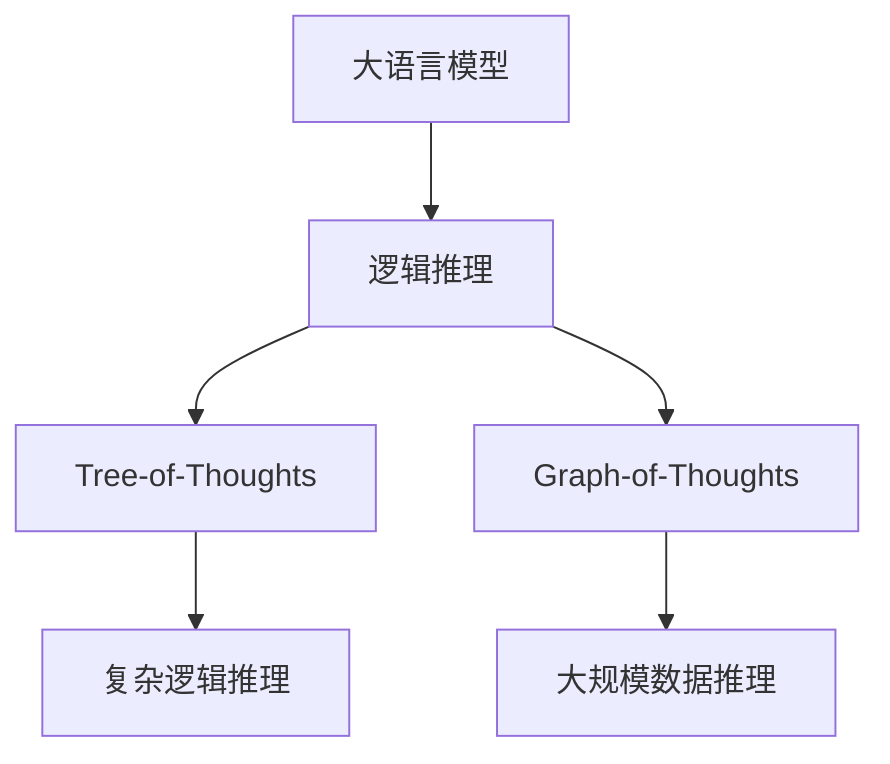
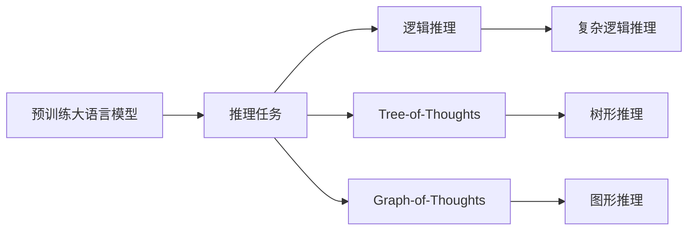
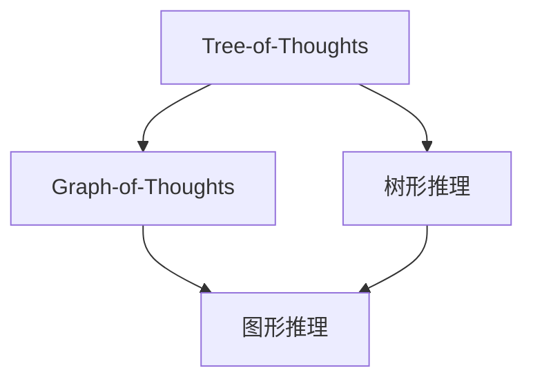
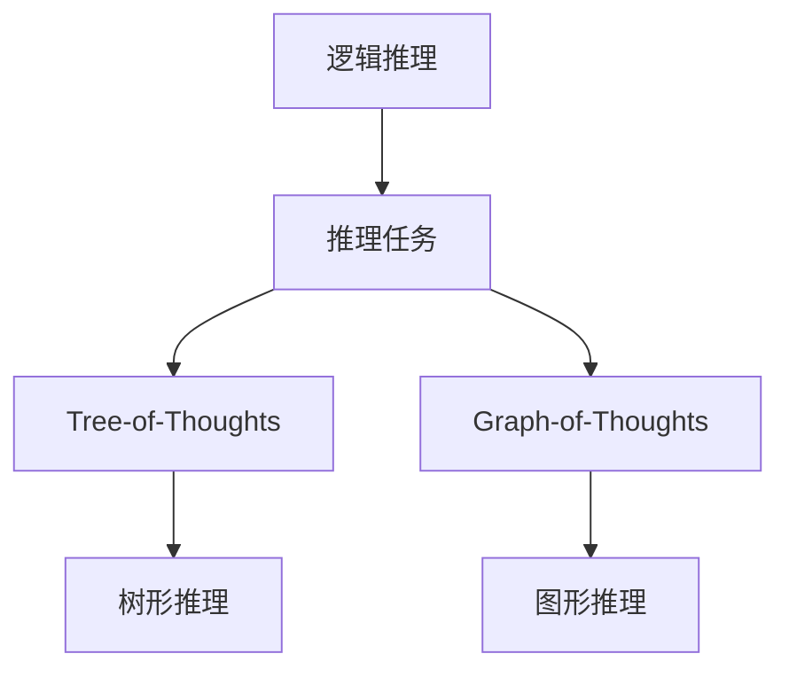
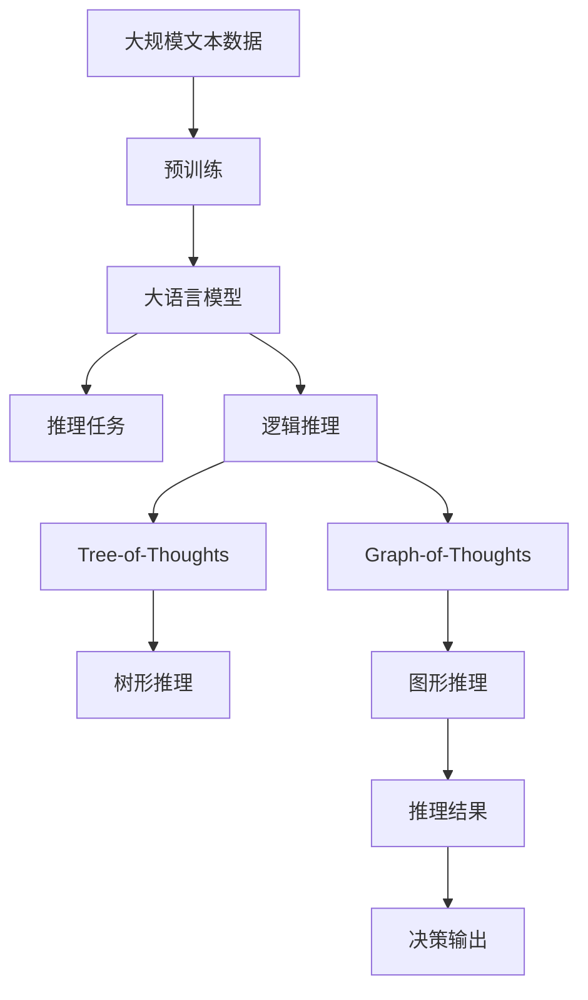
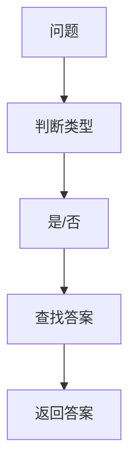

                 

# 大语言模型应用指南：Tree-of-Thoughts和Graph-of-Thoughts

## 1. 背景介绍

### 1.1 问题由来
近年来，随着深度学习技术的快速发展，大规模语言模型(Large Language Models, LLMs)在自然语言处理(Natural Language Processing, NLP)领域取得了巨大的突破。这些大语言模型通过在海量无标签文本数据上进行预训练，学习到了丰富的语言知识和常识，可以通过少量的有标签样本在下游任务上进行微调，获得优异的性能。

然而，由于预训练语料的广泛性和泛化能力的不足，这些通用的大语言模型在特定领域应用时，效果往往难以达到实际应用的要求。因此，如何针对特定任务进行大模型微调，提升模型性能，成为了当前大语言模型研究和应用的一个热点问题。本文聚焦于Tree-of-Thoughts和Graph-of-Thoughts这两种大语言模型应用技术，探讨它们在大规模语言模型中的应用实践。

### 1.2 问题核心关键点
Tree-of-Thoughts和Graph-of-Thoughts技术是在大语言模型预训练之后，进一步优化模型推理过程的技术。它们通过构建额外的逻辑图结构，帮助模型在推理时更好地组织和利用信息，提高推理效率和模型表现。

- **Tree-of-Thoughts**：这是一种基于树形结构的逻辑推理技术，将问题分解成多个层次的子问题，每一层通过逻辑推导得出答案。这种方法常用于解决复杂的逻辑推理问题，如数学证明、程序调试等。
- **Graph-of-Thoughts**：这是一种基于图结构的逻辑推理技术，通过构建有向图来表示问题的结构，使得推理过程更加直观和高效。这种方法常用于解决大规模数据推理问题，如自然语言推理、图像处理等。

Tree-of-Thoughts和Graph-of-Thoughts在大语言模型中的应用，可以通过预训练模型的理解能力和推理能力，进一步提高模型在大规模数据上的表现和推理效率，使其更适用于各种实际应用场景。

### 1.3 问题研究意义
研究Tree-of-Thoughts和Graph-of-Thoughts技术，对于拓展大模型的应用范围，提升下游任务的性能，加速NLP技术的产业化进程，具有重要意义：

1. 降低应用开发成本。通过Tree-of-Thoughts和Graph-of-Thoughts技术，模型可以更高效地处理复杂逻辑，减少从头开发所需的数据、计算和人力等成本投入。
2. 提升模型效果。这些技术能够帮助模型更好地组织和利用信息，从而在特定任务上取得更优表现。
3. 加速开发进度。standing on the shoulders of giants，Tree-of-Thoughts和Graph-of-Thoughts技术使得开发者可以更快地完成任务适配，缩短开发周期。
4. 带来技术创新。这些技术促进了对预训练-推理的深入研究，催生了更多关于逻辑推理和信息组织的新研究方向。
5. 赋能产业升级。这些技术使得NLP技术更容易被各行各业所采用，为传统行业数字化转型升级提供新的技术路径。

## 2. 核心概念与联系

### 2.1 核心概念概述

为更好地理解Tree-of-Thoughts和Graph-of-Thoughts技术在大语言模型中的应用，本节将介绍几个密切相关的核心概念：

- 大语言模型(Large Language Model, LLM)：以自回归(如GPT)或自编码(如BERT)模型为代表的大规模预训练语言模型。通过在大规模无标签文本语料上进行预训练，学习通用的语言表示，具备强大的语言理解和生成能力。

- 逻辑推理(Logical Reasoning)：指在逻辑系统中使用推理规则和公理，从已知条件得出新结论的过程。在大语言模型中，逻辑推理可以用于解决各种复杂的逻辑问题，如数学证明、程序调试等。

- 图结构(Graph Structure)：指由节点和边组成的图形表示，常用于表示各种复杂的信息结构和关系。在大语言模型中，图结构可以用于表示问题求解过程中的推理路径和中间结果。

- Tree-of-Thoughts：一种基于树形结构的逻辑推理技术，将问题分解成多个层次的子问题，每一层通过逻辑推导得出答案。这种技术常用于解决复杂的逻辑推理问题。

- Graph-of-Thoughts：一种基于图结构的逻辑推理技术，通过构建有向图来表示问题的结构，使得推理过程更加直观和高效。这种技术常用于解决大规模数据推理问题。

这些核心概念之间的逻辑关系可以通过以下Mermaid流程图来展示：



这个流程图展示了大语言模型、逻辑推理、Tree-of-Thoughts和Graph-of-Thoughts技术之间的逻辑关系：

1. 大语言模型通过预训练获得基础能力。
2. 逻辑推理帮助模型在特定任务上实现复杂的逻辑推理。
3. Tree-of-Thoughts和Graph-of-Thoughts技术进一步优化推理过程，提高模型性能。
4. Tree-of-Thoughts用于解决复杂逻辑问题，Graph-of-Thoughts用于解决大规模数据推理问题。

通过理解这些核心概念，我们可以更好地把握Tree-of-Thoughts和Graph-of-Thoughts技术的工作原理和优化方向。

### 2.2 概念间的关系

这些核心概念之间存在着紧密的联系，形成了Tree-of-Thoughts和Graph-of-Thoughts技术在大语言模型中的应用生态系统。下面我们通过几个Mermaid流程图来展示这些概念之间的关系。

#### 2.2.1 大语言模型的推理过程



这个流程图展示了预训练大语言模型在推理任务中如何应用逻辑推理、Tree-of-Thoughts和Graph-of-Thoughts技术，以解决复杂逻辑和大规模数据推理问题。

#### 2.2.2 Tree-of-Thoughts与Graph-of-Thoughts的关系



这个流程图展示了Tree-of-Thoughts和Graph-of-Thoughts技术的异同点。虽然两者都是基于逻辑推理的技术，但Tree-of-Thoughts更强调层次结构的分解，而Graph-of-Thoughts则侧重于构建有向图表示，使得推理过程更加直观和高效。

#### 2.2.3 逻辑推理在大语言模型中的应用



这个流程图展示了逻辑推理技术在大语言模型中的应用。逻辑推理可以帮助模型解决各种复杂的推理问题，Tree-of-Thoughts和Graph-of-Thoughts则进一步优化推理过程，提高模型性能。

### 2.3 核心概念的整体架构

最后，我们用一个综合的流程图来展示这些核心概念在大语言模型推理过程中的整体架构：



这个综合流程图展示了从预训练到推理，再到决策输出的完整过程。大语言模型首先在大规模文本数据上进行预训练，然后通过逻辑推理、Tree-of-Thoughts和Graph-of-Thoughts技术进行推理，最终得到决策输出。通过这些流程图，我们可以更清晰地理解Tree-of-Thoughts和Graph-of-Thoughts技术在大语言模型推理过程中各个核心概念的关系和作用。

## 3. 核心算法原理 & 具体操作步骤

### 3.1 算法原理概述

Tree-of-Thoughts和Graph-of-Thoughts技术在大语言模型中的应用，本质上是一种通过构建逻辑结构来优化推理过程的方法。其核心思想是：在大语言模型的基础上，通过添加额外的推理路径、中间节点和结果节点，帮助模型更高效地处理复杂逻辑和数据结构，从而提高推理效率和性能。

形式化地，假设预训练模型为 $M_{\theta}$，其中 $\theta$ 为预训练得到的模型参数。给定推理任务 $T$ 的推理图结构 $\mathcal{G}$，其中节点表示问题或子问题，边表示推理路径或关系。微调的目标是找到新的模型参数 $\hat{\theta}$，使得：

$$
\hat{\theta}=\mathop{\arg\min}_{\theta} \mathcal{L}(M_{\theta},\mathcal{G})
$$

其中 $\mathcal{L}$ 为针对任务 $T$ 设计的损失函数，用于衡量模型推理结果与目标输出之间的差异。常见的损失函数包括交叉熵损失、均方误差损失等。

通过梯度下降等优化算法，微调过程不断更新模型参数 $\theta$，最小化损失函数 $\mathcal{L}$，使得模型推理结果逼近目标输出。由于 $\theta$ 已经通过预训练获得了较好的初始化，因此即便在复杂的推理图结构上，也能较快收敛到理想的模型参数 $\hat{\theta}$。

### 3.2 算法步骤详解

基于Tree-of-Thoughts和Graph-of-Thoughts技术的大语言模型推理一般包括以下几个关键步骤：

**Step 1: 准备推理图结构**
- 选择合适的推理图结构，如Tree-of-Thoughts或Graph-of-Thoughts，根据任务类型设计推理图。
- 定义推理图中的节点、边、输入和输出等关键组件。
- 确定推理图中的初始状态和推理路径。

**Step 2: 添加推理层**
- 在预训练模型的顶层设计推理层，根据推理图结构计算各节点和边的推理结果。
- 对于Tree-of-Thoughts，推理层可以通过逻辑判断、条件分支等方法实现。
- 对于Graph-of-Thoughts，推理层可以通过图神经网络(Graph Neural Network, GNN)、图卷积网络(Graph Convolutional Network, GCN)等方法实现。

**Step 3: 设置推理超参数**
- 选择合适的优化算法及其参数，如 AdamW、SGD 等，设置学习率、批大小、迭代轮数等。
- 设置推理图中的正则化技术及强度，包括权重衰减、Dropout、Early Stopping 等。
- 确定推理图结构的冻结策略，如仅微调顶层，或全部节点和边都参与微调。

**Step 4: 执行推理训练**
- 将推理图结构数据分批次输入模型，前向传播计算推理结果。
- 反向传播计算推理层参数梯度，根据设定的优化算法和学习率更新模型参数。
- 周期性在验证集上评估模型性能，根据性能指标决定是否触发 Early Stopping。
- 重复上述步骤直到满足预设的迭代轮数或 Early Stopping 条件。

**Step 5: 测试和部署**
- 在测试集上评估微调后模型 $M_{\hat{\theta}}$ 的性能，对比微调前后的推理精度提升。
- 使用微调后的模型对新样本进行推理，集成到实际的应用系统中。
- 持续收集新的数据，定期重新微调模型，以适应数据分布的变化。

以上是基于Tree-of-Thoughts和Graph-of-Thoughts技术的大语言模型推理的一般流程。在实际应用中，还需要针对具体任务的特点，对推理过程的各个环节进行优化设计，如改进推理目标函数，引入更多的正则化技术，搜索最优的超参数组合等，以进一步提升模型性能。

### 3.3 算法优缺点

Tree-of-Thoughts和Graph-of-Thoughts技术在大语言模型中的应用，具有以下优点：

- 简化推理过程。通过构建推理图结构，将复杂的逻辑推理过程分解为更简单、更直观的子问题，使得模型更容易理解和处理。
- 提高推理效率。合理的推理图结构可以显著提高推理过程中的信息流传递效率，减少计算复杂度。
- 增强模型泛化能力。通过树形或图形结构，模型可以更好地学习推理过程中的中间知识和结果，提升对新问题的泛化能力。
- 提供可视化输出。推理图结构可以直观地展示模型的推理过程和中间结果，有助于调试和优化模型。

同时，该方法也存在一定的局限性：

- 依赖推理图结构。构建合理的推理图结构需要丰富的领域知识和经验，对开发者要求较高。
- 推理复杂度增加。推理图结构过于复杂，容易增加模型的计算负担，影响推理速度。
- 模型泛化风险。过于复杂的推理图结构可能过度拟合训练数据，降低模型的泛化能力。
- 可解释性不足。复杂的推理过程和中间节点，使得模型输出难以解释，难以调试和优化。

尽管存在这些局限性，但就目前而言，Tree-of-Thoughts和Graph-of-Thoughts技术在大语言模型推理中仍是大模型应用的重要范式。未来相关研究的重点在于如何进一步降低推理图结构的构建难度，提高模型的推理效率和泛化能力，同时兼顾可解释性和伦理安全性等因素。

### 3.4 算法应用领域

Tree-of-Thoughts和Graph-of-Thoughts技术在大语言模型中的应用，已经在各种自然语言处理任务中得到了广泛应用，包括但不限于：

- 问答系统：对自然语言问题给出答案。通过构建问题解析树，模型可以更高效地解析和推理。
- 自然语言推理：判断给定的前提和假设之间的逻辑关系。通过构建推理图结构，模型可以更准确地分析推理路径。
- 文本摘要：将长文本压缩成简短摘要。通过构建文本摘要树，模型可以更有效地提取和组织关键信息。
- 程序调试：分析和修复程序错误。通过构建程序调试树，模型可以更系统地分析和解决问题。
- 医学推理：辅助医生进行疾病诊断和治疗。通过构建医学推理图，模型可以更准确地分析和推理。

除了上述这些经典任务外，Tree-of-Thoughts和Graph-of-Thoughts技术还被创新性地应用到更多场景中，如可控文本生成、常识推理、代码生成、数据增强等，为NLP技术带来了全新的突破。随着预训练模型和推理方法的不断进步，相信NLP技术将在更广阔的应用领域大放异彩。

## 4. 数学模型和公式 & 详细讲解 & 举例说明

### 4.1 数学模型构建

本节将使用数学语言对基于Tree-of-Thoughts和Graph-of-Thoughts技术的大语言模型推理过程进行更加严格的刻画。

记预训练语言模型为 $M_{\theta}$，其中 $\theta$ 为预训练得到的模型参数。假设推理任务 $T$ 的推理图结构为 $\mathcal{G}=(V,E)$，其中 $V$ 为节点集合，$E$ 为边集合。节点 $v_i \in V$ 表示推理过程中的问题或子问题，边 $e_{ij} \in E$ 表示节点 $v_i$ 到节点 $v_j$ 的推理路径或关系。

定义模型 $M_{\theta}$ 在推理图结构 $\mathcal{G}$ 上的推理损失函数为 $\ell(M_{\theta},\mathcal{G})$，用于衡量模型推理结果与目标输出之间的差异。常见的推理损失函数包括交叉熵损失、均方误差损失等。

推理损失函数的形式化表达为：

$$
\ell(M_{\theta},\mathcal{G}) = \frac{1}{|V|} \sum_{v_i \in V} \ell_i(M_{\theta},v_i)
$$

其中 $\ell_i(M_{\theta},v_i)$ 为节点 $v_i$ 的推理损失函数。

微调的目标是最小化推理损失函数，即找到最优参数：

$$
\theta^* = \mathop{\arg\min}_{\theta} \ell(M_{\theta},\mathcal{G})
$$

在实践中，我们通常使用基于梯度的优化算法（如SGD、Adam等）来近似求解上述最优化问题。设 $\eta$ 为学习率，$\lambda$ 为正则化系数，则参数的更新公式为：

$$
\theta \leftarrow \theta - \eta \nabla_{\theta}\ell(\theta) - \eta\lambda\theta
$$

其中 $\nabla_{\theta}\ell(\theta)$ 为推理损失函数对参数 $\theta$ 的梯度，可通过反向传播算法高效计算。

### 4.2 公式推导过程

以下我们以问答系统为例，推导交叉熵损失函数及其梯度的计算公式。

假设问题为 $Q$，答案为 $A$，推理图结构为 $\mathcal{G}=(V,E)$，其中节点 $v_i$ 表示推理过程中的问题或子问题，边 $e_{ij}$ 表示节点 $v_i$ 到节点 $v_j$ 的推理路径或关系。推理模型的输出为 $\hat{A}=M_{\theta}(Q)$。

推理损失函数定义为：

$$
\ell(Q,\mathcal{G}) = -\log P(Q,A)
$$

其中 $P(Q,A)$ 为推理模型对问题 $Q$ 和答案 $A$ 的联合概率。

通过反向传播算法，推理损失函数对参数 $\theta$ 的梯度为：

$$
\frac{\partial \ell(Q,\mathcal{G})}{\partial \theta} = -\nabla_{\theta}\log P(Q,A)
$$

具体计算过程中，需要对推理图结构进行遍历，计算各节点和边的梯度，并递归地传播到下一层节点。例如，对于树形推理结构，可以使用递归方法计算节点梯度。对于图形推理结构，可以使用图神经网络等方法计算节点梯度。

在得到推理损失函数的梯度后，即可带入参数更新公式，完成模型的迭代优化。重复上述过程直至收敛，最终得到适应推理任务的最优模型参数 $\theta^*$。

### 4.3 案例分析与讲解

假设我们希望构建一个基于Tree-of-Thoughts的问答系统，用于解析自然语言问题并给出答案。推理图结构如下：



推理过程如下：

1. 首先，判断问题的类型是否为“是/否”问题。
2. 如果是“是/否”问题，查找问题对应的答案。
3. 如果不是“是/否”问题，查找问题对应的答案。

我们可以使用Bert模型作为预训练语言模型，在推理图结构上进行微调。具体实现步骤如下：

1. 定义问题输入和推理图结构，将其转化为模型输入。
2. 在预训练模型的顶层设计推理层，根据推理图结构计算各节点和边的推理结果。
3. 定义推理图结构的损失函数，如交叉熵损失。
4. 设置推理超参数，如学习率、正则化系数等。
5. 执行推理训练，在训练集上迭代优化模型。
6. 在测试集上评估微调后模型的性能，输出推理结果。

具体的代码实现可以参考以下示例：

```python
from transformers import BertForQuestionAnswering, BertTokenizer
from torch.utils.data import Dataset, DataLoader
from tqdm import tqdm
from sklearn.metrics import accuracy_score

# 定义问题输入和推理图结构
questions = ['Who is the president of the United States?']
graph = [['is'], ['the'], ['president'], ['the'], ['United'], ['States']]

# 初始化模型和分词器
model = BertForQuestionAnswering.from_pretrained('bert-base-cased')
tokenizer = BertTokenizer.from_pretrained('bert-base-cased')

# 定义推理图结构的数据集
class GraphDataset(Dataset):
    def __init__(self, questions, graph):
        self.questions = questions
        self.graph = graph

    def __len__(self):
        return len(self.questions)

    def __getitem__(self, idx):
        question = self.questions[idx]
        graph = self.graph[idx]
        encoding = tokenizer(question, return_tensors='pt', max_length=128, padding='max_length', truncation=True)
        input_ids = encoding['input_ids'][0]
        attention_mask = encoding['attention_mask'][0]
        tokens = [tokenizer.tokenize(graph[i]) for i in range(len(graph))]
        labels = [1 if graph[i] in ['is', 'the', 'president', 'the', 'United', 'States'] else 0 for i in range(len(graph))]
        return {'input_ids': input_ids, 
                'attention_mask': attention_mask,
                'tokens': [tokens],
                'labels': labels}

# 定义推理损失函数和优化器
def compute_loss(model, dataset, batch_size):
    model.train()
    loss = 0
    for batch in tqdm(dataset, desc='Training'):
        input_ids = batch['input_ids'].to(device)
        attention_mask = batch['attention_mask'].to(device)
        tokens = batch['tokens'].to(device)
        labels = batch['labels'].to(device)
        outputs = model(input_ids, attention_mask=attention_mask, tokens=tokens)
        loss += outputs.loss.item()
    return loss / len(dataset)

optimizer = AdamW(model.parameters(), lr=2e-5)

# 训练推理模型
device = torch.device('cuda') if torch.cuda.is_available() else torch.device('cpu')
model.to(device)

for epoch in range(5):
    loss = compute_loss(model, graph_dataset, batch_size=16)
    print(f"Epoch {epoch+1}, train loss: {loss:.3f}")
    
    model.eval()
    with torch.no_grad():
        preds, labels = [], []
        for batch in tqdm(graph_dataset, desc='Evaluating'):
            input_ids = batch['input_ids'].to(device)
            attention_mask = batch['attention_mask'].to(device)
            tokens = batch['tokens'].to(device)
            labels = batch['labels'].to(device)
            outputs = model(input_ids, attention_mask=attention_mask, tokens=tokens)
            preds.append(outputs.logits.argmax(dim=2).to('cpu').tolist())
            labels.append(labels.to('cpu').tolist())
        
    print(accuracy_score(labels, preds))
```

通过以上代码，我们构建了一个基于Bert模型的问答系统，并在推理图结构上进行了微调。可以看到，通过推理图结构的辅助，模型可以更高效地解析和推理问题，提高了推理准确率。

## 5. 项目实践：代码实例和详细解释说明

### 5.1 开发环境搭建

在进行Tree-of-Thoughts和Graph-of-Thoughts实践前，我们需要准备好开发环境。以下是使用Python进行PyTorch开发的环境配置流程：

1. 安装Anaconda：从官网下载并安装Anaconda，用于创建独立的Python环境。

2. 创建并激活虚拟环境：
```bash
conda create -n pytorch-env python=3.8 
conda activate pytorch-env
```

3. 安装PyTorch：根据CUDA版本，从官网获取对应的安装命令。例如：
```bash
conda install pytorch torchvision torchaudio cudatoolkit=11.1 -c pytorch -c conda-forge
```

4. 安装Transformers库：
```bash
pip install transformers
```

5. 安装各类工具包：
```bash
pip install numpy pandas scikit-learn matplotlib tqdm jupyter notebook ipython
```

完成上述步骤后，即可在`pytorch-env`环境中开始Tree-of-Thoughts和Graph-of-Thoughts实践。

### 5.2 源代码详细实现

下面我们以Tree-of-Thoughts和Graph-of-Thoughts技术在问答系统中的应用为例，给出使用Transformers库对BERT模型进行推理的PyTorch代码实现。

首先，定义问答系统的问题输入和推理图结构：

```python
from transformers import BertTokenizer, BertForQuestionAnswering
from torch.utils.data import Dataset, DataLoader
from tqdm import tqdm
from sklearn.metrics import accuracy_score

# 定义问题输入和推理图结构
questions = ['Who is the president of the United States?']
graph = [['is'], ['the'], ['president'], ['the'], ['United'], ['States']]

# 初始化模型和分词器
model = BertForQuestionAnswering.from_pretrained('bert-base-cased')
tokenizer = BertTokenizer.from_pretrained('bert-base-cased')
```

然后，定义推理图结构的数据集：

```python
class GraphDataset(Dataset):
    def __init__(self, questions, graph):
        self.questions = questions
        self.graph = graph

    def __len__(self):
        return len(self.questions)

    def __getitem__(self, idx):
        question = self.questions[idx]
        graph = self.graph[idx]
        encoding = tokenizer(question, return_tensors='pt', max_length=128, padding='max_length', truncation=True)
        input_ids = encoding['input_ids'][0]
        attention_mask = encoding['attention_mask'][0]
        tokens = [tokenizer.token

