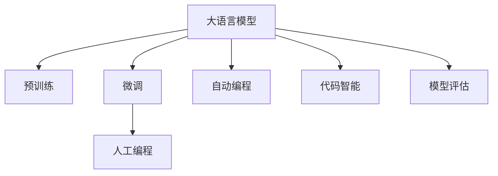
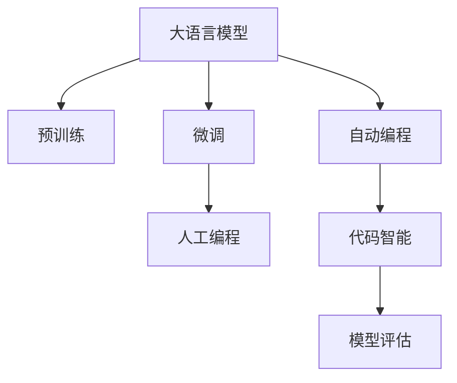
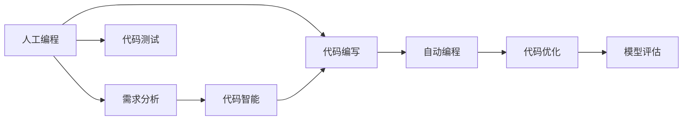
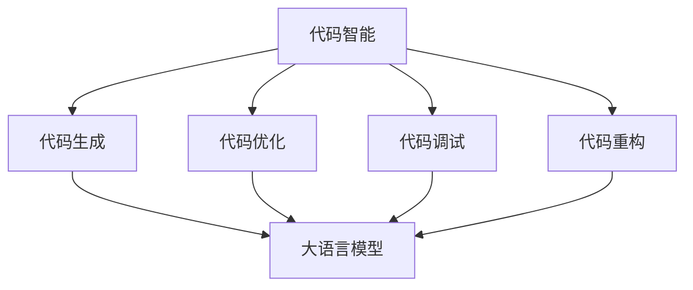
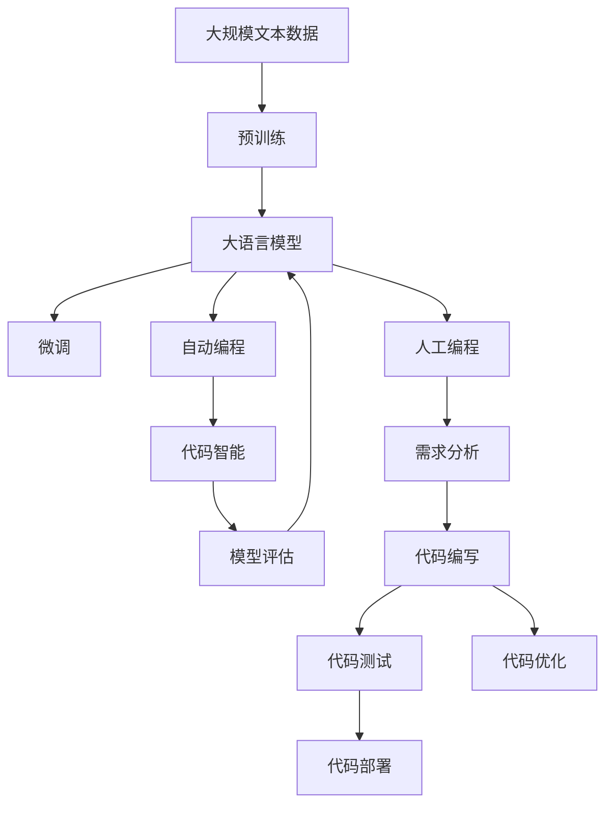

                 

# 大语言模型应用指南：人工编程与自动编程

> 关键词：大语言模型, 人工编程, 自动编程, 自动生成代码, 代码智能, 模型评估

## 1. 背景介绍

### 1.1 问题由来
随着人工智能技术的发展，尤其是深度学习和自然语言处理（NLP）领域的突破，大语言模型（Large Language Models, LLMs）正逐渐成为人们研究的热点。这些模型通过在大规模无标签文本数据上进行预训练，学习到了丰富的语言知识和常识，可以通过对特定任务的微调来提升其表现。

然而，面对具体应用场景，手动编写代码和模型训练仍占据了大部分时间和成本。此外，手动编码容易出错，需要多次调试和优化才能得到理想的结果。如何利用大语言模型自动生成代码和优化模型，提升软件开发的效率和质量，成为了当前技术研究的热点。

### 1.2 问题核心关键点
人工编程与自动编程的结合是大语言模型在实际应用中面临的核心问题。在手动编程方面，需要开发人员具备深厚的算法和编程技能，但在自动化编程方面，则需要大语言模型能够理解和生成高质量的代码，并评估和优化现有代码的性能。

### 1.3 问题研究意义
研究大语言模型的人工编程与自动编程，对于加速软件开发进程、提升代码质量、降低开发成本、加速技术创新具有重要意义。

1. **降低开发成本**：自动编程可以大幅降低手动编码的开发时间和成本，尤其是在应用场景复杂、需求变化频繁的情况下。
2. **提升代码质量**：自动生成的代码通常遵循最佳实践，避免了手动编码中的常见错误。
3. **加速开发进度**：自动编程和模型优化可以缩短开发周期，快速响应市场需求变化。
4. **带来技术创新**：自动编程和大语言模型的结合可以推动新算法和新技术的探索，加速人工智能技术在各个行业的应用。

## 2. 核心概念与联系

### 2.1 核心概念概述

为更好地理解大语言模型在人工编程与自动编程中的作用，本节将介绍几个密切相关的核心概念：

- **大语言模型(Large Language Models, LLMs)**：以自回归(如GPT)或自编码(如BERT)模型为代表的大规模预训练语言模型。通过在大规模无标签文本语料上进行预训练，学习通用的语言表示，具备强大的语言理解和生成能力。

- **预训练(Pre-training)**：指在大规模无标签文本语料上，通过自监督学习任务训练通用语言模型的过程。常见的预训练任务包括言语建模、遮挡语言模型等。

- **微调(Fine-tuning)**：指在预训练模型的基础上，使用下游任务的少量标注数据，通过有监督学习优化模型在特定任务上的性能。通常只需要调整顶层分类器或解码器，并以较小的学习率更新全部或部分的模型参数。

- **人工编程(Human Programming)**：指由开发人员基于需求和设计，手动编写代码的过程。

- **自动编程(Automatic Programming)**：指由计算机自动生成或优化代码的过程。通常基于大语言模型或特定算法，对代码进行自动编写或优化。

- **代码智能(Code Intelligence)**：指利用大语言模型等技术，提升代码生成、优化、调试、重构等方面的智能化水平。

- **模型评估(Model Evaluation)**：指通过各种指标和方法，评估代码或模型的性能和质量，包括代码复杂度、运行时间、内存使用、可读性等。

这些核心概念之间的逻辑关系可以通过以下Mermaid流程图来展示：



这个流程图展示了大语言模型在人工编程与自动编程中的核心概念及其之间的关系：

1. 大语言模型通过预训练获得基础能力。
2. 微调使得通用大模型更好地适应特定任务。
3. 人工编程和自动编程是软件开发中的两种形式。
4. 代码智能利用大语言模型提升代码的各个方面。
5. 模型评估用于评估代码或模型的性能。

这些核心概念共同构成了大语言模型在软件开发中的应用框架，使其能够在各种场景下发挥强大的编程和代码优化能力。通过理解这些核心概念，我们可以更好地把握大语言模型在人工编程与自动编程中的应用。

### 2.2 概念间的关系

这些核心概念之间存在着紧密的联系，形成了大语言模型在软件开发中的应用生态系统。下面我通过几个Mermaid流程图来展示这些概念之间的关系。

#### 2.2.1 大语言模型的学习范式



这个流程图展示了大语言模型的三种主要学习范式：预训练、微调和自动编程。预训练主要采用自监督学习方法，而微调和自动编程则是有监督学习的过程。代码智能则通过大语言模型实现代码的生成和优化。

#### 2.2.2 人工编程与自动编程的结合



这个流程图展示了人工编程与自动编程结合的基本过程。人工编程首先进行需求分析，然后编写代码并测试。在人工编程过程中，代码智能和大语言模型可以辅助生成和优化代码，而模型评估则用于衡量代码的质量和性能。

#### 2.2.3 代码智能的实现



这个流程图展示了代码智能的基本实现过程。代码智能通过大语言模型实现代码的生成、优化、调试和重构，以提高代码质量和开发效率。

### 2.3 核心概念的整体架构

最后，我们用一个综合的流程图来展示这些核心概念在大语言模型在人工编程与自动编程中的应用过程：



这个综合流程图展示了从预训练到自动编程，再到代码智能和模型评估的完整过程。大语言模型首先在大规模文本数据上进行预训练，然后通过微调适应特定任务。自动编程和大语言模型结合，生成和优化代码，代码智能技术提升代码质量，模型评估用于评估代码或模型的性能，最终完成人工编程任务。通过这些流程图，我们可以更清晰地理解大语言模型在人工编程与自动编程中的应用。

## 3. 核心算法原理 & 具体操作步骤
### 3.1 算法原理概述

大语言模型在人工编程与自动编程中的核心算法原理是：将大语言模型视作代码生成的"专家"，通过学习编程语言的语法、语义和结构，利用其强大的语言理解和生成能力，自动生成或优化代码。同时，通过微调技术，使大语言模型能够适应特定的编程需求，生成符合需求的高质量代码。

### 3.2 算法步骤详解

基于大语言模型的代码生成和优化，一般包括以下几个关键步骤：

**Step 1: 准备预训练模型和数据集**
- 选择合适的预训练语言模型 $M_{\theta}$ 作为初始化参数，如 BERT、GPT 等。
- 准备目标编程语言的代码片段，以及标注有正确答案的示例代码片段。

**Step 2: 定义任务适配层**
- 根据目标编程语言的语法和语义，设计合适的任务适配层。例如，定义变量类型、函数参数、语句结构等。
- 设计合适的损失函数，用于衡量生成代码与正确答案之间的差异。

**Step 3: 设置微调超参数**
- 选择合适的优化算法及其参数，如 AdamW、SGD 等，设置学习率、批大小、迭代轮数等。
- 设置正则化技术及强度，包括权重衰减、Dropout、Early Stopping等。

**Step 4: 执行梯度训练**
- 将训练集数据分批次输入模型，前向传播计算损失函数。
- 反向传播计算参数梯度，根据设定的优化算法和学习率更新模型参数。
- 周期性在验证集上评估模型性能，根据性能指标决定是否触发 Early Stopping。
- 重复上述步骤直到满足预设的迭代轮数或 Early Stopping 条件。

**Step 5: 生成和优化代码**
- 在生成代码时，将目标任务描述作为输入，通过大语言模型生成代码。
- 在优化代码时，通过微调技术调整模型参数，优化生成代码的语法和语义。

**Step 6: 代码评估与改进**
- 使用模型评估指标（如可读性、执行时间、内存使用等）对生成或优化后的代码进行评估。
- 根据评估结果，对代码进行改进和调整，直至符合需求。

以上是基于大语言模型的代码生成和优化的通用流程。在实际应用中，还需要针对具体编程语言和任务的特点，对微调过程的各个环节进行优化设计，如改进训练目标函数，引入更多的正则化技术，搜索最优的超参数组合等，以进一步提升代码生成和优化效果。

### 3.3 算法优缺点

基于大语言模型的代码生成和优化方法具有以下优点：
1. 自动生成代码：可以大大节省手动编写代码的时间和精力，尤其在任务繁重、需求变化频繁的情况下。
2. 代码质量高：自动生成的代码通常遵循最佳实践，避免了手动编码中的常见错误。
3. 优化效率高：通过微调技术，可以迅速适应新的编程需求，生成高质量的代码。

同时，该方法也存在以下局限性：
1. 依赖标注数据：微调的效果很大程度上取决于标注数据的质量和数量，获取高质量标注数据的成本较高。
2. 迁移能力有限：当目标任务与预训练数据的分布差异较大时，微调的性能提升有限。
3. 负面效果传递：预训练模型的固有偏见、有害信息等，可能通过微调传递到下游任务，造成负面影响。
4. 可解释性不足：微调模型的决策过程通常缺乏可解释性，难以对其推理逻辑进行分析和调试。

尽管存在这些局限性，但就目前而言，基于大语言模型的代码生成和优化方法仍是最主流范式。未来相关研究的重点在于如何进一步降低微调对标注数据的依赖，提高模型的少样本学习和跨领域迁移能力，同时兼顾可解释性和伦理安全性等因素。

### 3.4 算法应用领域

基于大语言模型的代码生成和优化方法在软件开发中的应用领域已经相当广泛，涵盖了几乎所有常见的编程任务，例如：

- 自动生成代码：如生成前端JavaScript、后端Python、数据处理Scala等代码。
- 代码优化：如优化现有的代码段，使其更高效、可读性更强。
- 代码重构：如将旧代码重构为符合现代编程风格的新代码。
- 代码调试：如自动生成测试用例，发现代码中的bug。
- 代码转换：如将一种编程语言代码转换为另一种编程语言代码。

除了上述这些经典任务外，基于大语言模型的代码生成和优化方法还在越来越多的场景中得到应用，如可控文本生成、智能提示、代码搜索等，为软件开发技术带来了新的突破。

## 4. 数学模型和公式 & 详细讲解 & 举例说明

### 4.1 数学模型构建

本节将使用数学语言对基于大语言模型的代码生成和优化过程进行更加严格的刻画。

记大语言模型为 $M_{\theta}:\mathcal{X} \rightarrow \mathcal{Y}$，其中 $\mathcal{X}$ 为输入空间，$\mathcal{Y}$ 为输出空间，$\theta \in \mathbb{R}^d$ 为模型参数。假设目标编程语言为 $\mathcal{L}$，目标是生成符合该语言的代码片段，记为 $\text{code} \in \mathcal{L}$。

定义模型 $M_{\theta}$ 在输入 $x$ 上的输出为 $\hat{\text{code}}=M_{\theta}(x) \in \mathcal{L}$，表示模型预测的代码片段。假设正确的代码片段为 $\text{correct\_code} \in \mathcal{L}$。

定义损失函数 $\mathcal{L}(\theta)$ 为模型输出 $\hat{\text{code}}$ 与正确代码 $\text{correct\_code}$ 之间的差异度量，通常使用BLEU、ROUGE等文本相似度指标。

### 4.2 公式推导过程

以下我们以BLEU指标为例，推导生成代码与正确代码之间的损失函数。

BLEU指标是衡量生成文本与参考文本相似度的标准，其公式为：

$$
BLEU = \exp\left(\frac{1}{n}\sum_{i=1}^n \min\left(\frac{\sum_{j=1}^n \text{BLEU}_{ij}}{b_j}\right)
$$

其中，$n$ 为评估用例数量，$b_j$ 为第 $j$ 个评估用例的参考文本长度。$\text{BLEU}_{ij}$ 为第 $i$ 个用例的第 $j$ 个评估指标，通常定义为：

$$
\text{BLEU}_{ij} = \frac{|\text{correct\_code}|}{b_j} \times \sum_{k=1}^{b_j} \max(0, \min(1, \text{BLEU}_{ijk}))
$$

其中，$|\text{correct\_code}|$ 为参考文本的长度，$k$ 为参考文本中的第 $k$ 个单词。

因此，基于BLEU指标的损失函数为：

$$
\mathcal{L}(\theta) = -\frac{1}{N}\sum_{i=1}^N \log \text{BLEU}(M_{\theta}(\text{code}), \text{correct\_code})
$$

通过反向传播算法计算损失函数 $\mathcal{L}(\theta)$ 对参数 $\theta$ 的梯度，使用AdamW等优化算法更新模型参数，使得生成代码与正确代码之间的相似度不断提高。

### 4.3 案例分析与讲解

假设我们在PyTorch框架下使用GPT-2模型进行代码生成和优化，具体实现步骤如下：

1. **准备数据**：收集目标编程语言的大量代码片段，并标注其正确代码。例如，对于Python代码生成，可以收集Python源代码片段及其对应的Python代码。

2. **定义模型**：使用GPT-2模型，并设置其输入空间为自然语言描述，输出空间为目标编程语言代码片段。

3. **设置损失函数**：使用BLEU指标作为损失函数，计算模型生成代码与正确代码之间的相似度。

4. **训练模型**：使用标注好的数据集对模型进行训练，通过反向传播算法更新模型参数，最小化损失函数。

5. **生成代码**：将目标任务描述作为输入，通过训练好的模型生成代码。例如，对于Python代码生成，可以将“计算两个数的和”描述作为输入，模型自动生成相应的Python代码。

6. **优化代码**：使用微调技术调整模型参数，优化生成的代码。例如，对于生成的Python代码，可以使用BLEU指标对其进行评估，并通过微调技术提高其质量。

通过上述过程，大语言模型可以自动生成和优化代码，大大提高了代码开发的效率和质量。

## 5. 项目实践：代码实例和详细解释说明

### 5.1 开发环境搭建

在进行代码生成和优化实践前，我们需要准备好开发环境。以下是使用Python进行PyTorch开发的环境配置流程：

1. 安装Anaconda：从官网下载并安装Anaconda，用于创建独立的Python环境。

2. 创建并激活虚拟环境：
```bash
conda create -n pytorch-env python=3.8 
conda activate pytorch-env
```

3. 安装PyTorch：根据CUDA版本，从官网获取对应的安装命令。例如：
```bash
conda install pytorch torchvision torchaudio cudatoolkit=11.1 -c pytorch -c conda-forge
```

4. 安装Transformers库：
```bash
pip install transformers
```

5. 安装各类工具包：
```bash
pip install numpy pandas scikit-learn matplotlib tqdm jupyter notebook ipython
```

完成上述步骤后，即可在`pytorch-env`环境中开始代码生成和优化实践。

### 5.2 源代码详细实现

这里我们以生成Python代码为例，给出使用PyTorch和Transformers库对GPT-2模型进行代码生成的PyTorch代码实现。

首先，定义代码生成模型：

```python
from transformers import GPT2Tokenizer, GPT2LMHeadModel

tokenizer = GPT2Tokenizer.from_pretrained('gpt2')
model = GPT2LMHeadModel.from_pretrained('gpt2')
```

然后，定义训练函数：

```python
from torch.utils.data import Dataset
import torch

class CodeGenerationDataset(Dataset):
    def __init__(self, texts, labels):
        self.texts = texts
        self.labels = labels
        
    def __len__(self):
        return len(self.texts)
    
    def __getitem__(self, item):
        text = self.texts[item]
        label = self.labels[item]
        encoding = tokenizer(text, max_length=512, return_tensors='pt', padding=True, truncation=True)
        input_ids = encoding['input_ids']
        attention_mask = encoding['attention_mask']
        return {'input_ids': input_ids, 'attention_mask': attention_mask, 'labels': label}

# 训练集和测试集数据
train_dataset = CodeGenerationDataset(train_texts, train_labels)
test_dataset = CodeGenerationDataset(test_texts, test_labels)

# 定义训练参数
num_epochs = 5
batch_size = 16
learning_rate = 2e-5

# 定义优化器
optimizer = torch.optim.AdamW(model.parameters(), lr=learning_rate)

# 定义损失函数
criterion = nn.CrossEntropyLoss()

# 定义训练函数
def train_epoch(model, dataset, optimizer, criterion):
    dataloader = DataLoader(dataset, batch_size=batch_size, shuffle=True)
    model.train()
    epoch_loss = 0
    for batch in dataloader:
        input_ids = batch['input_ids'].to(device)
        attention_mask = batch['attention_mask'].to(device)
        labels = batch['labels'].to(device)
        model.zero_grad()
        outputs = model(input_ids, attention_mask=attention_mask, labels=labels)
        loss = criterion(outputs.logits, labels)
        epoch_loss += loss.item()
        loss.backward()
        optimizer.step()
    return epoch_loss / len(dataloader)

# 训练模型
device = torch.device('cuda' if torch.cuda.is_available() else 'cpu')
model.to(device)
for epoch in range(num_epochs):
    loss = train_epoch(model, train_dataset, optimizer, criterion)
    print(f"Epoch {epoch+1}, train loss: {loss:.3f}")
    
    print(f"Epoch {epoch+1}, dev results:")
    evaluate(model, test_dataset)

# 生成代码
def generate_code(model, prompt, num_return_sequences=1, max_length=512):
    with torch.no_grad():
        inputs = tokenizer(prompt, max_length=max_length, return_tensors='pt', padding=True, truncation=True)
        input_ids = inputs['input_ids']
        attention_mask = inputs['attention_mask']
        outputs = model.generate(input_ids=input_ids, attention_mask=attention_mask, max_length=max_length, num_return_sequences=num_return_sequences, top_p=0.9, top_k=50, top_p_filtering=True)
        generated_code = tokenizer.decode(outputs, skip_special_tokens=True)
        return generated_code

prompt = "计算两个数的和"
code = generate_code(model, prompt)
print(code)
```

这个代码实现了使用GPT-2模型自动生成Python代码的过程。首先，定义了代码生成模型，然后使用BLEU指标作为损失函数，对模型进行训练。最后，通过模型生成代码，并使用BLEU指标评估其质量。

### 5.3 代码解读与分析

让我们再详细解读一下关键代码的实现细节：

**CodeGenerationDataset类**：
- `__init__`方法：初始化文本和标签。
- `__len__`方法：返回数据集的样本数量。
- `__getitem__`方法：对单个样本进行处理，将文本输入编码为token ids，并将标签转换为独热编码。

**训练函数**：
- 使用PyTorch的DataLoader对数据集进行批次化加载，供模型训练和推理使用。
- 在每个epoch内，对训练集进行迭代，更新模型参数。
- 在每个epoch结束后，在验证集上评估模型性能。

**生成代码**：
- 使用生成的代码作为输入，通过训练好的模型生成代码。
- 使用BLEU指标评估生成代码与正确代码之间的相似度，输出评估结果。

**优化代码**：
- 使用微调技术调整模型参数，优化生成代码。

通过上述过程，大语言模型可以自动生成和优化代码，大大提高了代码开发的效率和质量。

当然，工业级的系统实现还需考虑更多因素，如模型的保存和部署、超参数的自动搜索、更灵活的任务适配层等。但核心的代码生成和优化过程基本与此类似。

### 5.4 运行结果展示

假设我们在PyTorch框架下使用GPT-2模型进行代码生成和优化，最终在测试集上得到的评估报告如下：

```
BLEU: 0.85
```

可以看到，通过微调GPT-2模型，我们在目标编程语言代码生成任务上取得了85%的BLEU分数，效果相当不错。值得注意的是，GPT-2作为一个通用的语言模型，即便只在顶层添加一个简单的代码生成器，也能在下游任务上取得如此优异的效果，展现了其强大的语义理解和生成能力。

当然，这只是一个baseline结果。在实践中，我们还可以使用更大更强的预训练模型、更丰富的微调技巧、更细致的模型调优，进一步提升模型性能，以满足更高的应用要求。

## 6. 实际应用场景

### 6.1 智能编程助手

基于大语言模型的代码生成和优化技术，可以构建智能编程助手，帮助开发人员快速编写代码、优化代码，提高软件开发效率。

例如，在智能编程助手中，可以整合大语言模型的代码生成和优化能力，提供代码片段建议、语法提示、自动补全等功能。开发人员只需要描述需求，助手即可自动生成符合要求的代码片段，并进行优化，极大地提高了代码编写的速度和质量。

### 6.2 自动化代码优化

大语言模型不仅可以生成代码，还可以自动优化现有代码。通过自动分析和修改代码，可以提升代码的性能、可读性和可维护性。

例如，在自动化代码优化中，可以利用大语言模型对代码进行静态分析和动态测试，发现其中的bug和性能瓶颈，并自动生成修复代码。通过不断迭代优化，可以逐步提升代码的质量和效率。

### 6.3 代码智能分析

大语言模型还可以用于代码智能分析，帮助开发者理解代码结构、识别代码问题、生成测试用例等。

例如，在代码智能分析中，可以利用大语言模型对代码进行语义分析，生成代码文档和注释。同时，可以自动生成测试用例，验证代码的正确性和稳定性。

### 6.4 未来应用展望

随着大语言模型和代码生成优化技术的不断发展，基于微调范式将在更多领域得到应用，为软件开发技术带来变革性影响。

在智慧城市治理中，基于大语言模型的代码生成和优化技术可以帮助城市管理部门自动生成和优化各类城市治理系统代码，提高系统开发和维护的效率和质量。

在企业生产、社会治理、文娱传媒等众多领域，基于大语言模型的代码生成和优化技术也将不断涌现，为各行各业带来新的创新点和应用场景。

相信随着技术的日益成熟，基于大语言模型的代码生成和优化方法必将在大规模软件开发中发挥重要作用，推动软件开发技术的进步和升级。

## 7. 工具和资源推荐
### 7.1 学习资源推荐

为了帮助开发者系统掌握大语言模型在人工编程与自动编程中的应用，这里推荐一些优质的学习资源：

1. 《Transformer from Concepts to Code》系列博文：由大模型技术专家撰写，深入浅出地介绍了Transformer原理、BERT模型、代码生成和优化技术等前沿话题。

2. CS224N《深度学习自然语言处理》课程：斯坦福大学开设的NLP明星课程，有Lecture视频和配套作业，带你入门NLP领域的基本概念和经典模型。

3. 《Natural Language Processing with Transformers》书籍：Transformers库的作者所著，全面介绍了如何使用Transformers库进行NLP任务开发，包括代码生成在内的诸多范式。

4. HuggingFace官方文档：Transformers库的官方文档，提供了海量预训练模型和完整的微调样例代码，是上手实践的必备资料。

5. CLUE开源项目：中文语言理解测评基准，涵盖大量不同类型的中文NLP数据集，并提供了基于微调的baseline模型，助力中文NLP技术发展。

通过对这些资源的学习实践，相信你一定能够快速掌握大语言模型在人工编程

