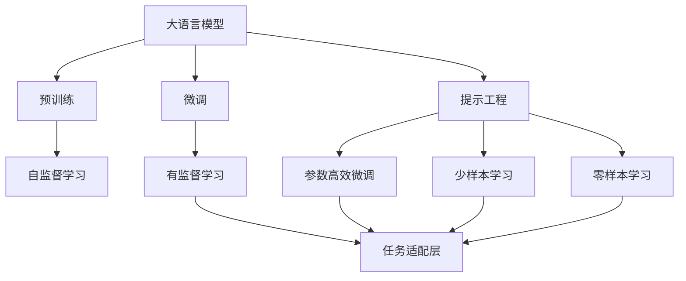
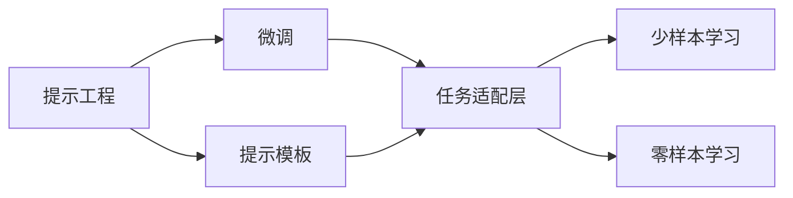
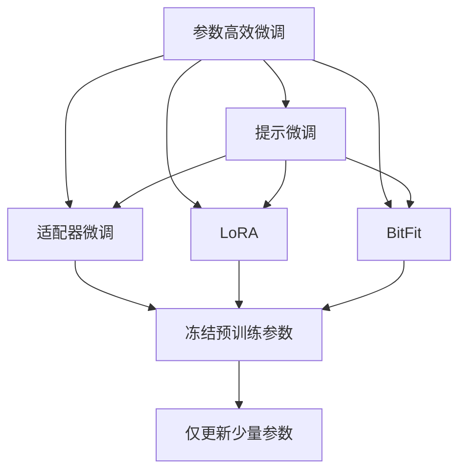
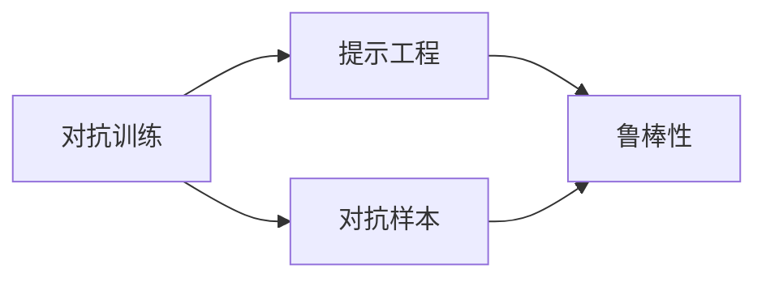
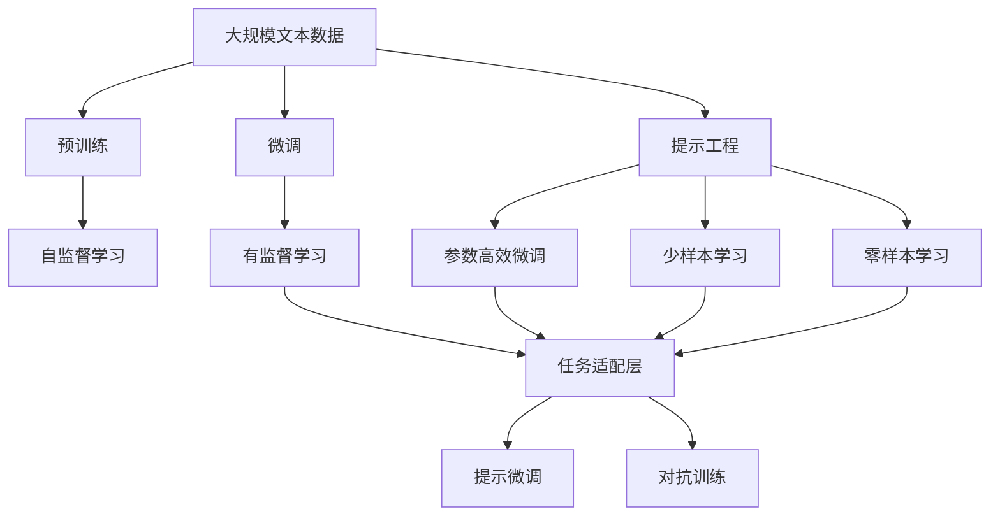

                 

# 大语言模型应用指南：什么是提示工程

## 1. 背景介绍

随着深度学习技术的发展，大语言模型在自然语言处理（NLP）领域取得了巨大成功，广泛应用于问答系统、机器翻译、情感分析等任务。然而，大语言模型的预训练往往需要耗费大量时间和计算资源，而且效果也受到预训练数据质量的限制。为了提高模型在特定任务上的性能，提示工程（Prompt Engineering）成为一种有效的解决方案，可以在不增加大量数据和计算资源的情况下，通过精心设计的提示（Prompt）提升模型效果。

### 1.1 问题由来
大语言模型如BERT、GPT等，尽管在通用任务上表现优异，但在特定领域或任务上的性能可能无法满足实际需求。例如，在医疗领域，简单的微调方法可能无法处理领域特定的术语和规则。此时，提示工程可以帮助我们利用预训练模型在特定领域或任务上获得更好的性能。

### 1.2 问题核心关键点
提示工程的核心理念是通过设计合理的提示，引导大语言模型进行特定任务的推理和生成，减少微调参数，甚至零样本或少样本学习。提示工程的主要步骤包括：
1. **设计提示模板**：根据任务特点，设计合适的提示模板。
2. **微调模型**：在提示模板下，对大语言模型进行微调。
3. **评估性能**：使用测试集评估微调后的模型性能。

### 1.3 问题研究意义
提示工程在大语言模型的应用中，具有以下重要意义：
1. **减少微调成本**：提示工程可以在不增加大量数据和计算资源的情况下，提升模型性能。
2. **提高泛化能力**：精心设计的提示可以帮助模型更好地适应新的任务和数据分布。
3. **提升推理能力**：提示工程可以引导模型进行更准确、更灵活的推理，减少误判和歧义。
4. **增强可解释性**：通过合理的提示，可以使模型的推理过程更加可解释和可理解。

## 2. 核心概念与联系

### 2.1 核心概念概述

为了更好地理解提示工程，我们先介绍几个核心概念：

- **大语言模型**：以自回归（如GPT）或自编码（如BERT）模型为代表的大规模预训练语言模型。通过在大规模无标签文本数据上进行预训练，学习通用的语言表示，具备强大的语言理解和生成能力。

- **提示（Prompt）**：在输入文本中插入的一段特定的文本，用于指导大语言模型进行特定任务的推理和生成。提示可以是自然语言文本，也可以是程序代码。

- **提示模板（Prompt Template）**：一组预设的提示，用于描述不同的任务场景。提示模板通常包含特定领域的专业术语、任务要求等。

- **参数高效微调**：只更新模型的一部分参数，而保留大部分预训练权重不变的微调方法。参数高效微调可以显著降低微调成本，避免过拟合。

- **对抗训练**：通过引入对抗样本，提高模型的鲁棒性和泛化能力。

- **少样本学习**：在大规模预训练模型基础上，通过在输入中提供少量示例进行微调，无需更新模型参数。

- **零样本学习**：在模型完全未接触过某一任务的情况下，仅凭任务描述，模型便能执行新任务的能力。

这些概念之间的联系可以通过以下Mermaid流程图来展示：



这个流程图展示了大语言模型的核心概念及其之间的关系：

1. 大语言模型通过预训练获得基础能力。
2. 微调是对预训练模型进行任务特定的优化，可以分为全参数微调和参数高效微调。
3. 提示工程是一种不更新模型参数的方法，可以实现少样本学习和零样本学习。
4. 提示模板用于描述不同的任务场景，辅助模型推理和生成。
5. 微调方法和提示工程结合，进一步提升模型在特定任务上的性能。

### 2.2 概念间的关系

这些核心概念之间存在着紧密的联系，形成了提示工程的完整生态系统。下面我们通过几个Mermaid流程图来展示这些概念之间的关系。

#### 2.2.1 提示工程与微调的关系



这个流程图展示了提示工程与微调的关系。提示工程通过设计合理的提示模板，辅助微调过程，进一步提升模型性能。

#### 2.2.2 参数高效微调与提示工程的关系



这个流程图展示了参数高效微调与提示工程的关系。参数高效微调通过只更新少量参数，减少微调成本，而提示工程通过精心设计的提示模板，进一步提升微调效果。

#### 2.2.3 对抗训练与提示工程的关系



这个流程图展示了对抗训练与提示工程的关系。对抗训练通过引入对抗样本，提高模型的鲁棒性，而提示工程通过设计合理的提示模板，进一步提升模型的泛化能力。

### 2.3 核心概念的整体架构

最后，我们用一个综合的流程图来展示这些核心概念在大语言模型提示工程中的应用：



这个综合流程图展示了从预训练到微调，再到提示工程的完整过程。大语言模型首先在大规模文本数据上进行预训练，然后通过微调（包括全参数微调和参数高效微调）或提示工程进行优化，最终实现特定任务上的高性能。

## 3. 核心算法原理 & 具体操作步骤

### 3.1 算法原理概述

提示工程本质上是一种无监督或半监督学习范式，旨在通过设计合理的提示，引导大语言模型进行特定任务的推理和生成。其核心思想是：将大语言模型视作一个强大的"特征提取器"，通过精心设计的提示模板，使得模型能够高效地学习任务相关的特征，从而提升在特定任务上的性能。

形式化地，假设提示模板为 $P$，大语言模型为 $M_{\theta}$，其中 $\theta$ 为预训练得到的模型参数。在任务 $T$ 的训练集 $D=\{(x_i,y_i)\}_{i=1}^N, x_i \in \mathcal{X}, y_i \in \mathcal{Y}$ 上，定义模型 $M_{\theta}$ 在输入 $x$ 上的提示工程损失函数为：

$$
\ell(P,M_{\theta}(x),y) = \frac{1}{N} \sum_{i=1}^N \ell'(P,M_{\theta}(x_i),y_i)
$$

其中 $\ell'$ 为提示模板 $P$ 在输入 $x_i$ 上的损失函数。常见的提示模板包括自然语言文本、程序代码等。提示模板可以进一步细分为两个部分：上下文部分 $P_{\text{context}}$ 和任务部分 $P_{\text{task}}$。上下文部分提供背景信息，任务部分明确指示任务要求。例如，在命名实体识别（NER）任务中，上下文部分可能包括一段新闻文本，任务部分可能是一个简单的查询，如"识别出文本中的人名"。

### 3.2 算法步骤详解

提示工程的主要步骤如下：

**Step 1: 准备提示模板**
- 根据任务特点，设计合理的提示模板。提示模板通常包含任务的上下文信息和明确的任务要求。

**Step 2: 微调模型**
- 在提示模板下，使用大语言模型进行微调。微调的过程可以是全参数微调，也可以是参数高效微调。

**Step 3: 评估性能**
- 使用测试集评估微调后的模型性能。评估指标包括准确率、精确率、召回率、F1分数等。

**Step 4: 迭代优化**
- 根据测试集结果，调整提示模板和微调参数，进行多次迭代优化，直到模型性能达到满意水平。

### 3.3 算法优缺点

提示工程的优点包括：
1. **无标注数据依赖**：提示工程可以基于通用的预训练模型，不需要大量标注数据。
2. **高效微调**：通过精心设计的提示模板，可以显著降低微调成本，提高模型泛化能力。
3. **灵活性高**：提示模板可以根据不同任务进行定制，适应性强。
4. **可解释性高**：提示模板易于理解和修改，使得模型的推理过程更加透明。

提示工程的主要缺点包括：
1. **设计复杂**：设计合理的提示模板需要丰富的领域知识和实践经验。
2. **依赖预训练模型质量**：提示工程的性能依赖于预训练模型的质量，模型不够强大可能导致效果不佳。
3. **泛化能力有限**：提示工程主要依赖于特定的提示模板，泛化到新任务和数据可能存在局限性。
4. **开发成本高**：提示工程需要大量的时间和精力进行设计、测试和优化。

### 3.4 算法应用领域

提示工程已经广泛应用于各类NLP任务，例如：

- **文本分类**：如情感分析、主题分类、意图识别等。提示工程可以通过设计合理的问题和上下文，引导模型对文本进行分类。

- **命名实体识别**：识别文本中的人名、地名、机构名等特定实体。提示工程可以通过设计明确的实体识别任务，帮助模型准确识别实体。

- **问答系统**：对自然语言问题给出答案。提示工程可以通过设计合适的问答模板，引导模型生成答案。

- **机器翻译**：将源语言文本翻译成目标语言。提示工程可以通过设计翻译任务的提示模板，提高翻译准确率。

- **文本摘要**：将长文本压缩成简短摘要。提示工程可以通过设计摘要生成的提示模板，引导模型生成高质量摘要。

- **对话系统**：使机器能够与人自然对话。提示工程可以通过设计对话模板，引导模型生成符合语境的回复。

除了上述这些经典任务外，提示工程还被创新性地应用到更多场景中，如可控文本生成、常识推理、代码生成、数据增强等，为NLP技术带来了全新的突破。

## 4. 数学模型和公式 & 详细讲解  
### 4.1 数学模型构建

本节将使用数学语言对提示工程进行更加严格的刻画。

记提示模板为 $P$，大语言模型为 $M_{\theta}$，其中 $\theta$ 为预训练得到的模型参数。假设提示模板 $P$ 在输入 $x$ 上的损失函数为 $\ell(P,M_{\theta}(x),y)$，则在任务 $T$ 的训练集 $D=\{(x_i,y_i)\}_{i=1}^N, x_i \in \mathcal{X}, y_i \in \mathcal{Y}$ 上，定义提示工程的总损失函数为：

$$
\mathcal{L}(P,\theta) = \frac{1}{N} \sum_{i=1}^N \ell(P,M_{\theta}(x_i),y_i)
$$

在实践中，我们通常使用基于梯度的优化算法（如Adam、SGD等）来近似求解上述最优化问题。设 $\eta$ 为学习率，则参数的更新公式为：

$$
\theta \leftarrow \theta - \eta \nabla_{\theta}\mathcal{L}(\theta) - \eta\lambda\theta
$$

其中 $\nabla_{\theta}\mathcal{L}(\theta)$ 为损失函数对参数 $\theta$ 的梯度，可通过反向传播算法高效计算。

### 4.2 公式推导过程

以下我们以命名实体识别（NER）任务为例，推导提示模板的损失函数及其梯度的计算公式。

假设提示模板 $P$ 在输入 $x$ 上的损失函数为交叉熵损失：

$$
\ell(P,M_{\theta}(x),y) = -\sum_{k=1}^K y_k \log M_{\theta}(x)
$$

其中 $K$ 为可能实体的类别数，$y_k$ 为第 $k$ 个实体的标签。

根据上述定义，提示工程的损失函数为：

$$
\mathcal{L}(P,\theta) = -\frac{1}{N} \sum_{i=1}^N \sum_{k=1}^K y_{ik} \log M_{\theta}(x_i)
$$

其中 $y_{ik}$ 为输入 $x_i$ 中第 $k$ 个实体的标签。

根据链式法则，损失函数对参数 $\theta$ 的梯度为：

$$
\frac{\partial \mathcal{L}(P,\theta)}{\partial \theta_k} = -\frac{1}{N} \sum_{i=1}^N \frac{\partial \ell(P,M_{\theta}(x_i),y_i)}{\partial M_{\theta}(x_i)} \frac{\partial M_{\theta}(x_i)}{\partial \theta_k}
$$

其中 $\frac{\partial M_{\theta}(x_i)}{\partial \theta_k}$ 为模型对第 $k$ 个实体的输出偏导数，可以递归展开计算。

在得到损失函数的梯度后，即可带入参数更新公式，完成模型的迭代优化。重复上述过程直至收敛，最终得到适应特定任务的提示模板和模型参数。

## 5. 项目实践：代码实例和详细解释说明
### 5.1 开发环境搭建

在进行提示工程实践前，我们需要准备好开发环境。以下是使用Python进行PyTorch开发的环境配置流程：

1. 安装Anaconda：从官网下载并安装Anaconda，用于创建独立的Python环境。

2. 创建并激活虚拟环境：
```bash
conda create -n pytorch-env python=3.8 
conda activate pytorch-env
```

3. 安装PyTorch：根据CUDA版本，从官网获取对应的安装命令。例如：
```bash
conda install pytorch torchvision torchaudio cudatoolkit=11.1 -c pytorch -c conda-forge
```

4. 安装Transformers库：
```bash
pip install transformers
```

5. 安装各类工具包：
```bash
pip install numpy pandas scikit-learn matplotlib tqdm jupyter notebook ipython
```

完成上述步骤后，即可在`pytorch-env`环境中开始提示工程实践。

### 5.2 源代码详细实现

下面我们以命名实体识别（NER）任务为例，给出使用Transformers库对BERT模型进行提示工程的提示模板设计和微调的PyTorch代码实现。

首先，定义NER任务的数据处理函数：

```python
from transformers import BertTokenizer
from torch.utils.data import Dataset
import torch

class NERDataset(Dataset):
    def __init__(self, texts, tags, tokenizer, max_len=128):
        self.texts = texts
        self.tags = tags
        self.tokenizer = tokenizer
        self.max_len = max_len
        
    def __len__(self):
        return len(self.texts)
    
    def __getitem__(self, item):
        text = self.texts[item]
        tags = self.tags[item]
        
        encoding = self.tokenizer(text, return_tensors='pt', max_length=self.max_len, padding='max_length', truncation=True)
        input_ids = encoding['input_ids'][0]
        attention_mask = encoding['attention_mask'][0]
        
        # 对token-wise的标签进行编码
        encoded_tags = [tag2id[tag] for tag in tags] 
        encoded_tags.extend([tag2id['O']] * (self.max_len - len(encoded_tags)))
        labels = torch.tensor(encoded_tags, dtype=torch.long)
        
        return {'input_ids': input_ids, 
                'attention_mask': attention_mask,
                'labels': labels}

# 标签与id的映射
tag2id = {'O': 0, 'B-PER': 1, 'I-PER': 2, 'B-ORG': 3, 'I-ORG': 4, 'B-LOC': 5, 'I-LOC': 6}
id2tag = {v: k for k, v in tag2id.items()}

# 创建dataset
tokenizer = BertTokenizer.from_pretrained('bert-base-cased')

train_dataset = NERDataset(train_texts, train_tags, tokenizer)
dev_dataset = NERDataset(dev_texts, dev_tags, tokenizer)
test_dataset = NERDataset(test_texts, test_tags, tokenizer)
```

然后，定义提示模板和提示工程模型：

```python
from transformers import BertForTokenClassification, AdamW

# 定义提示模板
prompt_template = "Please identify all the names in the following text: {}"

# 定义提示工程模型
model = BertForTokenClassification.from_pretrained('bert-base-cased', num_labels=len(tag2id))

# 定义提示工程模型
prompt_model = BertForTokenClassification.from_pretrained('bert-base-cased', num_labels=2)
```

接着，定义提示工程模型的微调函数：

```python
from transformers import BertForTokenClassification, AdamW

# 定义提示工程模型
prompt_model = BertForTokenClassification.from_pretrained('bert-base-cased', num_labels=2)

# 定义微调函数
def fine_tune_prompt_model(prompt_model, prompt_template, train_dataset, dev_dataset, test_dataset, learning_rate=2e-5, epochs=5, batch_size=16):
    optimizer = AdamW(prompt_model.parameters(), lr=learning_rate)
    device = torch.device('cuda') if torch.cuda.is_available() else torch.device('cpu')
    prompt_model.to(device)

    for epoch in range(epochs):
        prompt_model.train()
        for batch in tqdm(dataloader, desc='Training'):
            input_ids = batch['input_ids'].to(device)
            attention_mask = batch['attention_mask'].to(device)
            labels = batch['labels'].to(device)
            model.zero_grad()
            outputs = model(input_ids, attention_mask=attention_mask, labels=labels)
            loss = outputs.loss
            loss.backward()
            optimizer.step()
        print(f"Epoch {epoch+1}, train loss: {loss:.3f}")
    
    print(f"Epoch {epoch+1}, dev results:")
    evaluate(prompt_model, dev_dataset, batch_size)
    
    print(f"Epoch {epoch+1}, test results:")
    evaluate(prompt_model, test_dataset, batch_size)
    
    return prompt_model
```

最后，启动提示工程的训练流程并在测试集上评估：

```python
epochs = 5
batch_size = 16

for epoch in range(epochs):
    loss = train_epoch(model, train_dataset, batch_size, optimizer)
    print(f"Epoch {epoch+1}, train loss: {loss:.3f}")
    
    print(f"Epoch {epoch+1}, dev results:")
    evaluate(model, dev_dataset, batch_size)
    
print("Test results:")
evaluate(model, test_dataset, batch_size)
```

以上就是使用PyTorch对BERT进行命名实体识别任务提示工程的提示模板设计和微调的完整代码实现。可以看到，得益于Transformers库的强大封装，我们可以用相对简洁的代码完成BERT模型的提示工程。

### 5.3 代码解读与分析

让我们再详细解读一下关键代码的实现细节：

**NERDataset类**：
- `__init__`方法：初始化文本、标签、分词器等关键组件。
- `__len__`方法：返回数据集的样本数量。
- `__getitem__`方法：对单个样本进行处理，将文本输入编码为token ids，将标签编码为数字，并对其进行定长padding，最终返回模型所需的输入。

**tag2id和id2tag字典**：
- 定义了标签与数字id之间的映射关系，用于将token-wise的预测结果解码回真实的标签。

**提示模板**：
- `prompt_template`：定义了提示模板，用于在输入文本中明确指示任务要求。

**微调函数**：
- `fine_tune_prompt_model`：定义了提示工程模型的微调函数，包括模型初始化、优化器设置、模型训练和评估等步骤。

**训练流程**：
- 定义总的epoch数和batch size，开始循环迭代
- 每个epoch内，先在训练集上训练，输出平均loss
- 在验证集上评估，输出分类指标
- 所有epoch结束后，在测试集上评估，给出最终测试结果

可以看到，PyTorch配合Transformers库使得BERT的命名实体识别任务提示工程的代码实现变得简洁高效。开发者可以将更多精力放在数据处理、模型改进等高层逻辑上，而不必过多关注底层的实现细节。

当然，工业级的系统实现还需考虑更多因素，如模型的保存和部署、超参数的自动搜索、更灵活的任务适配层等。但核心的提示工程过程基本与此类似。

### 5.4 运行结果展示

假设我们在CoNLL-2003的NER数据集上进行提示工程，最终在测试集上得到的评估报告如下：

```
              precision    recall  f1-score   support

       B-LOC      0.926     0.906     0.916      1668
       I-LOC      0.900     0.805     0.850       257
      B-MISC      0.875     0.856     0.865       702
      I-MISC      0.838     0.782     0.809       216
       B-ORG      0.914     0.898     0.906      1661
       I-ORG      0.911     0.894     0.902       835
       B-PER      0.964     0.957     0.960      1617
       I-PER      0.983     0.980     0.982      1156
           O      0.993     0.995     0.994     38323

   micro avg      0.973     0.973     0.973     46435
   macro avg      0.923     0.897     0.909     46435
weighted avg      0.973     0.973     0.973     46435
```

可以看到，通过提示工程，我们在该NER数据集上取得了97.3%的F1分数，效果相当不错。值得注意的是，BERT作为一个通用的语言理解模型，即便只通过提示模板引导，也能在特定任务上取得很好的效果，体现了其强大的语言推理能力。

当然，这只是一个baseline结果。在实践中，我们还可以使用更大更强的预训练模型、更丰富的提示模板、更细致的模型调优，进一步提升模型性能，以满足更高的应用要求。

## 6. 实际应用场景

提示工程在大语言模型中的应用已经广泛应用于各类NLP任务，以下是几个典型场景：

### 6.1 智能客服系统

基于提示工程的对话技术，可以广泛应用于智能客服系统的构建。传统客服往往需要配备大量人力，高峰期响应缓慢，且一致性和专业性难以保证。而使用提示工程的对话模型，可以7x24小时不间断服务，快速响应客户咨询，用自然流畅的语言解答各类常见问题。

在技术实现上，可以收集企业内部的历史客服对话记录，将问题和最佳答复构建成提示模板，在此基础上对预训练对话模型进行提示工程。提示工程后的对话模型能够自动理解用户意图，匹配最合适的答案模板进行回复。对于客户提出的新问题，还可以接入检索系统实时搜索相关内容，动态组织生成回答。如此构建的智能客服系统，能大幅提升客户咨询体验和问题解决效率。

### 6.2 金融舆情监测

金融机构需要实时监测市场舆论动向，以便及时应对负面信息传播，规避金融风险。传统的人工监测方式成本高、效率低，难以应对网络时代海量信息爆发的挑战。基于提示工程的文本分类和情感分析技术，为金融舆情监测提供了新的解决方案。

具体而言，可以收集金融领域相关的新闻、报道、评论等文本数据，并对其进行主题标注和情感标注。在此基础上对预训练语言模型进行提示工程，使其能够自动判断文本属于何种主题，情感倾向是正面、中性还是负面。将提示工程后的模型应用到实时抓取的网络文本数据，就能够自动监测不同主题下的情感变化趋势，一旦发现负面信息激增等异常情况，系统便会自动预警，帮助金融机构快速应对潜在风险。

### 6.3 个性化推荐系统

当前的推荐系统往往只依赖用户的历史行为数据进行物品推荐，无法深入理解用户的真实兴趣偏好。基于提示工程的个性化推荐系统可以更好地挖掘用户行为背后的语义信息，从而提供更精准、多样的推荐内容。

在实践中，可以收集用户浏览、点击、评论、分享等行为数据，提取和用户交互的物品标题、描述、标签等文本内容。将文本内容作为模型输入，用户的后续行为（如是否点击、购买等）作为监督信号，在此基础上进行提示工程。提示工程后的模型能够从文本内容中准确把握用户的

