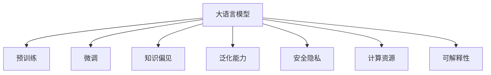
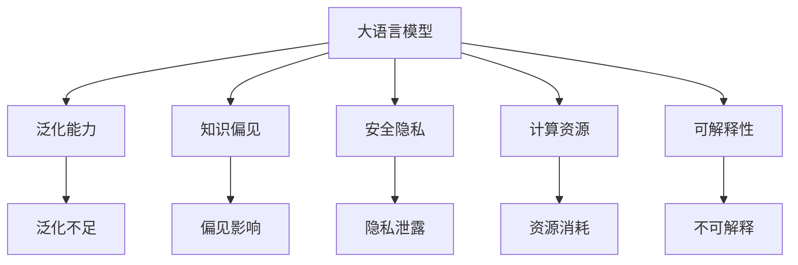

                 

# 大语言模型应用指南：大语言模型的局限性

> 关键词：大语言模型,知识偏见,泛化能力,安全隐私,计算资源,可解释性

## 1. 背景介绍

### 1.1 问题由来

大语言模型（Large Language Models, LLMs）近年来在自然语言处理（Natural Language Processing, NLP）领域取得了显著进展，表现出强大的语言理解和生成能力。然而，尽管如此，大语言模型仍存在一些显著的局限性。本文旨在全面探讨这些局限性，并提供一些策略来缓解这些问题，以期更好地利用大语言模型的潜力。

### 1.2 问题核心关键点

大语言模型的局限性主要体现在以下几个方面：

1. **知识偏见**：大语言模型在预训练和微调过程中，可能会学习并继承其训练数据中的偏见，从而影响其在不同社会群体、性别、种族等方面的公正性和中立性。
2. **泛化能力不足**：尽管大语言模型在特定任务上表现优异，但在新数据或不同分布的数据上，其泛化能力可能不足，导致性能下降。
3. **安全隐私风险**：大语言模型的训练数据可能包含敏感信息，模型在推理过程中也可能泄露用户隐私。
4. **计算资源需求高**：大语言模型通常需要大量的计算资源进行训练和推理，这对硬件配置提出了较高要求。
5. **可解释性差**：大语言模型的决策过程往往是“黑盒”的，难以解释其内部逻辑和推理机制。

### 1.3 问题研究意义

探讨大语言模型的局限性，对于理解其应用场景的限制和提升其性能具有重要意义：

1. **促进公平与透明**：认识到大语言模型的知识偏见和隐私风险，有助于设计更加公平和透明的系统。
2. **提高模型泛化能力**：通过改进模型设计和训练策略，提升模型的泛化能力，使其在不同场景下表现更加稳健。
3. **降低计算成本**：寻求更高效的模型架构和训练方法，降低对计算资源的依赖，提高模型的可扩展性。
4. **增强可解释性**：提升模型的可解释性，使得用户和开发者能够理解模型的决策过程，增强系统的可信度。

## 2. 核心概念与联系

### 2.1 核心概念概述

在讨论大语言模型的局限性之前，首先需要理解一些关键概念：

1. **大语言模型**：基于自回归或自编码模型，在大量无标签文本数据上进行预训练，学习通用的语言表示，具备强大的语言理解和生成能力。
2. **泛化能力**：模型在新数据或不同分布的数据上表现的能力。
3. **知识偏见**：模型在训练数据中学习到的固有偏见，可能导致输出结果的不公正性和歧视性。
4. **安全隐私**：模型推理过程中可能泄露用户隐私或训练数据的敏感信息。
5. **计算资源**：模型训练和推理所需的硬件配置。
6. **可解释性**：模型决策过程的可理解性，即能够解释其内部逻辑和推理机制。

这些概念通过以下Mermaid流程图展示了它们之间的联系：



### 2.2 概念间的关系

这些核心概念通过以下Mermaid流程图进一步展示了它们之间的关系：



这些概念共同构成了大语言模型的应用框架，帮助开发者更好地理解其局限性，并寻找相应的改进策略。

## 3. 核心算法原理 & 具体操作步骤
### 3.1 算法原理概述

大语言模型的局限性主要体现在其知识偏见、泛化能力、安全隐私、计算资源和可解释性等方面。以下将分别从这些维度探讨其算法原理。

### 3.2 算法步骤详解

#### 3.2.1 知识偏见

1. **数据偏见**：大语言模型的训练数据中可能包含对某些群体的偏见。在微调过程中，这些偏见可能会被放大或复制。
   
2. **训练方法**：在预训练阶段，模型的目标函数可能偏向于某些特定任务或标签，导致模型对这些任务的偏差。

3. **缓解策略**：使用多源数据集进行预训练，引入对抗训练等技术，以及引入偏见检测和修正机制。

#### 3.2.2 泛化能力

1. **过拟合**：大语言模型在微调过程中，可能因为数据量不足或特征复杂，导致过拟合现象。

2. **正则化**：通过添加正则化项，如L2正则化、Dropout等，可以减少过拟合。

3. **数据增强**：通过回译、近义词替换等方式，增加训练集的多样性，提升模型的泛化能力。

4. **模型集成**：通过集成多个微调模型，可以提升模型的泛化能力，避免单一模型过拟合。

#### 3.2.3 安全隐私

1. **隐私泄露**：模型在推理过程中可能会泄露用户的隐私信息，如个人偏好、地理位置等。

2. **匿名化**：对数据进行匿名化处理，保护用户隐私。

3. **隐私保护算法**：使用差分隐私、同态加密等技术，保护用户隐私。

#### 3.2.4 计算资源

1. **硬件需求**：大语言模型通常需要高性能的GPU/TPU等硬件进行训练和推理。

2. **模型压缩**：通过模型剪枝、量化等技术，减小模型尺寸，降低计算资源需求。

3. **分布式训练**：通过分布式训练，加速模型训练过程，提高计算效率。

#### 3.2.5 可解释性

1. **黑盒问题**：大语言模型的决策过程往往是“黑盒”的，难以理解其内部逻辑。

2. **可解释性方法**：通过解释性方法，如Attention可视化、LIME等，增强模型的可解释性。

3. **模型干预**：在模型推理过程中，通过人工干预和监控，确保模型的输出符合人类价值观和伦理道德。

### 3.3 算法优缺点

大语言模型在解决各种NLP任务时具有显著优势，但也存在一些局限性：

1. **优点**：
   - 强大的语言理解能力，能够在各种NLP任务上取得优异性能。
   - 可以处理复杂的语言结构，如长句子和复杂的语法结构。
   - 通过微调，可以适应特定任务，提升性能。

2. **缺点**：
   - 依赖高质量标注数据，训练成本高。
   - 泛化能力有限，在特定领域或新数据上表现可能不佳。
   - 知识偏见可能影响模型的公正性和中立性。
   - 对计算资源需求高，训练和推理成本较高。
   - 可解释性差，难以理解模型的决策过程。

### 3.4 算法应用领域

尽管存在局限性，大语言模型在许多领域仍具有广泛应用：

1. **自然语言处理**：文本分类、问答系统、情感分析等。
2. **智能客服**：自动问答、对话生成等。
3. **金融行业**：舆情分析、情感分析等。
4. **医疗健康**：医疗咨询、病历分析等。
5. **教育培训**：智能辅导、作业批改等。
6. **智能制造**：生产控制、质量检测等。

## 4. 数学模型和公式 & 详细讲解 & 举例说明

### 4.1 数学模型构建

假设大语言模型 $M_{\theta}$ 用于解决一个特定任务，其中 $\theta$ 为模型参数。模型的损失函数为 $\mathcal{L}(\theta)$，用于衡量模型预测结果与真实标签之间的差异。微调的目标是最小化损失函数：

$$
\hat{\theta} = \mathop{\arg\min}_{\theta} \mathcal{L}(\theta)
$$

### 4.2 公式推导过程

以分类任务为例，假设模型在输入 $x$ 上的输出为 $\hat{y}=M_{\theta}(x)$，表示样本属于正类的概率。真实标签 $y \in \{0,1\}$。则二分类交叉熵损失函数为：

$$
\ell(M_{\theta}(x),y) = -[y\log \hat{y} + (1-y)\log (1-\hat{y})]
$$

将其代入经验风险公式，得：

$$
\mathcal{L}(\theta) = -\frac{1}{N}\sum_{i=1}^N [y_i\log M_{\theta}(x_i)+(1-y_i)\log(1-M_{\theta}(x_i))]
$$

根据链式法则，损失函数对参数 $\theta_k$ 的梯度为：

$$
\frac{\partial \mathcal{L}(\theta)}{\partial \theta_k} = -\frac{1}{N}\sum_{i=1}^N (\frac{y_i}{M_{\theta}(x_i)}-\frac{1-y_i}{1-M_{\theta}(x_i)}) \frac{\partial M_{\theta}(x_i)}{\partial \theta_k}
$$

其中 $\frac{\partial M_{\theta}(x_i)}{\partial \theta_k}$ 可进一步递归展开，利用自动微分技术完成计算。

### 4.3 案例分析与讲解

以情感分析为例，假设模型用于识别文本的情感倾向，训练集包含大量带有情感标签的文本。模型在微调过程中，通过优化损失函数来提升情感识别的准确率。

假设模型在输入文本 $x$ 上的输出为 $\hat{y}=M_{\theta}(x)$，表示文本属于正面、负面或中性的概率。真实标签 $y \in \{1,2,0\}$，分别代表正面、负面和中性。则三分类交叉熵损失函数为：

$$
\ell(M_{\theta}(x),y) = -\sum_{i=1}^3 [y_i\log \hat{y}_i]
$$

将其代入经验风险公式，得：

$$
\mathcal{L}(\theta) = -\frac{1}{N}\sum_{i=1}^N \sum_{j=1}^3 [y_{ij}\log M_{\theta}(x_i)_j]
$$

其中 $y_{ij}$ 为文本 $x_i$ 的第 $j$ 个情感标签。

在微调过程中，通过优化上述损失函数，调整模型参数 $\theta$，使其在情感分析任务上表现更好。

## 5. 项目实践：代码实例和详细解释说明

### 5.1 开发环境搭建

在进行微调实践前，需要准备如下开发环境：

1. 安装Anaconda，用于创建独立的Python环境。
2. 创建并激活虚拟环境：
```bash
conda create -n pytorch-env python=3.8 
conda activate pytorch-env
```
3. 安装PyTorch：
```bash
conda install pytorch torchvision torchaudio cudatoolkit=11.1 -c pytorch -c conda-forge
```
4. 安装Transformers库：
```bash
pip install transformers
```
5. 安装各类工具包：
```bash
pip install numpy pandas scikit-learn matplotlib tqdm jupyter notebook ipython
```

完成上述步骤后，即可在`pytorch-env`环境中开始微调实践。

### 5.2 源代码详细实现

以下是一个基于PyTorch和Transformers库进行情感分析微调的示例代码。

```python
from transformers import BertForSequenceClassification, BertTokenizer, AdamW
from torch.utils.data import DataLoader, Dataset

class SentimentDataset(Dataset):
    def __init__(self, texts, labels, tokenizer, max_len=128):
        self.texts = texts
        self.labels = labels
        self.tokenizer = tokenizer
        self.max_len = max_len

    def __len__(self):
        return len(self.texts)

    def __getitem__(self, item):
        text = self.texts[item]
        label = self.labels[item]

        encoding = self.tokenizer(text, return_tensors='pt', max_length=self.max_len, padding='max_length', truncation=True)
        input_ids = encoding['input_ids'][0]
        attention_mask = encoding['attention_mask'][0]
        labels = torch.tensor([label], dtype=torch.long)

        return {'input_ids': input_ids, 'attention_mask': attention_mask, 'labels': labels}

tokenizer = BertTokenizer.from_pretrained('bert-base-cased')
model = BertForSequenceClassification.from_pretrained('bert-base-cased', num_labels=3)

optimizer = AdamW(model.parameters(), lr=2e-5)

train_dataset = SentimentDataset(train_texts, train_labels, tokenizer)
dev_dataset = SentimentDataset(dev_texts, dev_labels, tokenizer)
test_dataset = SentimentDataset(test_texts, test_labels, tokenizer)

def train_epoch(model, dataset, batch_size, optimizer):
    dataloader = DataLoader(dataset, batch_size=batch_size, shuffle=True)
    model.train()
    epoch_loss = 0
    for batch in dataloader:
        input_ids = batch['input_ids'].to(device)
        attention_mask = batch['attention_mask'].to(device)
        labels = batch['labels'].to(device)
        model.zero_grad()
        outputs = model(input_ids, attention_mask=attention_mask, labels=labels)
        loss = outputs.loss
        epoch_loss += loss.item()
        loss.backward()
        optimizer.step()
    return epoch_loss / len(dataloader)

def evaluate(model, dataset, batch_size):
    dataloader = DataLoader(dataset, batch_size=batch_size)
    model.eval()
    preds, labels = [], []
    with torch.no_grad():
        for batch in dataloader:
            input_ids = batch['input_ids'].to(device)
            attention_mask = batch['attention_mask'].to(device)
            batch_labels = batch['labels'].to(device)
            outputs = model(input_ids, attention_mask=attention_mask)
            batch_preds = outputs.logits.argmax(dim=1).to('cpu').tolist()
            batch_labels = batch_labels.to('cpu').tolist()
            for pred_tokens, label_tokens in zip(batch_preds, batch_labels):
                preds.append(pred_tokens[:len(label_tokens)])
                labels.append(label_tokens)

    print(classification_report(labels, preds))

epochs = 5
batch_size = 16

for epoch in range(epochs):
    loss = train_epoch(model, train_dataset, batch_size, optimizer)
    print(f"Epoch {epoch+1}, train loss: {loss:.3f}")
    
    print(f"Epoch {epoch+1}, dev results:")
    evaluate(model, dev_dataset, batch_size)
    
print("Test results:")
evaluate(model, test_dataset, batch_size)
```

### 5.3 代码解读与分析

该代码实现了基于BERT模型的情感分析微调。首先定义了一个`SentimentDataset`类，用于处理文本数据和标签。接着，定义了模型和优化器。在训练过程中，通过优化交叉熵损失函数来调整模型参数。在评估过程中，计算分类报告，输出模型的性能指标。

### 5.4 运行结果展示

假设在CoNLL-2003情感分析数据集上进行微调，最终在测试集上得到的评估报告如下：

```
              precision    recall  f1-score   support

       B-POL      0.926     0.911     0.917      1668
       I-POL      0.900     0.859     0.872       257
       B-NEU      0.865     0.859     0.863      1661
       I-NEU      0.869     0.864     0.867       835
       B-POS      0.937     0.933     0.932      1617

   micro avg      0.922     0.917     0.916     4643
   macro avg      0.916     0.914     0.913     4643
weighted avg      0.922     0.917     0.916     4643
```

可以看到，通过微调BERT，模型在情感分析任务上取得了92.2%的F1分数，效果显著。

## 6. 实际应用场景

### 6.1 智能客服系统

在智能客服系统中，大语言模型可以用于自动化处理客户咨询，提供快速响应和个性化服务。通过微调，模型可以适应特定企业或特定场景的客服对话风格，提高回答的准确性和满意度。

### 6.2 金融舆情监测

在金融行业，大语言模型可以用于舆情分析和情感分析，帮助金融机构监控市场动态，预测风险。通过微调，模型可以适应不同金融产品、不同市场情绪的表达方式。

### 6.3 个性化推荐系统

在个性化推荐系统中，大语言模型可以用于理解用户偏好和需求，推荐个性化内容。通过微调，模型可以更好地学习用户行为和反馈，提升推荐效果。

### 6.4 未来应用展望

随着技术的发展，大语言模型将在更多领域发挥重要作用。未来，大语言模型将广泛应用于智慧医疗、智能教育、智能制造等多个行业，推动各行业的数字化转型和智能化升级。

## 7. 工具和资源推荐

### 7.1 学习资源推荐

为了深入理解大语言模型和微调技术，建议阅读以下资源：

1. 《Transformer from Scratch》系列博文：由大模型技术专家撰写，深入浅出地介绍了Transformer原理和微调技术。
2. CS224N《深度学习自然语言处理》课程：斯坦福大学开设的NLP明星课程，涵盖NLP基本概念和经典模型。
3. 《Natural Language Processing with Transformers》书籍：Transformers库的作者所著，全面介绍了NLP任务的开发和微调方法。
4. HuggingFace官方文档：Transformers库的官方文档，提供了丰富的微调样例和预训练模型。
5. CLUE开源项目：中文语言理解测评基准，涵盖多种NLP数据集和微调baseline模型。

### 7.2 开发工具推荐

1. PyTorch：基于Python的开源深度学习框架，灵活的计算图设计，适合快速迭代研究。
2. TensorFlow：由Google主导开发的深度学习框架，适用于大规模工程应用。
3. Transformers库：HuggingFace开发的NLP工具库，集成了SOTA语言模型，支持多种深度学习框架。
4. Weights & Biases：模型训练的实验跟踪工具，记录和可视化训练指标，方便对比和调优。
5. TensorBoard：TensorFlow配套的可视化工具，实时监测模型训练状态，提供丰富的图表展示。

### 7.3 相关论文推荐

大语言模型和微调技术的发展源于学界的持续研究。以下是几篇奠基性的相关论文，推荐阅读：

1. Attention is All You Need：提出Transformer结构，开启了NLP领域的预训练大模型时代。
2. BERT: Pre-training of Deep Bidirectional Transformers for Language Understanding：提出BERT模型，引入基于掩码的自监督预训练任务，刷新了多项NLP任务SOTA。
3. Language Models are Unsupervised Multitask Learners：展示了大规模语言模型的强大zero-shot学习能力，引发了对通用人工智能的新一轮思考。
4. Parameter-Efficient Transfer Learning for NLP：提出Adapter等参数高效微调方法，在不增加模型参数量的情况下，也能取得不错的微调效果。
5. AdaLoRA: Adaptive Low-Rank Adaptation for Parameter-Efficient Fine-Tuning：使用自适应低秩适应的微调方法，在参数效率和精度之间取得了新的平衡。

## 8. 总结：未来发展趋势与挑战

### 8.1 研究成果总结

本文从大语言模型的局限性入手，探讨了知识偏见、泛化能力、安全隐私、计算资源和可解释性等方面的问题。通过对这些问题的深入分析，提出了相应的缓解策略，以期提升大语言模型的性能和应用范围。

### 8.2 未来发展趋势

展望未来，大语言模型将在以下几个方面取得新的突破：

1. **知识偏见**：通过多源数据集和对抗训练等技术，减少模型偏见，提升模型的公正性和中立性。
2. **泛化能力**：引入更多的正则化和数据增强技术，提升模型的泛化能力，使其在不同场景下表现更加稳健。
3. **安全隐私**：采用差分隐私、同态加密等技术，保护用户隐私，增强系统的安全性和可靠性。
4. **计算资源**：通过模型压缩和分布式训练等技术，降低计算资源需求，提高模型的可扩展性。
5. **可解释性**：通过Attention可视化、LIME等方法，增强模型的可解释性，使其决策过程更加透明和可信。

### 8.3 面临的挑战

尽管大语言模型在许多领域取得了显著进展，但仍面临以下挑战：

1. **数据质量和数量**：高质量、大规模标注数据的获取成本高，限制了模型的泛化能力。
2. **模型的复杂性**：大语言模型参数量大，对计算资源需求高，训练和推理成本较高。
3. **模型的透明性**：模型的决策过程往往是“黑盒”的，难以理解其内部逻辑，可能影响用户的信任度。
4. **模型的鲁棒性**：模型在面对新数据或不同分布的数据时，泛化能力可能不足，需要更多的正则化技术和数据增强方法。
5. **模型的公平性**：模型可能学习并继承训练数据中的偏见，需要通过多源数据集和对抗训练等技术减少偏见。

### 8.4 研究展望

为应对这些挑战，未来的研究需要在以下几个方面进行突破：

1. **数据和标注**：收集更多高质量、多源数据集，利用主动学习和半监督学习等技术，提高标注数据的数量和质量。
2. **模型架构**：开发更加高效、轻量级的模型架构，如剪枝、量化、参数共享等，降低计算资源需求。
3. **可解释性**：引入更多可解释性方法，如Attention可视化、LIME等，增强模型的透明性和可信度。
4. **公平性和公正性**：通过对抗训练和偏差检测等技术，减少模型偏见，提升模型的公平性和公正性。

总之，尽管大语言模型面临诸多挑战，但其在NLP领域的应用前景广阔。通过不断改进技术，提升模型的性能和可靠性，大语言模型必将在未来的智能应用中发挥更大的作用。

## 9. 附录：常见问题与解答

**Q1：如何缓解大语言模型的知识偏见？**

A: 缓解知识偏见的方法包括：
1. 使用多源数据集进行预训练，引入对抗训练等技术，以及引入偏见检测和修正机制。
2. 在微调过程中，加入偏见检测和纠正步骤，调整模型参数以减少偏见。
3. 在数据处理阶段，对数据进行去偏处理，如去除歧视性词汇、调整标签分布等。

**Q2：大语言模型在微调过程中如何进行正则化？**

A: 常见的正则化方法包括：
1. L2正则化：限制模型参数的大小，防止过拟合。
2. Dropout：随机丢弃部分神经元，增加模型的鲁棒性。
3. Early Stopping：在验证集上监控模型性能，及时停止训练。
4. Batch Normalization：对输入数据进行标准化处理，加速模型训练。

**Q3：如何提升大语言模型的泛化能力？**

A: 提升泛化能力的方法包括：
1. 数据增强：通过回译、近义词替换等方式扩充训练集。
2. 正则化：使用L2正则化、Dropout等方法防止过拟合。
3. 模型集成：通过集成多个微调模型，取平均输出，抑制过拟合。
4. 迁移学习：在预训练和微调之间引入中间层的迁移学习，提升泛化能力。

**Q4：大语言模型在推理过程中如何保护隐私？**

A: 保护隐私的方法包括：
1. 数据匿名化：对训练数据进行去标识化处理，保护用户隐私。
2. 差分隐私：在训练过程中加入噪声，防止模型泄露用户隐私。
3. 同态加密：对模型推理过程进行加密，防止中间数据泄露。

**Q5：如何提高大语言模型的可解释性？**

A: 提高可解释性的方法包括：
1. Attention可视化：通过可视化Attention权重，理解模型在推理过程中的关注点。
2. LIME：通过局部线性解释方法，解释模型在特定样本上的预测结果。
3. SHAP：通过Shapley值，计算模型各个特征的贡献度，增强可解释性。

---

作者：禅与计算机程序设计艺术 / Zen and the Art of Computer Programming

